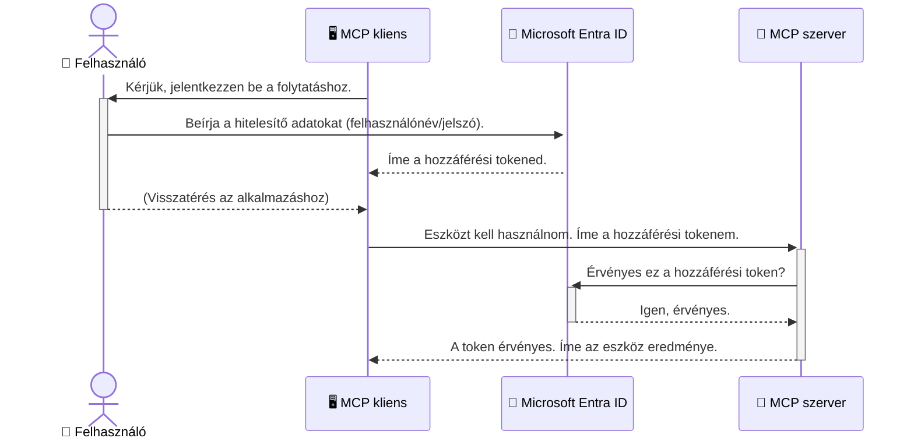

# AI Munkafolyamatok Biztonságának Megerősítése: Entra ID Hitelesítés a Model Context Protocol Szerverekhez

> [!NOTE]
> A távoli szerverkód ebben a leckében védi a régi `/sse` és `/message`
> végpontokat, valamint az MCP `2025-11-25` verziót célozza. Tartsa meg annak
> hitelesítési azonosító- és tokenellenőrzési gyakorlatát, de az új
> implementációkhoz használjon `2026-07-28`-kompatibilis Streamable HTTP transportot.

## Bevezetés
A Model Context Protocol (MCP) szerver biztonságossá tétele ugyanolyan fontos, mint az otthona bejárati ajtajának bezárása. Ha MCP szervere nyitva marad, eszközei és adatai jogosulatlan hozzáférésnek lehetnek kitéve, ami biztonsági résekhez vezethet. A Microsoft Entra ID egy robusztus, felhőalapú identitás- és hozzáféréskezelő megoldás, amely segít biztosítani, hogy csak az arra jogosult felhasználók és alkalmazások férjenek hozzá MCP szerveréhez. Ebben a részben megtanulja, hogyan védheti meg AI munkafolyamatait Entra ID hitelesítéssel.

## Tanulási Célok
Ennek a résznek a végére képes lesz:

- Megérteni az MCP szerverek biztonságossá tételének fontosságát.
- Elmagyarázni a Microsoft Entra ID és az OAuth 2.0 hitelesítés alapjait.
- Felismerni a nyilvános és bizalmas ügyfelek közti különbséget.
- Megvalósítani az Entra ID hitelesítést helyi (nyilvános kliens) és távoli (bizalmas kliens) MCP szerver esetekben.
- Alkalmazni a biztonsági legjobb gyakorlatokat AI munkafolyamatok fejlesztésekor.

## Biztonság és MCP

Ahogy nem hagyná nyitva az otthona bejárati ajtaját, úgy az MCP szerverét sem szabad bárki előtt nyitva hagyni. Az AI munkafolyamatok biztonságossá tétele elengedhetetlen az erős, megbízható és biztonságos alkalmazások létrehozásához. Ez a fejezet bemutatja, hogyan használhatja a Microsoft Entra ID-t MCP szerverei védelmére, biztosítva, hogy csak az arra jogosult felhasználók és alkalmazások férhessenek hozzá eszközeihez és adataihoz.

## Miért Fontos a Biztonság az MCP Szerverek Számára

Tegye fel a képzeletbeli MCP szerverén van egy eszköz, amely képes e-maileket küldeni vagy elérni egy ügyféladatbázist. Egy nem biztonságos szerver azt jelentené, hogy bárki használhatja ezt az eszközt, ami jogosulatlan adathozzáféréshez, spamekhez vagy más rosszindulatú tevékenységekhez vezethet.

A hitelesítés bevezetésével biztosítja, hogy minden kérés a szerver felé ellenőrizve legyen, igazolva a kérés indítójának felhasználói vagy alkalmazási identitását. Ez az első és legfontosabb lépés AI munkafolyamatai biztonságossá tételéhez.

## Bevezetés a Microsoft Entra ID-be

[**Microsoft Entra ID**](https://adoption.microsoft.com/microsoft-security/entra/) egy felhőalapú identitás- és hozzáféréskezelő szolgáltatás. Úgy gondolhat rá, mint az univerzális biztonsági őrre alkalmazásai számára. Kezeli a felhasználói azonosítás (hitelesítés) és a jogosultsághozatal (engedélyezés) bonyolult folyamatát.

Az Entra ID használatával képes lesz:

- Biztonságos bejelentkezést biztosítani a felhasználók számára.
- Védeni az API-kat és szolgáltatásokat.
- Központi helyről kezelni a hozzáférési szabályzatokat.

Az MCP szerverek számára az Entra ID megbízható, széles körben elfogadott megoldást kínál arra, hogy ki férhet hozzá a szerver képességeihez.

---

## A Varázslat Megértése: Hogyan Működik az Entra ID Hitelesítés

Az Entra ID nyílt szabványokat, például a **OAuth 2.0**-t használja a hitelesítés kezelésére. Bár a részletek bonyolultak lehetnek, az alapvető koncepció egyszerű, és analógiával könnyen megérthető.

### Kíméletes Bevezetés az OAuth 2.0-ba: A Parkolókulcs

Az OAuth 2.0-t úgy képzelje el, mint egy parkolószolgálatot az autójához. Amikor egy étteremhez érkezik, nem adja át a parkolósnak a főkulcsát. Ehelyett ad egy **parkolókulcsot**, amely korlátozott jogosultságokkal rendelkezik – tudja indítani az autót és bezárni az ajtókat, de nem tudja kinyitni a csomagtartót vagy az ülések alatti rekeszt.

Ebben az analógiában:

- **Ön** a **Felhasználó**.
- **Az autója** az **MCP Szerver**, az értékes eszközökkel és adatokkal.
- A **Parkolós** a **Microsoft Entra ID**.
- A **Parkolófelügyelő** az **MCP Kliens** (az alkalmazás, amely hozzáférni próbál a szerverhez).
- A **Parkolókulcs** az **Hozzáférési Token**.

A hozzáférési token egy biztonságos szöveges karakterlánc, amelyet az MCP kliens kap az Entra ID-től a bejelentkezés után. Ezután a kliens minden kéréshez bemutatja ezt a tokent az MCP szervernek. A szerver ellenőrizheti a tokent, hogy biztos legyen abban, hogy a kérés jogos és a kliens rendelkezik a szükséges jogosultságokkal, mindezt anélkül, hogy valaha is kezelnie kellene az Ön tényleges bizalmas adatait (például jelszavát).

### A Hitelesítési Folyamat

Így működik a gyakorlatban:



### A Microsoft Authentication Library (MSAL) Bemutatása

Mielőtt belemerülnénk a kódba, fontos bemutatni egy kulcsfontosságú összetevőt, amelyet a példákban látni fog: a **Microsoft Authentication Library (MSAL)**-t.

Az MSAL egy Microsoft által fejlesztett könyvtár, amely megkönnyíti a fejlesztők számára a hitelesítés kezelését. Ahelyett, hogy Önnek kellene minden bonyolult kódot megírnia a biztonsági tokenek kezelésére, a bejelentkezésekre és a munkamenetek frissítésére, az MSAL leveszi Önről ezt a terhet.

Az MSAL könyvtár használata erősen ajánlott, mert:

- **Biztonságos:** Iparági szabványokat, protokollokat és biztonsági legjobb gyakorlatokat valósít meg, csökkentve a kód sebezhetőségeit.
- **Egyszerűsíti a Fejlesztést:** Elvonja az OAuth 2.0 és OpenID Connect protokollok bonyolultságát, így csupán néhány sor kóddal erős hitelesítést adhat alkalmazásához.
- **Fenntartott:** A Microsoft aktívan karbantartja és frissíti az MSAL-t, hogy új biztonsági fenyegetések és platformváltozások esetén is megfeleljen.

Az MSAL számos nyelvet és alkalmazáskeretrendszert támogat, többek között .NET-et, JavaScript/TypeScript-et, Pythont, Javat, Gót, illetve mobileszközökön iOS-t és Androidot. Ez azt jelenti, hogy az egész technológiai környezetében ugyanazokat a hitelesítési mintákat használhatja.

További információért tekintse meg a hivatalos [MSAL áttekintő dokumentációt](https://learn.microsoft.com/entra/identity-platform/msal-overview).

---

## MCP Szerverének Biztonságossá Tétele Entra ID-vel: Lépésről Lépésre Útmutató

Most végigmegyünk azon, hogyan lehet helyi MCP szervert (amely `stdio`-n keresztül kommunikál) biztonságossá tenni Entra ID segítségével. Ez a példa egy **nyilvános klienset** használ, amely alkalmas felhasználói gépeken futó alkalmazásokhoz, például asztali szoftverhez vagy helyi fejlesztői szerverhez.

### 1. Forgatókönyv: Helyi MCP Szerver Biztonságossá Tétele (Nyilvános Klienssel)

Ebben a forgatókönyvben egy olyan helyi MCP szervert vizsgálunk, amely `stdio`-n kommunikál, és Entra ID-t használ a felhasználó hitelesítésére, mielőtt hozzáférést enged az eszközeihez. A szerver egyetlen eszközzel rendelkezik, amely lekéri a felhasználó profiladatait a Microsoft Graph API-ról.

#### 1. Alkalmazás Beállítása az Entra ID-ben

A kód írása előtt regisztrálnia kell alkalmazását a Microsoft Entra ID-ben. Ez tájékoztatja az Entrát az alkalmazásról, és engedélyt ad a hitelesítési szolgáltatás használatára.

1. Lépjen be a **[Microsoft Entra portálra](https://entra.microsoft.com/)**.
2. Menjen az **App registrations** részhez, majd kattintson az **Új regisztráció** gombra.
3. Adjon nevet az alkalmazásának (például "My Local MCP Server").
4. A **Támogatott fióktípusok** közül válassza az **Csak az ebben a szervezeti könyvtárban lévő fiókok** opciót.
5. A **Redirect URI** mezőt ebben a példában üresen hagyhatja.
6. Kattintson a **Regisztráció** gombra.

A regisztráció után jegyezze fel az **Alkalmazás (ügyfél) azonosítóját** és a **Könyvtár (bérlő) azonosítóját**. Ezekre szüksége lesz a kódjában.

#### 2. A Kód: Részletes Áttekintés

Tekintse át a hitelesítést kezelő kódrészleteket. A teljes kód elérhető az [Entra ID - Local - WAM](https://github.com/Azure-Samples/mcp-auth-servers/tree/main/src/entra-id-local-wam) mappában a [mcp-auth-servers GitHub tárházban](https://github.com/Azure-Samples/mcp-auth-servers).

**`AuthenticationService.cs`**

Ez az osztály felelős az Entra ID-vel való interakció kezeléséért.

- **`CreateAsync`**: Ez a metódus inicializálja az MSAL (Microsoft Authentication Library) `PublicClientApplication`-jét. Beállítja az alkalmazás `clientId` és `tenantId` értékeivel.
- **`WithBroker`**: Ez engedélyezi egy broker (például Windows Web Account Manager) használatát, amely biztonságosabb és zökkenőmentesebb egyszólamú bejelentkezést biztosít.
- **`AcquireTokenAsync`**: Ez a fő metódus. Először megpróbál csendesen tokenhez jutni (így a felhasználónak nem kell újra bejelentkeznie, ha már érvényes munkamenete van). Ha a csendes token megszerzése sikertelen, interaktív bejelentkezést kér.

```csharp
// Simplified for clarity
public static async Task<AuthenticationService> CreateAsync(ILogger<AuthenticationService> logger)
{
    var msalClient = PublicClientApplicationBuilder
        .Create(_clientId) // Your Application (client) ID
        .WithAuthority(AadAuthorityAudience.AzureAdMyOrg)
        .WithTenantId(_tenantId) // Your Directory (tenant) ID
        .WithBroker(new BrokerOptions(BrokerOptions.OperatingSystems.Windows))
        .Build();

    // ... cache registration ...

    return new AuthenticationService(logger, msalClient);
}

public async Task<string> AcquireTokenAsync()
{
    try
    {
        // Try silent authentication first
        var accounts = await _msalClient.GetAccountsAsync();
        var account = accounts.FirstOrDefault();

        AuthenticationResult? result = null;

        if (account != null)
        {
            result = await _msalClient.AcquireTokenSilent(_scopes, account).ExecuteAsync();
        }
        else
        {
            // If no account, or silent fails, go interactive
            result = await _msalClient.AcquireTokenInteractive(_scopes).ExecuteAsync();
        }

        return result.AccessToken;
    }
    catch (Exception ex)
    {
        _logger.LogError(ex, "An error occurred while acquiring the token.");
        throw; // Optionally rethrow the exception for higher-level handling
    }
}
```

**`Program.cs`**

Itt állítják be az MCP szervert, és integrálják a hitelesítési szolgáltatást.

- **`AddSingleton<AuthenticationService>`**: Regisztrálja az `AuthenticationService`-t a függőség-injektáló konténerben, hogy más alkalmazásrészekben (például az eszköznél) is használható legyen.
- **`GetUserDetailsFromGraph` eszköz**: Ez az eszköz igényli az `AuthenticationService` példányát. Mielőtt bármit tenne, meghívja az `authService.AcquireTokenAsync()` metódust egy érvényes hozzáférési token beszerzésére. Ha a hitelesítés sikeres, a tokennel hívja meg a Microsoft Graph API-t, hogy lekérje a felhasználó adatait.

```csharp
// Simplified for clarity
[McpServerTool(Name = "GetUserDetailsFromGraph")]
public static async Task<string> GetUserDetailsFromGraph(
    AuthenticationService authService)
{
    try
    {
        // This will trigger the authentication flow
        var accessToken = await authService.AcquireTokenAsync();

        // Use the token to create a GraphServiceClient
        var graphClient = new GraphServiceClient(
            new BaseBearerTokenAuthenticationProvider(new TokenProvider(authService)));

        var user = await graphClient.Me.GetAsync();

        return System.Text.Json.JsonSerializer.Serialize(user);
    }
    catch (Exception ex)
    {
        return $"Error: {ex.Message}";
    }
}
```

#### 3. Hogyan Működik Együtt Minden

1. Amikor az MCP kliens megpróbálja használni a `GetUserDetailsFromGraph` eszközt, az először az `AcquireTokenAsync`-t hívja meg.
2. Az `AcquireTokenAsync` aktiválja az MSAL könyvtárat, hogy érvényes tokent keressen.
3. Ha nincs található token, az MSAL a broker-en keresztül az Entra ID bejelentkező oldalára irányítja felhasználót.
4. A bejelentkezés után az Entra ID kiállítja a hozzáférési tokent.
5. Az eszköz megkapja a tokent, amelyet használva biztonságos hívást tesz a Microsoft Graph API-hoz.
6. A felhasználó adatai visszakerülnek az MCP klienshez.

Ez a folyamat biztosítja, hogy csak hitelesített felhasználók használhatják az eszközt, hatékonyan védve helyi MCP szerverét.

### 2. Forgatókönyv: Távoli MCP Szerver Biztonságossá Tétele (Bizalmas Klienssel)

Amikor az MCP szervere egy távoli gépen fut (például egy felhőszerveren), és olyan protokollon kommunikál, mint az HTTP Streaming, a biztonsági követelmények eltérőek. Ilyenkor **bizalmas klienset** és **Engedélyezési kód folyamatot** (Authorization Code Flow) kell használni. Ez biztonságosabb módszer, mert az alkalmazás titkai soha nem kerülnek nyilvánosságra a böngészőben.

Ez a példa egy TypeScript alapú MCP szervert mutat be, amely az Express.js-t használja HTTP kérések kezeléséhez.

#### 1. Alkalmazás Beállítása az Entra ID-ben

Az Entra ID-ben a beállítás hasonló a nyilvános klienshez, de egy kulcsfontosságú különbséggel: létre kell hozni egy **ügyfél titkot** (client secret).

1. Lépjen be a **[Microsoft Entra portálra](https://entra.microsoft.com/)**.
2. Az alkalmazás regisztrációjánál menjen a **Certificates & secrets** fülre.
3. Kattintson az **Új ügyfél titok** gombra, adjon neki leírást, majd kattintson a **Hozzáadás** gombra.
4. **Fontos:** Azonnal másolja ki a titok értékét. Többé nem fogja látni.
5. Konfigurálnia kell egy **Redirect URI**-t is. Menjen az **Authentication** fülre, kattintson a **Platform hozzáadása** gombra, válassza a **Web** opciót, és adja meg az alkalmazásának átirányítási URI-ját (pl. `http://localhost:3001/auth/callback`).

> **⚠️ Fontos Biztonsági Megjegyzés:** Termelési környezetben a Microsoft erősen ajánlja a **titok nélküli hitelesítési** módszerek, például a **Managed Identity** vagy a **Workload Identity Federation** használatát ügyfél titkok helyett. Az ügyfél titkok biztonsági kockázatot jelentenek, mert kiszivároghatnak vagy kompromittálódhatnak. A kezelt identitások biztonságosabb megközelítést kínálnak azáltal, hogy nincs szükség hitelesítő adatok tárolására a kódban vagy konfigurációban.
>
> További információkért a kezelt identitásokról és azok bevezetéséről tekintse meg a [Azure erőforrásokhoz tartozó kezelt identitások áttekintése](https://learn.microsoft.com/entra/identity/managed-identities-azure-resources/overview) dokumentációt.

#### 2. A Kód: Részletes Áttekintés

Ez a példa munkamenet-alapú megközelítést használ. Amikor a felhasználó hitelesít, a szerver eltárolja a hozzáférési és a frissítő tokent egy munkamenetben, és ad a felhasználónak egy munkamenet tokent. Ezt a munkamenet tokent használják a későbbi kérések. A teljes kód elérhető az [Entra ID - Bizalmas kliens](https://github.com/Azure-Samples/mcp-auth-servers/tree/main/src/entra-id-cca-session) mappában a [mcp-auth-servers GitHub tárházban](https://github.com/Azure-Samples/mcp-auth-servers).

**`Server.ts`**

Ez a fájl állítja be az Express szervert és az MCP transport réteget.

- **`requireBearerAuth`**: Ez egy köztes réteg (middleware), amely védi a `/sse` és `/message` végpontokat. Érvényes "bearer" tokent keres a kérés `Authorization` fejlécében.
- **`EntraIdServerAuthProvider`**: Egy egyedi osztály, amely megvalósítja a `McpServerAuthorizationProvider` interfészt. Az OAuth 2.0 folyamat kezeléséért felel.
- **`/auth/callback`**: Ez a végpont kezeli az Entra ID-ből érkező átirányítást a felhasználó hitelesítése után. Az engedélyezési kódot cseréli hozzáférési és frissítő tokenre.

```typescript
// Egyszerűsítve a világosság kedvéért
const app = express();
const { server } = createServer();
const provider = new EntraIdServerAuthProvider();

// Védje az SSE végpontot
app.get("/sse", requireBearerAuth({
  provider,
  requiredScopes: ["User.Read"]
}), async (req, res) => {
  // ... csatlakozás a szállításhoz ...
});

// Védje az üzenet végpontot
app.post("/message", requireBearerAuth({
  provider,
  requiredScopes: ["User.Read"]
}), async (req, res) => {
  // ... kezelje az üzenetet ...
});

// Kezelje az OAuth 2.0 visszahívást
app.get("/auth/callback", (req, res) => {
  provider.handleCallback(req.query.code, req.query.state)
    .then(result => {
      // ... kezelje a sikert vagy kudarcot ...
    });
});
```

**`Tools.ts`**

Ez a fájl definiálja az MCP szerver által nyújtott eszközöket. A `getUserDetails` eszköz hasonló az előző példában bemutatotthoz, de a hozzáférési tokent a munkamenetből szerzi be.

```typescript
// Egyszerűsítve az érthetőség kedvéért
server.setRequestHandler(CallToolRequestSchema, async (request) => {
  const { name } = request.params;
  const context = request.params?.context as { token?: string } | undefined;
  const sessionToken = context?.token;

  if (name === ToolName.GET_USER_DETAILS) {
    if (!sessionToken) {
      throw new AuthenticationError("Authentication token is missing or invalid. Ensure the token is provided in the request context.");
    }

    // Szerezze be az Entra azonosító tokent a munkamenet tárolóból
    const tokenData = tokenStore.getToken(sessionToken);
    const entraIdToken = tokenData.accessToken;

    const graphClient = Client.init({
      authProvider: (done) => {
        done(null, entraIdToken);
      }
    });

    const user = await graphClient.api('/me').get();

    // ... visszaadja a felhasználói adatokat ...
  }
});
```

**`auth/EntraIdServerAuthProvider.ts`**

Ez az osztály kezeli:

- A felhasználó átirányítását az Entra ID bejelentkező oldalára.
- Az engedélyezési kód cseréjét hozzáférési tokenre.
- A tokenek tárolását a `tokenStore`-ban.
- A hozzáférési token frissítését lejáratkor.


#### 3. Hogyan működik ez az egész együtt

1. Amikor egy felhasználó először próbál csatlakozni az MCP szerverhez, a `requireBearerAuth` middleware észleli, hogy nincs érvényes munkamenete, és átirányítja őt az Entra ID bejelentkezési oldalára.
2. A felhasználó bejelentkezik az Entra ID fiókjával.
3. Az Entra ID visszairányítja a felhasználót az `/auth/callback` végpontra egy engedélyezési kóddal.
4. A szerver kicseréli a kódot egy hozzáférési tokenre és egy frissítő tokenre, eltárolja őket, és létrehoz egy munkamenet tokent, amelyet elküld az ügyfélnek.
5. Az ügyfél most már használhatja ezt a munkamenet tokent az `Authorization` fejlécben minden további kérése során az MCP szerverhez.
6. Amikor a `getUserDetails` eszközt meghívják, az a munkamenet tokent használja az Entra ID hozzáférési token lekéréséhez, majd azt használja a Microsoft Graph API hívásához.

Ez a folyamat összetettebb, mint a nyilvános kliens folyamata, de szükséges az internet felé nyíló végpontokhoz. Mivel a távoli MCP szerverek elérhetőek a nyilvános interneten keresztül, erősebb biztonsági intézkedésekre van szükségük az illetéktelen hozzáférés és a lehetséges támadások ellen.


## Biztonsági legjobb gyakorlatok

- **Mindig használj HTTPS-t**: Titkosítsd a kommunikációt az ügyfél és a szerver között, hogy megvédd a tokeneket az elfogástól.
- **Implementálj szerepalapú hozzáférés-vezérlést (RBAC)**: Ne csak ellenőrizd, *ha* a felhasználó hitelesített; ellenőrizd, *mit* jogosult tenni. Meghatározhatod a szerepeket az Entra ID-ben, és ellenőrizheted őket az MCP szerveredben.
- **Figyelj és auditálj**: Naplózd az összes hitelesítési eseményt, hogy észlelni és reagálni tudj gyanús tevékenységekre.
- **Kezeld a sebességkorlátozást és a kéréskorlátozást**: A Microsoft Graph és más API-k sebességkorlátozást alkalmaznak az visszaélések megakadályozására. Implementálj exponenciális visszavonást és újrapróbálkozási logikát az MCP szerveredben az HTTP 429 (Túl sok kérés) válaszok szép kezelésére. Fontold meg a gyakran elérhető adatok gyorsítótárazását az API hívások csökkentése érdekében.
- **Biztonságos token tárolás**: Tárold biztonságosan a hozzáférési és frissítő tokeneket. Helyi alkalmazásoknál használd a rendszer biztonságos tároló mechanizmusait. Szerveralkalmazásoknál fontolj meg titkosított tárolást vagy biztonságos kulcskezelő szolgáltatásokat, például az Azure Key Vault-ot.
- **A token lejáratkezelése**: A hozzáférési tokeneknek korlátozott élettartamuk van. Implementálj automatikus token frissítést frissítő tokenek használatával a zökkenőmentes felhasználói élmény fenntartásához újra-hitelesítés nélkül.
- **Fontold meg az Azure API Management használatát**: Bár a biztonság közvetlen implementálása az MCP szerveredben finomhangolt irányítást biztosít, az API átjárók, mint az Azure API Management automatikusan kezelhetik ezeknek a biztonsági kérdéseknek sok aspektusát, beleértve a hitelesítést, engedélyezést, sebességkorlátozást és figyelést. Egy központosított biztonsági réteget biztosítanak, amely az ügyfeleid és az MCP szervereid között helyezkedik el. További részletek az API átjárók használatáról MCP-vel az [Azure API Management Your Auth Gateway For MCP Servers](https://techcommunity.microsoft.com/blog/integrationsonazureblog/azure-api-management-your-auth-gateway-for-mcp-servers/4402690) linken.


## Főbb tanulságok

- Az MCP szervered biztonságosítása kulcsfontosságú az adatok és eszközök védelméhez.
- A Microsoft Entra ID robusztus és skálázható megoldást kínál a hitelesítéshez és engedélyezéshez.
- Használj **nyilvános klienst** helyi alkalmazásokhoz és **titkosított klienst** távoli szerverekhez.
- Az **Authorization Code Flow** a legbiztonságosabb opció webalkalmazások számára.


## Gyakorlat

1. Gondolkodj el egy MCP szerveren, amit építhetnél. Az helyi vagy távoli szerver lenne?
2. A válaszod alapján nyilvános vagy titkosított klienst használnál?
3. Milyen jogosultságot kérne az MCP szervered a Microsoft Graph ellen végzett műveletekhez?


## Gyakorlati feladatok

### 1. gyakorlat: Regisztrálj egy alkalmazást az Entra ID-ben
Navigálj a Microsoft Entra portálra.
Regisztrálj egy új alkalmazást az MCP szervered számára.
Jegyezd fel az Alkalmazás (kliens) azonosítóját és a Könyvtár (bérlő) azonosítót.

### 2. gyakorlat: Biztosíts egy helyi MCP szervert (Nyilvános kliens)
- Kövesd a kódpéldát a MSAL (Microsoft Authentication Library) felhasználói hitelesítés integrálásához.
- Teszteld a hitelesítési folyamatot az MCP eszköz meghívásával, amely lekéri a felhasználói adatokat a Microsoft Graphból.

### 3. gyakorlat: Biztosíts egy távoli MCP szervert (Titkos kliens)
- Regisztrálj egy titkos klienset az Entra ID-ben és hozz létre egy kliens titkot.
- Állítsd be az Express.js MCP szerveredet az Authorization Code Flow használatára.
- Teszteld a védett végpontokat, és erősítsd meg a token alapú hozzáférést.

### 4. gyakorlat: Alkalmazd a biztonsági legjobb gyakorlatokat
- Engedélyezd a HTTPS-t a helyi vagy távoli szervereden.
- Valósítsd meg a szerepalapú hozzáférés-vezérlést (RBAC) a szerver logikádban.
- Adj hozzá token lejáratkezelést és biztonságos token tárolást.

## Erőforrások

1. **MSAL áttekintő dokumentáció**  
   Ismerd meg, hogyan teszi lehetővé a Microsoft Authentication Library (MSAL) a biztonságos token beszerzést több platformon:  
   [MSAL áttekintő a Microsoft Learn oldalán](https://learn.microsoft.com/en-gb/entra/msal/overview)

2. **Azure-Samples/mcp-auth-servers GitHub tárház**  
   Példamegoldások MCP szerverekhez, amelyek hitelesítési folyamatokat demonstrálnak:  
   [Azure-Samples/mcp-auth-servers a GitHubon](https://github.com/Azure-Samples/mcp-auth-servers)

3. **Managed Identities for Azure Resources áttekintés**  
   Értsd meg, hogyan szüntetheted meg a titkok használatát rendszer- vagy felhasználó által hozzárendelt felügyelt identitásokkal:  
   [Managed Identities áttekintő a Microsoft Learn oldalán](https://learn.microsoft.com/en-us/entra/identity/managed-identities-azure-resources/)

4. **Azure API Management: Az Auth átjáród MCP szerverekhez**  
   Mélyebb betekintés az APIM biztonságos OAuth2 átjáróként való használatába MCP szerverekhez:  
   [Azure API Management Az Auth átjáród MCP szerverekhez](https://techcommunity.microsoft.com/blog/integrationsonazureblog/azure-api-management-your-auth-gateway-for-mcp-servers/4402690)

5. **Microsoft Graph jogosultságok referencia**  
   Teljes körű lista a delegált és alkalmazási jogosultságokról a Microsoft Graphhoz:  
   [Microsoft Graph jogosultságok referencia](https://learn.microsoft.com/zh-tw/graph/permissions-reference)


## Tanulási eredmények
Ennek a szakasznak a végére képes leszel:

- Megfogalmazni, hogy miért kritikus a hitelesítés az MCP szerverek és AI munkafolyamatok számára.
- Beállítani és konfigurálni az Entra ID hitelesítést mind helyi, mind távoli MCP szerver forgatókönyvekhez.
- Megfelelő kliens típust választani (nyilvános vagy titkosított) a szervered telepítése alapján.
- Biztonságos kódolási gyakorlatokat alkalmazni, beleértve a token tárolást és szerepalapú engedélyezést.
- Magabiztosan védeni az MCP szerveredet és eszközeit az illetéktelen hozzáféréssel szemben.

## Mi következik

- [5.13 Model Context Protocol (MCP) integráció a Microsoft Foundry-val](../mcp-foundry-agent-integration/README.md)

---

<!-- CO-OP TRANSLATOR DISCLAIMER START -->
**Jogi nyilatkozat**:
Ez a dokumentum az AI fordítási szolgáltatás, a [Co-op Translator](https://github.com/Azure/co-op-translator) segítségével készült. Bár az pontosságra törekszünk, kérjük, vegye figyelembe, hogy az automatikus fordítások hibákat vagy pontatlanságokat tartalmazhatnak. Az eredeti dokumentum az anyanyelvén tekintendő hiteles forrásnak. Fontos információk esetén professzionális emberi fordítást javasolunk. Nem vállalunk felelősséget semmilyen félreértésért vagy téves értelmezésért, amely ebből a fordításból ered.
<!-- CO-OP TRANSLATOR DISCLAIMER END -->