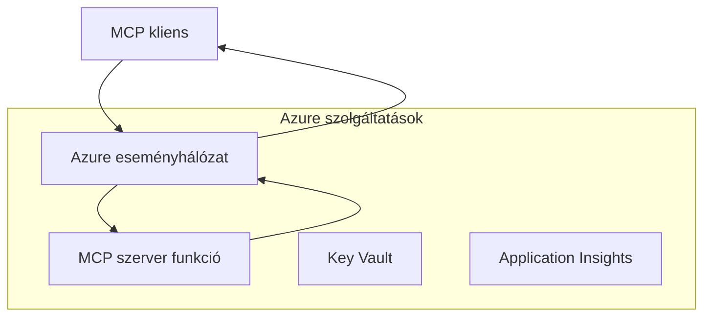
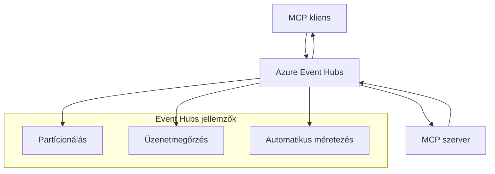

# MCP Egyedi Átvitelek - Haladó Megvalósítási Útmutató

A Model Context Protocol (MCP) lehetővé teszi egyedi átvitelű megvalósításokat
speciális környezetekhez. Ez a haladó útmutató az Azure Event Grid és
Azure Event Hubs architektúra mintáit vizsgálja. Ezek nem szabványos MCP átvitelek,
és szükséges, hogy mindkét végpont megegyezzen az egyedi leképezésben.

> **MCP `2026-07-28` hatóköre:** a jelenlegi protokoll nem rendelkezik protokoll szintű
> munkamenetekkel, így az egyedi átvitelek nem támaszkodhatnak munkamenet affinitásra vagy
> munkameneten belüli sorrendre. A `Mcp-Method` és a feltételes `Mcp-Name` fejlécek
> a szabványos Streamable HTTP átvitel követelményei; egy nem-HTTP átvitelhez
> egy ekvivalens, explicit megegyezett leképezés szükséges, ha a közvetítőknek
> dekódolás nélkül kell irányítaniuk a JSON-RPC testet. Lásd a
> [Mi változott az MCP-ben: A 2026-07-28 specifikáció](../../01-CoreConcepts/mcp-2026-07-28.md).

## Bevezetés

Az MCP szabványos átvitelei a stdio és a Streamable HTTP. Néhány vállalati
környezet egyedi leképezést használ meglévő üzenetküldő infrastruktúrájával való integrációhoz,
de ezen eljárás csökkentheti az MCP hosztokkal és
SDK-kkal való interoperabilitást, amelyek csak a szabványos átviteleket valósítják meg.

Ez a lecke az MCP Specifikáció `2026-07-28` állapotmentes követelményeit alkalmazza
az Azure üzenetküldő szolgáltatásokra és a bevett vállalati integrációs
mintákra.

### **MCP Átviteli Architektúra**

**Az MCP Specifikáció `2026-07-28` szerint:**

- **Szabványos Átvitelek**: stdio és Streamable HTTP
- **Egyedi Átvitelek**: Opcionális, megvalósítás-specifikus leképezések, melyekben
mindkét végpont megegyezik
- **Üzenetformátum**: JSON-RPC 2.0 MCP-specifikus bővítésekkel
- **Önálló Kérések**: Nincs elérhető protokoll munkamenet vagy kézfogás
a kérések közötti állapot hordozására

## Tanulási Célok

A haladó lecke végére képes leszel:

- **Megérteni az Egyedi Átvitel Követelményeket**: Az MCP protokollt bármely átvitel felett megvalósítani, miközben megfelelsz
- **Azure Event Grid Átvitel Építése**: Eseményvezérelt MCP szervereket létrehozni Azure Event Grid-del a szerver nélküli skálázhatóságért
- **Azure Event Hubs Átvitel Megvalósítása**: Nagy áteresztőképességű MCP megoldásokat tervezni Azure Event Hubs használatával valós idejű adatfolyamokhoz
- **Vállalati Minták Alkalmazása**: Egyedi átvitelek integrálása meglévő Azure infrastruktúrával és biztonsági modellekkel
- **Átvitel Megbízhatóság Kezelése**: Üzenet megőrzés, sorrendiség és hibakezelés megvalósítása vállalati forgatókönyvekhez
- **Teljesítmény Optimalizálás**: Átviteli megoldások tervezése skálázhatóság, késleltetés és áteresztőképesség követelményekhez

## **Átviteli Követelmények**

### **Alapvető Követelmények az MCP `2026-07-28` szerint**

```yaml
Message Protocol:
  format: "JSON-RPC 2.0 with MCP extensions"
    correlation: "Match responses to requests by JSON-RPC id"
    state: "Each request must be self-contained"
  
Transport Layer:
  reliability: "Transport MUST handle connection failures gracefully"
  security: "Transport MUST support secure communication"
    identification: "Carry protocol version, capabilities, and identity per request"
  
Custom Transport:
    compliance: "Map the selected MCP revision without adding session assumptions"
  extensibility: "MAY add transport-specific features"
    interoperability: "Both endpoints MUST agree on the custom mapping"
```

## **Azure Event Grid Átviteli Megvalósítás**

Az Azure Event Grid egy szerver nélküli eseményirányító szolgáltatás, ideális eseményvezérelt MCP architektúrákhoz. Ez a megvalósítás bemutatja, hogyan lehet skálázható, lazán csatolt MCP rendszereket építeni.

### **Architektúra Áttekintés**



### **C# Megvalósítás - Event Grid Átviteli**

```csharp
using Azure.Messaging.EventGrid;
using Microsoft.Extensions.Azure;
using System.Text.Json;

public class EventGridMcpTransport : IMcpTransport
{
    private readonly EventGridPublisherClient _publisher;
    private readonly string _topicEndpoint;
    private readonly string _clientId;
    
    public EventGridMcpTransport(string topicEndpoint, string accessKey, string clientId)
    {
        _publisher = new EventGridPublisherClient(
            new Uri(topicEndpoint), 
            new AzureKeyCredential(accessKey));
        _topicEndpoint = topicEndpoint;
        _clientId = clientId;
    }
    
    public async Task SendMessageAsync(McpMessage message)
    {
        var eventGridEvent = new EventGridEvent(
            subject: $"mcp/{_clientId}",
            eventType: "MCP.MessageReceived",
            dataVersion: "1.0",
            data: JsonSerializer.Serialize(message))
        {
            Id = Guid.NewGuid().ToString(),
            EventTime = DateTimeOffset.UtcNow
        };
        
        await _publisher.SendEventAsync(eventGridEvent);
    }
    
    public async Task<McpMessage> ReceiveMessageAsync(CancellationToken cancellationToken)
    {
        // Event Grid is push-based, so implement webhook receiver
        // This would typically be handled by Azure Functions trigger
        throw new NotImplementedException("Use EventGridTrigger in Azure Functions");
    }
}

// Azure Function for receiving Event Grid events
[FunctionName("McpEventGridReceiver")]
public async Task<IActionResult> HandleEventGridMessage(
    [EventGridTrigger] EventGridEvent eventGridEvent,
    ILogger log)
{
    try
    {
        var mcpMessage = JsonSerializer.Deserialize<McpMessage>(
            eventGridEvent.Data.ToString());
        
        // Process MCP message
        var response = await _mcpServer.ProcessMessageAsync(mcpMessage);
        
        // Send response back via Event Grid
        await _transport.SendMessageAsync(response);
        
        return new OkResult();
    }
    catch (Exception ex)
    {
        log.LogError(ex, "Error processing Event Grid MCP message");
        return new BadRequestResult();
    }
}
```

### **TypeScript Megvalósítás - Event Grid Átviteli**

```typescript
import { EventGridPublisherClient, AzureKeyCredential } from "@azure/eventgrid";
import { McpTransport, McpMessage } from "./mcp-types";

export class EventGridMcpTransport implements McpTransport {
    private publisher: EventGridPublisherClient;
    private clientId: string;
    
    constructor(
        private topicEndpoint: string,
        private accessKey: string,
        clientId: string
    ) {
        this.publisher = new EventGridPublisherClient(
            topicEndpoint,
            new AzureKeyCredential(accessKey)
        );
        this.clientId = clientId;
    }
    
    async sendMessage(message: McpMessage): Promise<void> {
        const event = {
            id: crypto.randomUUID(),
            source: `mcp-client-${this.clientId}`,
            type: "MCP.MessageReceived",
            time: new Date(),
            data: message
        };
        
        await this.publisher.sendEvents([event]);
    }
    
    // Esemény-vezérelt fogadás Azure Functions segítségével
    onMessage(handler: (message: McpMessage) => Promise<void>): void {
        // A megvalósítás Azure Functions Event Grid trigger használatával történik
        // Ez egy elvi felület a webhook fogadó számára
    }
}

// Azure Functions megvalósítás
import { app, InvocationContext, EventGridEvent } from "@azure/functions";

app.eventGrid("mcpEventGridHandler", {
    handler: async (event: EventGridEvent, context: InvocationContext) => {
        try {
            const mcpMessage = event.data as McpMessage;
            
            // MCP üzenet feldolgozása
            const response = await mcpServer.processMessage(mcpMessage);
            
            // Válasz küldése Event Grid-en keresztül
            await transport.sendMessage(response);
            
        } catch (error) {
            context.error("Error processing MCP message:", error);
            throw error;
        }
    }
});
```

### **Python Megvalósítás - Event Grid Átviteli**

```python
from azure.eventgrid import EventGridPublisherClient, EventGridEvent
from azure.core.credentials import AzureKeyCredential
import asyncio
import json
from typing import Callable, Optional
import uuid
from datetime import datetime

class EventGridMcpTransport:
    def __init__(self, topic_endpoint: str, access_key: str, client_id: str):
        self.client = EventGridPublisherClient(
            topic_endpoint, 
            AzureKeyCredential(access_key)
        )
        self.client_id = client_id
        self.message_handler: Optional[Callable] = None
    
    async def send_message(self, message: dict) -> None:
        """Send MCP message via Event Grid"""
        event = EventGridEvent(
            data=message,
            subject=f"mcp/{self.client_id}",
            event_type="MCP.MessageReceived",
            data_version="1.0"
        )
        
        await self.client.send(event)
    
    def on_message(self, handler: Callable[[dict], None]) -> None:
        """Register message handler for incoming events"""
        self.message_handler = handler

# Azure Functions megvalósítás
import azure.functions as func
import logging

def main(event: func.EventGridEvent) -> None:
    """Azure Functions Event Grid trigger for MCP messages"""
    try:
        # MCP üzenet elemzése az Event Grid eseményből
        mcp_message = json.loads(event.get_body().decode('utf-8'))
        
        # MCP üzenet feldolgozása
        response = process_mcp_message(mcp_message)
        
        # Válasz küldése vissza az Event Grid-en keresztül
        # (A megvalósítás új Event Grid kliens létrehozását jelentené)
        
    except Exception as e:
        logging.error(f"Error processing MCP Event Grid message: {e}")
        raise
```

## **Azure Event Hubs Átviteli Megvalósítás**

Az Azure Event Hubs magas áteresztőképességű, valós idejű adatfolyam képességeket nyújt MCP forgatókönyvekhez, amelyek alacsony késleltetést és nagy üzenetforgalmat igényelnek.

### **Architektúra Áttekintés**



### **C# Megvalósítás - Event Hubs Átviteli**

```csharp
using Azure.Messaging.EventHubs;
using Azure.Messaging.EventHubs.Producer;
using Azure.Messaging.EventHubs.Consumer;
using System.Text;

public class EventHubsMcpTransport : IMcpTransport, IDisposable
{
    private readonly EventHubProducerClient _producer;
    private readonly EventHubConsumerClient _consumer;
    private readonly string _consumerGroup;
    private readonly CancellationTokenSource _cancellationTokenSource;
    
    public EventHubsMcpTransport(
        string connectionString, 
        string eventHubName,
        string consumerGroup = "$Default")
    {
        _producer = new EventHubProducerClient(connectionString, eventHubName);
        _consumer = new EventHubConsumerClient(
            consumerGroup, 
            connectionString, 
            eventHubName);
        _consumerGroup = consumerGroup;
        _cancellationTokenSource = new CancellationTokenSource();
    }
    
    public async Task SendMessageAsync(McpMessage message)
    {
        var messageBody = JsonSerializer.Serialize(message);
        var eventData = new EventData(Encoding.UTF8.GetBytes(messageBody));
        
        // Add MCP-specific properties
        eventData.Properties.Add("MessageType", message.Method ?? "response");
        eventData.Properties.Add("MessageId", message.Id);
        eventData.Properties.Add("Timestamp", DateTimeOffset.UtcNow);
        
        await _producer.SendAsync(new[] { eventData });
    }
    
    public async Task StartReceivingAsync(
        Func<McpMessage, Task> messageHandler)
    {
        await foreach (PartitionEvent partitionEvent in _consumer.ReadEventsAsync(
            _cancellationTokenSource.Token))
        {
            try
            {
                var messageBody = Encoding.UTF8.GetString(
                    partitionEvent.Data.EventBody.ToArray());
                var mcpMessage = JsonSerializer.Deserialize<McpMessage>(messageBody);
                
                await messageHandler(mcpMessage);
            }
            catch (Exception ex)
            {
                // Handle deserialization or processing errors
                Console.WriteLine($"Error processing message: {ex.Message}");
            }
        }
    }
    
    public void Dispose()
    {
        _cancellationTokenSource?.Cancel();
        _producer?.DisposeAsync().AsTask().Wait();
        _consumer?.DisposeAsync().AsTask().Wait();
        _cancellationTokenSource?.Dispose();
    }
}
```

### **TypeScript Megvalósítás - Event Hubs Átviteli**

```typescript
import { 
    EventHubProducerClient, 
    EventHubConsumerClient, 
    EventData 
} from "@azure/event-hubs";

export class EventHubsMcpTransport implements McpTransport {
    private producer: EventHubProducerClient;
    private consumer: EventHubConsumerClient;
    private isReceiving = false;
    
    constructor(
        private connectionString: string,
        private eventHubName: string,
        private consumerGroup: string = "$Default"
    ) {
        this.producer = new EventHubProducerClient(
            connectionString, 
            eventHubName
        );
        this.consumer = new EventHubConsumerClient(
            consumerGroup,
            connectionString,
            eventHubName
        );
    }
    
    async sendMessage(message: McpMessage): Promise<void> {
        const eventData: EventData = {
            body: JSON.stringify(message),
            properties: {
                messageType: message.method || "response",
                messageId: message.id,
                timestamp: new Date().toISOString()
            }
        };
        
        await this.producer.sendBatch([eventData]);
    }
    
    async startReceiving(
        messageHandler: (message: McpMessage) => Promise<void>
    ): Promise<void> {
        if (this.isReceiving) return;
        
        this.isReceiving = true;
        
        const subscription = this.consumer.subscribe({
            processEvents: async (events, context) => {
                for (const event of events) {
                    try {
                        const messageBody = event.body as string;
                        const mcpMessage: McpMessage = JSON.parse(messageBody);
                        
                        await messageHandler(mcpMessage);
                        
                        // Ellenőrzési pont frissítése legalább egyszeri kézbesítéshez
                        await context.updateCheckpoint(event);
                    } catch (error) {
                        console.error("Error processing Event Hubs message:", error);
                    }
                }
            },
            processError: async (err, context) => {
                console.error("Event Hubs error:", err);
            }
        });
    }
    
    async close(): Promise<void> {
        this.isReceiving = false;
        await this.producer.close();
        await this.consumer.close();
    }
}
```

### **Python Megvalósítás - Event Hubs Átviteli**

```python
from azure.eventhub import EventHubProducerClient, EventHubConsumerClient
from azure.eventhub import EventData
import json
import asyncio
from typing import Callable, Dict, Any
import logging

class EventHubsMcpTransport:
    def __init__(
        self, 
        connection_string: str, 
        eventhub_name: str,
        consumer_group: str = "$Default"
    ):
        self.producer = EventHubProducerClient.from_connection_string(
            connection_string, 
            eventhub_name=eventhub_name
        )
        self.consumer = EventHubConsumerClient.from_connection_string(
            connection_string,
            consumer_group=consumer_group,
            eventhub_name=eventhub_name
        )
        self.is_receiving = False
    
    async def send_message(self, message: Dict[str, Any]) -> None:
        """Send MCP message via Event Hubs"""
        event_data = EventData(json.dumps(message))
        
        # MCP-specifikus tulajdonságok hozzáadása
        event_data.properties = {
            "messageType": message.get("method", "response"),
            "messageId": message.get("id"),
            "timestamp": "2025-01-14T10:30:00Z"  # Aktuális időbélyeg használata
        }
        
        async with self.producer:
            event_data_batch = await self.producer.create_batch()
            event_data_batch.add(event_data)
            await self.producer.send_batch(event_data_batch)
    
    async def start_receiving(
        self, 
        message_handler: Callable[[Dict[str, Any]], None]
    ) -> None:
        """Start receiving MCP messages from Event Hubs"""
        if self.is_receiving:
            return
        
        self.is_receiving = True
        
        async with self.consumer:
            await self.consumer.receive(
                on_event=self._on_event_received(message_handler),
                starting_position="-1"  # Kezdés az elejétől
            )
    
    def _on_event_received(self, handler: Callable):
        """Internal event handler wrapper"""
        async def handle_event(partition_context, event):
            try:
                # MCP üzenet elemzése az Event Hubs eseményből
                message_body = event.body_as_str(encoding='UTF-8')
                mcp_message = json.loads(message_body)
                
                # MCP üzenet feldolgozása
                await handler(mcp_message)
                
                # Ellenőrzőpont frissítése legalább egyszeri kézbesítéshez
                await partition_context.update_checkpoint(event)
                
            except Exception as e:
                logging.error(f"Error processing Event Hubs message: {e}")
        
        return handle_event
    
    async def close(self) -> None:
        """Clean up transport resources"""
        self.is_receiving = False
        await self.producer.close()
        await self.consumer.close()
```

## **Haladó Átviteli Minták**

### **Üzenet Megmaradás és Megbízhatóság**

```csharp
// Implementing message durability with retry logic
public class ReliableTransportWrapper : IMcpTransport
{
    private readonly IMcpTransport _innerTransport;
    private readonly RetryPolicy _retryPolicy;
    
    public async Task SendMessageAsync(McpMessage message)
    {
        await _retryPolicy.ExecuteAsync(async () =>
        {
            try
            {
                await _innerTransport.SendMessageAsync(message);
            }
            catch (TransportException ex) when (ex.IsRetryable)
            {
                // Log and retry
                throw;
            }
        });
    }
}
```

### **Átviteli Biztonsági Integráció**

```csharp
// Integrating Azure Key Vault for transport security
public class SecureTransportFactory
{
    private readonly SecretClient _keyVaultClient;
    
    public async Task<IMcpTransport> CreateEventGridTransportAsync()
    {
        var accessKey = await _keyVaultClient.GetSecretAsync("EventGridAccessKey");
        var topicEndpoint = await _keyVaultClient.GetSecretAsync("EventGridTopic");
        
        return new EventGridMcpTransport(
            topicEndpoint.Value.Value,
            accessKey.Value.Value,
            Environment.MachineName
        );
    }
}
```

### **Átviteli Monitorozás és Megfigyelhetőség**

```csharp
// Adding telemetry to custom transports
public class ObservableTransport : IMcpTransport
{
    private readonly IMcpTransport _transport;
    private readonly ILogger _logger;
    private readonly TelemetryClient _telemetryClient;
    
    public async Task SendMessageAsync(McpMessage message)
    {
        using var activity = Activity.StartActivity("MCP.Transport.Send");
        activity?.SetTag("transport.type", "EventGrid");
        activity?.SetTag("message.method", message.Method);
        
        var stopwatch = Stopwatch.StartNew();
        
        try
        {
            await _transport.SendMessageAsync(message);
            
            _telemetryClient.TrackDependency(
                "EventGrid",
                "SendMessage",
                DateTime.UtcNow.Subtract(stopwatch.Elapsed),
                stopwatch.Elapsed,
                true
            );
        }
        catch (Exception ex)
        {
            _telemetryClient.TrackException(ex);
            throw;
        }
    }
}
```

## **Vállalati Integrációs Forgatókönyvek**

### **Forgatókönyv 1: Elosztott MCP Feldolgozás**

Az Azure Event Grid használata az MCP kérések több feldolgozó csomópont közötti elosztására:

```yaml
Architecture:
  - MCP Client sends requests to Event Grid topic
  - Multiple Azure Functions subscribe to process different tool types
  - Results aggregated and returned via separate response topic
  
Benefits:
  - Horizontal scaling based on message volume
  - Fault tolerance through redundant processors
  - Cost optimization with serverless compute
```

### **Forgatókönyv 2: Valós idejű MCP Adatfolyam**

Az Azure Event Hubs használata magas gyakoriságú MCP interakciókhoz:

```yaml
Architecture:
  - MCP Client streams continuous requests via Event Hubs
  - Stream Analytics processes and routes messages
  - Multiple consumers handle different aspect of processing
  
Benefits:
  - Low latency for real-time scenarios
  - High throughput for batch processing
  - Built-in partitioning for parallel processing
```

### **Forgatókönyv 3: Hibrid Átviteli Architektúra**

Több átvitel kombinálása különböző esetekhez:

```csharp
public class HybridMcpTransport : IMcpTransport
{
    private readonly IMcpTransport _realtimeTransport; // Event Hubs
    private readonly IMcpTransport _batchTransport;    // Event Grid
    private readonly IMcpTransport _fallbackTransport; // HTTP Streaming
    
    public async Task SendMessageAsync(McpMessage message)
    {
        // Route based on message characteristics
        var transport = message.Method switch
        {
            "tools/call" when IsRealtime(message) => _realtimeTransport,
            "resources/read" when IsBatch(message) => _batchTransport,
            _ => _fallbackTransport
        };
        
        await transport.SendMessageAsync(message);
    }
}
```

## **Teljesítmény Optimalizálás**

### **Üzenet Csomagolás Event Grid-hez**

```csharp
public class BatchingEventGridTransport : IMcpTransport
{
    private readonly List<McpMessage> _messageBuffer = new();
    private readonly Timer _flushTimer;
    private const int MaxBatchSize = 100;
    
    public async Task SendMessageAsync(McpMessage message)
    {
        lock (_messageBuffer)
        {
            _messageBuffer.Add(message);
            
            if (_messageBuffer.Count >= MaxBatchSize)
            {
                _ = Task.Run(FlushMessages);
            }
        }
    }
    
    private async Task FlushMessages()
    {
        List<McpMessage> toSend;
        lock (_messageBuffer)
        {
            toSend = new List<McpMessage>(_messageBuffer);
            _messageBuffer.Clear();
        }
        
        if (toSend.Any())
        {
            var events = toSend.Select(CreateEventGridEvent);
            await _publisher.SendEventsAsync(events);
        }
    }
}
```

### **Particionálási Stratégia Event Hubs-hoz**

```csharp
public class PartitionedEventHubsTransport : IMcpTransport
{
    public async Task SendMessageAsync(McpMessage message)
    {
        // Partition by client ID for session affinity
        var partitionKey = ExtractClientId(message);
        
        var eventData = new EventData(JsonSerializer.SerializeToUtf8Bytes(message))
        {
            PartitionKey = partitionKey
        };
        
        await _producer.SendAsync(new[] { eventData });
    }
}
```

## **Egyedi Átvitelek Tesztelése**

### **Egységtesztelés Teszt Dobozokkal**

```csharp
[Test]
public async Task EventGridTransport_SendMessage_PublishesCorrectEvent()
{
    // Arrange
    var mockPublisher = new Mock<EventGridPublisherClient>();
    var transport = new EventGridMcpTransport(mockPublisher.Object);
    var message = new McpMessage { Method = "tools/list", Id = "test-123" };
    
    // Act
    await transport.SendMessageAsync(message);
    
    // Assert
    mockPublisher.Verify(
        x => x.SendEventAsync(
            It.Is<EventGridEvent>(e => 
                e.EventType == "MCP.MessageReceived" &&
                e.Subject == "mcp/test-client"
            )
        ),
        Times.Once
    );
}
```

### **Integrációs Tesztelés Azure Teszt Konténerekkel**

```csharp
[Test]
public async Task EventHubsTransport_IntegrationTest()
{
    // Using Testcontainers for integration testing
    var eventHubsContainer = new EventHubsContainer()
        .WithEventHub("test-hub");
    
    await eventHubsContainer.StartAsync();
    
    var transport = new EventHubsMcpTransport(
        eventHubsContainer.GetConnectionString(),
        "test-hub"
    );
    
    // Test message round-trip
    var sentMessage = new McpMessage { Method = "test", Id = "123" };
    McpMessage receivedMessage = null;
    
    await transport.StartReceivingAsync(msg => {
        receivedMessage = msg;
        return Task.CompletedTask;
    });
    
    await transport.SendMessageAsync(sentMessage);
    await Task.Delay(1000); // Allow for message processing
    
    Assert.That(receivedMessage?.Id, Is.EqualTo("123"));
}
```

## **Legjobb Gyakorlatok és Irányelvek**

### **Átviteli Tervezési Elvek**

1. **Idempotencia**: Biztosítsa az üzenetfeldolgozás idempotenciáját a duplikátumok kezeléséhez
2. **Hibakezelés**: Valósítson meg átfogó hibakezelést és "dead letter" sorokat
3. **Monitorozás**: Adjon hozzá részletes telemetriát és egészségügyi ellenőrzéseket
4. **Biztonság**: Használjon kezelt identitásokat és legkisebb jogosultság elvet
5. **Teljesítmény**: Tervezze meg a saját késleltetési és áteresztőképességi követelményeit

### **Azure-specifikus ajánlások**

1. **Használjon Kezelt Identitást**: Kerülje a kapcsolat karakterláncokat éles környezetben
2. **Valósítson meg Áramkör-megszakítókat**: Védelem Azure szolgáltatáskimaradások ellen
3. **Költség Monitorozás**: Kövesse nyomon az üzenetforgalmat és feldolgozási költségeket
4. **Tervezzen Skálázást**: Korán tervezze meg a particionálási és skálázási stratégiákat
5. **Alapos Tesztelés**: Használja az Azure DevTest Labs-ot átfogó teszteléshez

## **Összefoglalás**

Egyedi MCP átvitelek lehetővé teszik az erőteljes vállalati forgatókönyveket az Azure üzenetküldő szolgáltatásainak használatával. Az Event Grid vagy Event Hubs átvitelek megvalósításával skálázható, megbízható MCP megoldásokat építhet, amelyek zökkenőmentesen integrálódnak a meglévő Azure infrastruktúrával.

A bemutatott példák gyártás készen álló mintákat mutatnak az egyedi átvitelek megvalósítására, miközben az MCP protokoll követelményeinek és az Azure legjobb gyakorlatait is betartják.

## **További Források**

- [MCP Specifikáció 2026-07-28](https://modelcontextprotocol.io/specification/2026-07-28/)
- [Azure Event Grid Dokumentáció](https://docs.microsoft.com/azure/event-grid/)
- [Azure Event Hubs Dokumentáció](https://docs.microsoft.com/azure/event-hubs/)
- [Azure Functions Event Grid Trigger](https://docs.microsoft.com/azure/azure-functions/functions-bindings-event-grid)
- [Azure SDK .NET-hez](https://github.com/Azure/azure-sdk-for-net)
- [Azure SDK TypeScript-hez](https://github.com/Azure/azure-sdk-for-js)
- [Azure SDK Python-hoz](https://github.com/Azure/azure-sdk-for-python)

---

> *Ez az útmutató az egyedi architektúra mintákra fókuszál. Ellenőrizze a protokoll viselkedését az [MCP Specifikáció 2026-07-28](https://modelcontextprotocol.io/specification/2026-07-28/) szerint,
> és igazolja az Azure használatát a saját követelményei és szolgáltatási korlátai alapján.*


## Mi következik
- [6. Közösségi hozzájárulások](../../06-CommunityContributions/README.md)

---

<!-- CO-OP TRANSLATOR DISCLAIMER START -->
**Jogi nyilatkozat**:
Ez a dokumentum az AI fordítási szolgáltatás, a [Co-op Translator](https://github.com/Azure/co-op-translator) segítségével készült. Bár az pontosságra törekszünk, kérjük, vegye figyelembe, hogy az automatikus fordítások hibákat vagy pontatlanságokat tartalmazhatnak. Az eredeti dokumentum az anyanyelvén tekintendő hiteles forrásnak. Fontos információk esetén professzionális emberi fordítást javasolunk. Nem vállalunk felelősséget semmilyen félreértésért vagy téves értelmezésért, amely ebből a fordításból ered.
<!-- CO-OP TRANSLATOR DISCLAIMER END -->