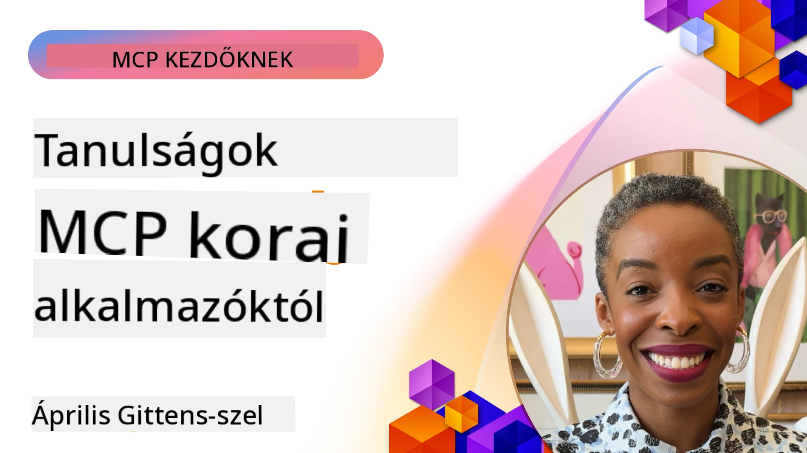

# 🌟 Tanulságok a korai alkalmazóktól

[](https://youtu.be/jds7dSmNptE)

_(Kattintson a fenti képre a tanóra videójának megtekintéséhez)_

## 🎯 Mit tartalmaz ez a modul

Ez a modul azt vizsgálja, hogyan használják valós szervezetek és fejlesztők a Model Context Protocol-t (MCP), hogy valós kihívásokat oldjanak meg és innovációt hajtsanak végre. Részletes esettanulmányokon, gyakorlati projekteken és példákon keresztül felfedezheti, hogyan teszi lehetővé az MCP a biztonságos, skálázható AI integrációt, amely összekapcsolja a nyelvi modelleket, eszközöket és vállalati adatokat.

### 📚 Nézze meg az MCP működés közben

Szeretné látni, hogyan alkalmazzák ezeket az elveket gyártásra kész eszközökön? Tekintse meg [**10 Microsoft MCP szerverünket, amelyek átalakítják a fejlesztők termelékenységét**](microsoft-mcp-servers.md), amelyek valós Microsoft MCP szervereket mutatnak be, amelyeket ma is használhat.

## Áttekintés

Ez a lecke azt vizsgálja, hogyan használták a korai alkalmazók a Model Context Protocol-t (MCP) valós kihívások megoldására és innováció előmozdítására különböző iparágakban. Részletes esettanulmányokon és gyakorlati projekteken keresztül meglátja, hogyan teszi lehetővé az MCP a szabványosított, biztonságos és skálázható AI integrációt — összekapcsolva a nagy nyelvi modelleket, eszközöket és vállalati adatokat egy egységes keretrendszerben. Gyakorlati tapasztalatot szerez MCP-alapú megoldások tervezésében és építésében, tanul bizonyított megvalósítási mintákról, és felfedezi a legjobb gyakorlatokat az MCP termelési környezetben történő bevezetéséhez. A lecke kiemeli az újonnan megjelenő trendeket, jövőbeli irányokat, valamint nyílt forráskódú erőforrásokat, amelyek segítenek a MCP technológia és annak fejlődő ökoszisztémája élvonalában maradni.

## Tanulási célok

- Valós MCP megvalósítások elemzése különböző iparágakban
- Teljes MCP-alapú alkalmazások tervezése és építése
- A MCP technológia új trendjeinek és jövőbeli irányainak felfedezése
- Bevált gyakorlatok alkalmazása valós fejlesztési helyzetekben

## Valós MCP megvalósítások

### Esettanulmány 1: Vállalati ügyféltámogatás automatizálása

Egy multinacionális vállalat MCP-alapú megoldást vezetett be az AI interakciók szabványosítására az ügyféltámogatási rendszereik között. Ez lehetővé tette számukra, hogy:

- Egységes interfészt hozzanak létre több nagy nyelvi modell szolgáltató számára
- Egységes prompt kezelést biztosítsanak részlegek között
- Robusztus biztonsági és megfelelőségi ellenőrzéseket valósítsanak meg
- Könnyen váltsanak különböző AI modellek között az adott igényekhez igazodva

**Műszaki megvalósítás:**

```python
# Python MCP szerver implementáció ügyfélszolgálathoz
import logging
import asyncio
from modelcontextprotocol import create_server, ServerConfig
from modelcontextprotocol.server import MCPServer
from modelcontextprotocol.transports import create_http_transport
from modelcontextprotocol.resources import ResourceDefinition
from modelcontextprotocol.prompts import PromptDefinition
from modelcontextprotocol.tool import ToolDefinition

# Naplózás konfigurálása
logging.basicConfig(level=logging.INFO)

async def main():
    # Szerver konfiguráció létrehozása
    config = ServerConfig(
        name="Enterprise Customer Support Server",
        version="1.0.0",
        description="MCP server for handling customer support inquiries"
    )
    
    # MCP szerver inicializálása
    server = create_server(config)
    
    # Tudásbázis erőforrások regisztrálása
    server.resources.register(
        ResourceDefinition(
            name="customer_kb",
            description="Customer knowledge base documentation"
        ),
        lambda params: get_customer_documentation(params)
    )
    
    # Prompt sablonok regisztrálása
    server.prompts.register(
        PromptDefinition(
            name="support_template",
            description="Templates for customer support responses"
        ),
        lambda params: get_support_templates(params)
    )
    
    # Támogató eszközök regisztrálása
    server.tools.register(
        ToolDefinition(
            name="ticketing",
            description="Create and update support tickets"
        ),
        handle_ticketing_operations
    )
    
    # Szerver indítása HTTP szállítással
    transport = create_http_transport(port=8080)
    await server.run(transport)

if __name__ == "__main__":
    asyncio.run(main())
```

**Eredmények:** 30%-os költségcsökkentés a modelleknél, 45%-os javulás a válasz konzisztenciájában és megnövelt megfelelőség a globális működésben.

### Esettanulmány 2: Egészségügyi diagnosztikai asszisztens

Egy egészségügyi szolgáltató MCP infrastruktúrát fejlesztett ki, hogy több speciális orvosi AI modellt integráljon, miközben biztosítja az érzékeny betegadatok védelmét:

- Zökkenőmentes váltás az általános és specialist orvosi modellek között
- Szigorú adatvédelmi irányelvek és audit nyomvonalak
- Integráció a meglévő Elektronikus Egészségügyi Nyilvántartó (EHR) rendszerekkel
- Egységes prompt tervezés az orvosi terminológiához igazítva

**Műszaki megvalósítás:**

```csharp
// C# MCP host application implementation in healthcare application
using Microsoft.Extensions.DependencyInjection;
using ModelContextProtocol.SDK.Client;
using ModelContextProtocol.SDK.Security;
using ModelContextProtocol.SDK.Resources;

public class DiagnosticAssistant
{
    private readonly MCPHostClient _mcpClient;
    private readonly PatientContext _patientContext;
    
    public DiagnosticAssistant(PatientContext patientContext)
    {
        _patientContext = patientContext;
        
        // Configure MCP client with healthcare-specific settings
        var clientOptions = new ClientOptions
        {
            Name = "Healthcare Diagnostic Assistant",
            Version = "1.0.0",
            Security = new SecurityOptions
            {
                Encryption = EncryptionLevel.Medical,
                AuditEnabled = true
            }
        };
        
        _mcpClient = new MCPHostClientBuilder()
            .WithOptions(clientOptions)
            .WithTransport(new HttpTransport("https://healthcare-mcp.example.org"))
            .WithAuthentication(new HIPAACompliantAuthProvider())
            .Build();
    }
    
    public async Task<DiagnosticSuggestion> GetDiagnosticAssistance(
        string symptoms, string patientHistory)
    {
        // Create request with appropriate resources and tool access
        var resourceRequest = new ResourceRequest
        {
            Name = "patient_records",
            Parameters = new Dictionary<string, object>
            {
                ["patientId"] = _patientContext.PatientId,
                ["requestingProvider"] = _patientContext.ProviderId
            }
        };
        
        // Request diagnostic assistance using appropriate prompt
        var response = await _mcpClient.SendPromptRequestAsync(
            promptName: "diagnostic_assistance",
            parameters: new Dictionary<string, object>
            {
                ["symptoms"] = symptoms,
                patientHistory = patientHistory,
                relevantGuidelines = _patientContext.GetRelevantGuidelines()
            });
            
        return DiagnosticSuggestion.FromMCPResponse(response);
    }
}
```

**Eredmények:** Javultak a diagnosztikai javaslatok az orvosok számára, megtartva a teljes HIPAA megfelelőséget, és jelentős csökkenés a rendszerátkapcsolások számában.

### Esettanulmány 3: Pénzügyi szolgáltatások kockázatelemzés

Egy pénzügyi intézmény MCP-t vezetett be a kockázatelemzési folyamatok szabványosítására különböző részlegek között:

- Egységes interfész létrehozása hitelkockázat, csalásfelismerés és befektetési kockázat modellekhez
- Szigorú hozzáférés-ellenőrzés és modell verziókezelés bevezetése
- Minden AI ajánlás auditálhatóságának biztosítása
- Egységes adatformátum fenntartása változatos rendszerek között

**Műszaki megvalósítás:**

```java
// Java MCP szerver pénzügyi kockázatértékeléshez
import org.mcp.server.*;
import org.mcp.security.*;

public class FinancialRiskMCPServer {
    public static void main(String[] args) {
        // MCP szerver létrehozása pénzügyi megfelelőségi funkciókkal
        MCPServer server = new MCPServerBuilder()
            .withModelProviders(
                new ModelProvider("risk-assessment-primary", new AzureOpenAIProvider()),
                new ModelProvider("risk-assessment-audit", new LocalLlamaProvider())
            )
            .withPromptTemplateDirectory("./compliance/templates")
            .withAccessControls(new SOCCompliantAccessControl())
            .withDataEncryption(EncryptionStandard.FINANCIAL_GRADE)
            .withVersionControl(true)
            .withAuditLogging(new DatabaseAuditLogger())
            .build();
            
        server.addRequestValidator(new FinancialDataValidator());
        server.addResponseFilter(new PII_RedactionFilter());
        
        server.start(9000);
        
        System.out.println("Financial Risk MCP Server running on port 9000");
    }
}
```

**Eredmények:** Javult szabályozói megfelelőség, 40%-kal gyorsabb modell üzembe helyezési ciklusok, és jobb kockázatértékelési konzisztencia a részlegek között.

### Esettanulmány 4: Microsoft Playwright MCP szerver böngésző automatizáláshoz

A Microsoft fejlesztette a [Playwright MCP szervert](https://github.com/microsoft/playwright-mcp) a Model Context Protocol segítségével biztonságos, szabványos böngésző automatizálás megvalósítására. Ez a gyártásra kész szerver lehetővé teszi AI ügynökök és nagy nyelvi modellek számára, hogy ellenőrzött, auditálható és bővíthető módon lépjenek kapcsolatba webes böngészőkkel – lehetővé téve automatizált web tesztelést, adatkinyerést és end-to-end munkafolyamatokat.

> **🎯 Gyártásra kész eszköz**
> 
> Ez az esettanulmány egy valódi MCP szervert mutat be, amelyet ma is használhat! Tudjon meg többet a Playwright MCP szerverről és további 9 gyártásra kész Microsoft MCP szerverről [**Microsoft MCP Servers Guide**](microsoft-mcp-servers.md#8--playwright-mcp-server) oldalon.

**Fő jellemzők:**
- A böngésző automatizálási képességeket (navigáció, űrlapkitöltés, képernyőkép készítés stb.) MCP eszközként teszi elérhetővé
- Szigorú hozzáférés-ellenőrzés és szandboxolás az illetéktelen műveletek megakadályozására
- Részletes audit naplók minden böngésző interakcióról
- Integráció Azure OpenAI-vel és más LLM szolgáltatókkal az ügynök vezérelt automatizáláshoz
- Támogatja a GitHub Copilot Kódoló Ügynök web böngészési képességeit

**Műszaki megvalósítás:**

```typescript
// TypeScript: Playwright böngésző automatizálási eszközök regisztrálása egy MCP szerveren
import { createServer, ToolDefinition } from 'modelcontextprotocol';
import { launch } from 'playwright';

const server = createServer({
  name: 'Playwright MCP Server',
  version: '1.0.0',
  description: 'MCP server for browser automation using Playwright'
});

// Eszköz regisztrálása URL-re navigáláshoz és képernyőkép készítéséhez
server.tools.register(
  new ToolDefinition({
    name: 'navigate_and_screenshot',
    description: 'Navigate to a URL and capture a screenshot',
    parameters: {
      url: { type: 'string', description: 'The URL to visit' }
    }
  }),
  async ({ url }) => {
    const browser = await launch();
    const page = await browser.newPage();
    await page.goto(url);
    const screenshot = await page.screenshot();
    await browser.close();
    return { screenshot };
  }
);

// Az MCP szerver indítása
server.listen(8080);
```

**Eredmények:**

- Biztonságos, programozható böngésző automatizáció az AI ügynökök és LLM-ek számára
- Csökkentette a manuális tesztelési erőfeszítést és javította a webalkalmazások tesztlefedettségét
- Újrahasznosítható, bővíthető keretrendszert biztosított a böngésző-alapú eszközintegrációhoz vállalati környezetben
- Támogatja a GitHub Copilot web böngészési képességeit

**Hivatkozások:**

- [Playwright MCP Server GitHub tárhely](https://github.com/microsoft/playwright-mcp)
- [Microsoft AI és automatizálási megoldások](https://azure.microsoft.com/en-us/products/ai-services/)

### Esettanulmány 5: Azure MCP – Vállalati szintű Model Context Protocol szolgáltatásként

Az Azure MCP szerver ([https://aka.ms/azmcp](https://aka.ms/azmcp)) a Microsoft által kezelt, vállalati szintű Model Context Protocol megvalósítás, amely skálázható, biztonságos és megfelelőségi MCP szerver képességeket nyújt felhőszolgáltatásként. Az Azure MCP lehetővé teszi a szervezetek számára, hogy gyorsan telepítsék, kezeljék és integrálják az MCP szervereket az Azure AI, adat- és biztonsági szolgáltatásaival, csökkentve az üzemeltetési terheket és felgyorsítva az AI bevezetését.

> **🎯 Gyártásra kész eszköz**
> 
> Ez egy valódi MCP szerver, amelyet ma is használhat! Tudjon meg többet a Microsoft Foundry MCP szerverről [**Microsoft MCP Servers Guide**](microsoft-mcp-servers.md) oldalon.


- Teljesen kezelt MCP szerver hoszting beépített skálázással, monitoringgal és biztonsággal
- Natív integráció az Azure OpenAI, Azure AI Search és egyéb Azure szolgáltatásokkal
- Vállalati hitelesítés és jogosultságkezelés Microsoft Entra ID-n keresztül
- Egyedi eszközök, prompt sablonok és erőforrás csatlakozók támogatása
- Megfelelőség vállalati biztonsági és szabályozási követelményeknek

**Műszaki megvalósítás:**

```yaml
# Example: Azure MCP server deployment configuration (YAML)
apiVersion: mcp.microsoft.com/v1
kind: McpServer
metadata:
  name: enterprise-mcp-server
spec:
  modelProviders:
    - name: azure-openai
      type: AzureOpenAI
      endpoint: https://<your-openai-resource>.openai.azure.com/
      apiKeySecret: <your-azure-keyvault-secret>
  tools:
    - name: document_search
      type: AzureAISearch
      endpoint: https://<your-search-resource>.search.windows.net/
      apiKeySecret: <your-azure-keyvault-secret>
  authentication:
    type: EntraID
    tenantId: <your-tenant-id>
  monitoring:
    enabled: true
    logAnalyticsWorkspace: <your-log-analytics-id>
```

**Eredmények:**  
- Csökkentették az AI vállalati projektek érték-elérés idejét egy kész, megfelelőségi MCP szerver platform biztosításával
- Egyszerűsítették a LLM-ek, eszközök és vállalati adatforrások integrációját
- Növelt biztonságot, megfigyelhetőséget és üzemeltetési hatékonyságot az MCP munkaterhelésekben
- Javították a kódminőséget az Azure SDK legjobb gyakorlataival és aktuális hitelesítési mintákkal

**Hivatkozások:**  
- [Azure MCP dokumentáció](https://aka.ms/azmcp)
- [Azure MCP Server GitHub tárhely](https://github.com/Azure/azure-mcp)
- [Azure AI szolgáltatások](https://azure.microsoft.com/en-us/products/ai-services/)
- [Microsoft MCP Központ](https://mcp.azure.com)

## Esettanulmány 6: NLWeb 
Az MCP (Model Context Protocol) egy új protokoll a chatbotok és AI asszisztensek számára, hogy eszközökkel lépjenek interakcióba. Minden NLWeb példány egy MCP szerver, amely támogat egy alapmódszert, az ask-et, amely egy weboldalnak tett természetes nyelvű kérdés. A visszaadott válasz a schema.org-ra épül, amely egy széles körben használt szemantikai szókészlet a webes adatok leírására. Nagyjából az MCP olyan, mint az NLWeb, amilyen az Http a HTML-hez. Az NLWeb ötvözi a protokollokat, schema.org-formátumokat és mintakódokat, hogy a webhelyek gyorsan létrehozhassák ezeket a végpontokat, előnyöket biztosítva az embereknek a beszélgetéses felületeken keresztül és gépeknek a természetes ügynök-ügynök interakció révén.

Az NLWeb két különálló elemből áll.
- Egy protokoll, amely nagyon egyszerűen kezdhető, hogy egy webhellyel természetes nyelven kommunikáljunk és egy formátum, amely json-t és schema.org-t használ a visszaadott válaszban. Részletekért lásd a REST API dokumentációt.
- Egy egyszerű megvalósítás (1) alapján, amely meglévő jelöléseket használ, olyan webhelyekhez, melyek adatai elemek listájaként tekinthetők (termékek, receptek, nevezetességek, vélemények stb.). Együttesen felhasználói felület widgetekkel a webhelyek könnyen biztosíthatnak beszélgetéses felületeket. Részletekért lásd a „Life of a chat query” dokumentációt a működésről.
 
**Hivatkozások:**  
- [Azure MCP dokumentáció](https://aka.ms/azmcp)
- [NLWeb](https://github.com/microsoft/NlWeb)

### Esettanulmány 7: Microsoft Foundry MCP szerver – Vállalati AI ügynök integráció

A Microsoft Foundry MCP szerverek bemutatják, hogyan lehet az MCP-t használni AI ügynökök és munkafolyamatok szervezésére és kezelésére vállalati környezetben. Az MCP és a Microsoft Foundry integrációjával a szervezetek szabványosíthatják az ügynök interakciókat, kihasználhatják a Foundry munkafolyamat-kezelését, és biztosíthatják a biztonságos, skálázható telepítéseket.

> **🎯 Gyártásra kész eszköz**
> 
> Ez egy valódi MCP szerver, amelyet ma is használhat! Tudjon meg többet a Microsoft Foundry MCP szerverről a [**Microsoft MCP Servers Guide**](microsoft-mcp-servers.md#9--microsoft-foundry-mcp-server) oldalon.

**Fő jellemzők:**
- Átfogó hozzáférés az Azure AI ökoszisztémájához, beleértve a modell katalógusokat és a telepítéskezelést
- Tudásindexelés Azure AI Search segítségével RAG alkalmazásokhoz
- Értékelő eszközök AI modell teljesítmény és minőség biztosítására
- Integráció a Microsoft Foundry Katalógussal és Laborokkal élvonalbeli kutatási modellekhez
- Ügynök kezelési és értékelési képességek a gyártási szcenáriókhoz

**Eredmények:**
- Gyors prototípus készítés és robusztus monitorozás AI ügynök munkafolyamatokhoz
- Zökkenőmentes integráció az Azure AI szolgáltatásokkal fejlett esetekben
- Egységes felület ügynök pipeline-ok építéséhez, telepítéséhez és monitorozásához
- Javított biztonság, megfelelőség és üzemeltetési hatékonyság a vállalatok számára
- Felgyorsult AI bevezetés miközben megmaradt az összetett ügynökvezérelt folyamatok irányítása

**Hivatkozások:**
- [Microsoft Foundry MCP Server GitHub tárhely](https://github.com/azure-ai-foundry/mcp-foundry)
- [Azure AI ügynökök MCP-vel történő integrálása (Microsoft Foundry blog)](https://devblogs.microsoft.com/foundry/integrating-azure-ai-agents-mcp/)

### Esettanulmány 8: Foundry MCP Playground – Kísérletezés és prototípus készítés

A Foundry MCP Playground kész környezetet kínál MCP szerverekkel és Microsoft Foundry integrációkkal való kísérletezéshez. A fejlesztők gyorsan prototípust készíthetnek, tesztelhetnek és értékelhetnek AI modelleket és ügynök munkafolyamatokat a Microsoft Foundry Katalógus és Laborok forrásaival. A playground egyszerűsíti a beállítást, mintaprojekteket biztosít és támogatja a közös fejlesztést, megkönnyítve a legjobb gyakorlatok és új szcenáriók felfedezését minimális költségek mellett. Különösen hasznos csapatoknak, akik ötleteket validálnak, megosztják kísérleteiket és gyorsítják a tanulást bonyolult infrastruktúra nélkül. Az alacsony belépési küszöb segít előmozdítani az innovációt és közösségi hozzájárulásokat a MCP és Microsoft Foundry ökoszisztémában.

**Hivatkozások:**

- [Foundry MCP Playground GitHub tárhely](https://github.com/azure-ai-foundry/foundry-mcp-playground)

### Esettanulmány 9: Microsoft Learn Docs MCP Server – AI által vezérelt dokumentáció elérés

A Microsoft Learn Docs MCP Server egy felhőalapú szolgáltatás, amely valós idejű hozzáférést biztosít AI asszisztenseknek a hivatalos Microsoft dokumentációhoz a Model Context Protocol-on keresztül. Ez a gyártásra kész szerver kapcsolódik a széles körű Microsoft Learn ökoszisztémához és lehetővé teszi a szemantikus keresést az összes hivatalos Microsoft forrás között.

> **🎯 Gyártásra kész eszköz**
> 
> Ez egy valódi MCP szerver, amelyet ma is használhat! Tudjon meg többet a Microsoft Learn Docs MCP Serverről a [**Microsoft MCP Servers Guide**](microsoft-mcp-servers.md#1--microsoft-learn-docs-mcp-server) oldalon.

**Fő jellemzők:**
- Valós idejű hozzáférés a hivatalos Microsoft dokumentációhoz, Azure dokumentációhoz és Microsoft 365 dokumentációhoz
- Fejlett szemantikus keresési képességek, amelyek megértik a kontextust és a szándékot
- Mindig naprakész információk a Microsoft Learn tartalmak közzétételekor
- Átfogó lefedettség a Microsoft Learn, Azure dokumentáció és Microsoft 365 forrásokon
- Legfeljebb 10 kiváló minőségű tartalmi egységet ad vissza cikkelcímekkel és URL-ekkel

**Miért elengedhetetlen:**
- Megoldja a „elavult AI tudás” problémáját Microsoft technológiák esetében
- Biztosítja, hogy az AI asszisztensek hozzáférjenek a legfrissebb .NET, C#, Azure és Microsoft 365 funkciókhoz
- Hiteles, elsődleges információt nyújt pontos kódgeneráláshoz
- Alapvető a gyorsan fejlődő Microsoft technológiák fejlesztői számára

**Eredmények:**
- Drámaian javította az AI által generált kód pontosságát Microsoft technológiák esetén
- Csökkentette a keresési időt a friss dokumentáció és legjobb gyakorlatok után
- Fejlesztői termelékenység növelése kontextusérzékeny dokumentáció lekéréssel
- Zökkenőmentes integráció a fejlesztési munkafolyamatokba az IDE elhagyása nélkül

**Hivatkozások:**
- [Microsoft Learn Docs MCP Server GitHub tárhely](https://github.com/MicrosoftDocs/mcp)
- [Microsoft Learn dokumentáció](https://learn.microsoft.com/)

## Gyakorlati projektek

### Projekt 1: Többszolgáltatós MCP szerver építése

**Cél:** Készítsen egy MCP szervert, amely képes kérésirányításra több AI modell szolgáltató között specifikus kritériumok alapján.

**Követelmények:**

- Támogasson legalább három különböző modell szolgáltatót (pl. OpenAI, Anthropic, helyi modellek)
- Valósítson meg egy irányító mechanizmust a kérés metaadatai alapján
- Hozzon létre konfigurációs rendszert a szolgáltató hitelesítő adatok kezelésére
- Adjon hozzá gyorsítótárazást a teljesítmény és költséghatékonyság optimalizálásához
- Építsen egy egyszerű irányítópultot a használat figyeléséhez

**Megvalósítási lépések:**

1. Állítsa be az alapvető MCP szerver infrastruktúrát
2. Valósítson meg szolgáltató adaptereket az egyes AI modell szolgáltatókhoz
3. Hozza létre az irányítási logikát a kérés jellemzői alapján
4. Adjon hozzá gyorsítótárazási mechanizmusokat a gyakori kérésekhez
5. Fejlessze az irányítópultot a monitorozáshoz
6. Tesztelje különböző kérésmintákkal

**Technológiák:** Válasszon Python (.NET/Java/Python a preferenciája alapján), Redis gyorsítótárazáshoz és egyszerű webes keretrendszert az irányítópulthoz.

### Projekt 2: Vállalati prompt kezelő rendszer

**Cél:** Fejlesszen ki egy MCP-alapú rendszert prompt sablonok kezelése, verziózása és telepítése számára a szervezeten belül.

**Követelmények:**


- Hozzon létre egy központosított tárat a prompt sablonok számára
- Valósítson meg verziókövetési és jóváhagyási munkafolyamatokat
- Építsen sablon tesztelési képességeket minta bemenetekkel
- Fejlesszen ki szerepalapú hozzáférés-vezérlést
- Hozzon létre egy API-t a sablonok lekérésére és telepítésére

**Megvalósítás lépései:**

1. Tervezze meg az adatbázis sémát a sablon tároláshoz
2. Hozza létre a mag API-t a sablon CRUD műveletekhez
3. Valósítsa meg a verziókezelő rendszert
4. Építse ki a jóváhagyási munkafolyamatot
5. Fejlessze a tesztelési keretrendszert
6. Hozzon létre egy egyszerű webes felületet a kezeléshez
7. Integrálja egy MCP szerverrel

**Technológiák:** Az Ön által választott backend keretrendszer, SQL vagy NoSQL adatbázis és egy frontend keretrendszer a kezelőfelülethez.

### 3. projekt: MCP-alapú tartalomgenerációs platform

**Cél:** Építsen tartalomgenerációs platformot, amely az MCP-t használva biztosít következetes eredményeket különböző tartalomtípusok esetén.

**Követelmények:**

- Több tartalomformátum támogatása (blogbejegyzések, közösségi média, marketing szöveg)
- Sablonalapú generálás megvalósítása testreszabási lehetőségekkel
- Tartalom felülvizsgálati és visszajelzési rendszer létrehozása
- Tartalom teljesítménymutatók nyomon követése
- Tartalom verziókezelés és iteráció támogatása

**Megvalósítás lépései:**

1. Állítsa be az MCP kliens infrastruktúrát
2. Készítsen sablonokat különböző tartalomtípusokhoz
3. Építse meg a tartalomgenerálási folyamatot
4. Valósítsa meg a felülvizsgálati rendszert
5. Fejlessze a mérőszám követési rendszert
6. Hozzon létre felhasználói felületet a sablonkezeléshez és tartalomgeneráláshoz

**Technológiák:** Az Ön által preferált programozási nyelv, webes keretrendszer és adatbázis rendszer.

## Az MCP technológia jövőbeli irányai

### Felmerülő trendek

1. **Multi-Modal MCP**
   - Az MCP bővítése a kép-, hang- és videómodellekkel való szabványos interakciókra
   - Kereszt-modalitásos érvelési képességek fejlesztése
   - Különböző modalitásokhoz szabványosított prompt formátumok

2. **Federált MCP infrastruktúra**
   - Elosztott MCP hálózatok, amelyek képesek erőforrásokat megosztani szervezetek között
   - Biztonságos modellmegosztási szabványosított protokollok
   - Adatvédelmi szempontból védett számítási technikák

3. **MCP piacterek**
   - MCP sablonok és bővítmények megosztásának és monetizálásának ökoszisztémái
   - Minőségbiztosítási és tanúsítási folyamatok
   - Integráció modell piacterekkel

4. **MCP az Edge Computing számára**
   - MCP szabványok adaptálása erőforrás-korlátozott eszközökhöz
   - Optimalizált protokollok alacsony sávszélességű környezetekhez
   - Speciális MCP megvalósítások IoT ökoszisztémák számára

5. **Szabályozói keretrendszerek**
   - MCP kiterjesztések fejlesztése szabályozási megfelelőséghez
   - Szabványosított audit nyomvonalak és magyarázhatósági felületek
   - Integráció felmerülő AI irányítási keretrendszerekkel

### Microsoft MCP megoldások

A Microsoft és az Azure több nyílt forráskódú tárat fejlesztett, hogy segítsék a fejlesztőket az MCP különböző helyzetekben való megvalósításában:

#### Microsoft szervezet

1. [playwright-mcp](https://github.com/microsoft/playwright-mcp) - Playwright MCP szerver böngésző automatizáláshoz és teszteléshez
2. [files-mcp-server](https://github.com/microsoft/files-mcp-server) - OneDrive MCP szerver megvalósítás helyi teszteléshez és közösségi hozzájárulásokhoz
3. [NLWeb](https://github.com/microsoft/NlWeb) - Az NLWeb egy nyílt protokollok és kapcsolódó nyílt forráskódú eszközök gyűjteménye, fő fókusza az AI Web alaprétegének megteremtése

#### Azure-Samples szervezet

1. [mcp](https://github.com/Azure-Samples/mcp) - Minták, eszközök és erőforrások linkjei MCP szerverek építéséhez és integrálásához Azure-on számos nyelv használatával
2. [mcp-auth-servers](https://github.com/Azure-Samples/mcp-auth-servers) - Referencia MCP szerverek, melyek az aktuális Model Context Protocol specifikáció alapján mutatják be az autentikációt
3. [remote-mcp-functions](https://github.com/Azure-Samples/remote-mcp-functions) - Kibocsátási oldal a Remote MCP Server megvalósításokhoz Azure Functions-ben, nyelvi specifikus tárakkal
4. [remote-mcp-functions-python](https://github.com/Azure-Samples/remote-mcp-functions-python) - Gyorsindító sablon egyedi távoli MCP szerverek építéséhez és telepítéséhez Azure Functions-ben Pythonnal
5. [remote-mcp-functions-dotnet](https://github.com/Azure-Samples/remote-mcp-functions-dotnet) - Gyorsindító sablon egyedi távoli MCP szerverek építéséhez és telepítéséhez Azure Functions-ben .NET/C# használatával
6. [remote-mcp-functions-typescript](https://github.com/Azure-Samples/remote-mcp-functions-typescript) - Gyorsindító sablon egyedi távoli MCP szerverek építéséhez és telepítéséhez Azure Functions-ben TypeScript-tel
7. [remote-mcp-apim-functions-python](https://github.com/Azure-Samples/remote-mcp-apim-functions-python) - Azure API Management mint AI átjáró távoli MCP szerverekhez Python használatával
8. [AI-Gateway](https://github.com/Azure-Samples/AI-Gateway) - APIM ❤️ AI kísérletek MCP képességekkel, integráció Azure OpenAI és AI Foundry szolgáltatásokkal

Ezek a tárok különféle megvalósításokat, sablonokat és erőforrásokat biztosítanak az Model Context Protocol használatához különböző programozási nyelveken és Azure szolgáltatásokon keresztül. Lefedik az egyszerű szerver megvalósításoktól kezdve az autentikáción, felhőbeli telepítésen át a vállalati integrációs forgatókönyvekig a használati eseteket.

#### MCP erőforrások könyvtára

Az [MCP Resources directory](https://github.com/microsoft/mcp/tree/main/Resources) a hivatalos Microsoft MCP tárban egy válogatott gyűjtemény minta erőforrásokat, prompt sablonokat és eszköz definíciókat tartalmaz, melyek a Model Context Protocol szerverekkel való munka támogatására szolgálnak. Ez a könyvtár célja, hogy segítsen a fejlesztőknek gyorsan elkezdeni az MCP használatát újrahasznosítható építőelemekkel és bevált példákkal:

- **Prompt sablonok:** Kész, használatra kész prompt sablonok gyakori AI feladatokra és helyzetekre, melyek az Ön MCP szerver megvalósításaihoz igazíthatók.
- **Eszköz definíciók:** Példák eszköz sémákra és metaadatokra az eszközintegráció és meghívás szabványosításához különböző MCP szerverek között.
- **Erőforrás minták:** Példák erőforrás definíciókra adatforrásokhoz, API-khoz és külső szolgáltatásokhoz való kapcsolódáshoz az MCP keretrendszeren belül.
- **Referencia megvalósítások:** Gyakorlati minták, amelyek bemutatják, hogyan strukturáljuk és szervezzük az erőforrásokat, promptokat és eszközöket valós MCP projektekben.

Ezek az erőforrások gyorsítják a fejlesztést, elősegítik a szabványosítást, és támogatják a bevált gyakorlatokat MCP alapú megoldások építése és telepítése során.

#### MCP erőforrások könyvtára

- [MCP Resources (Minta Promtpek, Eszközök és Erőforrás Definíciók)](https://github.com/microsoft/mcp/tree/main/Resources)

### Kutatási lehetőségek

- Hatékony prompt optimalizálási technikák MCP keretrendszerben
- Biztonsági modellek többlakásos MCP telepítésekhez
- Teljesítmény mérés különböző MCP megvalósítások között
- Formális verifikációs módszerek MCP szerverekhez

## Összegzés

A Model Context Protocol (MCP) gyorsan formálja a jövő szabványosított, biztonságos és interoperábilis AI integrációját az iparágak között. A tananyagban bemutatott esettanulmányok és gyakorlati projektek során láthattuk, hogyan használják a korai alkalmazók – köztük a Microsoft és az Azure – az MCP-t valós problémák megoldására, az AI elfogadásának felgyorsítására, valamint a megfelelés, biztonság és skálázhatóság biztosítására. Az MCP moduláris megközelítése lehetővé teszi a szervezetek számára, hogy nagy nyelvi modelleket, eszközöket és vállalati adatokat egy egységes, auditálható keretben kapcsoljanak össze. Ahogy az MCP tovább fejlődik, a közösséggel való kapcsolattartás, a nyílt forráskódú erőforrások feltérképezése és a bevált gyakorlatok alkalmazása kulcsfontosságú lesz robusztus, jövőbiztos AI megoldások építéséhez.

## További erőforrások

- [MCP Foundry GitHub tár](https://github.com/azure-ai-foundry/mcp-foundry)
- [Foundry MCP Playground](https://github.com/azure-ai-foundry/foundry-mcp-playground)
- [Azure AI ügynökök MCP-vel való integrálása (Microsoft Foundry Blog)](https://devblogs.microsoft.com/foundry/integrating-azure-ai-agents-mcp/)
- [MCP GitHub tár (Microsoft)](https://github.com/microsoft/mcp)
- [MCP erőforrások könyvtára (Minta promptok, eszközök és erőforrás definíciók)](https://github.com/microsoft/mcp/tree/main/Resources)
- [MCP közösség és dokumentáció](https://modelcontextprotocol.io/introduction)
- [MCP specifikáció (2026-07-28)](https://modelcontextprotocol.io/specification/2026-07-28/)
- [Azure MCP dokumentáció](https://aka.ms/azmcp)
- [OWASP MCP Top 10](https://microsoft.github.io/mcp-azure-security-guide/mcp/) - Biztonsági bevált gyakorlatok
- [Playwright MCP szerver GitHub tár](https://github.com/microsoft/playwright-mcp)
- [Files MCP szerver (OneDrive)](https://github.com/microsoft/files-mcp-server)
- [Azure-Samples MCP](https://github.com/Azure-Samples/mcp)
- [MCP Auth szerverek (Azure-Samples)](https://github.com/Azure-Samples/mcp-auth-servers)
- [Remote MCP funkciók (Azure-Samples)](https://github.com/Azure-Samples/remote-mcp-functions)
- [Remote MCP funkciók Python (Azure-Samples)](https://github.com/Azure-Samples/remote-mcp-functions-python)
- [Remote MCP funkciók .NET (Azure-Samples)](https://github.com/Azure-Samples/remote-mcp-functions-dotnet)
- [Remote MCP funkciók TypeScript (Azure-Samples)](https://github.com/Azure-Samples/remote-mcp-functions-typescript)
- [Remote MCP APIM funkciók Python (Azure-Samples)](https://github.com/Azure-Samples/remote-mcp-apim-functions-python)
- [AI-Gateway (Azure-Samples)](https://github.com/Azure-Samples/AI-Gateway)
- [Microsoft AI és automatizálási megoldások](https://azure.microsoft.com/en-us/products/ai-services/)

## Gyakorlatok

1. Elemezzen egy esettanulmányt, és javasoljon alternatív megvalósítási megközelítést.
2. Válasszon egy projektötletet, és készítsen részletes műszaki specifikációt.
3. Kutasson egy olyan iparágat, amely nem szerepel az esettanulmányok között, és vázolja fel, hogyan kezelhetné az MCP az adott iparág speciális kihívásait.
4. Fedezzen fel egy jövőbeli irányt, és dolgozzon ki egy új MCP kiterjesztés koncepcióját annak támogatására.

## Mi következik

Fedezze fel tovább: [Microsoft MCP szerverek](./microsoft-mcp-servers.md)

Folytassa: [8. modul: Bevált gyakorlatok](../08-BestPractices/README.md)

---

<!-- CO-OP TRANSLATOR DISCLAIMER START -->
**Jogi nyilatkozat**:
Ez a dokumentum az AI fordítási szolgáltatás, a [Co-op Translator](https://github.com/Azure/co-op-translator) segítségével készült. Bár az pontosságra törekszünk, kérjük, vegye figyelembe, hogy az automatikus fordítások hibákat vagy pontatlanságokat tartalmazhatnak. Az eredeti dokumentum az anyanyelvén tekintendő hiteles forrásnak. Fontos információk esetén professzionális emberi fordítást javasolunk. Nem vállalunk felelősséget semmilyen félreértésért vagy téves értelmezésért, amely ebből a fordításból ered.
<!-- CO-OP TRANSLATOR DISCLAIMER END -->