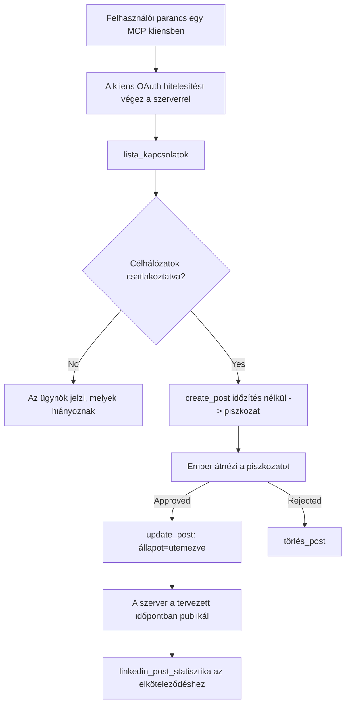

# Esettanulmány: Közösségi hálózatokra való közzététel egy ügynökből távoli MCP szerverrel

> **Nyilatkozat:** Számos szolgáltatás és nyílt forráskódú projekt képes közösségi hálózatokra posztolni, és egy csapat közvetlenül is integrálhatja az egyes hálózatok API-ját. Az alábbi forgatókönyvet egyetlen működő példaként mutatjuk be arra, hogyan lehet megtervezni és használni egy **írásra képes távoli MCP szervert**. A Publora egy kereskedelmi szolgáltatás ingyenes szinttel; az itt leírt minták bármely olyan MCP szerverre érvényesek, amely visszavonhatatlan műveleteket hajt végre a felhasználó nevében.

## Áttekintés

Az ügynökök jól értenek a tartalom tervezéséhez, de kevésbé az eljuttatásához. Egy modell másodpercek alatt megírhat egy kiadási közleményt, aztán megáll a munka: a közzététel minden hálózathoz külön API-t, minden hálózathoz külön OAuth alkalmazást és eltérő média szabályokat jelent. A legtöbb csapat ezt kézzel, a szöveg böngészőbe másolásával oldja meg.

Ez az esettanulmány azt vizsgálja, hogyan oldható meg ez az utolsó lépés egyetlen távoli MCP szerverrel, és — ami hasznosabb bárki számára, aki ilyet épít — a **írásra képes** szervernek hozandó tervezési döntéseket. Az adatok olvasása elnéző; a közzététel nem az: egy rossz eszközhívás látható a közönség számára és nem vonható vissza.

## Forgatókönyv

Egy kis fejlesztői kapcsolattartó csapat posztokat tervez egy ügynökön belül (Claude, VS Code, Cursor — az ügyfél nem számít). Azt akarják, hogy az ügynök:

- lássa, mely közösségi fiókok vannak kapcsolva a csapathoz,
- posztot tervezzen és azt tervezetként tárolja egy emberi jóváhagyásig,
- képet csatoljon,
- több hálózatra ütemezze egy kiválasztott időpontra,
- és később jelentse az eredményeket.

Kulcsfontosságú, hogy az ügynök *ne legyen képes* véletlen közzétételre, amíg még kísérleteznek.

## Használt eszközök

- [Publora MCP Server](https://github.com/publora/mcp-server) — távoli MCP szerver (`streamable-http`), amely közzétételi, ütemezési, média- és LinkedIn elemző eszközöket kínál. Regisztrálva az MCP hivatalos regiszterében `com.publora/mcp-server` néven.

## Lépésről lépésre munkafolyamat

1. **Csatlakozás a szerverhez.** Az OAuth-kompatibilis kliensek az engedélyezési-kód folyamatot PKCE-vel a szerver saját hozzájárulási képernyője ellen hajtják végre; nem-kompatibilis kliensek, például parancssoros, fej nélküli alkalmazások a Publora API kulcsot fejlécként használják. Mindkét út támogatott, és hogy melyiket kapja, a kliensen múlik, nem a szerveren.
2. **Fiókok listázása.** Az ügynök meghívja a `list_connections`-t, és megkapja a csatlakoztatott fiókokat azok azonosítóival.
3. **Tervezés.** Az ügynök a `create_post` hívja *ütemezett időpont nélkül*. A poszt tervezetként tárolódik — semmi sem kerül közzétételre.
4. **Média csatolása.** Nyilvános kép URL-ek ugyanebben a hívásban átadódnak; a szerver letölti és érvényesíti azokat.
5. **Ütemezés.** Emberi jóváhagyás után az `update_post` beállítja az állapotot ütemezettre ISO 8601 idővel.
6. **Mérés.** LinkedIn esetén a `linkedin_post_stats` visszaadja a részvételi adatokat, miután a poszt élővé válik.

## Példa parancs

```text
Which social accounts do I have connected?
Draft a post announcing our new changelog page, attach the screenshot at
https://example.com/changelog.png, and keep it as a draft — do not publish it.
Once I approve, schedule it to LinkedIn and Bluesky for tomorrow at 09:00 UTC.
```

## Mermaid folyamatábra



## Technikai megvalósítás

Az alábbi tanulságok a case study átemelhető részei.

### Nyílt felfedezés, hitelesített végrehajtás

A `tools/list` hitelesítés nélkül szolgál ki; minden `tools/call` token-t kér,
és ha nincs, akkor `401` választ ad `WWW-Authenticate` fejléc társaságában, amely a
védett erőforrás metaadataira mutat. A szerver régi végpontja egy
nem hitelesített `initialize` választ is ad azokra a kliensekre protokoll verziók előtt,
amelyek `2026-07-28`; jelenlegi kliensek már nem használják ezt a kézfogást.

Ez a szerver-specifikus megosztás lehetővé teszi, hogy a regiszterek, katalógusok és kliensek titok nélkül megvizsgálják az eszközök
neveit, séma leírásait és annotációit, miközben megakadályozza az anonim
végrehajtást. A nyílt felfedezés telepítési döntés, nem MCP követelmény; egy
védett telepítés hitelesítést is kérhet a `tools/list`-hez.

### Regisztráció: dinamikus kliensregisztráció és helyettesítői

A szerver hirdeti a `/.well-known/oauth-protected-resource` és `/.well-known/oauth-authorization-server` végpontokat, és támogatja az engedélyezési-kód folyamatot PKCE-vel (`S256`), frissítő tokeneket, valamint a **dinamikus kliensregisztrációt**.

A dinamikus regisztráció eltörölte a manuális lépést a régi kliensek esetén: nélküle
minden kliensnek előzetesen kiállított `client_id`-re volt szüksége a szolgáltatótól.

Inkább kompatibilitási viselkedésként kezelje, nem pedig tervezési mintaként. A `2026-07-28` specifikáció módosítás leállítja a dinamikus kliensregisztrációt a Kliensazonosító Metaadat Dokumentumok javára, ahol a kliens egy stabil HTTPS URL alatt tárol egy metaadat dokumentumot és ez az URL *a* `client_id`. A DCR tovább működik jelenleg, de egy mai szerver tervezésénél célszerű a CIMD-re készülni, és a DCR-t csak régi kliensekhez tartani.

### Az eszköz annotációk nem csupán díszítés

Minden eszköz tartalmaz egy `title`-t és az alkalmazható utalásokat: `readOnlyHint`, `destructiveHint`, `idempotentHint`, `openWorldHint`.

Két ok, amiért érdemes ebbe energiát fektetni. Először is a kliensek az utalásokat használják annak eldöntésére, mit kell a felhasználóval megerősíttetni — egy kliens automatikusan lefuttathat egy csak olvasható lekérdezést és csak azután kérhet jóváhagyást törlés előtt. A szabvány kifejezetten kimondja, hogy az annotációk megbízhatatlan utalások, nem engedélyezési mechanizmusok: arra szolgálnak, hogy formálják, mit ajánl a kliens végrehajtásra, magát a szervert nem akadályozzák semmiben, és a szervernek továbbra is saját szabályait kell érvényesítenie. Másodszor, a fő csatoló könyvtárak most *követelik* őket leellenőrzéshez; egy olyan szerver, amelynek eszközeinek nincs címük és utalásaik, visszaküldik, bármennyire is jól működik.

### Tegye azonosítókat kizárólag másolhatóvá, kifürkészhetetlenné

A platformazonosítók átlátszatlan karakterláncok, amelyeket a `list_connections` ad vissza, és a séma leírás explicite kimondja, hogy ezeket szó szerint kell másolni, semmiképpen sem kitalálni. A szerver elutasít minden mást.

A modellek jól találnak ki dolgokat. Minden írásra képes szervernek fel kell tételeznie, hogy egy azonosító végül kitalált lehet, és ezt az utat korán és zajosan hibára kell vinni, ahelyett, hogy egy életszerűnek tűnő érték alapján cselekedne.

### Hibaüzenet a közzététel előtt, amelyből lehet tanulni

Egyes hálózatok nem fogadnak el csak szöveges posztot, és képet vagy videót követelnek. Ezt az ütemezéskor ellenőrzik, és a hiba az adott platformot és a hiányzó követelményt nevezi meg.

Egy ügynök képes helyrehozni az „Instagram kép vagy videó csatolását követeli” hibát további oda-vissza kör nélkül. Egy általános `400`-ból nem.

### Tegye a újrapróbálkozásokat biztonságossá

A két tartalomkészítő eszköz, a `create_post` és `update_post` fogad egy idempotencia kulcsot: ugyanazzal a kéréssel újrahasználva a korábbi választ adják vissza második poszt készítése helyett. Az ügynökök futtatókörnyezetében időtúllépéskor újrapróbálkoznak; idempotencia nélkül a lassú válasz duplikált közzétételhez vezet. A többi írási eszköz — törlés, média lépések, LinkedIn reakciók és hozzászólások — nem fogad idempotencia kulcsot, így ott egy újrapróbálkozás nem automatikusan biztonságos. Érdemes tudni, mely műveletek vannak védve és melyek nem.

### Biztosítson tesztelési módot, amely semmit sem tesz közzé

A szerver elfogad egy fenntartott célt, a `publora-playground`-ot, amelyet valós célként érvényesít és igazol, majd eldob — semmi sem jut el élő fiókhoz. Ez az eszköz sémában van leírva, amelyet bármely kliens hitelesítés nélkül elolvashat: a `create_post` `platforms` mezője így dokumentálja: „kapcsolat-teszt cél, amihez nincs szükség valós kapcsolatra — a poszt elfogadott és eldobott, semmi sem kerül közzétételre”. Ezt úgy hívd meg, hogy csak ezt adod át: `platforms: ["publora-playground"]`.

Ez a részlet az egész felület egyik leghasznosabb eleme lett. A csatoló könyvtárak felülvizsgálóinak, közreműködőinek és a folyamatos integrációs környezeteknek lehetővé teszi, hogy a teljes írási utat kockázat nélkül végigjárják egy valódi közönség érintése nélkül. Minden visszavonhatatlan műveletet végrehajtó MCP szerver profitál egy dokumentált no-op célból.

## Eredmények és hatás

- A közzétételi lépés a böngészőből oda került vissza, ahol a tartalmat megírták, és a tervezet-először szokás emberi szereplőt tart a folyamatban. Pontosan fogalmazzunk: a tervezet egy konvenció, nem egy határ. Ugyanaz a hitelesítő adatok képesek ütemezni vagy közzétenni, így aki valódi jóváhagyást akar, azt a felület határain kívül kell érvényesíteni — külön hitelesítő adatokkal vagy szabályzati réteggel a szerver előtt.
- Az egyes hálózatok különbségei — média követelmények, beszélgetések, válasz kezelések — egyszer kerülnek kezelve a szerveren, nem minden egyes ügynökben, ami beszél hozzá.
- Ugyanaz a szerver szolgál ki több MCP klienst előzetesen kiállított hitelesítés nélkül.
    A jelenlegi kliensek használhatják a Kliensazonosító Metaadat Dokumentumokat; a DCR továbbra is tartalék az
    régebbi klienseknek.
- A tervezési korlátokat legalább annyira befolyásolták a csatoló könyvtárak felülvizsgálatai, mint a felhasználók: az annotációk, az OAuth és a biztonságos tesztcél mind szükséges volt legalább egy felülvizsgálónál.

## Hivatkozások

- [Publora MCP Server (forrás)](https://github.com/publora/mcp-server)
- [Publora API és MCP dokumentáció](https://docs.publora.com)
- [MCP Regiszter bejegyzés: `com.publora/mcp-server`](https://registry.modelcontextprotocol.io/v0/servers?search=com.publora/mcp-server)
- [MCP specifikáció — Engedélyezés](https://modelcontextprotocol.io/specification/2026-07-28/basic/authorization)
- [MCP specifikáció — Eszköz annotációk](https://modelcontextprotocol.io/docs/concepts/tools)

## Mi következik

- Vegyen elő egy MCP szervert, amit épít, és ellenőrizze a három legolcsóbb nyereményt itt: annotációk minden eszközön, idempotencia kulcs minden íráshoz, és egy dokumentált no-op cél.
- Próbálja ki a nyílt felfedezés megosztást: hívja a `tools/list`-et egy nyilvános távoli szerveren hitelesítés nélkül, majd hívjon egy eszközt, és vizsgálja meg a `401` kihívást.
- Gondolkodjon el rajta, mit jelent az "undo" az Ön területén. A közzétételnek vannak tervezetei és törlése; ha az Ön műveleteinek nincs megfelelője, a megerősítés a tervezés részének kell lennie, nem a parancsnak.

---

<!-- CO-OP TRANSLATOR DISCLAIMER START -->
**Jogi nyilatkozat**:
Ez a dokumentum az AI fordítási szolgáltatás, a [Co-op Translator](https://github.com/Azure/co-op-translator) segítségével készült. Bár az pontosságra törekszünk, kérjük, vegye figyelembe, hogy az automatikus fordítások hibákat vagy pontatlanságokat tartalmazhatnak. Az eredeti dokumentum az anyanyelvén tekintendő hiteles forrásnak. Fontos információk esetén professzionális emberi fordítást javasolunk. Nem vállalunk felelősséget semmilyen félreértésért vagy téves értelmezésért, amely ebből a fordításból ered.
<!-- CO-OP TRANSLATOR DISCLAIMER END -->