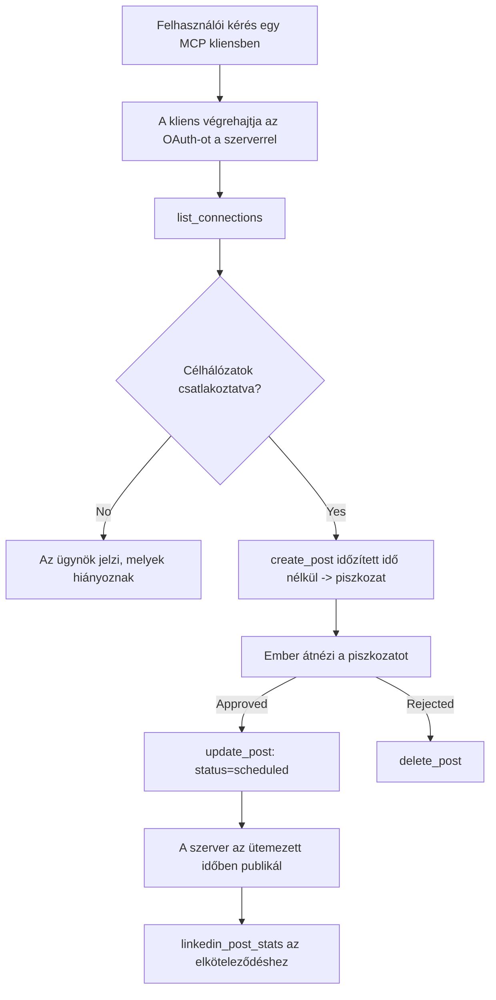

# Esettanulmány: Közösségi hálózatokra történő közzététel egy ügynöktől távoli MCP szerverrel

> **Felelősségkizárás:** Számos szolgáltatás és nyílt forráskódú projekt tud közösségi hálózatokra publikálni, és egy csapat közvetlenül integrálhatja az egyes hálózatok API-ját is. Az alábbi helyzet egy példát nyújt arra, hogyan lehet megtervezni és használni egy **írásra képes távoli MCP szervert**. A Publora egy kereskedelmi szolgáltatás ingyenes réteggel; az itt leírt minták bármely, a felhasználó nevében visszafordíthatatlan műveleteket végző MCP szerverre érvényesek.

## Áttekintés

Az ügynökök jól tudnak tartalmat előkészíteni, de gyengék a továbbításban. Egy modell másodpercek alatt megírhat egy sajtóközleményt, majd a munka megáll: a közzétételhez hálózatonként egy API, OAuth alkalmazás és az egyes platformokra különböző média szabályok szükségesek. A legtöbb csapat kézzel másolja be a szöveget a böngészőbe.

Ez az esettanulmány azt vizsgálja, hogyan lehet az utolsó lépést egy távoli MCP szerverrel megoldani, és — hasznosabban azoknak, akik ilyet építenek — mely tervezési döntéseket kell jól meghozni egy **írásra képes** szerver esetén. Az adatolvasás megengedő. A közzététel nem az: egy rossz eszközhívás a közönség előtt látható és nem vonható vissza.

## Forgatókönyv

Egy kis developer-relations csapat ügynökben (Claude, VS Code, Cursor — a kliens nem számít) készíti az posztokat. Azt akarják, hogy az ügynök:

- lássa, hogy mely közösségi fiókok vannak csatlakoztatva,
- készítsen egy posztot, és tartsa azt piszkozatként emberi jóváhagyásra,
- csatoljon egy képet,
- ütemezze azt különböző hálózatokra választott időpontra,
- és később jelezze az eredményeket.

Különösen fontos, hogy az ügynök ne tudjon véletlenül publikálni, amíg még kísérleteznek.

## Használt eszközök

- [Publora MCP Server](https://github.com/publora/mcp-server) — egy távoli MCP szerver (`streamable-http`), amely közzététel, ütemezés, média és LinkedIn elemző eszközöket kínál. Az MCP hivatalos regiszterében `com.publora/mcp-server` néven.

## Lépésről lépésre workflow

1. **Kapcsolódjon a szerverhez.** Az OAuth-ot támogató kliensek a szerver saját engedélyezési képernyőjével végzik az authorization-code folyamatot PKCE-vel; a nem OAuth kliens, például headless CLI-k, fejléces Publora API kulcsot használnak. Mindkét út támogatott, és az attól függ, melyik klienshez tartozik, nem a szervertől.
2. **Fiókok listázása.** Az ügynök meghívja a `list_connections`-t, és megkapja a csatlakoztatott fiókokat azonosítóikkal.
3. **Piszkozat készítése.** Az ügynök meghívja a `create_post`-ot *ütemezés nélküli* idővel. A poszt piszkozatként tárolódik — semmi nem kerül közzétételre.
4. **Média csatolása.** Nyilvános kép URL-eket ugyanabban a hívásban adnak át; a szerver letölti és ellenőrzi őket.
5. **Ütemezés.** Emberi jóváhagyás után az `update_post` állapotot `scheduled`-re állít az ISO 8601 idővel.
6. **Mérés.** LinkedIn esetén a `linkedin_post_stats` visszaadja az elköteleződést, ha aktív a poszt.

## Példa prompt

```text
Which social accounts do I have connected?
Draft a post announcing our new changelog page, attach the screenshot at
https://example.com/changelog.png, and keep it as a draft — do not publish it.
Once I approve, schedule it to LinkedIn and Bluesky for tomorrow at 09:00 UTC.
```

## Mermaid folyamatábra



## Műszaki megvalósítás

Az alábbi tanulságok az átruházható részei ennek az esettanulmánynak.

### Nyílt felfedezés, hitelesített végrehajtás

A `tools/list` hitelesítés nélkül elérhető; minden `tools/call` token-t kér, különben `401`-et ad `WWW-Authenticate` fejléc kíséretében, amely a védett erőforrás metaadataira mutat. (A szerver nem hitelesített `initialize` hívásokra is válaszol, amely csak a 2026-07-28 előtti protokoll verziók esetén számít; az adott revízió eltörölte a handshake-et.)

Ez a szétválasztás fontos a gyakorlatban. Regiszterek, katalógusok és kliensek titok nélkül is megvizsgálhatják az eszközfelületet — neveket, sémákat, annotációkat — , míg semmi nem hajtható végre névtelenül. A szerver, amely token-t kér `initialize`-hoz, gyakorlatilag láthatatlan az eszközök számára; aki anonim `tools/call`-t engedélyez, az veszélyforrás.

### Regisztráció: dinamikus kliensregisztráció és annak pótlása

A szerver reklámozza a `/.well-known/oauth-protected-resource` és `/.well-known/oauth-authorization-server` végpontokat, támogatja az authorization-code PKCE (`S256`) folyamot, frissítő tokeneket és a **dinamikus kliensregisztrációt**.

A dinamikus regisztráció megszünteti a manuális lépést: regisztráció nélkül minden kliensnek előre kiadott `client_id`-vel kell rendelkeznie, ami minden új klienshez külön kérés a szolgáltatóhoz.

Ezt kompatibilitási viselkedésnek kell tekinteni, nem másolandó tervnek. A `2026-07-28`-as specifikáció felülvizsgálata elavulttá teszi a dinamikus kliensregisztrációt a Client ID Metadata Documents javára, ahol a kliens egy stabil HTTPS URL-en tárolja a metaadat dokumentumot, és ez az URL *a* `client_id`. A DCR tovább működik, de egy mai szerver építésekor CIMD-re kell tervezni, és DCR-t csak régebbi kliensekhez tartani.

### Az eszköz annotációk nem díszítés

Minden eszköz tartalmaz `title`-t és alkalmazható tippeket: `readOnlyHint`, `destructiveHint`, `idempotentHint`, `openWorldHint`.

Két okból érdemes ezekre figyelni. Egyrészt a kliensek a tippek alapján döntenek a felhasználói megerősítésről — egy kliens automatikusan lefuttathat egy csak olvasható lekérdezést, majd megállhat egy törlés előtti jóváhagyásért. A specifikáció egyértelmű: az annotációk nem megbízható megerősítések, nem engedélyezési mechanizmus, csupán alakítják, hogy mit ajánl fel a kliens, nem akadályoznak semmit a szerveren, a szervernek a saját szabályait akkor is alkalmaznia kell. Másrészt a főbb csatlakozó könyvtárak most *követelik* az annotációkat az átvizsgáláshoz; egy eszközök nélküli szervert visszaküldenek, bármilyen jól működik is.

### Tegye azonosítókat kitalálhatatlanná

A platformazonosítók átlátszatlan karakterláncok, amelyeket a `list_connections` ad vissza, és a séma kifejezetten kimondja, hogy azokat szó szerint kell másolni, soha nem szabad kitalálni. A szerver elutasít bármi egyebet.

A modellek jártasak a találgatásban. Bármely írásra képes szervernek fel kell tételeznie, hogy egyszer majd egy azonosító tévesen lesz generálva, és ezt a hibát hangosan és korán kell jeleznie, ahelyett, hogy egy valószínű érték alapján járna el.

### Hibázzon publikálás előtt, egyértelmű hibaüzenettel

Egyes hálózatok nem fogadnak el csak szöveges posztot, kép vagy videó szükséges. Ez akkor ellenőrződik, amikor a posztot ütemezik, és a hiba megnevezi a platformot és a hiányzó feltételt.

Egy ügynök fel tud dolgozni egy "Az Instagram médiát kér – csatolj képet vagy videót" üzenetet további kör nélkül. Egy általános `400` azonban nem kezelhető így.

### Biztonságossá tegye az ismétléseket

A két tartalomkészítésre szolgáló eszköz, a `create_post` és `update_post` elfogad egy idempotencia kulcsot: annak ismételt használata azonos kérés mellett lejátsza az eredeti választ, nem készít egy második posztot. Az ügynökök futtatókörnyezetben időtúllépésnél újrapróbálkoznak; idempotencia nélkül a lassú válasz duplikált közzétételt eredményez. A többi író eszköz — törlések, média lépések, LinkedIn reakciók és hozzászólások — nem rendelkezik ilyennel, tehát ott egy ismétlés nem automatikusan biztonságos. Érdemes tudni, melyik saját módosításai védettek, és melyek nem.

### Biztosítson módot, hogy ne publikáljon semmit teszteléskor

A szerver elfogad egy fenntartott célt, a `publora-playground`-ot, amely ellenőrzött és elismert, mint egy valódi cél, majd eldobott — semmi nem jut élő fiókhoz. Ez szerepel magában az eszköz sémájában is, amelyet minden kliens olvashat hitelesítés nélkül: a `create_post` `platforms` mező dokumentálja mint "egy csatlakozási teszt cél, amihez nem kell valós kapcsolat — a poszt elismert és eldobott, semmi nem kerül kiadásra". Úgy hívható meg, hogy ezt adjuk meg egyetlen elemként: `platforms: ["publora-playground"]`.

Ez az egyik leghasznosabb részletnek bizonyult az egész felületen. A csatlakozó könyvtárak felülvizsgálói, közreműködők és CI tesztelhetik a teljes írási útvonalat végponttól végpontig anélkül, hogy valódi közönséget veszélyeztetnének. Bármely MCP szerver, amely visszafordíthatatlan műveleteket végez, profitál egy dokumentált, nem művelet végrehajtó célból.

## Eredmények és hatás

- A publikálási lépés áthelyeződött a böngészőből ugyanabba a beszélgetésbe, ahol a tartalom íródik, és egy piszkozat-először szokás emberi kontrollt tart fenn. Legyen pontos, hogy mi ez: a piszkozat egy egyezmény, nem határ. Ugyanaz a hitelesítő adatok tudnak ütemezni vagy publikálni, tehát aki valódi jóváhagyási kaput akar, azt a kezelőfelületen kívül kell megvalósítani — külön hitelesítők vagy szabályzati réteg a szerver előtt.
- A hálózatonkénti eltérések — média követelmények, szálkezelés, válaszkorlátozások — egyszer a szerveren vannak kezelve ahelyett, hogy minden egyes ügynökben implementálnák.
- Ugyanaz a szerver több MCP klienst szolgál ki kliensenkénti munkavégzés nélkül, mert a felfedezés nyílt és a regisztráció dinamikus.
- A fentieket a csatlakozó könyvtári ellenőrzések is alakították annyira, mint a felhasználók: annotációk, OAuth és egy biztonságos teszt cél mindegyike legalább egy ellenőrzés követelménye volt.

## Hivatkozások

- [Publora MCP Server (forrás)](https://github.com/publora/mcp-server)
- [Publora API és MCP dokumentáció](https://docs.publora.com)
- [MCP regiszter bejegyzés: `com.publora/mcp-server`](https://registry.modelcontextprotocol.io/v0/servers?search=com.publora/mcp-server)
- [MCP specifikáció — Engedélyezés](https://modelcontextprotocol.io/specification/draft/basic/authorization)
- [MCP specifikáció — Eszköz annotációk](https://modelcontextprotocol.io/docs/concepts/tools)

## Mi jön ezután

- Nézze meg az épülő MCP szerverét a három legköltséghatékonyabb fejlesztésért itt: annotációk minden eszközön, idempotencia kulcs minden írási híváshoz, és dokumentált nem végrehajtó cél.
- Próbálja ki a nyílt felfedezés és hitelesítés szétválasztását: hívja a `tools/list`-et hitelesítés nélkül egy nyilvános távoli szerverre, majd hívjon meg egy eszközt, és nézze meg a `401` hibajelzést.
- Gondolja át, mit jelent az "visszavonás" az Ön számára. A közzététel piszkozatokkal és törléssel jár; ha az Ön műveleteinek nincs megfelelője, a megerősítés az eszköztervezés ügye, nem a prompté.

---

<!-- CO-OP TRANSLATOR DISCLAIMER START -->
**Jogi nyilatkozat**:
Ez a dokumentum az AI fordítási szolgáltatás, a [Co-op Translator](https://github.com/Azure/co-op-translator) segítségével készült. Bár az pontosságra törekszünk, kérjük, vegye figyelembe, hogy az automatikus fordítások hibákat vagy pontatlanságokat tartalmazhatnak. Az eredeti dokumentum az anyanyelvén tekintendő hiteles forrásnak. Fontos információk esetén professzionális emberi fordítást javasolunk. Nem vállalunk felelősséget semmilyen félreértésért vagy téves értelmezésért, amely ebből a fordításból ered.
<!-- CO-OP TRANSLATOR DISCLAIMER END -->