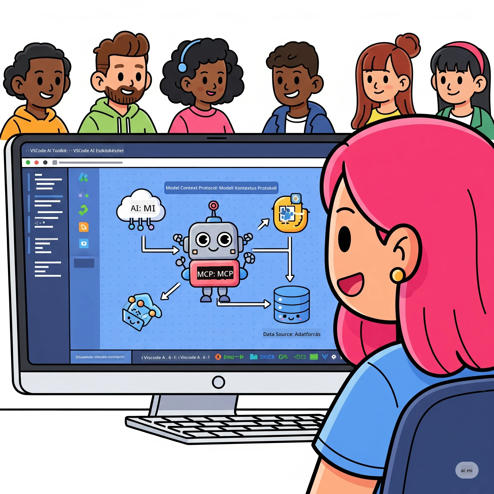
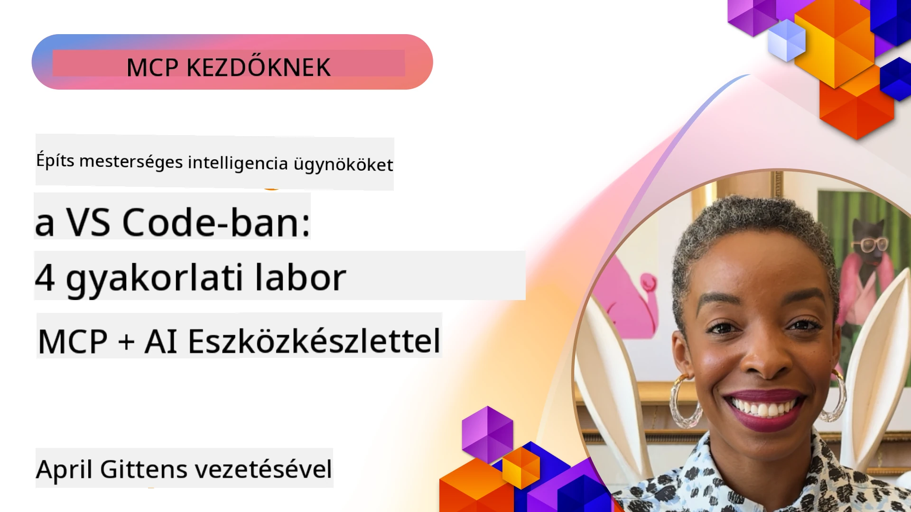

# AI Munkafolyamatok Egyszerűsítése: MCP Szerver Készítése Microsoft Foundry Toolkit-kel

## 🎯 Áttekintés

_(A fenti képre kattintva megtekinthető a lecke videója)_

Üdvözlünk a **Model Context Protocol (MCP) Műhelyben**! Ez az átfogó gyakorlati műhely két élvonalbeli technológiát egyesít, hogy forradalmasítsa az AI alkalmazásfejlesztést:

> **Kompatibilitási megjegyzés:** a műhely kódját az MCP
> `2025-11-25` verzióval építettük és teszteltük, amit a fenti jelvény is jelez. Használd a
> [aktuális `2026-07-28` specifikációt](https://modelcontextprotocol.io/specification/2026-07-28/)
> új protokollimplementációkhoz, és nézd át az SDK kiadási megjegyzéseket, mielőtt
> migrálnád a laborokat.

- **🔗 Model Context Protocol (MCP)**: Nyílt szabvány az AI-eszközök zökkenőmentes integrációjához
- **🛠️ Microsoft Foundry Toolkit Kiterjesztés VS Code-hoz**: A Microsoft erőteljes AI fejlesztői kiterjesztése

### 🎓 Amit megtanulsz

A műhely végére mesteri szintre emelheted az intelligens alkalmazások építését, amelyek összekapcsolják az AI modelleket a valódi eszközökkel és szolgáltatásokkal. Az automatizált teszteléstől a egyedi API integrációkig gyakorlati képességekre teszel szert összetett üzleti kihívások megoldásához.

## 🏗️ Technológiai Környezet

### 🔌 Model Context Protocol (MCP)

Az MCP az AI univerzális „USB-C”-je – egy általános szabvány, amely összeköti az AI modelleket külső eszközökkel és adatforrásokkal.

**✨ Fő jellemzők:**

- 🔄 **Szabványosított Integráció**: AI-eszköz kapcsolatok univerzális interfésze
- 🏛️ **Rugalmas Architektúra**: Helyi és távoli szerverek stdio/SSE közvetítéssel
- 🧰 **Gazdag Ökoszisztéma**: Eszközök, parancsok és erőforrások egy protokollban
- 🔒 **Vállalati Szintű**: Beépített biztonság és megbízhatóság

**🎯 Miért fontos az MCP:**
Ahogy az USB-C felszámolta a kábelkavalkádot, az MCP egyszerűsíti az AI-integrációkat. Egy protokoll, végtelen lehetőségek.

### 🤖 Microsoft Foundry Toolkit Kiterjesztés VS Code-hoz

A Microsoft zászlóshajó AI fejlesztői kiterjesztése, amely VS Code-ot AI erőművé alakítja.

**🚀 Alapvető képességek:**

- 📦 **Modellkatalógus**: Hozzáférés modellekhez az Azure AI, GitHub, Hugging Face, Ollama kínálatából
- ⚡ **Helyi Inferencia**: ONNX-optimalizált CPU/GPU/NPU futtatás
- 🏗️ **Agent Builder**: Vizualizált AI ügynökfejlesztés MCP integrációval
- 🎭 **Többmodalitás**: Szöveg-, látás- és strukturált kimenet támogatás

**💡 Fejlesztési előnyök:**

- Konfiguráció nélküli modell telepítés
- Vizualizált prompt tervezés
- Valós idejű tesztelési környezet
- Zökkenőmentes MCP szerver integráció

## 📚 Tanulási Út

### [🚀 1. modul: Microsoft Foundry Toolkit Alapjai](./lab1/README.md)

**Időtartam**: 15 perc

- 🛠️ Telepítsd és konfiguráld a Microsoft Foundry Toolkit-et VS Code-hoz
- 🗂️ Fedezd fel a Modellkatalógust (100+ modell GitHub, ONNX, OpenAI, Anthropic, Google kínálatból)
- 🎮 Sajátítsd el az Interaktív Játékteret valós idejű modellteszteléshez
- 🤖 Építsd meg első AI ügynöködet az Agent Builderrel
- 📊 Értékeld a modell teljesítményét beépített mutatókkal (F1, relevancia, hasonlóság, koherencia)
- ⚡ Tanuld meg a kötegelt feldolgozást és a többmodalitás támogatását

**🎯 Tanulási eredmény**: Funkcionális AI ügynök létrehozása mély Microsoft Foundry Toolkit ismeretekkel

### [🌐 2. modul: MCP Microsoft Foundry Toolkittel](./lab2/README.md)

**Időtartam**: 20 perc

- 🧠 Sajátítsd el a Model Context Protocol (MCP) architektúráját és fogalmait
- 🌐 Fedezd fel a Microsoft MCP szerver ökoszisztémáját
- 🤖 Építs böngészőautomatizációs ügynököt Playwright MCP szerverrel
- 🔧 Integráld az MCP szervereket a Microsoft Foundry Toolkit Agent Builderével
- 📊 Konfiguráld és teszteld az MCP eszközöket az ügynökökön belül
- 🚀 Exportáld és telepítsd MCP-vel támogatott ügynököket termelési alkalmazásra

**🎯 Tanulási eredmény**: AI ügynök telepítése, amely külső eszközökkel erősített MCP-t használ

### [🔧 3. modul: Haladó MCP Fejlesztés Microsoft Foundry Toolkit-kel](./lab3/README.md)

**Időtartam**: 20 perc

- 💻 Egyedi MCP szerverek létrehozása Microsoft Foundry Toolkit segítségével
- 🐍 Konfiguráld és használd a legújabb MCP Python SDK-t (v1.9.3)
- 🔍 Állítsd be és használd az MCP Inspector-t hibajavításhoz
- 🛠️ Építs professzionális hibakeresési munkafolyamatokkal Weather MCP Szervert
- 🧪 Hibakeresés MCP szervereken Agent Builderben és Inspector környezetben

**🎯 Tanulási eredmény**: Egyedi MCP szerverek fejlesztése és hibakeresése modern eszközökkel

### [🐙 4. modul: Gyakorlati MCP Fejlesztés – Egyedi GitHub Klón Szerver](./lab4/README.md)

**Időtartam**: 30 perc

- 🏗️ Valós GitHub Klón MCP Szerver építése fejlesztési munkafolyamatokhoz
- 🔄 Okos tároló klónozás megvalósítása érvényesítéssel és hibakezeléssel
- 📁 Intelligens könyvtárkezelés és VS Code integráció létrehozása
- 🤖 GitHub Copilot Ügynök mód használata egyedi MCP eszközökkel
- 🛡️ Termelésre alkalmas megbízhatóság és többplatformos kompatibilitás alkalmazása

**🎯 Tanulási eredmény**: Termelésre kész MCP szerver telepítése, amely egyszerűsíti a valós fejlesztési munkafolyamatokat

## 💡 Valós Alkalmazások és Hatás

### 🏢 Vállalati Használati Esetek

#### 🔄 DevOps Automatizáció

Alakítsd át fejlesztési folyamataidat intelligens automatizációval:

- **Okos Tárolókezelés**: AI-alapú kódellenőrzés és összevonási döntések
- **Intelligens CI/CD**: Kódváltozások alapján automatikus pipeline-optimalizáció
- **Hibakezelés Előszűrés**: Automatikus hibaklasszifikáció és hozzárendelés

#### 🧪 Minőségbiztosítás Forradalma

Emeld magasabb szintre a tesztelést AI-alapú automatizációval:

- **Intelligens Tesztgenerálás**: Átfogó tesztesetek automatikus létrehozása
- **Látványos Regressziós Tesztelés**: AI-vezérelt felhasználói felület változás-követés
- **Teljesítményfigyelés**: Proaktív problémafelismerés és megoldás

#### 📊 Adatfolyam Intelligencia

Építs okosabb adatfeldolgozási munkafolyamatokat:

- **Adaptív ETL Folyamatok**: Öntanuló adattranszformációk
- **Anomália Észlelés**: Valós idejű adatminőség-figyelés
- **Intelligens Útválasztás**: Okos adatáramlás-kezelés

#### 🎧 Ügyfélélmény Javítás

Teremts kivételes ügyfélinterakciókat:

- **Kontextusérzékeny Támogatás**: AI ügynökök ügyfél-előzményekhez férnek hozzá
- **Proaktív Hibamegoldás**: Előrejelző ügyfélszolgálat
- **Többcsatornás Integráció**: Egységes AI élmény platformokon át

## 🛠️ Előfeltételek és Beállítás

### 💻 Rendszerkövetelmények

| Összetevő | Követelmény | Megjegyzés |
|-----------|-------------|-----------|
| **Operációs rendszer** | Windows 10+, macOS 10.15+, Linux | Bármely modern OS |
| **Visual Studio Code** | Legújabb stabil verzió | Kötelező a Microsoft Foundry Toolkit-hez |
| **Node.js** | v18.0+ és npm | MCP szerver fejlesztéshez |
| **Python** | 3.10+ | Választható Python MCP szerverekhez |
| **Memória** | Minimum 8GB RAM | 16GB ajánlott helyi modellekhez |

### 🔧 Fejlesztői Környezet

#### Ajánlott VS Code Kiterjesztések

- **Microsoft Foundry Toolkit** (ms-windows-ai-studio.windows-ai-studio)
- **Python** (ms-python.python)
- **Python Hibakereső** (ms-python.debugpy)
- **GitHub Copilot** (GitHub.copilot) - Választható, de hasznos

#### Választható Eszközök

- **uv**: Modern Python csomagkezelő
- **MCP Inspector**: Vizualizált hibakereső eszköz MCP szerverekhez
- **Playwright**: Web automatizációs példákhoz

## 🎖️ Tanulási Eredmények és Tanúsítvány Áttekintés

### 🏆 Készség Mesterlista

E műhely elvégzésével mesterszintű jártasságot érsz el a következőkben:

#### 🎯 Alapvető Kompetenciák

- [ ] **MCP Protokoll Mesterfogalom**: Mély architektúra- és implementációs minták ismerete
- [ ] **Microsoft Foundry Toolkit Jártasság**: Szakértői szintű használat a gyors fejlesztéshez
- [ ] **Egyedi Szerverfejlesztés**: MCP szerverek építése, telepítése és karbantartása termelési környezetben
- [ ] **Eszköz Integráció Kiválóság**: Zökkenőmentes AI összekapcsolás létező fejlesztési munkafolyamatokkal
- [ ] **Problémamegoldó Alkalmazás**: Tanult készségek alkalmazása valós üzleti kihívásokra

#### 🔧 Technikai Készségek

- [ ] Microsoft Foundry Toolkit beállítása és konfigurálása VS Code-ban
- [ ] Egyedi MCP szerverek tervezése és megvalósítása
- [ ] GitHub Modellek integrálása az MCP architektúrával
- [ ] Automatizált tesztelési munkafolyamatok építése Playwright segítségével
- [ ] AI ügynökök termelési környezetbe telepítése
- [ ] MCP szerver teljesítményének hibakeresése és optimalizálása

#### 🚀 Haladó Képességek

- [ ] Vállalati szintű AI integrációk architektúrájának kidolgozása
- [ ] AI alkalmazások biztonsági legjobb gyakorlatainak megvalósítása
- [ ] Skálázható MCP szerver architektúrák tervezése
- [ ] Egyedi eszközláncok létrehozása specifikus területekhez
- [ ] Mások mentorálása AI-natív fejlesztésben

## 📖 További Források

- [MCP Specifikáció (2026-07-28)](https://modelcontextprotocol.io/specification/2026-07-28/)
- [Microsoft Foundry Toolkit GitHub Tároló](https://github.com/microsoft/vscode-ai-toolkit)
- [MCP Szerver Mintagyűjtemény](https://github.com/modelcontextprotocol/servers)
- [Legjobb Gyakorlatok Útmutató](https://modelcontextprotocol.io/docs/best-practices)
- [OWASP MCP Top 10](https://microsoft.github.io/mcp-azure-security-guide/mcp/) - Biztonsági legjobb gyakorlatok

---

**🚀 Készen állsz forradalmasítani AI fejlesztési munkafolyamatod?**

Építsük együtt az intelligens alkalmazások jövőjét MCP-vel és Microsoft Foundry Toolkit-tel!

## Mi következik

Folytasd a következővel: [11. modul: MCP Szerver Gyakorlati Laborok](../11-MCPServerHandsOnLabs/README.md)

---

<!-- CO-OP TRANSLATOR DISCLAIMER START -->
**Jogi nyilatkozat**:
Ez a dokumentum az AI fordítási szolgáltatás, a [Co-op Translator](https://github.com/Azure/co-op-translator) segítségével készült. Bár az pontosságra törekszünk, kérjük, vegye figyelembe, hogy az automatikus fordítások hibákat vagy pontatlanságokat tartalmazhatnak. Az eredeti dokumentum az anyanyelvén tekintendő hiteles forrásnak. Fontos információk esetén professzionális emberi fordítást javasolunk. Nem vállalunk felelősséget semmilyen félreértésért vagy téves értelmezésért, amely ebből a fordításból ered.
<!-- CO-OP TRANSLATOR DISCLAIMER END -->