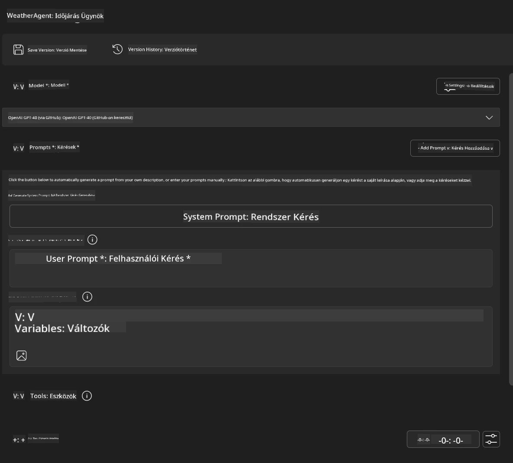
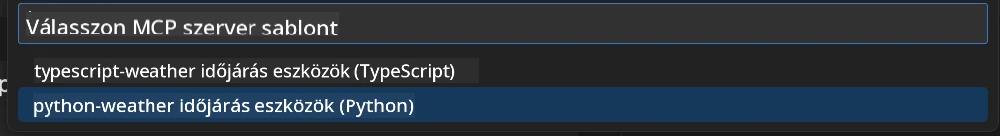
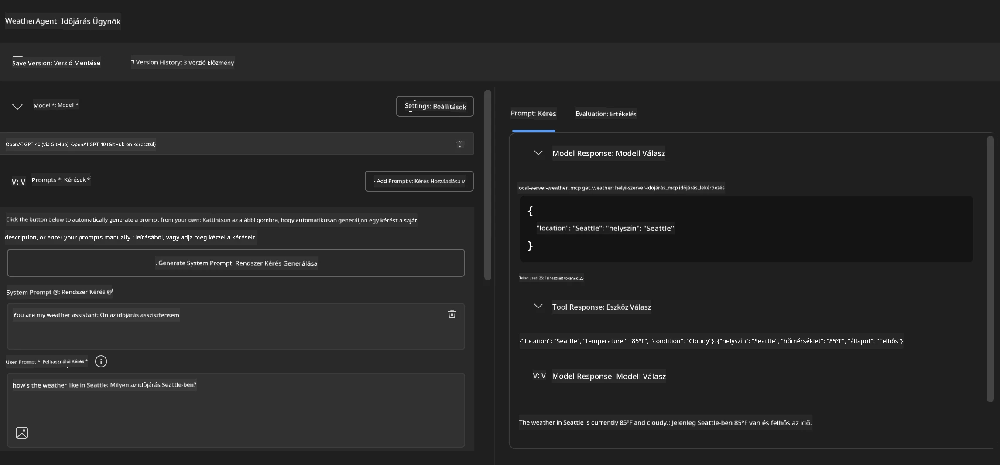
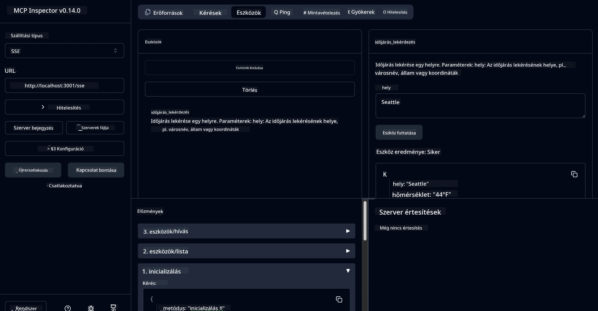

# 🔧 3. modul: Fejlett MCP fejlesztés Microsoft Foundry Toolkit-tel

> [!NOTE]
> Ebben a laborban az Inspector URL-ek a régi `/sse` végpontot használják, és a
> rögzített MCP SDK `1.9.3` és Inspector `0.14.0` függőségeket célozzák meg. Ezek nem
> a jelenlegi, `2026-07-28` dátumú Streamable HTTP példák.


## 🎯 Tanulási célok

A labor végére képes leszel:

- ✅ Egyéni MCP szerverek létrehozása a Microsoft Foundry Toolkit használatával
- ✅ A legfrissebb MCP Python SDK (v1.9.3) konfigurálása és használata
- ✅ Az MCP Inspector beállítása és használata hibakereséshez
- ✅ MCP szerverek hibakeresése Agent Builder és Inspector környezetben
- ✅ Haladó MCP szerver fejlesztési munkafolyamatok megértése

## 📋 Előfeltételek

- A 2. labor (MCP alapok) elvégzése
- VS Code Microsoft Foundry Toolkit bővítménnyel telepítve
- Python 3.10+ környezet
- Node.js és npm az Inspector beállításához

## 🏗️ Amit építeni fogsz

Ebben a laborban egy **Weather MCP szervert** készítesz, amely bemutatja:
- Egyedi MCP szerver implementáció
- Integráció a Microsoft Foundry Toolkit Agent Builder-rel
- Professzionális hibakeresési munkafolyamatok
- Modern MCP SDK használati minták

---

## 🔧 Alap komponensek áttekintése

### 🐍 MCP Python SDK
A Model Context Protocol Python SDK adja az alapot az egyedi MCP szerverek építéséhez. A 1.9.3 verziót fogod használni kibővített hibakeresési lehetőségekkel.

### 🔍 MCP Inspector
Egy erős hibakereső eszköz, amely biztosítja:
- Valós idejű szerverfigyelést
- Eszköz végrehajtásának vizualizálását
- Hálózati kérés/válasz vizsgálatát
- Interaktív tesztelési környezetet

---

## 📖 Lépésről lépésre megvalósítás

### 1. lépés: WeatherAgent létrehozása az Agent Builder-ben

1. **Indítsd el az Agent Builder-t** VS Code-ban a Microsoft Foundry Toolkit bővítményen keresztül
2. **Hozz létre egy új agent-et** a következő konfigurációval:
   - Agent név: `WeatherAgent`



### 2. lépés: MCP szerver projekt inicializálása

1. **Navigálj a Tools → Add Tool menüpontra** az Agent Builder-ben
2. **Válaszd az "MCP Server" opciót**
3. **Válaszd a "Create A new MCP Server" lehetőséget**
4. **Válaszd ki a `python-weather` sablont**
5. **Nevezd el a szerveredet:** `weather_mcp`



### 3. lépés: Projekt megnyitása és áttekintése

1. **Nyisd meg a generált projektet** VS Code-ban
2. **Tekintsd át a projekt szerkezetét:**
   ```
   weather_mcp/
   ├── src/
   │   ├── __init__.py
   │   └── server.py
   ├── inspector/
   │   ├── package.json
   │   └── package-lock.json
   ├── .vscode/
   │   ├── launch.json
   │   └── tasks.json
   ├── pyproject.toml
   └── README.md
   ```

### 4. lépés: Frissítés a legújabb MCP SDK-ra

> **🔍 Miért frissítsünk?** A legfrissebb MCP SDK-t (v1.9.3) és Inspector szolgáltatást (0.14.0) szeretnénk használni kibővített funkciók és jobb hibakeresés érdekében.

#### 4a. Python függőségek frissítése

**Szerkeszd a `pyproject.toml` fájlt:** frissítsd a [./code/weather_mcp/pyproject.toml](../../../../10-StreamliningAIWorkflowsBuildingAnMCPServerWithAIToolkit/lab3/code/weather_mcp/pyproject.toml) fájlt


#### 4b. Inspector konfiguráció frissítése

**Szerkeszd az `inspector/package.json` fájlt:** frissítsd a [./code/weather_mcp/inspector/package.json](../../../../10-StreamliningAIWorkflowsBuildingAnMCPServerWithAIToolkit/lab3/code/weather_mcp/inspector/package.json) fájlt

#### 4c. Inspector függőségek frissítése

**Szerkeszd az `inspector/package-lock.json` fájlt:** frissítsd a [./code/weather_mcp/inspector/package-lock.json](../../../../10-StreamliningAIWorkflowsBuildingAnMCPServerWithAIToolkit/lab3/code/weather_mcp/inspector/package-lock.json) fájlt

> **📝 Megjegyzés:** Ez a fájl részletes függőségdefiníciókat tartalmaz. Lentebb a lényegi szerkezet látható - a teljes tartalom biztosítja a helyes függőségfeloldást.


> **⚡ Teljes Package Lock:** A teljes package-lock.json fájl kb. 3000 sor függőségdefiníciót tartalmaz. A fentiek a kulcsfontosságú struktúrát mutatják - a teljes függőségfeloldáshoz használd a mellékelt fájlt.

### 5. lépés: VS Code hibakeresés konfigurálása

*Megjegyzés: Kérjük, másold a megadott helyen lévő fájlt, hogy lecseréld a helyi megfelelőjét*

#### 5a. Indítási konfiguráció frissítése

**Szerkeszd a `.vscode/launch.json` fájlt:**

```json
{
  "version": "0.2.0",
  "configurations": [
    {
      "name": "Attach to Local MCP",
      "type": "debugpy",
      "request": "attach",
      "connect": {
        "host": "localhost",
        "port": 5678
      },
      "presentation": {
        "hidden": true
      },
      "internalConsoleOptions": "neverOpen",
      "postDebugTask": "Terminate All Tasks"
    },
    {
      "name": "Launch Inspector (Edge)",
      "type": "msedge",
      "request": "launch",
      "url": "http://localhost:6274?timeout=60000&serverUrl=http://localhost:3001/sse#tools",
      "cascadeTerminateToConfigurations": [
        "Attach to Local MCP"
      ],
      "presentation": {
        "hidden": true
      },
      "internalConsoleOptions": "neverOpen"
    },
    {
      "name": "Launch Inspector (Chrome)",
      "type": "chrome",
      "request": "launch",
      "url": "http://localhost:6274?timeout=60000&serverUrl=http://localhost:3001/sse#tools",
      "cascadeTerminateToConfigurations": [
        "Attach to Local MCP"
      ],
      "presentation": {
        "hidden": true
      },
      "internalConsoleOptions": "neverOpen"
    }
  ],
  "compounds": [
    {
      "name": "Debug in Agent Builder",
      "configurations": [
        "Attach to Local MCP"
      ],
      "preLaunchTask": "Open Agent Builder",
    },
    {
      "name": "Debug in Inspector (Edge)",
      "configurations": [
        "Launch Inspector (Edge)",
        "Attach to Local MCP"
      ],
      "preLaunchTask": "Start MCP Inspector",
      "stopAll": true
    },
    {
      "name": "Debug in Inspector (Chrome)",
      "configurations": [
        "Launch Inspector (Chrome)",
        "Attach to Local MCP"
      ],
      "preLaunchTask": "Start MCP Inspector",
      "stopAll": true
    }
  ]
}
```

**Szerkeszd a `.vscode/tasks.json` fájlt:**

```
{
  "version": "2.0.0",
  "tasks": [
    {
      "label": "Start MCP Server",
      "type": "shell",
      "command": "python -m debugpy --listen 127.0.0.1:5678 src/__init__.py sse",
      "isBackground": true,
      "options": {
        "cwd": "${workspaceFolder}",
        "env": {
          "PORT": "3001"
        }
      },
      "problemMatcher": {
        "pattern": [
          {
            "regexp": "^.*$",
            "file": 0,
            "location": 1,
            "message": 2
          }
        ],
        "background": {
          "activeOnStart": true,
          "beginsPattern": ".*",
          "endsPattern": "Application startup complete|running"
        }
      }
    },
    {
      "label": "Start MCP Inspector",
      "type": "shell",
      "command": "npm run dev:inspector",
      "isBackground": true,
      "options": {
        "cwd": "${workspaceFolder}/inspector",
        "env": {
          "CLIENT_PORT": "6274",
          "SERVER_PORT": "6277",
        }
      },
      "problemMatcher": {
        "pattern": [
          {
            "regexp": "^.*$",
            "file": 0,
            "location": 1,
            "message": 2
          }
        ],
        "background": {
          "activeOnStart": true,
          "beginsPattern": "Starting MCP inspector",
          "endsPattern": "Proxy server listening on port"
        }
      },
      "dependsOn": [
        "Start MCP Server"
      ]
    },
    {
      "label": "Open Agent Builder",
      "type": "shell",
      "command": "echo ${input:openAgentBuilder}",
      "presentation": {
        "reveal": "never"
      },
      "dependsOn": [
        "Start MCP Server"
      ],
    },
    {
      "label": "Terminate All Tasks",
      "command": "echo ${input:terminate}",
      "type": "shell",
      "problemMatcher": []
    }
  ],
  "inputs": [
    {
      "id": "openAgentBuilder",
      "type": "command",
      "command": "ai-mlstudio.agentBuilder",
      "args": {
        "initialMCPs": [ "local-server-weather_mcp" ],
        "triggeredFrom": "vsc-tasks"
      }
    },
    {
      "id": "terminate",
      "type": "command",
      "command": "workbench.action.tasks.terminate",
      "args": "terminateAll"
    }
  ]
}
```


---

## 🚀 MCP szerver futtatása és tesztelése

### 6. lépés: Függőségek telepítése

A konfigurációs változtatások után futtasd a következő parancsokat:

**Python függőségek telepítése:**
```bash
uv sync
```

**Inspector függőségek telepítése:**
```bash
cd inspector
npm install
```

### 7. lépés: Hibakeresés az Agent Builder-rel

1. **Nyomd meg az F5-öt** vagy válaszd a **"Debug in Agent Builder"** konfigurációt
2. **Válaszd ki az összetett konfigurációt** a hibakereső panelen
3. **Várd meg, hogy elinduljon a szerver** és megnyíljon az Agent Builder
4. **Teszteld az időjárás MCP szerveredet** természetes nyelvű kérdésekkel

Írj be ilyen promptot

SYSTEM_PROMPT

```
You are my weather assistant
```

USER_PROMPT

```
How's the weather like in Seattle
```



### 8. lépés: Hibakeresés az MCP Inspectorral

1. **Használd a "Debug in Inspector"** konfigurációt (Edge vagy Chrome böngészőben)
2. **Nyisd meg az Inspector felületét** a `http://localhost:6274` címen
3. **Fedezd fel az interaktív tesztelési környezetet:**
   - Tekintsd meg az elérhető eszközöket
   - Teszteld az eszközök végrehajtását
   - Figyeld a hálózati kéréseket
   - Hibakeresd a szerver válaszokat



---

## 🎯 Fő tanulási eredmények

A labor elvégzésével:

- [x] **Egy egyedi MCP szervert hoztál létre** a Microsoft Foundry Toolkit sablonjai segítségével
- [x] **Frissítettél a legújabb MCP SDK verzióra** (v1.9.3) a kibővített funkciókért
- [x] **Konfiguráltál professzionális hibakeresési munkafolyamatokat** Agent Builder és Inspector környezetekhez
- [x] **Beállítottad az MCP Inspectort** az interaktív szerverteszteléshez
- [x] **Elsajátítottad a VS Code hibakeresési konfigurációit** MCP fejlesztéshez

## 🔧 Felfedezett fejlett funkciók

| Funkció | Leírás | Használati eset |
|---------|-------------|----------|
| **MCP Python SDK v1.9.3** | Legfrissebb protokoll implementáció | Modern szerver fejlesztés |
| **MCP Inspector 0.14.0** | Interaktív hibakereső eszköz | Valós idejű szervertesztelés |
| **VS Code hibakeresés** | Integrált fejlesztői környezet | Professzionális hibakeresési munkafolyamat |
| **Agent Builder integráció** | Közvetlen Microsoft Foundry Toolkit kapcsolat | Teljeskörű agent tesztelés |

## 📚 További források

- [MCP Python SDK dokumentáció](https://modelcontextprotocol.io/docs/sdk/python)
- [Microsoft Foundry Toolkit bővítmény útmutató](https://code.visualstudio.com/docs/ai/ai-toolkit)
- [VS Code hibakeresési dokumentáció](https://code.visualstudio.com/docs/editor/debugging)
- [Model Context Protocol specifikáció](https://modelcontextprotocol.io/docs/concepts/architecture)

---

**🎉 Gratulálunk!** Sikeresen teljesítetted a 3. labort, és most már képes vagy egyedi MCP szervereket létrehozni, hibakeresni és telepíteni professzionális fejlesztési munkafolyamatokkal.

### 🔜 Folytatás a következő modulra

Készen állsz, hogy alkalmazd MCP készségeidet egy valós fejlesztési munkafolyamatban? Folytasd a **[4. modul: Gyakorlati MCP fejlesztés - Egyedi GitHub klón szerver](../lab4/README.md)** modullal, ahol:
- Egy gyártásra kész MCP szervert építesz, amely automatizálja a GitHub tárhely műveleteit
- Implementálod a GitHub tárhely-klónozási funkciót MCP-n keresztül
- Egyedi MCP szervereket integrálsz VS Code-dal és GitHub Copilot Agent Mode-dal
- Teszteled és telepíted az egyedi MCP szervereket produkciós környezetben
- Gyakorlati munkafolyamat automatizálást tanulsz fejlesztők számára

---

<!-- CO-OP TRANSLATOR DISCLAIMER START -->
**Jogi nyilatkozat**:
Ez a dokumentum az AI fordítási szolgáltatás, a [Co-op Translator](https://github.com/Azure/co-op-translator) segítségével készült. Bár az pontosságra törekszünk, kérjük, vegye figyelembe, hogy az automatikus fordítások hibákat vagy pontatlanságokat tartalmazhatnak. Az eredeti dokumentum az anyanyelvén tekintendő hiteles forrásnak. Fontos információk esetén professzionális emberi fordítást javasolunk. Nem vállalunk felelősséget semmilyen félreértésért vagy téves értelmezésért, amely ebből a fordításból ered.
<!-- CO-OP TRANSLATOR DISCLAIMER END -->