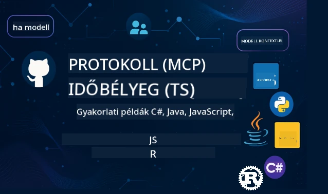

 

[](https://GitHub.com/microsoft/mcp-for-beginners/graphs/contributors)
[](https://GitHub.com/microsoft/mcp-for-beginners/issues)
[](https://GitHub.com/microsoft/mcp-for-beginners/pulls)
[](http://makeapullrequest.com)

[](https://GitHub.com/microsoft/mcp-for-beginners/watchers)
[](https://GitHub.com/microsoft/mcp-for-beginners/fork)
[](https://GitHub.com/microsoft/mcp-for-beginners/stargazers)


[](https://discord.gg/nTYy5BXMWG)

Kövesd ezeket a lépéseket, hogy elkezdd használni ezeket az erőforrásokat:
1. **Forkold le a tárolót**: Kattints [](https://GitHub.com/microsoft/mcp-for-beginners/fork)
2. **Klónozd le a tárolót**:   `git clone https://github.com/microsoft/mcp-for-beginners.git`
3. **Csatlakozz a** [](https://discord.gg/nTYy5BXMWG)


### 🌐 Többnyelvű támogatás

#### GitHub Action-on keresztül támogatott (Automatizált és Mindig Naprakész)

<!-- CO-OP TRANSLATOR LANGUAGES TABLE START -->
[Arabic](../ar/README.md) | [Bengali](../bn/README.md) | [Bulgarian](../bg/README.md) | [Burmese (Myanmar)](../my/README.md) | [Chinese (Simplified)](../zh-CN/README.md) | [Chinese (Traditional, Hong Kong)](../zh-HK/README.md) | [Chinese (Traditional, Macau)](../zh-MO/README.md) | [Chinese (Traditional, Taiwan)](../zh-TW/README.md) | [Croatian](../hr/README.md) | [Czech](../cs/README.md) | [Danish](../da/README.md) | [Dutch](../nl/README.md) | [Estonian](../et/README.md) | [Finnish](../fi/README.md) | [French](../fr/README.md) | [German](../de/README.md) | [Greek](../el/README.md) | [Hebrew](../he/README.md) | [Hindi](../hi/README.md) | [Hungarian](./README.md) | [Indonesian](../id/README.md) | [Italian](../it/README.md) | [Japanese](../ja/README.md) | [Kannada](../kn/README.md) | [Korean](../ko/README.md) | [Lithuanian](../lt/README.md) | [Malay](../ms/README.md) | [Malayalam](../ml/README.md) | [Marathi](../mr/README.md) | [Nepali](../ne/README.md) | [Nigerian Pidgin](../pcm/README.md) | [Norwegian](../no/README.md) | [Persian (Farsi)](../fa/README.md) | [Polish](../pl/README.md) | [Portuguese (Brazil)](../pt-BR/README.md) | [Portuguese (Portugal)](../pt-PT/README.md) | [Punjabi (Gurmukhi)](../pa/README.md) | [Romanian](../ro/README.md) | [Russian](../ru/README.md) | [Serbian (Cyrillic)](../sr/README.md) | [Slovak](../sk/README.md) | [Slovenian](../sl/README.md) | [Spanish](../es/README.md) | [Swahili](../sw/README.md) | [Swedish](../sv/README.md) | [Tagalog (Filipino)](../tl/README.md) | [Tamil](../ta/README.md) | [Telugu](../te/README.md) | [Thai](../th/README.md) | [Turkish](../tr/README.md) | [Ukrainian](../uk/README.md) | [Urdu](../ur/README.md) | [Vietnamese](../vi/README.md)

> **Inkább helyben szeretnéd klónozni?**

> Ez a tároló több mint 50 nyelvre lefordított anyagokat tartalmaz, ami jelentősen megnöveli a letöltési méretet. Ha le szeretnéd tölteni fordítások nélkül, használj sparse checkout-ot:
> ```bash
> git clone --filter=blob:none --sparse https://github.com/microsoft/mcp-for-beginners.git
> cd mcp-for-beginners
> git sparse-checkout set --no-cone '/*' '!translations' '!translated_images'
> ```
> Ezzel mindent megkapsz, ami a tanfolyam elvégzéséhez szükséges, sokkal gyorsabb letöltéssel.
<!-- CO-OP TRANSLATOR LANGUAGES TABLE END -->

# 🚀 Model Context Protocol (MCP) tananyag kezdőknek

## **Tanulj meg MCP-t kézzel fogható kódpéldákkal C#, Java, JavaScript, Rust, Python és TypeScript nyelven**

## 🧠 A Model Context Protocol tananyag áttekintése
Üdvözlünk az utadon a Model Context Protocol világában! Ha valaha is azon gondolkodtál, hogyan kommunikálnak az MI alkalmazások különböző eszközökkel és szolgáltatásokkal, most felfedezheted azt az elegáns megoldást, amely átformálja, hogyan építenek a fejlesztők intelligens rendszereket.

Gondolj az MCP-re úgy, mint egy univerzális fordítóra az MI alkalmazások számára – akárcsak ahogy az USB portok lehetővé teszik, hogy bármilyen eszközt csatlakoztass a számítógépedhez, az MCP lehetővé teszi, hogy az MI modellek bármilyen eszközzel vagy szolgáltatással egységes módon kapcsolódjanak. Akár az első chatbotodat építed, akár komplex MI munkafolyamatokon dolgozol, az MCP megértése megadja neked azt a képességet, hogy képesebb és rugalmasabb alkalmazásokat hozz létre.

Ez a tananyag türelemmel és gondossággal készült a tanulási utad támogatására. Egyszerű fogalmakkal kezdünk, amelyeket már ismersz, majd lépésről lépésre fejlesztjük a szakértelmedet gyakorlati példákon keresztül a kedvenc programozási nyelveden. Minden lépés világos magyarázatokat, gyakorlati példákat és sok bátorítást tartalmaz.

Amikor végigjársz ezen az úton, magabiztosan fogsz tudni saját MCP szervereket építeni, integrálni népszerű MI platformokkal, és megérted, hogyan formálja ez a technológia az MI fejlesztés jövőjét. Kezdjük el együtt ezt az izgalmas kalandot!

### Hivatalos dokumentáció és specifikációk

Ezek az erőforrások egyre értékesebbek lesznek, ahogy növekszik a tudásod, de ne érezd kötelezőnek, hogy mindent azonnal elolvass! Kezdd azzal, ami a leginkább érdekel!
- 📘 [MCP dokumentáció](https://modelcontextprotocol.io/) – Ez a fő útmutatód lépésről lépésre szóló oktatóanyagokkal és felhasználói kézikönyvekkel. A dokumentáció kezdőknek íródott, világos példákkal, amelyeket a saját tempódban követhetsz.
- 📜 [MCP specifikáció](https://modelcontextprotocol.io/docs/) – Tekintsd ezt az átfogó referencia kézikönyvednek. A tananyag során gyakran fogsz ide visszatérni, hogy részleteket nézz meg, és haladó funkciókat fedezz fel.
- 📜 [Eredeti MCP specifikáció](https://modelcontextprotocol.io/specification/versioning) – Ez további technikai részleteket tartalmaz, amelyek hasznosak lehetnek a haladó megvalósításokhoz. Ott van, amikor szükséged van rá, de kezdőknek nem kell aggódni emiatt.
- 🧑‍💻 [MCP GitHub tároló](https://github.com/modelcontextprotocol) – Itt SDK-kat, eszközöket és kódmintákat találsz több programozási nyelven. Ez egy gyakorlati példákból és készen használható komponensekből álló kincsesház.
- 🌐 [MCP közösség](https://github.com/orgs/modelcontextprotocol/discussions) – Csatlakozz más tanulókhoz és tapasztalt fejlesztőkhöz az MCP-ről szóló beszélgetésekben. Ez egy támogató közösség, ahol kérdésekre szívesen válaszolnak, és a tudás szabadon megosztott.

## Tanulási célok

A tananyag végére magabiztos és izgatott leszel az új képességeid miatt. Íme, mit fogsz elérni:

• **Érted az MCP alapjait**: Megérted, mi az a Model Context Protocol, és miért forradalmasítja az MI alkalmazások együttműködését, analógiák és érthető példák segítségével.

• **Megépíted az első MCP szerveredet**: Létrehozol egy működő MCP szervert a választott programozási nyelveden, egyszerű példákkal kezdve, lépésről lépésre fejlődve.

• **Összekapcsolod az MI modelleket valós eszközökkel**: Megtanulod, hogyan hidald át a szakadékot MI modellek és valódi szolgáltatások között, új és erőteljes képességeket adva az alkalmazásaidnak.

• **Biztonsági legjobb gyakorlatokat alkalmazol**: Megérted, hogyan tartsd biztonságban az MCP megvalósításaidat, védve az alkalmazásokat és a felhasználókat egyaránt.

• **Magabiztosan élesítesz**: Tudni fogod, hogyan juttasd el az MCP projektjeidet fejlesztésből éles környezetbe, való világban működő telepítési stratégiákkal.

• **Csatlakozol az MCP közösséghez**: Része leszel egy növekvő fejlesztői közösségnek, amely formálja az MI alkalmazásfejlesztés jövőjét.

## Szükséges háttér

Mielőtt belevágnánk az MCP részleteibe, győződjünk meg róla, hogy kényelmesen érzed magad alapfogalmakkal kapcsolatban. Ne aggódj, ha nem vagy szakértő ezekben a témákban – mindent elmagyarázunk menet közben!

### A protokollok megértése (Az alapok)

Gondolj a protokollra úgy, mint egy beszélgetés szabályaira. Amikor felhívsz egy barátot, mindketten tudjátok, hogy „szia”-val kezdtek, váltogatjátok a beszélgetést, és „viszlát”-tal fejezitek be. A számítógépes programoknak hasonló szabályokra van szükségük a hatékony kommunikációhoz.

Az MCP egy protokoll – egy egyeztetett szabályrendszer, amely segíti az MI modelleket és alkalmazásokat, hogy eredményesen „beszélgessenek” eszközökkel és szolgáltatásokkal. Ahogy egy beszélgetési protokoll gördülékenyebbé teszi az emberi kommunikációt, úgy teszi megbízhatóbbá és erőteljesebbé az MI alkalmazások közötti kommunikációt az MCP.

### Ügyfél-szerver kapcsolatok (Hogyan működnek együtt a programok)

Minden nap használsz ügyfél-szerver kapcsolatot! Amikor böngészőt (ügyfelet) használsz egy weboldal meglátogatására, kapcsolódsz egy webszerverhez, amely elküldi az oldal tartalmát. A böngésző tudja, hogyan kérjen információt, a szerver tudja, hogyan válaszoljon.

Az MCP-ben hasonló kapcsolat van: az MI modellek ügyfelekként működnek, amelyek információt vagy műveletet kérnek, míg az MCP szerverek ezeket a funkciókat szolgáltatják. Olyan, mint egy segítőkész asszisztens (a szerver), akit az MI megkérhet, hogy végezzen el bizonyos feladatokat.

### Miért fontos a szabványosítás (Hogy működjenek együtt a dolgok)

Képzeld el, hogy minden autógyártó más formájú benzinkútcsatlakozót használna – minden autóhoz külön adapter kellene! A szabványosítás közös megközelítéseket jelent, hogy a dolgok zökkenőmentesen működjenek együtt.

Az MCP biztosítja ezt a szabványosítást az MI alkalmazások számára. Ahelyett, hogy minden MI modellhez külön kód kellene, hogy működjön minden eszközzel, az MCP létrehoz egy egyetemes kommunikációs módot. Ez azt jelenti, hogy a fejlesztők egyszer építenek egy eszközt, és az sokféle MI rendszerrel működik majd.

## 🧭 A tanulási útvonal áttekintése

Az MCP tanulási utad gondosan felépített, hogy fokozatosan növelje a magabiztosságodat és képességeidet. Minden szakasz új fogalmakat mutat be, miközben megerősíti az eddig tanultakat.

### 🌱 Alapozó szakasz: Az alapok megértése (0-2. modulok)

Itt kezdődik a kalandod! Bemutatjuk az MCP fogalmait ismerős analógiák és egyszerű példák segítségével. Megérted, mi az MCP, miért létezik, és hogyan illeszkedik a nagyobb MI fejlesztési világba.

• **0. modul – Bevezetés az MCP-be**: Megvizsgáljuk, mi az MCP, és miért fontos a modern MI alkalmazások számára. Valós példákat mutatunk, és megérted, hogyan old meg az MCP gyakori problémákat, amelyekkel a fejlesztők szembesülnek.

• **1. modul – Alapvető fogalmak magyarázata**: Megtanulod az MCP lényegi építőköveit. Sok analógiát és vizuális példát használunk, hogy ezek a fogalmak természetesnek és érthetőnek tűnjenek.

• **2. modul – Biztonság az MCP-ben**: A biztonság ijesztőnek tűnhet, de megmutatjuk, hogyan tartalmaz az MCP beépített védelmi funkciókat, és megtanítunk a legjobb gyakorlatokra, amelyek az alkalmazásokat már az elejétől védenek.

### 🔨 Építő szakasz: Első megvalósítások létrehozása (3. modul)

Most kezdődik az igazi móka! Gyakorlati tapasztalatot szerzel valódi MCP szerverek és kliensek építésében. Ne aggódj – egyszerűen kezdjük, és minden lépésen végigvezetünk.

Ebben a modulban több gyakorlati útmutató található, amelyek lehetővé teszik, hogy a kiválasztott programozási nyelveden gyakorolj. Elkészíted az első szerveredet, építesz egy klienset, amely kapcsolódik hozzá, és még integrálod népszerű fejlesztőeszközökkel, például a VS Code-dal.
Minden útmutató teljes kódpéldákat, hibaelhárítási tippeket és magyarázatokat tartalmaz arról, hogy miért hozunk meg bizonyos tervezési döntéseket. Ennek a fázisnak a végére működő MCP megvalósításokkal fogsz rendelkezni, amire büszke lehetsz!

### 🚀 Növekedési fázis: Haladó koncepciók és valós alkalmazás (4-5 modulok)

Az alapok elsajátítása után készen állsz, hogy felfedezd az összetettebb MCP funkciókat. Gyakorlati megvalósítási stratégiákat, hibakeresési technikákat és haladó témákat, mint például a többmodális AI integrációja, fogunk lefedni.

Azt is megtanulod, hogyan méretezd az MCP megvalósításaidat termelési használatra és hogyan integráld őket felhőplatformokkal, mint az Azure. Ezek a modulok felkészítenek arra, hogy olyan MCP megoldásokat építs, amelyek képesek kezelni a valós igényeket.

### 🌟 Mesterfokozat fázis: Közösség és specializáció (6-11 modulok)

Az utolsó fázis a MCP közösséghez való csatlakozásra és az érdeklődésed szerinti területek specializálódására koncentrál. Megtanulod, hogyan járulj hozzá nyílt forráskódú MCP projektekhez, hogyan valósíts meg haladó hitelesítési mintákat, és építs átfogó, adatbázis-integrált megoldásokat.

A 11. modul külön említést érdemel – ez egy teljes 13 laboros gyakorlati tanulási út, amely megtanít, hogyan építs termelésre kész MCP szervereket PostgreSQL integrációval. Olyan, mint egy záróprojekt, amely összefoglalja mindazt, amit tanultál!

### 📚 Teljes tanterv felépítése

| Modul | Téma | Leírás | Link |
|--------|-------|-------------|------|
| **1-3 modulok: Alapok** | | | |
| 00 | Bevezetés az MCP-be | Áttekintés a Model Context Protocolról és annak jelentőségéről az AI folyamatokban | [Továbbiak](./00-Introduction/README.md) |
| 01 | Alapfogalmak magyarázata | Az MCP alapfogalmainak mélyreható vizsgálata | [Továbbiak](./01-CoreConcepts/README.md) |
| 02 | Biztonság az MCP-ben | Biztonsági fenyegetések és legjobb gyakorlatok | [Továbbiak](./02-Security/README.md) |
| 03 | Az MCP használatának megkezdése | Környezet beállítása, alapvető szerverek/kliensek, integráció | [Továbbiak](./03-GettingStarted/README.md) |
| **3. modul: Első szerver és kliens építése** | | | |
| 3.1 | Első szerver | Készítsd el első MCP szerveredet | [Útmutató](./03-GettingStarted/01-first-server/README.md) |
| 3.2 | Első kliens | Fejlessz egyszerű MCP klienst | [Útmutató](./03-GettingStarted/02-client/README.md) |
| 3.3 | Kliens LLM-mel | Nagy nyelvi modellek integrációja | [Útmutató](./03-GettingStarted/03-llm-client/README.md) |
| 3.4 | VS Code integráció | MCP szerverek fogyasztása VS Code-ban | [Útmutató](./03-GettingStarted/04-vscode/README.md) |
| 3.5 | stdio szerver | Szerverek létrehozása stdio transzporttal | [Útmutató](./03-GettingStarted/05-stdio-server/README.md) |
| 3.6 | HTTP streaming | HTTP streaming megvalósítása az MCP-ben | [Útmutató](./03-GettingStarted/06-http-streaming/README.md) |
| 3.7 | AI eszközkészlet | AI eszközkészlet használata az MCP-vel | [Útmutató](./03-GettingStarted/07-aitk/README.md) |
| 3.8 | Tesztelés | MCP szerver implementációjának tesztelése | [Útmutató](./03-GettingStarted/08-testing/README.md) |
| 3.9 | Telepítés | MCP szerverek telepítése éles környezetbe | [Útmutató](./03-GettingStarted/09-deployment/README.md) |
| 3.10 | Haladó szerverhasználat | Haladó szerverek használata fejlett funkciókhoz és jobb architektúrához | [Útmutató](./03-GettingStarted/10-advanced/README.md) |
| 3.11 | Egyszerű hitelesítés | Fejezet, amely az alapoktól mutat be hitelesítést és szerepköralapú hozzáférés-vezérlést (RBAC) | [Útmutató](./03-GettingStarted/11-simple-auth/README.md) |
| **4-5 modulok: Gyakorlati & haladó témák** | | | |
| 04 | Gyakorlati megvalósítás | SDK-k, hibakeresés, tesztelés, újrafelhasználható prompt sablonok | [Továbbiak](./04-PracticalImplementation/README.md) |
| 05 | Haladó témák az MCP-ben | Többmodális AI, méretezés, vállalati használat | [Továbbiak](./05-AdvancedTopics/README.md) |
| 5.1 | Azure integráció | MCP integráció az Azure-ral | [Útmutató](./05-AdvancedTopics/mcp-integration/README.md) |
| 5.2 | Többmodalitás | Több modalitással való munka | [Útmutató](./05-AdvancedTopics/mcp-multi-modality/README.md) |
| 5.3 | OAuth2 demonstráció | OAuth2 hitelesítés megvalósítása | [Útmutató](./05-AdvancedTopics/mcp-oauth2-demo/README.md) |
| 5.4 | Root kontextusok | Root kontextusok megértése és alkalmazása | [Útmutató](./05-AdvancedTopics/mcp-root-contexts/README.md) |
| 5.5 | Routing | MCP routing stratégiák | [Útmutató](./05-AdvancedTopics/mcp-routing/README.md) |
| 5.6 | Mintavételezés | Mintavételezési technikák az MCP-ben | [Útmutató](./05-AdvancedTopics/mcp-sampling/README.md) |
| 5.7 | Méretezés | MCP megvalósítások méretezése | [Útmutató](./05-AdvancedTopics/mcp-scaling/README.md) |
| 5.8 | Biztonság | Haladó biztonsági megfontolások | [Útmutató](./05-AdvancedTopics/mcp-security/README.md) |
| 5.9 | Web keresés | Webkeresési képességek megvalósítása | [Útmutató](./05-AdvancedTopics/web-search-mcp/README.md) |
| 5.10 | Valós idejű streaming | Valós idejű streaming funkció létrehozása | [Útmutató](./05-AdvancedTopics/mcp-realtimestreaming/README.md) |
| 5.11 | Valós idejű keresés | Valós idejű keresés megvalósítása | [Útmutató](./05-AdvancedTopics/mcp-realtimesearch/README.md) |
| 5.12 | Entra ID hitelesítés | Hitelesítés Microsoft Entra ID-vel | [Útmutató](./05-AdvancedTopics/mcp-security-entra/README.md) |
| 5.13 | Foundry integráció | Azure AI Foundry-val való integráció | [Útmutató](./05-AdvancedTopics/mcp-foundry-agent-integration/README.md) |
| 5.14 | Kontextus mérnökség | Hatékony kontextus mérnökségi technikák | [Útmutató](./05-AdvancedTopics/mcp-contextengineering/README.md) |
| 5.15 | MCP egyedi transzport | Egyedi transzport megvalósítások | [Útmutató](./05-AdvancedTopics/mcp-transport/README.md) |
| **6-10 modulok: Közösség & legjobb gyakorlatok** | | | |
| 06 | Közösségi hozzájárulások | Hogyan járulj hozzá az MCP ökoszisztémához | [Útmutató](./06-CommunityContributions/README.md) |
| 07 | Korai alkalmazás tanulságai | Valós implementációs történetek | [Útmutató](./07-LessonsFromEarlyAdoption/README.md) |
| 08 | Legjobb MCP gyakorlatok | Teljesítmény, hibabiztosság, robosztusság | [Útmutató](./08-BestPractices/README.md) |
| 09 | MCP esettanulmányok | Gyakorlati megvalósítási példák | [Útmutató](./09-CaseStudy/README.md) |
| 10 | Gyakorlati műhely | MCP szerver építése AI eszközkészlettel | [Labor](./10-StreamliningAIWorkflowsBuildingAnMCPServerWithAIToolkit/README.md) |
| **11. modul: MCP szerver gyakorlati labor** | | | |
| 11 | MCP szerver adatbázis integráció | Átfogó, 13 laborból álló gyakorlati tanulási út PostgreSQL integrációval | [Laborok](./11-MCPServerHandsOnLabs/README.md) |
| 11.1 | Bevezetés | Áttekintés az MCP-ről adatbázis integrációval és kiskereskedelmi elemzési esettel | [Labor 00](./11-MCPServerHandsOnLabs/00-Introduction/README.md) |
| 11.2 | Alap architektúra | MCP szerver architektúra, adatbázis rétegek és biztonsági minták megértése | [Labor 01](./11-MCPServerHandsOnLabs/01-Architecture/README.md) |
| 11.3 | Biztonság és többbérlős üzemmód | Sor szintű biztonság, hitelesítés és többbérlős adat-hozzáférés | [Labor 02](./11-MCPServerHandsOnLabs/02-Security/README.md) |
| 11.4 | Környezet beállítása | Fejlesztési környezet, Docker, Azure erőforrások beállítása | [Labor 03](./11-MCPServerHandsOnLabs/03-Setup/README.md) |
| 11.5 | Adatbázis tervezés | PostgreSQL beállítása, kiskereskedelmi séma tervezése, mintaadatok | [Labor 04](./11-MCPServerHandsOnLabs/04-Database/README.md) |
| 11.6 | MCP szerver megvalósítás | FastMCP szerver építése adatbázis integrációval | [Labor 05](./11-MCPServerHandsOnLabs/05-MCP-Server/README.md) |
| 11.7 | Eszköz fejlesztés | Adatbázis lekérdező eszközök és séma introspekció készítése | [Labor 06](./11-MCPServerHandsOnLabs/06-Tools/README.md) |
| 11.8 | Szemantikus keresés | Vektoros beágyazások megvalósítása Azure OpenAI és pgvector segítségével | [Labor 07](./11-MCPServerHandsOnLabs/07-Semantic-Search/README.md) |
| 11.9 | Tesztelés & hibakeresés | Tesztelési stratégiák, hibakereső eszközök és validálási módszerek | [Labor 08](./11-MCPServerHandsOnLabs/08-Testing/README.md) |
| 11.10 | VS Code integráció | VS Code MCP integráció és AI chat használat konfigurálása | [Labor 09](./11-MCPServerHandsOnLabs/09-VS-Code/README.md) |
| 11.11 | Telepítési stratégiák | Docker telepítés, Azure Container Apps és méretezési megfontolások | [Labor 10](./11-MCPServerHandsOnLabs/10-Deployment/README.md) |
| 11.12 | Megfigyelés | Application Insights, naplózás, teljesítményfigyelés | [Labor 11](./11-MCPServerHandsOnLabs/11-Monitoring/README.md) |
| 11.13 | Legjobb gyakorlatok | Teljesítményoptimalizálás, biztonság szilárdítása és éles üzem tippjei | [Labor 12](./11-MCPServerHandsOnLabs/12-Best-Practices/README.md) |

### 💻 Minta kódprojektek

Az MCP tanulásának egyik legizgalmasabb része az, hogy a kódolási képességeid fokozatosan fejlődnek. Arra törekedtünk, hogy a kódpéldáink egyszerűen induljanak, és egyre kifinomultabbá váljanak, ahogy mélyül a megértésed. Így mutatjuk be a koncepciókat – kódot, ami könnyen érthető, de valós MCP alapelveket demonstrál, így nem csak azt éred el, hogy megérted, mit csinál a kód, hanem azt is, hogy miért ilyen a felépítése és hogyan illeszkedik a nagyobb MCP alkalmazásokba.

#### Alap MCP számológép példák

| Nyelv | Leírás | Link |
|----------|-------------|------|
| C# | MCP szerver példa | [Kód megtekintése](./03-GettingStarted/samples/csharp/README.md) |
| Java | MCP számológép | [Kód megtekintése](./03-GettingStarted/samples/java/calculator/README.md) |
| JavaScript | MCP demo | [Kód megtekintése](./03-GettingStarted/samples/javascript/README.md) |
| Python | MCP szerver | [Kód megtekintése](../../03-GettingStarted/samples/python/mcp_calculator_server.py) |
| TypeScript | MCP példa | [Kód megtekintése](./03-GettingStarted/samples/typescript/README.md) |
| Rust | MCP példa | [Kód megtekintése](./03-GettingStarted/samples/rust/README.md) |

#### Haladó MCP megvalósítások

| Nyelv | Leírás | Link |
|----------|-------------|------|
| C# | Haladó példa | [Kód megtekintése](./04-PracticalImplementation/samples/csharp/README.md) |
| Java Spring keretben | Container App példa | [Kód megtekintése](./04-PracticalImplementation/samples/java/containerapp/README.md) |
| JavaScript | Haladó példa | [Kód megtekintése](./04-PracticalImplementation/samples/javascript/README.md) |
| Python | Összetett megvalósítás | [Kód megtekintése](../../04-PracticalImplementation/samples/python/READMEmd) |
| TypeScript | Container példa | [Kód megtekintése](./04-PracticalImplementation/samples/typescript/README.md) |


## 🎯 Az MCP tanulás előfeltételei

Ahhoz, hogy a legtöbbet hozd ki ebből a tantervből, rendelkezned kell:

- Alapvető programozási ismeretekkel legalább az alábbi nyelvek egyikében: C#, Java, JavaScript, Python vagy TypeScript
- Ügyfél-szerver modell és API-k megértése
- Ismeretek REST és HTTP fogalmakban
- (Opcionális) Háttér az AI/ML koncepciókban

- Csatlakozás a közösségi beszélgetéseinkhez támogatásért

## 📚 Tanulási útmutató és források

Ez a tároló több forrást is tartalmaz, hogy segítsen hatékonyan eligazodni és tanulni:

### Tanulási útmutató

Egy átfogó [Tanulási útmutató](./study_guide.md) áll rendelkezésre, amely segít hatékonyan navigálni ebben a tárolóban. Ez a vizuális tantervtérkép megmutatja, hogyan kapcsolódnak egymáshoz a témák, és útmutatást ad a minta projektek hatékony használatához. Különösen hasznos, ha vizuális típus vagy, aki szeret átfogó képet látni.

Az útmutató tartalmazza:
- Vizuális tantervtérképet az összes lefedett témáról
- Részletes lebontást a tároló minden szakaszáról
- Útmutatást a minta projektek használatához
- Ajánlott tanulási útvonalakat különböző ismereti szintekhez
- További forrásokat tanulási utad kiegészítésére

### Verziókövetés (Changelog)

Részletes [Verziókövetés](./changelog.md)-et vezetünk a tananyagok jelentős frissítéseiről, hogy naprakész legyél a legújabb fejlesztésekkel és bővítésekkel.
- Új tartalom hozzáadások
- Strukturális változások
- Funkciófejlesztések
- Dokumentációs frissítések

## 🛠️ Hogyan használd hatékonyan ezt a tantervet

Minden lecke ebben az útmutatóban tartalmaz:
1. Világos magyarázatok az MCP fogalmairól  
2. Élő kódpéldák több programozási nyelven  
3. Gyakorlatok valós MCP alkalmazások építéséhez  
4. További források haladóknak

## Kérésre elérhető tartalom

### [MCP Dev Days 2025 július](https://developer.microsoft.com/en-us/reactor/series/S-1563/)
#### [➡️Nézze meg kérésre - MCP Dev Days](https://developer.microsoft.com/en-us/reactor/series/S-1563/)
Készüljön fel két nap mély technikai betekintésre, közösségi kapcsolatokra és gyakorlati tanulásra az MCP Dev Days rendezvényen, amely a Model Context Protocol-ra (MCP) fókuszáló virtuális esemény — az AI modelleket és az azokat támogató eszközöket összekötő új szabvány.
Az MCP Dev Days-et az esemény oldalunkon regisztrálva nézheti meg: https://aka.ms/mcpdevdays.

#### [1. nap: MCP termelékenység, fejlesztői eszközök és közösség:](https://developer.microsoft.com/en-us/reactor/series/S-1563/)

Az a fejlesztők hatékony MCP használatának elősegítéséről és az MCP közösség ünnepléséről szól. Közösségi tagokkal és partnerekkel, mint az Arcade, Block, Okta és Neon együttműködve mutatjuk be, hogyan alakítják egy nyitott, bővíthető MCP ökoszisztéma jövőjét. Valós demók VS Code, Visual Studio, GitHub Copilot és népszerű közösségi eszközök terén  
Gyakorlati, kontextus-alapú fejlesztői munkafolyamatok  
Közösségi vezetésű előadások és betekintések  
Akár most ismerkedik az MCP-vel, akár már épít vele, az 1. nap inspirációt és megvalósítható ötleteket nyújt.

#### [2. nap: MCP szerverek magabiztos építése](https://developer.microsoft.com/en-us/reactor/series/S-1563/)

Az MCP elszánt építőinek. Mélyebb betekintést nyújtunk a megvalósítási stratégiákba és legjobb gyakorlatokba MCP szerverek létrehozásához és az MCP integrálásához AI munkafolyamataiba.

#### Témák közé tartoznak:

- MCP szerverek építése és beintegrálása ügynökélményekbe  
- Prompt vezérelt fejlesztés  
- Biztonsági legjobb gyakorlatok  
- Építőelemek használata, mint például Functions, ACA és API Management  
- Regisztráció összehangolása és eszközök (első fél + harmadik fél)

Ha fejlesztő, eszközépítő vagy AI termékstratég, ez a nap tele van a skálázható, biztonságos és jövőálló MCP megoldások építéséhez szükséges betekintésekkel.

### MCP Boot Camp 2025 augusztus  
Intenzív videós foglalkozásokon tanulja meg, hogyan hozhat létre MCP szervereket, hogyan integrálhatja azokat a VS Code-dal és hogyan telepíthet professzionálisan Azure-ra az MCP kezdőknek szóló tananyag alapján. Gyakorlati készségekkel távozhat egy olyan technológiában, amelyet a nagyvállalatok már használnak.

#### [➡️Nézze meg kérésre MCP Bootcamp | Angol](https://developer.microsoft.com/en-us/reactor/series/s-1568/)  
#### [➡️Nézze meg kérésre MCP Bootcamp | Brazília](https://developer.microsoft.com/en-us/reactor/series/S-1566/)  
#### [➡️Nézze meg kérésre MCP Bootcamp | Spanyol](https://developer.microsoft.com/en-us/reactor/series/S-1567/)

### Tanuljunk MCP-t C#-mal - Oktató sorozat  
Ismerjük meg a Model Context Protocol-t (MCP), egy élvonalbeli keretrendszert, amely szabványosítja az AI modellek és kliensalkalmazások közötti interakciókat. Ebben a kezdőbarát alkalomban bemutatjuk az MCP-t és végigvezetjük első MCP szerver létrehozásán.  
#### C#: [https://aka.ms/letslearnmcp-csharp](https://aka.ms/letslearnmcp-csharp)  
#### Java: [https://aka.ms/letslearnmcp-java](https://aka.ms/letslearnmcp-java)  
#### JavaScript: [https://aka.ms/letslearnmcp-javascript](https://aka.ms/letslearnmcp-javascript)  
#### Python: [https://aka.ms/letslearnmcp-python](https://aka.ms/letslearnmcp-python)

## 🎓 Az MCP utazása most kezdődik

Gratulálunk! Éppen megkezdte izgalmas utazását, amely kibővíti programozási képességeit és összekapcsolja a mesterséges intelligencia fejlesztésének élvonalával.

### Amit már elért  

Ezen bevezető elolvasásával már elkezdte saját MCP tudásalapjának kiépítését. Értette, mi az MCP, miért fontos, és hogyan támogatja majd ez a tananyag az Ön tanulását. Ez jelentős eredmény és az Ön szakértelmének kezdete ebben a fontos technológiában.

### Az előttünk álló kaland

Ahogy halad a modulokon át, ne feledje: minden szakértő egyszer kezdő volt. Azok az elképzelések, amelyek most bonyolultnak tűnnek, természetessé válnak majd az ismétléssel és alkalmazással. Minden apró lépés hatalmas képességekhez vezet, amelyek végigkísérik az Ön fejlesztői karrierjét.

### A támogatói hálózata

Csatlakozik egy tanulókból és szakértőkből álló közösséghez, akik szenvedélyesen dolgoznak az MCP-n, és készségesen segítik a másokat a sikerben. Akár elakad egy kódolási kihívásnál, akár megosztaná áttörését, a közösség itt van, hogy támogassa Önt.

Ha elakad vagy kérdése van az AI alkalmazásfejlesztéssel kapcsolatban, csatlakozzon más tanulókhoz és tapasztalt fejlesztőkhöz az MCP körüli beszélgetésekben! Ez egy támogató közösség, ahol a kérdések szívesen látottak és a tudás szabadon megosztott.

[](https://discord.gg/nTYy5BXMWG)

Ha termék-visszajelzése van vagy hibákba ütközik építés közben, látogasson el ide:

[](https://aka.ms/foundry/forum)

### Készen áll a kezdésre?

Az Ön MCP kalandja most kezdődik! Kezdje a 0. modullal, hogy belevágjon első gyakorlati MCP élményeibe, vagy fedezze fel a mintaprojekteket, hogy lássa, mit fog építeni. Ne feledje — minden szakértő pontosan ott kezdte, ahol most Ön tart, és türelemmel, gyakorlással lenyűgöző dolgokra lesz képes.

Üdv a Model Context Protocol fejlesztésének világában. Építsünk együtt valami nagyszerűt!

## 🤝 A tanuló közösséghez való hozzájárulás

Ez a tananyag az Önök, tanulók hozzájárulásával erősödik! Legyen szó elütési hibák javításáról, világosabb magyarázat javaslatáról vagy új példák hozzáadásáról, az Ön munkája más kezdők sikerét segíti elő.

Köszönet a Microsoft értékes szakértőjének, [Shivam Goyal](https://www.linkedin.com/in/shivam2003/), aki kódmintákkal járult hozzá.

A hozzájárulási folyamat barátságos és támogató. A legtöbb hozzájáruláshoz hozzájárulói licencszerződés (CLA) szükséges, de az automatikus eszközök végigvezetik az Ön folyamatát zökkenőmentesen.

## 📜 Nyílt forráskódú tanulás

Az egész tananyag az MIT [LICENSE](../../LICENSE) engedélye alatt érhető el, ami azt jelenti, hogy szabadon használhatja, módosíthatja és megoszthatja. Ez támogatja küldetésünket, hogy az MCP tudás minden fejlesztő számára hozzáférhető legyen.

## 🤝 Hozzájárulási irányelvek

Ez a projekt szívesen fogad hozzájárulásokat és javaslatokat. A legtöbb hozzájáruláshoz el kell fogadnia egy Hozzájárulói Licencszerződést (CLA), amely igazolja, hogy jogosult és ténylegesen engedélyezi hozzájárulásának használatát. Részletekért látogasson el ide: <https://cla.opensource.microsoft.com>.

Ha pull kérést nyújt be, egy CLA bot automatikusan megállapítja, szükséges-e CLA-t biztosítania, és ennek megfelelően jelöli meg a PR-t (például státusz ellenőrzéssel, hozzászólással). Egyszerűen kövesse a bot által adott utasításokat. Csak egyszer kell ezt elvégeznie az összes olyan repó esetében, amely a CLA-t használja.

Ez a projekt a [Microsoft Nyílt Forráskódú Magatartási Kódexét](https://opensource.microsoft.com/codeofconduct/) alkalmazza. További információkért tekintse meg a [Magatartási Kódex GYIK](https://opensource.microsoft.com/codeofconduct/faq/) oldalát, vagy vegye fel a kapcsolatot az [opencode@microsoft.com](mailto:opencode@microsoft.com) címen bármilyen további kérdés vagy észrevétel esetén.

---

*Készen áll az MCP utazására? Kezdje a [00. Modul - Bevezetés az MCP-be](./00-Introduction/README.md) anyaggal, és tegye meg első lépéseit a Model Context Protocol fejlesztésének világában!*

## 🎒 Egyéb tanfolyamok  
Csapatunk más tanfolyamokat is készít! Nézze meg:

<!-- CO-OP TRANSLATOR OTHER COURSES START -->
### LangChain  
[](https://aka.ms/langchain4j-for-beginners)  
[](https://aka.ms/langchainjs-for-beginners?WT.mc_id=m365-94501-dwahlin)

---

### Azure / Edge / MCP / Ügynökök  
[](https://github.com/microsoft/AZD-for-beginners?WT.mc_id=academic-105485-koreyst)  
[](https://github.com/microsoft/edgeai-for-beginners?WT.mc_id=academic-105485-koreyst)  
[](https://github.com/microsoft/mcp-for-beginners?WT.mc_id=academic-105485-koreyst)  
[](https://github.com/microsoft/ai-agents-for-beginners?WT.mc_id=academic-105485-koreyst)

---

### Generatív AI sorozat  
[](https://github.com/microsoft/generative-ai-for-beginners?WT.mc_id=academic-105485-koreyst)  
[-9333EA?style=for-the-badge&labelColor=E5E7EB&color=9333EA)](https://github.com/microsoft/Generative-AI-for-beginners-dotnet?WT.mc_id=academic-105485-koreyst)  
[-C084FC?style=for-the-badge&labelColor=E5E7EB&color=C084FC)](https://github.com/microsoft/generative-ai-for-beginners-java?WT.mc_id=academic-105485-koreyst)  
[-E879F9?style=for-the-badge&labelColor=E5E7EB&color=E879F9)](https://github.com/microsoft/generative-ai-with-javascript?WT.mc_id=academic-105485-koreyst)

---

### Alapvető tananyagok  
[](https://aka.ms/ml-beginners?WT.mc_id=academic-105485-koreyst)  
[](https://aka.ms/datascience-beginners?WT.mc_id=academic-105485-koreyst)  
[](https://aka.ms/ai-beginners?WT.mc_id=academic-105485-koreyst)  
[](https://github.com/microsoft/Security-101?WT.mc_id=academic-96948-sayoung)
[](https://aka.ms/webdev-beginners?WT.mc_id=academic-105485-koreyst)
[](https://aka.ms/iot-beginners?WT.mc_id=academic-105485-koreyst)
[](https://github.com/microsoft/xr-development-for-beginners?WT.mc_id=academic-105485-koreyst)

---
 
### Copilot Sorozat
[](https://aka.ms/GitHubCopilotAI?WT.mc_id=academic-105485-koreyst)
[](https://github.com/microsoft/mastering-github-copilot-for-dotnet-csharp-developers?WT.mc_id=academic-105485-koreyst)
[](https://github.com/microsoft/CopilotAdventures?WT.mc_id=academic-105485-koreyst)
<!-- CO-OP TRANSLATOR OTHER COURSES END -->

---

<!-- CO-OP TRANSLATOR DISCLAIMER START -->
**Felelősségkorlátozás**:
Ez a dokumentum az AI fordító szolgáltatás, a [Co-op Translator](https://github.com/Azure/co-op-translator) segítségével készült. Bár a pontosságra törekszünk, kérjük, vegye figyelembe, hogy az automatikus fordítások hibákat vagy pontatlanságokat tartalmazhatnak. Az eredeti, anyanyelvű dokumentum tekintendő hiteles forrásnak. Fontos információk esetén szakmai, emberi fordítást javaslunk. Nem vállalunk felelősséget semmilyen félreértésért vagy félreértelmezésért, amely ebből a fordításból ered.
<!-- CO-OP TRANSLATOR DISCLAIMER END -->