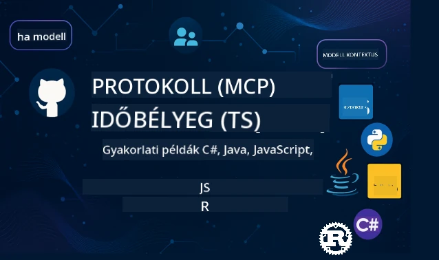

 

[](https://GitHub.com/microsoft/mcp-for-beginners/graphs/contributors)
[](https://GitHub.com/microsoft/mcp-for-beginners/issues)
[](https://GitHub.com/microsoft/mcp-for-beginners/pulls)
[](http://makeapullrequest.com)

[](https://GitHub.com/microsoft/mcp-for-beginners/watchers)
[](https://GitHub.com/microsoft/mcp-for-beginners/fork)
[](https://GitHub.com/microsoft/mcp-for-beginners/stargazers)


[](https://discord.gg/nTYy5BXMWG)

Kövesd az alábbi lépéseket, hogy elkezdhess dolgozni ezekkel az erőforrásokkal:
1. **Forkold a tárolót**: Kattints ide [](https://GitHub.com/microsoft/mcp-for-beginners/fork)
2. **Klonozd a tárolót**:   `git clone https://github.com/microsoft/mcp-for-beginners.git`
3. **Csatlakozz a** [](https://discord.gg/nTYy5BXMWG)


### 🌐 Többnyelvű támogatás

#### GitHub Action által támogatott (Automatizált és Mindig Naprakész)

<!-- CO-OP TRANSLATOR LANGUAGES TABLE START -->
[Arab](../ar/README.md) | [Bengáli](../bn/README.md) | [Bolgár](../bg/README.md) | [Burmai (Mianmar)](../my/README.md) | [Kínai (Egyszerűsített)](../zh-CN/README.md) | [Kínai (Hagyományos, Hong Kong)](../zh-HK/README.md) | [Kínai (Hagyományos, Makaó)](../zh-MO/README.md) | [Kínai (Hagyományos, Tajvan)](../zh-TW/README.md) | [Horvát](../hr/README.md) | [Cseh](../cs/README.md) | [Dán](../da/README.md) | [Holland](../nl/README.md) | [Észt](../et/README.md) | [Finn](../fi/README.md) | [Francia](../fr/README.md) | [Német](../de/README.md) | [Görög](../el/README.md) | [Héber](../he/README.md) | [Hindi](../hi/README.md) | [Magyar](./README.md) | [Indonéz](../id/README.md) | [Olasz](../it/README.md) | [Japán](../ja/README.md) | [Kannada](../kn/README.md) | [Koreai](../ko/README.md) | [Litván](../lt/README.md) | [Maláj](../ms/README.md) | [Malayalam](../ml/README.md) | [Maráthi](../mr/README.md) | [Nepáli](../ne/README.md) | [Nigériai Pidgin](../pcm/README.md) | [Norvég](../no/README.md) | [Perzsa (Fárszi)](../fa/README.md) | [Lengyel](../pl/README.md) | [Portugál (Brazília)](../pt-BR/README.md) | [Portugál (Portugália)](../pt-PT/README.md) | [Pandzsábi (Gurmukhi)](../pa/README.md) | [Román](../ro/README.md) | [Orosz](../ru/README.md) | [Szerb (Cirill)](../sr/README.md) | [Szlovák](../sk/README.md) | [Szlovén](../sl/README.md) | [Spanyol](../es/README.md) | [Szuahéli](../sw/README.md) | [Svéd](../sv/README.md) | [Tagalog (Filipino)](../tl/README.md) | [Tamil](../ta/README.md) | [Telugu](../te/README.md) | [Thai](../th/README.md) | [Török](../tr/README.md) | [Ukrán](../uk/README.md) | [Urdu](../ur/README.md) | [Vietnami](../vi/README.md)

> **Inkább helyben szeretnéd klónozni?**
>
> Ez a tároló több mint 50 nyelvi fordítást tartalmaz, ami jelentősen megnöveli a letöltési méretet. Ha fordítások nélkül szeretnéd klónozni, használj sparse checkout-ot:
>
> **Bash / macOS / Linux:**
> ```bash
> git clone --filter=blob:none --sparse https://github.com/microsoft/mcp-for-beginners.git
> cd mcp-for-beginners
> git sparse-checkout set --no-cone '/*' '!translations' '!translated_images'
> ```
>
> **CMD (Windows):**
> ```cmd
> git clone --filter=blob:none --sparse https://github.com/microsoft/mcp-for-beginners.git
> cd mcp-for-beginners
> git sparse-checkout set --no-cone "/*" "!translations" "!translated_images"
> ```
>
> Ez mindent megad, amire szükséged van a kurzus elvégzéséhez, sokkal gyorsabb letöltéssel.
<!-- CO-OP TRANSLATOR LANGUAGES TABLE END -->

# 🚀 Model Context Protocol (MCP) tanterv kezdőknek

## **Tanulj MCP-t kézzel fogható kódpéldákon keresztül C#, Java, JavaScript, Rust, Python és TypeScript nyelveken**

## 🧠 A Model Context Protocol tantervének áttekintése
Üdvözlünk az utadon a Model Context Protocol világában! Ha valaha is kíváncsi voltál, hogyan kommunikálnak az AI alkalmazások különféle eszközökkel és szolgáltatásokkal, most felfedezheted azt a kifinomult megoldást, amely átalakítja, hogyan építenek a fejlesztők intelligens rendszereket.

Gondolj az MCP-re úgy, mint az AI alkalmazások univerzális fordítójára – ahogy az USB portok lehetővé teszik bármilyen eszköz csatlakoztatását a számítógépedhez, úgy az MCP is lehetővé teszi, hogy bármely AI modell bármilyen eszközhöz vagy szolgáltatáshoz szabványos módon kapcsolódjon. Akár az első chatbotodat építed, akár összetett AI munkafolyamatokat valósítasz meg, az MCP megértése hatalmas lehetőséget ad arra, hogy rugalmasabb és erősebb alkalmazásokat hozz létre.

Ez a tanterv türelemmel és gondossággal készült az oktatási utadhoz. Egyszerű, már ismert fogalmakkal kezdünk, és fokozatosan építjük a tudásod kézzel fogható gyakorlatokon keresztül a kedvenc programozási nyelveden. Minden lépésnél érthető magyarázatokat, gyakorlati példákat és sok bátorítást kapsz.

Amikor befejezed ezt az utat, magabiztos leszel saját MCP szerverek építésében, integrálásában népszerű AI platformokkal, és megérted, hogyan formálja ez a technológia az AI fejlesztés jövőjét. Kezdjük el ezt az izgalmas kalandot együtt!

### Hivatalos dokumentáció és specifikációk

Ez a tanterv összhangban van a **MCP Specifikáció 2025-11-25** verzióval (a legfrissebb stabil kiadás). Az MCP specifikáció dátum alapú verziózást használ (ÉÉÉÉ-HH-NN formátum), hogy világos legyen a protokoll verziókövetése.

Ezek az anyagok annál értékesebbek lesznek, minél jobban megérted a témát, de ne érezd kényszernek, hogy mindent azonnal olvass el. Kezdd az érdeklődési körödnek megfelelő részekkel!
- 📘 [MCP dokumentáció](https://modelcontextprotocol.io/) – Ez az alapvető forrásod lépésről lépésre szóló oktatóanyagokkal és felhasználói útmutatókkal. A dokumentáció kezdőknek készült, tiszta példákat tartalmaz, amelyeket saját tempóban követhetsz.
- 📜 [MCP specifikáció](https://modelcontextprotocol.io/specification/2025-11-25) – Tekintsd ezt átfogó referencia kézikönyvnek. Ahogy haladsz a tananyagban, sokszor fogsz visszatérni ide, hogy részletes információkat és fejlett funkciókat nézz meg.
- 📜 [MCP specifikáció verziózás](https://modelcontextprotocol.io/specification/versioning) – Információkat tartalmaz a protokoll verziótörténetéről és arról, hogyan használja az MCP a dátumalapú verziózást.
- 🧑‍💻 [MCP GitHub tároló](https://github.com/modelcontextprotocol) – Itt találod az SDK-kat, eszközöket és kódpéldákat több programozási nyelven. Olyan, mint egy kincsesbánya gyakorlati példákból és használatra kész komponensekből.
- 🌐 [MCP közösség](https://github.com/orgs/modelcontextprotocol/discussions) – Csatlakozz más tanulókhoz és tapasztalt fejlesztőkhöz az MCP-vel kapcsolatos beszélgetésekben. Egy támogató közösség, ahol a kérdésekhez bátorítanak, és a tudás szabadon megosztható.
  
## Tanulási célok

A tanterv végére magabiztos és izgatott leszel az új képességeid miatt. Íme, mit fogsz elérni:

• **Megérted az MCP alapjait**: Megérted, mi az a Model Context Protocol, és miért forradalmasítja az AI alkalmazások együttműködését, érthető analógiákkal és példákkal.

• **Megépíted az első MCP szerveredet**: Készítesz működő MCP szervert a kedvenc programozási nyelveden, egyszerű példákkal kezdve, lépésről lépésre haladva.

• **Csatlakoztatod az AI modelleket valós eszközökhöz**: Megtanulod, hogyan hidald át a szakadékot az AI modellek és a valódi szolgáltatások között, ezzel hatalmas új képességeket adva az alkalmazásaidnak.

• **Megvalósítod a biztonság legjobb gyakorlatait**: Megérted, hogyan tarthatod biztonságban az MCP megvalósításaidat, védve mind az alkalmazásaidat, mind a felhasználóidat.

• **Magabiztosan telepítesz**: Tudni fogod, hogyan juttasd el az MCP projektjeidet a fejlesztéstől az éles környezetig, gyakorlati telepítési stratégiákkal, amelyek a való életben is működnek.

• **Csatlakozol az MCP közösséghez**: Részese leszel egy növekvő fejlesztői közösségnek, akik alakítják az AI alkalmazásfejlesztés jövőjét.

## Alapvető előismeretek

Mielőtt mélyebben belevágnánk az MCP részleteibe, ellenőrizzük, hogy kényelmesen mozogsz néhány alapvető fogalom között. Ne aggódj, ha nem vagy szakértő ezekben a témákban – mindent elmagyarázunk menet közben!

### Protokollok megértése (Az alapok)

Gondolj a protokollra úgy, mint egy beszélgetés szabályaira. Amikor felhívsz egy barátot, mindketten tudjátok, hogy köszönni kell, váltogatni a beszédet, és elköszönni, amikor véget ér a beszélgetés. A számítógépes programoknak is hasonló szabályokra van szükségük, hogy hatékonyan kommunikáljanak.

Az MCP egy protokoll – egy megállapodott szabálykészlet, amely segíti az AI modelleket és alkalmazásokat, hogy eredményesen "beszélgessenek" eszközökkel és szolgáltatásokkal. Ahogy a beszélgetési szabályok simábbá teszik az emberi kommunikációt, úgy az MCP is megbízhatóbbá és hatékonyabbá teszi az AI alkalmazások közti kommunikációt.

### Kliens-szerver kapcsolatok (Hogyan működnek együtt a programok)

Minden nap használod a kliens-szerver kapcsolatokat! Amikor egy böngészővel (kliens) meglátogatsz egy weboldalt, kapcsolódsz egy webszerverhez, ami elküldi neked az oldal tartalmát. A böngésző tudja, hogy hogyan kérje le az információt, a szerver pedig tudja, hogyan válaszoljon.

Az MCP-ben hasonló kapcsolat van: az AI modellek a kliensek, amelyek információt vagy műveletet kérnek, az MCP szerverek pedig ezeket a képességeket biztosítják. Olyan, mintha lenne egy segítő asszisztensed (a szerver), akit az AI megkérhet arra, hogy végezzen el bizonyos feladatokat.

### Miért fontos a szabványosítás (Hogy működjön minden együtt)

Képzeld el, ha minden autógyártó más alakú benzinkutakhoz szabná az autóját – minden autónak külön adapterre lenne szüksége! A szabványosítás azt jelenti, hogy közös megközelítésben egyezünk meg, hogy mindent zökkenőmentesen lehessen használni.

Az MCP ezt a szabványosítást nyújtja az AI alkalmazások számára. Ahelyett, hogy minden AI modellhez egyedi kód kellene, hogy működjön minden eszközzel, az MCP egy univerzális kommunikációs módot teremt számukra. Ez azt jelenti, hogy a fejlesztők egyszer építhetik meg az eszközöket, és azok sokféle AI rendszerrel működnek majd.

## 🧭 A tanulási útvonalad áttekintése

Az MCP tanulási utad gondosan van felépítve, hogy fokozatosan növelje a magabiztosságodat és a képességeidet. Minden szakasz új fogalmakat vezet be, miközben megerősíti a már megszerzett tudást.

### 🌱 Alapozó szakasz: Az alapok megértése (0-2. modulok)

Itt kezdődik a kalandod! Bemutatjuk az MCP koncepcióját ismert analógiák és egyszerű példák segítségével. Megérted, mi az MCP, miért létezik, és hogyan illeszkedik az AI fejlesztés nagyobb világába.

• **0. modul - Bevezetés az MCP-be**: Megismered, mi is az MCP és miért olyan fontos a modern AI alkalmazások számára. Valós példákat látsz az MCP használatára, és megérted, hogyan oldja meg a fejlesztők által gyakran tapasztalt problémákat.

• **1. modul - Alapfogalmak magyarázata**: Megtanulod az MCP lényeges építőköveit. Sok analógiát és vizuális példát használunk, hogy ezek a fogalmak természetesek és érthetők legyenek.

• **2. modul - Biztonság az MCP-ben**: A biztonság elsőre ijesztőnek tűnhet, de megmutatjuk, hogyan tartalmaz az MCP beépített biztonsági funkciókat, és megtanítunk a legjobb gyakorlatokra, amik már az elejétől védik az alkalmazásaidat.

### 🔨 Építő szakasz: Az első megvalósítások készítése (3. modul)

Most kezdődik az igazi szórakozás! Gyakorlati tapasztalatot szerzel valódi MCP szerverek és kliensek építésében. Ne aggódj – egyszerű példákkal kezdünk és végigvezetünk minden lépésen.
Ez a modul több gyakorlati útmutatót tartalmaz, amelyek lehetővé teszik, hogy a választott programozási nyelvén gyakorolhass. Elkészíted az első szerveredet, felépítesz egy hozzá kapcsolódó klienst, és még népszerű fejlesztői eszközökkel, például a VS Code-dal is integrálod azt.

Minden útmutató teljes kódpéldákat, hibakeresési tippeket és magyarázatokat tartalmaz arra vonatkozóan, hogy miért hozunk meg bizonyos tervezési döntéseket. Ennek a fázisnak a végére működő MCP implementációid lesznek, amikre büszke lehetsz!

### 🚀 Növekedési fázis: Fejlett fogalmak és valós alkalmazás (4-5 modulok)

Az alapok elsajátítása után készen állsz arra, hogy felfedezd az MCP fejlettebb funkcióit. Áttekintjük a gyakorlati megvalósítási stratégiákat, hibakeresési technikákat és olyan fejlett témákat, mint a multimodális AI integrációja.

Megtanulod továbbá, hogyan méretezd MCP implementációidat a termelési környezetre, és hogyan integráld azokat felhőplatformokkal, például az Azure-ral. Ezek a modulok felkészítenek arra, hogy olyan MCP megoldásokat építs, amelyek elbírják a valós világ követelményeit.

### 🌟 Mesteri fázis: Közösség és specializáció (6-11 modulok)

Az utolsó fázis az MCP közösséghez való csatlakozásra és az érdeklődési területek specializálására fókuszál. Megtanulod, hogyan járulhatsz hozzá nyílt forráskódú MCP projektekhez, fejlett hitelesítési mintákat valósíthatsz meg, és átfogó, adatbázisba integrált megoldásokat építhetsz.

A 11. modul külön említést érdemel – ez egy teljes, 13 laboratóriumi gyakorlati tanulási út, amely megtanít arra, hogyan építs termelésre kész MCP szervereket PostgreSQL integrációval. Olyan, mint egy összefoglaló projekt, amely összefoglalja mindazt, amit megtanultál!

### 📚 Teljes tananyag struktúra

| Modul | Téma | Leírás | Link |
|--------|-------|-------------|------|
| **0-3 modulok: Alapok** | | | |
| 00 | Bevezetés az MCP-be | Áttekintés a Model Context Protocol-ról és annak jelentőségéről az AI folyamatokban | [További](./00-Introduction/README.md) |
| 01 | Alapfogalmak magyarázata | Az MCP alapfogalmainak mélyreható feltárása | [További](./01-CoreConcepts/README.md) |
| 02 | Biztonság MCP-ben | Biztonsági veszélyek és legjobb gyakorlatok | [További](./02-Security/README.md) |
| 03 | Kezdés az MCP-vel | Környezet beállítása, alapvető szerverek/kliensek, integráció | [További](./03-GettingStarted/README.md) |
| **3. modul: Első szerver és kliens építése** | | | |
| 3.1 | Első szerver | Készítsd el első MCP szerveredet | [Útmutató](./03-GettingStarted/01-first-server/README.md) |
| 3.2 | Első kliens | Fejlessz egy alapvető MCP klienst | [Útmutató](./03-GettingStarted/02-client/README.md) |
| 3.3 | Kliens LLM-mel | Integrálj nagy nyelvi modelleket | [Útmutató](./03-GettingStarted/03-llm-client/README.md) |
| 3.4 | VS Code integráció | Használd az MCP szervereket VS Code-ban | [Útmutató](./03-GettingStarted/04-vscode/README.md) |
| 3.5 | stdio szerver | Készíts szervereket stdio átvitellel | [Útmutató](./03-GettingStarted/05-stdio-server/README.md) |
| 3.6 | HTTP streaming | Valósíts meg HTTP streaminget MCP-ben | [Útmutató](./03-GettingStarted/06-http-streaming/README.md) |
| 3.7 | AI eszközkészlet | Használd az AI Toolkit-et MCP-vel | [Útmutató](./03-GettingStarted/07-aitk/README.md) |
| 3.8 | Tesztelés | Teszteld az MCP szerver implementációdat | [Útmutató](./03-GettingStarted/08-testing/README.md) |
| 3.9 | Telepítés | Telepítsd az MCP szervereket éles környezetbe | [Útmutató](./03-GettingStarted/09-deployment/README.md) |
| 3.10 | Fejlett szerverhasználat | Használj fejlett szervereket fejlett funkciókhoz és jobb architektúrához | [Útmutató](./03-GettingStarted/10-advanced/README.md) |
| 3.11 | Egyszerű hitelesítés | Fejezet az autentikációról az elejétől kezdve és RBAC-ról | [Útmutató](./03-GettingStarted/11-simple-auth/README.md) |
| 3.12 | MCP hosztok | Konfiguráld a Claude Desktopot, Cursor-t, Cline-t és más MCP hosztokat | [Útmutató](./03-GettingStarted/12-mcp-hosts/README.md) |
| 3.13 | MCP Inspector | Hibakeresés és tesztelés az Inspector eszközzel | [Útmutató](./03-GettingStarted/13-mcp-inspector/README.md) |
| 3.14 | Mintavételezés | Használj mintavételezést az ügyféllel való együttműködéshez | [Útmutató](./03-GettingStarted/14-sampling/README.md) |
| 3.15 | MCP alkalmazások | Építs MCP alkalmazásokat | [Útmutató](./03-GettingStarted/15-mcp-apps/README.md) |
| **4-5 modulok: Gyakorlati és fejlett témák** | | | |
| 04 | Gyakorlati megvalósítás | SDK-k, hibakeresés, tesztelés, újrahasználható prompt sablonok | [További](./04-PracticalImplementation/README.md) |
| 4.1 | Lapozás | Nagy eredményhalmazok kezelése kurzor alapú lapozással | [Útmutató](./04-PracticalImplementation/pagination/README.md) |
| 05 | Fejlett MCP témák | Multimodális AI, skálázás, vállalati használat | [További](./05-AdvancedTopics/README.md) |
| 5.1 | Azure integráció | MCP integráció Azure-ral | [Útmutató](./05-AdvancedTopics/mcp-integration/README.md) |
| 5.2 | Multimodalitás | Több modalitás kezelése | [Útmutató](./05-AdvancedTopics/mcp-multi-modality/README.md) |
| 5.3 | OAuth2 demo | OAuth2 hitelesítés megvalósítása | [Útmutató](./05-AdvancedTopics/mcp-oauth2-demo/README.md) |
| 5.4 | Gyökér kontextusok | Gyökér kontextusok megértése és megvalósítása | [Útmutató](./05-AdvancedTopics/mcp-root-contexts/README.md) |
| 5.5 | Útválasztás | MCP útválasztási stratégiák | [Útmutató](./05-AdvancedTopics/mcp-routing/README.md) |
| 5.6 | Mintavételezés | Mintavételi technikák MCP-ben | [Útmutató](./05-AdvancedTopics/mcp-sampling/README.md) |
| 5.7 | Skálázás | MCP implementációk skálázása | [Útmutató](./05-AdvancedTopics/mcp-scaling/README.md) |
| 5.8 | Biztonság | Fejlett biztonsági megfontolások | [Útmutató](./05-AdvancedTopics/mcp-security/README.md) |
| 5.9 | Web keresés | Web keresési képességek implementálása | [Útmutató](./05-AdvancedTopics/web-search-mcp/README.md) |
| 5.10 | Valós idejű streaming | Valós idejű streaming funkciók építése | [Útmutató](./05-AdvancedTopics/mcp-realtimestreaming/README.md) |
| 5.11 | Valós idejű keresés | Valós idejű keresés implementálása | [Útmutató](./05-AdvancedTopics/mcp-realtimesearch/README.md) |
| 5.12 | Entra ID hitelesítés | Hitelesítés Microsoft Entra ID-vel | [Útmutató](./05-AdvancedTopics/mcp-security-entra/README.md) |
| 5.13 | Foundry integráció | Azure AI Foundry-val való integráció | [Útmutató](./05-AdvancedTopics/mcp-foundry-agent-integration/README.md) |
| 5.14 | Kontextus mérnökség | Hatékony kontextus mérnökségi technikák | [Útmutató](./05-AdvancedTopics/mcp-contextengineering/README.md) |
| 5.15 | MCP egyedi átviteli mód | Egyedi átviteli megvalósítások | [Útmutató](./05-AdvancedTopics/mcp-transport/README.md) |
| 5.16 | Protokoll funkciók | Előrehaladási értesítések, megszakítás, erőforrás sablonok | [Útmutató](./05-AdvancedTopics/mcp-protocol-features/README.md) |
| **6-10 modulok: Közösség és legjobb gyakorlatok** | | | |
| 06 | Közösségi hozzájárulások | Hogyan járulj hozzá az MCP ökoszisztémához | [Útmutató](./06-CommunityContributions/README.md) |
| 07 | Tapasztalatok korai célnál | Valós világ implementációs történetek | [Útmutató](./07-LessonsfromEarlyAdoption/README.md) |
| 08 | Legjobb gyakorlatok MCP-hez | Teljesítmény, hibatűrés, ellenállóképesség | [Útmutató](./08-BestPractices/README.md) |
| 09 | MCP esettanulmányok | Gyakorlati megvalósítási példák | [Útmutató](./09-CaseStudy/README.md) |
| 10 | Gyakorlati workshop | Egy MCP szerver építése AI Toolkit-tel | [Labor](./10-StreamliningAIWorkflowsBuildingAnMCPServerWithAIToolkit/README.md) |
| **11. modul: MCP szerver gyakorlati labor** | | | |
| 11 | MCP szerver adatbázis integráció | Átfogó, 13 laborból álló gyakorlati tanulási út PostgreSQL integrációval | [Laborok](./11-MCPServerHandsOnLabs/README.md) |
| 11.1 | Bevezetés | MCP áttekintés adatbázis integrációval és kiskereskedelmi analitika esettel | [Labor 00](./11-MCPServerHandsOnLabs/00-Introduction/README.md) |
| 11.2 | Alap architektúra | MCP szerver architektúra, adatbázis rétegek és biztonsági minták megértése | [Labor 01](./11-MCPServerHandsOnLabs/01-Architecture/README.md) |
| 11.3 | Biztonság és több bérlősség | Sor szintű biztonság, hitelesítés, több bérlős adat-hozzáférés | [Labor 02](./11-MCPServerHandsOnLabs/02-Security/README.md) |
| 11.4 | Környezet beállítása | Fejlesztői környezet, Docker, Azure erőforrások beállítása | [Labor 03](./11-MCPServerHandsOnLabs/03-Setup/README.md) |
| 11.5 | Adatbázis tervezés | PostgreSQL beállítás, kiskereskedelmi séma tervezés és mintaadatok | [Labor 04](./11-MCPServerHandsOnLabs/04-Database/README.md) |
| 11.6 | MCP szerver implementáció | FastMCP szerver építése adatbázis integrációval | [Labor 05](./11-MCPServerHandsOnLabs/05-MCP-Server/README.md) |
| 11.7 | Eszközfejlesztés | Adatbázis lekérdező eszközök és séma introspekció készítése | [Labor 06](./11-MCPServerHandsOnLabs/06-Tools/README.md) |
| 11.8 | Szemantikus keresés | Vektor beágyazások implementálása Azure OpenAI és pgvector segítségével | [Labor 07](./11-MCPServerHandsOnLabs/07-Semantic-Search/README.md) |
| 11.9 | Tesztelés és hibakeresés | Tesztelési stratégiák, hibakereső eszközök és validációs megközelítések | [Labor 08](./11-MCPServerHandsOnLabs/08-Testing/README.md) |
| 11.10 | VS Code integráció | VS Code MCP integráció és AI Chat használat konfigurálása | [Labor 09](./11-MCPServerHandsOnLabs/09-VS-Code/README.md) |
| 11.11 | Telepítési stratégiák | Docker telepítés, Azure Container Apps és skálázási megfontolások | [Labor 10](./11-MCPServerHandsOnLabs/10-Deployment/README.md) |
| 11.12 | Monitoring | Application Insights, naplózás, teljesítményfigyelés | [Labor 11](./11-MCPServerHandsOnLabs/11-Monitoring/README.md) |
| 11.13 | Legjobb gyakorlatok | Teljesítmény-optimalizálás, biztonság keményítése és éles használati tippek | [Labor 12](./11-MCPServerHandsOnLabs/12-Best-Practices/README.md) |

### 💻 Minta kódprojektek

Az MCP tanulás egyik legizgalmasabb része, hogy kódolási készségeid fokozatosan fejlődnek. Kódpéldáinkat úgy terveztük, hogy egyszerűen induljanak, és egyre kifinomultabbá váljanak, ahogy mélyül a megértésed. Így vezetjük be a fogalmakat – könnyen érthető kódokkal, amelyek valódi MCP elveket demonstrálnak; megérted nemcsak azt, hogy mit csinál a kód, hanem azt is, hogy miért van így felépítve és hogyan illeszkedik nagyobb MCP alkalmazásokba.

#### Alap MCP számológép minták

| Nyelv | Leírás | Link |
|----------|-------------|------|
| C# | MCP szerver példa | [Kód megtekintése](./03-GettingStarted/samples/csharp/README.md) |
| Java | MCP számológép | [Kód megtekintése](./03-GettingStarted/samples/java/calculator/README.md) |
| JavaScript | MCP demó | [Kód megtekintése](./03-GettingStarted/samples/javascript/README.md) |
| Python | MCP szerver | [Kód megtekintése](../../03-GettingStarted/samples/python/mcp_calculator_server.py) |
| TypeScript | MCP példa | [Kód megtekintése](./03-GettingStarted/samples/typescript/README.md) |
| Rust | MCP példa | [Kód megtekintése](./03-GettingStarted/samples/rust/README.md) |

#### Fejlett MCP implementációk

| Nyelv | Leírás | Link |
|----------|-------------|------|
| C# | Fejlett minta | [Kód megtekintése](./04-PracticalImplementation/samples/csharp/README.md) |
| Java Spring-gel | Container App példa | [Kód megtekintése](./04-PracticalImplementation/samples/java/containerapp/README.md) |
| JavaScript | Fejlett minta | [Kód megtekintése](./04-PracticalImplementation/samples/javascript/README.md) |
| Python | Komplex implementáció | [Kód megtekintése](./04-PracticalImplementation/samples/python/README.md) |
| TypeScript | Container minta | [Kód megtekintése](./04-PracticalImplementation/samples/typescript/README.md) |


## 🎯 MCP tanulás előfeltételei

Ahhoz, hogy a legtöbbet hozd ki ebből a tananyagból, a következőkkel kell rendelkezned:
- Alap programozási ismeretek legalább az alábbi nyelvek valamelyikén: C#, Java, JavaScript, Python vagy TypeScript
- Az ügyfél-szerver modell és az API-k megértése
- Ismeretek a REST és HTTP fogalmakról
- (Opcionális) Háttértudás AI/ML fogalmakban

- Csatlakozás a közösségi beszélgetéseinkhez támogatásért

## 📚 Tanulási Útmutató és Források

Ez a tárház több forrást is tartalmaz, amelyek segítenek hatékonyan eligazodni és tanulni:

### Tanulási Útmutató

Egy átfogó [Tanulási Útmutató](./study_guide.md) áll rendelkezésre, amely segít hatékonyan navigálni ebben a tárházban. Ez a vizuális tantervtérkép megmutatja, hogyan kapcsolódnak egymáshoz a témák, és útmutatást ad, hogyan használjuk hatékonyan a mintaprojekteket. Különösen hasznos vizuális tanulók számára, akik szeretik látni az egész képet.

Az útmutató tartalmazza:
- Egy vizuális tantervtérképet, amely az összes tárgyalt témát mutatja
- Részletes bontást a tárház részeiről
- Útmutatást a mintaprojektek használatához
- Ajánlott tanulási útvonalakat különböző tudásszintekhez
- További forrásokat a tanulási út kiegészítéséhez

### Változásnapló

Részletes [Változásnaplót](./changelog.md) vezetünk, amely nyomon követi a tananyagok összes jelentős frissítését, így mindig naprakész lehetsz a legújabb fejlesztésekkel és bővítésekkel kapcsolatban.
- Új tartalmak hozzáadása
- Strukturális változtatások
- Funkciójavítások
- Dokumentációfrissítések

## 🛠️ Hogyan Használd Hatékonyan Ezt a Tantervet

Minden lecke tartalmaz:

1. Egyértelmű magyarázatokat az MCP fogalmakról  
2. Élő kódpéldákat több nyelven  
3. Gyakorlatokat valódi MCP alkalmazások készítéséhez  
4. További forrásokat haladó tanulók számára

### Tanuljuk meg az MCP-t C#-szal - Oktató Sorozat
Ismerkedjünk meg a Model Context Protocol (MCP) nevű, élvonalbeli keretrendszerrel, amely az AI modellek és kliensalkalmazások közötti interakciók szabványosítására szolgál. Ebben a kezdőbarát foglalkozásban bevezetünk az MCP-be, és végigvezetünk az első MCP szervered létrehozásán.
#### C#: [https://aka.ms/letslearnmcp-csharp](https://aka.ms/letslearnmcp-csharp)
#### Java: [https://aka.ms/letslearnmcp-java](https://aka.ms/letslearnmcp-java)
#### JavaScript: [https://aka.ms/letslearnmcp-javascript](https://aka.ms/letslearnmcp-javascript)
#### Python: [https://aka.ms/letslearnmcp-python](https://aka.ms/letslearnmcp-python)

## 🎓 Az MCP Utad Elkezdődött

Gratulálunk! Most léptél be egy izgalmas utazás első lépéseként, amely bővíti programozási képességeidet, és kapcsolatot teremt az AI fejlesztés élvonalával.

### Amit Már Elértél

Ezt a bevezetőt elolvasva már elkezdted felépíteni az MCP tudásalapodat. Érted, mi az MCP, miért fontos, és hogyan támogatja ez a tanterv a tanulási utadat. Ez egy jelentős eredmény és szakértelmed kezdete ebben a fontos technológiában.

### A Kaland Előtted

Ahogy haladsz az modulokon keresztül, ne feledd, hogy minden szakértő egyszer kezdő volt. Azok a fogalmak, amelyek most bonyolultnak tűnnek, természetessé válnak a gyakorlás és alkalmazás során. Minden apró lépés erős képességekké áll össze, amelyek egész fejlesztői karrieredben hasznodra lesznek.

### A Támogató Hálózatod

Csatlakozol egy tanulókból és szakértőkből álló közösséghez, akik szenvedélyesen támogatják az MCP-t és készek segíteni másokat a siker felé vezető úton. Akár egy programozási kihívásba ütközöl, akár izgatott vagy egy áttörés megosztására, a közösség itt van, hogy támogasson.

Ha elakadnál vagy bármilyen kérdésed van AI alkalmazások építésével kapcsolatban, csatlakozz a többi tanulóhoz és tapasztalt fejlesztőhöz MCP témában folytatott beszélgetéseken. Ez egy támogató közösség, ahol a kérdések szívesen látottak és a tudás szabadon megosztott.

[](https://discord.gg/nTYy5BXMWG)

Ha termék-visszajelzésed vagy hibáid vannak építés közben, látogass el ide:

[](https://aka.ms/foundry/forum)

### Készen Állsz Elkezdni?

Az MCP kalandod most kezdődik! Indítsd a 0. modullal, hogy belevethesd magad az első gyakorlati MCP élményeidbe, vagy fedezd fel a mintaprojekteket, hogy lásd, mit fogsz építeni. Ne feledd - minden szakértő ott kezdte, ahol te most vagy, és türelemmel és gyakorlással csodálatos eredményeket érhetsz el.

Üdvözlünk a Model Context Protocol fejlesztés világában. Építsünk együtt valami nagyszerűt!

## 🤝 A Tanulóközösséghez Való Hozzájárulás

Ez a tanterv a te hozzájárulásaid által válik erősebbé! Akár egy elírást javítasz, akár világosabb magyarázatot javasolsz, vagy új példát adsz hozzá, a hozzájárulásaid segítik a többi kezdőt a sikerben.

Köszönet a Microsoft Elismert Szakember [Shivam Goyal](https://www.linkedin.com/in/shivam2003/) kódmintákért való hozzájárulásáért.

A hozzájárulási folyamat barátságos és támogató jellegű. A legtöbb hozzájáruláshoz hozzájárulói licencszerződés (CLA) szükséges, de az automatizált eszközök simán végigvezetik a folyamaton.

## 📜 Nyílt Forráskódú Tanulás

Ez az egész tanterv az MIT [LICENSE](../../LICENSE) alatt érhető el, ami azt jelenti, hogy szabadon használhatod, módosíthatod és megoszthatod. Ez támogatja küldetésünket, hogy az MCP tudást minden fejlesztő számára elérhetővé tegyük.
## 🤝 Hozzájárulási Irányelvek

Ez a projekt szívesen fogad hozzájárulásokat és javaslatokat. A legtöbb hozzájáruláshoz el kell fogadni egy
Contributor License Agreement (CLA) szerződést, ami igazolja, hogy jogodban áll és valóban engedélyezed
számunkra a hozzájárulásod felhasználását. Részletekért látogass el a <https://cla.opensource.microsoft.com> oldalra.

Amikor pull request-et küldesz, egy CLA bot automatikusan eldönti, hogy szükséges-e a CLA bemutatása,
és megfelelően megjelöli a PR-t (pl. állapotellenőrzés, hozzászólás). Csak kövesd az eszköz utasításait.
Ezt a folyamatot csak egyszer kell elvégezned minden CLA-t használó tárház esetén.

Ez a projekt elfogadta a [Microsoft Open Source Közösségi Normákat](https://opensource.microsoft.com/codeofconduct/).
További információkért nézd meg a [Közösségi Szabályzat GYIK](https://opensource.microsoft.com/codeofconduct/faq/) oldalt, vagy
írj az [opencode@microsoft.com](mailto:opencode@microsoft.com) címre további kérdések vagy észrevételek esetén.

---

*Készen állsz, hogy elkezdd az MCP utadat? Indíts a [00. modul - Bevezetés az MCP-be](./00-Introduction/README.md) tanulással, és tedd meg az első lépéseidet a Model Context Protocol fejlesztés világában!*

## 🎒 Egyéb Tanfolyamok
Csapatunk más tanfolyamokat is készít! Nézd meg:

<!-- CO-OP TRANSLATOR OTHER COURSES START -->
### LangChain
[](https://aka.ms/langchain4j-for-beginners)
[](https://aka.ms/langchainjs-for-beginners?WT.mc_id=m365-94501-dwahlin)
[](https://github.com/microsoft/langchain-for-beginners?WT.mc_id=m365-94501-dwahlin)
---

### Azure / Edge / MCP / Ügynökök
[](https://github.com/microsoft/AZD-for-beginners?WT.mc_id=academic-105485-koreyst)
[](https://github.com/microsoft/edgeai-for-beginners?WT.mc_id=academic-105485-koreyst)
[](https://github.com/microsoft/mcp-for-beginners?WT.mc_id=academic-105485-koreyst)
[](https://github.com/microsoft/ai-agents-for-beginners?WT.mc_id=academic-105485-koreyst)

---

### Generatív AI sorozat
[](https://github.com/microsoft/generative-ai-for-beginners?WT.mc_id=academic-105485-koreyst)
[-9333EA?style=for-the-badge&labelColor=E5E7EB&color=9333EA)](https://github.com/microsoft/Generative-AI-for-beginners-dotnet?WT.mc_id=academic-105485-koreyst)
[-C084FC?style=for-the-badge&labelColor=E5E7EB&color=C084FC)](https://github.com/microsoft/generative-ai-for-beginners-java?WT.mc_id=academic-105485-koreyst)
[-E879F9?style=for-the-badge&labelColor=E5E7EB&color=E879F9)](https://github.com/microsoft/generative-ai-with-javascript?WT.mc_id=academic-105485-koreyst)

---

### Alapvető tanulás
[](https://aka.ms/ml-beginners?WT.mc_id=academic-105485-koreyst)
[](https://aka.ms/datascience-beginners?WT.mc_id=academic-105485-koreyst)
[](https://aka.ms/ai-beginners?WT.mc_id=academic-105485-koreyst)
[](https://github.com/microsoft/Security-101?WT.mc_id=academic-96948-sayoung)
[](https://aka.ms/webdev-beginners?WT.mc_id=academic-105485-koreyst)
[](https://aka.ms/iot-beginners?WT.mc_id=academic-105485-koreyst)
[](https://github.com/microsoft/xr-development-for-beginners?WT.mc_id=academic-105485-koreyst)

---

### Copilot sorozat
[](https://aka.ms/GitHubCopilotAI?WT.mc_id=academic-105485-koreyst)
[](https://github.com/microsoft/mastering-github-copilot-for-dotnet-csharp-developers?WT.mc_id=academic-105485-koreyst)
[](https://github.com/microsoft/CopilotAdventures?WT.mc_id=academic-105485-koreyst)
<!-- CO-OP FORDÍTÓ MÁS TANFOLYAMOK VÉGE -->

---

<!-- CO-OP TRANSLATOR DISCLAIMER START -->
**Felelősségkizárás**:  
Ez a dokumentum az AI fordítási szolgáltatás, a [Co-op Translator](https://github.com/Azure/co-op-translator) segítségével készült. Bár igyekszünk a pontosságra, kérjük, vegye figyelembe, hogy az automatikus fordítások tartalmazhatnak hibákat vagy pontatlanságokat. Az eredeti dokumentum az anyanyelvén tekintendő hiteles forrásnak. Kritikus információk esetén szakmai, emberi fordítást javaslunk. Nem vállalunk felelősséget semmilyen félreértésért vagy téves értelmezésért, amely a fordítás használatából ered.
<!-- CO-OP TRANSLATOR DISCLAIMER END -->