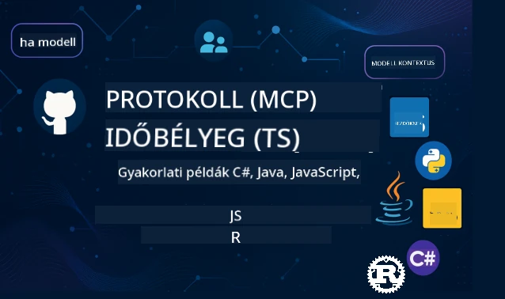

 

[](https://GitHub.com/microsoft/mcp-for-beginners/graphs/contributors)
[](https://GitHub.com/microsoft/mcp-for-beginners/issues)
[](https://GitHub.com/microsoft/mcp-for-beginners/pulls)
[](http://makeapullrequest.com)
[](https://mcptoplist.com/server/mcp.so%2Fmcp-for-beginners%2Fmicrosoft)

[](https://GitHub.com/microsoft/mcp-for-beginners/watchers)
[](https://GitHub.com/microsoft/mcp-for-beginners/fork)
[](https://GitHub.com/microsoft/mcp-for-beginners/stargazers)


[](https://discord.gg/nTYy5BXMWG)

Kövesd ezeket a lépéseket, hogy elkezdhesd használni ezeket az erőforrásokat:
1. **Forkold a tárat**: Kattints a [](https://GitHub.com/microsoft/mcp-for-beginners/fork) gombra
2. **Klónozd a tárat**:   `git clone https://github.com/microsoft/mcp-for-beginners.git`
3. **Csatlakozz a** [](https://discord.gg/nTYy5BXMWG)


### 🌐 Többnyelvű támogatás

#### GitHub Action segítségével támogatott (Automatikus és Mindig naprakész)

<!-- CO-OP TRANSLATOR LANGUAGES TABLE START -->
[Arabic](../ar/README.md) | [Bengali](../bn/README.md) | [Bulgarian](../bg/README.md) | [Burmese (Myanmar)](../my/README.md) | [Chinese (Simplified)](../zh-CN/README.md) | [Chinese (Traditional, Hong Kong)](../zh-HK/README.md) | [Chinese (Traditional, Macau)](../zh-MO/README.md) | [Chinese (Traditional, Taiwan)](../zh-TW/README.md) | [Croatian](../hr/README.md) | [Czech](../cs/README.md) | [Danish](../da/README.md) | [Dutch](../nl/README.md) | [Estonian](../et/README.md) | [Finnish](../fi/README.md) | [French](../fr/README.md) | [German](../de/README.md) | [Greek](../el/README.md) | [Hebrew](../he/README.md) | [Hindi](../hi/README.md) | [Hungarian](./README.md) | [Indonesian](../id/README.md) | [Italian](../it/README.md) | [Japanese](../ja/README.md) | [Kannada](../kn/README.md) | [Khmer](../km/README.md) | [Korean](../ko/README.md) | [Lithuanian](../lt/README.md) | [Malay](../ms/README.md) | [Malayalam](../ml/README.md) | [Marathi](../mr/README.md) | [Nepali](../ne/README.md) | [Nigerian Pidgin](../pcm/README.md) | [Norwegian](../no/README.md) | [Persian (Farsi)](../fa/README.md) | [Polish](../pl/README.md) | [Portuguese (Brazil)](../pt-BR/README.md) | [Portuguese (Portugal)](../pt-PT/README.md) | [Punjabi (Gurmukhi)](../pa/README.md) | [Romanian](../ro/README.md) | [Russian](../ru/README.md) | [Serbian (Cyrillic)](../sr/README.md) | [Slovak](../sk/README.md) | [Slovenian](../sl/README.md) | [Spanish](../es/README.md) | [Swahili](../sw/README.md) | [Swedish](../sv/README.md) | [Tagalog (Filipino)](../tl/README.md) | [Tamil](../ta/README.md) | [Telugu](../te/README.md) | [Thai](../th/README.md) | [Turkish](../tr/README.md) | [Ukrainian](../uk/README.md) | [Urdu](../ur/README.md) | [Vietnamese](../vi/README.md)

> **Szívesebben klónoznál helyileg?**
>
> Ez a tár több mint 50 nyelvre lefordított tartalmat tartalmaz, ami jelentősen megnöveli a letöltési méretet. Ha lefordítások nélkül szeretnéd klónozni, használj sparse checkout-ot:
>
> **Bash / macOS / Linux:**
> ```bash
> git clone --filter=blob:none --sparse https://github.com/microsoft/mcp-for-beginners.git
> cd mcp-for-beginners
> git sparse-checkout set --no-cone '/*' '!translations' '!translated_images'
> ```
>
> **CMD (Windows):**
> ```cmd
> git clone --filter=blob:none --sparse https://github.com/microsoft/mcp-for-beginners.git
> cd mcp-for-beginners
> git sparse-checkout set --no-cone "/*" "!translations" "!translated_images"
> ```
>
> Ez mindent megad, amire szükséged van a kurzus elvégzéséhez, de sokkal gyorsabb letöltéssel.
<!-- CO-OP TRANSLATOR LANGUAGES TABLE END -->

# 🚀 Model Context Protocol (MCP) tananyag kezdőknek

## **Tanuld meg az MCP-t gyakorlati kódpéldákkal C#, Java, JavaScript, Rust, Python és TypeScript nyelven**

## 🧠 Áttekintés a Model Context Protocol tananyagról
Üdvözlünk az utadon a Model Context Protocol világában! Ha valaha is kíváncsi voltál arra, hogyan kommunikálnak az AI alkalmazások különböző eszközökkel és szolgáltatásokkal, most felfedezheted azt az elegáns megoldást, amely átalakítja, hogyan építenek a fejlesztők intelligens rendszereket.

Gondolj az MCP-re úgy, mint egy univerzális fordítóra az AI alkalmazások számára – ahogy az USB portok bármilyen eszköz csatlakoztatását lehetővé teszik a számítógépedhez, az MCP lehetővé teszi az AI modellek számára, hogy bármilyen eszközzel vagy szolgáltatással szabványos módon kapcsolódjanak. Akár az első chatbotodat építed, akár összetett AI munkafolyamatokon dolgozol, az MCP megértése erőt ad ahhoz, hogy képességesebb és rugalmasabb alkalmazásokat készíts.

Ez a tananyag türelemmel és gondossággal készült a tanulási utadhoz. Egyszerű fogalmakkal kezdünk, amelyeket már ismersz, és lépésről lépésre építjük a szakértelmedet gyakorlati példákon keresztül, a kedvenc programozási nyelveden. Minden lépés világos magyarázatokat, gyakorlati példákat és sok bátorítást tartalmaz.

Mire befejezed ezt az utazást, magabiztosan fogsz tudni saját MCP szervereket építeni, integrálni népszerű AI platformokkal, és megérted, hogyan alakítja át ez a technológia az AI fejlesztés jövőjét. Kezdjük hát el ezt az izgalmas kalandot együtt!

### Hivatalos dokumentáció és specifikációk

Ez a tananyag összhangban van az **MCP Specifikáció 2025-11-25** verzióval (a legfrissebb stabil kiadás). Az MCP specifikáció dátumalapú verziózást használ (ÉÉÉÉ-HH-NN formátum) a protokoll verziójának egyértelmű követésére.

> **Előre tekintve:** a következő specifikáció verzió, a **2026-07-28** kiadásra jelölteként 2026. július 28-án érkezik. Ez azzal jár, hogy a protokoll stateless lesz a szállítási rétegen, formalizál egy Bővítmény keretrendszert (MCP alkalmazások, feladatok), erősíti az autorizációt, és elavulttá teszi a Gyökereket, Mintavételezést és Naplózást. Teljes bontást lásd a [Mi változik az MCP-ben: A 2026-07-28-as kiadásra jelölt](./01-CoreConcepts/mcp-2026-07-28-release-candidate.md) dokumentumban.

Ezek az erőforrások értékesebbek lesznek, ahogy a megértésed nő, de ne érezd úgy, hogy azonnal mindent el kell olvasnod. Kezdd a számodra legérdekesebb területekkel!
- 📘 [MCP Dokumentáció](https://modelcontextprotocol.io/) – Ez az alapvető forrásod a lépésről lépésre útmutatókhoz és felhasználói kézikönyvekhez. A dokumentáció kezdők számára íródott, világos példákkal, amelyeket saját tempódban követhetsz.
- 📜 [MCP Specifikáció](https://modelcontextprotocol.io/specification/2025-11-25) – Gondolj erre úgy, mint az átfogó kézikönyvedre. Miközben haladsz a tananyagban, gyakran fogsz ide visszatérni, hogy specifikus részleteket nézz meg és haladó funkciókat fedezz fel.
- 📜 [MCP Specifikáció verziózás](https://modelcontextprotocol.io/specification/versioning) – Ebben a dokumentumban találhatsz információkat a protokoll verziótörténetéről és arról, hogyan használja az MCP a dátumalapú verziózást (ÉÉÉÉ-HH-NN formátum).
- 🧑‍💻 [MCP GitHub tár](https://github.com/modelcontextprotocol) – Itt megtalálod az SDK-kat, eszközöket és kódpéldákat több programozási nyelven. Ez egy gyűjtemény gyakorlati példákból és készen használható komponensekből.
- 🌐 [MCP Közösség](https://github.com/orgs/modelcontextprotocol/discussions) – Csatlakozz más tanulókhoz és tapasztalt fejlesztőkhöz MCP témájú beszélgetésekben. Ez egy támogató közösség, ahol a kérdések szívesen látottak, és a tudás szabadon megosztott.
  
## Tanulási célok

A tananyag végére magabiztosan és izgatottan fogod érezni az új képességeidet. Ezeket fogod elérni:

• **Megérteni az MCP alapjait**: Meg fogod érteni, mi a Model Context Protocol, és miért forradalmasítja azt, hogyan működnek együtt az AI alkalmazások, példák és analógiák segítségével.

• **Építsd meg az első MCP szerveredet**: Elkészítesz egy működő MCP szervert a kedvenc programozási nyelveden, egyszerű példákkal kezdve, és lépésről lépésre fejlesztve a képességeidet.

• **Kapcsold össze az AI modelleket valós eszközökkel**: Megtanulod, hogyan hidalhatod át az AI modellek és a tényleges szolgáltatások közti szakadékot, új erőteljes képességeket adva az alkalmazásaidnak.

• **Alkalmazd a biztonsági legjobb gyakorlatokat**: Megérted, hogyan tartsd biztonságban az MCP megvalósításaidat, védve mind az alkalmazásaidat, mind a felhasználóidat.

• **Telepíts magabiztosan**: Tudni fogod, hogyan vidd az MCP projektjeidet fejlesztésből éles környezetbe, gyakorlati telepítési stratégiákkal, amelyek a való életben is működnek.

• **Csatlakozz az MCP közösséghez**: Része leszel egy növekvő fejlesztői közösségnek, amely alakítja az AI alkalmazásfejlesztés jövőjét.

## Alapvető háttér

Mielőtt belevágnánk az MCP részleteibe, győződjünk meg róla, hogy kényelmesen érzed magad néhány alapfogalommal. Ne aggódj, ha nem vagy szakértő ezekben a témákban – mindent elmagyarázunk menet közben!

### Protokollok megértése (Az alapok)

Gondolj a protokollra úgy, mint egy beszélgetés szabályaira. Amikor felhívsz egy barátot, mindketten tudjátok, hogy köszönni kell („szia”), felváltva beszéltek, és a végén elköszönötök. A számítógépes programoknak hasonló szabályokra van szükségük, hogy hatékonyan kommunikáljanak.

Az MCP egy protokoll – egy megállapodott szabályrendszer, amely segít az AI modelleknek és alkalmazásoknak produktív „beszélgetéseket” folytatni eszközökkel és szolgáltatásokkal. Ahogy az emberi kommunikáció gördülékenyebb a beszélgetési szabályok miatt, az MCP az AI alkalmazások közti kommunikációt teszi megbízhatóbbá és erőteljesebbé.

### Kliens-szerver kapcsolatok (Hogyan működnek együtt a programok)

Már most is használod a kliens-szerver kapcsolatokat minden nap! Amikor böngészőt (kliens) használsz egy weboldal meglátogatásához, egy web szerverhez kapcsolódsz, amely elküldi neked az oldal tartalmát. A böngésző tudja, hogyan kérjen információt, a szerver pedig tudja, hogyan válaszoljon.

Az MCP-ben hasonló kapcsolat van: az AI modellek kliensek, amelyek információt vagy műveleteket kérnek, az MCP szerverek pedig ezeket a képességeket szolgáltatják. Olyan, mintha lenne egy segítő asszisztensed (a szerver), akit az AI megkérhet, hogy végezzen el konkrét feladatokat.

### Miért fontos a szabványosítás (Hogy működjenek együtt a dolgok)

Képzeld el, ha minden autógyártó más alakú benzinkúti csatlakozót használna – minden autóhoz más adapter kellene! A szabványosítás azt jelenti, hogy közös megközelítésekben állapodunk meg, hogy a dolgok zökkenőmentesen működjenek együtt.

Az MCP ezt a szabványosítást biztosítja az AI alkalmazások számára. Ahelyett, hogy minden AI modellnek személyre szabott kódra lenne szüksége minden eszközhöz, az MCP létrehoz egy univerzális módot a kommunikációra. Ez azt jelenti, hogy a fejlesztők egyszer építenek eszközöket, amelyek sok különböző AI rendszerrel működnek.

## 🧭 A tanulási utad áttekintése

Az MCP utad gondosan épül fel, hogy fokozatosan növeld az önbizalmad és a képességeid. Minden szakasz új fogalmakat vezet be, miközben megerősíti, amit már megtanultál.

### 🌱 Alapszakasz: Az alapok megértése (0-2 modulok)

Itt kezdődik a kalandod! Bemutatjuk az MCP fogalmait ismerős analógiákkal és egyszerű példákkal. Megérted, mi az MCP, miért létezik, és hogyan illeszkedik az AI fejlesztés nagyobb világába.


• **0. modul - Bevezetés az MCP-be**: Először megvizsgáljuk, mi az MCP és miért olyan fontos a modern AI alkalmazások számára. Valós példákat láthatsz az MCP használatára, és megérted, hogyan oldja meg a fejlesztők által gyakran tapasztalt problémákat.

• **1. modul - Alapfogalmak magyarázata**: Itt megtanulod az MCP alapvető építőköveit. Sok analógiát és vizuális példát használunk, hogy ezek a fogalmak természetesnek és érthetőnek hassanak.

• **2. modul - Biztonság az MCP-ben**: A biztonság talán ijesztően hangzik, de megmutatjuk, hogyan tartalmaz beépített biztonsági funkciókat az MCP, és megtanítjuk a legjobb gyakorlatokat, amelyek az alkalmazásaidat már a kezdetektől védik.

### 🔨 Építési fázis: Az első megvalósításaid létrehozása (3. modul)

Most kezdődik az igazi móka! Gyakorlati tapasztalatot szerzel valódi MCP szerverek és kliensek építésében. Ne aggódj - egyszerűen kezdünk, és minden lépésben vezetünk.

Ez a modul több gyakorlati útmutatót tartalmaz, amelyek lehetővé teszik, hogy a kedvenc programozási nyelvedben gyakorolj. Megalkotod első szerveredet, építesz klienst a kapcsolódáshoz, és akár népszerű fejlesztői eszközökkel, mint a VS Code, is integrálsz.

Minden útmutató teljes kódpéldákat, hibakeresési tippeket és magyarázatokat tartalmaz, hogy megértsd, miért hozunk meg bizonyos tervezési döntéseket. Ennek a fázisnak a végére működő MCP megvalósításaid lesznek, amikre büszke lehetsz!

### 🚀 Növekedési fázis: Haladó fogalmak és valós alkalmazás (4-5. modulok)

Az alapok elsajátítása után készen állsz arra, hogy felfedezd a kifinomultabb MCP funkciókat. Megvitatjuk a gyakorlati megvalósítási stratégiákat, hibakeresési technikákat és haladó témákat, mint például a multimodális AI integráció.

Megtanulod, hogyan skálázd az MCP megvalósításaidat éles használatra, valamint hogyan integrálhatsz felhőplatformokkal, mint az Azure. Ezek a modulok felkészítenek arra, hogy olyan MCP megoldásokat építs, amelyek a valós igényeket is kezelni tudják.

### 🌟 Mesterfokozat fázis: Közösség és specializáció (6-11. modulok)

Az utolsó fázis az MCP közösséghez való csatlakozásra és az érdeklődési körödnek megfelelő specializációra összpontosít. Megtanulod, hogyan járulj hozzá nyílt forráskódú MCP projektekhez, valósíts meg fejlett hitelesítési mintákat és építs átfogó, adatbázis-integrált megoldásokat.

A 11. modul különösen kiemelkedő - teljes, 13 laborból álló gyakorlati tanulási útvonal, amely megtanít produkcióra kész MCP szerverek építésére PostgreSQL integrációval. Olyan, mint egy záró projekt, amely összehozza mindazt, amit megtanultál!

### 📚 Teljes tananyag struktúra

| Modul | Téma | Leírás | Link |
|--------|-------|-------------|------|
| **0-3. modulok: Alapok** | | | |
| 00 | Bevezetés az MCP-be | Áttekintés a Model Context Protocol-ról és jelentőségéről az AI pipeline-okban | [Bővebben](./00-Introduction/README.md) |
| 01 | Alapfogalmak magyarázata | Az MCP alapfogalmainak mélyreható bemutatása | [Bővebben](./01-CoreConcepts/README.md) |
| 1.1 | Mi változik az MCP-ben (2026-07-28 RC) | Állapot nélküli protokoll, Kiterjesztések keretrendszere, és a következő szabványváltozatban jövő funkciók elhagyása | [Útmutató](./01-CoreConcepts/mcp-2026-07-28-release-candidate.md) |
| 02 | Biztonság az MCP-ben | Biztonsági fenyegetések és legjobb gyakorlatok | [Bővebben](./02-Security/README.md) |
| 03 | Kezdő lépések az MCP-vel | Környezet beállítása, alap szerverek/kliensek, integráció | [Bővebben](./03-GettingStarted/README.md) |
| **3. modul: Az első szerver és kliens építése** | | | |
| 3.1 | Első szerver | Első MCP szervered létrehozása | [Útmutató](./03-GettingStarted/01-first-server/README.md) |
| 3.2 | Első kliens | Alap MCP kliens fejlesztése | [Útmutató](./03-GettingStarted/02-client/README.md) |
| 3.3 | Kliens LLM-mel | Nagy nyelvi modellek integrálása | [Útmutató](./03-GettingStarted/03-llm-client/README.md) |
| 3.4 | VS Code integráció | MCP szerverek használata VS Code-ban | [Útmutató](./03-GettingStarted/04-vscode/README.md) |
| 3.5 | stdio szerver | Szerverek létrehozása stdio szállítással | [Útmutató](./03-GettingStarted/05-stdio-server/README.md) |
| 3.6 | HTTP streaming | HTTP streaming megvalósítása MCP-ben | [Útmutató](./03-GettingStarted/06-http-streaming/README.md) |
| 3.7 | Microsoft Foundry eszközkészlet | Microsoft Foundry eszközkészlet használata az MCP-vel | [Útmutató](./03-GettingStarted/07-aitk/README.md) |
| 3.8 | Tesztelés | MCP szerver megvalósítás tesztelése | [Útmutató](./03-GettingStarted/08-testing/README.md) |
| 3.9 | Telepítés | MCP szerverek élesben történő telepítése | [Útmutató](./03-GettingStarted/09-deployment/README.md) |
| 3.10 | Haladó szerver használat | Haladó szerverek használata fejlett funkciókhoz és jobb architektúrához | [Útmutató](./03-GettingStarted/10-advanced/README.md) |
| 3.11 | Egyszerű hitelesítés | Egy fejezet, amely bemutatja a hitelesítést az elejétől, és az RBAC-ot | [Útmutató](./03-GettingStarted/11-simple-auth/README.md) |
| 3.12 | MCP hosztok | Claude Desktop, Cursor, Cline és más MCP hosztok konfigurálása | [Útmutató](./03-GettingStarted/12-mcp-hosts/README.md) |
| 3.13 | MCP Inspector | Hibakeresés és tesztelés az Inspector eszközzel | [Útmutató](./03-GettingStarted/13-mcp-inspector/README.md) |
| 3.14 | Mintavételezés | Mintavételezés használata az ügyféllel való együttműködéshez | [Útmutató](./03-GettingStarted/14-sampling/README.md) |
| 3.15 | MCP alkalmazások | MCP alkalmazások építése | [Útmutató](./03-GettingStarted/15-mcp-apps/README.md) |
| **4-5. modulok: Gyakorlati & Haladó** | | | |
| 04 | Gyakorlati megvalósítás | SDK-k, hibakeresés, tesztelés, újrafelhasználható prompt sablonok | [Bővebben](./04-PracticalImplementation/README.md) |
| 4.1 | Lapozás | Nagy eredményhalmazok kezelése kurzoralapú lapozással | [Útmutató](./04-PracticalImplementation/pagination/README.md) |
| 05 | Haladó témák az MCP-ben | Multimodális AI, skálázás, vállalati használat | [Bővebben](./05-AdvancedTopics/README.md) |
| 5.1 | Azure integráció | MCP integráció Azure-ral | [Útmutató](./05-AdvancedTopics/mcp-integration/README.md) |
| 5.2 | Multimodalitás | Több modalitás kezelése | [Útmutató](./05-AdvancedTopics/mcp-multi-modality/README.md) |
| 5.3 | OAuth2 demo | OAuth2 hitelesítés megvalósítása | [Útmutató](./05-AdvancedTopics/mcp-oauth2-demo/README.md) |
| 5.4 | Gyökér kontextusok | Gyökér kontextusok megértése és megvalósítása | [Útmutató](./05-AdvancedTopics/mcp-root-contexts/README.md) |
| 5.5 | Útválasztás | MCP útválasztási stratégiák | [Útmutató](./05-AdvancedTopics/mcp-routing/README.md) |
| 5.6 | Mintavételezés | Mintavételezési technikák az MCP-ben | [Útmutató](./05-AdvancedTopics/mcp-sampling/README.md) |
| 5.7 | Skálázás | MCP megvalósítások skálázása | [Útmutató](./05-AdvancedTopics/mcp-scaling/README.md) |
| 5.8 | Biztonság | Haladó biztonsági megfontolások | [Útmutató](./05-AdvancedTopics/mcp-security/README.md) |
| 5.9 | Webes keresés | Webes keresési képességek megvalósítása | [Útmutató](./05-AdvancedTopics/web-search-mcp/README.md) |
| 5.10 | Valós idejű streaming | Valós idejű streaming funkció építése | [Útmutató](./05-AdvancedTopics/mcp-realtimestreaming/README.md) |
| 5.11 | Valós idejű keresés | Valós idejű keresés megvalósítása | [Útmutató](./05-AdvancedTopics/mcp-realtimesearch/README.md) |
| 5.12 | Entra ID hitelesítés | Hitelesítés Microsoft Entra ID-vel | [Útmutató](./05-AdvancedTopics/mcp-security-entra/README.md) |
| 5.13 | Foundry integráció | Integráció Microsoft Foundry-val | [Útmutató](./05-AdvancedTopics/mcp-foundry-agent-integration/README.md) |
| 5.14 | Kontextus mérnökség | Hatékony kontextus mérnökségi technikák | [Útmutató](./05-AdvancedTopics/mcp-contextengineering/README.md) |
| 5.15 | Egyedi MCP szállítás | Egyedi szállítási megvalósítások | [Útmutató](./05-AdvancedTopics/mcp-transport/README.md) |
| 5.16 | Protokoll jellemzők | Haladás értesítések, megszakítás, erőforrás sablonok | [Útmutató](./05-AdvancedTopics/mcp-protocol-features/README.md) |
| 5.17 | Adverzárius többügynökös érvelés | Két ügynök ellentétes oldalakat vitat meg közös MCP eszközök segítségével, egy bíró ügynök értékeli | [Útmutató](./05-AdvancedTopics/mcp-adversarial-agents/README.md) |
| **6-10. modulok: Közösség & Legjobb gyakorlatok** | | | |
| 06 | Közösségi hozzájárulások | Hogyan járulj hozzá az MCP ökoszisztémához | [Útmutató](./06-CommunityContributions/README.md) |
| 07 | Korai tapasztalatok | Valós megvalósítási történetek | [Útmutató](./07-LessonsfromEarlyAdoption/README.md) |
| 08 | Legjobb gyakorlatok MCP-hez | Teljesítmény, hibatermelő képesség, ellenállóság | [Útmutató](./08-BestPractices/README.md) |
| 09 | MCP esettanulmányok | Gyakorlati megvalósítási példák | [Útmutató](./09-CaseStudy/README.md) |
| 10 | Gyakorlati workshop | MCP szerver építése Microsoft Foundry Toolkit-tel | [Labor](./10-StreamliningAIWorkflowsBuildingAnMCPServerWithAIToolkit/README.md) |
| **11. modul: MCP szerver gyakorlati labor** | | | |
| 11 | MCP szerver adatbázis integráció | Átfogó 13 laborból álló gyakorlati tanulási útvonal PostgreSQL integrációval | [Laborok](./11-MCPServerHandsOnLabs/README.md) |
| 11.1 | Bevezetés | Áttekintés az MCP-ről adatbázis integrációval és kiskereskedelmi elemzési esettel | [00. labor](./11-MCPServerHandsOnLabs/00-Introduction/README.md) |
| 11.2 | Alap architektúra | Az MCP szerver architektúra, adatbázis rétegek és biztonsági minták megértése | [01. labor](./11-MCPServerHandsOnLabs/01-Architecture/README.md) |
| 11.3 | Biztonság és multi-tenancy | Sor szintű biztonság, hitelesítés és több bérlős adat hozzáférés | [02. labor](./11-MCPServerHandsOnLabs/02-Security/README.md) |
| 11.4 | Környezet beállítása | Fejlesztői környezet, Docker, Azure erőforrások beállítása | [03. labor](./11-MCPServerHandsOnLabs/03-Setup/README.md) |
| 11.5 | Adatbázis tervezés | PostgreSQL beállítás, kiskereskedelmi séma tervezés, mintaadatok | [04. labor](./11-MCPServerHandsOnLabs/04-Database/README.md) |
| 11.6 | MCP szerver megvalósítás | FastMCP szerver építése adatbázis integrációval | [05. labor](./11-MCPServerHandsOnLabs/05-MCP-Server/README.md) |
| 11.7 | Eszköz fejlesztés | Adatbázis lekérdezési eszközök létrehozása és séma introspekció | [06. labor](./11-MCPServerHandsOnLabs/06-Tools/README.md) |
| 11.8 | Szemantikus keresés | Vektor beágyazások megvalósítása Azure OpenAI és pgvector segítségével | [07. labor](./11-MCPServerHandsOnLabs/07-Semantic-Search/README.md) |
| 11.9 | Tesztelés és hibakeresés | Tesztelési stratégiák, hibakereső eszközök és validációs megközelítések | [08. labor](./11-MCPServerHandsOnLabs/08-Testing/README.md) |
| 11.10 | VS Code integráció | VS Code MCP integráció és AI Chat használat beállítása | [09. labor](./11-MCPServerHandsOnLabs/09-VS-Code/README.md) |
| 11.11 | Telepítési stratégiák | Docker telepítés, Azure Container Apps, és skálázási megfontolások | [10. labor](./11-MCPServerHandsOnLabs/10-Deployment/README.md) |
| 11.12 | Monitorozás | Application Insights, naplózás, teljesítményfigyelés | [11. labor](./11-MCPServerHandsOnLabs/11-Monitoring/README.md) |
| 11.13 | Legjobb gyakorlatok | Teljesítmény optimalizálás, biztonság megerősítése, és produkciós tippek | [12. labor](./11-MCPServerHandsOnLabs/12-Best-Practices/README.md) |
| **12. modul: MCP eszköztár** | | | |
| 12.1 | Eszközök | MCP használat a Copilot alkalmazásban | [ Útmutató ](./12-tooling/README.md) |

### 💻 Mintakód projektek

Az egyik legizgalmasabb része az MCP tanulásának, hogy fokozatosan fejlődnek a kódolási képességeid. Olyan kód példákat terveztünk, amelyek egyszerűekről indulnak, és a megértésed mélyülésével egyre kifinomultabbakká válnak. Így vezetjük be a fogalmakat – olyan kódot, amely könnyen érthető, de az igazi MCP elveket mutatja be; így nemcsak azt fogod érteni, mit csinál a kód, hanem azt is, miért ez a szerkezete, és hogyan illeszkedik nagyobb MCP alkalmazásokba.

#### Alap MCP számológép minták

| Nyelv | Leírás | Link |
|----------|-------------|------|

| C# | MCP szerver példa | [Kód megtekintése](./03-GettingStarted/samples/csharp/README.md) |
| Java | MCP számológép | [Kód megtekintése](./03-GettingStarted/samples/java/calculator/README.md) |
| JavaScript | MCP demó | [Kód megtekintése](./03-GettingStarted/samples/javascript/README.md) |
| Python | MCP szerver | [Kód megtekintése](../../03-GettingStarted/samples/python/mcp_calculator_server.py) |
| TypeScript | MCP példa | [Kód megtekintése](./03-GettingStarted/samples/typescript/README.md) |
| Rust | MCP példa | [Kód megtekintése](./03-GettingStarted/samples/rust/README.md) |

#### Haladó MCP implementációk

| Nyelv | Leírás | Link |
|----------|-------------|------|
| C# | Haladó példa | [Kód megtekintése](./04-PracticalImplementation/samples/csharp/README.md) |
| Java Spring kerettel | Konténer alkalmazás példa | [Kód megtekintése](./04-PracticalImplementation/samples/java/containerapp/README.md) |
| JavaScript | Haladó példa | [Kód megtekintése](./04-PracticalImplementation/samples/javascript/README.md) |
| Python | Összetett implementáció | [Kód megtekintése](./04-PracticalImplementation/samples/python/README.md) |
| TypeScript | Konténer példa | [Kód megtekintése](./04-PracticalImplementation/samples/typescript/README.md) |


## 🎯 Az MCP tanulás előfeltételei

Ahhoz, hogy a legtöbbet hozd ki ebből a tananyagból, rendelkezned kell:

- Alap programozási ismeretek legalább az alábbi nyelvek egyikében: C#, Java, JavaScript, Python vagy TypeScript
- Az ügyfél-szerver modell és az API-k megértése
- Ismeretek a REST és HTTP fogalmakról
- (Opcionális) AI/ML fogalmak háttértudása

- Csatlakozás a közösségi beszélgetésekhez támogatásért

## 📚 Tanulási útmutató és források

Ez a tárház több forrást tartalmaz, hogy hatékonyan navigálhass és tanulhass:

### Tanulási útmutató

Egy átfogó [Tanulási útmutató](./study_guide.md) áll rendelkezésre, hogy hatékonyan eligazodj ebben a tárházban. Ez a vizuális tananyag-térkép megmutatja, hogyan kapcsolódnak egymáshoz a témák, és útmutatást ad a mintaprojektek hatékony használatához. Különösen hasznos, ha vizuális típus vagy, aki szereti látni az egész képet.

Az útmutató tartalmazza:
- Egy vizuális tananyag-térképet az összes lefedett témával
- Részletes bontást minden tárházrészről
- Útmutatást a mintaprojektek használatához
- Ajánlott tanulási útvonalakat különböző szintű tudáshoz
- További forrásokat, hogy kiegészítsd tanulási utadat

### Változásnapló

Részletes [Változásnaplót](./changelog.md) vezetünk a tananyag anyagok jelentős frissítéseiről, így mindig naprakész maradhatsz a legújabb fejlesztésekkel és bővítésekkel.
- Új tartalom hozzáadások
- Strukturális változások
- Funkciójavítások
- Dokumentáció frissítések

## 🛠️ Hatékony használata ennek a tananyagnak

Minden lecke tartalmazza:

1. Világos magyarázatokat az MCP koncepciókról  
2. Futó kód példákat több nyelven  
3. Gyakorlatokat igazi MCP alkalmazások építéséhez  
4. Kiegészítő forrásokat haladó tanulóknak

### Tanuljunk MCP-t C#-ban - Oktató sorozat
Ismerjük meg a Model Context Protocol-t (MCP), egy élvonalbeli keretrendszert, amely szabványosítja az AI modellek és kliensalkalmazások közötti interakciókat. Ebben a kezdőbarát foglalkozásban bemutatjuk az MCP-t, és végigvezetünk az első MCP szervered létrehozásán.
#### C#: [https://aka.ms/letslearnmcp-csharp](https://aka.ms/letslearnmcp-csharp)
#### Java: [https://aka.ms/letslearnmcp-java](https://aka.ms/letslearnmcp-java)
#### JavaScript: [https://aka.ms/letslearnmcp-javascript](https://aka.ms/letslearnmcp-javascript)
#### Python: [https://aka.ms/letslearnmcp-python](https://aka.ms/letslearnmcp-python)

## 🎓 MCP utad kezdete

Gratulálunk! Most léptél be egy izgalmas utazás első lépésébe, amely bővíti a programozói képességeidet, és csatlakoztat a mesterséges intelligencia fejlesztésének élvonalához.

### Amit már elértél

Azáltal, hogy elolvastad ezt a bevezetőt, már elkezdted felépíteni az MCP tudásod alapjait. Érted, mi az MCP, miért fontos, és hogyan támogatja ez a tananyag a tanulási utadat. Ez nagy eredmény, és az ezen fontos technológia terén való szakértelem kezdete.

### Az előttünk álló kaland

Ahogy haladsz a modulokon, ne feledd, minden szakértő volt egyszer kezdő. Azok a fogalmak, amelyek most bonyolultnak tűnnek, másodlagos természetté válnak, ahogy gyakorolsz és alkalmazod őket. Minden kis lépés hatalmas képességeket épít fel, amelyek egész fejlesztői karriered során szolgálnak majd.

### Támogató hálózatod

Csatlakozol egy tanulókból és szakértőkből álló közösséghez, akik szenvedélyesen foglalkoznak az MCP-vel, és segíteni akarják mások sikerét. Akár egy kódolási kihívásban akadnál el, akár egy áttörést osztanál meg, a közösség itt van, hogy támogassa az utadat.

Ha elakadsz vagy kérdésed van AI alkalmazások építésével kapcsolatban, csatlakozz a tanulótársaidhoz és tapasztalt fejlesztőkhöz az MCP-vel kapcsolatos beszélgetésekben. Ez egy támogató közösség, ahol a kérdések örömmel fogadottak, és a tudás szabadon megosztott.

[](https://discord.gg/nTYy5BXMWG)

Ha termék-visszajelzésed van vagy hibát tapasztalsz fejlesztés közben, látogass el:

[](https://aka.ms/foundry/forum)

### Készen állsz a kezdésre?

MCP kalandod most kezdődik! Kezdd a 0. modullal, hogy belemerülj az első gyakorlati MCP tapasztalataidba, vagy nézd meg a mintaprojekteket, hogy lásd, mit fogsz építeni. Ne feledd - minden szakértő pontosan ott kezdte, ahol most állsz, és türelemmel, gyakorlással csodálatos dolgokat érhetsz el.

Üdvözlünk a Model Context Protocol fejlesztés világában. Építsünk valami csodálatosat együtt!

## 🤝 Hozzájárulás a tanuló közösséghez

Ez a tananyag tanulók hozzájárulásával válik erősebbé! Legyen szó egy elgépelés javításáról, tisztább magyarázat ajánlásáról vagy új példa hozzáadásáról, hozzájárulásaid segítenek más kezdőknek is sikeressé válni.

Köszönjük a Microsoft elismert szakemberének, [Shivam Goyal](https://www.linkedin.com/in/shivam2003/), a kódminták hozzájárulását.

A hozzájárulási folyamat barátságos és támogató. A legtöbb hozzájáruláshoz hozzájárulói licenc szerződés (CLA) szükséges, de az automatikus eszközök gördülékenyen végigvezetnek a folyamaton.

## 📜 Nyílt forráskódú tanulás

Az egész tananyag MIT [LICENSE](../../LICENSE) alatt érhető el, ami azt jelenti, hogy szabadon használhatod, módosíthatod és megoszthatod. Ez támogatja küldetésünket, hogy az MCP tudást minden fejlesztő számára elérhetővé tegyük.
## 🤝 Hozzájárulási irányelvek

Ez a projekt szívesen fogad hozzájárulásokat és javaslatokat. A legtöbb hozzájárulás esetén
hozzájárulói licenc szerződést (CLA) kell elfogadnod, amely deklarálja, hogy rendelkezel a jogokkal, és valóban átadod nekünk
a hozzájárulás használatának jogát. Részletekért látogass el a <https://cla.opensource.microsoft.com> oldalra.

Pull request beküldésekor egy CLA bot automatikusan megállapítja, hogy szükség van-e CLA-ra,
és megfelelően megjeleníti a PR státuszát (pl. állapotellenőrzés, komment). Kövesd a
bot utasításait. Ezt csak egyszer kell megtenned az összes CLA-s tárházunkban.

Ez a projekt a [Microsoft Nyílt Forráskódú Magatartási Kódexét](https://opensource.microsoft.com/codeofconduct/) alkalmazza.
További információk a [Magatartási Kódex GYIK](https://opensource.microsoft.com/codeofconduct/faq/) oldalán találhatók, vagy
fordulj az [opencode@microsoft.com](mailto:opencode@microsoft.com) címhez bármilyen további kérdéssel vagy észrevétellel.

---

*Készen állsz az MCP utazásod megkezdésére? Kezdd a [00. modul - Bevezető az MCP-be](./00-Introduction/README.md) anyaggal, és tedd meg az első lépéseket a Model Context Protocol fejlesztés világában!*


## 🎒 Egyéb tanfolyamok
Csapatunk más tanfolyamokat is készít! Nézd meg:

<!-- CO-OP TRANSLATOR OTHER COURSES START -->
### LangChain
[](https://aka.ms/langchain4j-for-beginners)
[](https://aka.ms/langchainjs-for-beginners?WT.mc_id=m365-94501-dwahlin)
[](https://github.com/microsoft/langchain-for-beginners?WT.mc_id=m365-94501-dwahlin)
---

### Azure / Edge / MCP / Ügynökök
[](https://github.com/microsoft/AZD-for-beginners?WT.mc_id=academic-105485-koreyst)
[](https://github.com/microsoft/edgeai-for-beginners?WT.mc_id=academic-105485-koreyst)
[](https://github.com/microsoft/mcp-for-beginners?WT.mc_id=academic-105485-koreyst)
[](https://github.com/microsoft/ai-agents-for-beginners?WT.mc_id=academic-105485-koreyst)

---
 
### Generatív AI sorozat
[](https://github.com/microsoft/generative-ai-for-beginners?WT.mc_id=academic-105485-koreyst)
[-9333EA?style=for-the-badge&labelColor=E5E7EB&color=9333EA)](https://github.com/microsoft/Generative-AI-for-beginners-dotnet?WT.mc_id=academic-105485-koreyst)
[-C084FC?style=for-the-badge&labelColor=E5E7EB&color=C084FC)](https://github.com/microsoft/generative-ai-for-beginners-java?WT.mc_id=academic-105485-koreyst)
[-E879F9?style=for-the-badge&labelColor=E5E7EB&color=E879F9)](https://github.com/microsoft/generative-ai-with-javascript?WT.mc_id=academic-105485-koreyst)

---
 
### Alapvető tanulás
[](https://aka.ms/ml-beginners?WT.mc_id=academic-105485-koreyst)
[](https://aka.ms/datascience-beginners?WT.mc_id=academic-105485-koreyst)
[](https://aka.ms/ai-beginners?WT.mc_id=academic-105485-koreyst)

[](https://github.com/microsoft/Security-101?WT.mc_id=academic-96948-sayoung)
[](https://aka.ms/webdev-beginners?WT.mc_id=academic-105485-koreyst)
[](https://aka.ms/iot-beginners?WT.mc_id=academic-105485-koreyst)
[](https://github.com/microsoft/xr-development-for-beginners?WT.mc_id=academic-105485-koreyst)

---
 
### Copilot sorozat
[](https://aka.ms/GitHubCopilotAI?WT.mc_id=academic-105485-koreyst)
[](https://github.com/microsoft/mastering-github-copilot-for-dotnet-csharp-developers?WT.mc_id=academic-105485-koreyst)
[](https://github.com/microsoft/CopilotAdventures?WT.mc_id=academic-105485-koreyst)
<!-- CO-OP TRANSLATOR OTHER COURSES END -->

---

<!-- CO-OP TRANSLATOR DISCLAIMER START -->
**Jogi nyilatkozat**:
Ez a dokumentum az AI fordítási szolgáltatás, a [Co-op Translator](https://github.com/Azure/co-op-translator) segítségével készült. Bár az pontosságra törekszünk, kérjük, vegye figyelembe, hogy az automatikus fordítások hibákat vagy pontatlanságokat tartalmazhatnak. Az eredeti dokumentum az anyanyelvén tekintendő hiteles forrásnak. Fontos információk esetén professzionális emberi fordítást javasolunk. Nem vállalunk felelősséget semmilyen félreértésért vagy téves értelmezésért, amely ebből a fordításból ered.
<!-- CO-OP TRANSLATOR DISCLAIMER END -->