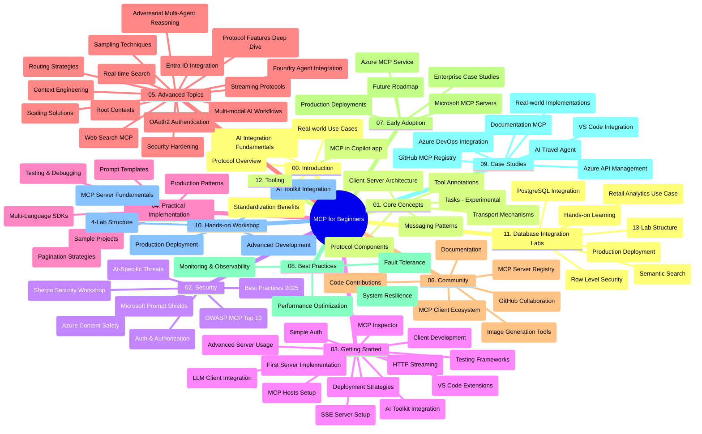

# Model Context Protocol (MCP) kezdőknek – Tanulmányi útmutató

Ez a tanulmányi útmutató áttekintést nyújt a „Model Context Protocol (MCP) kezdőknek” tananyag tárról és tartalmáról. Használd ezt az útmutatót, hogy hatékonyan navigálj a táron, és a legtöbbet hozd ki a rendelkezésre álló forrásokból.

## A tár bemutatása

A Model Context Protocol (MCP) egy szabványosított keretrendszer az AI-modellek és a kliensalkalmazások közötti interakciókhoz. Eredetileg az Anthropic hozta létre, az MCP-t jelenleg a tágabb MCP közösség tartja karban az hivatalos GitHub szervezet révén. Ez a tár egy átfogó tananyaggal szolgál gyakorlati kódpéldákkal C#, Java, JavaScript, Python és TypeScript nyelveken, AI fejlesztők, rendszertervezők és szoftvermérnökök számára.

## Vizualizált tananyag térkép

## A tár szerkezete

A tároló tizenkét fő részre tagolódik, mindegyik az MCP különféle aspektusaira fókuszál:

1. **Bevezetés (00-Introduction/)**
   - A Model Context Protocol áttekintése
   - Miért fontos a szabványosítás az AI folyamatokban
   - Gyakorlati felhasználási esetek és előnyök

2. **Alapfogalmak (01-CoreConcepts/)**
   - Ügyfél-szerver architektúra
   - A protokoll kulcsfontosságú elemei
   - Üzenetküldési minták az MCP-ben
   - Aktuális specifikáció: [Mi változott az MCP-ben: a 2026-07-28-as specifikáció](./01-CoreConcepts/mcp-2026-07-28.md) – az állapotmentes protokollmag, a kiterjesztések keretrendszere, valamint a gyökér/sampling/naplózás elavulások

3. **Biztonság (02-Security/)**
   - Biztonsági fenyegetések MCP-alapú rendszerekben
   - A megvalósítások védelmének legjobb gyakorlatai
   - Hitelesítési és jogosultságkezelési stratégiák
   - Gyakorlati [CIMD és DCR jogosultságminta](./02-Security/samples/cimd-dcr-auth/README.md)
   - **Átfogó biztonsági dokumentáció**:
     - MCP biztonsági legjobb gyakorlatok
     - Azure tartalombiztonsági megvalósítási útmutató
     - MCP biztonsági vezérlők és technikák
     - MCP legjobb gyakorlatok gyorsreferencia
   - **Kulcsfontosságú biztonsági témák**:
     - Prompt injekció és eszközmérgezési támadások
     - Munkamenet eltérítés és „confused deputy” problémák
     - Token átengedési sebezhetőségek
     - Túlzott engedélyek és hozzáférésvezérlés
     - Ellátási lánc biztonsága AI komponensek esetén
     - Microsoft Prompt Shields integráció

4. **Első lépések (03-GettingStarted/)**
   - Környezet beállítása és konfigurálása
   - Alap MCP szerverek és kliens létrehozása
   - Integráció meglévő alkalmazásokkal
   - Beleértve:
     - Az első szerver megvalósítása
     - Kliens fejlesztés
     - LLM kliens integráció
     - VS Code integráció
     - Server-Sent Events (SSE) szerver
     - Haladó szerverhasználat
     - HTTP streaming
     - AI Toolkit integráció
     - Tesztelési stratégiák
     - Telepítési irányelvek

5. **Gyakorlati megvalósítás (04-PracticalImplementation/)**
   - SDK-k használata különböző programozási nyelveken
   - Hibakeresési, tesztelési és validációs technikák
   - Újrahasznosítható prompt sablonok és munkafolyamatok kialakítása
   - Mintaprojektek megvalósítási példákkal

6. **Haladó témák (05-AdvancedTopics/)**
   - Kontextus mérnöki technikák
   - Foundry ügynök integráció
   - Többmodalitású AI munkafolyamatok
   - OAuth2 hitelesítési bemutatók
   - Valós idejű keresési képességek
   - Valós idejű streaming
   - Gyökér kontextusok megvalósítása
   - Útválasztási stratégiák
   - Mintavételezési technikák
   - Skálázási megközelítések
   - Biztonsági megfontolások
   - Entra ID biztonsági integráció
   - Webes keresés integráció
   - Ellenséges többügynökös érvelés (vita minták)

7. **Közösségi hozzájárulások (06-CommunityContributions/)**
   - Hogyan járulj hozzá kódhoz és dokumentációhoz
   - Együttműködés GitHubon keresztül
   - Közösség által hajtott bővítések és visszajelzések
   - Különféle MCP kliensek használata (Claude Desktop, Cline, VSCode)
   - Népszerű MCP szerverekkel való munka, beleértve a képgenerálást is

8. **Tanulságok a korai alkalmazásból (07-LessonsfromEarlyAdoption/)**
   - Való életbéli megvalósítások és sikertörténetek
   - MCP alapú megoldások építése és telepítése
   - Trendek és jövőbeli útiterv
   - **Microsoft MCP szerver útmutató**: Átfogó útmutató 10 termékérett Microsoft MCP szerverhez, többek között:
     - Microsoft Learn Docs MCP szerver
     - Azure MCP szerver (15+ speciális csatlakozó)
     - GitHub MCP szerver
     - Azure DevOps MCP szerver
     - MarkItDown MCP szerver
     - SQL Server MCP szerver
     - Playwright MCP szerver
     - Dev Box MCP szerver
     - Microsoft Foundry MCP szerver
     - Microsoft 365 Agents Toolkit MCP szerver

9. **Legjobb gyakorlatok (08-BestPractices/)**
   - Teljesítmény finomhangolás és optimalizálás
   - Hibamentes MCP rendszerek tervezése
   - Tesztelés és ellenállósági stratégiák

10. **Esettanulmányok (09-CaseStudy/)**
    - **Hét átfogó esettanulmány** az MCP sokoldalúságának bemutatására különböző helyzetekben:
    - **Azure AI utazási ügynökök**: Többügynökös összehangolás Azure OpenAI és AI kereséssel
    - **Azure DevOps integráció**: Munkafolyamat automatizálása YouTube adatfrissítésekkel
    - **Valós idejű dokumentáció lekérés**: Python konzol kliens HTTP streaminggel
    - **Interaktív tanulmányi terv generátor**: Chainlit webalkalmazás beszélgető AI-val
    - **Szerkesztőbeli dokumentáció**: VS Code integráció GitHub Copilot munkafolyamatokkal
    - **Azure API menedzsment**: Vállalati API integráció MCP szerver létrehozással
    - **GitHub MCP Regiszter**: Ökoszisztéma fejlesztés és ügynök integrációs platform
    - Megvalósítási példák vállalati integrációra, fejlesztői termelékenységre és ökoszisztéma fejlesztésre

11. **Gyakorlati műhelymunka (10-StreamliningAIWorkflowsBuildingAnMCPServerWithAIToolkit/)**
    - Átfogó gyakorlati műhelymunka MCP és AI Toolkit egyesítésére
    - Intelligens alkalmazások készítése AI modellek és valós eszközök összekapcsolásával
    - Gyakorlati modulok az alapoktól, egyedi szerverfejlesztésen át a termelésbe vitelekig
    - **Labor felépítése**:
      - Labor 1: MCP szerver alapjai
      - Labor 2: Haladó MCP szerver fejlesztés
      - Labor 3: AI Toolkit integráció
      - Labor 4: Termelési telepítés és skálázás
    - Labor-alapú tanulás lépésről lépésre

12. **MCP szerver adatbázis integráció laborok (11-MCPServerHandsOnLabs/)**
    - **Átfogó 13 laborból álló tanulási útvonal** termékérett MCP szerverek építésére PostgreSQL integrációval
    - **Valódi kereskedelmi elemző megvalósítás** a Zava Retail felhasználási esettel
    - **Vállalati szintű minták**, beleértve Row Level Security (RLS), szemantikus keresést és multi-tenant adat-hozzáférést
    - **Teljes labor struktúra**:
      - **Laborok 00-03: Alapok** – Bevezetés, architektúra, biztonság, környezet beállítás
      - **Laborok 04-06: MCP szerver építése** – Adatbázis tervezés, MCP szerver megvalósítás, eszközfejlesztés
      - **Laborok 07-09: Haladó funkciók** – Szemantikus keresés, tesztelés és hibakeresés, VS Code integráció
      - **Laborok 10-12: Termelés és legjobb gyakorlatok** – Telepítés, monitorozás, optimalizálás
    - **Technológiák**: FastMCP keretrendszer, PostgreSQL, Azure OpenAI, Azure Container Apps, Application Insights
    - **Tanulási eredmények**: Termékérett MCP szerverek, adatbázis integrációs minták, AI-vezérelt elemzés, vállalati biztonság

13. **Eszközök (12-tooling/)**
    - MCP használata a Copilot alkalmazásban és más eszközökben

## További források

A tár tartalmaz további támogató forrásokat:

- **Képek mappa**: Tartalmaz diagramokat és illusztrációkat, melyek a tananyag folyamán használatosak
- **Fordítások**: Többnyelvű támogatás, automatikus dokumentáció fordításokkal
- **Hivatalos MCP források**:
  - [MCP dokumentáció](https://modelcontextprotocol.io/)
  - [MCP specifikáció](https://modelcontextprotocol.io/specification/2026-07-28/)
  - [MCP GitHub tár](https://github.com/modelcontextprotocol)

## Hogyan használd ezt a tárat

1. **Sorrend szerinti tanulás**: Kövesd a fejezeteket sorrendben (00-tól 11-ig) egy strukturált tanulási élményhez.
2. **Nyelvspecifikus fókusz**: Ha egy konkrét programozási nyelv érdekel, nézd át a mintakönyvtárakat a preferált nyelven készült megvalósításokért.
3. **Gyakorlati megvalósítás**: Kezdd az „Első lépések” résszel, hogy beállítsd a környezeted, és létrehozd első MCP szervered és kliensed.
4. **Haladó felfedezés**: Ha már kényelmes vagy az alapokkal, merülj el a haladó témákban tudásod bővítésére.
5. **Közösségi részvétel**: Csatlakozz az MCP közösséghez GitHub beszélgetéseken és Discord csatornákon, hogy kapcsolatba kerülj szakértőkkel és fejlesztőtársaiddal.

## MCP kliensek és eszközök

A tananyag különféle MCP klienseket és eszközöket tárgyal:

1. **Hivatalos kliensek**:
   - Visual Studio Code
   - MCP Visual Studio Code-ban
   - Claude Desktop
   - Claude VSCode-ban
   - Claude API

2. **Közösségi kliensek**:
   - Cline (terminál alapú)
   - Cursor (kódszerkesztő)
   - ChatMCP
   - Windsurf

3. **MCP menedzsment eszközök**:
   - MCP CLI
   - MCP Manager
   - MCP Linker
   - MCP Router

## Népszerű MCP szerverek

A tár különféle MCP szervereket mutat be, többek között:

1. **Hivatalos Microsoft MCP szerverek**:
   - Microsoft Learn Docs MCP szerver
   - Azure MCP szerver (15+ speciális csatlakozóval)
   - GitHub MCP szerver
   - Azure DevOps MCP szerver
   - MarkItDown MCP szerver
   - SQL Server MCP szerver
   - Playwright MCP szerver
   - Dev Box MCP szerver
   - Microsoft Foundry MCP szerver
   - Microsoft 365 Agents Toolkit MCP szerver

2. **Hivatalos referencia szerverek**:
   - Filesystem
   - Fetch
   - Memory
   - Sequential Thinking

3. **Képgenerálás**:
   - Azure OpenAI DALL-E 3
   - Stable Diffusion WebUI
   - Replicate

4. **Fejlesztői eszközök**:
   - Git MCP
   - Terminál vezérlés
   - Kódtámogató

5. **Speciális szerverek**:
   - Salesforce
   - Microsoft Teams
   - Jira & Confluence

## Hozzájárulás

Ez a tár örömmel fogadja a közösség hozzájárulásait. A Közösségi hozzájárulások rész tartalmaz útmutatást, hogyan járulhatsz hozzá hatékonyan az MCP ökoszisztémához.

----

*Ezt a tanulmányi útmutatót utoljára 2026. szeptember 9-én frissítették. Tükrözi az MCP
Specifikációt `2026-07-28`, a jelenlegi protokoll felülvizsgálatot. Néhány gyakorlati
példa kifejezetten a `2025-11-25` verzióhoz van kötve, miközben SDK-k és eszközök
az állapotmentes protokoll API-kat használják.*

---

<!-- CO-OP TRANSLATOR DISCLAIMER START -->
**Jogi nyilatkozat**:
Ez a dokumentum az AI fordítási szolgáltatás, a [Co-op Translator](https://github.com/Azure/co-op-translator) segítségével készült. Bár az pontosságra törekszünk, kérjük, vegye figyelembe, hogy az automatikus fordítások hibákat vagy pontatlanságokat tartalmazhatnak. Az eredeti dokumentum az anyanyelvén tekintendő hiteles forrásnak. Fontos információk esetén professzionális emberi fordítást javasolunk. Nem vállalunk felelősséget semmilyen félreértésért vagy téves értelmezésért, amely ebből a fordításból ered.
<!-- CO-OP TRANSLATOR DISCLAIMER END -->