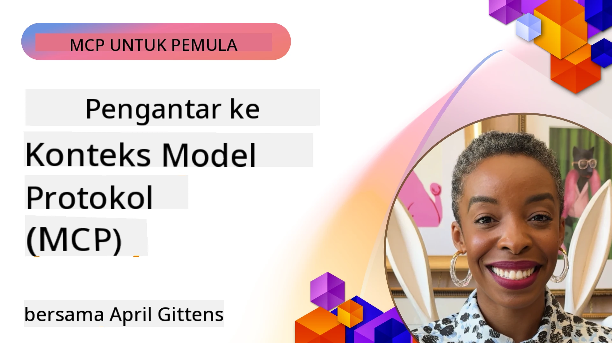
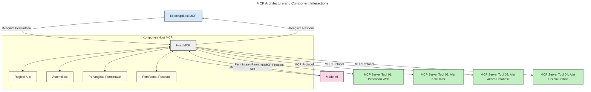
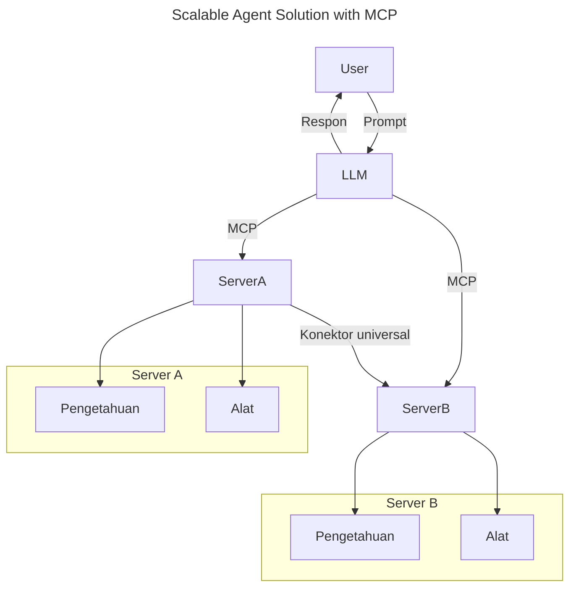
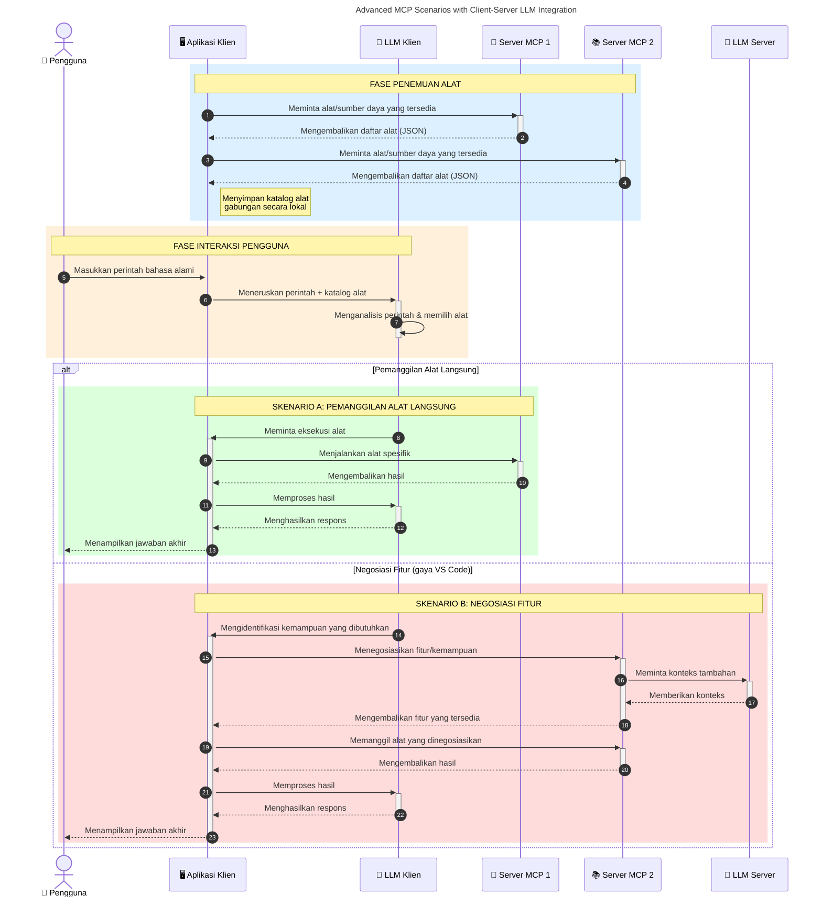

# Pengenalan Model Context Protocol (MCP): Mengapa Ini Penting untuk Aplikasi AI yang Skala Besar

_(Klik gambar di atas untuk melihat video pelajaran ini)_

Aplikasi AI generatif adalah langkah maju yang besar karena mereka sering kali memungkinkan pengguna berinteraksi dengan aplikasi menggunakan prompt bahasa alami. Namun, seiring waktu dan sumber daya yang diinvestasikan dalam aplikasi tersebut, Anda ingin memastikan dapat dengan mudah mengintegrasikan fungsionalitas dan sumber daya sedemikian rupa sehingga mudah diperluas, aplikasi Anda dapat melayani lebih dari satu model yang digunakan, dan menangani berbagai kerumitan model. Singkatnya, membangun aplikasi Gen AI mudah diawali, tetapi seiring pertumbuhannya yang semakin kompleks, Anda perlu mulai mendefinisikan arsitektur dan kemungkinan besar harus mengandalkan standar untuk memastikan aplikasi Anda dibangun secara konsisten. Di sinilah MCP berperan untuk mengatur dan menyediakan standar.

---

## **🔍 Apa Itu Model Context Protocol (MCP)?**

**Model Context Protocol (MCP)** adalah **antarmuka terbuka dan standar** yang memungkinkan Large Language Models (LLM) berinteraksi secara mulus dengan alat eksternal, API, dan sumber data. Ini menyediakan arsitektur yang konsisten untuk meningkatkan fungsi model AI di luar data pelatihan mereka, memungkinkan sistem AI yang lebih cerdas, dapat diskalakan, dan lebih responsif.

---

## **🎯 Mengapa Standarisasi dalam AI Penting**

Saat aplikasi AI generatif menjadi lebih kompleks, sangat penting untuk mengadopsi standar yang menjamin **skalabilitas, ekstensi, pemeliharaan,** dan **menghindari ketergantungan pada vendor tertentu**. MCP menangani kebutuhan ini dengan:

- Menyatukan integrasi model-alat
- Mengurangi solusi kustom yang rapuh dan sekali pakai
- Memungkinkan beberapa model dari vendor berbeda untuk hidup berdampingan dalam satu ekosistem

**Catatan:** Meskipun MCP mengklaim sebagai standar terbuka, tidak ada rencana untuk menstandarisasi MCP melalui badan standar yang ada seperti IEEE, IETF, W3C, ISO, atau badan standar lainnya.

---

## **📚 Tujuan Pembelajaran**

Pada akhir artikel ini, Anda akan dapat:

- Mendefinisikan **Model Context Protocol (MCP)** dan kasus penggunaannya
- Memahami bagaimana MCP menstandarisasi komunikasi model-ke-alat
- Mengidentifikasi komponen inti dari arsitektur MCP
- Menjelajahi aplikasi nyata MCP dalam konteks perusahaan dan pengembangan

---

## **💡 Mengapa Model Context Protocol (MCP) Merupakan Perubahan Besar**

### **🔗 MCP Mengatasi Fragmentasi dalam Interaksi AI**

Sebelum MCP, mengintegrasikan model dengan alat memerlukan:

- Kode khusus untuk setiap pasangan alat-model
- API non-standar dari setiap vendor
- Sering terjadi gangguan akibat pembaruan
- Skalabilitas buruk seiring bertambahnya alat

### **✅ Manfaat Standarisasi MCP**

| **Manfaat**              | **Deskripsi**                                                                |
|--------------------------|--------------------------------------------------------------------------------|
| Interoperabilitas         | LLM bekerja mulus dengan alat dari vendor berbeda                             |
| Konsistensi               | Perilaku seragam di semua platform dan alat                                  |
| Dapat Digunakan Kembali   | Alat yang dibangun sekali dapat digunakan lintas proyek dan sistem           |
| Percepatan Pengembangan   | Mengurangi waktu dev dengan menggunakan antarmuka standar plug-and-play      |

---

## **🧱 Gambaran Arsitektur MCP Tingkat Tinggi**

MCP mengikuti **model klien-server**, di mana:

- **Host MCP** menjalankan model AI
- **Klien MCP** memulai permintaan
- **Server MCP** menyediakan konteks, alat, dan kapabilitas

### **Komponen Kunci:**

- **Sumber Daya** – Data statis atau dinamis untuk model  
- **Prompt** – Alur kerja yang telah ditetapkan untuk penghasilan terarah  
- **Alat** – Fungsi yang dapat dieksekusi seperti pencarian, perhitungan  
- **Sampling** – Perilaku agensial melalui interaksi rekursif (tidak digunakan lagi di
    MCP `2026-07-28`; implementasi baru harus langsung terintegrasi dengan penyedia LLM)

- **Elicitation** – Permintaan yang diinisiasi server untuk masukan pengguna
- **Roots** – Lokasi filesystem informasional relevan dengan server
    (tidak digunakan lagi di MCP `2026-07-28`; lebih baik menggunakan parameter alat, URI sumber daya, atau konfigurasi server)

### **Arsitektur Protokol:**

MCP menggunakan arsitektur dua lapis:
- **Lapisan Data**: Pesan JSON-RPC 2.0, metadata per permintaan, penemuan, dan primitif protokol
- **Lapisan Transportasi**: stdio untuk subprocess lokal dan Streamable HTTP untuk server jarak jauh. Streamable HTTP dapat menggunakan framing SSE untuk respon streaming, tetapi transportasi HTTP+SSE yang lama sudah ditinggalkan.

---

## Cara Kerja Server MCP

Server MCP beroperasi sebagai berikut:

- **Alur Permintaan**:
    1. Permintaan diajukan oleh pengguna akhir atau perangkat lunak yang bertindak atas nama mereka.
    2. **Klien MCP** mengirim permintaan ke **Host MCP**, yang mengelola runtime Model AI.
    3. **Model AI** menerima prompt pengguna dan mungkin meminta akses ke alat eksternal atau data melalui satu atau beberapa panggilan alat.
    4. **Host MCP**, bukan model langsung, berkomunikasi dengan **Server MCP** yang sesuai menggunakan protokol standar.
- **Fungsi Host MCP**:
    - **Registri Alat**: Memelihara katalog alat yang tersedia dan kapasitasnya.
    - **Autentikasi**: Memverifikasi izin akses alat.
    - **Penangan Permintaan**: Memproses permintaan alat yang masuk dari model.
    - **Pengatur Format Respon**: Menyusun output alat dalam format yang dapat dipahami model.
- **Eksekusi Server MCP**:
    - **Host MCP** mengarahkan panggilan alat ke satu atau beberapa **Server MCP**, masing-masing mengekspose fungsi khusus (misal pencarian, perhitungan, kueri basis data).
    - **Server MCP** menjalankan operasi masing-masing dan mengembalikan hasil kepada **Host MCP** dalam format konsisten.
    - **Host MCP** memformat dan menyampaikan hasil ini ke **Model AI**.
- **Penyelesaian Respon**:
    - **Model AI** menggabungkan output alat ke dalam respon akhir.
    - **Host MCP** mengirimkan respon ini kembali ke **Klien MCP**, yang menyampaikannya ke pengguna akhir atau perangkat lunak pemanggil.
    

## 👨‍💻 Cara Membangun Server MCP (Dengan Contoh)

Server MCP memungkinkan Anda memperluas kapabilitas LLM dengan menyediakan data dan fungsi. 

Siap mencobanya? Berikut SDK khusus bahasa dan/atau stack dengan contoh membuat server MCP sederhana dalam bahasa/stack yang berbeda:

- **SDK Python**: https://github.com/modelcontextprotocol/python-sdk

- **SDK TypeScript**: https://github.com/modelcontextprotocol/typescript-sdk

- **SDK Java**: https://github.com/modelcontextprotocol/java-sdk

- **SDK C#/.NET**: https://github.com/modelcontextprotocol/csharp-sdk

## 🌍 Kasus Penggunaan Nyata untuk MCP

MCP memungkinkan berbagai jenis aplikasi dengan memperluas kapabilitas AI:

| **Aplikasi**              | **Deskripsi**                                                                |
|--------------------------|--------------------------------------------------------------------------------|
| Integrasi Data Perusahaan | Menghubungkan LLM ke basis data, CRM, atau alat internal                       |
| Sistem AI Beragen        | Memungkinkan agen otonom dengan akses alat dan alur pengambilan keputusan      |
| Aplikasi Multi-modal      | Menggabungkan alat teks, gambar, dan audio dalam satu aplikasi AI terpadu     |
| Integrasi Data Real-time  | Membawa data langsung ke interaksi AI untuk hasil yang lebih akurat dan terkini|

### 🧠 MCP = Standar Universal untuk Interaksi AI

Model Context Protocol (MCP) berperan sebagai standar universal untuk interaksi AI, sebagaimana USB-C menstandarisasi koneksi fisik perangkat. Dalam dunia AI, MCP menyediakan antarmuka konsisten, memungkinkan model (klien) terintegrasi mulus dengan alat eksternal dan penyedia data (server). Ini menghilangkan kebutuhan berbagai protokol kustom untuk setiap API atau sumber data.

Dalam MCP, alat kompatibel MCP (disebut server MCP) mengikuti standar tunggal. Server ini dapat mencantumkan alat atau tindakan yang mereka tawarkan dan mengeksekusi ketika diminta oleh agen AI. Platform agen AI yang mendukung MCP dapat menemukan alat yang tersedia dari server dan memanggilnya melalui protokol standar ini.

### 💡 Mempermudah akses ke pengetahuan

Selain menawarkan alat, MCP juga memfasilitasi akses ke pengetahuan. Ini memungkinkan aplikasi memberikan konteks kepada LLM dengan menghubungkannya ke berbagai sumber data. Misalnya, server MCP bisa mewakili repositori dokumen perusahaan, memungkinkan agen mengambil informasi relevan sesuai permintaan. Server lain bisa menangani aksi spesifik seperti mengirim email atau memperbarui catatan. Dari perspektif agen, ini hanya alat yang bisa digunakan—beberapa mengembalikan data (konteks pengetahuan), sementara yang lain melakukan aksi. MCP mengelola keduanya dengan efisien.

Agen yang terhubung ke server MCP secara otomatis mempelajari kapabilitas yang tersedia dan data yang dapat diakses server melalui format standar. Standarisasi ini memungkinkan ketersediaan alat secara dinamis. Contohnya, menambahkan server MCP baru ke sistem agen membuat fungsinya langsung dapat digunakan tanpa perlu kustomisasi lebih lanjut pada instruksi agen.

Integrasi yang disederhanakan ini sejalan dengan alur yang digambarkan pada diagram berikut, di mana server menyediakan alat dan pengetahuan, memastikan kolaborasi mulus antar sistem. 

### 👉 Contoh: Solusi Agen Skalabel

Universal Connector memungkinkan server MCP berkomunikasi dan berbagi kapabilitas satu sama lain, memungkinkan ServerA mendelegasikan tugas ke ServerB atau mengakses alat dan pengetahuannya. Ini mengfederasi alat dan data antar server, mendukung arsitektur agen yang skalabel dan modular. Karena MCP menstandarisasi paparan alat, agen dapat secara dinamis menemukan dan mengarahkan permintaan antar server tanpa integrasi kode keras.

Federasi alat dan pengetahuan: Alat dan data dapat diakses lintas server, memungkinkan arsitektur agenik yang lebih skalabel dan modular.

### 🔄 Skenario MCP Lanjutan dengan Integrasi LLM di Sisi Klien

Di luar arsitektur MCP dasar, ada skenario lanjutan di mana klien dan server sama-sama berisi LLM, memungkinkan interaksi yang lebih canggih. Pada diagram berikut, **Aplikasi Klien** bisa berupa IDE dengan sejumlah alat MCP tersedia untuk digunakan oleh LLM:

## 🔐 Manfaat Praktis MCP

Berikut adalah manfaat praktis menggunakan MCP:

- **Keterkinian**: Model dapat mengakses informasi terbaru di luar data pelatihannya
- **Perluasan Kapabilitas**: Model dapat memanfaatkan alat khusus untuk tugas yang belum pernah dilatih
- **Mengurangi Halusinasi**: Sumber data eksternal menyediakan dasar faktual
- **Privasi**: Data sensitif tetap berada di lingkungan aman tanpa harus disematkan dalam prompt

## 📌 Hal Penting yang Perlu Diingat

Berikut adalah poin penting dalam menggunakan MCP:

- **MCP** menstandarisasi cara model AI berinteraksi dengan alat dan data
- Mendorong **ekstensibilitas, konsistensi, dan interoperabilitas**
- MCP membantu **mengurangi waktu pengembangan, meningkatkan keandalan, dan memperluas kapabilitas model**
- Arsitektur klien-server **memungkinkan aplikasi AI yang fleksibel dan dapat diperluas**

## 🧠 Latihan

Pikirkan tentang aplikasi AI yang ingin Anda bangun.

- Alat atau data eksternal apa yang dapat meningkatkan kapabilitasnya?
- Bagaimana MCP dapat membuat integrasi menjadi **lebih sederhana dan lebih andal?**

## Sumber Daya Tambahan

- [Repositori GitHub MCP](https://github.com/modelcontextprotocol)

## Apa Selanjutnya

Selanjutnya: [Bab 1: Konsep Inti](../01-CoreConcepts/README.md)

---

<!-- CO-OP TRANSLATOR DISCLAIMER START -->
**Penafian**:
Dokumen ini telah diterjemahkan menggunakan layanan terjemahan AI [Co-op Translator](https://github.com/Azure/co-op-translator). Meskipun kami berupaya untuk mencapai akurasi, harap diketahui bahwa terjemahan otomatis mungkin mengandung kesalahan atau ketidakakuratan. Dokumen asli dalam bahasa aslinya harus dianggap sebagai sumber yang sah. Untuk informasi penting, disarankan menggunakan terjemahan profesional oleh manusia. Kami tidak bertanggung jawab atas kesalahpahaman atau penafsiran yang keliru yang timbul dari penggunaan terjemahan ini.
<!-- CO-OP TRANSLATOR DISCLAIMER END -->