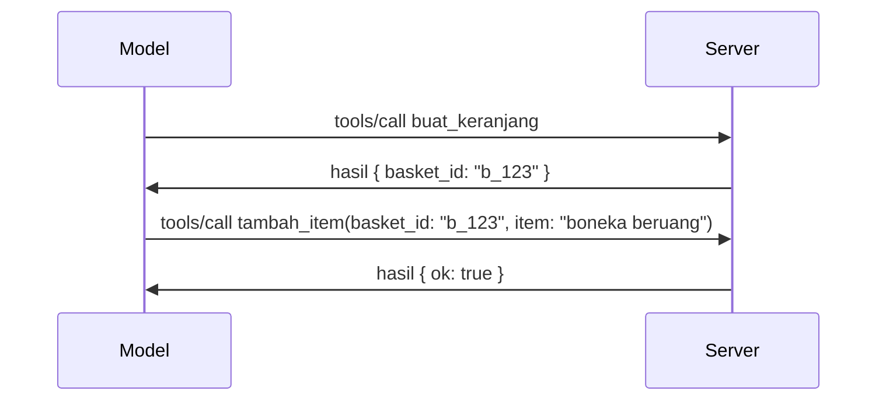

# Apa yang Berubah di MCP: Spesifikasi 2026-07-28

> **Status:** Final. Spesifikasi MCP `2026-07-28` dirilis pada 28 Juli 2026
> dan merupakan revisi protokol saat ini. Pelajaran ini menjelaskan spesifikasi final.
> Beberapa contoh kurikulum tetap secara eksplisit diberi versi
> `2025-11-25` karena SDK mereka belum mengadopsi API tanpa status yang baru;
> anggap contoh tersebut sebagai panduan kompatibilitas warisan.

## Ikhtisar

`2026-07-28` adalah revisi terbesar MCP sejak diluncurkan. Enam
Proposal Peningkatan Spesifikasi (SEP) menghapus sesi di tingkat protokol dan
membuat MCP tanpa status di lapisan transport, ekstensi menjadi mekanisme versi
kelas utama, dan beberapa fitur yang dibahas sebelumnya dalam kurikulum ini
(Roots, Sampling, Logging) dinyatakan tidak berlaku lagi berdasarkan kebijakan siklus hidup yang baru. Ini
pelajaran merangkum apa yang berubah, mengapa hal itu penting, dan apa artinya bagi kode
yang ditulis untuk `2025-11-25`.

Sumber: [The 2026-07-28 MCP Specification Release Candidate](https://blog.modelcontextprotocol.io/posts/2026-07-28-release-candidate/) (Model Context Protocol Blog, David Soria Parra dan Den Delimarsky).

## Tujuan Pembelajaran

Pada akhir pelajaran ini, Anda akan dapat:

- Menjelaskan mengapa MCP beralih ke inti protokol tanpa status dan masalah apa yang diselesaikannya untuk penyebaran skala horizontal.
- Mendeskripsikan bagaimana jabat tangan `initialize`/`initialized` dan header `Mcp-Session-Id` digantikan.
- Mengidentifikasi header baru `Mcp-Method` dan `Mcp-Name` serta metadata caching `ttlMs`/`cacheScope`.
- Mengenali kerangka Extensions dan dua ekstensi yang dikirimkan dengan rilis ini: MCP Apps dan Tasks.
- Merangkum penguatan otorisasi dan penghapusan Dynamic Client Registration.

- Mengidentifikasi fitur inti mana (Roots, Sampling, Logging) yang sekarang sudah tidak berlaku lagi, dan arti praktisnya.
- Menjelaskan perubahan Full JSON Schema 2020-12 untuk tool `inputSchema`/`outputSchema`.

## Protokol Tanpa Status

Perubahan utama: MCP menjadi tanpa status di lapisan protokol.

### Sebelumnya (2025-11-25): sesi mengikat Anda ke satu instance server

Memanggil tool lewat Streamable HTTP dimulai dengan jabat tangan `initialize`. Server merespon dengan header `Mcp-Session-Id` yang harus dibawa setiap permintaan berikutnya:

```http
POST /mcp HTTP/1.1
Mcp-Session-Id: 1868a90c-3a3f-4f5b
Content-Type: application/json

{"jsonrpc":"2.0","id":2,"method":"tools/call",
 "params":{"name":"search","arguments":{"q":"otters"}}}
```

Karena sesi terikat pada instance server yang mengeluarkannya, penyebaran skala horizontal membutuhkan **sticky routing** di load balancer dan **shared session store** antar instance.

### Setelah (2026-07-28): setiap permintaan berdiri sendiri

```http
POST /mcp HTTP/1.1
MCP-Protocol-Version: 2026-07-28
Mcp-Method: tools/call
Mcp-Name: search
Content-Type: application/json

{"jsonrpc":"2.0","id":1,"method":"tools/call",
 "params":{"name":"search","arguments":{"q":"otters"},
           "_meta":{"io.modelcontextprotocol/protocolVersion":"2026-07-28",
                    "io.modelcontextprotocol/clientInfo":{"name":"my-app","version":"1.0"},
                    "io.modelcontextprotocol/clientCapabilities":{}}}}
```

Setiap instance server dapat menangani permintaan ini. Perubahan utama:

- **Jabat tangan `initialize`/`initialized` dihapus** ([SEP-2575](https://github.com/modelcontextprotocol/modelcontextprotocol/pull/2575)). Versi protokol, info klien, dan kapabilitas klien dipindahkan ke `_meta` di setiap permintaan. Metode baru `server/discover` memungkinkan klien mengambil kapabilitas server sebelumnya saat membutuhkannya.
- **Header `Mcp-Session-Id` dan sesi di tingkat protokol dihapus** ([SEP-2567](https://github.com/modelcontextprotocol/modelcontextprotocol/pull/2567)). Sticky routing dan shared session store tidak lagi diperlukan di lapisan protokol.

### Protokol tanpa status, aplikasi berstatus

Penghapusan sesi di tingkat protokol tidak berarti server Anda tidak bisa berstatus. Pola yang direkomendasikan sama seperti yang selalu digunakan API HTTP: buat pegangan eksplisit (seperti `basket_id`, `browser_id`) dari pemanggilan tool, dan model mengoper pegangan itu kembali sebagai argumen biasa pada panggilan berikutnya.



Ini membuat status terlihat dan masuk akal bagi model daripada disembunyikan dalam metadata transport, dan memungkinkan setiap instance server menangani setiap panggilan.

### Permintaan server-ke-klien, direstrukturisasi

Protokol tanpa status tetap membutuhkan cara agar server dapat meminta sesuatu dari klien di tengah panggilan (misal prompt elicitation):

- **Permintaan yang diprakarsai server hanya dapat dilakukan saat server sedang memproses permintaan klien** ([SEP-2260](https://github.com/modelcontextprotocol/modelcontextprotocol/pull/2260)) — sebelumnya hanya rekomendasi, kini menjadi keharusan. Pengguna tak pernah diprompt secara tiba-tiba.
- **Multi Round-Trip Requests** ([SEP-2322](https://github.com/modelcontextprotocol/modelcontextprotocol/pull/2322)) menggantikan cara membuka aliran SSE terus-menerus. Sebagai gantinya, server mengembalikan `InputRequiredResult`:

  ```json
  {
    "resultType": "input_required",
    "inputRequests": {
      "confirm": {
        "type": "elicitation",
        "message": "Delete 3 files?",
        "schema": { "type": "boolean" }
      }
    },
    "requestState": "eyJzdGVwIjoxLCJmaWxlcyI6WyJhIiwiYiIsImMiXX0="
  }
  ```

  Klien mengumpulkan jawaban dan mengulangi panggilan asli dengan `inputResponses` plus `requestState` yang tercermin. Setiap instance server dapat melanjutkan percobaan karena semua yang dibutuhkan ada dalam payload.

### Dapat diarahkan, dapat di-cache, dapat dilacak

Tiga perubahan kecil membuat traffic tanpa status lebih mudah dioperasikan:

- **Header `Mcp-Method` dan `Mcp-Name` wajib di Streamable HTTP** ([SEP-2243](https://github.com/modelcontextprotocol/modelcontextprotocol/pull/2243)), sehingga load balancer, gateway, dan pembatas kecepatan dapat mengarahkan operasi tanpa perlu memeriksa isi JSON. Server menolak permintaan jika header dan badan tidak cocok.
- **`tools/list` dan hasil pembacaan sumber daya membawa `ttlMs` dan `cacheScope`** ([SEP-2549](https://github.com/modelcontextprotocol/modelcontextprotocol/pull/2549)), dimodelkan berdasarkan HTTP `Cache-Control`. Klien tahu berapa lama hasil daftar masih segar dan apakah aman dibagi antar pengguna, tanpa perlu membuka aliran SSE yang berjalan lama untuk mengetahui perubahan.
- **Propagasi W3C Trace Context di `_meta` didokumentasikan** ([SEP-414](https://github.com/modelcontextprotocol/modelcontextprotocol/pull/414)), memperbaiki nama kunci `traceparent`, `tracestate`, dan `baggage` sehingga jejak terdistribusi dapat mengikuti panggilan antar SDK klien, server MCP, dan sistem lanjutan di backend yang kompatibel dengan [OpenTelemetry](https://opentelemetry.io/).

## Ekstensi Menjadi Kelas Pertama

Ekstensi sudah ada secara informal dalam `2025-11-25`. [SEP-2133](https://github.com/modelcontextprotocol/modelcontextprotocol/pull/2133) memformalkan hal tersebut:

- Ekstensi diidentifikasi dengan ID reverse-DNS.
- Mereka dinegosiasikan melalui peta `extensions` pada kapabilitas klien dan server.
- Mereka ditempatkan di repositori `ext-*` tersendiri dengan pemelihara yang didelegasikan dan versi terpisah dari spesifikasi inti.
- Jalur Ekstensi baru dalam proses SEP memberi mereka jalan dari eksperimental ke resmi.

Rilis ini membawa dua ekstensi resmi.

### MCP Apps: antarmuka pengguna yang dirender di server

[MCP Apps](https://blog.modelcontextprotocol.io/posts/2026-01-26-mcp-apps/) ([SEP-1865](https://github.com/modelcontextprotocol/modelcontextprotocol/pull/1865)) memungkinkan server mengirim antarmuka HTML interaktif yang dirender host dalam iframe yang terisolasi (sandboxed). Tools mendeklarasikan template UI mereka sebelumnya supaya host dapat prefetch, cache, dan melakukan review keamanan sebelum dijalankan. Anda sudah mempelajari dasarnya di [Pelajaran 15: MCP Apps](../03-GettingStarted/15-mcp-apps/README.md) — dalam kerangka Extensions, MCP Apps sekarang secara resmi adalah ekstensi bukan fitur inti eksperimental.

### Tasks naik tingkat menjadi ekstensi

Tasks dikirim sebagai fitur inti eksperimental dalam `2025-11-25`. Penggunaan produksi menunjukkan perlu redesain, tempat yang tepat adalah sebagai ekstensi: [ekstensi Tasks](https://github.com/modelcontextprotocol/modelcontextprotocol/pull/2663) merestrukturisasi siklus hidup model tanpa status — server dapat menjawab `tools/call` dengan pegangan task, dan klien menggerakkannya dengan `tasks/get`, `tasks/update`, dan `tasks/cancel`. Pembuatan task diarahkan server: klien mengiklankan ekstensi, dan server menentukan kapan panggilan harus dijalankan sebagai task. `tasks/list` dihapus sepenuhnya karena tidak dapat dibatasi secara aman tanpa sesi.

> **Catatan migrasi:** jika Anda mengimplementasikan API Tasks eksperimental `2025-11-25`, Anda perlu bermigrasi ke siklus hidup ekstensi baru — ini tidak kompatibel mundur.

## Penguatan Otorisasi

Beberapa SEP memperkuat
[spesifikasi otorisasi](https://modelcontextprotocol.io/specification/2026-07-28/basic/authorization)
untuk lebih selaras dengan penyebaran OAuth 2.0 / OpenID Connect dunia nyata:

| SEP | Perubahan |
|---|---|
| [SEP-2468](https://github.com/modelcontextprotocol/modelcontextprotocol/pull/2468) | Klien harus memvalidasi parameter `iss` pada respon otorisasi sesuai [RFC 9207](https://www.rfc-editor.org/rfc/rfc9207), mencegah serangan mix-up yang umum pada pola MCP klien tunggal dengan banyak server. Versi mendatang akan mengharuskan menolak respon yang tidak memiliki `iss`. |
| [SEP-837](https://github.com/modelcontextprotocol/modelcontextprotocol/pull/837) | Klien Dynamic Client Registration hanya untuk kompatibilitas mendeklarasikan `application_type` OpenID Connect mereka, menghindari default `"web"` yang salah untuk klien desktop dan CLI. |
| [SEP-2352](https://github.com/modelcontextprotocol/modelcontextprotocol/pull/2352) | Kredensial yang terdaftar untuk kompatibilitas saja diikat ke `issuer` server otorisasi penerbit; klien mendaftar ulang jika sumber daya berpindah. |
| [SEP-2207](https://github.com/modelcontextprotocol/modelcontextprotocol/pull/2207) | Mendokumentasikan cara meminta token refresh dari server otorisasi gaya OpenID Connect. |
| [SEP-2350](https://github.com/modelcontextprotocol/modelcontextprotocol/pull/2350) | Memperjelas akumulasi ruang lingkup saat otorisasi peningkatan hak akses. |
| [SEP-2351](https://github.com/modelcontextprotocol/modelcontextprotocol/pull/2351) | Memperjelas suffix penemuan `.well-known`. |

Jika Anda membangun server otorisasi untuk MCP, berikan `iss` pada
respon otorisasi dan ikuti spesifikasi otorisasi final. Lihat
[02-Security](../02-Security/README.md) untuk panduan implementasi.

Dynamic Client Registration tetap tersedia untuk kompatibilitas tapi juga
sudah tidak berlaku lagi di `2026-07-28`. Implementasi baru harus menggunakan Client ID Metadata
Documents.

## Fitur yang Tidak Berlaku Lagi

Berdasarkan
[kebijakan siklus hidup fitur](https://github.com/modelcontextprotocol/modelcontextprotocol/pull/2577),
Roots, Sampling, Logging, dan Dynamic Client Registration **Tidak Berlaku Lagi**:

| Fitur | Pengganti yang direkomendasikan |
|---|---|
| Roots | Parameter tool, URI sumber daya, atau konfigurasi server |
| Sampling | Integrasi langsung dengan API penyedia LLM |
| Logging | `stderr` untuk transport stdio; OpenTelemetry untuk observabilitas terstruktur |
| Dynamic Client Registration | Client ID Metadata Documents |

Fitur-fitur ini tetap ada di `2026-07-28` untuk kompatibilitas. Mereka dapat
dihapus pada revisi spesifikasi pertama yang dirilis setelah atau tepat pada 28 Juli 2027;
penghapusan sebenarnya mungkin terjadi kemudian. Implementasi baru harus menggunakan
pola pengganti di atas.

## JSON Schema 2020-12 Penuh untuk Tools

Tool `inputSchema` dan `outputSchema` diangkat ke [JSON Schema 2020-12](https://json-schema.org/draft/2020-12) penuh ([SEP-2106](https://github.com/modelcontextprotocol/modelcontextprotocol/pull/2106)):

- Skema input tetap memiliki batas root `type: "object"` tetapi sekarang mengizinkan komposisi (`oneOf`, `anyOf`, `allOf`), kondisi, dan referensi (`$ref`, `$defs`).
- Skema output tidak dibatasi, dan `structuredContent` kini bisa berupa nilai JSON apa saja bukan hanya objek.
- Implementasi tidak boleh secara otomatis mendereferensi URI `$ref` eksternal dan sebaiknya membatasi kedalaman skema dan waktu validasi (mempertimbangkan serangan denial-of-service jika Anda memvalidasi skema di sisi server).

Terpisah, kode error untuk sumber daya yang hilang berubah dari MCP-kustom `-32002` menjadi standar JSON-RPC `-32602` (Invalid Params) ([SEP-2164](https://github.com/modelcontextprotocol/modelcontextprotocol/pull/2164)). Jika klien Anda mencocokkan nilai literal `-32002`, Anda perlu memperbaruinya.

## Bagaimana Protokol Berkembang dari Sini

Rilis ini mengandung perubahan besar, yang tidak dimaksudkan para pemelihara MCP menjadi norma ke depan. Tiga SEP tata kelola bertujuan mencegah pengulangan:

- **kebijakan siklus hidup fitur** memberikan setiap fitur jalur Aktif → Tidak Berlaku Lagi → Dihapus dengan setidaknya dua belas bulan antara tidak berlaku dan kemungkinan penghapusan awal.
- **kerangka kerja Extensions** memungkinkan kapabilitas baru dikirim sebagai ekstensi opt-in dan distabilkan di sana sebelum (jika pernah) masuk ke spesifikasi inti.
- SEP Jalur Standar tidak dapat mencapai status Final sampai skenario yang cocok muncul di [conformance suite](https://github.com/modelcontextprotocol/conformance) ([SEP-2484](https://github.com/modelcontextprotocol/modelcontextprotocol/pull/2484)) — suite yang sama yang mengukur SDK resmi terhadap [sistem tingkatan SDK](https://github.com/modelcontextprotocol/modelcontextprotocol/pull/1777).

## Garis Waktu Rilis dan Validasi

- Kandidat rilis dikunci 21 Mei 2026.
- Spesifikasi final dirilis 28 Juli 2026.

- Dukungan SDK mungkin tertinggal dari spesifikasi. Periksa
  [dokumentasi SDK](https://modelcontextprotocol.io/docs/sdk) dan catatan rilis SDK
  sebelum memigrasi contoh.
- Lacak perubahan akhir di
  [spesifikasi 2026-07-28](https://modelcontextprotocol.io/specification/2026-07-28/)
  dan
  [catatan perubahannya](https://modelcontextprotocol.io/specification/2026-07-28/changelog).

## Apa Artinya Ini untuk Kurikulum Ini

Kurikulum sedang beralih dari contoh `2025-11-25` ke spesifikasi saat ini
`2026-07-28`. Secara konkret:

- **Sesi dan jabat tangan `initialize`** dalam contoh yang secara eksplisit menargetkan
  `2025-11-25` adalah perilaku warisan. Protokol `2026-07-28` menggantinya
  dengan model permintaan tanpa status di atas.
- **Sampling dan Roots** tetap tersedia untuk kompatibilitas tetapi sudah usang.
  Desain baru harus menggunakan pola pengganti yang tercantum di atas.
- **Fitur Tugas eksperimen**, jika Anda telah menggunakannya, perlu dimigrasi ke lifecycle baru ekstensi Tugas.
- **Aplikasi MCP** ([Pelajaran 15](../03-GettingStarted/15-mcp-apps/README.md)) tidak terpengaruh secara praktis; hanya saja dipindahkan ke bawah kerangka Ekstensi formal.

## Sumber Daya Tambahan

- [Spesifikasi MCP 2026-07-28](https://modelcontextprotocol.io/specification/2026-07-28/)
- [Catatan Perubahan 2026-07-28](https://modelcontextprotocol.io/specification/2026-07-28/changelog)
- [Kandidat Rilis Spesifikasi MCP 2026-07-28 (posting blog historis)](https://blog.modelcontextprotocol.io/posts/2026-07-28-release-candidate/)
- [Masa Depan Transport MCP](https://blog.modelcontextprotocol.io/posts/2025-12-19-mcp-transport-future/)
- [Panduan SEP](https://modelcontextprotocol.io/community/sep-guidelines)
- [Sistem Tingkat SDK MCP](https://modelcontextprotocol.io/docs/sdk)

## Langkah Selanjutnya

Kembali ke [Konsep Inti](./README.md) atau lanjut ke
[Keamanan](../02-Security/README.md) untuk menerapkan panduan `2026-07-28` saat ini.

---

<!-- CO-OP TRANSLATOR DISCLAIMER START -->
**Penafian**:
Dokumen ini telah diterjemahkan menggunakan layanan terjemahan AI [Co-op Translator](https://github.com/Azure/co-op-translator). Meskipun kami berupaya untuk mencapai akurasi, harap diketahui bahwa terjemahan otomatis mungkin mengandung kesalahan atau ketidakakuratan. Dokumen asli dalam bahasa aslinya harus dianggap sebagai sumber yang sah. Untuk informasi penting, disarankan menggunakan terjemahan profesional oleh manusia. Kami tidak bertanggung jawab atas kesalahpahaman atau penafsiran yang keliru yang timbul dari penggunaan terjemahan ini.
<!-- CO-OP TRANSLATOR DISCLAIMER END -->