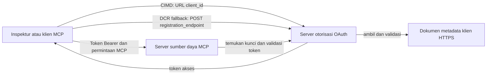

# Contoh Otorisasi CIMD dan DCR

Contoh TypeScript ini membandingkan dua cara klien OAuth dapat memperoleh identitas
sebelum mengakses server MCP yang dilindungi:

- **Client ID Metadata Documents (CIMD)** menggunakan URL HTTPS yang stabil sebagai
  `client_id`. Ini adalah mekanisme yang disukai untuk klien dan server otorisasi
  yang tidak memiliki hubungan sebelumnya.
- **Dynamic Client Registration (DCR)** meminta server otorisasi untuk menghasilkan
  client ID yang tidak dapat dibaca saat runtime. MCP `2026-07-28` mempertahankan DCR hanya demi
  kompatibilitas mundur.

Contoh ini menggunakan SDK TypeScript MCP v2 yang stabil dan model permintaan
MCP `2026-07-28` yang tanpa status. Ini bekerja dengan server otorisasi
OAuth 2.1/OpenID Connect eksternal seperti Auth0. Server MCP adalah server sumber daya:
ia memvalidasi token akses tetapi tidak mengautentikasi pengguna atau mengeluarkan
token.

## Tujuan Pembelajaran

Dengan menyelesaikan contoh ini, Anda akan dapat:

- Menjelaskan mengapa CIMD lebih disukai daripada DCR untuk klien MCP baru.
- Menerbitkan dokumen CIMD yang valid untuk klien asli publik.
- Mengonfigurasi server sumber daya MCP untuk penemuan OAuth dan validasi JWT.
- Mencoba CIMD dan DCR dengan server MCP dan server otorisasi yang sama.
- Menerapkan cakupan OAuth di dalam alat MCP.
- Mengidentifikasi tanggung jawab yang dimiliki oleh klien, server sumber daya, dan
  server otorisasi.

## Arsitektur



Server otorisasi memilih dan memvalidasi mekanisme pendaftaran.
Server MCP hanya melihat klaim `client_id` terverifikasi yang dihasilkan. URL HTTPS
dengan path menunjukkan CIMD. ID yang tidak dapat dibaca tidak cukup untuk membuktikan DCR karena seorang
klien pra-registrasi juga dapat menggunakan ID yang tidak dapat dibaca; pengaturan opsional
`DCR_CLIENT_ID_PREFIX` menyediakan petunjuk demo spesifik penyedia.

## Prioritas Pendaftaran

Klien MCP yang mendukung semua mekanisme harus menggunakan urutan ini:

1. Gunakan informasi klien pra-registrasi jika sudah tersedia.
2. Gunakan CIMD saat server otorisasi mengiklankan
   `client_id_metadata_document_supported: true`.
3. Gunakan DCR hanya sebagai cadangan jika server mengiklankan
   `registration_endpoint`.
4. Minta pengguna informasi klien pra-registrasi jika tidak ada yang di atas yang
   tersedia.

## Tata Letak Proyek

```text
src/
  config.ts          Environment validation
  dcr.ts             DCR compatibility request
  mcp.ts             MCP tools and scope checks
  oauth.ts           Authorization metadata and JWT verification
  register-dcr.ts    DCR command-line helper
  registration.ts    CIMD document and mechanism classification
  server.ts          Express, OAuth discovery, and MCP endpoint
test/
  dcr.test.ts
  oauth.test.ts
  registration.test.ts
  server.test.ts
```

## Prasyarat

- Node.js 20.6 atau lebih baru. Skrip menggunakan `--env-file` dan `--import`.
- Server otorisasi OAuth 2.1/OpenID Connect yang mendukung:
  - Alur kode otorisasi dengan S256 PKCE.
  - Metadata Sumber Daya yang Dilindungi OAuth dan Indikator Sumber Daya.
  - Token akses JWT dan titik akhir JWKS.
  - CIMD, plus DCR jika Anda ingin membandingkan fallback warisan.
- MCP Inspector atau klien MCP `2026-07-28` lainnya.
- URL HTTPS publik untuk dokumen CIMD. Terowongan pengembangan cocok
  untuk lab; gunakan domain stabil dalam produksi.

## Instalasi dan Pengujian

```bash
npm install
npm run build
npm test
```

Dua belas pengujian menggunakan kunci lokal dan titik akhir HTTP tiruan. Mereka tidak memerlukan
akun server otorisasi. Mereka memverifikasi:

- Bentuk dokumen CIMD dan batasan URL.
- Klasifikasi jujur dari URL dan ID klien yang tidak dapat dibaca.
- Penanganan permintaan dan respons DCR.
- Penolakan titik akhir DCR non-loopback yang tidak aman.

- Validasi tanda tangan JWT, penerbit, audiens, kedaluwarsa, ID klien, dan ruang lingkup.
- Panggilan MCP `2026-07-28` dalam proses ke `registration-info`.

## Konfigurasi Server Otorisasi

Nama kontrol tepat bervariasi menurut penyedia. Konfigurasikan kemampuan ini:

1. Buat API atau server sumber daya yang pengenalannya persis sesuai URL MCP Anda,
   termasuk `/mcp`, misalnya `http://127.0.0.1:3001/mcp`.
2. Gunakan token akses RS256 dan sertakan klaim `client_id` atau `azp`.
3. Tambahkan izin atau ruang lingkup `tool:greet`.
4. Aktifkan alur kode otorisasi dengan S256 PKCE untuk klien asli publik.
5. Aktifkan Dokumen Metadata ID Klien.
6. Untuk perbandingan saja, aktifkan Pendaftaran Klien Dinamis.
7. Pastikan metadata server otorisasi mengiklankan:
   - `issuer`
   - `authorization_endpoint`
   - `token_endpoint`
   - `jwks_uri`
   - `client_id_metadata_document_supported: true`
   - `registration_endpoint` saat DCR diaktifkan

### Contoh Auth0

Untuk Auth0, aktifkan Pendaftaran Dokumen Metadata ID Klien, Pendaftaran Aplikasi Dinamis OIDC,
dan kompatibilitas Parameter Sumber Daya. Buat API dengan pengenal URL MCP yang persis sama
dan tambahkan izin `tool:greet`.
Izinkan pengguna uji dan klien pihak ketiga untuk meminta izin itu.

Dasbor penyedia dan ketersediaan fitur berubah seiring waktu. Periksa dokumentasi
penyedia sebelum menggunakan pengaturan ini di luar lab ini.

## Konfigurasi Sampel

Buat `.env` dari contoh:

```powershell
Copy-Item .env.example .env
```

Di shell yang kompatibel bash:

```bash
cp .env.example .env
```

Tetapkan nilai berikut:

```dotenv
MCP_SERVER_URL=http://127.0.0.1:3001/mcp
AUTHORIZATION_SERVER_ISSUER=https://your-tenant.example.com/
AUTHORIZATION_SERVER_METADATA_URL=https://your-tenant.example.com/.well-known/openid-configuration
CLIENT_METADATA_URL=https://your-public-host.example.com/client-metadata.json
OAUTH_REDIRECT_URIS=http://127.0.0.1:6274/oauth/callback
DCR_CLIENT_ID_PREFIX=tpc_
```

Detail penting:

- `AUTHORIZATION_SERVER_ISSUER` harus persis sama dengan `issuer` dalam metadata
  server otorisasi yang ditemukan, termasuk tanda slash akhir jika ada.
- `MCP_SERVER_URL` harus cocok dengan audiens token akses.
- `CLIENT_METADATA_URL` harus menggunakan HTTPS, mengandung jalur yang bukan root, dan
  merupakan URL publik yang menyajikan rute metadata. String kueri dan fragmen tidak
  diterima sehingga rute dan `client_id` tetap identik.
- `OAUTH_REDIRECT_URIS` adalah daftar izinkan yang dipisahkan koma. Defaultnya adalah
  callback loopback Inspektur MCP.
- `DCR_CLIENT_ID_PREFIX` bersifat opsional dan spesifik penyedia. Biarkan kosong jika
  penyedia Anda tidak memiliki prefix DCR yang dapat diandalkan.

## Publikasikan Dokumen CIMD

Mulai tunnel yang meneruskan origin HTTPS publiknya ke `127.0.0.1:3001`.
Tetapkan `CLIENT_METADATA_URL` ke origin tersebut ditambah `/client-metadata.json`, lalu jalankan:

```bash
npm run build
npm start
```

Verifikasi kedua dokumen penemuan:

```bash
curl http://127.0.0.1:3001/health
curl http://127.0.0.1:3001/client-metadata.json
curl http://127.0.0.1:3001/.well-known/oauth-protected-resource/mcp
```

`client_id` yang dikembalikan oleh URL metadata HTTPS publik harus identik byte-per-byte
dengan URL itu. Server otorisasi harus memvalidasi dokumen dan
URI pengalihan sebelum mengeluarkan token.

> [!NOTE]
> Sampel menghosting dokumen klien dan server sumber daya MCP dalam satu proses
> untuk menjaga lab tetap kecil. Dalam produksi, klien MCP memiliki dan menghosting
> dokumen CIMD-nya secara terpisah dari server sumber daya.

## Bandingkan CIMD dan DCR

Mulai Inspektur MCP:

```bash
npx @modelcontextprotocol/inspector
```

Gunakan HTTP Streamable dan sambungkan ke `http://127.0.0.1:3001/mcp`.


### CIMD (Diutamakan)


1. Masukkan `CLIENT_METADATA_URL` publik sebagai OAuth Client ID.
2. Minta `tool:greet` plus cakupan identitas apa pun yang diperlukan oleh penyedia Anda.
3. Selesaikan masuk dan persetujuan.
4. Panggil `registration-info`. Ini melaporkan `mechanism: "cimd"`.
5. Panggil `greet` untuk memverifikasi penegakan cakupan.

### DCR (Fallback Kompatibilitas)

1. Bersihkan status OAuth tersimpan di Inspector.
2. Biarkan OAuth Client ID kosong agar Inspector dapat menggunakan
   `registration_endpoint` yang diiklankan.
3. Selesaikan masuk dan persetujuan.
4. Panggil `registration-info`.
5. Jika `DCR_CLIENT_ID_PREFIX` cocok dengan ID yang dibuat oleh penyedia, alat
   melaporkan `mechanism: "dcr"`; jika tidak, alat melaporkan dengan benar
   `opaque-client-id`.

Anda juga dapat mendemonstrasikan permintaan pendaftaran secara langsung:

```bash
npm run build
npm run register:dcr
```

Pembantu mencetak ID klien yang dikembalikan tetapi tidak pernah mencetak rahasia klien.
Perlakukan rahasia yang dikembalikan sebagai informasi sensitif dan simpan di tempat penyimpanan rahasia yang tepat.

## Alat

| Alat | Cakupan yang diperlukan | Tujuan |
| --- | --- | --- |
| `registration-info` | Klien terverifikasi | Melaporkan jenis ID klien |
| `greet` | `tool:greet` | Menunjukkan otorisasi per alat |

## Catatan Keamanan

- Validasi tanda tangan JWT melalui endpoint JWKS server otorisasi.
- Minta pencocokan penerbit dan audiens yang tepat.
- Minta klaim kedaluwarsa dan ID klien.
- Jangan pernah menerima token yang diterbitkan untuk sumber daya yang berbeda.
- Jangan pernah meneruskan token MCP ke API downstream.
- Pertahankan kredensial DCR terkait dengan penerbit yang membuatnya.
- Validasi redirect URI CIMD dengan pencocokan tepat.
- Terapkan kontrol SSRF saat server otorisasi mengambil URL CIMD.
- Gunakan HTTPS untuk endpoint otorisasi dan metadata di luar pengembangan loopback.

- Jangan simpulkan DCR dari ID klien yang buram kecuali penyedia mendokumentasikan konvensi pengenal yang dapat diandalkan.


## Referensi

- [Spesifikasi otorisasi MCP](https://modelcontextprotocol.io/specification/2026-07-28/basic/authorization)
- [Pendaftaran klien MCP](https://modelcontextprotocol.io/specification/2026-07-28/basic/authorization/client-registration)
- [Praktik keamanan terbaik MCP](https://modelcontextprotocol.io/specification/2026-07-28/basic/security_best_practices)
- [Panduan otorisasi SDK TypeScript MCP v2](https://ts.sdk.modelcontextprotocol.io/v2/serving/authorization)
- [Pendaftaran Klien Dinamis OAuth (RFC 7591)](https://datatracker.ietf.org/doc/html/rfc7591)
- [Draf Dokumen Metadata Client ID OAuth](https://datatracker.ietf.org/doc/html/draft-ietf-oauth-client-id-metadata-document-00)

## Pengakuan

Pendekatan pengajaran berdampingan ini terinspirasi oleh
[Sambego/auth0-xmcp-cimd](https://github.com/Sambego/auth0-xmcp-cimd). Ini
adalah contoh implementasi netral penyedia yang asli yang dibangun dengan MCP
SDK TypeScript resmi v2 untuk kurikulum ini.

---

<!-- CO-OP TRANSLATOR DISCLAIMER START -->
**Penafian**:
Dokumen ini telah diterjemahkan menggunakan layanan terjemahan AI [Co-op Translator](https://github.com/Azure/co-op-translator). Meskipun kami berupaya untuk mencapai akurasi, harap diketahui bahwa terjemahan otomatis mungkin mengandung kesalahan atau ketidakakuratan. Dokumen asli dalam bahasa aslinya harus dianggap sebagai sumber yang sah. Untuk informasi penting, disarankan menggunakan terjemahan profesional oleh manusia. Kami tidak bertanggung jawab atas kesalahpahaman atau penafsiran yang keliru yang timbul dari penggunaan terjemahan ini.
<!-- CO-OP TRANSLATOR DISCLAIMER END -->