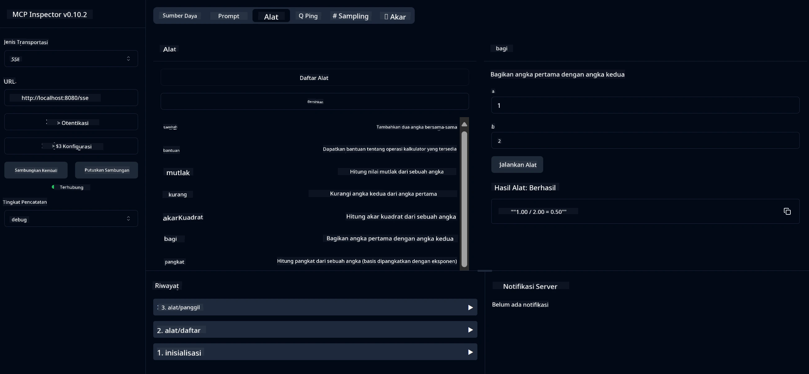

# Layanan Kalkulator Dasar MCP

> [!NOTE]
> Solusi Java ini menggunakan transport HTTP+SSE warisan dan menargetkan SDK
> yang kompatibel dengan MCP `2025-11-25`. Ini dipertahankan untuk mencocokkan kode kursus;
> server jarak jauh baru harus menggunakan dukungan HTTP Streamable `2026-07-28`.

Layanan ini menyediakan operasi kalkulator dasar melalui Protokol Konteks Model (MCP) menggunakan Spring Boot dengan transport WebFlux. Ini dirancang sebagai contoh sederhana untuk pemula yang mempelajari implementasi MCP.

Untuk informasi lebih lanjut, lihat dokumentasi referensi [MCP Server Boot Starter](https://docs.spring.io/spring-ai/reference/api/mcp/mcp-server-boot-starter-docs.html).


## Menggunakan Layanan

Layanan ini menyediakan endpoint API berikut melalui protokol MCP:

- `add(a, b)`: Menjumlahkan dua angka
- `subtract(a, b)`: Mengurangkan angka kedua dari yang pertama
- `multiply(a, b)`: Mengalikan dua angka
- `divide(a, b)`: Membagi angka pertama dengan angka kedua (dengan pemeriksaan nol)
- `power(base, exponent)`: Menghitung pangkat sebuah angka
- `squareRoot(number)`: Menghitung akar kuadrat (dengan pemeriksaan angka negatif)
- `modulus(a, b)`: Menghitung sisa hasil bagi
- `absolute(number)`: Menghitung nilai mutlak

## Ketergantungan

Proyek ini memerlukan ketergantungan utama berikut:

```xml
<dependency>
    <groupId>org.springframework.ai</groupId>
    <artifactId>spring-ai-starter-mcp-server-webflux</artifactId>
</dependency>
```

## Membangun Proyek

Bangun proyek menggunakan Maven:
```bash
./mvnw clean install -DskipTests
```

## Menjalankan Server

### Menggunakan Java

```bash
java -jar target/calculator-server-0.0.1-SNAPSHOT.jar
```

### Menggunakan MCP Inspector

MCP Inspector adalah alat yang berguna untuk berinteraksi dengan layanan MCP. Untuk menggunakannya dengan layanan kalkulator ini:

1. **Pasang dan jalankan MCP Inspector** di jendela terminal baru:
   ```bash
   npx @modelcontextprotocol/inspector
   ```

2. **Akses antarmuka web** dengan mengklik URL yang ditampilkan oleh aplikasi (biasanya http://localhost:6274)

3. **Konfigurasikan koneksi**:
   - Atur tipe transport menjadi "SSE"
   - Atur URL ke endpoint SSE server yang sedang berjalan: `http://localhost:8080/sse`
   - Klik "Connect"

4. **Gunakan alatnya**:
   - Klik "List Tools" untuk melihat operasi kalkulator yang tersedia
   - Pilih alat dan klik "Run Tool" untuk menjalankan operasi



---

<!-- CO-OP TRANSLATOR DISCLAIMER START -->
**Penafian**:
Dokumen ini telah diterjemahkan menggunakan layanan terjemahan AI [Co-op Translator](https://github.com/Azure/co-op-translator). Meskipun kami berupaya untuk mencapai akurasi, harap diketahui bahwa terjemahan otomatis mungkin mengandung kesalahan atau ketidakakuratan. Dokumen asli dalam bahasa aslinya harus dianggap sebagai sumber yang sah. Untuk informasi penting, disarankan menggunakan terjemahan profesional oleh manusia. Kami tidak bertanggung jawab atas kesalahpahaman atau penafsiran yang keliru yang timbul dari penggunaan terjemahan ini.
<!-- CO-OP TRANSLATOR DISCLAIMER END -->