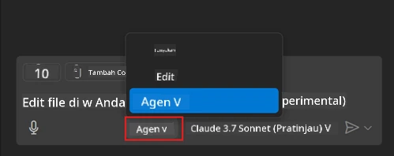
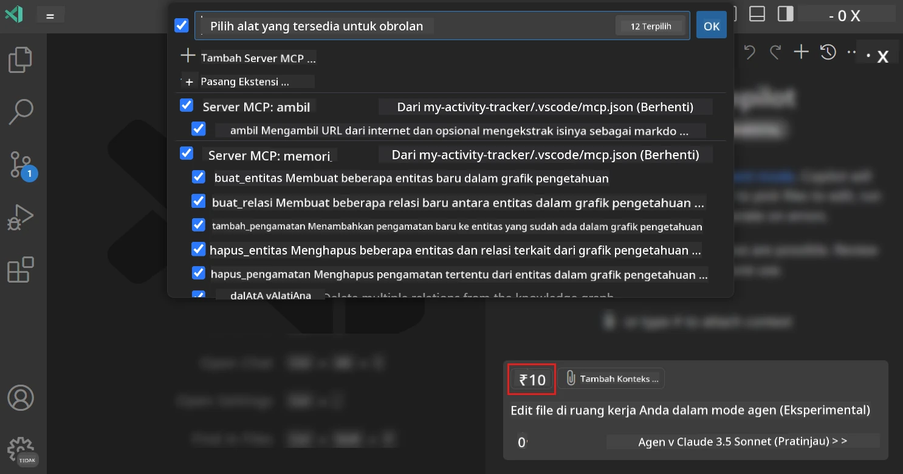
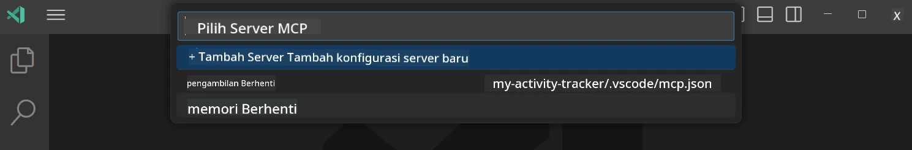
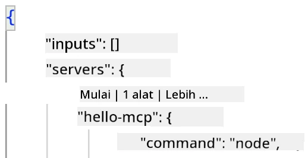
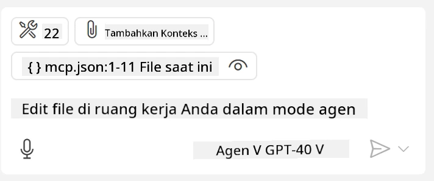
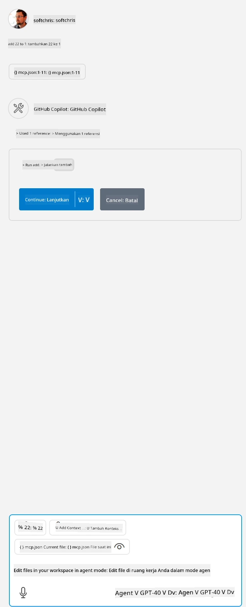

# Menggunakan server dari mode GitHub Copilot Agent

Visual Studio Code dan GitHub Copilot dapat bertindak sebagai klien dan menggunakan MCP Server. Anda mungkin bertanya, mengapa kita ingin melakukan itu? Nah, itu berarti fitur apa pun yang dimiliki MCP Server sekarang dapat digunakan langsung dari dalam IDE Anda. Bayangkan jika Anda menambahkan, misalnya, server MCP GitHub, ini akan memungkinkan untuk mengontrol GitHub melalui prompt alih-alih mengetik perintah tertentu di terminal. Atau bayangkan apa pun secara umum yang dapat meningkatkan pengalaman pengembang Anda yang seluruhnya dikendalikan oleh bahasa alami. Sekarang Anda mulai melihat keuntungannya, bukan?

## Ikhtisar

Pelajaran ini membahas cara menggunakan Visual Studio Code dan mode Agent GitHub Copilot sebagai klien untuk MCP Server Anda.

## Tujuan Pembelajaran

Pada akhir pelajaran ini, Anda akan bisa:

- Menggunakan MCP Server melalui Visual Studio Code.
- Menjalankan kemampuan seperti alat melalui GitHub Copilot.
- Mengonfigurasi Visual Studio Code untuk menemukan dan mengelola MCP Server Anda.

## Penggunaan

Anda dapat mengontrol server MCP Anda dengan dua cara berbeda:

- Antarmuka pengguna, Anda akan melihat bagaimana cara ini dilakukan nanti pada bab ini.
- Terminal, dimungkinkan mengontrol hal-hal dari terminal menggunakan executable `code`:

  Untuk menambahkan server MCP ke profil pengguna Anda, gunakan opsi baris perintah --add-mcp, dan berikan konfigurasi server JSON dalam bentuk {\"name\":\"server-name\",\"command\":...}.

  ```
  code --add-mcp "{\"name\":\"my-server\",\"command\": \"uvx\",\"args\": [\"mcp-server-fetch\"]}"
  ```

### Screenshot





Mari kita bahas lebih lanjut tentang bagaimana kita menggunakan antarmuka visual pada bagian berikutnya.

## Pendekatan

Berikut cara kita perlu mendekatinya secara garis besar:

- Mengonfigurasi file untuk menemukan MCP Server kita.
- Memulai/Menghubungkan ke server tersebut untuk melihat daftar kemampuannya.
- Menggunakan kemampuan tersebut melalui antarmuka GitHub Copilot Chat.

Bagus, sekarang kita paham alurnya, mari mencoba menggunakan MCP Server melalui Visual Studio Code lewat sebuah latihan.

## Latihan: Menggunakan server

Dalam latihan ini, kita akan mengonfigurasi Visual Studio Code untuk menemukan MCP server Anda agar dapat digunakan dari antarmuka GitHub Copilot Chat.

### -0- Langkah awal, aktifkan penemuan MCP Server

Anda mungkin perlu mengaktifkan penemuan MCP Server.

1. Pergi ke `File -> Preferences -> Settings` di Visual Studio Code.

1. Cari "MCP" dan aktifkan `chat.mcp.discovery.enabled` di file settings.json.

### -1- Membuat file konfigurasi

Mulailah dengan membuat file konfigurasi di akar proyek Anda, Anda memerlukan file bernama MCP.json dan menempatkannya di folder bernama .vscode. Isi filenya harus seperti berikut:

```text
.vscode
|-- mcp.json
```

Selanjutnya, mari kita lihat bagaimana menambahkan entri server.

### -2- Mengonfigurasi server

Tambahkan konten berikut ke *mcp.json*:

```json
{
    "inputs": [],
    "servers": {
       "hello-mcp": {
           "command": "node",
           "args": [
               "build/index.js"
           ]
       }
    }
}
```

Berikut contoh sederhana di atas tentang cara memulai server yang ditulis dalam Node.js, untuk runtime lain tunjukkan perintah yang tepat untuk memulai server menggunakan `command` dan `args`.

### -3- Menyalakan server

Sekarang setelah Anda menambahkan entri, mari mulai server:

1. Temukan entri Anda di *mcp.json* dan pastikan Anda menemukan ikon "play":

    

1. Klik ikon "play", Anda akan melihat ikon alat di GitHub Copilot Chat bertambah jumlah alat yang tersedia. Jika Anda klik ikon alat tersebut, Anda akan melihat daftar alat yang terdaftar. Anda dapat mencentang/menghilangkan centang tiap alat tergantung apakah Anda ingin GitHub Copilot menggunakannya sebagai konteks:

  

1. Untuk menjalankan alat, ketik prompt yang Anda tahu akan cocok dengan deskripsi salah satu alat Anda, contohnya prompt seperti "add 22 to 1":

  

  Anda harus melihat respons yang menyebutkan 23.

## Tugas

Coba tambahkan entri server ke file *mcp.json* Anda dan pastikan Anda dapat memulai/menghentikan server. Pastikan Anda juga dapat berkomunikasi dengan alat di server Anda melalui antarmuka GitHub Copilot Chat.

## Solusi

[Solusi](./solution/README.md)

## Hal Penting yang Diperoleh

Pelajaran penting dari bab ini adalah sebagai berikut:

- Visual Studio Code adalah klien hebat yang memungkinkan Anda menggunakan beberapa MCP Server dan alat-alatnya.
- Antarmuka GitHub Copilot Chat adalah cara Anda berinteraksi dengan server.
- Anda dapat meminta input pengguna seperti API key yang dapat diteruskan ke MCP Server saat mengonfigurasi entri server di file *mcp.json*.

## Contoh

- [Kalkulator Java](../samples/java/calculator/README.md)
- [Kalkulator .Net](../../../../03-GettingStarted/samples/csharp)
- [Kalkulator JavaScript](../samples/javascript/README.md)
- [Kalkulator TypeScript](../samples/typescript/README.md)
- [Kalkulator Python](../../../../03-GettingStarted/samples/python)

## Sumber Daya Tambahan

- [Dokumentasi Visual Studio](https://code.visualstudio.com/docs/copilot/chat/mcp-servers)

## Selanjutnya

- Selanjutnya: [Membuat Server stdio](../05-stdio-server/README.md)

---

<!-- CO-OP TRANSLATOR DISCLAIMER START -->
**Penafian**:
Dokumen ini telah diterjemahkan menggunakan layanan terjemahan AI [Co-op Translator](https://github.com/Azure/co-op-translator). Meskipun kami berupaya untuk mencapai akurasi, harap diketahui bahwa terjemahan otomatis mungkin mengandung kesalahan atau ketidakakuratan. Dokumen asli dalam bahasa aslinya harus dianggap sebagai sumber yang sah. Untuk informasi penting, disarankan menggunakan terjemahan profesional oleh manusia. Kami tidak bertanggung jawab atas kesalahpahaman atau penafsiran yang keliru yang timbul dari penggunaan terjemahan ini.
<!-- CO-OP TRANSLATOR DISCLAIMER END -->