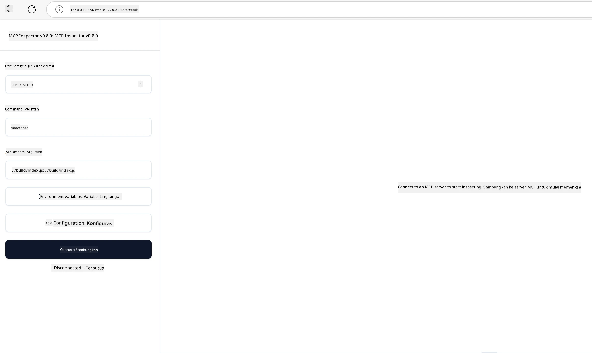

## Pengujian dan Debugging

Sebelum Anda mulai menguji server MCP Anda, penting untuk memahami alat yang tersedia dan praktik terbaik untuk debugging. Pengujian yang efektif memastikan server Anda berperilaku sesuai harapan dan membantu Anda dengan cepat mengidentifikasi dan menyelesaikan masalah. Bagian berikut menguraikan pendekatan yang direkomendasikan untuk memvalidasi implementasi MCP Anda.

## Ikhtisar

Pelajaran ini membahas cara memilih pendekatan pengujian yang tepat dan alat pengujian yang paling efektif.

## Tujuan Pembelajaran

Pada akhir pelajaran ini, Anda akan dapat:

- Menjelaskan berbagai pendekatan untuk pengujian.
- Menggunakan berbagai alat untuk menguji kode Anda secara efektif.


## Menguji Server MCP

MCP menyediakan alat untuk membantu Anda menguji dan debugging server Anda:

- **MCP Inspector**: Alat baris perintah yang dapat dijalankan sebagai alat CLI maupun alat visual.
- **Pengujian manual**: Anda dapat menggunakan alat seperti curl untuk menjalankan permintaan web, tetapi alat apa pun yang dapat menjalankan HTTP bisa digunakan.
- **Pengujian unit**: Anda dapat menggunakan kerangka pengujian favorit Anda untuk menguji fitur dari server dan klien.

### Menggunakan MCP Inspector

Kami telah menjelaskan penggunaan alat ini dalam pelajaran sebelumnya, tetapi mari kita bahas sedikit secara garis besar. Ini adalah alat yang dibangun menggunakan Node.js dan Anda dapat menggunakannya dengan memanggil executable `npx` yang akan mengunduh dan menginstal alat ini sementara waktu dan akan membersihkan dirinya sendiri setelah selesai menjalankan permintaan Anda.

[MCP Inspector](https://github.com/modelcontextprotocol/inspector) membantu Anda:

- **Menemukan Kapabilitas Server**: Otomatis mendeteksi sumber daya, alat, dan prompt yang tersedia
- **Menguji Eksekusi Alat**: Coba berbagai parameter dan lihat respons secara real-time
- **Melihat Metadata Server**: Periksa informasi server, skema, dan konfigurasi

Jalannya alat yang tipikal seperti ini:

```bash
npx @modelcontextprotocol/inspector node build/index.js
```

Perintah di atas memulai MCP dan antarmuka visualnya serta meluncurkan antarmuka web lokal di browser Anda. Anda dapat mengharapkan untuk melihat dasbor yang menampilkan server MCP terdaftar Anda, alat, sumber daya, dan prompt yang tersedia. Antarmuka memungkinkan Anda menguji eksekusi alat secara interaktif, memeriksa metadata server, dan melihat respons secara real-time, sehingga memudahkan memvalidasi dan debugging implementasi server MCP Anda.

Berikut tampilannya: 

Anda juga dapat menjalankan alat ini dalam mode CLI dengan menambahkan atribut `--cli`. Berikut contoh menjalankan alat dalam mode "CLI" yang menampilkan semua alat di server:

```sh
npx @modelcontextprotocol/inspector --cli node build/index.js --method tools/list
```

### Pengujian Manual

Selain menjalankan alat inspector untuk menguji kapabilitas server, pendekatan serupa lainnya adalah menjalankan klien yang dapat menggunakan HTTP, misalnya curl.

Dengan curl, Anda dapat menguji server MCP langsung menggunakan permintaan HTTP:

```bash
# Contoh: Metadata server pengujian
curl http://localhost:3000/v1/metadata

# Contoh: Jalankan sebuah alat
curl -X POST http://localhost:3000/v1/tools/execute \
  -H "Content-Type: application/json" \
  -d '{"name": "calculator", "parameters": {"expression": "2+2"}}'
```

Seperti yang Anda lihat dari penggunaan curl di atas, Anda menggunakan permintaan POST untuk memanggil alat menggunakan payload yang terdiri dari nama alat dan parameternya. Gunakan pendekatan yang paling sesuai dengan Anda. Alat CLI pada umumnya cenderung lebih cepat digunakan dan bisa diprogramkan, yang berguna dalam lingkungan CI/CD.

### Pengujian Unit

Buat pengujian unit untuk alat dan sumber daya Anda agar memastikan mereka berfungsi seperti yang diharapkan. Berikut contoh kode pengujian.

```python
import pytest

from mcp.server.fastmcp import FastMCP
from mcp.shared.memory import (
    create_connected_server_and_client_session as create_session,
)

# Tandai seluruh modul untuk pengujian async
pytestmark = pytest.mark.anyio


async def test_list_tools_cursor_parameter():
    """Test that the cursor parameter is accepted for list_tools.

    Note: FastMCP doesn't currently implement pagination, so this test
    only verifies that the cursor parameter is accepted by the client.
    """

 server = FastMCP("test")

    # Buat beberapa alat pengujian
    @server.tool(name="test_tool_1")
    async def test_tool_1() -> str:
        """First test tool"""
        return "Result 1"

    @server.tool(name="test_tool_2")
    async def test_tool_2() -> str:
        """Second test tool"""
        return "Result 2"

    async with create_session(server._mcp_server) as client_session:
        # Uji tanpa parameter cursor (dihilangkan)
        result1 = await client_session.list_tools()
        assert len(result1.tools) == 2

        # Uji dengan cursor=None
        result2 = await client_session.list_tools(cursor=None)
        assert len(result2.tools) == 2

        # Uji dengan cursor sebagai string
        result3 = await client_session.list_tools(cursor="some_cursor_value")
        assert len(result3.tools) == 2

        # Uji dengan cursor string kosong
        result4 = await client_session.list_tools(cursor="")
        assert len(result4.tools) == 2
    
```

Kode di atas melakukan hal berikut:

- Memanfaatkan kerangka kerja pytest yang memungkinkan Anda membuat pengujian sebagai fungsi dan menggunakan pernyataan assert.
- Membuat Server MCP dengan dua alat berbeda.
- Menggunakan pernyataan `assert` untuk memeriksa bahwa kondisi tertentu terpenuhi.

Lihat [file lengkap di sini](https://github.com/modelcontextprotocol/python-sdk/blob/main/tests/client/test_list_methods_cursor.py)

Dengan file di atas, Anda dapat menguji server Anda sendiri untuk memastikan kapabilitas dibuat sebagaimana mestinya.

Semua SDK utama memiliki bagian pengujian serupa sehingga Anda bisa menyesuaikannya dengan runtime pilihan Anda.

## Contoh 

- [Java Calculator](../samples/java/calculator/README.md)
- [.Net Calculator](../../../../03-GettingStarted/samples/csharp)
- [JavaScript Calculator](../samples/javascript/README.md)
- [TypeScript Calculator](../samples/typescript/README.md)
- [Python Calculator](../../../../03-GettingStarted/samples/python) 

## Sumber Daya Tambahan

- [Python SDK](https://github.com/modelcontextprotocol/python-sdk)

## Apa Selanjutnya

- Selanjutnya: [Deployment](../09-deployment/README.md)

---

<!-- CO-OP TRANSLATOR DISCLAIMER START -->
**Penafian**:  
Dokumen ini telah diterjemahkan menggunakan layanan terjemahan AI [Co-op Translator](https://github.com/Azure/co-op-translator). Meskipun kami berupaya untuk mencapai akurasi, harap maklum bahwa terjemahan otomatis mungkin mengandung kesalahan atau ketidakakuratan. Dokumen asli dalam bahasa aslinya harus dianggap sebagai sumber yang berwenang. Untuk informasi yang penting, disarankan menggunakan jasa penerjemahan profesional oleh manusia. Kami tidak bertanggung jawab atas kesalahpahaman atau salah tafsir yang timbul dari penggunaan terjemahan ini.
<!-- CO-OP TRANSLATOR DISCLAIMER END -->