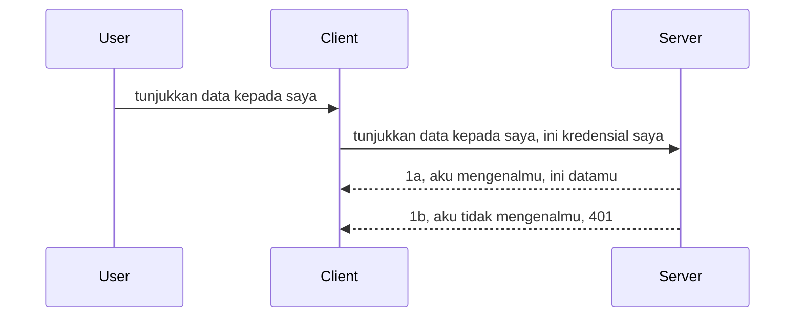

# Auth sederhana

SDK MCP mendukung penggunaan OAuth 2.1 yang sebenarnya adalah proses cukup rumit melibatkan konsep seperti server auth, server sumber daya, mengirimkan kredensial, mendapatkan kode, menukar kode untuk token bearer sampai akhirnya Anda bisa mendapatkan data sumber daya Anda. Jika Anda belum terbiasa dengan OAuth yang merupakan hal bagus untuk diimplementasikan, ada baiknya memulai dengan tingkat dasar auth dan membangun ke keamanan yang lebih baik dan lebih baik. Itulah mengapa bab ini ada, untuk membangun Anda menuju auth yang lebih maju.

## Auth, apa maksud kita?

Auth adalah singkatan dari autentikasi dan otorisasi. Idenya adalah kita perlu melakukan dua hal:

- **Autentikasi**, yang merupakan proses mengetahui apakah kita membiarkan seseorang masuk ke rumah kita, bahwa mereka memiliki hak untuk berada "di sini" yaitu memiliki akses ke server sumber daya kita tempat fitur MCP Server kita ada.
- **Otorisasi**, adalah proses mengetahui apakah pengguna harus memiliki akses ke sumber daya tertentu yang mereka minta, misalnya pesanan ini atau produk ini atau apakah mereka diizinkan membaca konten tetapi tidak menghapus sebagai contoh lain.

## Kredensial: bagaimana kita memberi tahu sistem siapa kita

Nah, kebanyakan pengembang web di luar sana mulai berpikir dalam hal memberikan kredensial ke server, biasanya sebuah rahasia yang menyatakan apakah mereka diizinkan berada di sini "Autentikasi". Kredensial ini biasanya versi username dan password yang dikodekan base64 atau sebuah API key yang secara unik mengidentifikasi pengguna tertentu.

Ini melibatkan mengirimkannya melalui header disebut "Authorization" seperti ini:

```json
{ "Authorization": "secret123" }
```

Ini biasanya disebut sebagai autentikasi dasar. Cara keseluruhan alur kerjanya kemudian adalah sebagai berikut:


Sekarang kita memahami bagaimana kerjanya dari sudut pandang alur, bagaimana cara mengimplementasikannya? Nah, kebanyakan web server memiliki konsep yang disebut middleware, potongan kode yang berjalan sebagai bagian dari permintaan yang dapat memverifikasi kredensial, dan jika kredensial valid dapat membiarkan permintaan lewat. Jika permintaan tidak memiliki kredensial valid maka Anda mendapatkan error auth. Mari kita lihat bagaimana ini dapat diimplementasikan:

**Python**

```python
class AuthMiddleware(BaseHTTPMiddleware):
    async def dispatch(self, request, call_next):

        has_header = request.headers.get("Authorization")
        if not has_header:
            print("-> Missing Authorization header!")
            return Response(status_code=401, content="Unauthorized")

        if not valid_token(has_header):
            print("-> Invalid token!")
            return Response(status_code=403, content="Forbidden")

        print("Valid token, proceeding...")
       
        response = await call_next(request)
        # tambahkan header pelanggan apa pun atau ubah respons dengan cara tertentu
        return response


starlette_app.add_middleware(CustomHeaderMiddleware)
```

Di sini kita memiliki:

- Membuat middleware bernama `AuthMiddleware` di mana metode `dispatch` dipanggil oleh web server.
- Menambahkan middleware ke web server:

    ```python
    starlette_app.add_middleware(AuthMiddleware)
    ```

- Menulis logika validasi yang memeriksa apakah header Authorization ada dan jika rahasia yang dikirim valid:

    ```python
    has_header = request.headers.get("Authorization")
    if not has_header:
        print("-> Missing Authorization header!")
        return Response(status_code=401, content="Unauthorized")

    if not valid_token(has_header):
        print("-> Invalid token!")
        return Response(status_code=403, content="Forbidden")
    ```

    jika rahasia ada dan valid maka kita membiarkan permintaan lewat dengan memanggil `call_next` dan mengembalikan respons.

    ```python
    response = await call_next(request)
    # tambahkan header pelanggan apa pun atau ubah respons dengan cara tertentu
    return response
    ```

Cara kerjanya adalah jika permintaan web dibuat ke server maka middleware akan dipanggil dan dengan implementasinya akan membiarkan permintaan lewat atau akhirnya mengembalikan error yang menunjukkan klien tidak diizinkan melanjutkan.

**TypeScript**

Di sini kita membuat middleware dengan framework populer Express dan mencegat permintaan sebelum mencapai MCP Server. Berikut kodenya:

```typescript
function isValid(secret) {
    return secret === "secret123";
}

app.use((req, res, next) => {
    // 1. Header otorisasi ada?
    if(!req.headers["Authorization"]) {
        res.status(401).send('Unauthorized');
    }
    
    let token = req.headers["Authorization"];

    // 2. Periksa keabsahan.
    if(!isValid(token)) {
        res.status(403).send('Forbidden');
    }

   
    console.log('Middleware executed');
    // 3. Lewatkan permintaan ke langkah berikutnya dalam alur permintaan.
    next();
});
```

Dalam kode ini kita:

1. Memeriksa apakah header Authorization ada pada awalnya, jika tidak, kita kirimkan error 401.
2. Memastikan kredensial/token valid, jika tidak, kita kirimkan error 403.
3. Terakhir mengoper permintaan dalam pipeline permintaan dan mengembalikan sumber daya yang diminta.

## Latihan: Implementasi autentikasi

Mari kita gunakan pengetahuan kita dan coba mengimplementasikannya. Berikut rencananya:

Server

- Membuat web server dan instance MCP.
- Mengimplementasikan middleware untuk server.

Client

- Mengirim permintaan web dengan kredensial melalui header.

### -1- Membuat web server dan instance MCP

Pada langkah pertama, kita perlu membuat instance web server dan MCP Server.

**Python**

Di sini kita membuat instance MCP server, membuat aplikasi starlette web dan hosting dengan uvicorn.

```python
# membuat Server MCP

app = FastMCP(
    name="MCP Resource Server",
    instructions="Resource Server that validates tokens via Authorization Server introspection",
    host=settings["host"],
    port=settings["port"],
    debug=True
)

# membuat aplikasi web starlette
starlette_app = app.streamable_http_app()

# menyajikan aplikasi melalui uvicorn
async def run(starlette_app):
    import uvicorn
    config = uvicorn.Config(
            starlette_app,
            host=app.settings.host,
            port=app.settings.port,
            log_level=app.settings.log_level.lower(),
        )
    server = uvicorn.Server(config)
    await server.serve()

run(starlette_app)
```

Dalam kode ini kita:

- Membuat MCP Server.
- Membuat aplikasi starlette web dari MCP Server, `app.streamable_http_app()`.
- Hosting dan menyajikan aplikasi web menggunakan uvicorn `server.serve()`.

**TypeScript**

Di sini kita membuat instance MCP Server.

```typescript
const server = new McpServer({
      name: "example-server",
      version: "1.0.0"
    });

    // ... siapkan sumber daya server, alat, dan prompt ...
```

Pembuatan MCP Server ini perlu dilakukan dalam definisi route POST /mcp, jadi mari kita ambil kode di atas dan pindahkan seperti ini:

```typescript
import express from "express";
import { randomUUID } from "node:crypto";
import { McpServer } from "@modelcontextprotocol/sdk/server/mcp.js";
import { StreamableHTTPServerTransport } from "@modelcontextprotocol/sdk/server/streamableHttp.js";
import { isInitializeRequest } from "@modelcontextprotocol/sdk/types.js"

const app = express();
app.use(express.json());

// Peta untuk menyimpan transport berdasarkan ID sesi
const transports: { [sessionId: string]: StreamableHTTPServerTransport } = {};

// Menangani permintaan POST untuk komunikasi klien-ke-server
app.post('/mcp', async (req, res) => {
  // Periksa ID sesi yang sudah ada
  const sessionId = req.headers['mcp-session-id'] as string | undefined;
  let transport: StreamableHTTPServerTransport;

  if (sessionId && transports[sessionId]) {
    // Gunakan kembali transport yang sudah ada
    transport = transports[sessionId];
  } else if (!sessionId && isInitializeRequest(req.body)) {
    // Permintaan inisialisasi baru
    transport = new StreamableHTTPServerTransport({
      sessionIdGenerator: () => randomUUID(),
      onsessioninitialized: (sessionId) => {
        // Simpan transport berdasarkan ID sesi
        transports[sessionId] = transport;
      },
      // Proteksi DNS rebinding dinonaktifkan secara default untuk kompatibilitas mundur. Jika Anda menjalankan server ini
      // secara lokal, pastikan untuk mengatur:
      // enableDnsRebindingProtection: true,
      // allowedHosts: ['127.0.0.1'],
    });

    // Bersihkan transport saat ditutup
    transport.onclose = () => {
      if (transport.sessionId) {
        delete transports[transport.sessionId];
      }
    };
    const server = new McpServer({
      name: "example-server",
      version: "1.0.0"
    });

    // ... atur sumber daya server, alat, dan prompt ...

    // Hubungkan ke server MCP
    await server.connect(transport);
  } else {
    // Permintaan tidak valid
    res.status(400).json({
      jsonrpc: '2.0',
      error: {
        code: -32000,
        message: 'Bad Request: No valid session ID provided',
      },
      id: null,
    });
    return;
  }

  // Tangani permintaan
  await transport.handleRequest(req, res, req.body);
});

// Penangan yang dapat digunakan ulang untuk permintaan GET dan DELETE
const handleSessionRequest = async (req: express.Request, res: express.Response) => {
  const sessionId = req.headers['mcp-session-id'] as string | undefined;
  if (!sessionId || !transports[sessionId]) {
    res.status(400).send('Invalid or missing session ID');
    return;
  }
  
  const transport = transports[sessionId];
  await transport.handleRequest(req, res);
};

// Tangani permintaan GET untuk notifikasi server-ke-klien melalui SSE
app.get('/mcp', handleSessionRequest);

// Tangani permintaan DELETE untuk terminasi sesi
app.delete('/mcp', handleSessionRequest);

app.listen(3000);
```

Sekarang Anda melihat bagaimana pembuatan MCP Server dipindahkan ke dalam `app.post("/mcp")`.

Mari lanjutkan ke langkah berikutnya yaitu membuat middleware agar kita bisa memvalidasi kredensial yang masuk.

### -2- Mengimplementasikan middleware untuk server

Mari kita lanjut ke bagian middleware. Di sini kita akan membuat middleware yang mencari kredensial di header `Authorization` dan memvalidasinya. Jika diterima maka permintaan akan melanjutkan melakukan apa yang perlu dilakukan (misalnya: daftar alat, membaca sumber daya atau fungsionalitas MCP lainnya yang diminta klien).

**Python**

Untuk membuat middleware, kita perlu membuat kelas yang mewarisi dari `BaseHTTPMiddleware`. Ada dua bagian menarik:

- Permintaan `request`, dari mana kita membaca info header.
- `call_next` callback yang perlu kita panggil jika klien membawa kredensial yang kita terima.

Pertama, kita perlu menangani kasus jika header `Authorization` hilang:

```python
has_header = request.headers.get("Authorization")

# tidak ada header, gagal dengan 401, jika tidak lanjutkan.
if not has_header:
    print("-> Missing Authorization header!")
    return Response(status_code=401, content="Unauthorized")
```

Di sini kita mengirim pesan 401 unauthorized karena klien gagal autentikasi.

Selanjutnya, jika kredensial dikirim, kita perlu memeriksa validitasnya seperti ini:

```python
 if not valid_token(has_header):
    print("-> Invalid token!")
    return Response(status_code=403, content="Forbidden")
```

Perhatikan bagaimana kita mengirim pesan 403 forbidden di atas. Mari lihat middleware lengkap yang mengimplementasikan semua yang kita sebutkan:

```python
class AuthMiddleware(BaseHTTPMiddleware):
    async def dispatch(self, request, call_next):

        has_header = request.headers.get("Authorization")
        if not has_header:
            print("-> Missing Authorization header!")
            return Response(status_code=401, content="Unauthorized")

        if not valid_token(has_header):
            print("-> Invalid token!")
            return Response(status_code=403, content="Forbidden")

        print("Valid token, proceeding...")
        print(f"-> Received {request.method} {request.url}")
        response = await call_next(request)
        response.headers['Custom'] = 'Example'
        return response

```

Bagus, tapi bagaimana dengan fungsi `valid_token`? Berikut ini:

```python
# JANGAN gunakan untuk produksi - tingkatkan !!
def valid_token(token: str) -> bool:
    # hapus prefix "Bearer "
    if token.startswith("Bearer "):
        token = token[7:]
        return token == "secret-token"
    return False
```

Ini tentu harus diperbaiki.

PENTING: Anda TIDAK BOLEH menyimpan rahasia seperti ini di kode. Idealnya Anda mengambil nilai untuk dibandingkan dari sumber data atau dari IDP (penyedia layanan identitas) atau lebih baik lagi, biarkan IDP yang melakukan validasi.

**TypeScript**

Untuk mengimplementasikan ini dengan Express, kita perlu memanggil metode `use` yang menerima fungsi middleware.

Kita perlu:

- Berinteraksi dengan variabel permintaan untuk memeriksa kredensial yang dikirim di properti `Authorization`.
- Memvalidasi kredensial dan jika valid membiarkan permintaan dilanjutkan dan biarkan permintaan MCP klien melakukan apa yang semestinya (misalnya: daftar alat, membaca sumber daya atau apapun yang terkait MCP).

Di sini, kita memeriksa apakah header `Authorization` ada dan jika tidak, kita hentikan permintaan agar tidak diteruskan:

```typescript
if(!req.headers["authorization"]) {
    res.status(401).send('Unauthorized');
    return;
}
```

Jika header tidak dikirim dari awal, Anda menerima error 401.

Selanjutnya, kita periksa jika kredensial valid, jika tidak kita hentikan permintaan kembali dengan pesan sedikit berbeda:

```typescript
if(!isValid(token)) {
    res.status(403).send('Forbidden');
    return;
} 
```

Perhatikan Anda mendapatkan error 403.

Berikut kode lengkapnya:

```typescript
app.use((req, res, next) => {
    console.log('Request received:', req.method, req.url, req.headers);
    console.log('Headers:', req.headers["authorization"]);
    if(!req.headers["authorization"]) {
        res.status(401).send('Unauthorized');
        return;
    }
    
    let token = req.headers["authorization"];

    if(!isValid(token)) {
        res.status(403).send('Forbidden');
        return;
    }  

    console.log('Middleware executed');
    next();
});
```

Kita telah menyiapkan web server untuk menerima middleware mengecek kredensial yang mungkin dikirim klien. Bagaimana dengan klien itu sendiri?

### -3- Mengirim permintaan web dengan kredensial melalui header

Kita perlu memastikan klien mengirim kredensial melalui header. Karena kita akan menggunakan klien MCP untuk itu, kita perlu tahu bagaimana caranya.

**Python**

Untuk klien, kita perlu mengirim header dengan kredensial seperti ini:

```python
# JANGAN kodekan nilai secara langsung, simpan minimal di variabel lingkungan atau penyimpanan yang lebih aman
token = "secret-token"

async with streamablehttp_client(
        url = f"http://localhost:{port}/mcp",
        headers = {"Authorization": f"Bearer {token}"}
    ) as (
        read_stream,
        write_stream,
        session_callback,
    ):
        async with ClientSession(
            read_stream,
            write_stream
        ) as session:
            await session.initialize()
      
            # TODO, apa yang ingin Anda lakukan di klien, misalnya daftar alat, panggil alat dll.
```

Perhatikan bagaimana kita mengisi properti `headers` seperti ini `headers = {"Authorization": f"Bearer {token}"}`.

**TypeScript**

Kita bisa menyelesaikan ini dalam dua langkah:

1. Mengisi objek konfigurasi dengan kredensial kita.
2. Memberikan objek konfigurasi tersebut ke transport.

```typescript

// JANGAN keras kodekan nilai seperti yang ditunjukkan di sini. Minimal buat sebagai variabel lingkungan dan gunakan sesuatu seperti dotenv (dalam mode pengembangan).
let token = "secret123"

// definisikan objek opsi transport klien
let options: StreamableHTTPClientTransportOptions = {
  sessionId: sessionId,
  requestInit: {
    headers: {
      "Authorization": "secret123"
    }
  }
};

// teruskan objek opsi ke transportasi
async function main() {
   const transport = new StreamableHTTPClientTransport(
      new URL(serverUrl),
      options
   );
```

Di sini Anda lihat bagaimana kita membuat objek `options` dan menempatkan header kita di bawah properti `requestInit`.

PENTING: Bagaimana kita meningkatkannya dari sini? Nah, implementasi saat ini memiliki beberapa masalah. Pertama, mengirim kredensial seperti ini sangat berisiko kecuali Anda paling tidak menggunakan HTTPS. Bahkan kemudian, kredensial bisa dicuri sehingga Anda perlu sistem di mana token dapat dicabut dengan mudah dan menambahkan pemeriksaan tambahan seperti dari mana asalnya secara geografis, apakah permintaan terlalu sering (perilaku mirip bot), singkatnya ada banyak hal yang perlu diperhatikan.

Namun demikian, untuk API yang sangat sederhana di mana Anda tidak ingin siapa pun memanggil API Anda tanpa autentikasi, apa yang kita miliki di sini sudah merupakan awal yang baik.

Dengan demikian, mari kita tingkatkan keamanan sedikit dengan menggunakan format standar seperti JSON Web Token, juga dikenal sebagai JWT atau token "JOT".

## JSON Web Tokens, JWT

Jadi, kita mencoba memperbaiki hal-hal dari mengirim kredensial yang sangat sederhana. Apa perbaikan langsung yang kita dapatkan dengan menggunakan JWT?

- **Peningkatan keamanan**. Pada basic auth, Anda mengirim username dan password sebagai token base64 yang sama berulang kali (atau API key) yang meningkatkan risiko. Dengan JWT, Anda mengirim username dan password dan mendapat token sebagai balasan dan token ini juga memiliki batas waktu sehingga akan kadaluarsa. JWT memungkinkan Anda menggunakan kontrol akses granular menggunakan peran, cakupan dan izin.
- **Tanpa status dan skalabilitas**. JWT itu mandiri, membawa semua info pengguna dan menghilangkan kebutuhan menyimpan sesi di sisi server. Token juga bisa divalidasi secara lokal.
- **Interoperabilitas dan federasi**. JWT adalah pusat dari Open ID Connect dan digunakan dengan penyedia identitas dikenal seperti Entra ID, Google Identity, dan Auth0. Mereka juga memungkinkan single sign on dan banyak lagi sehingga mendukung grade enterprise.
- **Modularitas dan fleksibilitas**. JWT juga bisa digunakan dengan API Gateway seperti Azure API Management, NGINX dan lainnya. Mendukung skenario autentikasi pengguna dan komunikasi server-ke-layanan termasuk penyamaran dan delegasi.
- **Performa dan caching**. JWT bisa di-cache setelah decoding yang mengurangi kebutuhan parsing berulang. Ini bermanfaat khusus untuk aplikasi dengan trafik tinggi karena meningkatkan throughput dan mengurangi beban infrastruktur.
- **Fitur canggih**. Mendukung introspeksi (memeriksa validitas di server) dan pencabutan (membuat token tidak berlaku).

Dengan semua keuntungan ini, mari kita lihat bagaimana membawa implementasi kita ke tingkat berikutnya.

## Mengubah basic auth menjadi JWT

Jadi, perubahan yang perlu kita lakukan secara garis besar adalah:

- **Belajar membuat token JWT** dan menjadikannya siap dikirimkan dari klien ke server.
- **Memvalidasi token JWT**, dan jika valid, membiarkan klien mengakses sumber daya kita.
- **Menyimpan token dengan aman**. Bagaimana kita menyimpan token ini.
- **Melindungi route**. Kita perlu melindungi route, dalam kasus kita, melindungi route dan fitur MCP tertentu.
- **Menambahkan refresh token**. Pastikan kita membuat token yang berumur pendek tapi ada refresh token yang berumur panjang untuk dipakai mendapatkan token baru jika kadaluarsa. Pastikan juga ada endpoint refresh dan strategi rotasi token.

### -1- Membuat token JWT

Pertama, token JWT memiliki bagian-bagian berikut:

- **header**, algoritma yang digunakan dan jenis token.
- **payload**, klaim, seperti sub (pengguna atau entitas yang diwakili token. Dalam skenario auth biasanya userid), exp (kapan token kadaluarsa), role (peran)
- **signature**, ditandatangani dengan rahasia atau kunci privat.

Untuk ini, kita perlu membuat header, payload dan token yang terkodekan.

**Python**

```python

import jwt
import jwt
from jwt.exceptions import ExpiredSignatureError, InvalidTokenError
import datetime

# Kunci rahasia yang digunakan untuk menandatangani JWT
secret_key = 'your-secret-key'

header = {
    "alg": "HS256",
    "typ": "JWT"
}

# info pengguna dan klaim serta waktu kedaluwarsanya
payload = {
    "sub": "1234567890",               # Subjek (ID pengguna)
    "name": "User Userson",                # Klaim khusus
    "admin": True,                     # Klaim khusus
    "iat": datetime.datetime.utcnow(),# Dikeluarkan pada
    "exp": datetime.datetime.utcnow() + datetime.timedelta(hours=1)  # Kedaluwarsa
}

# enkode itu
encoded_jwt = jwt.encode(payload, secret_key, algorithm="HS256", headers=header)
```

Dalam kode di atas kita:

- Mendefinisikan header menggunakan HS256 sebagai algoritma dan tipe JWT.
- Membuat payload yang berisi subjek atau user id, nama pengguna, peran, waktu issuance dan waktu kedaluwarsa sehingga mengimplementasikan aspek waktu yang kita sebut sebelumnya.

**TypeScript**

Di sini kita butuh beberapa dependensi yang membantu kita membuat token JWT.

Dependensi

```sh

npm install jsonwebtoken
npm install --save-dev @types/jsonwebtoken
```

Setelah itu, mari buat header, payload dan dari situ buat token yang terkodekan.

```typescript
import jwt from 'jsonwebtoken';

const secretKey = 'your-secret-key'; // Gunakan variabel env di produksi

// Definisikan payload
const payload = {
  sub: '1234567890',
  name: 'User usersson',
  admin: true,
  iat: Math.floor(Date.now() / 1000), // Dikeluarkan pada
  exp: Math.floor(Date.now() / 1000) + 60 * 60 // Berakhir dalam 1 jam
};

// Definisikan header (opsional, jsonwebtoken mengatur default)
const header = {
  alg: 'HS256',
  typ: 'JWT'
};

// Buat token
const token = jwt.sign(payload, secretKey, {
  algorithm: 'HS256',
  header: header
});

console.log('JWT:', token);
```

Token ini:

Ditandatangani menggunakan HS256
Berlaku selama 1 jam
Termasuk klaim seperti sub, name, admin, iat, dan exp.

### -2- Memvalidasi token

Kita juga perlu memvalidasi token, ini sesuatu yang perlu dilakukan di server untuk memastikan apa yang dikirim klien memang valid. Ada banyak pemeriksaan yang harus dilakukan mulai dari validasi struktur hingga kevalidan token secara menyeluruh. Anda juga dianjurkan menambahkan pemeriksaan lain untuk memeriksa apakah pengguna ada dalam sistem Anda dan lainnya.

Untuk memvalidasi token, kita perlu mendekodenya agar bisa membacanya dan mulai memeriksa kevalidannya:

**Python**

```python

# Dekode dan verifikasi JWT
try:
    decoded = jwt.decode(token, secret_key, algorithms=["HS256"])
    print("✅ Token is valid.")
    print("Decoded claims:")
    for key, value in decoded.items():
        print(f"  {key}: {value}")
except ExpiredSignatureError:
    print("❌ Token has expired.")
except InvalidTokenError as e:
    print(f"❌ Invalid token: {e}")

```

Dalam kode ini, kita memanggil `jwt.decode` menggunakan token, kunci rahasia dan algoritma yang dipilih sebagai input. Perhatikan bagaimana kita menggunakan blok try-catch karena validasi gagal menimbulkan error.

**TypeScript**

Di sini kita perlu memanggil `jwt.verify` untuk mendapatkan versi token yang sudah didecode yang dapat dianalisa lebih lanjut. Jika panggilan ini gagal berarti struktur token salah atau sudah tidak valid lagi.

```typescript

try {
  const decoded = jwt.verify(token, secretKey);
  console.log('Decoded Payload:', decoded);
} catch (err) {
  console.error('Token verification failed:', err);
}
```

CATATAN: seperti yang disebut sebelumnya, kita harus melakukan pemeriksaan tambahan untuk memastikan token ini menunjuk ke pengguna dalam sistem kita dan memastikan pengguna tersebut memiliki hak yang diklaim.

Selanjutnya, mari kita lihat kontrol akses berbasis peran, yang juga dikenal sebagai RBAC.
## Menambahkan kontrol akses berbasis peran

Idenya adalah kita ingin mengekspresikan bahwa peran yang berbeda memiliki izin yang berbeda. Misalnya, kita mengasumsikan admin bisa melakukan semuanya dan pengguna biasa bisa melakukan baca/tulis dan tamu hanya bisa membaca. Oleh karena itu, berikut adalah beberapa tingkat izin yang mungkin:

- Admin.Write 
- User.Read
- Guest.Read

Mari kita lihat bagaimana kita bisa mengimplementasikan kontrol tersebut dengan middleware. Middleware dapat ditambahkan per rute maupun untuk semua rute.

**Python**

```python
from starlette.middleware.base import BaseHTTPMiddleware
from starlette.responses import JSONResponse
import jwt

# JANGAN memasukkan rahasia dalam kode seperti ini, ini hanya untuk tujuan demonstrasi. Bacalah dari tempat yang aman.
SECRET_KEY = "your-secret-key" # letakkan ini dalam variabel env
REQUIRED_PERMISSION = "User.Read"

class JWTPermissionMiddleware(BaseHTTPMiddleware):
    async def dispatch(self, request, call_next):
        auth_header = request.headers.get("Authorization")
        if not auth_header or not auth_header.startswith("Bearer "):
            return JSONResponse({"error": "Missing or invalid Authorization header"}, status_code=401)

        token = auth_header.split(" ")[1]
        try:
            decoded = jwt.decode(token, SECRET_KEY, algorithms=["HS256"])
        except jwt.ExpiredSignatureError:
            return JSONResponse({"error": "Token expired"}, status_code=401)
        except jwt.InvalidTokenError:
            return JSONResponse({"error": "Invalid token"}, status_code=401)

        permissions = decoded.get("permissions", [])
        if REQUIRED_PERMISSION not in permissions:
            return JSONResponse({"error": "Permission denied"}, status_code=403)

        request.state.user = decoded
        return await call_next(request)


```

Ada beberapa cara berbeda untuk menambahkan middleware seperti di bawah ini:

```python

# Alt 1: tambahkan middleware saat membangun aplikasi starlette
middleware = [
    Middleware(JWTPermissionMiddleware)
]

app = Starlette(routes=routes, middleware=middleware)

# Alt 2: tambahkan middleware setelah aplikasi starlette sudah dibangun
starlette_app.add_middleware(JWTPermissionMiddleware)

# Alt 3: tambahkan middleware per rute
routes = [
    Route(
        "/mcp",
        endpoint=..., # pengelola
        middleware=[Middleware(JWTPermissionMiddleware)]
    )
]
```

**TypeScript**

Kita bisa menggunakan `app.use` dan sebuah middleware yang akan dijalankan untuk semua permintaan.

```typescript
app.use((req, res, next) => {
    console.log('Request received:', req.method, req.url, req.headers);
    console.log('Headers:', req.headers["authorization"]);

    // 1. Periksa apakah header otorisasi telah dikirim

    if(!req.headers["authorization"]) {
        res.status(401).send('Unauthorized');
        return;
    }
    
    let token = req.headers["authorization"];

    // 2. Periksa apakah token valid
    if(!isValid(token)) {
        res.status(403).send('Forbidden');
        return;
    }  

    // 3. Periksa apakah pengguna token ada dalam sistem kami
    if(!isExistingUser(token)) {
        res.status(403).send('Forbidden');
        console.log("User does not exist");
        return;
    }
    console.log("User exists");

    // 4. Verifikasi token memiliki izin yang benar
    if(!hasScopes(token, ["User.Read"])){
        res.status(403).send('Forbidden - insufficient scopes');
    }

    console.log("User has required scopes");

    console.log('Middleware executed');
    next();
});

```

Ada banyak hal yang bisa kita biarkan middleware kita lakukan dan yang middleware kita HARUS lakukan, yaitu:

1. Periksa apakah header otorisasi ada
2. Periksa apakah token valid, kita panggil `isValid` yang merupakan metode yang kita tulis untuk memeriksa integritas dan validitas token JWT.
3. Verifikasi pengguna ada di sistem kita, ini harus kita periksa.

   ```typescript
    // pengguna di DB
   const users = [
     "user1",
     "User usersson",
   ]

   function isExistingUser(token) {
     let decodedToken = verifyToken(token);

     // TODO, periksa apakah pengguna ada di DB
     return users.includes(decodedToken?.name || "");
   }
   ```

   Di atas, kita telah membuat daftar `users` yang sangat sederhana, yang seharusnya ada di database tentu saja.

4. Selain itu, kita juga harus memeriksa token memiliki izin yang tepat.

   ```typescript
   if(!hasScopes(token, ["User.Read"])){
        res.status(403).send('Forbidden - insufficient scopes');
   }
   ```

   Dalam kode di atas dari middleware, kita memeriksa bahwa token mengandung izin User.Read, jika tidak kita mengirimkan error 403. Di bawah ini adalah metode pembantu `hasScopes`.

   ```typescript
   function hasScopes(scope: string, requiredScopes: string[]) {
     let decodedToken = verifyToken(scope);
    return requiredScopes.every(scope => decodedToken?.scopes.includes(scope));
  }
   ```

Have a think which additional checks you should be doing, but these are the absolute minimum of checks you should be doing.

Using Express as a web framework is a common choice. There are helpers library when you use JWT so you can write less code.

- `express-jwt`, helper library that provides a middleware that helps decode your token.
- `express-jwt-permissions`, this provides a middleware `guard` that helps check if a certain permission is on the token.

Here's what these libraries can look like when used:

```typescript
const express = require('express');
const jwt = require('express-jwt');
const guard = require('express-jwt-permissions')();

const app = express();
const secretKey = 'your-secret-key'; // put this in env variable

// Decode JWT and attach to req.user
app.use(jwt({ secret: secretKey, algorithms: ['HS256'] }));

// Check for User.Read permission
app.use(guard.check('User.Read'));

// multiple permissions
// app.use(guard.check(['User.Read', 'Admin.Access']));

app.get('/protected', (req, res) => {
  res.json({ message: `Welcome ${req.user.name}` });
});

// Error handler
app.use((err, req, res, next) => {
  if (err.code === 'permission_denied') {
    return res.status(403).send('Forbidden');
  }
  next(err);
});

```

Sekarang Anda telah melihat bagaimana middleware dapat digunakan untuk otentikasi dan otorisasi, bagaimana dengan MCP, apakah itu mengubah cara kita melakukan autentikasi? Mari kita cari tahu di bagian berikutnya.

### -3- Tambahkan RBAC ke MCP

Anda telah melihat sejauh ini bagaimana Anda dapat menambahkan RBAC melalui middleware, namun untuk MCP tidak ada cara mudah untuk menambahkan RBAC per fitur MCP, jadi apa yang kita lakukan? Yah, kita hanya harus menambahkan kode seperti ini yang memeriksa dalam kasus ini apakah klien memiliki hak untuk memanggil alat tertentu:

Anda memiliki beberapa pilihan berbeda tentang bagaimana mencapai RBAC per fitur, berikut beberapa di antaranya:

- Tambahkan pemeriksaan untuk setiap alat, sumber daya, prompt di mana Anda perlu memeriksa tingkat izin.

   **python**

   ```python
   @tool()
   def delete_product(id: int):
      try:
          check_permissions(role="Admin.Write", request)
      catch:
        pass # klien gagal otorisasi, naikkan error otorisasi
   ```

   **typescript**

   ```typescript
   server.registerTool(
    "delete-product",
    {
      title: Delete a product",
      description: "Deletes a product",
      inputSchema: { id: z.number() }
    },
    async ({ id }) => {
      
      try {
        checkPermissions("Admin.Write", request);
        // todo, kirim id ke productService dan remote entry
      } catch(Exception e) {
        console.log("Authorization error, you're not allowed");  
      }

      return {
        content: [{ type: "text", text: `Deletected product with id ${id}` }]
      };
    }
   );
   ```


- Gunakan pendekatan server lanjutan dan handler permintaan sehingga Anda meminimalkan berapa banyak tempat Anda perlu membuat pemeriksaan.

   **Python**

   ```python
   
   tool_permission = {
      "create_product": ["User.Write", "Admin.Write"],
      "delete_product": ["Admin.Write"]
   }

   def has_permission(user_permissions, required_permissions) -> bool:
      # user_permissions: daftar izin yang dimiliki pengguna
      # required_permissions: daftar izin yang diperlukan untuk alat
      return any(perm in user_permissions for perm in required_permissions)

   @server.call_tool()
   async def handle_call_tool(
     name: str, arguments: dict[str, str] | None
   ) -> list[types.TextContent]:
    # Asumsikan request.user.permissions adalah daftar izin untuk pengguna
     user_permissions = request.user.permissions
     required_permissions = tool_permission.get(name, [])
     if not has_permission(user_permissions, required_permissions):
        # Berikan kesalahan "Anda tidak memiliki izin untuk memanggil alat {name}"
        raise Exception(f"You don't have permission to call tool {name}")
     # lanjutkan dan panggil alat
     # ...
   ```   
   

   **TypeScript**

   ```typescript
   function hasPermission(userPermissions: string[], requiredPermissions: string[]): boolean {
       if (!Array.isArray(userPermissions) || !Array.isArray(requiredPermissions)) return false;
       // Kembalikan true jika pengguna memiliki setidaknya satu izin yang diperlukan
       
       return requiredPermissions.some(perm => userPermissions.includes(perm));
   }
  
   server.setRequestHandler(CallToolRequestSchema, async (request) => {
      const { params: { name } } = request;
  
      let permissions = request.user.permissions;
  
      if (!hasPermission(permissions, toolPermissions[name])) {
         return new Error(`You don't have permission to call ${name}`);
      }
  
      // lanjutkan..
   });
   ```

   Catatan, Anda harus memastikan middleware Anda menetapkan token yang telah didekode ke properti user dari request agar kode di atas menjadi sederhana.

### Menyimpulkan

Sekarang kita telah membahas bagaimana menambahkan dukungan untuk RBAC secara umum dan khusus untuk MCP, sekarang saatnya mencoba mengimplementasikan keamanan sendiri untuk memastikan Anda memahami konsep yang disajikan.

## Tugas 1: Bangun server mcp dan klien mcp menggunakan autentikasi dasar

Di sini Anda akan menggunakan apa yang telah Anda pelajari dalam hal mengirim kredensial melalui header.

## Solusi 1

[Solusi 1](./code/basic/README.md)

## Tugas 2: Tingkatkan solusi dari Tugas 1 untuk menggunakan JWT

Ambil solusi pertama tapi kali ini, mari kita perbaiki.

Daripada menggunakan Basic Auth, mari kita gunakan JWT.

## Solusi 2

[Solusi 2](./solution/jwt-solution/README.md)

## Tantangan

Tambahkan RBAC per alat yang kita jelaskan di bagian "Tambahkan RBAC ke MCP".

## Ringkasan

Semoga Anda telah banyak belajar dalam bab ini, dari tanpa keamanan sama sekali, ke keamanan dasar, ke JWT dan bagaimana itu bisa ditambahkan ke MCP.

Kita telah membangun fondasi yang solid dengan JWT kustom, tetapi seiring skala bertambah, kita bergerak menuju model identitas berbasis standar. Mengadopsi IdP seperti Entra atau Keycloak memungkinkan kita menyerahkan penerbitan token, validasi, dan manajemen siklus hidupnya ke platform terpercaya — membebaskan kita untuk fokus pada logika aplikasi dan pengalaman pengguna.

Untuk itu, kami memiliki bab yang lebih [lanjutan tentang Entra](../../05-AdvancedTopics/mcp-security-entra/README.md)

## Apa Selanjutnya

- Selanjutnya: [Mengatur Host MCP](../12-mcp-hosts/README.md)

---

<!-- CO-OP TRANSLATOR DISCLAIMER START -->
**Penafian**:
Dokumen ini telah diterjemahkan menggunakan layanan terjemahan AI [Co-op Translator](https://github.com/Azure/co-op-translator). Meskipun kami berupaya untuk mencapai akurasi, harap diingat bahwa terjemahan otomatis dapat mengandung kesalahan atau ketidakakuratan. Dokumen asli dalam bahasa aslinya harus dianggap sebagai sumber yang otoritatif. Untuk informasi penting, disarankan menggunakan terjemahan profesional oleh manusia. Kami tidak bertanggung jawab atas kesalahpahaman atau salah tafsir yang timbul dari penggunaan terjemahan ini.
<!-- CO-OP TRANSLATOR DISCLAIMER END -->