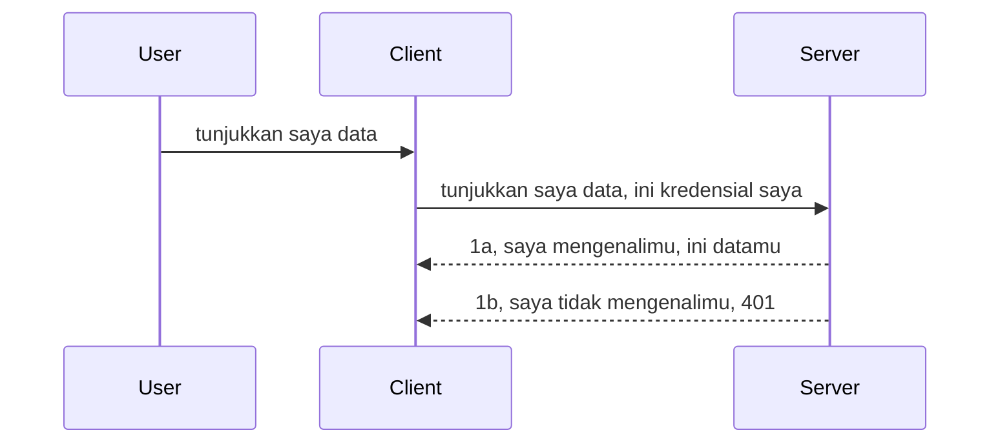

# Auth sederhana

MCP SDK mendukung penggunaan OAuth 2.1 yang sebenarnya merupakan proses yang cukup rumit melibatkan konsep seperti server auth, server sumber daya, mengirim kredensial, mendapatkan kode, menukar kode dengan token bearer sampai akhirnya Anda dapat memperoleh data sumber daya Anda. Jika Anda belum terbiasa dengan OAuth yang sebenarnya adalah hal bagus untuk diimplementasikan, ada baiknya memulai dengan tingkat auth dasar dan membangun ke tingkat keamanan yang lebih baik. Itulah mengapa bab ini ada, untuk membangun Anda ke auth yang lebih maju.

## Auth, apa maksudnya?

Auth adalah singkatan dari autentikasi dan otorisasi. Ide dasarnya adalah kita perlu melakukan dua hal:

- **Autentikasi**, yaitu proses menentukan apakah kita membiarkan seseorang masuk ke rumah kita, bahwa mereka memiliki hak untuk "di sini" yaitu memiliki akses ke server sumber daya kita tempat fitur MCP Server kita berada.
- **Otorisasi**, adalah proses mengetahui apakah pengguna harus memiliki akses ke sumber daya spesifik yang mereka minta, misalnya pesanan ini atau produk ini atau apakah mereka diperbolehkan membaca kontennya tapi tidak menghapus sebagai contoh lain.

## Kredensial: bagaimana kita memberitahu sistem siapa kita

Nah, kebanyakan pengembang web di luar sana mulai berpikir dalam hal menyediakan kredensial ke server, biasanya sebuah rahasia yang mengatakan apakah mereka diperbolehkan berada di sini "Autentikasi". Kredensial ini biasanya versi base64 dari username dan password atau API key yang mengidentifikasi pengguna tertentu secara unik. 

Ini melibatkan mengirimnya melalui header yang disebut "Authorization" seperti ini:

```json
{ "Authorization": "secret123" }
```

Ini biasanya disebut autentikasi dasar. Bagaimana alur keseluruhannya bekerja adalah sebagai berikut:


```mermaid
sequenceDiagram
   participant User
   participant Client
   participant Server

   User->>Client: tunjukkan saya data
   Client->>Server: tunjukkan saya data, ini kredensial saya
   Server-->>Client: 1a, saya mengenalimu, ini datamu
   Server-->>Client: 1b, saya tidak mengenalimu, 401 
```

Sekarang kita memahami bagaimana cara kerjanya dari sudut pandang alur, bagaimana cara mengimplementasikannya? Nah, kebanyakan server web memiliki konsep yang disebut middleware, sepotong kode yang berjalan sebagai bagian dari permintaan yang bisa memverifikasi kredensial, dan jika kredensial valid dapat membiarkan permintaan diteruskan. Kalau permintaan tidak punya kredensial yang valid maka akan mendapatkan error auth. Mari kita lihat bagaimana ini bisa diimplementasikan:

**Python**

```python
class AuthMiddleware(BaseHTTPMiddleware):
    async def dispatch(self, request, call_next):

        has_header = request.headers.get("Authorization")
        if not has_header:
            print("-> Missing Authorization header!")
            return Response(status_code=401, content="Unauthorized")

        if not valid_token(has_header):
            print("-> Invalid token!")
            return Response(status_code=403, content="Forbidden")

        print("Valid token, proceeding...")
       
        response = await call_next(request)
        # tambahkan header pelanggan apa pun atau ubah respons dengan cara tertentu
        return response


starlette_app.add_middleware(CustomHeaderMiddleware)
```

Di sini kita memiliki: 

- Membuat middleware bernama `AuthMiddleware` dimana metode `dispatch`-nya dipanggil oleh server web.
- Menambahkan middleware ke server web:

    ```python
    starlette_app.add_middleware(AuthMiddleware)
    ```

- Menulis logika validasi yang memeriksa apakah header Authorization ada dan jika rahasia yang dikirim valid:

    ```python
    has_header = request.headers.get("Authorization")
    if not has_header:
        print("-> Missing Authorization header!")
        return Response(status_code=401, content="Unauthorized")

    if not valid_token(has_header):
        print("-> Invalid token!")
        return Response(status_code=403, content="Forbidden")
    ```

    jika rahasia ada dan valid maka kita biarkan permintaan lewat dengan memanggil `call_next` dan mengembalikan respons.

    ```python
    response = await call_next(request)
    # tambahkan header pelanggan apa pun atau ubah respons dengan cara tertentu
    return response
    ```

Cara kerjanya adalah jika ada permintaan web ke server middleware akan dipanggil dan dengan implementasinya akan membiarkan permintaan lewat atau mengembalikan error yang menunjukkan klien tidak boleh melanjutkan.

**TypeScript**

Di sini kita membuat middleware dengan framework populer Express dan mencegat permintaan sebelum mencapai MCP Server. Berikut kodenya:

```typescript
function isValid(secret) {
    return secret === "secret123";
}

app.use((req, res, next) => {
    // 1. Header otorisasi tersedia?
    if(!req.headers["Authorization"]) {
        res.status(401).send('Unauthorized');
    }
    
    let token = req.headers["Authorization"];

    // 2. Periksa keabsahan.
    if(!isValid(token)) {
        res.status(403).send('Forbidden');
    }

   
    console.log('Middleware executed');
    // 3. Meneruskan permintaan ke langkah berikutnya dalam jalur permintaan.
    next();
});
```

Dalam kode ini kita:

1. Memeriksa apakah header Authorization ada, jika tidak, kita kirim error 401.
2. Memastikan kredensial/token valid, jika tidak, kita kirim error 403.
3. Akhirnya meneruskan permintaan dalam pipeline dan mengembalikan sumber daya yang diminta.

## Latihan: Implementasi autentikasi

Mari gunakan pengetahuan kita dan coba implementasinya. Berikut rencananya:

Server

- Membuat server web dan instance MCP.
- Mengimplementasikan middleware untuk server.

Client 

- Mengirim permintaan web dengan kredensial melalui header.

### -1- Membuat server web dan instance MCP

> [!WARNING]
> Contoh TypeScript di bawah menargetkan MCP `2025-11-25`. Ini melacak transport
> dengan `mcp-session-id` dan bukan contoh transport `2026-07-28` saat ini. MCP
> `2026-07-28` menghapus handshake `initialize` dan session ID protokol; implementasi baru
> menggunakan permintaan mandiri. Lihat
> [Perubahan di MCP: Spesifikasi 2026-07-28](../../01-CoreConcepts/mcp-2026-07-28.md).

Pada langkah pertama, kita perlu membuat instance server web dan MCP Server.

**Python**

Di sini kita membuat instance server MCP, membuat aplikasi web starlette dan menjalankannya dengan uvicorn.

```python
# membuat Server MCP

app = FastMCP(
    name="MCP Resource Server",
    instructions="Resource Server that validates tokens via Authorization Server introspection",
    host=settings["host"],
    port=settings["port"],
    debug=True
)

# membuat aplikasi web starlette
starlette_app = app.streamable_http_app()

# menyajikan aplikasi melalui uvicorn
async def run(starlette_app):
    import uvicorn
    config = uvicorn.Config(
            starlette_app,
            host=app.settings.host,
            port=app.settings.port,
            log_level=app.settings.log_level.lower(),
        )
    server = uvicorn.Server(config)
    await server.serve()

run(starlette_app)
```

Dalam kode ini kita:

- Membuat MCP Server.
- Membangun aplikasi web starlette dari MCP Server, `app.streamable_http_app()`.
- Menjalankan dan melayani aplikasi web menggunakan uvicorn `server.serve()`.

**TypeScript**

Di sini kita membuat instance MCP Server.

```typescript
const server = new McpServer({
      name: "example-server",
      version: "1.0.0"
    });

    // ... siapkan sumber daya server, alat, dan prompt ...
```

Pembuatan MCP Server ini harus dilakukan dalam definisi route POST /mcp kita, jadi mari kita ambil kode di atas dan pindahkan seperti ini:

```typescript
import express from "express";
import { randomUUID } from "node:crypto";
import { McpServer } from "@modelcontextprotocol/sdk/server/mcp.js";
import { StreamableHTTPServerTransport } from "@modelcontextprotocol/sdk/server/streamableHttp.js";
import { isInitializeRequest } from "@modelcontextprotocol/sdk/types.js"

const app = express();
app.use(express.json());

// Peta untuk menyimpan transport berdasarkan ID sesi
const transports: { [sessionId: string]: StreamableHTTPServerTransport } = {};

// Tangani permintaan POST untuk komunikasi klien-ke-server
app.post('/mcp', async (req, res) => {
  // Periksa apakah ID sesi sudah ada
  const sessionId = req.headers['mcp-session-id'] as string | undefined;
  let transport: StreamableHTTPServerTransport;

  if (sessionId && transports[sessionId]) {
    // Gunakan kembali transport yang sudah ada
    transport = transports[sessionId];
  } else if (!sessionId && isInitializeRequest(req.body)) {
    // Permintaan inisialisasi baru
    transport = new StreamableHTTPServerTransport({
      sessionIdGenerator: () => randomUUID(),
      onsessioninitialized: (sessionId) => {
        // Simpan transport berdasarkan ID sesi
        transports[sessionId] = transport;
      },
      // Perlindungan DNS rebinding dinonaktifkan secara default untuk kompatibilitas ke belakang. Jika Anda menjalankan server ini
      // secara lokal, pastikan untuk mengatur:
      // enableDnsRebindingProtection: true,
      // allowedHosts: ['127.0.0.1'],
    });

    // Bersihkan transport saat ditutup
    transport.onclose = () => {
      if (transport.sessionId) {
        delete transports[transport.sessionId];
      }
    };
    const server = new McpServer({
      name: "example-server",
      version: "1.0.0"
    });

    // ... siapkan sumber daya server, alat, dan prompt ...

    // Sambungkan ke server MCP
    await server.connect(transport);
  } else {
    // Permintaan tidak valid
    res.status(400).json({
      jsonrpc: '2.0',
      error: {
        code: -32000,
        message: 'Bad Request: No valid session ID provided',
      },
      id: null,
    });
    return;
  }

  // Tangani permintaan
  await transport.handleRequest(req, res, req.body);
});

// Handler yang dapat digunakan kembali untuk permintaan GET dan DELETE
const handleSessionRequest = async (req: express.Request, res: express.Response) => {
  const sessionId = req.headers['mcp-session-id'] as string | undefined;
  if (!sessionId || !transports[sessionId]) {
    res.status(400).send('Invalid or missing session ID');
    return;
  }
  
  const transport = transports[sessionId];
  await transport.handleRequest(req, res);
};

// Tangani permintaan GET untuk notifikasi server-ke-klien melalui SSE
app.get('/mcp', handleSessionRequest);

// Tangani permintaan DELETE untuk penghentian sesi
app.delete('/mcp', handleSessionRequest);

app.listen(3000);
```

Sekarang Anda lihat bagaimana pembuatan MCP Server dipindahkan ke dalam `app.post("/mcp")`.

Mari lanjut ke langkah berikutnya yaitu membuat middleware agar kita dapat memvalidasi kredensial yang masuk.

### -2- Implementasikan middleware untuk server

Mari ke bagian middleware berikutnya. Di sini kita akan membuat middleware yang mencari kredensial di header `Authorization` dan memvalidasinya. Jika diterima maka permintaan akan diteruskan agar melakukan apa pun yang dibutuhkan (misal daftar tools, baca sumber daya atau fungsi MCP apa pun yang diminta klien).

**Python**

Untuk membuat middleware, kita perlu membuat kelas yang mewarisi dari `BaseHTTPMiddleware`. Ada dua hal menarik:

- Permintaan `request`, yang kita baca informasi header-nya.
- `call_next` callback yang harus kita panggil jika klien membawa kredensial yang kita terima.

Pertama, kita perlu menangani kasus jika header `Authorization` tidak ada:

```python
has_header = request.headers.get("Authorization")

# tidak ada header, gagal dengan 401, jika tidak lanjutkan.
if not has_header:
    print("-> Missing Authorization header!")
    return Response(status_code=401, content="Unauthorized")
```

Di sini kita mengirim pesan 401 unauthorized karena klien gagal autentikasi.

Selanjutnya, jika sebuah kredensial dikirimkan, kita perlu periksa validitasnya seperti ini:

```python
 if not valid_token(has_header):
    print("-> Invalid token!")
    return Response(status_code=403, content="Forbidden")
```

Perhatikan bagaimana kita mengirim pesan 403 forbidden di atas. Mari lihat middleware lengkap yang mengimplementasikan semua yang disebutkan di atas:

```python
class AuthMiddleware(BaseHTTPMiddleware):
    async def dispatch(self, request, call_next):

        has_header = request.headers.get("Authorization")
        if not has_header:
            print("-> Missing Authorization header!")
            return Response(status_code=401, content="Unauthorized")

        if not valid_token(has_header):
            print("-> Invalid token!")
            return Response(status_code=403, content="Forbidden")

        print("Valid token, proceeding...")
        print(f"-> Received {request.method} {request.url}")
        response = await call_next(request)
        response.headers['Custom'] = 'Example'
        return response

```

Bagus, tapi bagaimana dengan fungsi `valid_token`? Berikut ini di bawah:

```python
# JANGAN gunakan untuk produksi - tingkatkan !!
def valid_token(token: str) -> bool:
    # hapus prefix "Bearer "
    if token.startswith("Bearer "):
        token = token[7:]
        return token == "secret-token"
    return False
```

Ini tentu saja harus ditingkatkan.

PENTING: Anda TIDAK BOLEH pernah menyimpan rahasia seperti ini dalam kode. Idealnya Anda mengambil nilai untuk dibandingkan dari sumber data atau dari IDP (penyedia layanan identitas) atau lebih baik lagi, biarkan IDP yang melakukan validasi.

**TypeScript**

Untuk mengimplementasikan ini dengan Express, kita perlu memanggil metode `use` yang mengambil fungsi middleware.

Kita perlu:

- Berinteraksi dengan variabel request untuk memeriksa kredensial yang diteruskan di properti `Authorization`.
- Memvalidasi kredensial, dan jika valid membiarkan permintaan dilanjutkan dan biarkan permintaan MCP klien melakukan apa seharusnya (misal daftar tools, baca sumber daya, atau lainnya yang terkait MCP).

Di sini, kita memeriksa apakah header `Authorization` ada dan jika tidak, kita hentikan permintaan lewat:

```typescript
if(!req.headers["authorization"]) {
    res.status(401).send('Unauthorized');
    return;
}
```

Jika header tidak dikirim sama sekali, Anda akan menerima 401.

Selanjutnya, kita cek apakah kredensial valid, jika tidak kita lagi hentikan permintaan dengan pesan yang berbeda sedikit:

```typescript
if(!isValid(token)) {
    res.status(403).send('Forbidden');
    return;
} 
```

Perhatikan bagaimana Anda sekarang mendapat error 403.

Berikut kode lengkapnya:

```typescript
app.use((req, res, next) => {
    console.log('Request received:', req.method, req.url, req.headers);
    console.log('Headers:', req.headers["authorization"]);
    if(!req.headers["authorization"]) {
        res.status(401).send('Unauthorized');
        return;
    }
    
    let token = req.headers["authorization"];

    if(!isValid(token)) {
        res.status(403).send('Forbidden');
        return;
    }  

    console.log('Middleware executed');
    next();
});
```

Kita telah menyiapkan server web untuk menerima middleware guna mengecek kredensial yang semoga dikirim klien. Bagaimana dengan klien itu sendiri?

### -3- Kirim permintaan web dengan kredensial melalui header

Kita perlu memastikan klien mengirim kredensial melalui header. Karena kita akan menggunakan klien MCP untuk itu, kita perlu mencari tahu bagaimana caranya.

**Python**

Untuk klien, kita perlu melewatkan header dengan kredensial seperti ini:

```python
# JANGAN menuliskan nilai secara langsung, simpan minimal di variabel lingkungan atau penyimpanan yang lebih aman
token = "secret-token"

async with streamablehttp_client(
        url = f"http://localhost:{port}/mcp",
        headers = {"Authorization": f"Bearer {token}"}
    ) as (
        read_stream,
        write_stream,
        session_callback,
    ):
        async with ClientSession(
            read_stream,
            write_stream
        ) as session:
            await session.initialize()
      
            # TODO, apa yang ingin Anda lakukan di klien, misalnya daftar alat, panggil alat, dll.
```

Perhatikan bagaimana kita mengisi properti `headers` seperti ` headers = {"Authorization": f"Bearer {token}"}`.

**TypeScript**

Kita bisa selesaikan ini dengan dua langkah:

1. Mengisi objek konfigurasi dengan kredensial kita.
2. Melewatkan objek konfigurasi ke transport.

```typescript

// JANGAN mengkodekan nilai secara langsung seperti yang ditunjukkan di sini. Minimal simpan sebagai variabel lingkungan dan gunakan sesuatu seperti dotenv (dalam mode pengembangan).
let token = "secret123"

// definisikan objek opsi transportasi klien
let options: StreamableHTTPClientTransportOptions = {
  sessionId: sessionId,
  requestInit: {
    headers: {
      "Authorization": "secret123"
    }
  }
};

// berikan objek opsi ke transportasi
async function main() {
   const transport = new StreamableHTTPClientTransport(
      new URL(serverUrl),
      options
   );
```

Di atas Anda lihat bagaimana kita membuat objek `options` dan menempatkan header di bawah properti `requestInit`.

PENTING: Lalu bagaimana kita memperbaikinya dari sini? Nah, implementasi sekarang punya beberapa masalah. Pertama, mengirim kredensial seperti ini cukup berisiko kecuali setidaknya Anda punya HTTPS. Meski begitu, kredensial bisa dicuri jadi Anda butuh sistem di mana Anda bisa dengan mudah mencabut token dan menambahkan pemeriksaan tambahan seperti berasal dari mana permintaan, apakah permintaan terlalu sering (berperilaku bot), singkatnya ada banyak hal yang perlu diperhatikan.

Namun harus dikatakan, untuk API yang sangat sederhana di mana Anda tidak ingin sembarang orang memanggil API Anda tanpa autentikasi, ini adalah awal yang baik.

Dengan itu dikatakan, mari coba keras keamanan sedikit dengan menggunakan format standar seperti JSON Web Token, juga dikenal sebagai JWT atau token "JOT".

## JSON Web Tokens, JWT

Jadi, kita mencoba memperbaiki hal-hal dari sekedar mengirim kredensial sederhana. Apa peningkatan langsung yang kita dapat dengan mengadopsi JWT?

- **Peningkatan keamanan**. Dalam basic auth, Anda mengirim username dan password sebagai token encoded base64 (atau API key) berulang kali yang meningkatkan risiko. Dengan JWT, Anda mengirim username dan password lalu mendapatkan token sebagai balasan dan token juga memiliki batas waktu sehingga kadaluwarsa. JWT memungkinkan kontrol akses halus menggunakan peran, ruang lingkup, dan izin.
- **Gratis status dan skalabilitas**. JWT bersifat mandiri, membawa semua info pengguna dan menghilangkan kebutuhan menyimpan session sisi server. Token juga bisa divalidasi secara lokal.
- **Interoperabilitas dan federasi**. JWT menjadi pusat Open ID Connect dan digunakan dengan penyedia identitas terkenal seperti Entra ID, Google Identity dan Auth0. Mereka juga memungkinkan penggunaan single sign on dan lainnya sehingga bersifat enterprise-grade.
- **Modularitas dan fleksibilitas**. JWT juga bisa digunakan dengan API Gateway seperti Azure API Management, NGINX dan lainnya. Mendukung skenario autentikasi dan komunikasi server-ke-layanan termasuk skenario impersonasi dan delegasi.
- **Performa dan caching**. JWT dapat di-cache setelah didecode sehingga mengurangi kebutuhan parsing. Ini membantu aplikasi dengan trafik tinggi karena meningkatkan throughput dan mengurangi beban infrastruktur.
- **Fitur lanjutan**. Mendukung introspeksi (memeriksa validitas di server) dan pencabutan (membatalkan token).

Dengan semua manfaat ini, mari lihat bagaimana kita bisa membawa implementasi ke tingkat berikutnya.

## Mengubah basic auth menjadi JWT

Jadi, perubahan yang perlu dilakukan pada tingkat tinggi adalah:

- **Belajar membuat token JWT** dan menyiapkannya untuk dikirim dari klien ke server.
- **Memvalidasi token JWT**, dan jika valid, membiarkan klien mengakses sumber daya kita.
- **Penyimpanan token yang aman**. Bagaimana kita menyimpan token ini.
- **Melindungi rute**. Kita perlu melindungi rute, dalam kasus kita, melindungi rute dan fitur MCP tertentu.
- **Menambahkan refresh token**. Pastikan membuat token yang berumur pendek tapi refresh token yang berumur panjang yang dapat digunakan untuk mendapatkan token baru jika kadaluwarsa. Juga pastikan ada endpoint refresh dan strategi rotasi.

### -1- Membuat token JWT

Pertama, token JWT memiliki bagian-bagian berikut:

- **header**, algoritma yang dipakai dan tipe token.
- **payload**, klaim, seperti sub (pengguna atau entitas yang token wakili. Dalam skenario auth ini biasanya userid), exp (waktu kadaluwarsa) role (peran)
- **signature**, ditandatangani dengan rahasia atau kunci privat.

Untuk ini, kita perlu membangun header, payload dan token yang di-encode.

**Python**

```python

import jwt
import jwt
from jwt.exceptions import ExpiredSignatureError, InvalidTokenError
import datetime

# Kunci rahasia yang digunakan untuk menandatangani JWT
secret_key = 'your-secret-key'

header = {
    "alg": "HS256",
    "typ": "JWT"
}

# info pengguna dan klaim serta waktu kedaluwarsanya
payload = {
    "sub": "1234567890",               # Subjek (ID pengguna)
    "name": "User Userson",                # Klaim kustom
    "admin": True,                     # Klaim kustom
    "iat": datetime.datetime.utcnow(),# Diterbitkan pada
    "exp": datetime.datetime.utcnow() + datetime.timedelta(hours=1)  # Kedaluwarsa
}

# enkode itu
encoded_jwt = jwt.encode(payload, secret_key, algorithm="HS256", headers=header)
```

Dalam kode di atas kita telah:

- Mendefinisikan header dengan algoritma HS256 dan tipe JWT.
- Membuat payload yang berisi subjek atau user id, username, role, waktu diterbitkan dan waktu kedaluwarsa sehingga menerapkan aspek waktu terbatas yang kita sebut sebelumnya.

**TypeScript**

Di sini kita akan butuh beberapa dependensi yang membantu membuat token JWT.

Dependensi

```sh

npm install jsonwebtoken
npm install --save-dev @types/jsonwebtoken
```

Sekarang setelah itu siap, mari buat header, payload dan melalui itu buat token yang di-encode.

```typescript
import jwt from 'jsonwebtoken';

const secretKey = 'your-secret-key'; // Gunakan variabel lingkungan di produksi

// Tentukan payload
const payload = {
  sub: '1234567890',
  name: 'User usersson',
  admin: true,
  iat: Math.floor(Date.now() / 1000), // Dikeluarkan pada
  exp: Math.floor(Date.now() / 1000) + 60 * 60 // Kedaluwarsa dalam 1 jam
};

// Tentukan header (opsional, jsonwebtoken menetapkan default)
const header = {
  alg: 'HS256',
  typ: 'JWT'
};

// Buat token
const token = jwt.sign(payload, secretKey, {
  algorithm: 'HS256',
  header: header
});

console.log('JWT:', token);
```

Token ini:

Ditandatangani menggunakan HS256
Berlaku selama 1 jam
Memuat klaim seperti sub, name, admin, iat, dan exp.

### -2- Memvalidasi token

Kita juga perlu memvalidasi token, ini sesuatu yang harus dilakukan di server untuk memastikan apa yang dikirim klien memang valid. Ada banyak pemeriksaan yang harus kita lakukan di sini mulai dari memvalidasi strukturnya sampai validitasnya. Anda juga dianjurkan menambah pemeriksaan lain seperti apakah pengguna ada di sistem Anda dan lainnya.

Untuk memvalidasi token, kita perlu mendekodenya supaya bisa membacanya dan mulai memeriksa validitasnya:

**Python**

```python

# Dekode dan verifikasi JWT
try:
    decoded = jwt.decode(token, secret_key, algorithms=["HS256"])
    print("✅ Token is valid.")
    print("Decoded claims:")
    for key, value in decoded.items():
        print(f"  {key}: {value}")
except ExpiredSignatureError:
    print("❌ Token has expired.")
except InvalidTokenError as e:
    print(f"❌ Invalid token: {e}")

```


Dalam kode ini, kami memanggil `jwt.decode` menggunakan token, kunci rahasia, dan algoritma yang dipilih sebagai input. Perhatikan bagaimana kami menggunakan konstruksi try-catch karena kegagalan validasi akan menyebabkan error muncul.

**TypeScript**

Di sini kita perlu memanggil `jwt.verify` untuk mendapatkan versi token yang ter-decode yang dapat kita analisis lebih lanjut. Jika panggilan ini gagal, itu berarti struktur token salah atau token tersebut tidak lagi valid.

```typescript

try {
  const decoded = jwt.verify(token, secretKey);
  console.log('Decoded Payload:', decoded);
} catch (err) {
  console.error('Token verification failed:', err);
}
```

CATATAN: seperti disebutkan sebelumnya, kita harus melakukan pemeriksaan tambahan untuk memastikan token ini menunjuk ke pengguna dalam sistem kita dan memastikan pengguna tersebut memiliki hak yang diklaim.

Selanjutnya, mari kita lihat kontrol akses berbasis peran, yang juga dikenal sebagai RBAC.

## Menambahkan kontrol akses berbasis peran

Idenya adalah kita ingin menyatakan bahwa peran yang berbeda memiliki hak yang berbeda. Misalnya, kita mengasumsikan admin bisa melakukan segalanya, pengguna biasa bisa membaca/menulis, dan tamu hanya bisa membaca. Oleh karena itu, berikut adalah beberapa level izin yang mungkin:

- Admin.Write 
- User.Read
- Guest.Read

Mari kita lihat bagaimana kita dapat menerapkan kontrol tersebut dengan middleware. Middleware dapat ditambahkan per route maupun untuk semua route.

**Python**

```python
from starlette.middleware.base import BaseHTTPMiddleware
from starlette.responses import JSONResponse
import jwt

# JANGAN menyimpan rahasia dalam kode seperti ini, ini hanya untuk tujuan demonstrasi. Bacalah dari tempat yang aman.
SECRET_KEY = "your-secret-key" # simpan ini di variabel env
REQUIRED_PERMISSION = "User.Read"

class JWTPermissionMiddleware(BaseHTTPMiddleware):
    async def dispatch(self, request, call_next):
        auth_header = request.headers.get("Authorization")
        if not auth_header or not auth_header.startswith("Bearer "):
            return JSONResponse({"error": "Missing or invalid Authorization header"}, status_code=401)

        token = auth_header.split(" ")[1]
        try:
            decoded = jwt.decode(token, SECRET_KEY, algorithms=["HS256"])
        except jwt.ExpiredSignatureError:
            return JSONResponse({"error": "Token expired"}, status_code=401)
        except jwt.InvalidTokenError:
            return JSONResponse({"error": "Invalid token"}, status_code=401)

        permissions = decoded.get("permissions", [])
        if REQUIRED_PERMISSION not in permissions:
            return JSONResponse({"error": "Permission denied"}, status_code=403)

        request.state.user = decoded
        return await call_next(request)


```

Ada beberapa cara berbeda untuk menambahkan middleware seperti di bawah ini:

```python

# Alternatif 1: tambahkan middleware saat membangun aplikasi starlette
middleware = [
    Middleware(JWTPermissionMiddleware)
]

app = Starlette(routes=routes, middleware=middleware)

# Alternatif 2: tambahkan middleware setelah aplikasi starlette sudah dibangun
starlette_app.add_middleware(JWTPermissionMiddleware)

# Alternatif 3: tambahkan middleware perrute
routes = [
    Route(
        "/mcp",
        endpoint=..., # pengelola
        middleware=[Middleware(JWTPermissionMiddleware)]
    )
]
```

**TypeScript**

Kita bisa menggunakan `app.use` dan middleware yang akan dijalankan untuk semua permintaan.

```typescript
app.use((req, res, next) => {
    console.log('Request received:', req.method, req.url, req.headers);
    console.log('Headers:', req.headers["authorization"]);

    // 1. Periksa apakah header otorisasi telah dikirim

    if(!req.headers["authorization"]) {
        res.status(401).send('Unauthorized');
        return;
    }
    
    let token = req.headers["authorization"];

    // 2. Periksa apakah token valid
    if(!isValid(token)) {
        res.status(403).send('Forbidden');
        return;
    }  

    // 3. Periksa apakah pengguna token ada dalam sistem kami
    if(!isExistingUser(token)) {
        res.status(403).send('Forbidden');
        console.log("User does not exist");
        return;
    }
    console.log("User exists");

    // 4. Verifikasi token memiliki izin yang benar
    if(!hasScopes(token, ["User.Read"])){
        res.status(403).send('Forbidden - insufficient scopes');
    }

    console.log("User has required scopes");

    console.log('Middleware executed');
    next();
});

```

Ada beberapa hal yang dapat kita biarkan middleware lakukan dan yang HARUS dilakukan oleh middleware kita, yaitu:

1. Periksa apakah header otorisasi ada
2. Periksa apakah token valid, kita memanggil `isValid` yang merupakan metode yang kita buat untuk memeriksa integritas dan validitas token JWT.
3. Verifikasi bahwa pengguna ada dalam sistem kita, kita harus memeriksa ini.

   ```typescript
    // pengguna dalam DB
   const users = [
     "user1",
     "User usersson",
   ]

   function isExistingUser(token) {
     let decodedToken = verifyToken(token);

     // TODO, periksa apakah pengguna ada dalam DB
     return users.includes(decodedToken?.name || "");
   }
   ```

    Di atas, kita telah membuat daftar `users` yang sangat sederhana, yang seharusnya tentu berada di database.

4. Selain itu, kita juga harus memeriksa token memiliki izin yang tepat.

   ```typescript
   if(!hasScopes(token, ["User.Read"])){
        res.status(403).send('Forbidden - insufficient scopes');
   }
   ```

    Dalam kode di atas dari middleware, kita memeriksa bahwa token berisi izin User.Read, jika tidak, kita mengirimkan error 403. Di bawah ini adalah metode pembantu `hasScopes`.

   ```typescript
   function hasScopes(scope: string, requiredScopes: string[]) {
     let decodedToken = verifyToken(scope);
    return requiredScopes.every(scope => decodedToken?.scopes.includes(scope));
  }
   ```

Have a think which additional checks you should be doing, but these are the absolute minimum of checks you should be doing.

Using Express as a web framework is a common choice. There are helpers library when you use JWT so you can write less code.

- `express-jwt`, helper library that provides a middleware that helps decode your token.
- `express-jwt-permissions`, this provides a middleware `guard` that helps check if a certain permission is on the token.

Here's what these libraries can look like when used:

```typescript
const express = require('express');
const jwt = require('express-jwt');
const guard = require('express-jwt-permissions')();

const app = express();
const secretKey = 'your-secret-key'; // put this in env variable

// Decode JWT and attach to req.user
app.use(jwt({ secret: secretKey, algorithms: ['HS256'] }));

// Check for User.Read permission
app.use(guard.check('User.Read'));

// multiple permissions
// app.use(guard.check(['User.Read', 'Admin.Access']));

app.get('/protected', (req, res) => {
  res.json({ message: `Welcome ${req.user.name}` });
});

// Error handler
app.use((err, req, res, next) => {
  if (err.code === 'permission_denied') {
    return res.status(403).send('Forbidden');
  }
  next(err);
});

```

Sekarang Anda telah melihat bagaimana middleware bisa digunakan untuk otentikasi dan otorisasi, bagaimana dengan MCP? Apakah ini mengubah cara kita melakukan otentikasi? Mari kita cari tahu di bagian berikutnya.

### -3- Tambahkan RBAC ke MCP

Anda sudah melihat sejauh ini bagaimana menambahkan RBAC melalui middleware, namun untuk MCP tidak ada cara mudah untuk menambahkan RBAC per fitur MCP, jadi apa yang kita lakukan? Yah, kita hanya perlu menambahkan kode seperti ini yang memeriksa dalam kasus ini apakah klien memiliki hak untuk memanggil alat tertentu:

Anda memiliki beberapa pilihan berbeda untuk mencapai RBAC per fitur, berikut beberapa di antaranya:

- Tambahkan pemeriksaan untuk setiap alat, sumber daya, prompt di mana Anda perlu memeriksa level izin.

   **python**

   ```python
   @tool()
   def delete_product(id: int):
      try:
          check_permissions(role="Admin.Write", request)
      catch:
        pass # klien gagal otorisasi, angkat kesalahan otorisasi
   ```

   **typescript**

   ```typescript
   server.registerTool(
    "delete-product",
    {
      title: Delete a product",
      description: "Deletes a product",
      inputSchema: { id: z.number() }
    },
    async ({ id }) => {
      
      try {
        checkPermissions("Admin.Write", request);
        // todo, kirim id ke productService dan remote entry
      } catch(Exception e) {
        console.log("Authorization error, you're not allowed");  
      }

      return {
        content: [{ type: "text", text: `Deletected product with id ${id}` }]
      };
    }
   );
   ```


- Gunakan pendekatan server yang lebih canggih dan request handlers sehingga Anda meminimalkan berapa banyak tempat di mana Anda perlu melakukan pengecekan.

   **Python**

   ```python
   
   tool_permission = {
      "create_product": ["User.Write", "Admin.Write"],
      "delete_product": ["Admin.Write"]
   }

   def has_permission(user_permissions, required_permissions) -> bool:
      # user_permissions: daftar izin yang dimiliki pengguna
      # required_permissions: daftar izin yang dibutuhkan untuk alat
      return any(perm in user_permissions for perm in required_permissions)

   @server.call_tool()
   async def handle_call_tool(
     name: str, arguments: dict[str, str] | None
   ) -> list[types.TextContent]:
    # Anggap request.user.permissions adalah daftar izin untuk pengguna
     user_permissions = request.user.permissions
     required_permissions = tool_permission.get(name, [])
     if not has_permission(user_permissions, required_permissions):
        # Munculkan error "Anda tidak memiliki izin untuk memanggil alat {name}"
        raise Exception(f"You don't have permission to call tool {name}")
     # lanjutkan dan panggil alat
     # ...
   ```   
   

   **TypeScript**

   ```typescript
   function hasPermission(userPermissions: string[], requiredPermissions: string[]): boolean {
       if (!Array.isArray(userPermissions) || !Array.isArray(requiredPermissions)) return false;
       // Mengembalikan true jika pengguna memiliki setidaknya satu izin yang diperlukan
       
       return requiredPermissions.some(perm => userPermissions.includes(perm));
   }
  
   server.setRequestHandler(CallToolRequestSchema, async (request) => {
      const { params: { name } } = request;
  
      let permissions = request.user.permissions;
  
      if (!hasPermission(permissions, toolPermissions[name])) {
         return new Error(`You don't have permission to call ${name}`);
      }
  
      // lanjutkan..
   });
   ```

   Catatan, Anda perlu memastikan middleware Anda menetapkan token yang ter-decode ke properti user pada request sehingga kode di atas menjadi sederhana.

### Kesimpulan

Sekarang setelah kita membahas cara menambahkan dukungan untuk RBAC secara umum dan untuk MCP secara khusus, saatnya mencoba mengimplementasikan keamanan sendiri untuk memastikan Anda memahami konsep yang disajikan.

## Tugas 1: Bangun server mcp dan klien mcp menggunakan otentikasi dasar

Di sini Anda akan menggunakan apa yang telah dipelajari dalam hal mengirimkan kredensial melalui header.

## Solusi 1

[Solution 1](./code/basic/README.md)

## Tugas 2: Tingkatkan solusi dari Tugas 1 untuk menggunakan JWT

Ambil solusi pertama tapi kali ini, mari kita tingkatkan.

Alih-alih menggunakan Basic Auth, mari kita gunakan JWT.

## Solusi 2

[Solution 2](./solution/jwt-solution/README.md)

## Tantangan

Tambahkan RBAC per alat yang telah kita jelaskan di bagian "Add RBAC to MCP".

## Ringkasan

Harapannya Anda telah belajar banyak dalam bab ini, dari tanpa keamanan sama sekali, ke keamanan dasar, ke JWT dan bagaimana hal itu dapat ditambahkan ke MCP.

Kami telah membangun fondasi yang kuat dengan JWT kustom, tetapi seiring pertumbuhan, kami beralih ke model identitas berbasis standar. Mengadopsi IdP seperti Entra atau Keycloak memungkinkan kami mengalihkan pengeluaran token, validasi, dan pengelolaan siklus hidup ke platform yang terpercaya — sehingga kami bisa fokus pada logika aplikasi dan pengalaman pengguna.

Untuk itu, kami memiliki bab [lanjutan tentang Entra](../../05-AdvancedTopics/mcp-security-entra/README.md)

## Selanjutnya

- Selanjutnya: [Setting Up MCP Hosts](../12-mcp-hosts/README.md)

---

<!-- CO-OP TRANSLATOR DISCLAIMER START -->
**Penafian**:
Dokumen ini telah diterjemahkan menggunakan layanan terjemahan AI [Co-op Translator](https://github.com/Azure/co-op-translator). Meskipun kami berupaya untuk mencapai akurasi, harap diketahui bahwa terjemahan otomatis mungkin mengandung kesalahan atau ketidakakuratan. Dokumen asli dalam bahasa aslinya harus dianggap sebagai sumber yang sah. Untuk informasi penting, disarankan menggunakan terjemahan profesional oleh manusia. Kami tidak bertanggung jawab atas kesalahpahaman atau penafsiran yang keliru yang timbul dari penggunaan terjemahan ini.
<!-- CO-OP TRANSLATOR DISCLAIMER END -->