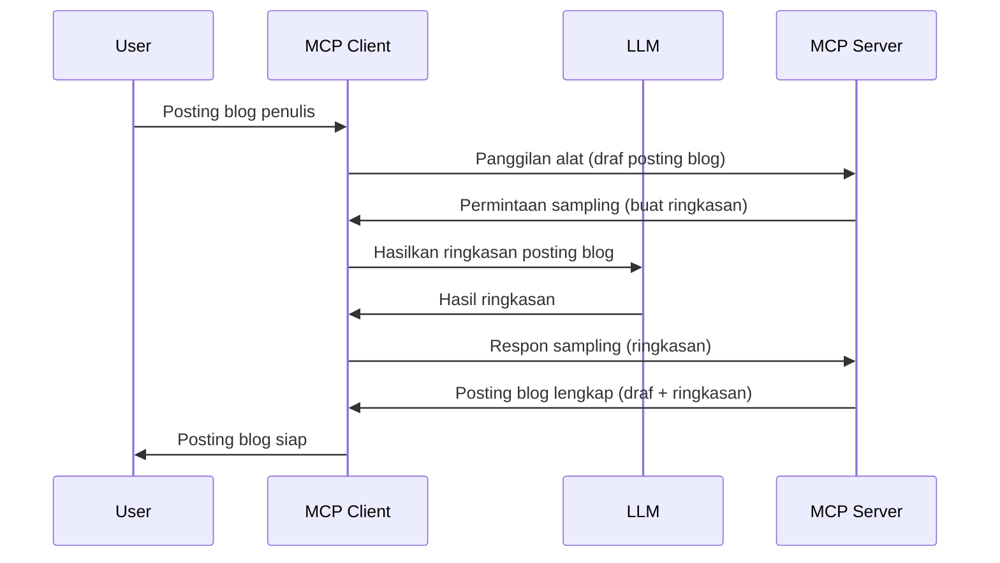

> [!WARNING]
> Sampling sudah tidak digunakan lagi di MCP `2026-07-28`. Pelajaran ini dipertahankan untuk
> implementasi warisan. Server baru sebaiknya mengintegrasikan langsung dengan API penyedia LLM.


# Sampling - mendelegasikan fitur ke Klien

> Sampling tetap ada dalam spesifikasi `2026-07-28` untuk kompatibilitas dan
> dapat dihapus pada revisi pertama yang dirilis pada atau setelah 28 Juli,
> 2027. Contoh dalam pelajaran ini mungkin menggunakan API SDK yang menerapkan `2025-11-25`.
> Lihat [Apa Yang Berubah di MCP: Spesifikasi 2026-07-28](../../01-CoreConcepts/mcp-2026-07-28.md).

Dalam implementasi warisan, Sampling memungkinkan server MCP meminta bantuan dari LLM
yang dikelola oleh klien. Untuk implementasi baru, panggil langsung penyedia LLM yang dipilih
sebagai gantinya.

Mari kita jelajahi beberapa kasus penggunaan dan cara membangun solusi yang melibatkan sampling.

## Ikhtisar

Dalam pelajaran ini, kita fokus menjelaskan kapan dan di mana menggunakan Sampling serta cara mengkonfigurasinya.

## Tujuan Pembelajaran

Dalam bab ini, kita akan:

- Menjelaskan apa itu Sampling dan kapan menggunakannya.
- Menunjukkan cara mengkonfigurasi Sampling di MCP.
- Memberikan contoh Sampling dalam praktik.

## Apa itu Sampling dan mengapa menggunakannya?

Sampling adalah fitur canggih yang bekerja dengan cara berikut:



### Permintaan Sampling

Baik, sekarang kita punya gambaran besar tentang skenario yang dapat dipercaya, mari kita bahas tentang permintaan sampling yang dikirim server ke klien. Berikut contoh permintaan tersebut dalam format JSON-RPC:

```json
{
  "jsonrpc": "2.0",
  "id": 1,
  "method": "sampling/createMessage",
  "params": {
    "messages": [
      {
        "role": "user",
        "content": {
          "type": "text",
          "text": "Create a blog post summary of the following blog post: <BLOG POST>"
        }
      }
    ],
    "modelPreferences": {
      "hints": [
        {
          "name": "claude-3-sonnet"
        }
      ],
      "intelligencePriority": 0.8,
      "speedPriority": 0.5
    },
    "systemPrompt": "You are a helpful assistant.",
    "maxTokens": 100
  }
}
```

Ada beberapa hal di sini yang patut diperhatikan:

- Prompt, di bawah content -> text, adalah prompt kita yang merupakan instruksi untuk LLM merangkum konten blog.

- **modelPreferences**. Bagian ini memang sebuah preferensi, sebuah rekomendasi konfigurasi yang digunakan dengan LLM. Pengguna dapat memilih mengikuti rekomendasi ini atau mengubahnya. Dalam kasus ini ada rekomendasi model serta prioritas kecepatan dan kecerdasan.
- **systemPrompt**, ini adalah prompt sistem normal Anda yang memberikan kepribadian pada LLM dan berisi instruksi panduan.
- **maxTokens**, ini adalah properti lain yang digunakan untuk menyatakan berapa banyak token yang direkomendasikan untuk tugas ini.

### Respon Sampling

Respon ini adalah yang akhirnya dikirim balik oleh Klien MCP ke Server MCP dan merupakan hasil klien memanggil LLM, menunggu respon tersebut, lalu membuat pesan ini. Berikut contoh formatnya dalam JSON-RPC:

```json
{
  "jsonrpc": "2.0",
  "id": 1,
  "result": {
    "role": "assistant",
    "content": {
      "type": "text",
      "text": "Here's your abstract <ABSTRACT>"
    },
    "model": "gpt-5",
    "stopReason": "endTurn"
  }
}
```

Perhatikan bagaimana responnya adalah abstrak dari postingan blog seperti yang kita minta. Juga perhatikan bagaimana model yang digunakan bukan yang kita minta tetapi "gpt-5" menggantikan "claude-3-sonnet". Ini untuk menggambarkan bahwa pengguna dapat berubah pikiran tentang model yang akan dipakai dan permintaan sampling Anda hanyalah sebuah rekomendasi.

Baik, sekarang kita memahami alur utama, dan tugas berguna untuk menggunakannya "pembuatan postingan blog + abstrak", mari kita lihat apa yang perlu dilakukan agar ini berjalan.

### Jenis pesan

Pesan sampling tidak hanya terbatas pada teks tapi Anda juga bisa mengirim gambar dan audio. Berikut bagaimana JSON-RPC terlihat berbeda:

**Teks**

```json
{
  "type": "text",
  "text": "The message content"
}
```

**Konten gambar**

```json
{
  "type": "image",
  "data": "base64-encoded-image-data",
  "mimeType": "image/jpeg"
}
```

**Konten audio**

```json
{
  "type": "audio",
  "data": "base64-encoded-audio-data",
  "mimeType": "audio/wav"
}
```

> CATATAN: Untuk status terkini dan panduan migrasi, lihat
> [dokumentasi Sampling yang telah tidak dipakai](https://modelcontextprotocol.io/specification/2026-07-28/client/sampling).

## Cara Mengkonfigurasi Sampling di Klien

> Catatan: jika Anda hanya membangun server, Anda tidak perlu banyak melakukan ini.

Di klien, Anda perlu menentukan fitur berikut seperti ini:

```json
{
  "capabilities": {
    "sampling": {}
  }
}
```

Ini kemudian akan diambil ketika klien yang Anda pilih mulai berinisiatif dengan server.

## Contoh Sampling dalam Praktik - Membuat Postingan Blog

Mari kita buat server sampling bersama, kita perlu melakukan hal berikut:

1. Membuat alat di Server.
1. Alat tersebut harus membuat permintaan sampling
1. Alat harus menunggu permintaan sampling klien dijawab.
1. Lalu hasil alat harus dihasilkan.

Mari kita lihat kodenya langkah demi langkah:

### -1- Membuat alat

**python**

```python
@mcp.tool()
async def create_blog(title: str, content: str, ctx: Context[ServerSession, None]) -> str:
    """Create a blog post and generate a summary"""

```

### -2- Membuat permintaan sampling

Perluas alat Anda dengan kode berikut:

**python**

```python
post = BlogPost(
        id=len(posts) + 1,
        title=title,
        content=content,
        abstract=""
    )

prompt = f"Create an abstract of the following blog post: title: {title} and draft: {content} "

result = await ctx.session.create_message(
        messages=[
            SamplingMessage(
                role="user",
                content=TextContent(type="text", text=prompt),
            )
        ],
        max_tokens=100,
)

```

### -3- Menunggu respon dan mengembalikan respon

**python**

```python
post.abstract = result.content.text

posts.append(post)

# kembalikan produk lengkap
return json.dumps({
    "id": post.title,
    "abstract": post.abstract
})
```

### -4- Kode lengkap

**python**

```python
from starlette.applications import Starlette
from starlette.routing import Mount, Host

from mcp.server.fastmcp import Context, FastMCP

from mcp.server.session import ServerSession
from mcp.types import SamplingMessage, TextContent

import json


from uuid import uuid4
from typing import List
from pydantic import BaseModel


mcp = FastMCP("Blog post generator")

# app = FastAPI()

posts = []

class BlogPost(BaseModel):
    id: int
    title: str
    content: str
    abstract: str

posts: List[BlogPost] = []

@mcp.tool()
async def create_blog(title: str, content: str, ctx: Context[ServerSession, None]) -> str:
    """Create a blog post and generate a summary"""

    post = BlogPost(
        id=len(posts) + 1,
        title=title,
        content=content,
        abstract=""
    )

    prompt = f"Create an abstract of the following blog post: title: {title} and draft: {content} "

    result = await ctx.session.create_message(
        messages=[
            SamplingMessage(
                role="user",
                content=TextContent(type="text", text=prompt),
            )
        ],
        max_tokens=100,
    )

    post.abstract = result.content.text

    posts.append(post)

    # mengembalikan postingan blog lengkap
    return json.dumps({
        "id": post.title,
        "abstract": post.abstract
    })

if __name__ == "__main__":
    print("Starting server...")
    # mcp.run()
    mcp.run(transport="streamable-http")

# jalankan app dengan: python server.py
```

### -5- Mengujinya di Visual Studio Code

Untuk menguji ini di Visual Studio Code, lakukan hal-hal berikut:

1. Mulai server di terminal
1. Tambahkan ke *mcp.json* (dan pastikan sudah dijalankan) contoh seperti ini:

   ```json
   "servers": {
      "blog-server": {
        "type": "http",
        "url": "http://localhost:8000/mcp"
      }
   }
   ```

1. Ketik prompt:

   ```text
   create a blog post named "Where Python comes from", the content is "Python is actually named after Monty Python Flying Circus"
   ```

1. Izinkan sampling terjadi. Saat pertama kali menguji ini Anda akan disajikan dialog tambahan yang perlu Anda setujui, kemudian Anda akan melihat dialog normal untuk meminta menjalankan alat

1. Periksa hasil. Anda akan melihat hasil yang dirender dengan baik di GitHub Copilot Chat tetapi Anda juga bisa memeriksa respon JSON mentah.

**Bonus**. Alat Visual Studio Code memiliki dukungan hebat untuk sampling. Anda dapat mengkonfigurasi akses Sampling pada server yang diinstal dengan menavigasinya seperti ini:

1. Navigasikan ke bagian ekstensi.
1. Pilih ikon roda gigi untuk server yang terpasang di bagian "MCP SERVERS - INSTALLED".
1 Pilih "Configure Model Access", di sini Anda dapat memilih model mana yang diizinkan GitHub Copilot gunakan saat melakukan sampling. Anda juga bisa melihat semua permintaan sampling yang terjadi baru-baru ini dengan memilih "Show Sampling requests".

## Tugas

Dalam tugas ini, Anda akan membangun Sampling yang sedikit berbeda yaitu integrasi sampling yang mendukung pembuatan deskripsi produk. Berikut skenario Anda:

**Skenario**: Pekerja back office di e-commerce membutuhkan bantuan, proses pembuatan deskripsi produk terlalu memakan waktu. Oleh karena itu, Anda diminta membuat solusi di mana Anda dapat memanggil alat "create_product" dengan argumen "title" dan "keywords" dan harus menghasilkan produk lengkap termasuk kolom "description" yang akan diisi oleh LLM klien.

TIP: gunakan apa yang telah Anda pelajari sebelumnya untuk membangun server dan alat ini menggunakan permintaan sampling.

## Solusi

[Solusi](./solution/README.md)

## Poin Penting


Sampling adalah fitur yang kuat yang memungkinkan server untuk mendelegasikan tugas kepada klien ketika membutuhkan bantuan dari LLM.

## Apa Selanjutnya

- [Bab 4 - Implementasi Praktis](../../04-PracticalImplementation/README.md)

---

<!-- CO-OP TRANSLATOR DISCLAIMER START -->
**Penafian**:
Dokumen ini telah diterjemahkan menggunakan layanan terjemahan AI [Co-op Translator](https://github.com/Azure/co-op-translator). Meskipun kami berupaya untuk mencapai akurasi, harap diketahui bahwa terjemahan otomatis mungkin mengandung kesalahan atau ketidakakuratan. Dokumen asli dalam bahasa aslinya harus dianggap sebagai sumber yang sah. Untuk informasi penting, disarankan menggunakan terjemahan profesional oleh manusia. Kami tidak bertanggung jawab atas kesalahpahaman atau penafsiran yang keliru yang timbul dari penggunaan terjemahan ini.
<!-- CO-OP TRANSLATOR DISCLAIMER END -->