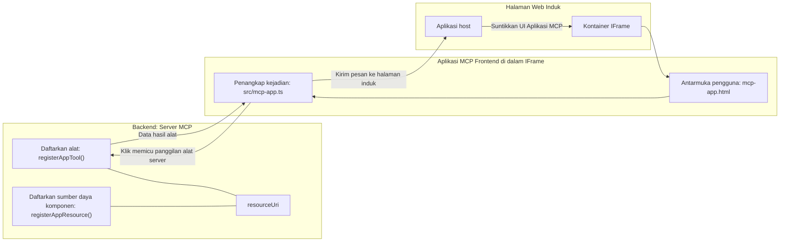
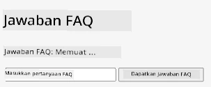
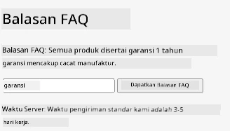
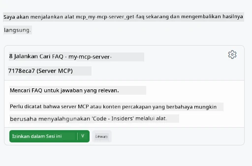

# MCP Apps

MCP Apps adalah paradigma baru dalam MCP. Idenya adalah Anda tidak hanya merespons dengan data dari panggilan alat, tetapi Anda juga menyediakan informasi tentang bagaimana informasi ini harus diinteraksikan. Itu berarti hasil alat sekarang dapat berisi informasi UI. Mengapa kita menginginkan itu? Nah, pertimbangkan bagaimana Anda melakukan hal-hal hari ini. Anda kemungkinan mengonsumsi hasil dari MCP Server dengan menempatkan semacam frontend di depannya, itu adalah kode yang perlu Anda tulis dan pelihara. Kadang itu yang Anda inginkan, tetapi terkadang akan sangat baik jika Anda bisa langsung membawa potongan informasi yang mandiri yang mencakup semuanya dari data hingga antarmuka pengguna.

## Ikhtisar

Pelajaran ini memberikan panduan praktis tentang MCP Apps, cara memulai dengannya dan cara mengintegrasikannya ke dalam Web Apps Anda yang sudah ada. MCP Apps adalah tambahan yang sangat baru untuk Standar MCP.

## Tujuan Pembelajaran

Pada akhir pelajaran ini, Anda akan dapat:

- Menjelaskan apa itu MCP Apps.
- Kapan menggunakan MCP Apps.
- Membangun dan mengintegrasikan MCP Apps Anda sendiri.

## MCP Apps - bagaimana cara kerjanya

Ide dengan MCP Apps adalah menyediakan respons yang pada dasarnya adalah sebuah komponen untuk dirender. Komponen seperti itu bisa memiliki visual dan interaktivitas, misalnya klik tombol, input pengguna dan lainnya. Mari mulai dari sisi server dan MCP Server kami. Untuk membuat komponen MCP App Anda perlu membuat sebuah tool tetapi juga resource aplikasi. Dua bagian ini dihubungkan oleh sebuah resourceUri.

Berikut contohnya. Mari kita coba visualisasikan apa yang terlibat dan bagian mana melakukan apa:

```text
server.ts -- responsible for registering tools and the component as a UI component
src/
  mcp-app.ts -- wiring up event handlers
mcp-app.html -- the user interface
```

Visual ini menjelaskan arsitektur untuk membuat komponen dan logikanya.


Mari kita coba jelaskan tanggung jawab backend dan frontend secara berurutan.

### Backend

Ada dua hal yang perlu kita capai di sini:

- Mendaftarkan tools yang ingin kita interaksi.
- Mendefinisikan komponen.

**Mendaftarkan tool**

```typescript
registerAppTool(
    server,
    "get-time",
    {
      title: "Get Time",
      description: "Returns the current server time.",
      inputSchema: {},
      _meta: { ui: { resourceUri } }, // Menghubungkan alat ini ke sumber daya UI-nya
    },
    async () => {
      const time = new Date().toISOString();
      return { content: [{ type: "text", text: time }] };
    },
  );

```

Kode di atas menggambarkan perilaku, di mana ia mengekspos sebuah tool bernama `get-time`. Tool ini tidak memerlukan input tetapi menghasilkan waktu saat ini. Kita juga memiliki kemampuan untuk mendefinisikan `inputSchema` untuk tools yang perlu menerima input pengguna.

**Mendaftarkan komponen**

Dalam file yang sama, kita juga perlu mendaftarkan komponen:

```typescript
const resourceUri = "ui://get-time/mcp-app.html";

// Mendaftarkan sumber daya, yang mengembalikan HTML/JavaScript yang dibundel untuk UI.
registerAppResource(
  server,
  resourceUri,
  resourceUri,
  { mimeType: RESOURCE_MIME_TYPE },
  async () => {
    const html = await fs.readFile(path.join(DIST_DIR, "mcp-app.html"), "utf-8");

    return {
    contents: [
        { uri: resourceUri, mimeType: RESOURCE_MIME_TYPE, text: html },
    ],
    };
  },
);
```

Perhatikan bagaimana kita menyebutkan `resourceUri` untuk menghubungkan komponen dengan tools-nya. Yang menarik juga adalah callback di mana kita memuat file UI dan mengembalikan komponen.

### Frontend komponen

Sama seperti backend, ada dua bagian di sini:

- Frontend yang ditulis dalam HTML murni.
- Kode yang menangani event dan tindakan, misalnya memanggil tools atau mengirim pesan ke jendela induk.

**Antarmuka pengguna**

Mari kita lihat antarmuka pengguna.

```html
<!-- mcp-app.html -->
<!DOCTYPE html>
<html lang="en">
  <head>
    <meta charset="UTF-8" />
    <title>Get Time App</title>
  </head>
  <body>
    <p>
      <strong>Server Time:</strong> <code id="server-time">Loading...</code>
    </p>
    <button id="get-time-btn">Get Server Time</button>
    <script type="module" src="/src/mcp-app.ts"></script>
  </body>
</html>
```

**Pengkabelan event**

Bagian terakhir adalah pengkabelan event. Itu berarti kita mengidentifikasi bagian mana dalam UI yang perlu penangan event dan apa yang dilakukan jika event terjadi:

```typescript
// mcp-app.ts

import { App } from "@modelcontextprotocol/ext-apps";

// Dapatkan referensi elemen
const serverTimeEl = document.getElementById("server-time")!;
const getTimeBtn = document.getElementById("get-time-btn")!;

// Buat instance aplikasi
const app = new App({ name: "Get Time App", version: "1.0.0" });

// Tangani hasil alat dari server. Tetapkan sebelum `app.connect()` untuk menghindari
// kehilangan hasil alat awal.
app.ontoolresult = (result) => {
  const time = result.content?.find((c) => c.type === "text")?.text;
  serverTimeEl.textContent = time ?? "[ERROR]";
};

// Sambungkan klik tombol
getTimeBtn.addEventListener("click", async () => {
  // `app.callServerTool()` memungkinkan UI meminta data terbaru dari server
  const result = await app.callServerTool({ name: "get-time", arguments: {} });
  const time = result.content?.find((c) => c.type === "text")?.text;
  serverTimeEl.textContent = time ?? "[ERROR]";
});

// Sambungkan ke host
app.connect();
```

Seperti yang Anda lihat di atas, ini adalah kode normal untuk menghubungkan elemen DOM ke event. Yang patut diperhatikan adalah panggilan ke `callServerTool` yang berakhir dengan memanggil tool di backend.

## Menangani input pengguna

Sejauh ini, kita telah melihat sebuah komponen yang memiliki tombol yang ketika diklik memanggil sebuah tool. Mari kita lihat apakah kita bisa menambahkan elemen UI lain seperti bidang input dan apakah kita bisa mengirim argumen ke sebuah tool. Mari kita implementasikan fungsi FAQ. Berikut cara kerjanya:

- Harus ada tombol dan elemen input di mana pengguna mengetik sebuah kata kunci untuk mencari, misalnya "Shipping". Ini akan memanggil sebuah tool di backend yang melakukan pencarian dalam data FAQ.
- Sebuah tool yang mendukung pencarian FAQ tersebut.

Mari tambahkan dukungan yang dibutuhkan ke backend terlebih dahulu:

```typescript
const faq: { [key: string]: string } = {
    "shipping": "Our standard shipping time is 3-5 business days.",
    "return policy": "You can return any item within 30 days of purchase.",
    "warranty": "All products come with a 1-year warranty covering manufacturing defects.",
  }

registerAppTool(
    server,
    "get-faq",
    {
      title: "Search FAQ",
      description: "Searches the FAQ for relevant answers.",
      inputSchema: zod.object({
        query: zod.string().default("shipping"),
      }),
      _meta: { ui: { resourceUri: faqResourceUri } }, // Menghubungkan alat ini ke sumber daya UI-nya
    },
    async ({ query }) => {
      const answer: string = faq[query.toLowerCase()] || "Sorry, I don't have an answer for that.";
      return { content: [{ type: "text", text: answer }] };
    },
  );
```

Yang kita lihat di sini adalah bagaimana kita mengisi `inputSchema` dan memberinya skema `zod` seperti ini:

```typescript
inputSchema: zod.object({
  query: zod.string().default("shipping"),
})
```

Dalam skema di atas kita mendeklarasikan ada parameter input bernama `query` dan itu opsional dengan nilai default "shipping".

Ok, mari lanjut ke *mcp-app.html* untuk melihat UI apa yang perlu kita buat untuk ini:

```html
<div class="faq">
    <h1>FAQ response</h1>
    <p>FAQ Response: <code id="faq-response">Loading...</code></p>
    <input type="text" id="faq-query" placeholder="Enter FAQ query" />
    <button id="get-faq-btn">Get FAQ Response</button>
  </div>
```

Bagus, sekarang kita punya elemen input dan tombol. Selanjutnya ke *mcp-app.ts* untuk mengkoneksikan event-event ini:

```typescript
const getFaqBtn = document.getElementById("get-faq-btn")!;
const faqQueryInput = document.getElementById("faq-query") as HTMLInputElement;

getFaqBtn.addEventListener("click", async () => {
  const query = faqQueryInput.value;
  const result = await app.callServerTool({ name: "get-faq", arguments: { query } });
  const faq = result.content?.find((c) => c.type === "text")?.text;
  faqResponseEl.textContent = faq ?? "[ERROR]";
});
```

Dalam kode di atas kita:

- Membuat referensi ke elemen UI yang menarik.
- Menangani klik tombol untuk mengambil nilai elemen input dan juga memanggil `app.callServerTool()` dengan `name` dan `arguments` di mana yang terakhir mengirim `query` sebagai nilai.

Apa yang sebenarnya terjadi ketika Anda memanggil `callServerTool` adalah ia mengirim pesan ke jendela induk dan jendela itu akan memanggil MCP Server.

### Coba sendiri

Dengan mencoba ini kita sekarang seharusnya melihat sebagai berikut:



dan ini adalah ketika kita mencoba dengan input seperti "warranty"



Untuk menjalankan kode ini, buka bagian [Code](./code/README.md)

## Pengujian di Visual Studio Code

Visual Studio Code memiliki dukungan yang bagus untuk MVP Apps dan mungkin salah satu cara termudah untuk menguji MCP Apps Anda. Untuk menggunakan Visual Studio Code, tambahkan entri server ke *mcp.json* seperti ini:

```json
"my-mcp-server-7178eca7": {
    "url": "http://localhost:3001/mcp",
    "type": "http"
  }
```

Kemudian jalankan server, Anda seharusnya dapat berkomunikasi dengan MVP App Anda melalui Jendela Chat asalkan Anda sudah menginstal GitHub Copilot.

dengan memicu melalui prompt, misalnya "#get-faq":



dan seperti saat Anda menjalankannya melalui browser, tampilannya sama seperti ini:


## Tugas

Buatlah permainan batu-gunting-kertas. Harus terdiri dari hal berikut:

UI:

- daftar dropdown dengan pilihan
- tombol untuk mengirim pilihan
- label yang menunjukkan siapa memilih apa dan siapa yang menang

Server:

- harus memiliki tool batu-gunting-kertas yang menerima "choice" sebagai input. Juga harus merender pilihan komputer dan menentukan pemenang

## Solusi

[Solusi](./assignment/README.md)

## Ringkasan

Kita telah mempelajari paradigma baru MCP Apps. Ini adalah paradigma baru yang memungkinkan MCP Servers memiliki pendapat tidak hanya tentang data tetapi juga bagaimana data ini harus disajikan.

Selain itu, kita belajar bahwa MCP Apps ini dihosting dalam sebuah IFrame dan untuk berkomunikasi dengan MCP Servers mereka perlu mengirim pesan ke aplikasi web induk. Ada beberapa pustaka untuk JavaScript murni, React, dan lainnya yang membuat komunikasi ini lebih mudah.

## Hal Penting yang Dipelajari

Berikut hal yang Anda pelajari:

- MCP Apps adalah standar baru yang berguna ketika Anda ingin mengirimkan data dan fitur UI bersama-sama.
- Jenis aplikasi ini berjalan di dalam IFrame demi alasan keamanan.

## Selanjutnya

- [Bab 4](../../04-PracticalImplementation/README.md)

---

<!-- CO-OP TRANSLATOR DISCLAIMER START -->
**Penafian**:  
Dokumen ini telah diterjemahkan menggunakan layanan terjemahan AI [Co-op Translator](https://github.com/Azure/co-op-translator). Meskipun kami berupaya untuk akurat, harap diperhatikan bahwa terjemahan otomatis mungkin mengandung kesalahan atau ketidakakuratan. Dokumen asli dalam bahasa aslinya harus dianggap sebagai sumber otoritatif. Untuk informasi yang penting, disarankan menggunakan terjemahan profesional oleh manusia. Kami tidak bertanggung jawab atas kesalahpahaman atau penafsiran yang keliru yang timbul dari penggunaan terjemahan ini.
<!-- CO-OP TRANSLATOR DISCLAIMER END -->