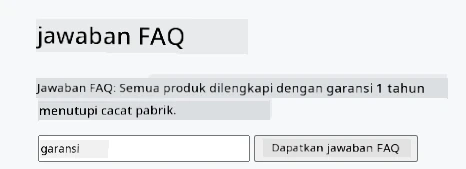
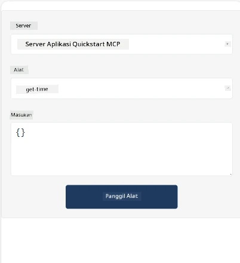
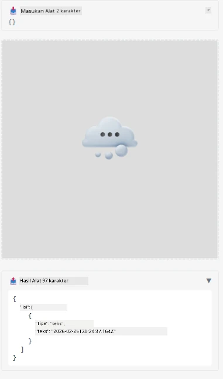

Berikut adalah contoh yang menunjukkan MCP App

## Install

1. Navigasi ke folder *mcp-app*
1. Jalankan `npm install`, ini akan menginstal dependensi frontend dan backend

Verifikasi backend dapat dikompilasi dengan menjalankan:

```sh
npx tsc --noEmit
```
  
Seharusnya tidak ada output jika semuanya baik-baik saja.

## Jalankan backend

> Ini memerlukan sedikit usaha ekstra jika Anda menggunakan mesin Windows karena solusi MCP Apps menggunakan pustaka `concurrently` yang perlu Anda cari penggantinya. Berikut adalah baris bermasalah di *package.json* pada MCP App:

    ```json
    "start": "concurrently \"cross-env NODE_ENV=development INPUT=mcp-app.html vite build --watch\" \"tsx watch main.ts\""
    ```

Aplikasi ini memiliki dua bagian, bagian backend dan bagian host.

Mulai backend dengan memanggil:

```sh
npm start
```
  
Ini akan memulai backend di `http://localhost:3001/mcp`.

> Catatan, jika Anda menggunakan Codespace, Anda mungkin perlu mengatur visibilitas port ke publik. Periksa apakah Anda dapat mengakses endpoint melalui browser melalui https://<nama Codespace>.app.github.dev/mcp

## Pilihan -1 Uji aplikasi di Visual Studio Code

Untuk menguji solusi di Visual Studio Code, lakukan hal berikut:

- Tambahkan entri server ke `mcp.json` seperti berikut:

    ```json
    {
        "servers": {
            "my-mcp-server-7178eca7": {
                "url": "http://localhost:3001/mcp",
                "type": "http"
            }
        },
        "inputs": []
    }
    ```
  
1. Klik tombol "start" di *mcp.json*  
1. Pastikan jendela chat terbuka dan ketik `get-faq`, Anda harus melihat hasil seperti berikut:

    

## Pilihan -2- Uji aplikasi dengan host

Repo <https://github.com/modelcontextprotocol/ext-apps> berisi beberapa host berbeda yang dapat Anda gunakan untuk menguji MCP Apps Anda.

Kami akan memberi Anda dua opsi berbeda di sini:

### Mesin lokal

- Navigasi ke *ext-apps* setelah Anda mengkloning repo.

- Instal dependensi

   ```sh
   npm install
   ```
  
- Di jendela terminal terpisah, navigasi ke *ext-apps/examples/basic-host*

    > jika Anda menggunakan Codespace, Anda perlu navigasi ke serve.ts pada baris 27 dan mengganti http://localhost:3001/mcp dengan URL Codespace Anda untuk backend, misalnya https://psychic-xylophone-657rpjgvxpc5g64-3001.app.github.dev/mcp

- Jalankan host:

    ```sh
    npm start
    ```
  
    Ini akan menghubungkan host dengan backend dan Anda akan melihat aplikasi berjalan seperti ini:

    

### Codespace

Memerlukan sedikit usaha ekstra untuk membuat lingkungan Codespace bekerja. Untuk menggunakan host melalui Codespace:

- Lihat direktori *ext-apps* dan navigasi ke *examples/basic-host*.  
- Jalankan `npm install` untuk menginstal dependensi  
- Jalankan `npm start` untuk memulai host.

## Uji aplikasi

Coba aplikasi dengan cara berikut:

- Pilih tombol "Call Tool" dan Anda akan melihat hasil seperti ini:

    

Bagus, semuanya berjalan dengan baik.

---

<!-- CO-OP TRANSLATOR DISCLAIMER START -->
**Penafian**:  
Dokumen ini telah diterjemahkan menggunakan layanan terjemahan AI [Co-op Translator](https://github.com/Azure/co-op-translator). Meskipun kami berupaya untuk akurat, harap diketahui bahwa terjemahan otomatis mungkin mengandung kesalahan atau ketidakakuratan. Dokumen asli dalam bahasa aslinya harus dianggap sebagai sumber yang sahih. Untuk informasi yang penting, disarankan menggunakan terjemahan profesional oleh manusia. Kami tidak bertanggung jawab atas kesalahpahaman atau interpretasi yang keliru yang timbul dari penggunaan terjemahan ini.
<!-- CO-OP TRANSLATOR DISCLAIMER END -->