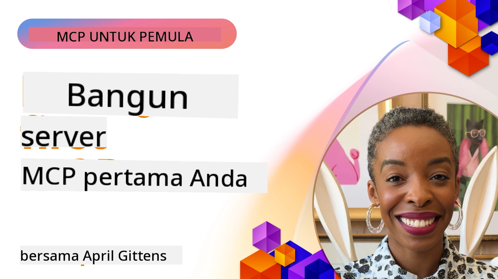

## Memulai  

_(Klik gambar di atas untuk melihat video dari pelajaran ini)_

Bagian ini terdiri dari beberapa pelajaran:

- **1 Server pertama Anda**, dalam pelajaran pertama ini, Anda akan belajar cara membuat server pertama Anda dan memeriksanya dengan alat inspector, cara yang berharga untuk menguji dan debug server Anda, [ke pelajaran](01-first-server/README.md)

- **2 Klien**, dalam pelajaran ini, Anda akan belajar cara menulis klien yang dapat terhubung ke server Anda, [ke pelajaran](02-client/README.md)

- **3 Klien dengan LLM**, cara yang lebih baik untuk menulis klien adalah dengan menambahkan LLM ke dalamnya sehingga dapat "bernegosiasi" dengan server Anda tentang apa yang harus dilakukan, [ke pelajaran](03-llm-client/README.md)

- **4 Menggunakan mode GitHub Copilot Agent server dalam Visual Studio Code**. Di sini, kita melihat menjalankan Server MCP dari dalam Visual Studio Code, [ke pelajaran](04-vscode/README.md)

- **5 Server Transport stdio** transport stdio adalah standar yang direkomendasikan untuk komunikasi lokal server-ke-klien MCP, menyediakan komunikasi subprocess yang aman dengan isolasi proses bawaan [ke pelajaran](05-stdio-server/README.md)

- **6 Streaming HTTP dengan MCP (Streamable HTTP)**. Pelajari tentang standar
	remote transport dalam [Spesifikasi MCP 2026-07-28](https://modelcontextprotocol.io/specification/2026-07-28/basic/transports/streamable-http),
	plus implementasi legacy berbasis sesi yang dipertahankan dalam pelajaran.
	[ke pelajaran](06-http-streaming/README.md)

- **7 Memanfaatkan AI Toolkit untuk VSCode** untuk mengonsumsi dan menguji Klien dan Server MCP Anda [ke pelajaran](07-aitk/README.md)

- **8 Pengujian**. Di sini kita akan fokus terutama bagaimana kita dapat menguji server dan klien kita dengan berbagai cara, [ke pelajaran](08-testing/README.md)

- **9 Penyebaran**. Bab ini akan melihat berbagai cara untuk menyebarkan solusi MCP Anda, [ke pelajaran](09-deployment/README.md)

- **10 Penggunaan server lanjutan**. Bab ini membahas penggunaan server lanjutan, [ke pelajaran](./10-advanced/README.md)

- **11 Auth**. Bab ini membahas cara menambahkan auth sederhana, dari Basic Auth hingga menggunakan JWT dan RBAC. Anda disarankan untuk memulai di sini lalu lihat Topik Lanjutan di Bab 5 dan melakukan penguatan keamanan tambahan melalui rekomendasi di Bab 2, [ke pelajaran](./11-simple-auth/README.md)

- **12 Host MCP**. Mengonfigurasi dan menggunakan klien host MCP populer termasuk Claude Desktop, Cursor, Cline, dan Windsurf. Pelajari jenis transport dan pemecahan masalah, [ke pelajaran](./12-mcp-hosts/README.md)

- **13 Inspector MCP**. Debug dan uji server MCP Anda secara interaktif menggunakan alat Inspector MCP. Pelajari alat pemecahan masalah, sumber daya, dan pesan protokol, [ke pelajaran](./13-mcp-inspector/README.md)

- **14 Sampling**. Pelajari primitif Sampling legacy untuk `2025-11-25` dan
	cara memigrasi desain baru ke integrasi penyedia LLM langsung. Sampling
	dihapus di MCP `2026-07-28`. [ke pelajaran](./14-sampling/README.md)

- **15 Aplikasi MCP**. Bangun Server MCP yang juga membalas dengan instruksi UI, [ke pelajaran](./15-mcp-apps/README.md)

Model Context Protocol (MCP) adalah protokol terbuka yang menstandarisasi bagaimana aplikasi menyediakan konteks ke LLM. Pikirkan MCP seperti port USB-C untuk aplikasi AI - ini menyediakan cara standar untuk menghubungkan model AI ke berbagai sumber data dan alat.

## Tujuan Pembelajaran

Pada akhir pelajaran ini, Anda akan dapat:

- Menyiapkan lingkungan pengembangan untuk MCP dalam C#, Java, Python, TypeScript, dan JavaScript
- Membangun dan menyebarkan server MCP dasar dengan fitur kustom (sumber daya, prompt, dan alat)
- Membuat aplikasi host yang terhubung ke server MCP
- Menguji dan debug implementasi MCP
- Memahami tantangan pengaturan umum dan solusinya
- Menghubungkan implementasi MCP Anda ke layanan LLM populer

## Menyiapkan Lingkungan MCP Anda

Sebelum Anda mulai bekerja dengan MCP, penting untuk menyiapkan lingkungan pengembangan Anda dan memahami alur kerja dasar. Bagian ini akan membimbing Anda melalui langkah-langkah pengaturan awal untuk memastikan awal yang lancar dengan MCP.

### Prasyarat

Sebelum memasuki pengembangan MCP, pastikan Anda memiliki:

- **Lingkungan Pengembangan**: Untuk bahasa pilihan Anda (C#, Java, Python, TypeScript, atau JavaScript)
- **IDE/Editor**: Visual Studio, Visual Studio Code, IntelliJ, Eclipse, PyCharm, atau editor kode modern lainnya
- **Manajer Paket**: NuGet, Maven/Gradle, pip, atau npm/yarn
- **Kunci API**: Untuk layanan AI apa pun yang Anda rencanakan gunakan di aplikasi host Anda

### SDK Resmi

Dalam bab-bab berikut Anda akan melihat solusi yang dibangun menggunakan Python, TypeScript,
Java dan .NET. Berikut adalah SDK resmi.

Dukungan SDK untuk MCP `2026-07-28` diluncurkan secara independen berdasarkan bahasa.
Sebelum menjalankan contoh, periksa versi paketnya dan catatan rilis SDK
untuk revisi protokol yang didukung. Lihat
[daftar SDK resmi](https://modelcontextprotocol.io/docs/sdk):
- [SDK C#](https://github.com/modelcontextprotocol/csharp-sdk) - Dikelola bekerja sama dengan Microsoft
- [SDK Java](https://github.com/modelcontextprotocol/java-sdk) - Dikelola bekerja sama dengan Spring AI
- [SDK TypeScript](https://github.com/modelcontextprotocol/typescript-sdk) - Implementasi resmi TypeScript
- [SDK Python](https://github.com/modelcontextprotocol/python-sdk) - Implementasi resmi Python (FastMCP)
- [SDK Kotlin](https://github.com/modelcontextprotocol/kotlin-sdk) - Implementasi resmi Kotlin
- [SDK Swift](https://github.com/modelcontextprotocol/swift-sdk) - Dikelola bekerja sama dengan Loopwork AI
- [SDK Rust](https://github.com/modelcontextprotocol/rust-sdk) - Implementasi resmi Rust
- [SDK Go](https://github.com/modelcontextprotocol/go-sdk) - Implementasi resmi Go

## Poin-poin Penting

- Menyiapkan lingkungan pengembangan MCP mudah dengan SDK khusus bahasa
- Membangun server MCP melibatkan pembuatan dan pendaftaran alat dengan skema yang jelas
- Klien MCP terhubung ke server dan model untuk memanfaatkan kemampuan yang diperluas
- Pengujian dan debugging penting untuk implementasi MCP yang dapat diandalkan
- Opsi penyebaran berkisar dari pengembangan lokal hingga solusi berbasis cloud

## Berlatih

Kami memiliki kumpulan contoh yang melengkapi latihan yang akan Anda lihat di semua bab dalam bagian ini. Selain itu setiap bab juga memiliki latihan dan tugas tersendiri

- [Kalkulator Java](./samples/java/calculator/README.md)
- [Kalkulator .NET](../../../03-GettingStarted/samples/csharp)
- [Kalkulator JavaScript](./samples/javascript/README.md)
- [Kalkulator TypeScript](./samples/typescript/README.md)
- [Kalkulator Python](../../../03-GettingStarted/samples/python)

## Sumber Daya Tambahan

- [Bangun Agen menggunakan Model Context Protocol di Azure](https://learn.microsoft.com/azure/developer/ai/intro-agents-mcp)
- [MCP Jarak Jauh dengan Azure Container Apps (Node.js/TypeScript/JavaScript)](https://learn.microsoft.com/samples/azure-samples/mcp-container-ts/mcp-container-ts/)
- [Agen MCP OpenAI .NET](https://learn.microsoft.com/samples/azure-samples/openai-mcp-agent-dotnet/openai-mcp-agent-dotnet/)

## Selanjutnya

Mulailah dengan pelajaran pertama: [Membuat Server MCP Pertama Anda](01-first-server/README.md)

Setelah Anda menyelesaikan modul ini, lanjutkan ke: [Modul 4: Implementasi Praktis](../04-PracticalImplementation/README.md)

---

<!-- CO-OP TRANSLATOR DISCLAIMER START -->
**Penafian**:
Dokumen ini telah diterjemahkan menggunakan layanan terjemahan AI [Co-op Translator](https://github.com/Azure/co-op-translator). Meskipun kami berupaya untuk mencapai akurasi, harap diketahui bahwa terjemahan otomatis mungkin mengandung kesalahan atau ketidakakuratan. Dokumen asli dalam bahasa aslinya harus dianggap sebagai sumber yang sah. Untuk informasi penting, disarankan menggunakan terjemahan profesional oleh manusia. Kami tidak bertanggung jawab atas kesalahpahaman atau penafsiran yang keliru yang timbul dari penggunaan terjemahan ini.
<!-- CO-OP TRANSLATOR DISCLAIMER END -->