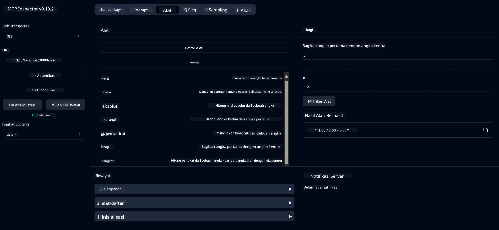

# Layanan Kalkulator Dasar MCP

> [!NOTE]
> Contoh ini menggunakan transport HTTP+SSE warisan dan ditargetkan untuk SDK yang kompatibel
> dengan MCP `2025-11-25`. Server jarak jauh baru harus menggunakan dukungan HTTP Streamable
> `2026-07-28`.

Layanan ini menyediakan operasi kalkulator dasar melalui Model Context Protocol (MCP) menggunakan Spring Boot dengan transport WebFlux. Ini dirancang sebagai contoh sederhana bagi pemula yang mempelajari implementasi MCP.

Untuk informasi lebih lanjut, lihat dokumentasi referensi [MCP Server Boot Starter](https://docs.spring.io/spring-ai/reference/api/mcp/mcp-server-boot-starter-docs.html).

## Ikhtisar

Layanan ini menampilkan:
- Dukungan untuk SSE (Server-Sent Events)
- Pendaftaran alat otomatis menggunakan anotasi `@Tool` Spring AI
- Fungsi kalkulator dasar:
  - Penjumlahan, pengurangan, perkalian, pembagian
  - Perhitungan pangkat dan akar kuadrat
  - Modulus (sisa) dan nilai absolut
  - Fungsi bantuan untuk deskripsi operasi

## Fitur

Layanan kalkulator ini menawarkan kemampuan berikut:

1. **Operasi Aritmatika Dasar**:
   - Menjumlahkan dua angka
   - Mengurangkan satu angka dari yang lain
   - Mengalikan dua angka
   - Membagi satu angka dengan yang lain (dengan pemeriksaan pembagian nol)

2. **Operasi Lanjutan**:
   - Perhitungan pangkat (menaikkan basis ke eksponen)
   - Perhitungan akar kuadrat (dengan pemeriksaan angka negatif)
   - Perhitungan modulus (sisa)
   - Perhitungan nilai absolut

3. **Sistem Bantuan**:
   - Fungsi bantuan bawaan yang menjelaskan semua operasi yang tersedia

## Menggunakan Layanan

Layanan ini mengekspos endpoint API berikut melalui protokol MCP:

- `add(a, b)`: Menjumlahkan dua angka
- `subtract(a, b)`: Mengurangkan angka kedua dari angka pertama
- `multiply(a, b)`: Mengalikan dua angka
- `divide(a, b)`: Membagi angka pertama dengan angka kedua (dengan pemeriksaan nol)
- `power(base, exponent)`: Menghitung pangkat sebuah angka
- `squareRoot(number)`: Menghitung akar kuadrat (dengan pemeriksaan angka negatif)
- `modulus(a, b)`: Menghitung sisa pembagian
- `absolute(number)`: Menghitung nilai absolut
- `help()`: Mendapatkan informasi tentang operasi yang tersedia

## Klien Pengujian

Klien pengujian sederhana disertakan dalam paket `com.microsoft.mcp.sample.client`. Kelas `SampleCalculatorClient` menunjukkan operasi yang tersedia dari layanan kalkulator.

## Menggunakan Klien LangChain4j

Proyek ini menyertakan klien contoh LangChain4j di `com.microsoft.mcp.sample.client.LangChain4jClient` yang menunjukkan cara mengintegrasikan layanan kalkulator dengan LangChain4j dan model GitHub:

### Prasyarat

1. **Pengaturan Token GitHub**:
   
   Untuk menggunakan model AI GitHub (seperti phi-4), Anda memerlukan token akses personal GitHub:

   a. Masuk ke pengaturan akun GitHub Anda: https://github.com/settings/tokens
   
   b. Klik "Generate new token" → "Generate new token (classic)"
   
   c. Beri nama token Anda dengan deskriptif
   
   d. Pilih ruang lingkup berikut:
      - `repo` (Kontrol penuh repositori pribadi)
      - `read:org` (Baca keanggotaan organisasi dan tim, baca proyek organisasi)
      - `gist` (Buat gists)
      - `user:email` (Akses alamat email pengguna (hanya baca))
   
   e. Klik "Generate token" dan salin token baru Anda
   
   f. Tetapkan sebagai variabel lingkungan:
      
      Di Windows:
      ```
      set GITHUB_TOKEN=your-github-token
      ```
      
      Di macOS/Linux:
      ```bash
      export GITHUB_TOKEN=your-github-token
      ```

   g. Untuk pengaturan permanen, tambahkan ke variabel lingkungan melalui pengaturan sistem

2. Tambahkan dependensi LangChain4j GitHub ke proyek Anda (sudah termasuk di pom.xml):
   ```xml
   <dependency>
       <groupId>dev.langchain4j</groupId>
       <artifactId>langchain4j-github</artifactId>
       <version>${langchain4j.version}</version>
   </dependency>
   ```

3. Pastikan server kalkulator berjalan di `localhost:8080`

### Menjalankan Klien LangChain4j

Contoh ini menunjukkan:
- Menghubungkan ke server MCP kalkulator melalui transport SSE
- Menggunakan LangChain4j untuk membuat chatbot yang memanfaatkan operasi kalkulator
- Integrasi dengan model AI GitHub (sekarang menggunakan model phi-4)

Klien mengirimkan kueri contoh berikut untuk menunjukkan fungsionalitas:
1. Menghitung jumlah dua angka
2. Mencari akar kuadrat sebuah angka
3. Mendapatkan informasi bantuan tentang operasi kalkulator yang tersedia

Jalankan contoh dan periksa output konsol untuk melihat bagaimana model AI menggunakan alat kalkulator untuk menjawab kueri.

### Konfigurasi Model GitHub

Klien LangChain4j dikonfigurasi untuk menggunakan model phi-4 GitHub dengan pengaturan berikut:

```java
ChatLanguageModel model = GitHubChatModel.builder()
    .apiKey(System.getenv("GITHUB_TOKEN"))
    .timeout(Duration.ofSeconds(60))
    .modelName("phi-4")
    .logRequests(true)
    .logResponses(true)
    .build();
```

Untuk menggunakan model GitHub berbeda, cukup ubah parameter `modelName` ke model lain yang didukung (misalnya, "claude-3-haiku-20240307", "llama-3-70b-8192", dll).

## Dependensi

Proyek ini memerlukan dependensi kunci berikut:

```xml
<!-- For MCP Server -->
<dependency>
    <groupId>org.springframework.ai</groupId>
    <artifactId>spring-ai-starter-mcp-server-webflux</artifactId>
</dependency>

<!-- For LangChain4j integration -->
<dependency>
    <groupId>dev.langchain4j</groupId>
    <artifactId>langchain4j-mcp</artifactId>
    <version>${langchain4j.version}</version>
</dependency>

<!-- For GitHub models support -->
<dependency>
    <groupId>dev.langchain4j</groupId>
    <artifactId>langchain4j-github</artifactId>
    <version>${langchain4j.version}</version>
</dependency>
```

## Membangun Proyek

Bangun proyek menggunakan Maven:
```bash
./mvnw clean install -DskipTests
```

## Menjalankan Server

### Menggunakan Java

```bash
java -jar target/calculator-server-0.0.1-SNAPSHOT.jar
```

### Menggunakan MCP Inspector

MCP Inspector adalah alat yang membantu untuk berinteraksi dengan layanan MCP. Untuk menggunakannya dengan layanan kalkulator ini:

1. **Instal dan jalankan MCP Inspector** di jendela terminal baru:
   ```bash
   npx @modelcontextprotocol/inspector
   ```

2. **Akses UI web** dengan mengklik URL yang ditampilkan oleh aplikasi (biasanya http://localhost:6274)

3. **Konfigurasikan koneksi**:
   - Atur tipe transport ke "SSE"
   - Atur URL ke endpoint SSE server Anda yang berjalan: `http://localhost:8080/sse`
   - Klik "Connect"

4. **Gunakan alat**:
   - Klik "List Tools" untuk melihat operasi kalkulator yang tersedia
   - Pilih alat dan klik "Run Tool" untuk menjalankan operasi



### Menggunakan Docker

Proyek ini menyertakan Dockerfile untuk deployment container:

1. **Bangun gambar Docker**:
   ```bash
   docker build -t calculator-mcp-service .
   ```

2. **Jalankan container Docker**:
   ```bash
   docker run -p 8080:8080 calculator-mcp-service
   ```

Ini akan:
- Membangun multi-stage image Docker dengan Maven 3.9.9 dan Eclipse Temurin 24 JDK
- Membuat image container yang dioptimalkan
- Mengekspos layanan pada port 8080
- Memulai layanan kalkulator MCP di dalam container

Anda dapat mengakses layanan di `http://localhost:8080` setelah container berjalan.

## Pemecahan Masalah

### Masalah Umum dengan Token GitHub

1. **Masalah Izin Token**: Jika Anda mendapatkan kesalahan 403 Forbidden, periksa bahwa token Anda memiliki izin yang benar seperti dijelaskan pada prasyarat.

2. **Token Tidak Ditemukan**: Jika Anda mendapatkan kesalahan "No API key found", pastikan variabel lingkungan GITHUB_TOKEN diatur dengan benar.

3. **Pembatasan Rate**: API GitHub memiliki batasan rate. Jika Anda mengalami kesalahan pembatasan rate (kode status 429), tunggu beberapa menit sebelum mencoba kembali.

4. **Kadaluarsa Token**: Token GitHub bisa kadaluarsa. Jika Anda menerima kesalahan autentikasi setelah beberapa waktu, buat token baru dan perbarui variabel lingkungan Anda.

Jika Anda memerlukan bantuan lebih lanjut, periksa dokumentasi [LangChain4j](https://github.com/langchain4j/langchain4j) atau dokumentasi [API GitHub](https://docs.github.com/en/rest).

---

<!-- CO-OP TRANSLATOR DISCLAIMER START -->
**Penafian**:
Dokumen ini telah diterjemahkan menggunakan layanan terjemahan AI [Co-op Translator](https://github.com/Azure/co-op-translator). Meskipun kami berupaya untuk mencapai akurasi, harap diketahui bahwa terjemahan otomatis mungkin mengandung kesalahan atau ketidakakuratan. Dokumen asli dalam bahasa aslinya harus dianggap sebagai sumber yang sah. Untuk informasi penting, disarankan menggunakan terjemahan profesional oleh manusia. Kami tidak bertanggung jawab atas kesalahpahaman atau penafsiran yang keliru yang timbul dari penggunaan terjemahan ini.
<!-- CO-OP TRANSLATOR DISCLAIMER END -->