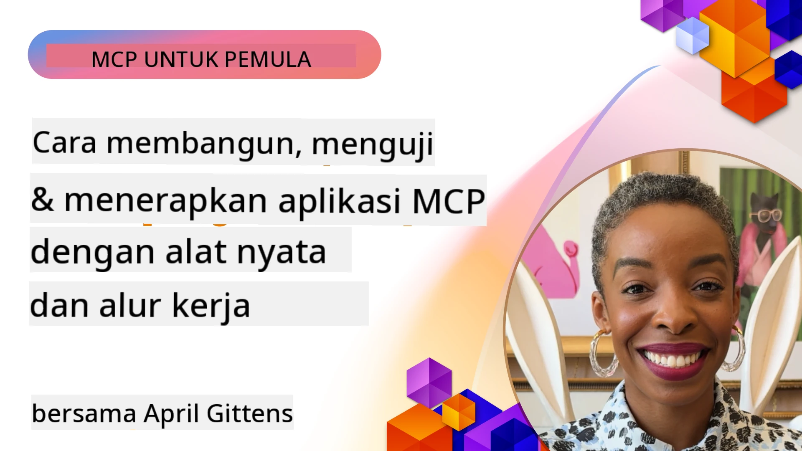

# Implementasi Praktis

[](https://youtu.be/vCN9-mKBDfQ)

_(Klik gambar di atas untuk menonton video pelajaran ini)_

Implementasi praktis adalah tempat di mana kekuatan Model Context Protocol (MCP) menjadi nyata. Meskipun memahami teori dan arsitektur di balik MCP itu penting, nilai sebenarnya muncul ketika Anda menerapkan konsep-konsep ini untuk membangun, menguji, dan mendeploy solusi yang memecahkan masalah dunia nyata. Bab ini menjembatani kesenjangan antara pengetahuan konseptual dan pengembangan langsung, memandu Anda melalui proses membawa aplikasi berbasis MCP menjadi nyata.

Apakah Anda sedang mengembangkan asisten cerdas, mengintegrasikan AI ke dalam alur kerja bisnis, atau membangun alat khusus untuk pemrosesan data, MCP menyediakan fondasi yang fleksibel. Desainnya yang tidak bergantung bahasa dan SDK resmi untuk bahasa pemrograman populer membuatnya dapat diakses oleh berbagai pengembang. Dengan memanfaatkan SDK ini, Anda dapat cepat membuat prototipe, iterasi, dan mengskalakan solusi Anda di berbagai platform dan lingkungan.

Dalam bagian berikut, Anda akan menemukan contoh praktis, kode sampel, dan strategi deployment yang menunjukkan cara mengimplementasikan MCP dalam C#, Java dengan Spring, TypeScript, JavaScript, dan Python. Anda juga akan belajar bagaimana melakukan debug dan pengujian server MCP, mengelola API, dan mendeploy solusi ke cloud menggunakan Azure. Sumber daya langsung ini dirancang untuk mempercepat pembelajaran Anda dan membantu Anda dengan percaya diri membangun aplikasi MCP yang kuat dan siap produksi.

## Gambaran Umum

Pelajaran ini fokus pada aspek praktis implementasi MCP di berbagai bahasa pemrograman. Kita akan mengeksplorasi cara menggunakan SDK MCP dalam C#, Java dengan Spring, TypeScript, JavaScript, dan Python untuk membangun aplikasi yang kuat, melakukan debug dan pengujian server MCP, serta membuat sumber daya, prompt, dan alat yang dapat digunakan kembali.

## Tujuan Pembelajaran

Di akhir pelajaran ini, Anda akan mampu:

- Mengimplementasikan solusi MCP menggunakan SDK resmi dalam berbagai bahasa pemrograman
- Melakukan debug dan pengujian server MCP secara sistematis
- Membuat dan menggunakan fitur server (Resources, Prompts, dan Tools)
- Merancang alur kerja MCP yang efektif untuk tugas-tugas kompleks
- Mengoptimalkan implementasi MCP untuk kinerja dan keandalan

## Sumber Daya SDK Resmi

Model Context Protocol menawarkan SDK resmi untuk banyak bahasa (selaras dengan [Spesifikasi MCP 2025-11-25](https://spec.modelcontextprotocol.io/specification/2025-11-25/)):

- [C# SDK](https://github.com/modelcontextprotocol/csharp-sdk)
- [Java dengan Spring SDK](https://github.com/modelcontextprotocol/java-sdk) **Catatan:** membutuhkan dependensi pada [Project Reactor](https://projectreactor.io). (Lihat [diskusi isu 246](https://github.com/orgs/modelcontextprotocol/discussions/246).)
- [TypeScript SDK](https://github.com/modelcontextprotocol/typescript-sdk)
- [Python SDK](https://github.com/modelcontextprotocol/python-sdk)
- [Kotlin SDK](https://github.com/modelcontextprotocol/kotlin-sdk)
- [Go SDK](https://github.com/modelcontextprotocol/go-sdk)

## Bekerja dengan SDK MCP

Bagian ini menyediakan contoh praktis implementasi MCP di berbagai bahasa pemrograman. Anda dapat menemukan kode sampel di direktori `samples` yang diorganisasi berdasarkan bahasa.

### Sampel Tersedia

Repositori mencakup [implementasi sampel](../../../04-PracticalImplementation/samples) dalam bahasa-bahasa berikut:

- [C#](./samples/csharp/README.md)
- [Java dengan Spring](./samples/java/containerapp/README.md)
- [TypeScript](./samples/typescript/README.md)
- [JavaScript](./samples/javascript/README.md)
- [Python](./samples/python/README.md)

Setiap sampel menunjukkan konsep utama MCP dan pola implementasi untuk bahasa dan ekosistem tersebut.

### Panduan Praktis

Panduan tambahan untuk implementasi MCP praktis:

- [Paginasi dan Set Hasil Besar](./pagination/README.md) - Menangani paginasi berbasis cursor untuk alat, sumber daya, dan dataset besar

## Fitur Inti Server

Server MCP dapat mengimplementasikan kombinasi fitur berikut:

### Resources

Resources menyediakan konteks dan data bagi pengguna atau model AI untuk digunakan:

- Repositori dokumen
- Basis pengetahuan
- Sumber data terstruktur
- Sistem berkas

### Prompts

Prompts adalah pesan template dan alur kerja untuk pengguna:

- Template percakapan yang sudah ditentukan
- Pola interaksi terpandu
- Struktur dialog khusus

### Tools

Tools adalah fungsi yang bisa dijalankan oleh model AI:

- Utilitas pemrosesan data
- Integrasi API eksternal
- Kapabilitas komputasi
- Fungsi pencarian

## Contoh Implementasi: Implementasi C#

Repositori SDK C# resmi berisi beberapa contoh implementasi yang menunjukkan berbagai aspek MCP:

- **Klien MCP Dasar**: Contoh sederhana menunjukkan cara membuat klien MCP dan memanggil alat
- **Server MCP Dasar**: Implementasi server minimal dengan pendaftaran alat dasar
- **Server MCP Lanjutan**: Server lengkap dengan pendaftaran alat, autentikasi, dan penanganan kesalahan
- **Integrasi ASP.NET**: Contoh yang menunjukkan integrasi dengan ASP.NET Core
- **Pola Implementasi Alat**: Berbagai pola untuk mengimplementasikan alat dengan tingkat kompleksitas berbeda

SDK MCP C# masih dalam pratinjau dan API dapat berubah. Kami akan terus memperbarui blog ini seiring evolusi SDK.

### Fitur Utama

- [C# MCP Nuget ModelContextProtocol](https://www.nuget.org/packages/ModelContextProtocol)
- Membangun [Server MCP pertama Anda](https://devblogs.microsoft.com/dotnet/build-a-model-context-protocol-mcp-server-in-csharp/).

Untuk sampel implementasi C# lengkap, kunjungi [repositori sampel SDK C# resmi](https://github.com/modelcontextprotocol/csharp-sdk)

## Contoh Implementasi: Implementasi Java dengan Spring

SDK Java dengan Spring menawarkan opsi implementasi MCP yang kuat dengan fitur kelas perusahaan.

### Fitur Utama

- Integrasi Spring Framework
- Keamanan tipe yang kuat
- Dukungan pemrograman reaktif
- Penanganan kesalahan komprehensif

Untuk contoh implementasi Java dengan Spring lengkap, lihat [sampel Java dengan Spring](samples/java/containerapp/README.md) di direktori sampel.

## Contoh Implementasi: Implementasi JavaScript

SDK JavaScript memberikan pendekatan ringan dan fleksibel untuk implementasi MCP.

### Fitur Utama

- Dukungan Node.js dan browser
- API berbasis Promise
- Integrasi mudah dengan Express dan framework lainnya
- Dukungan WebSocket untuk streaming

Untuk contoh implementasi JavaScript lengkap, lihat [sampel JavaScript](samples/javascript/README.md) di direktori sampel.

## Contoh Implementasi: Implementasi Python

SDK Python menawarkan pendekatan Pythonic untuk implementasi MCP dengan integrasi framework ML yang sangat baik.

### Fitur Utama

- Dukungan async/await dengan asyncio
- Integrasi FastAPI
- Pendaftaran alat yang sederhana
- Integrasi asli dengan perpustakaan ML populer

Untuk contoh implementasi Python lengkap, lihat [sampel Python](samples/python/README.md) di direktori sampel.

## Manajemen API

Azure API Management adalah jawaban yang bagus bagaimana kita dapat mengamankan Server MCP. Idéanya adalah menempatkan instansi Azure API Management di depan Server MCP Anda dan membiarkannya menangani fitur-fitur yang mungkin Anda inginkan seperti:

- pembatasan laju
- manajemen token
- pemantauan
- penyeimbangan beban
- keamanan

### Sampel Azure

Berikut adalah Sampel Azure yang melakukan hal tersebut, yaitu [membuat Server MCP dan mengamankannya dengan Azure API Management](https://github.com/Azure-Samples/remote-mcp-apim-functions-python).

Lihat bagaimana alur otorisasi terjadi pada gambar berikut:


Pada gambar di atas, yang terjadi adalah:

- Otentikasi/Otorisasi berlangsung menggunakan Microsoft Entra.
- Azure API Management bertindak sebagai gateway dan menggunakan kebijakan untuk mengarahkan dan mengelola trafik.
- Azure Monitor mencatat semua permintaan untuk analisis lebih lanjut.

#### Alur otorisasi

Mari kita lihat alur otorisasi lebih rinci:


#### Spesifikasi otorisasi MCP

Pelajari lebih lanjut tentang [Spesifikasi Otorisasi MCP](https://spec.modelcontextprotocol.io/specification/2025-11-25/basic/authorization/)

## Mendeploy Server MCP Remote ke Azure

Mari lihat apakah kita bisa mendeploy sampel yang disebutkan sebelumnya:

1. Clone repositori

    ```bash
    git clone https://github.com/Azure-Samples/remote-mcp-apim-functions-python.git
    cd remote-mcp-apim-functions-python
    ```

1. Daftarkan penyedia sumber daya `Microsoft.App`.

   - Jika Anda menggunakan Azure CLI, jalankan `az provider register --namespace Microsoft.App --wait`.
   - Jika Anda menggunakan Azure PowerShell, jalankan `Register-AzResourceProvider -ProviderNamespace Microsoft.App`. Kemudian jalankan `(Get-AzResourceProvider -ProviderNamespace Microsoft.App).RegistrationState` setelah beberapa saat untuk memeriksa apakah pendaftaran selesai.

1. Jalankan perintah [azd](https://aka.ms/azd) ini untuk menyediakan layanan manajemen API, fungsi aplikasi (dengan kode), dan semua sumber daya Azure lain yang diperlukan

    ```shell
    azd up
    ```

    Perintah ini seharusnya mendeploy semua sumber daya cloud di Azure

### Menguji server Anda dengan MCP Inspector

1. Di **jendela terminal baru**, instal dan jalankan MCP Inspector

    ```shell
    npx @modelcontextprotocol/inspector
    ```

    Anda akan melihat antarmuka seperti berikut:

    

1. CTRL klik untuk memuat aplikasi web MCP Inspector dari URL yang ditampilkan oleh aplikasi (misalnya [http://127.0.0.1:6274/#resources](http://127.0.0.1:6274/#resources))
1. Atur tipe transport ke `SSE`
1. Atur URL ke endpoint SSE API Management yang sedang berjalan yang ditampilkan setelah `azd up` dan **Connect**:

    ```shell
    https://<apim-servicename-from-azd-output>.azure-api.net/mcp/sse
    ```

1. **Daftar Alat**. Klik sebuah alat dan **Jalankan Alat**.  

Jika semua langkah berhasil, Anda sekarang harus terhubung ke server MCP dan Anda telah berhasil memanggil sebuah alat.

## Server MCP untuk Azure

[Remote-mcp-functions](https://github.com/Azure-Samples/remote-mcp-functions-dotnet): Kumpulan repositori ini adalah template cepat untuk membangun dan mendeploy server MCP remote khusus menggunakan Azure Functions dengan Python, C# .NET, atau Node/TypeScript.

Sampel ini menyediakan solusi lengkap yang memungkinkan pengembang untuk:

- Membangun dan menjalankan secara lokal: Mengembangkan dan debug server MCP pada mesin lokal
- Mendeploy ke Azure: Mudah mendeploy ke cloud dengan perintah azd up sederhana
- Terhubung dari klien: Terhubung ke server MCP dari berbagai klien termasuk mode agen Copilot VS Code dan alat MCP Inspector

### Fitur Utama

- Keamanan sejak desain: Server MCP diamankan menggunakan kunci dan HTTPS
- Opsi autentikasi: Mendukung OAuth menggunakan otentikasi bawaan dan/atau API Management
- Isolasi jaringan: Memungkinkan isolasi jaringan menggunakan Azure Virtual Networks (VNET)
- Arsitektur serverless: Memanfaatkan Azure Functions untuk eksekusi skala, berbasis event
- Pengembangan lokal: Dukungan pengembangan lokal dan debugging yang komprehensif
- Deployment sederhana: Proses deployment yang ramping ke Azure

Repositori mencakup semua file konfigurasi yang diperlukan, kode sumber, dan definisi infrastruktur untuk memulai dengan cepat implementasi server MCP siap produksi.

- [Azure Remote MCP Functions Python](https://github.com/Azure-Samples/remote-mcp-functions-python) - Contoh implementasi MCP menggunakan Azure Functions dengan Python

- [Azure Remote MCP Functions .NET](https://github.com/Azure-Samples/remote-mcp-functions-dotnet) - Contoh implementasi MCP menggunakan Azure Functions dengan C# .NET

- [Azure Remote MCP Functions Node/Typescript](https://github.com/Azure-Samples/remote-mcp-functions-typescript) - Contoh implementasi MCP menggunakan Azure Functions dengan Node/TypeScript.

## Poin-poin Penting

- SDK MCP menyediakan alat spesifik bahasa untuk mengimplementasikan solusi MCP yang kuat
- Proses debugging dan pengujian sangat penting untuk aplikasi MCP yang andal
- Template prompt yang dapat digunakan ulang memungkinkan interaksi AI yang konsisten
- Alur kerja yang terancang baik dapat mengorkestrasikan tugas kompleks menggunakan beberapa alat
- Mengimplementasikan solusi MCP memerlukan pertimbangan keamanan, kinerja, dan penanganan kesalahan

## Latihan

Rancang alur kerja MCP praktis yang menangani masalah dunia nyata di domain Anda:

1. Identifikasi 3-4 alat yang berguna untuk menyelesaikan masalah ini
2. Buat diagram alur kerja yang menunjukkan bagaimana alat-alat tersebut berinteraksi
3. Implementasikan versi dasar salah satu alat menggunakan bahasa yang Anda pilih
4. Buat template prompt yang akan membantu model menggunakan alat Anda secara efektif

## Sumber Daya Tambahan

---

## Selanjutnya

Selanjutnya: [Topik Lanjutan](../05-AdvancedTopics/README.md)

---

<!-- CO-OP TRANSLATOR DISCLAIMER START -->
**Penafian**:
Dokumen ini telah diterjemahkan menggunakan layanan terjemahan AI [Co-op Translator](https://github.com/Azure/co-op-translator). Meskipun kami berusaha untuk akurasi, harap diperhatikan bahwa terjemahan otomatis mungkin mengandung kesalahan atau ketidakakuratan. Dokumen asli dalam bahasa aslinya harus dianggap sebagai sumber yang sah. Untuk informasi penting, disarankan menggunakan terjemahan profesional oleh manusia. Kami tidak bertanggung jawab atas kesalahpahaman atau kesalahan interpretasi yang timbul dari penggunaan terjemahan ini.
<!-- CO-OP TRANSLATOR DISCLAIMER END -->