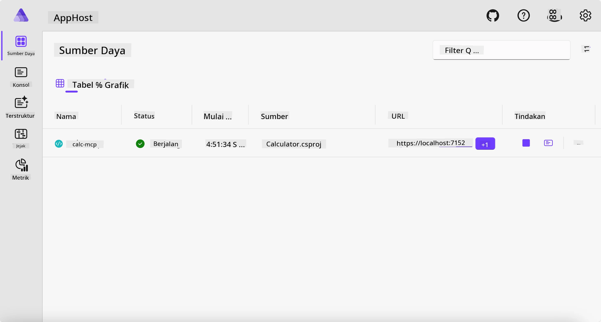
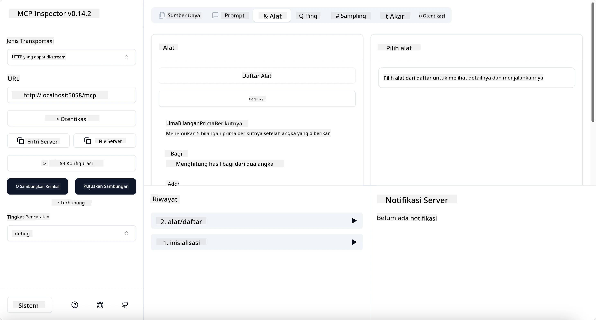
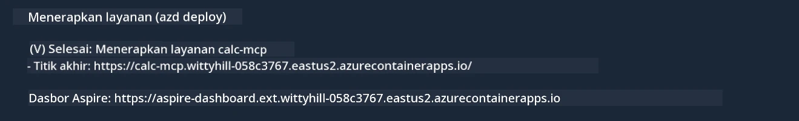

# Contoh

Contoh sebelumnya menunjukkan cara menggunakan proyek .NET lokal dengan tipe `stdio`. Dan cara menjalankan server secara lokal di dalam sebuah container. Ini adalah solusi yang baik dalam banyak situasi. Namun, terkadang berguna untuk menjalankan server secara remote, seperti di lingkungan cloud. Di sinilah tipe `http` digunakan.

Melihat solusi di folder `04-PracticalImplementation`, mungkin terlihat jauh lebih kompleks daripada yang sebelumnya. Tapi sebenarnya tidak. Jika Anda lihat dengan seksama proyek `src/Calculator`, Anda akan melihat bahwa kode yang ada hampir sama dengan contoh sebelumnya. Satu-satunya perbedaan adalah kami menggunakan pustaka yang berbeda `ModelContextProtocol.AspNetCore` untuk menangani permintaan HTTP. Dan kami mengubah metode `IsPrime` menjadi private, hanya untuk menunjukkan bahwa Anda bisa memiliki metode private dalam kode Anda. Sisanya sama seperti sebelumnya.

Proyek lainnya berasal dari [Aspire](https://aspire.dev/get-started/what-is-aspire/). Memiliki Aspire dalam solusi akan meningkatkan pengalaman developer selama pengembangan dan pengujian serta membantu dalam observabilitas. Ini tidak wajib untuk menjalankan server, tetapi merupakan praktik yang baik untuk memilikinya di solusi Anda.

## Mulai server secara lokal

1. Dari VS Code (dengan ekstensi C# DevKit), navigasi ke direktori `04-PracticalImplementation/samples/csharp`.
1. Jalankan perintah berikut untuk memulai server:

   ```bash
    dotnet watch run --project ./src/AppHost
   ```

1. Saat browser web membuka dashboard Aspire, perhatikan URL `http`-nya. Seharusnya seperti `http://localhost:5058/`.

   

## Uji Streamable HTTP dengan MCP Inspector

Jika Anda memiliki Node.js versi 22.7.5 ke atas, Anda dapat menggunakan MCP Inspector untuk menguji server Anda.

Mulai server dan jalankan perintah berikut di terminal:

```bash
npx @modelcontextprotocol/inspector http://localhost:5058
```



- Pilih `Streamable HTTP` sebagai tipe Transport.
- Di kolom Url, masukkan URL server yang dicatat sebelumnya, dan tambahkan `/mcp`. Harus menggunakan `http` (bukan `https`) seperti `http://localhost:5058/mcp`.
- tekan tombol Connect.

Hal yang baik tentang Inspector adalah memberikan visibilitas yang bagus tentang apa yang sedang terjadi.

- Cobalah untuk melihat daftar tools yang tersedia
- Cobalah beberapa di antaranya, seharusnya berfungsi seperti sebelumnya.

## Uji MCP Server dengan GitHub Copilot Chat di VS Code

Untuk menggunakan transport Streamable HTTP dengan GitHub Copilot Chat, ubah konfigurasi server `calc-mcp` yang dibuat sebelumnya menjadi seperti ini:

```jsonc
// .vscode/mcp.json
{
  "servers": {
    "calc-mcp": {
      "type": "http",
      "url": "http://localhost:5058/mcp"
    }
  }
}
```

Lakukan beberapa pengujian:

- Minta "3 bilangan prima setelah 6780". Lihat bagaimana Copilot akan menggunakan tools baru `NextFivePrimeNumbers` dan hanya mengembalikan 3 bilangan prima pertama.
- Minta "7 bilangan prima setelah 111", untuk melihat apa yang terjadi.
- Minta "John memiliki 24 permen dan ingin membagikannya ke 3 anaknya. Berapa permen yang diterima setiap anak?", untuk melihat apa yang terjadi.

## Deploy server ke Azure

Mari deploy server ke Azure agar lebih banyak orang dapat menggunakannya.

Dari terminal, masuk ke folder `04-PracticalImplementation/samples/csharp` dan jalankan perintah berikut:

```bash
azd up
```

Setelah deployment selesai, Anda harus melihat pesan seperti ini:



Salin URL dan gunakan di MCP Inspector serta di GitHub Copilot Chat.

```jsonc
// .vscode/mcp.json
{
  "servers": {
    "calc-mcp": {
      "type": "http",
      "url": "https://calc-mcp.gentleriver-3977fbcf.australiaeast.azurecontainerapps.io/mcp"
    }
  }
}
```

## Apa berikutnya?

Kita mencoba berbagai tipe transport dan alat pengujian. Kita juga mendeploy server MCP Anda ke Azure. Tapi bagaimana jika server kita perlu mengakses sumber daya privat? Misalnya, sebuah database atau API privat? Di bab berikutnya, kita akan melihat bagaimana kita bisa meningkatkan keamanan server kita.

---

<!-- CO-OP TRANSLATOR DISCLAIMER START -->
**Penafian**:
Dokumen ini telah diterjemahkan menggunakan layanan terjemahan AI [Co-op Translator](https://github.com/Azure/co-op-translator). Meskipun kami berupaya untuk mencapai akurasi, harap diketahui bahwa terjemahan otomatis mungkin mengandung kesalahan atau ketidakakuratan. Dokumen asli dalam bahasa aslinya harus dianggap sebagai sumber yang sah. Untuk informasi penting, disarankan menggunakan terjemahan profesional oleh manusia. Kami tidak bertanggung jawab atas kesalahpahaman atau penafsiran yang keliru yang timbul dari penggunaan terjemahan ini.
<!-- CO-OP TRANSLATOR DISCLAIMER END -->