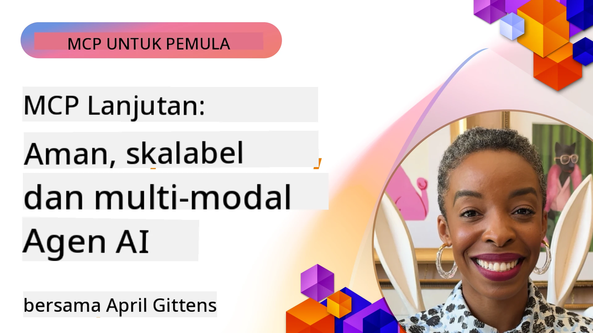

# Topik Lanjutan dalam MCP

_(Klik gambar di atas untuk melihat video pelajaran ini)_

Bab ini membahas serangkaian topik lanjutan dalam implementasi Model Context Protocol (MCP), termasuk integrasi multi-modal, skalabilitas, praktik terbaik keamanan, dan integrasi enterprise. Topik-topik ini sangat penting untuk membangun aplikasi MCP yang kuat dan siap produksi yang dapat memenuhi tuntutan sistem AI modern.

## Ikhtisar

Pelajaran ini mengeksplorasi konsep-konsep lanjutan dalam implementasi Model Context Protocol, dengan fokus pada integrasi multi-modal, skalabilitas, praktik terbaik keamanan, dan integrasi enterprise. Topik-topik ini sangat penting untuk membangun aplikasi MCP kelas produksi yang dapat menangani kebutuhan kompleks di lingkungan enterprise.

> **Catatan spesifikasi saat ini:** MCP `2026-07-28` menghentikan dukungan primitives Roots dan
> Sampling yang dibahas pada pelajaran 5.4 dan 5.6. Ini juga memindahkan
> fitur Tasks eksperimental yang dirujuk dalam Fitur Protokol (5.16) ke
> ekstensi Tasks khusus. Pelajaran-pelajaran tersebut tetap dipertahankan untuk implementasi `2025-11-25`
> legacy dan termasuk panduan migrasi. Lihat
> [Apa yang Berubah dalam MCP: Spesifikasi 2026-07-28](../01-CoreConcepts/mcp-2026-07-28.md).

## Tujuan Pembelajaran

Pada akhir pelajaran ini, Anda akan bisa:

- Menerapkan kemampuan multi-modal dalam kerangka kerja MCP
- Merancang arsitektur MCP yang skalabel untuk skenario permintaan tinggi
- Menerapkan praktik terbaik keamanan sesuai prinsip keamanan MCP
- Mengintegrasikan MCP dengan sistem dan kerangka kerja AI enterprise
- Mengoptimalkan kinerja dan keandalan di lingkungan produksi

## Pelajaran dan Proyek contoh

| Tautan | Judul | Deskripsi |
|------|-------|-------------|
| [5.1 Integrasi dengan Azure](./mcp-integration/README.md) | Integrasi dengan Azure | Pelajari cara mengintegrasikan MCP Server Anda di Azure |
| [5.2 Contoh Multi Modal](./mcp-multi-modality/README.md) | Contoh MCP Multi modal | Contoh untuk respons audio, gambar, dan multi modal |
| [5.3 Contoh MCP OAuth2](../../../05-AdvancedTopics/mcp-oauth2-demo) | Demo MCP OAuth2 | Aplikasi Spring Boot minimal yang menunjukkan OAuth2 dengan MCP, baik sebagai Authorization maupun Resource Server. Menunjukkan penerbitan token aman, endpoint terlindungi, deployment Azure Container Apps, dan integrasi Pengelolaan API. |
| [5.4 Root Contexts](./mcp-root-contexts/README.md) | Root contexts | Pelajari primitive Roots legacy `2025-11-25` dan opsi migrasi saat ini (tidak digunakan lagi di `2026-07-28`) |
| [5.5 Routing](./mcp-routing/README.md) | Routing | Pelajari berbagai jenis routing |
| [5.6 Sampling](./mcp-sampling/README.md) | Sampling | Pelajari primitive Sampling legacy `2025-11-25` dan opsi migrasi saat ini (tidak digunakan lagi di `2026-07-28`) |
| [5.7 Scaling](./mcp-scaling/README.md) | Scaling | Pelajari tentang scaling |
| [5.8 Security](./mcp-security/README.md) | Keamanan | Amankan MCP Server Anda |
| [5.9 Web Search sample](./web-search-mcp/README.md) | Web Search MCP | Server MCP Python dan klien yang terintegrasi dengan SerpAPI untuk pencarian web, berita, produk, dan tanya jawab secara real-time. Menunjukkan orkestrasi multi-alat, integrasi API eksternal, dan penanganan error yang andal. |
| [5.10 Realtime Streaming](./mcp-realtimestreaming/README.md) | Streaming | Streaming data real-time telah menjadi esensial di dunia yang digerakkan oleh data saat ini, di mana bisnis dan aplikasi memerlukan akses instan ke informasi untuk membuat keputusan tepat waktu.|
| [5.11 Realtime Web Search](./mcp-realtimesearch/README.md) | Web Search | Pencarian web real-time bagaimana MCP mengubah pencarian web real-time dengan menyediakan pendekatan standar untuk manajemen konteks di seluruh model AI, mesin pencari, dan aplikasi.| 
| [5.12 Otentikasi Entra ID untuk Server Model Context Protocol](./mcp-security-entra/README.md) | Otentikasi Entra ID | Microsoft Entra ID menyediakan solusi manajemen identitas dan akses berbasis cloud yang kuat, membantu memastikan hanya pengguna dan aplikasi yang berwenang yang dapat berinteraksi dengan server MCP Anda.|
| [5.13 Integrasi Agen Microsoft Foundry](./mcp-foundry-agent-integration/README.md) | Integrasi Microsoft Foundry | Pelajari cara mengintegrasikan server Model Context Protocol dengan agen Microsoft Foundry, memungkinkan orkestrasi alat yang kuat dan kapabilitas AI enterprise dengan koneksi sumber data eksternal yang terstandarisasi.|
| [5.14 Rekayasa Konteks](./mcp-contextengineering/README.md) | Rekayasa Konteks | Peluang masa depan dari teknik rekayasa konteks untuk server MCP, termasuk optimasi konteks, manajemen konteks dinamis, dan strategi rekayasa prompt yang efektif dalam kerangka MCP.|
| [5.15 Transportasi Kustom MCP](./mcp-transport/README.md) | Transportasi Kustom | Pelajari cara mengimplementasikan mekanisme transportasi kustom untuk skenario komunikasi MCP khusus.|
| [5.16 Pendalaman Fitur Protokol](./mcp-protocol-features/README.md) | Fitur Protokol | Kuasai fitur protokol lanjutan termasuk notifikasi kemajuan, pembatalan permintaan, template sumber daya, dan pola penanganan error.|
| [5.17 Penalaran Multi-Agen Adversarial](./mcp-adversarial-agents/README.md) | Agen Adversarial | Gunakan dua agen dengan posisi berlawanan, berbagi satu set alat MCP, untuk menangkap halusinasi, menampilkan kasus tepi, dan menghasilkan output yang lebih terkalibrasi melalui debat terstruktur.|

> **Catatan historis `2025-11-25`:** revisi tersebut memperkenalkan Tasks eksperimental
> dan memperluas beberapa fitur protokol. Pada `2026-07-28`, Tasks dipindahkan ke
> ekstensi resmi dan Roots menjadi tidak digunakan lagi. Jangan gunakan status fitur
> `2025-11-25` sebagai panduan saat ini; lihat
> [daftar perubahan 2026-07-28](https://modelcontextprotocol.io/specification/2026-07-28/changelog).

## Referensi Tambahan

Untuk informasi terbaru tentang topik MCP lanjutan, lihat:
- [Dokumentasi MCP](https://modelcontextprotocol.io/)
- [Spesifikasi MCP (2026-07-28)](https://modelcontextprotocol.io/specification/2026-07-28/)
- [Repositori GitHub](https://github.com/modelcontextprotocol)
- [OWASP MCP Top 10](https://microsoft.github.io/mcp-azure-security-guide/mcp/) - Risiko keamanan dan mitigasi
- [Workshop MCP Security Summit (Sherpa)](https://azure-samples.github.io/sherpa/) - Pelatihan keamanan praktis

## Poin Penting

- Implementasi MCP multi-modal memperluas kapabilitas AI di luar pemrosesan teks
- Skalabilitas sangat penting untuk penerapan enterprise dan dapat diatasi melalui scaling horizontal dan vertikal
- Langkah-langkah keamanan menyeluruh melindungi data dan memastikan kontrol akses yang tepat
- Integrasi enterprise dengan platform seperti Azure OpenAI dan Microsoft AI Foundry meningkatkan kapabilitas MCP
- Implementasi MCP lanjutan mendapat manfaat dari arsitektur yang dioptimalkan dan manajemen sumber daya yang cermat

## Latihan

Rancang implementasi MCP tingkat enterprise untuk kasus penggunaan tertentu:

1. Identifikasi kebutuhan multi-modal untuk kasus penggunaan Anda
2. Gambarkan kontrol keamanan yang dibutuhkan untuk melindungi data sensitif
3. Rancang arsitektur skalabel yang dapat menangani beban yang bervariasi
4. Rencanakan titik integrasi dengan sistem AI enterprise
5. Dokumentasikan potensi hambatan kinerja dan strategi mitigasi

## Sumber Daya Tambahan

- [Dokumentasi Azure OpenAI](https://learn.microsoft.com/en-us/azure/ai-services/openai/)
- [Dokumentasi Microsoft AI Foundry](https://learn.microsoft.com/en-us/ai-services/)

---

## Selanjutnya

Jelajahi pelajaran dalam modul ini mulai dari: [5.1 Integrasi MCP](./mcp-integration/README.md)

Setelah selesai modul ini, lanjutkan ke: [Modul 6: Kontribusi Komunitas](../06-CommunityContributions/README.md)

---

<!-- CO-OP TRANSLATOR DISCLAIMER START -->
**Penafian**:
Dokumen ini telah diterjemahkan menggunakan layanan terjemahan AI [Co-op Translator](https://github.com/Azure/co-op-translator). Meskipun kami berupaya untuk mencapai akurasi, harap diketahui bahwa terjemahan otomatis mungkin mengandung kesalahan atau ketidakakuratan. Dokumen asli dalam bahasa aslinya harus dianggap sebagai sumber yang sah. Untuk informasi penting, disarankan menggunakan terjemahan profesional oleh manusia. Kami tidak bertanggung jawab atas kesalahpahaman atau penafsiran yang keliru yang timbul dari penggunaan terjemahan ini.
<!-- CO-OP TRANSLATOR DISCLAIMER END -->