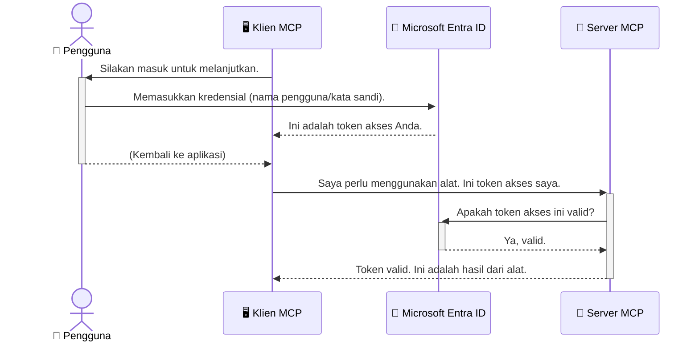

# Mengamankan Alur Kerja AI: Otentikasi Entra ID untuk Server Protokol Konteks Model

> [!NOTE]
> Kode server jarak jauh dalam pelajaran ini melindungi endpoint warisan `/sse` dan `/message`
> dan menargetkan MCP `2025-11-25`. Pertahankan praktik validasi identitas dan token-nya,
> tetapi gunakan transport HTTP Streamable yang kompatibel dengan `2026-07-28` untuk
> implementasi baru.

## Pendahuluan
Mengamankan server Protokol Konteks Model (MCP) Anda sama pentingnya dengan mengunci pintu depan rumah Anda. Membiarkan server MCP Anda terbuka mengekspos alat dan data Anda ke akses yang tidak sah, yang dapat menyebabkan pelanggaran keamanan. Microsoft Entra ID menyediakan solusi manajemen identitas dan akses berbasis cloud yang kuat, membantu memastikan bahwa hanya pengguna dan aplikasi yang berwenang yang dapat berinteraksi dengan server MCP Anda. Pada bagian ini, Anda akan belajar cara melindungi alur kerja AI Anda menggunakan otentikasi Entra ID.

## Tujuan Pembelajaran
Pada akhir bagian ini, Anda akan mampu:

- Memahami pentingnya mengamankan server MCP.
- Menjelaskan dasar-dasar Microsoft Entra ID dan otentikasi OAuth 2.0.
- Mengenali perbedaan antara klien publik dan rahasia.
- Menerapkan otentikasi Entra ID dalam skenario server MCP lokal (klien publik) dan jarak jauh (klien rahasia).
- Menerapkan praktik keamanan terbaik saat mengembangkan alur kerja AI.

## Keamanan dan MCP

Sama seperti Anda tidak membiarkan pintu depan rumah Anda tidak terkunci, Anda tidak boleh membiarkan server MCP Anda terbuka untuk diakses siapa saja. Mengamankan alur kerja AI Anda sangat penting untuk membangun aplikasi yang kuat, dapat dipercaya, dan aman. Bab ini akan memperkenalkan Anda pada penggunaan Microsoft Entra ID untuk mengamankan server MCP Anda, memastikan bahwa hanya pengguna dan aplikasi yang berwenang yang dapat berinteraksi dengan alat dan data Anda.

## Mengapa Keamanan Penting untuk Server MCP

Bayangkan server MCP Anda memiliki alat yang dapat mengirim email atau mengakses database pelanggan. Server yang tidak aman berarti siapa saja berpotensi dapat menggunakan alat itu, yang mengarah pada akses data yang tidak sah, spam, atau aktivitas berbahaya lainnya.

Dengan menerapkan otentikasi, Anda memastikan bahwa setiap permintaan ke server Anda diverifikasi, memastikan identitas pengguna atau aplikasi yang membuat permintaan. Ini adalah langkah pertama dan paling penting dalam mengamankan alur kerja AI Anda.

## Pengenalan Microsoft Entra ID

[**Microsoft Entra ID**](https://adoption.microsoft.com/microsoft-security/entra/) adalah layanan manajemen identitas dan akses berbasis cloud. Anggap saja sebagai penjaga keamanan universal untuk aplikasi Anda. Ia menangani proses kompleks dalam memverifikasi identitas pengguna (otentikasi) dan menentukan apa yang diperbolehkan untuk mereka lakukan (otorisasi).

Dengan menggunakan Entra ID, Anda dapat:

- Mengaktifkan masuk aman untuk pengguna.
- Melindungi API dan layanan.
- Mengelola kebijakan akses dari satu lokasi pusat.

Untuk server MCP, Entra ID menyediakan solusi yang kuat dan terpercaya luas untuk mengelola siapa yang dapat mengakses kemampuan server Anda.

---

## Memahami Keajaiban: Cara Kerja Otentikasi Entra ID

Entra ID menggunakan standar terbuka seperti **OAuth 2.0** untuk menangani otentikasi. Meskipun rinciannya bisa kompleks, konsep inti sederhana dan dapat dipahami dengan analogi.

### Pengenalan Lembut ke OAuth 2.0: Kunci Juru Parkir

Anggaplah OAuth 2.0 seperti layanan juru parkir untuk mobil Anda. Saat Anda tiba di restoran, Anda tidak memberikan kunci utama kepada juru parkir. Sebaliknya, Anda memberikan **kunci juru parkir** yang memiliki izin terbatas—itu dapat menyalakan mobil dan mengunci pintu, tetapi tidak dapat membuka bagasi atau kompartemen sarung tangan.

Dalam analogi ini:

- **Anda** adalah **Pengguna**.
- **Mobil Anda** adalah **Server MCP** dengan alat dan data berharga.
- **Juru Parkir** adalah **Microsoft Entra ID**.
- **Petugas Parkir** adalah **Klien MCP** (aplikasi yang mencoba mengakses server).
- **Kunci Juru Parkir** adalah **Access Token**.

Token akses adalah string teks aman yang diterima klien MCP dari Entra ID setelah Anda masuk. Klien kemudian menyajikan token ini ke server MCP dengan setiap permintaan. Server dapat memverifikasi token untuk memastikan permintaan sah dan bahwa klien memiliki izin yang diperlukan, tanpa perlu menangani kredensial Anda (seperti kata sandi).

### Alur Otentikasi

Berikut cara kerja proses dalam praktik:



### Memperkenalkan Microsoft Authentication Library (MSAL)

Sebelum kita masuk ke kode, penting untuk memperkenalkan komponen utama yang akan Anda lihat dalam contoh: **Microsoft Authentication Library (MSAL)**.

MSAL adalah perpustakaan yang dikembangkan oleh Microsoft yang mempermudah pengembang menangani otentikasi. Alih-alih Anda menulis semua kode kompleks untuk menangani token keamanan, mengelola masuk, dan menyegarkan sesi, MSAL mengurus semua itu.

Menggunakan perpustakaan seperti MSAL sangat disarankan karena:

- **Aman:** Mengimplementasikan protokol standar industri dan praktik keamanan terbaik, mengurangi risiko kerentanan kode.
- **Menyederhanakan Pengembangan:** Mengabstraksi kompleksitas protokol OAuth 2.0 dan OpenID Connect, memungkinkan Anda menambahkan otentikasi yang kuat dengan beberapa baris kode saja.
- **Terpelihara:** Microsoft secara aktif memelihara dan memperbarui MSAL untuk menangani ancaman keamanan baru dan perubahan platform.

MSAL mendukung berbagai bahasa dan kerangka aplikasi, termasuk .NET, JavaScript/TypeScript, Python, Java, Go, dan platform mobile seperti iOS dan Android. Ini berarti Anda dapat menggunakan pola otentikasi yang konsisten di seluruh tumpukan teknologi Anda.

Untuk mempelajari lebih lanjut tentang MSAL, Anda dapat melihat dokumentasi resmi [gambaran umum MSAL](https://learn.microsoft.com/entra/identity-platform/msal-overview).

---

## Mengamankan Server MCP Anda dengan Entra ID: Panduan Langkah demi Langkah

Sekarang, mari kita bahas cara mengamankan server MCP lokal (yang berkomunikasi melalui `stdio`) menggunakan Entra ID. Contoh ini menggunakan **klien publik**, yang cocok untuk aplikasi yang berjalan di mesin pengguna, seperti aplikasi desktop atau server pengembangan lokal.

### Skenario 1: Mengamankan Server MCP Lokal (dengan Klien Publik)

Dalam skenario ini, kita melihat server MCP yang berjalan secara lokal, berkomunikasi melalui `stdio`, dan menggunakan Entra ID untuk mengautentikasi pengguna sebelum memberikan akses ke alatnya. Server akan memiliki satu alat yang mengambil informasi profil pengguna dari Microsoft Graph API.

#### 1. Menyiapkan Aplikasi di Entra ID

Sebelum menulis kode apa pun, Anda perlu mendaftarkan aplikasi Anda di Microsoft Entra ID. Ini memberi tahu Entra ID tentang aplikasi Anda dan memberikan izin untuk menggunakan layanan otentikasi.

1. Navigasikan ke **[portal Microsoft Entra](https://entra.microsoft.com/)**.
2. Pergi ke **App registrations** dan klik **New registration**.
3. Beri nama aplikasi Anda (misalnya, "My Local MCP Server").
4. Untuk **Supported account types**, pilih **Accounts in this organizational directory only**.
5. Anda bisa membiarkan **Redirect URI** kosong untuk contoh ini.
6. Klik **Register**.

Setelah terdaftar, catat **Application (client) ID** dan **Directory (tenant) ID**. Anda akan membutuhkannya dalam kode Anda.

#### 2. Kode: Penjelasan

Mari kita lihat bagian utama kode yang menangani otentikasi. Kode lengkap untuk contoh ini tersedia di folder [Entra ID - Local - WAM](https://github.com/Azure-Samples/mcp-auth-servers/tree/main/src/entra-id-local-wam) dari repositori [mcp-auth-servers GitHub](https://github.com/Azure-Samples/mcp-auth-servers).

**`AuthenticationService.cs`**

Kelas ini bertanggung jawab menangani interaksi dengan Entra ID.

- **`CreateAsync`**: Metode ini menginisialisasi `PublicClientApplication` dari MSAL (Microsoft Authentication Library). Dikostumisasi dengan `clientId` dan `tenantId` aplikasi Anda.
- **`WithBroker`**: Mengaktifkan penggunaan broker (seperti Windows Web Account Manager), yang menyediakan pengalaman single sign-on yang lebih aman dan mulus.
- **`AcquireTokenAsync`**: Metode inti. Pertama mencoba mendapatkan token secara diam-diam (jika pengguna sudah memiliki sesi valid, tidak perlu masuk lagi). Jika token diam-diam tidak tersedia, akan meminta pengguna masuk secara interaktif.

```csharp
// Simplified for clarity
public static async Task<AuthenticationService> CreateAsync(ILogger<AuthenticationService> logger)
{
    var msalClient = PublicClientApplicationBuilder
        .Create(_clientId) // Your Application (client) ID
        .WithAuthority(AadAuthorityAudience.AzureAdMyOrg)
        .WithTenantId(_tenantId) // Your Directory (tenant) ID
        .WithBroker(new BrokerOptions(BrokerOptions.OperatingSystems.Windows))
        .Build();

    // ... cache registration ...

    return new AuthenticationService(logger, msalClient);
}

public async Task<string> AcquireTokenAsync()
{
    try
    {
        // Try silent authentication first
        var accounts = await _msalClient.GetAccountsAsync();
        var account = accounts.FirstOrDefault();

        AuthenticationResult? result = null;

        if (account != null)
        {
            result = await _msalClient.AcquireTokenSilent(_scopes, account).ExecuteAsync();
        }
        else
        {
            // If no account, or silent fails, go interactive
            result = await _msalClient.AcquireTokenInteractive(_scopes).ExecuteAsync();
        }

        return result.AccessToken;
    }
    catch (Exception ex)
    {
        _logger.LogError(ex, "An error occurred while acquiring the token.");
        throw; // Optionally rethrow the exception for higher-level handling
    }
}
```

**`Program.cs`**

Di sinilah server MCP disiapkan dan layanan otentikasi diintegrasikan.

- **`AddSingleton<AuthenticationService>`**: Mendaftarkan `AuthenticationService` ke dalam kontainer injeksi ketergantungan, sehingga bisa digunakan oleh bagian lain aplikasi (seperti alat kita).
- **`GetUserDetailsFromGraph` tool**: Alat ini membutuhkan instance `AuthenticationService`. Sebelum melakukan apa pun, memanggil `authService.AcquireTokenAsync()` untuk mendapatkan token akses yang valid. Jika otentikasi berhasil, token digunakan untuk memanggil Microsoft Graph API dan mengambil detail pengguna.

```csharp
// Simplified for clarity
[McpServerTool(Name = "GetUserDetailsFromGraph")]
public static async Task<string> GetUserDetailsFromGraph(
    AuthenticationService authService)
{
    try
    {
        // This will trigger the authentication flow
        var accessToken = await authService.AcquireTokenAsync();

        // Use the token to create a GraphServiceClient
        var graphClient = new GraphServiceClient(
            new BaseBearerTokenAuthenticationProvider(new TokenProvider(authService)));

        var user = await graphClient.Me.GetAsync();

        return System.Text.Json.JsonSerializer.Serialize(user);
    }
    catch (Exception ex)
    {
        return $"Error: {ex.Message}";
    }
}
```

#### 3. Bagaimana Semua Bekerja Bersama

1. Ketika klien MCP mencoba menggunakan alat `GetUserDetailsFromGraph`, alat tersebut pertama kali memanggil `AcquireTokenAsync`.
2. `AcquireTokenAsync` memicu pustaka MSAL untuk memeriksa token yang valid.
3. Jika tidak ada token ditemukan, MSAL melalui broker akan meminta pengguna masuk dengan akun Entra ID mereka.
4. Setelah pengguna masuk, Entra ID mengeluarkan token akses.
5. Alat menerima token dan menggunakannya untuk melakukan panggilan aman ke Microsoft Graph API.
6. Detail pengguna dikembalikan ke klien MCP.

Proses ini memastikan bahwa hanya pengguna yang terautentikasi yang dapat menggunakan alat tersebut, secara efektif mengamankan server MCP lokal Anda.

### Skenario 2: Mengamankan Server MCP Jarak Jauh (dengan Klien Rahasia)

Ketika server MCP Anda berjalan pada mesin jarak jauh (seperti server cloud) dan berkomunikasi melalui protokol seperti HTTP Streaming, persyaratan keamanannya berbeda. Dalam kasus ini, Anda harus menggunakan **klien rahasia** dan **Authorization Code Flow**. Ini adalah metode yang lebih aman karena rahasia aplikasi tidak pernah terekspos ke browser.

Contoh ini menggunakan server MCP berbasis TypeScript yang menggunakan Express.js untuk menangani permintaan HTTP.

#### 1. Menyiapkan Aplikasi di Entra ID

Penyiapannya mirip dengan klien publik, tetapi dengan satu perbedaan penting: Anda perlu membuat **client secret**.

1. Navigasikan ke **[portal Microsoft Entra](https://entra.microsoft.com/)**.
2. Di pendaftaran aplikasi Anda, buka tab **Certificates & secrets**.
3. Klik **New client secret**, berikan deskripsi, dan klik **Add**.
4. **Penting:** Salin nilai rahasia tersebut segera. Anda tidak akan dapat melihatnya lagi.
5. Anda juga perlu mengkonfigurasi **Redirect URI**. Pergi ke tab **Authentication**, klik **Add a platform**, pilih **Web**, dan masukkan URI pengalihan aplikasi Anda (misal, `http://localhost:3001/auth/callback`).

> **⚠️ Catatan Keamanan Penting:** Untuk aplikasi produksi, Microsoft sangat menyarankan menggunakan metode otentikasi tanpa rahasia seperti **Managed Identity** atau **Workload Identity Federation** daripada client secret. Client secret berisiko karena dapat terekspos atau disusupi. Managed identity menawarkan pendekatan lebih aman dengan menghilangkan kebutuhan menyimpan kredensial dalam kode atau konfigurasi Anda.
>
> Untuk informasi lebih lanjut tentang managed identities dan cara mengimplementasikannya, lihat [Gambaran Managed identities untuk sumber daya Azure](https://learn.microsoft.com/entra/identity/managed-identities-azure-resources/overview).

#### 2. Kode: Penjelasan

Contoh ini menggunakan pendekatan berbasis sesi. Ketika pengguna mengotentikasi, server menyimpan token akses dan token penyegaran dalam sesi dan memberikan token sesi ke pengguna. Token sesi ini kemudian digunakan untuk permintaan berikutnya. Kode lengkap untuk contoh ini tersedia di folder [Entra ID - Confidential client](https://github.com/Azure-Samples/mcp-auth-servers/tree/main/src/entra-id-cca-session) dari repositori [mcp-auth-servers GitHub](https://github.com/Azure-Samples/mcp-auth-servers).

**`Server.ts`**

File ini mengatur server Express dan lapisan transport MCP.

- **`requireBearerAuth`**: Ini adalah middleware yang melindungi endpoint `/sse` dan `/message`. Memeriksa token bearer yang valid pada header `Authorization` dalam permintaan.
- **`EntraIdServerAuthProvider`**: Ini adalah kelas kustom yang mengimplementasikan interface `McpServerAuthorizationProvider`. Bertanggung jawab menangani alur OAuth 2.0.
- **`/auth/callback`**: Endpoint ini menangani pengalihan dari Entra ID setelah pengguna mengautentikasi. Menukar authorization code untuk token akses dan token penyegaran.

```typescript
// Disederhanakan untuk kejelasan
const app = express();
const { server } = createServer();
const provider = new EntraIdServerAuthProvider();

// Lindungi endpoint SSE
app.get("/sse", requireBearerAuth({
  provider,
  requiredScopes: ["User.Read"]
}), async (req, res) => {
  // ... sambungkan ke transportasi ...
});

// Lindungi endpoint pesan
app.post("/message", requireBearerAuth({
  provider,
  requiredScopes: ["User.Read"]
}), async (req, res) => {
  // ... tangani pesan ...
});

// Tangani callback OAuth 2.0
app.get("/auth/callback", (req, res) => {
  provider.handleCallback(req.query.code, req.query.state)
    .then(result => {
      // ... tangani keberhasilan atau kegagalan ...
    });
});
```

**`Tools.ts`**

File ini mendefinisikan alat yang disediakan server MCP. Alat `getUserDetails` serupa dengan contoh sebelumnya, tetapi mengambil token akses dari sesi.

```typescript
// Disederhanakan untuk kejelasan
server.setRequestHandler(CallToolRequestSchema, async (request) => {
  const { name } = request.params;
  const context = request.params?.context as { token?: string } | undefined;
  const sessionToken = context?.token;

  if (name === ToolName.GET_USER_DETAILS) {
    if (!sessionToken) {
      throw new AuthenticationError("Authentication token is missing or invalid. Ensure the token is provided in the request context.");
    }

    // Dapatkan token Entra ID dari penyimpanan sesi
    const tokenData = tokenStore.getToken(sessionToken);
    const entraIdToken = tokenData.accessToken;

    const graphClient = Client.init({
      authProvider: (done) => {
        done(null, entraIdToken);
      }
    });

    const user = await graphClient.api('/me').get();

    // ... kembalikan detail pengguna ...
  }
});
```

**`auth/EntraIdServerAuthProvider.ts`**

Kelas ini menangani logika untuk:

- Mengarahkan pengguna ke halaman masuk Entra ID.
- Menukar authorization code dengan token akses.
- Menyimpan token dalam `tokenStore`.
- Menyegarkan token akses saat kedaluwarsa.


#### 3. Bagaimana Semuanya Bekerja Bersama

1. Ketika pengguna pertama kali mencoba terhubung ke server MCP, middleware `requireBearerAuth` akan melihat bahwa mereka tidak memiliki sesi yang valid dan akan mengarahkan mereka ke halaman masuk Entra ID.
2. Pengguna masuk dengan akun Entra ID mereka.
3. Entra ID mengarahkan pengguna kembali ke endpoint `/auth/callback` dengan kode otorisasi.
4. Server menukar kode tersebut dengan token akses dan token penyegaran, menyimpannya, dan membuat token sesi yang dikirim ke klien.
5. Klien sekarang dapat menggunakan token sesi ini di header `Authorization` untuk semua permintaan berikutnya ke server MCP.
6. Ketika alat `getUserDetails` dipanggil, alat ini menggunakan token sesi untuk mencari token akses Entra ID dan kemudian menggunakannya untuk memanggil Microsoft Graph API.

Alur ini lebih kompleks daripada alur klien publik, tetapi diperlukan untuk endpoint yang dapat diakses dari internet. Karena server MCP jarak jauh dapat diakses melalui internet publik, mereka memerlukan langkah-langkah keamanan yang lebih kuat untuk melindungi dari akses tidak sah dan potensi serangan.


## Praktik Keamanan Terbaik

- **Selalu gunakan HTTPS**: Enkripsi komunikasi antara klien dan server untuk melindungi token agar tidak disadap.
- **Terapkan Kontrol Akses Berbasis Peran (RBAC)**: Jangan hanya memeriksa *apakah* pengguna terautentikasi; periksa *apa* yang mereka diizinkan lakukan. Anda dapat mendefinisikan peran di Entra ID dan memeriksanya di server MCP Anda.
- **Pantau dan audit**: Catat semua kejadian autentikasi sehingga Anda dapat mendeteksi dan merespons aktivitas mencurigakan.
- **Tangani pembatasan dan pengaturan laju**: Microsoft Graph dan API lainnya menerapkan pembatasan laju untuk mencegah penyalahgunaan. Terapkan exponential backoff dan logika coba ulang di server MCP Anda untuk menangani respons HTTP 429 (Terlalu Banyak Permintaan) dengan baik. Pertimbangkan untuk menyimpan data yang sering diakses agar mengurangi panggilan API.
- **Penyimpanan token yang aman**: Simpan token akses dan token penyegaran dengan aman. Untuk aplikasi lokal, gunakan mekanisme penyimpanan aman sistem. Untuk aplikasi server, pertimbangkan menggunakan penyimpanan terenkripsi atau layanan manajemen kunci aman seperti Azure Key Vault.
- **Penanganan masa berlaku token**: Token akses memiliki masa berlaku terbatas. Terapkan penyegaran token otomatis menggunakan token penyegaran untuk menjaga pengalaman pengguna yang lancar tanpa perlu masuk ulang.
- **Pertimbangkan menggunakan Azure API Management**: Meskipun menerapkan keamanan langsung di server MCP memberi Anda kontrol granular, API Gateway seperti Azure API Management dapat menangani banyak masalah keamanan ini secara otomatis, termasuk autentikasi, otorisasi, pembatasan laju, dan pemantauan. Mereka menyediakan lapisan keamanan terpusat yang berada di antara klien Anda dan server MCP Anda. Untuk detail lebih lanjut tentang penggunaan API Gateway dengan MCP, lihat [Azure API Management Your Auth Gateway For MCP Servers](https://techcommunity.microsoft.com/blog/integrationsonazureblog/azure-api-management-your-auth-gateway-for-mcp-servers/4402690).


## Hal Penting yang Perlu Diingat

- Mengamankan server MCP Anda sangat penting untuk melindungi data dan alat Anda.
- Microsoft Entra ID menyediakan solusi yang kuat dan skalabel untuk autentikasi dan otorisasi.
- Gunakan **klien publik** untuk aplikasi lokal dan **klien rahasia** untuk server jarak jauh.
- **Authorization Code Flow** adalah opsi yang paling aman untuk aplikasi web.


## Latihan

1. Pikirkan tentang server MCP yang mungkin Anda buat. Apakah itu server lokal atau server jarak jauh?
2. Berdasarkan jawaban Anda, apakah Anda akan menggunakan klien publik atau rahasia?
3. Izin apa yang akan diminta server MCP Anda untuk melakukan tindakan terhadap Microsoft Graph?


## Latihan Praktik

### Latihan 1: Daftarkan Aplikasi di Entra ID
Navigasikan ke portal Microsoft Entra.
Daftarkan aplikasi baru untuk server MCP Anda.
Catat ID Aplikasi (klien) dan ID Direktori (penyewa).

### Latihan 2: Amankan Server MCP Lokal (Klien Publik)
- Ikuti contoh kode untuk mengintegrasikan MSAL (Microsoft Authentication Library) untuk autentikasi pengguna.
- Uji alur autentikasi dengan memanggil alat MCP yang mengambil detail pengguna dari Microsoft Graph.

### Latihan 3: Amankan Server MCP Jarak Jauh (Klien Rahasia)
- Daftarkan klien rahasia di Entra ID dan buat rahasia klien.
- Konfigurasikan server MCP Express.js Anda untuk menggunakan Authorization Code Flow.
- Uji endpoint yang dilindungi dan pastikan akses berbasis token.

### Latihan 4: Terapkan Praktik Keamanan Terbaik
- Aktifkan HTTPS untuk server lokal atau jarak jauh Anda.
- Terapkan kontrol akses berbasis peran (RBAC) dalam logika server Anda.
- Tambahkan penanganan masa berlaku token dan penyimpanan token yang aman.

## Sumber Daya

1. **Dokumentasi Tinjauan MSAL**  
   Pelajari bagaimana Microsoft Authentication Library (MSAL) memungkinkan pengambilan token yang aman di berbagai platform:  
   [MSAL Overview on Microsoft Learn](https://learn.microsoft.com/en-gb/entra/msal/overview)

2. **Repositori GitHub Azure-Samples/mcp-auth-servers**  
   Implementasi referensi server MCP yang mendemonstrasikan alur autentikasi:  
   [Azure-Samples/mcp-auth-servers on GitHub](https://github.com/Azure-Samples/mcp-auth-servers)

3. **Tinjauan Identitas Terkelola untuk Sumber Daya Azure**  
   Pahami cara menghilangkan rahasia dengan menggunakan identitas terkelola yang ditugaskan sistem atau pengguna:  
   [Managed Identities Overview on Microsoft Learn](https://learn.microsoft.com/en-us/entra/identity/managed-identities-azure-resources/)

4. **Azure API Management: Gerbang Otentikasi Anda untuk Server MCP**  
   Penjelasan mendalam tentang penggunaan APIM sebagai gerbang OAuth2 yang aman untuk server MCP:  
   [Azure API Management Your Auth Gateway For MCP Servers](https://techcommunity.microsoft.com/blog/integrationsonazureblog/azure-api-management-your-auth-gateway-for-mcp-servers/4402690)

5. **Referensi Izin Microsoft Graph**  
   Daftar lengkap izin yang didelegasikan dan aplikasi untuk Microsoft Graph:  
   [Microsoft Graph Permissions Reference](https://learn.microsoft.com/zh-tw/graph/permissions-reference)


## Hasil Pembelajaran
Setelah menyelesaikan bagian ini, Anda akan dapat:

- Menjelaskan mengapa autentikasi sangat penting untuk server MCP dan alur kerja AI.
- Menyiapkan dan mengonfigurasi autentikasi Entra ID untuk skenario server MCP lokal dan jarak jauh.
- Memilih jenis klien yang sesuai (publik atau rahasia) berdasarkan penyebaran server Anda.
- Menerapkan praktik pengkodean aman, termasuk penyimpanan token dan otorisasi berbasis peran.
- Melindungi server MCP dan alat-alatnya dari akses tidak sah dengan percaya diri.

## Apa Selanjutnya

- [5.13 Protokol Konteks Model (MCP) Integrasi dengan Microsoft Foundry](../mcp-foundry-agent-integration/README.md)

---

<!-- CO-OP TRANSLATOR DISCLAIMER START -->
**Penafian**:
Dokumen ini telah diterjemahkan menggunakan layanan terjemahan AI [Co-op Translator](https://github.com/Azure/co-op-translator). Meskipun kami berupaya untuk mencapai akurasi, harap diketahui bahwa terjemahan otomatis mungkin mengandung kesalahan atau ketidakakuratan. Dokumen asli dalam bahasa aslinya harus dianggap sebagai sumber yang sah. Untuk informasi penting, disarankan menggunakan terjemahan profesional oleh manusia. Kami tidak bertanggung jawab atas kesalahpahaman atau penafsiran yang keliru yang timbul dari penggunaan terjemahan ini.
<!-- CO-OP TRANSLATOR DISCLAIMER END -->