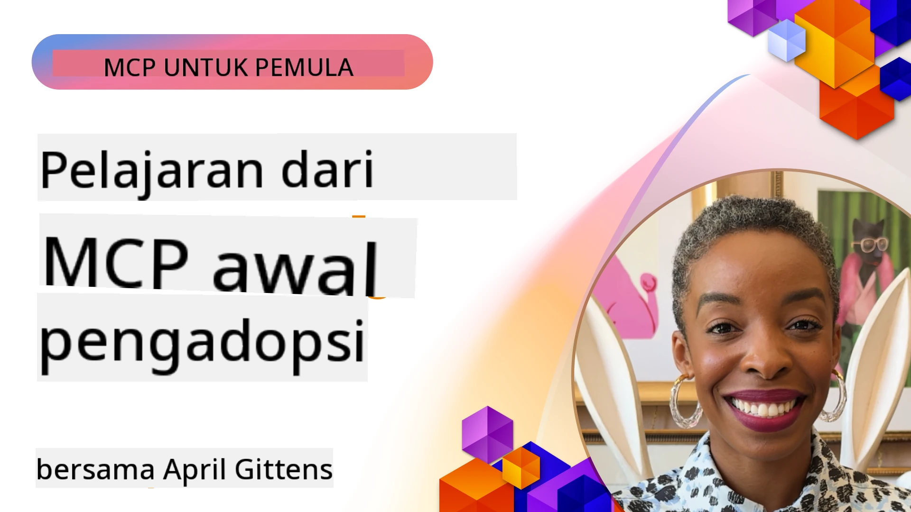

# 🌟 Pelajaran dari Pengadopsi Awal

[](https://youtu.be/jds7dSmNptE)

_(Klik gambar di atas untuk melihat video pelajaran ini)_

## 🎯 Apa yang Dicakup Modul Ini

Modul ini mengeksplorasi bagaimana organisasi dan pengembang nyata memanfaatkan Model Context Protocol (MCP) untuk memecahkan tantangan nyata dan mendorong inovasi. Melalui studi kasus mendetail, proyek praktis, dan contoh-contoh praktis, Anda akan menemukan bagaimana MCP memungkinkan integrasi AI yang aman, skalabel yang menghubungkan model bahasa, alat, dan data perusahaan.

### 📚 Lihat MCP dalam Aksi

Ingin melihat prinsip-prinsip ini diterapkan pada alat yang siap produksi? Lihat [**10 Server MCP Microsoft yang Mengubah Produktivitas Pengembang**](microsoft-mcp-servers.md), yang menampilkan server MCP Microsoft nyata yang bisa Anda gunakan hari ini.

## Ikhtisar

Pelajaran ini mengeksplorasi bagaimana pengadopsi awal telah memanfaatkan Model Context Protocol (MCP) untuk memecahkan tantangan dunia nyata dan mendorong inovasi di berbagai industri. Melalui studi kasus mendetail dan proyek praktis, Anda akan melihat bagaimana MCP memungkinkan integrasi AI yang standar, aman, dan skalabel—menghubungkan model bahasa besar, alat, dan data perusahaan dalam kerangka terpadu. Anda akan memperoleh pengalaman praktis merancang dan membangun solusi berbasis MCP, belajar dari pola implementasi yang telah terbukti, dan menemukan praktik terbaik untuk menerapkan MCP dalam lingkungan produksi. Pelajaran ini juga menyoroti tren baru, arah masa depan, dan sumber daya open-source untuk membantu Anda tetap berada di garis depan teknologi MCP dan ekosistemnya yang berkembang.

## Tujuan Pembelajaran

- Menganalisis implementasi MCP dunia nyata di berbagai industri
- Merancang dan membangun aplikasi lengkap berbasis MCP
- Menjelajahi tren baru dan arah masa depan dalam teknologi MCP
- Menerapkan praktik terbaik dalam skenario pengembangan aktual

## Implementasi MCP Dunia Nyata

### Studi Kasus 1: Otomatisasi Dukungan Pelanggan Perusahaan

Sebuah perusahaan multinasional menerapkan solusi berbasis MCP untuk menstandarisasi interaksi AI di seluruh sistem dukungan pelanggan mereka. Ini memungkinkan mereka untuk:

- Membuat antarmuka terpadu untuk berbagai penyedia LLM
- Mempertahankan pengelolaan prompt yang konsisten di seluruh departemen
- Menerapkan kontrol keamanan dan kepatuhan yang kuat
- Dengan mudah beralih antara model AI berbeda sesuai kebutuhan spesifik

**Implementasi Teknis:**

```python
# Implementasi server MCP Python untuk dukungan pelanggan
import logging
import asyncio
from modelcontextprotocol import create_server, ServerConfig
from modelcontextprotocol.server import MCPServer
from modelcontextprotocol.transports import create_http_transport
from modelcontextprotocol.resources import ResourceDefinition
from modelcontextprotocol.prompts import PromptDefinition
from modelcontextprotocol.tool import ToolDefinition

# Konfigurasikan logging
logging.basicConfig(level=logging.INFO)

async def main():
    # Buat konfigurasi server
    config = ServerConfig(
        name="Enterprise Customer Support Server",
        version="1.0.0",
        description="MCP server for handling customer support inquiries"
    )
    
    # Inisialisasi server MCP
    server = create_server(config)
    
    # Daftarkan sumber daya basis pengetahuan
    server.resources.register(
        ResourceDefinition(
            name="customer_kb",
            description="Customer knowledge base documentation"
        ),
        lambda params: get_customer_documentation(params)
    )
    
    # Daftarkan template prompt
    server.prompts.register(
        PromptDefinition(
            name="support_template",
            description="Templates for customer support responses"
        ),
        lambda params: get_support_templates(params)
    )
    
    # Daftarkan alat dukungan
    server.tools.register(
        ToolDefinition(
            name="ticketing",
            description="Create and update support tickets"
        ),
        handle_ticketing_operations
    )
    
    # Mulai server dengan transport HTTP
    transport = create_http_transport(port=8080)
    await server.run(transport)

if __name__ == "__main__":
    asyncio.run(main())
```

**Hasil:** Pengurangan biaya model sebesar 30%, peningkatan konsistensi respon sebesar 45%, dan kepatuhan yang lebih baik di seluruh operasi global.

### Studi Kasus 2: Asisten Diagnostik Kesehatan

Penyedia layanan kesehatan mengembangkan infrastruktur MCP untuk mengintegrasikan beberapa model AI medis khusus sambil menjaga data pasien sensitif tetap terlindungi:

- Beralih mulus antara model medis generalis dan spesialis
- Kontrol privasi ketat dan jejak audit
- Integrasi dengan sistem Rekam Medis Elektronik (EHR) yang ada
- Teknik prompt yang konsisten untuk terminologi medis

**Implementasi Teknis:**

```csharp
// C# MCP host application implementation in healthcare application
using Microsoft.Extensions.DependencyInjection;
using ModelContextProtocol.SDK.Client;
using ModelContextProtocol.SDK.Security;
using ModelContextProtocol.SDK.Resources;

public class DiagnosticAssistant
{
    private readonly MCPHostClient _mcpClient;
    private readonly PatientContext _patientContext;
    
    public DiagnosticAssistant(PatientContext patientContext)
    {
        _patientContext = patientContext;
        
        // Configure MCP client with healthcare-specific settings
        var clientOptions = new ClientOptions
        {
            Name = "Healthcare Diagnostic Assistant",
            Version = "1.0.0",
            Security = new SecurityOptions
            {
                Encryption = EncryptionLevel.Medical,
                AuditEnabled = true
            }
        };
        
        _mcpClient = new MCPHostClientBuilder()
            .WithOptions(clientOptions)
            .WithTransport(new HttpTransport("https://healthcare-mcp.example.org"))
            .WithAuthentication(new HIPAACompliantAuthProvider())
            .Build();
    }
    
    public async Task<DiagnosticSuggestion> GetDiagnosticAssistance(
        string symptoms, string patientHistory)
    {
        // Create request with appropriate resources and tool access
        var resourceRequest = new ResourceRequest
        {
            Name = "patient_records",
            Parameters = new Dictionary<string, object>
            {
                ["patientId"] = _patientContext.PatientId,
                ["requestingProvider"] = _patientContext.ProviderId
            }
        };
        
        // Request diagnostic assistance using appropriate prompt
        var response = await _mcpClient.SendPromptRequestAsync(
            promptName: "diagnostic_assistance",
            parameters: new Dictionary<string, object>
            {
                ["symptoms"] = symptoms,
                patientHistory = patientHistory,
                relevantGuidelines = _patientContext.GetRelevantGuidelines()
            });
            
        return DiagnosticSuggestion.FromMCPResponse(response);
    }
}
```

**Hasil:** Saran diagnostik yang lebih baik untuk dokter sambil mempertahankan kepatuhan penuh terhadap HIPAA dan pengurangan signifikan perpindahan konteks antar sistem.

### Studi Kasus 3: Analisis Risiko Layanan Keuangan

Sebuah institusi keuangan menerapkan MCP untuk menstandarisasi proses analisis risiko mereka di berbagai departemen:

- Membuat antarmuka terpadu untuk model risiko kredit, deteksi penipuan, dan risiko investasi
- Menerapkan kontrol akses ketat dan versi model
- Memastikan auditabilitas semua rekomendasi AI
- Mempertahankan format data yang konsisten di berbagai sistem yang beragam

**Implementasi Teknis:**

```java
// Server MCP Java untuk penilaian risiko keuangan
import org.mcp.server.*;
import org.mcp.security.*;

public class FinancialRiskMCPServer {
    public static void main(String[] args) {
        // Buat server MCP dengan fitur kepatuhan keuangan
        MCPServer server = new MCPServerBuilder()
            .withModelProviders(
                new ModelProvider("risk-assessment-primary", new AzureOpenAIProvider()),
                new ModelProvider("risk-assessment-audit", new LocalLlamaProvider())
            )
            .withPromptTemplateDirectory("./compliance/templates")
            .withAccessControls(new SOCCompliantAccessControl())
            .withDataEncryption(EncryptionStandard.FINANCIAL_GRADE)
            .withVersionControl(true)
            .withAuditLogging(new DatabaseAuditLogger())
            .build();
            
        server.addRequestValidator(new FinancialDataValidator());
        server.addResponseFilter(new PII_RedactionFilter());
        
        server.start(9000);
        
        System.out.println("Financial Risk MCP Server running on port 9000");
    }
}
```

**Hasil:** Peningkatan kepatuhan regulasi, siklus penerapan model 40% lebih cepat, dan peningkatan konsistensi penilaian risiko di seluruh departemen.

### Studi Kasus 4: Server MCP Playwright Microsoft untuk Otomasi Browser

Microsoft mengembangkan [server MCP Playwright](https://github.com/microsoft/playwright-mcp) untuk memungkinkan otomasi browser yang aman dan standar melalui Model Context Protocol. Server siap produksi ini memungkinkan agen AI dan LLM berinteraksi dengan browser web secara terkontrol, dapat diaudit, dan dapat diperluas—memungkinkan kasus penggunaan seperti pengujian web otomatis, ekstraksi data, dan alur kerja ujung ke ujung.

> **🎯 Alat Siap Produksi**
> 
> Studi kasus ini menampilkan server MCP nyata yang bisa Anda gunakan hari ini! Pelajari lebih lanjut tentang Playwright MCP Server dan 9 server MCP Microsoft siap produksi lainnya dalam [**Panduan Server MCP Microsoft**](microsoft-mcp-servers.md#8--playwright-mcp-server).

**Fitur Utama:**
- Menyediakan kemampuan otomasi browser (navigasi, pengisian formulir, tangkapan layar, dll.) sebagai alat MCP
- Menerapkan kontrol akses ketat dan sandboxing untuk mencegah tindakan tidak sah
- Menyediakan log audit terperinci untuk semua interaksi browser
- Mendukung integrasi dengan Azure OpenAI dan penyedia LLM lainnya untuk otomasi berbasis agen
- Mendukung kemampuan browsing web dari GitHub Copilot Coding Agent

**Implementasi Teknis:**

```typescript
// TypeScript: Mendaftarkan alat otomatisasi browser Playwright di server MCP
import { createServer, ToolDefinition } from 'modelcontextprotocol';
import { launch } from 'playwright';

const server = createServer({
  name: 'Playwright MCP Server',
  version: '1.0.0',
  description: 'MCP server for browser automation using Playwright'
});

// Mendaftarkan alat untuk menavigasi ke URL dan menangkap tangkapan layar
server.tools.register(
  new ToolDefinition({
    name: 'navigate_and_screenshot',
    description: 'Navigate to a URL and capture a screenshot',
    parameters: {
      url: { type: 'string', description: 'The URL to visit' }
    }
  }),
  async ({ url }) => {
    const browser = await launch();
    const page = await browser.newPage();
    await page.goto(url);
    const screenshot = await page.screenshot();
    await browser.close();
    return { screenshot };
  }
);

// Memulai server MCP
server.listen(8080);
```

**Hasil:**

- Memungkinkan otomasi browser yang aman dan terprogram untuk agen AI dan LLM
- Mengurangi upaya pengujian manual dan meningkatkan cakupan pengujian aplikasi web
- Menyediakan kerangka kerja yang dapat digunakan ulang dan dapat diperluas untuk integrasi alat berbasis browser di lingkungan perusahaan
- Mendukung kemampuan browsing web GitHub Copilot

**Referensi:**

- [Repositori GitHub Playwright MCP Server](https://github.com/microsoft/playwright-mcp)
- [Solusi AI dan Otomasi Microsoft](https://azure.microsoft.com/en-us/products/ai-services/)

### Studi Kasus 5: Azure MCP – Model Context Protocol Tingkat Perusahaan sebagai Layanan

Azure MCP Server ([https://aka.ms/azmcp](https://aka.ms/azmcp)) adalah implementasi Microsoft tingkat perusahaan yang dikelola Model Context Protocol, dirancang untuk menyediakan kemampuan server MCP yang skalabel, aman, dan patuh sebagai layanan cloud. Azure MCP memungkinkan organisasi untuk dengan cepat menerapkan, mengelola, dan mengintegrasikan server MCP dengan layanan Azure AI, data, dan keamanan, mengurangi beban operasional dan mempercepat adopsi AI.

> **🎯 Alat Siap Produksi**
> 
> Ini adalah server MCP nyata yang bisa Anda gunakan hari ini! Pelajari lebih lanjut tentang Microsoft Foundry MCP Server dalam [**Panduan Server MCP Microsoft**](microsoft-mcp-servers.md).


- Hosting server MCP yang sepenuhnya dikelola dengan skala, pemantauan, dan keamanan bawaan
- Integrasi asli dengan Azure OpenAI, Azure AI Search, dan layanan Azure lainnya
- Autentikasi dan otorisasi perusahaan melalui Microsoft Entra ID
- Dukungan untuk alat khusus, template prompt, dan konektor sumber daya
- Kepatuhan terhadap kebutuhan keamanan dan regulasi perusahaan

**Implementasi Teknis:**

```yaml
# Example: Azure MCP server deployment configuration (YAML)
apiVersion: mcp.microsoft.com/v1
kind: McpServer
metadata:
  name: enterprise-mcp-server
spec:
  modelProviders:
    - name: azure-openai
      type: AzureOpenAI
      endpoint: https://<your-openai-resource>.openai.azure.com/
      apiKeySecret: <your-azure-keyvault-secret>
  tools:
    - name: document_search
      type: AzureAISearch
      endpoint: https://<your-search-resource>.search.windows.net/
      apiKeySecret: <your-azure-keyvault-secret>
  authentication:
    type: EntraID
    tenantId: <your-tenant-id>
  monitoring:
    enabled: true
    logAnalyticsWorkspace: <your-log-analytics-id>
```

**Hasil:**  
- Mengurangi waktu menuju nilai untuk proyek AI perusahaan dengan menyediakan platform server MCP yang siap pakai dan patuh
- Menyederhanakan integrasi LLM, alat, dan sumber data perusahaan
- Meningkatkan keamanan, keterlihatan, dan efisiensi operasional untuk beban kerja MCP
- Meningkatkan kualitas kode dengan praktik terbaik SDK Azure dan pola autentikasi terkini

**Referensi:**  
- [Dokumentasi Azure MCP](https://aka.ms/azmcp)
- [Repositori GitHub Azure MCP Server](https://github.com/Azure/azure-mcp)
- [Layanan AI Azure](https://azure.microsoft.com/en-us/products/ai-services/)
- [Pusat MCP Microsoft](https://mcp.azure.com)

## Studi Kasus 6: NLWeb 
MCP (Model Context Protocol) adalah protokol yang sedang berkembang untuk Chatbot dan asisten AI berinteraksi dengan alat. Setiap instance NLWeb juga merupakan server MCP, yang mendukung satu metode inti, ask, yang digunakan untuk mengajukan pertanyaan ke situs web dalam bahasa alami. Respon yang dikembalikan memanfaatkan schema.org, sebuah kosakata yang banyak digunakan untuk mendeskripsikan data web. Secara longgar, MCP adalah NLWeb seperti Http terhadap HTML. NLWeb menggabungkan protokol, format Schema.org, dan kode contoh untuk membantu situs dengan cepat membuat endpoint ini, yang menguntungkan manusia melalui antarmuka percakapan dan mesin melalui interaksi agen-ke-agen yang alami.

Ada dua komponen berbeda pada NLWeb.
- Sebuah protokol, sangat sederhana untuk memulai, untuk berinteraksi dengan situs dalam bahasa alami dan format, menggunakan json dan schema.org untuk jawaban yang dikembalikan. Lihat dokumentasi tentang REST API untuk detail lebih lanjut.
- Implementasi langsung dari (1) yang memanfaatkan markup yang ada, untuk situs yang dapat digambarkan sebagai daftar item (produk, resep, tempat wisata, ulasan, dll.). Bersama dengan seperangkat widget antarmuka pengguna, situs dapat dengan mudah menyediakan antarmuka percakapan ke kontennya. Lihat dokumentasi tentang Life of a chat query untuk detail lebih lanjut tentang cara kerja ini.
 
**Referensi:**  
- [Dokumentasi Azure MCP](https://aka.ms/azmcp)
- [NLWeb](https://github.com/microsoft/NlWeb)

### Studi Kasus 7: Microsoft Foundry MCP Server – Integrasi Agen AI Perusahaan

Server MCP Microsoft Foundry menunjukkan bagaimana MCP dapat digunakan untuk mengorkestrasi dan mengelola agen AI dan alur kerja di lingkungan perusahaan. Dengan mengintegrasikan MCP dengan Microsoft Foundry, organisasi dapat menstandarisasi interaksi agen, memanfaatkan manajemen alur kerja Foundry, dan memastikan penerapan yang aman dan skalabel.

> **🎯 Alat Siap Produksi**
> 
> Ini adalah server MCP nyata yang bisa Anda gunakan hari ini! Pelajari lebih lanjut tentang Microsoft Foundry MCP Server dalam [**Panduan Server MCP Microsoft**](microsoft-mcp-servers.md#9--microsoft-foundry-mcp-server).

**Fitur Utama:**
- Akses komprehensif ke ekosistem AI Azure, termasuk katalog model dan manajemen penerapan
- Pengindeksan pengetahuan dengan Azure AI Search untuk aplikasi RAG
- Alat evaluasi untuk kinerja model AI dan jaminan kualitas
- Integrasi dengan Microsoft Foundry Catalog dan Labs untuk model penelitian mutakhir
- Manajemen agen dan kemampuan evaluasi untuk skenario produksi

**Hasil:**
- Prototipe cepat dan pemantauan kuat alur kerja agen AI
- Integrasi mulus dengan layanan Azure AI untuk skenario lanjutan
- Antarmuka terpadu untuk membangun, menyebarkan, dan memantau pipeline agen
- Peningkatan keamanan, kepatuhan, dan efisiensi operasional untuk perusahaan
- Percepatan adopsi AI sambil mempertahankan kontrol atas proses kompleks berbasis agen

**Referensi:**
- [Repositori GitHub Microsoft Foundry MCP Server](https://github.com/azure-ai-foundry/mcp-foundry)
- [Mengintegrasikan Agen Azure AI dengan MCP (Blog Microsoft Foundry)](https://devblogs.microsoft.com/foundry/integrating-azure-ai-agents-mcp/)

### Studi Kasus 8: Foundry MCP Playground – Eksperimen dan Prototipe

Foundry MCP Playground menawarkan lingkungan siap pakai untuk bereksperimen dengan server MCP dan integrasi Microsoft Foundry. Pengembang dapat dengan cepat membuat prototipe, menguji, dan mengevaluasi model AI serta alur kerja agen menggunakan sumber daya dari Microsoft Foundry Catalog dan Labs. Playground menyederhanakan penyiapan, menyediakan proyek contoh, dan mendukung pengembangan kolaboratif, memudahkan eksplorasi praktik terbaik dan skenario baru dengan overhead minimal. Ini sangat berguna bagi tim yang ingin memvalidasi ide, berbagi eksperimen, dan mempercepat pembelajaran tanpa memerlukan infrastruktur kompleks. Dengan menurunkan hambatan masuk, playground membantu mendorong inovasi dan kontribusi komunitas dalam ekosistem MCP dan Microsoft Foundry.

**Referensi:**

- [Repositori GitHub Foundry MCP Playground](https://github.com/azure-ai-foundry/foundry-mcp-playground)

### Studi Kasus 9: Microsoft Learn Docs MCP Server – Akses Dokumentasi Berbasis AI

Microsoft Learn Docs MCP Server adalah layanan yang dihosting di cloud yang memberikan asisten AI akses waktu nyata ke dokumentasi resmi Microsoft melalui Model Context Protocol. Server siap produksi ini terhubung ke ekosistem Microsoft Learn yang komprehensif dan memungkinkan pencarian semantik di seluruh sumber resmi Microsoft.

> **🎯 Alat Siap Produksi**
> 
> Ini adalah server MCP nyata yang bisa Anda gunakan hari ini! Pelajari lebih lanjut tentang Microsoft Learn Docs MCP Server dalam [**Panduan Server MCP Microsoft**](microsoft-mcp-servers.md#1--microsoft-learn-docs-mcp-server).

**Fitur Utama:**
- Akses waktu nyata ke dokumentasi resmi Microsoft, dokumentasi Azure, dan dokumentasi Microsoft 365
- Kemampuan pencarian semantik maju yang memahami konteks dan niat
- Informasi selalu terbaru karena konten Microsoft Learn dipublikasikan
- Cakupan komprehensif di seluruh Microsoft Learn, dokumentasi Azure, dan sumber Microsoft 365
- Mengembalikan hingga 10 potongan konten berkualitas tinggi dengan judul artikel dan URL

**Mengapa Ini Penting:**
- Memecahkan masalah "pengetahuan AI yang usang" untuk teknologi Microsoft
- Memastikan asisten AI memiliki akses ke fitur terbaru .NET, C#, Azure, dan Microsoft 365
- Menyediakan informasi otoritatif dari pihak pertama untuk generasi kode yang akurat
- Penting bagi pengembang yang bekerja dengan teknologi Microsoft yang berkembang cepat

**Hasil:**
- Akurasi kode yang dihasilkan AI untuk teknologi Microsoft meningkat drastis
- Waktu yang dihabiskan untuk mencari dokumentasi dan praktik terbaik berkurang
- Produktivitas pengembang meningkat dengan pengambilan dokumentasi yang sadar konteks
- Integrasi mulus dengan alur kerja pengembangan tanpa meninggalkan IDE

**Referensi:**
- [Repositori GitHub Microsoft Learn Docs MCP Server](https://github.com/MicrosoftDocs/mcp)
- [Dokumentasi Microsoft Learn](https://learn.microsoft.com/)

## Proyek Praktis

### Proyek 1: Membangun Server MCP Multi-Penyedia

**Tujuan:** Membuat server MCP yang dapat mengarahkan permintaan ke beberapa penyedia model AI berdasarkan kriteria tertentu.

**Persyaratan:**

- Mendukung setidaknya tiga penyedia model berbeda (misalnya OpenAI, Anthropic, model lokal)
- Menerapkan mekanisme pengalihan berdasarkan metadata permintaan
- Membuat sistem konfigurasi untuk mengelola kredensial penyedia
- Menambahkan caching untuk mengoptimalkan performa dan biaya
- Membangun dashboard sederhana untuk memonitor penggunaan

**Langkah Implementasi:**

1. Menyiapkan infrastruktur server MCP dasar
2. Mengimplementasikan adapter penyedia untuk setiap layanan model AI
3. Membuat logika routing berdasarkan atribut permintaan
4. Menambahkan mekanisme caching untuk permintaan yang sering terjadi
5. Mengembangkan dashboard pemantauan
6. Menguji dengan berbagai pola permintaan

**Teknologi:** Pilih dari Python (.NET/Java/Python sesuai preferensi Anda), Redis untuk caching, dan framework web sederhana untuk dashboard.

### Proyek 2: Sistem Manajemen Prompt Perusahaan

**Tujuan:** Mengembangkan sistem berbasis MCP untuk mengelola, membuat versi, dan menyebarkan template prompt di seluruh organisasi.

**Persyaratan:**


- Membuat repositori terpusat untuk template prompt
- Menerapkan versioning dan alur kerja persetujuan
- Membangun kemampuan pengujian template dengan input contoh
- Mengembangkan kontrol akses berbasis peran
- Membuat API untuk pengambilan dan penyebaran template

**Langkah-langkah Implementasi:**

1. Desain skema basis data untuk penyimpanan template
2. Buat API inti untuk operasi CRUD template
3. Implementasikan sistem versioning
4. Bangun alur kerja persetujuan
5. Kembangkan kerangka kerja pengujian
6. Buat antarmuka web sederhana untuk manajemen
7. Integrasikan dengan server MCP

**Teknologi:** Pilihan Anda dari kerangka kerja backend, basis data SQL atau NoSQL, dan kerangka kerja frontend untuk antarmuka manajemen.

### Proyek 3: Platform Generasi Konten Berbasis MCP

**Tujuan:** Membangun platform generasi konten yang memanfaatkan MCP untuk memberikan hasil konsisten di berbagai jenis konten.

**Persyaratan:**

- Mendukung berbagai format konten (posting blog, media sosial, salinan pemasaran)
- Menerapkan generasi berbasis template dengan opsi kustomisasi
- Membuat sistem peninjauan dan umpan balik konten
- Melacak metrik kinerja konten
- Mendukung versioning dan iterasi konten

**Langkah-langkah Implementasi:**

1. Siapkan infrastruktur klien MCP
2. Buat template untuk berbagai jenis konten
3. Bangun pipeline generasi konten
4. Implementasikan sistem peninjauan
5. Kembangkan sistem pelacakan metrik
6. Buat antarmuka pengguna untuk manajemen template dan generasi konten

**Teknologi:** Bahasa pemrograman pilihan Anda, kerangka kerja web, dan sistem basis data.

## Arah Masa Depan Teknologi MCP

### Tren yang Muncul

1. **MCP Multi-Modal**
   - Perluasan MCP untuk menstandarisasi interaksi dengan model gambar, audio, dan video
   - Pengembangan kemampuan penalaran lintas modalitas
   - Format prompt yang distandarisasi untuk berbagai modalitas

2. **Infrastruktur MCP Terfederasi**
   - Jaringan MCP terdistribusi yang dapat berbagi sumber daya antar organisasi
   - Protokol standar untuk berbagi model dengan aman
   - Teknik komputasi yang menjaga privasi

3. **Marketplace MCP**
   - Ekosistem untuk berbagi dan memonetisasi template dan plugin MCP
   - Proses jaminan kualitas dan sertifikasi
   - Integrasi dengan marketplace model

4. **MCP untuk Edge Computing**
   - Adaptasi standar MCP untuk perangkat edge dengan sumber daya terbatas
   - Protokol yang dioptimalkan untuk lingkungan bandwidth rendah
   - Implementasi MCP khusus untuk ekosistem IoT

5. **Kerangka Regulasi**
   - Pengembangan ekstensi MCP untuk kepatuhan regulasi
   - Audit trail standar dan antarmuka keterjelasan
   - Integrasi dengan kerangka tata kelola AI yang muncul

### Solusi MCP dari Microsoft

Microsoft dan Azure telah mengembangkan beberapa repositori sumber terbuka untuk membantu pengembang mengimplementasikan MCP dalam berbagai skenario:

#### Organisasi Microsoft

1. [playwright-mcp](https://github.com/microsoft/playwright-mcp) - Server MCP Playwright untuk otomasi dan pengujian browser
2. [files-mcp-server](https://github.com/microsoft/files-mcp-server) - Implementasi server MCP OneDrive untuk pengujian lokal dan kontribusi komunitas
3. [NLWeb](https://github.com/microsoft/NlWeb) - NLWeb adalah kumpulan protokol terbuka dan alat sumber terbuka terkait. Fokus utamanya adalah membangun lapisan dasar untuk Web AI

#### Organisasi Azure-Samples

1. [mcp](https://github.com/Azure-Samples/mcp) - Tautan ke contoh, alat, dan sumber daya untuk membangun dan mengintegrasikan server MCP di Azure menggunakan berbagai bahasa
2. [mcp-auth-servers](https://github.com/Azure-Samples/mcp-auth-servers) - Server MCP referensi yang mendemonstrasikan autentikasi dengan spesifikasi Model Context Protocol saat ini
3. [remote-mcp-functions](https://github.com/Azure-Samples/remote-mcp-functions) - Halaman utama untuk implementasi Remote MCP Server di Azure Functions dengan tautan ke repos bahasa spesifik
4. [remote-mcp-functions-python](https://github.com/Azure-Samples/remote-mcp-functions-python) - Template quickstart untuk membangun dan menyebarkan server MCP jarak jauh khusus menggunakan Azure Functions dengan Python
5. [remote-mcp-functions-dotnet](https://github.com/Azure-Samples/remote-mcp-functions-dotnet) - Template quickstart untuk membangun dan menyebarkan server MCP jarak jauh khusus menggunakan Azure Functions dengan .NET/C#
6. [remote-mcp-functions-typescript](https://github.com/Azure-Samples/remote-mcp-functions-typescript) - Template quickstart untuk membangun dan menyebarkan server MCP jarak jauh khusus menggunakan Azure Functions dengan TypeScript
7. [remote-mcp-apim-functions-python](https://github.com/Azure-Samples/remote-mcp-apim-functions-python) - Azure API Management sebagai AI Gateway ke server MCP jarak jauh menggunakan Python
8. [AI-Gateway](https://github.com/Azure-Samples/AI-Gateway) - Eksperimen APIM ❤️ AI termasuk kemampuan MCP, integrasi dengan Azure OpenAI dan AI Foundry

Repositori ini menyediakan berbagai implementasi, template, dan sumber daya untuk bekerja dengan Model Context Protocol di berbagai bahasa pemrograman dan layanan Azure. Mereka mencakup berbagai kasus penggunaan dari implementasi server dasar hingga autentikasi, penyebaran cloud, dan skenario integrasi perusahaan.

#### Direktori Sumber Daya MCP

Direktori [Sumber Daya MCP](https://github.com/microsoft/mcp/tree/main/Resources) di repositori resmi Microsoft MCP menyediakan koleksi kurasi sumber daya contoh, template prompt, dan definisi alat untuk digunakan dengan server Model Context Protocol. Direktori ini dirancang untuk membantu pengembang memulai dengan cepat menggunakan MCP dengan menawarkan blok bangunan yang dapat digunakan ulang dan contoh praktik terbaik untuk:

- **Template Prompt:** Template prompt siap pakai untuk tugas dan skenario AI umum, yang dapat disesuaikan untuk implementasi server MCP Anda sendiri.
- **Definisi Alat:** Contoh skema alat dan metadata untuk menstandarisasi integrasi dan pemanggilan alat di berbagai server MCP.
- **Contoh Sumber Daya:** Definisi sumber daya contoh untuk menghubungkan ke sumber data, API, dan layanan eksternal dalam kerangka kerja MCP.
- **Implementasi Referensi:** Contoh praktis yang menunjukkan cara menyusun dan mengorganisasi sumber daya, prompt, dan alat dalam proyek MCP dunia nyata.

Sumber daya ini mempercepat pengembangan, mempromosikan standarisasi, dan membantu memastikan praktik terbaik saat membangun dan menyebarkan solusi berbasis MCP.

#### Direktori Sumber Daya MCP

- [Sumber Daya MCP (Contoh Prompt, Alat, dan Definisi Sumber Daya)](https://github.com/microsoft/mcp/tree/main/Resources)

### Peluang Riset

- Teknik optimasi prompt yang efisien dalam kerangka kerja MCP
- Model keamanan untuk implementasi MCP multi-penyewa
- Benchmark kinerja di berbagai implementasi MCP
- Metode verifikasi formal untuk server MCP

## Kesimpulan

Model Context Protocol (MCP) dengan cepat membentuk masa depan integrasi AI yang distandarisasi, aman, dan interoperabel di berbagai industri. Melalui studi kasus dan proyek langsung dalam pelajaran ini, Anda telah melihat bagaimana pengadopsi awal—termasuk Microsoft dan Azure—memanfaatkan MCP untuk menyelesaikan tantangan dunia nyata, mempercepat adopsi AI, dan memastikan kepatuhan, keamanan, serta skalabilitas. Pendekatan modular MCP memungkinkan organisasi menghubungkan model bahasa besar, alat, dan data perusahaan dalam kerangka kerja terpadu yang dapat diaudit. Saat MCP terus berkembang, keterlibatan dengan komunitas, menjelajahi sumber terbuka, dan menerapkan praktik terbaik akan menjadi kunci untuk membangun solusi AI yang tangguh dan siap masa depan.

## Sumber Daya Tambahan

- [Repositori GitHub MCP Foundry](https://github.com/azure-ai-foundry/mcp-foundry)
- [Foundry MCP Playground](https://github.com/azure-ai-foundry/foundry-mcp-playground)
- [Mengintegrasikan Agen Azure AI dengan MCP (Blog Microsoft Foundry)](https://devblogs.microsoft.com/foundry/integrating-azure-ai-agents-mcp/)
- [Repositori GitHub MCP (Microsoft)](https://github.com/microsoft/mcp)
- [Direktori Sumber Daya MCP (Contoh Prompt, Alat, dan Definisi Sumber Daya)](https://github.com/microsoft/mcp/tree/main/Resources)
- [Komunitas & Dokumentasi MCP](https://modelcontextprotocol.io/introduction)
- [Spesifikasi MCP (2026-07-28)](https://modelcontextprotocol.io/specification/2026-07-28/)
- [Dokumentasi Azure MCP](https://aka.ms/azmcp)
- [OWASP MCP Top 10](https://microsoft.github.io/mcp-azure-security-guide/mcp/) - Praktik keamanan terbaik
- [Repositori GitHub Server MCP Playwright](https://github.com/microsoft/playwright-mcp)
- [Server MCP Files (OneDrive)](https://github.com/microsoft/files-mcp-server)
- [Azure-Samples MCP](https://github.com/Azure-Samples/mcp)
- [Server Auth MCP (Azure-Samples)](https://github.com/Azure-Samples/mcp-auth-servers)
- [Fungsi Remote MCP (Azure-Samples)](https://github.com/Azure-Samples/remote-mcp-functions)
- [Fungsi Remote MCP Python (Azure-Samples)](https://github.com/Azure-Samples/remote-mcp-functions-python)
- [Fungsi Remote MCP .NET (Azure-Samples)](https://github.com/Azure-Samples/remote-mcp-functions-dotnet)
- [Fungsi Remote MCP TypeScript (Azure-Samples)](https://github.com/Azure-Samples/remote-mcp-functions-typescript)
- [Fungsi Remote MCP APIM Python (Azure-Samples)](https://github.com/Azure-Samples/remote-mcp-apim-functions-python)
- [AI-Gateway (Azure-Samples)](https://github.com/Azure-Samples/AI-Gateway)
- [Solusi AI dan Otomasi Microsoft](https://azure.microsoft.com/en-us/products/ai-services/)

## Latihan

1. Analisis salah satu studi kasus dan ajukan pendekatan implementasi alternatif.
2. Pilih salah satu ide proyek dan buat spesifikasi teknis rinci.
3. Teliti sebuah industri yang tidak dibahas di studi kasus dan gambarkan bagaimana MCP dapat mengatasi tantangan spesifiknya.
4. Jelajahi salah satu arah masa depan dan buat konsep ekstensi MCP baru untuk mendukungnya.

## Apa Selanjutnya

Jelajahi lebih lanjut: [Server MCP Microsoft](./microsoft-mcp-servers.md)

Lanjut ke: [Modul 8: Praktik Terbaik](../08-BestPractices/README.md)

---

<!-- CO-OP TRANSLATOR DISCLAIMER START -->
**Penafian**:
Dokumen ini telah diterjemahkan menggunakan layanan terjemahan AI [Co-op Translator](https://github.com/Azure/co-op-translator). Meskipun kami berupaya untuk mencapai akurasi, harap diketahui bahwa terjemahan otomatis mungkin mengandung kesalahan atau ketidakakuratan. Dokumen asli dalam bahasa aslinya harus dianggap sebagai sumber yang sah. Untuk informasi penting, disarankan menggunakan terjemahan profesional oleh manusia. Kami tidak bertanggung jawab atas kesalahpahaman atau penafsiran yang keliru yang timbul dari penggunaan terjemahan ini.
<!-- CO-OP TRANSLATOR DISCLAIMER END -->