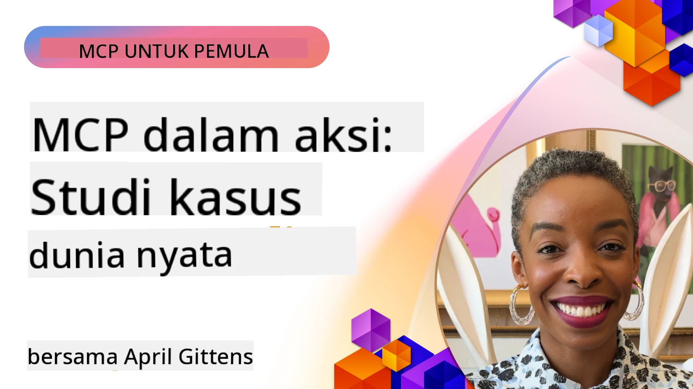

# MCP dalam Aksi: Studi Kasus Dunia Nyata

_(Klik gambar di atas untuk menonton video pelajaran ini)_

Protokol Konteks Model (MCP) sedang mengubah cara aplikasi AI berinteraksi dengan data, alat, dan layanan. Bagian ini menyajikan studi kasus dunia nyata yang menunjukkan penerapan praktis MCP dalam berbagai skenario perusahaan.

## Ikhtisar

Bagian ini menampilkan contoh konkret implementasi MCP, menyoroti bagaimana organisasi memanfaatkan protokol ini untuk memecahkan tantangan bisnis yang kompleks. Dengan mempelajari studi kasus ini, Anda akan mendapatkan wawasan tentang fleksibilitas, skalabilitas, dan manfaat praktis MCP dalam skenario dunia nyata.

## Tujuan Pembelajaran Utama

Dengan menjelajahi studi kasus ini, Anda akan:

- Memahami bagaimana MCP dapat diterapkan untuk memecahkan masalah bisnis tertentu
- Mempelajari pola integrasi dan pendekatan arsitektur yang berbeda
- Mengenali praktik terbaik untuk mengimplementasikan MCP di lingkungan perusahaan
- Mendapatkan wawasan tentang tantangan dan solusi yang ditemui dalam implementasi dunia nyata
- Mengidentifikasi peluang untuk menerapkan pola serupa dalam proyek Anda sendiri

## Studi Kasus Unggulan

### 1. [Agen Perjalanan AI Azure – Implementasi Referensi](./travelagentsample.md)

Studi kasus ini mengkaji solusi referensi komprehensif Microsoft yang menunjukkan cara membangun aplikasi perencanaan perjalanan bertenaga AI multi-agen menggunakan MCP, Azure OpenAI, dan Azure AI Search. Proyek ini menampilkan:

- Orkestrasi multi-agen melalui MCP
- Integrasi data perusahaan dengan Azure AI Search
- Arsitektur aman dan skalabel menggunakan layanan Azure
- Alat yang dapat diperluas dengan komponen MCP yang dapat digunakan kembali
- Pengalaman pengguna percakapan yang didukung oleh Azure OpenAI

Detail arsitektur dan implementasi memberikan wawasan berharga dalam membangun sistem multi-agen kompleks dengan MCP sebagai lapisan koordinasi.

### 2. [Memperbarui Item Azure DevOps dari Data YouTube](./UpdateADOItemsFromYT.md)

Studi kasus ini menunjukkan penerapan praktis MCP untuk mengotomatisasi proses alur kerja. Ini menunjukkan bagaimana alat MCP dapat digunakan untuk:

- Ekstraksi data dari platform online (YouTube)
- Memperbarui item kerja di sistem Azure DevOps
- Membuat alur kerja otomasi yang dapat diulang
- Mengintegrasikan data di berbagai sistem yang berbeda

Contoh ini menggambarkan bagaimana implementasi MCP yang relatif sederhana dapat memberikan peningkatan efisiensi signifikan dengan mengotomatisasi tugas rutin dan meningkatkan konsistensi data di antara sistem.

### 3. [Pengambilan Dokumentasi Waktu Nyata dengan MCP](./docs-mcp/README.md)

Studi kasus ini memandu Anda menghubungkan klien konsol Python ke server Model Context Protocol (MCP) untuk mengambil dan mencatat dokumentasi Microsoft kontekstual waktu nyata. Anda akan belajar cara:

- Terhubung ke server MCP menggunakan klien Python dan SDK MCP resmi
- Menggunakan klien HTTP streaming untuk pengambilan data yang efisien dan waktu nyata
- Memanggil alat dokumentasi di server dan mencatat respons langsung ke konsol
- Mengintegrasikan dokumentasi Microsoft yang terbaru ke dalam alur kerja Anda tanpa meninggalkan terminal

Bab ini mencakup tugas praktik, contoh kode minimal yang berfungsi, serta tautan ke sumber daya tambahan untuk pembelajaran lebih mendalam. Lihat panduan lengkap dan kode di bab terkait untuk memahami bagaimana MCP dapat mengubah akses dokumentasi dan produktivitas pengembang di lingkungan berbasis konsol.

### 4. [Aplikasi Web Generator Rencana Studi Interaktif dengan MCP](./docs-mcp/README.md)

Studi kasus ini menunjukkan cara membangun aplikasi web interaktif menggunakan Chainlit dan Model Context Protocol (MCP) untuk menghasilkan rencana studi yang dipersonalisasi untuk topik apa pun. Pengguna dapat menentukan subjek (misalnya "sertifikasi AI-900") dan durasi belajar (misalnya 8 minggu), dan aplikasi akan memberikan rincian rekomendasi konten mingguan. Chainlit memungkinkan antarmuka obrolan percakapan, membuat pengalaman ini menarik dan adaptif.

- Aplikasi web percakapan yang didukung oleh Chainlit
- Prompt berbasis pengguna untuk topik dan durasi
- Rekomendasi konten mingguan menggunakan MCP
- Respons adaptif waktu nyata di antarmuka obrolan

Proyek ini menggambarkan bagaimana AI percakapan dan MCP dapat digabungkan untuk menciptakan alat edukasi dinamis yang digerakkan pengguna di lingkungan web modern.

### 5. [Dokumentasi Dalam Editor dengan Server MCP di VS Code](./docs-mcp/README.md)

Studi kasus ini menunjukkan bagaimana Anda dapat mengintegrasikan Microsoft Learn Docs langsung ke lingkungan VS Code menggunakan server MCP—tidak perlu lagi berpindah tab browser! Anda akan melihat cara:

- Mencari dan membaca dokumentasi langsung di VS Code menggunakan panel atau palet perintah MCP
- Merujuk dokumentasi dan menyisipkan tautan langsung ke README atau file markdown kursus Anda
- Menggunakan GitHub Copilot dan MCP bersama untuk alur kerja dokumentasi dan kode berbasis AI yang mulus
- Memvalidasi dan meningkatkan dokumentasi Anda dengan umpan balik waktu nyata dan akurasi dari Microsoft
- Mengintegrasikan MCP dengan alur kerja GitHub untuk validasi dokumentasi berkelanjutan

Implementasi ini mencakup:

- Konfigurasi `.vscode/mcp.json` contoh untuk pengaturan mudah
- Panduan berbasis tangkapan layar pengalaman di dalam editor
- Tips untuk menggabungkan Copilot dan MCP agar produktivitas maksimal

Skenario ini ideal untuk penulis kursus, penulis dokumentasi, dan pengembang yang ingin tetap fokus di editor mereka sambil bekerja dengan dokumen, Copilot, dan alat validasi—semua didukung oleh MCP.

### 6. [Pembuatan Server APIM MCP](./apimsample.md)

Studi kasus ini memberikan panduan langkah demi langkah tentang cara membuat server MCP menggunakan Azure API Management (APIM). Ini mencakup:

- Menyiapkan server MCP di Azure API Management
- Mengekspos operasi API sebagai alat MCP
- Mengonfigurasi kebijakan pembatasan tingkat dan keamanan
- Menguji server MCP menggunakan Visual Studio Code dan GitHub Copilot

Contoh ini menggambarkan bagaimana memanfaatkan kemampuan Azure untuk membuat server MCP yang kuat yang dapat digunakan dalam berbagai aplikasi, meningkatkan integrasi sistem AI dengan API perusahaan.

### 7. [Registri MCP GitHub — Mempercepat Integrasi Agentic](https://github.com/mcp)

Studi kasus ini mengkaji bagaimana Registri MCP GitHub, yang diluncurkan pada September 2025, mengatasi tantangan kritis dalam ekosistem AI: penemuan dan penerapan server Model Context Protocol (MCP) yang terfragmentasi.

#### Ikhtisar
**Registri MCP** memecahkan masalah server MCP tersebar di berbagai repositori dan registri, yang sebelumnya membuat integrasi lambat dan rentan kesalahan. Server ini memungkinkan agen AI berinteraksi dengan sistem eksternal seperti API, basis data, dan sumber dokumentasi.

#### Pernyataan Masalah
Pengembang yang membangun alur kerja agentik menghadapi beberapa tantangan:
- **Penemuan server MCP yang buruk** di berbagai platform
- **Pertanyaan pengaturan berulang** yang tersebar di forum dan dokumentasi
- **Risiko keamanan** dari sumber yang tidak terverifikasi dan tidak terpercaya
- **Kurangnya standar** dalam kualitas dan kompatibilitas server

#### Arsitektur Solusi
Registri MCP GitHub memusatkan server MCP terpercaya dengan fitur utama:
- **Instalasi satu klik** melalui integrasi VS Code untuk pengaturan mudah
- **Pengurutan sinyal vs kebisingan** berdasarkan bintang, aktivitas, dan validasi komunitas
- **Integrasi langsung** dengan GitHub Copilot dan alat kompatibel MCP lainnya
- **Model kontribusi terbuka** yang memungkinkan kontribusi dari komunitas dan mitra perusahaan

#### Dampak Bisnis
Registri ini memberikan perbaikan yang terukur:
- **Onboarding lebih cepat** bagi pengembang yang menggunakan alat seperti Microsoft Learn MCP Server, yang menstrim dokumentasi resmi langsung ke agen
- **Produktivitas meningkat** melalui server khusus seperti `github-mcp-server`, yang memungkinkan otomasi GitHub berbasis bahasa alami (pembuatan PR, pengulangan CI, pemindaian kode)
- **Kepercayaan ekosistem yang lebih kuat** melalui daftar yang dikurasi dan standar konfigurasi yang transparan

#### Nilai Strategis
Bagi praktisi spesialis manajemen siklus hidup agen dan alur kerja yang dapat direproduksi, Registri MCP menyediakan:
- **Kemampuan penempatan agen modular** dengan komponen yang distandarisasi
- **Pipeline evaluasi berbasis registri** untuk pengujian dan validasi yang konsisten
- **Interoperabilitas lintas alat** yang memungkinkan integrasi mulus antar platform AI berbeda

Studi kasus ini menunjukkan bahwa Registri MCP bukan sekadar direktori—melainkan platform fundamental untuk integrasi model dan penerapan sistem agentik berskala nyata.

### 8. [Mempublikasikan ke Jejaring Sosial dari Agen](./publora-social-publishing.md)

Studi kasus ini membahas **server MCP jarak jauh yang dapat menulis** — yang alatnya mengambil tindakan tak terbalikkan atas nama pengguna — menggunakan penerbitan sosial sebagai contoh kerja. Agen membuat draf posting, seorang manusia menyetujuinya, dan server menjadwalkannya ke berbagai jejaring sosial.

Bagian menariknya adalah batasan desain yang diberlakukan penerbitan, yang berlaku untuk server apa pun yang menulis bukan membaca:

- **Penemuan terbuka, eksekusi terautentikasi** — `tools/list` dijawab tanpa kredensial agar registri dan klien bisa introspeksi, sedangkan setiap `tools/call` memerlukan token dan jika tidak mengembalikan `401` dengan header `WWW-Authenticate`
- **Registrasi OAuth tanpa langkah terpisah** — registrasi klien dinamis saat ini, dengan Dokumen Metadata Client ID sebagai arah spesifikasi `2026-07-28`
- **Anotasi alat** (`readOnlyHint`, `destructiveHint`, `idempotentHint`) yang digunakan klien untuk memutuskan apa yang harus dikonfirmasi — petunjuk bukan penegakan, dan sesuatu yang kini diharapkan direktori konektor saat tinjauan
- **Pengidentifikasi yang tidak dapat dibuat ulang**, sehingga nilai halusinasi gagal dengan keras alih-alih bertindak pada nilai yang tampak masuk akal
- **Kunci idempoten pada alat pembuat posting**, sehingga pengulangan runtime agen tidak menjadi publikasi duplikat
- **Target no-op yang dijelaskan dalam skema alat** yang menjalankan jalur tulis penuh dan tidak menerbitkan apa pun, untuk peninjau dan CI

Bab ini ditutup dengan daftar periksa singkat yang dapat Anda terapkan pada server yang sedang Anda bangun.

## Kesimpulan

Delapan studi kasus komprehensif ini menunjukkan fleksibilitas luar biasa dan penerapan praktis Model Context Protocol di berbagai skenario dunia nyata. Dari sistem perencanaan perjalanan multi-agen yang kompleks dan manajemen API perusahaan hingga alur kerja dokumentasi yang disederhanakan dan Registri MCP GitHub yang revolusioner, contoh-contoh ini menampilkan bagaimana MCP menyediakan cara yang distandarisasi dan skalabel untuk menghubungkan sistem AI dengan alat, data, dan layanan yang mereka butuhkan untuk memberikan nilai luar biasa.

Studi kasus mencakup berbagai dimensi implementasi MCP:
- **Integrasi Perusahaan**: Manajemen API Azure dan otomasi Azure DevOps
- **Orkestrasi Multi-Agen**: Perencanaan perjalanan dengan agen AI terkoordinasi
- **Produktivitas Pengembang**: Integrasi VS Code dan akses dokumentasi waktu nyata
- **Pengembangan Ekosistem**: Registri MCP GitHub sebagai platform fundamental
- **Aplikasi Pendidikan**: Generator rencana studi interaktif dan antarmuka percakapan

Dengan mempelajari implementasi ini, Anda mendapat wawasan penting tentang:
- **Pola arsitektur** untuk skala dan kasus penggunaan berbeda
- **Strategi implementasi** yang menyeimbangkan fungsionalitas dengan kemudahan pemeliharaan
- **Pertimbangan keamanan dan skalabilitas** untuk penerapan produksi
- **Praktik terbaik** untuk pengembangan server MCP dan integrasi klien
- **Pemikiran ekosistem** untuk membangun solusi AI terhubung yang kuat

Contoh-contoh ini secara kolektif menunjukkan bahwa MCP bukan hanya kerangka kerja teoritis, melainkan protokol matang yang siap produksi yang memungkinkan solusi praktis untuk tantangan bisnis kompleks. Baik Anda membangun alat otomasi sederhana maupun sistem multi-agen canggih, pola dan pendekatan yang diilustrasikan di sini menyediakan dasar yang kokoh untuk proyek MCP Anda sendiri.

## Sumber Daya Tambahan

- [Repositori GitHub Azure AI Travel Agents](https://github.com/Azure-Samples/azure-ai-travel-agents)
- [Alat MCP Azure DevOps](https://github.com/microsoft/azure-devops-mcp)
- [Alat MCP Playwright](https://github.com/microsoft/playwright-mcp)
- [Server MCP Microsoft Docs](https://github.com/MicrosoftDocs/mcp)
- [Registri MCP GitHub — Mempercepat Integrasi Agentic](https://github.com/mcp)
- [Contoh Komunitas MCP](https://github.com/microsoft/mcp)

## Selanjutnya

- Sebelumnya: [Modul 8: Praktik Terbaik](../08-BestPractices/README.md)
- Berikutnya: [Modul 10: Menyederhanakan Alur Kerja AI: Membangun Server MCP dengan AI Toolkit](../10-StreamliningAIWorkflowsBuildingAnMCPServerWithAIToolkit/README.md)

---

<!-- CO-OP TRANSLATOR DISCLAIMER START -->
**Penafian**:
Dokumen ini telah diterjemahkan menggunakan layanan terjemahan AI [Co-op Translator](https://github.com/Azure/co-op-translator). Meskipun kami berupaya untuk mencapai akurasi, harap diketahui bahwa terjemahan otomatis mungkin mengandung kesalahan atau ketidakakuratan. Dokumen asli dalam bahasa aslinya harus dianggap sebagai sumber yang sah. Untuk informasi penting, disarankan menggunakan terjemahan profesional oleh manusia. Kami tidak bertanggung jawab atas kesalahpahaman atau penafsiran yang keliru yang timbul dari penggunaan terjemahan ini.
<!-- CO-OP TRANSLATOR DISCLAIMER END -->