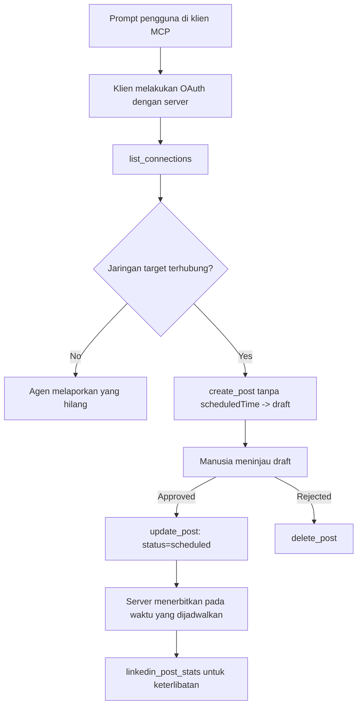

# Studi Kasus: Mempublikasikan ke Jejaring Sosial dari Agen dengan Server MCP Jarak Jauh

> **Penafian:** Beberapa layanan dan proyek open-source dapat mempublikasikan ke jejaring sosial, dan sebuah tim juga dapat mengintegrasikan API setiap jejaring secara langsung. Skenario di bawah ini diberikan sebagai satu contoh kerja tentang bagaimana **server MCP jarak jauh yang mampu menulis** dapat dirancang dan digunakan. Publora adalah layanan komersial dengan tier gratis; pola yang dijelaskan di sini berlaku untuk server MCP mana pun yang melakukan tindakan tak terbalikkan atas nama pengguna.

## Gambaran Umum

Agen baik dalam membuat draf konten dan kurang baik dalam mengantarkannya. Sebuah model dapat menulis pengumuman rilis dalam hitungan detik, dan kemudian pekerjaan berhenti: mempublikasikannya berarti API per jejaring, aplikasi OAuth per jejaring, dan seperangkat aturan media berbeda untuk masing-masing. Sebagian besar tim menyelesaikan ini dengan menyalin teks ke browser secara manual.

Studi kasus ini melihat bagaimana langkah terakhir itu diselesaikan dengan satu server MCP jarak jauh, dan — yang lebih berguna bagi siapa saja yang membangunnya — keputusan desain yang harus benar dilakukan oleh server **yang mampu menulis**. Membaca data itu mudah. Memublikasikan tidak: panggilan alat yang salah terlihat oleh audiens dan tidak dapat dibatalkan.

## Skenario

Sebuah tim kecil hubungan pengembang membuat draf posting di dalam agen (Claude, VS Code, Cursor — klien tidak masalah). Mereka ingin agen dapat:

- melihat akun sosial mana yang terhubung dengan tim,
- membuat draf postingan dan menyimpannya sebagai draf untuk persetujuan manusia,
- melampirkan gambar,
- menjadwalkannya ke beberapa jejaring pada waktu yang dipilih,
- dan kemudian melaporkan performanya.

Yang penting, mereka ingin agen *tidak dapat* mempublikasikan secara tidak sengaja saat mereka masih bereksperimen.

## Alat yang Digunakan

- [Server MCP Publora](https://github.com/publora/mcp-server) — server MCP jarak jauh (`streamable-http`) yang menyediakan alat penerbitan, penjadwalan, media, dan analitik LinkedIn. Terdaftar di registri MCP resmi sebagai `com.publora/mcp-server`.

## Alur Kerja Langkah demi Langkah

1. **Hubungkan server.** Klien yang memakai OAuth menyelesaikan alur authorization-code dengan PKCE melalui layar persetujuan server sendiri; klien yang tidak mendukung, seperti CLI tanpa kepala, menggunakan kunci API Publora di header. Kedua jalur didukung, dan jalur mana yang didapat tergantung pada klien, bukan server.
2. **Daftar koneksi.** Agen memanggil `list_connections` dan menerima akun yang terhubung dengan pengidentifikasi mereka.
3. **Buat draf.** Agen memanggil `create_post` *tanpa* waktu yang dijadwalkan. Postingan disimpan sebagai draf — tidak ada yang diterbitkan.
4. **Lampirkan media.** URL gambar publik dilewatkan dalam panggilan yang sama; server mengunduh dan memvalidasinya.
5. **Penjadwalan.** Setelah manusia menyetujui, `update_post` mengatur status menjadi dijadwalkan dengan waktu ISO 8601.
6. **Ukur.** Untuk LinkedIn, `linkedin_post_stats` mengembalikan keterlibatan setelah postingan live.

## Contoh Prompt

```text
Which social accounts do I have connected?
Draft a post announcing our new changelog page, attach the screenshot at
https://example.com/changelog.png, and keep it as a draft — do not publish it.
Once I approve, schedule it to LinkedIn and Bluesky for tomorrow at 09:00 UTC.
```

## Diagram Mermaid



## Implementasi Teknis

Pelajaran di bawah ini adalah bagian yang dapat dipindahkan dari studi kasus ini.

### Penemuan terbuka, eksekusi terautentikasi

`tools/list` dilayani tanpa kredensial; setiap `tools/call` membutuhkan token dan jika tidak mengembalikan `401` dengan header `WWW-Authenticate` yang menunjuk ke metadata sumber daya terlindungi. (Server juga menjawab `initialize` tanpa autentikasi, yang hanya relevan untuk klien dengan versi protokol sebelum `2026-07-28`; revisi itu menghapus handshake sepenuhnya.)

Pemisahan ini penting dalam praktik. Registri, katalog, dan klien dapat memeriksa permukaan alat — nama, skema, anotasi — tanpa memegang rahasia, sementara tidak ada yang dapat *dieksekusi* secara anonim. Server yang menuntut token untuk `initialize` praktis tidak terlihat oleh tooling; server yang mengizinkan `tools/call` anonim adalah risiko.

### Registrasi: registrasi klien dinamis, dan penggantinya

Server mengiklankan `/.well-known/oauth-protected-resource` dan `/.well-known/oauth-authorization-server`, dan mendukung alur authorization-code dengan PKCE (`S256`), token refresh, dan **registrasi klien dinamis**.

Registrasi dinamis menghilangkan langkah manual: tanpa itu setiap klien membutuhkan `client_id` yang diterbitkan sebelumnya, yang berarti permintaan terpisah ke vendor untuk setiap klien baru.

Perlakukan ini sebagai perilaku kompatibilitas daripada desain untuk ditiru. Revisi spesifikasi `2026-07-28` mendepresiasi registrasi klien dinamis demi Dokumen Metadata ID Klien, di mana klien meng-host dokumen metadata di URL HTTPS yang stabil dan URL itu *adalah* `client_id`. DCR masih berfungsi untuk saat ini, tapi server yang dibangun hari ini sebaiknya merencanakan CIMD dan mempertahankan DCR hanya untuk klien lama.

### Anotasi alat bukan sekedar hiasan

Setiap alat membawa `title` dan petunjuk yang berlaku: `readOnlyHint`, `destructiveHint`, `idempotentHint`, `openWorldHint`.

Dua alasan untuk berinvestasi di sana. Pertama, klien menggunakan petunjuk tersebut untuk memutuskan apa yang perlu dikonfirmasi ke pengguna — klien dapat menjalankan pencarian baca-saja otomatis dan berhenti untuk persetujuan sebelum hapus. Spesifikasi tegas bahwa anotasi adalah petunjuk yang tidak dipercaya, bukan mekanisme otorisasi: mereka membentuk apa yang ditawarkan klien untuk dilakukan, mereka tidak menghentikan apa pun di server, dan server harus tetap menegakkan aturan sendiri. Kedua, direktori konektor utama sekarang *mewajibkan* mereka untuk review; server yang alatnya tidak punya judul dan petunjuk akan dikembalikan tidak peduli seberapa baik kerjanya.

### Buat pengidentifikasi tidak bisa ditebak

Pengidentifikasi platform adalah string opak yang dikembalikan oleh `list_connections`, dan deskripsi skema mengatakan secara eksplisit bahwa mereka harus disalin apa adanya dan tidak boleh ditebak. Server menolak yang lain.

Model adalah penebak lancar. Setiap server yang bisa menulis harus mengasumsikan sebuah pengidentifikasi akhirnya akan dihalusinasi dan membuat jalur itu gagal keras dan awal, bukan bertindak pada nilai yang tampak masuk akal.

### Gagal sebelum memublikasikan, dengan pesan yang bisa ditindaklanjuti

Beberapa jejaring menolak postingan hanya teks dan memerlukan gambar atau video. Itu divalidasi saat postingan dijadwalkan, dan kesalahan menyebutkan platform dan persyaratan yang hilang.

Agen bisa pulih dari "Instagram memerlukan media — lampirkan gambar atau video" tanpa putaran perjalanan tambahan. Agen tidak bisa pulih dari `400` yang generik.

### Buat pengulangan aman

Dua alat yang membuat konten, `create_post` dan `update_post`, menerima kunci idempoten: menggunakan ulang dengan permintaan identik memutar ulang respons asli alih-alih membuat postingan kedua. Runtime agen mengulangi pada timeout; tanpa idempoten, respons lambat menjadi publikasi duplikat. Alat tulis lain — penghapusan, langkah media, reaksi dan komentar LinkedIn — tidak mengambil satu, jadi pengulangan tidak otomatis aman di sana. Penting tahu mutasi mana yang dilindungi dan mana yang tidak.

### Sediakan cara untuk menguji tanpa memublikasikan apa pun

Server menerima target cadangan, `publora-playground`, yang divalidasi dan diakui seperti tujuan nyata lalu dibuang — tidak ada yang mencapai akun nyata. Itu dideskripsikan dalam skema alat sendiri, yang bisa dibaca klien tanpa kredensial: field `platforms` pada `create_post` mendokumentasikannya sebagai "target tes koneksi yang tidak memerlukan koneksi nyata — post diakui dan dibuang, tidak ada yang dipublikasikan". Panggil itu dengan melewatkannya sebagai satu-satunya entri: `platforms: ["publora-playground"]`.

Ini ternyata menjadi salah satu detail paling berguna dari seluruh permukaan. Peninjau direktori konektor, kontributor, dan CI bisa menjalankan jalur tulis lengkap dari ujung ke ujung tanpa risiko ke audiens nyata. Setiap server MCP dengan tindakan tak terbalikkan mendapat manfaat dari target no-op yang terdokumentasi.

## Hasil dan Dampak

- Langkah penerbitan pindah dari browser ke percakapan yang sama tempat konten dibuat, dan kebiasaan draf terlebih dahulu menjaga manusia dalam proses. Jelaskan secara tepat apa itu: draf adalah konvensi, bukan batasan. Kredensial yang sama dapat menjadwalkan atau mempublikasikan, jadi siapa pun yang butuh gerbang persetujuan nyata harus menegakkannya di luar permukaan alat — kredensial terpisah, atau lapisan kebijakan di depan server.
- Perbedaan per jejaring — persyaratan media, threading, kontrol balasan — ditangani sekali di server, bukan di setiap agen yang berbicara dengannya.
- Server yang sama mendukung beberapa klien MCP tanpa kerja per klien, karena penemuan terbuka dan registrasi dinamis.
- Kendala desain di atas dibentuk oleh ulasan direktori konektor sebanyak oleh pengguna: anotasi, OAuth dan target tes aman masing-masing diwajibkan oleh setidaknya satu dari mereka.

## Referensi

- [Server MCP Publora (sumber)](https://github.com/publora/mcp-server)
- [Dokumentasi API dan MCP Publora](https://docs.publora.com)
- [Entri Registri MCP: `com.publora/mcp-server`](https://registry.modelcontextprotocol.io/v0/servers?search=com.publora/mcp-server)
- [Spesifikasi MCP — Otorisasi](https://modelcontextprotocol.io/specification/draft/basic/authorization)
- [Spesifikasi MCP — Anotasi Alat](https://modelcontextprotocol.io/docs/concepts/tools)

## Apa Berikutnya

- Ambil server MCP yang sedang Anda bangun dan periksa tiga kemenangan termurah di sini: anotasi pada setiap alat, kunci idempoten pada setiap tulis, dan target no-op yang terdokumentasi.
- Coba pisah penemuan terbuka: panggil `tools/list` ke server jarak jauh publik tanpa kredensial, lalu panggil alat dan lihat tantangan `401`.
- Pertimbangkan arti "undo" untuk domain Anda. Penerbitan punya draf dan penghapusan; jika tindakan Anda tidak ada padanannya, konfirmasi masuk dalam desain alat, bukan dalam prompt.

---

<!-- CO-OP TRANSLATOR DISCLAIMER START -->
**Penafian**:
Dokumen ini telah diterjemahkan menggunakan layanan terjemahan AI [Co-op Translator](https://github.com/Azure/co-op-translator). Meskipun kami berupaya untuk mencapai akurasi, harap diketahui bahwa terjemahan otomatis mungkin mengandung kesalahan atau ketidakakuratan. Dokumen asli dalam bahasa aslinya harus dianggap sebagai sumber yang sah. Untuk informasi penting, disarankan menggunakan terjemahan profesional oleh manusia. Kami tidak bertanggung jawab atas kesalahpahaman atau penafsiran yang keliru yang timbul dari penggunaan terjemahan ini.
<!-- CO-OP TRANSLATOR DISCLAIMER END -->