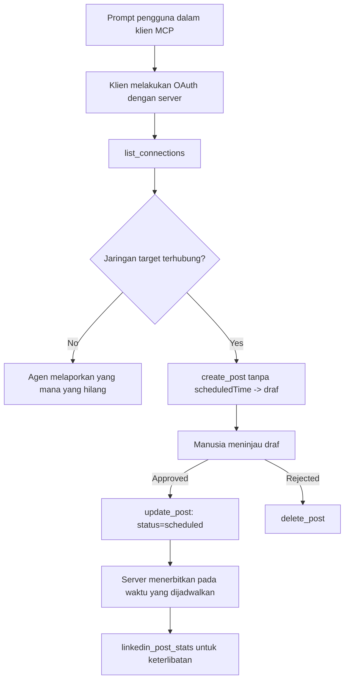

# Studi Kasus: Mempublikasikan ke Jejaring Sosial dari Agen dengan Server MCP Jarak Jauh

> **Penafian:** Beberapa layanan dan proyek open-source dapat mempublikasikan ke jejaring sosial, dan sebuah tim juga dapat mengintegrasikan API masing-masing jejaring secara langsung. Skenario di bawah ini disediakan sebagai satu contoh kerja bagaimana **server MCP jarak jauh yang memungkinkan penulisan** dapat dirancang dan digunakan. Publora adalah layanan komersial dengan tingkatan gratis; pola yang dijelaskan di sini berlaku untuk server MCP manapun yang melakukan tindakan tak bisa dibalikkan atas nama pengguna.

## Ikhtisar

Agen baik dalam membuat draf konten namun kurang mahir dalam mengirimkannya. Model dapat menulis pengumuman rilis dalam hitungan detik, dan kemudian pekerjaan berhenti: mempublikasikannya berarti sebuah API per jejaring, aplikasi OAuth per jejaring, dan aturan media yang berbeda-beda untuk masing-masing. Sebagian besar tim menyelesaikan ini dengan menyalin teks ke browser secara manual.

Studi kasus ini melihat bagaimana langkah terakhir ini ditutup dengan satu server MCP jarak jauh, dan — lebih berguna bagi siapa saja yang membangunnya — keputusan desain yang harus tepat dari server **yang bisa menulis**. Membaca data lebih memaafkan. Memublikasikan tidak: panggilan alat yang salah terlihat oleh audiens dan tidak dapat dibatalkan.

## Skenario

Sebuah tim kecil pengembang-relasi menulis draf posting di dalam agen (Claude, VS Code, Cursor — klien tidak penting). Mereka ingin agen untuk:

- melihat akun sosial mana yang sudah terhubung,
- membuat draf posting dan menyimpannya sebagai draf untuk disetujui manusia,
- melampirkan gambar,
- menjadwalkannya ke beberapa jejaring pada waktu yang dipilih,
- dan kemudian melaporkan performanya.

Yang penting, mereka ingin agen *tidak bisa* mempublikasikan secara tidak sengaja sementara mereka masih bereksperimen.

## Alat yang Digunakan

- [Publora MCP Server](https://github.com/publora/mcp-server) — server MCP jarak jauh (`streamable-http`) yang mengekspos alat penerbitan, penjadwalan, media, dan analitik LinkedIn. Terdaftar di registri MCP resmi sebagai `com.publora/mcp-server`.

## Alur Kerja Langkah demi Langkah

1. **Sambungkan server.** Klien yang mendukung OAuth menyelesaikan alur kode otorisasi dengan PKCE di layar persetujuan server; klien yang tidak, seperti CLI tanpa kepala, menggunakan kunci API Publora dalam header. Kedua jalur didukung, dan mana yang didapat tergantung pada klien, bukan pada server.
2. **Daftar koneksi.** Agen memanggil `list_connections` dan menerima akun-akun yang terhubung beserta pengenal mereka.
3. **Buat draf.** Agen memanggil `create_post` *tanpa* waktu penjadwalan. Posting disimpan sebagai draf — tidak ada yang dipublikasikan.
4. **Lampirkan media.** URL gambar publik disertakan dalam panggilan yang sama; server mengunduh dan memvalidasi.
5. **Jadwalkan.** Setelah disetujui manusia, `update_post` mengatur status menjadi dijadwalkan dengan waktu ISO 8601.
6. **Ukur.** Untuk LinkedIn, `linkedin_post_stats` mengembalikan keterlibatan setelah posting dipublikasikan.

## Contoh Prompt

```text
Which social accounts do I have connected?
Draft a post announcing our new changelog page, attach the screenshot at
https://example.com/changelog.png, and keep it as a draft — do not publish it.
Once I approve, schedule it to LinkedIn and Bluesky for tomorrow at 09:00 UTC.
```

## Diagram Alur Mermaid



## Implementasi Teknis

Pelajaran berikut adalah bagian yang dapat dialihkan dari studi kasus ini.

### Penemuan terbuka, eksekusi terautentikasi

`tools/list` disajikan tanpa kredensial; setiap `tools/call` membutuhkan token
dan sebaliknya mengembalikan `401` dengan header `WWW-Authenticate` yang menunjuk ke
metadata sumber daya terlindungi. Endpoint legacy server juga menjawab
`initialize` tanpa autentikasi untuk klien pada versi protokol sebelum
`2026-07-28`; klien saat ini tidak menggunakan handshake itu.

Pemisahan khusus server ini memungkinkan registri, katalog, dan klien memeriksa
nama alat, skema, dan anotasi tanpa rahasia sekaligus mencegah eksekusi anonim.
Penemuan terbuka adalah pilihan penerapan, bukan persyaratan MCP; deploy terlindungi
bisa juga memerlukan otorisasi untuk `tools/list`.

### Registrasi: registrasi klien dinamis, dan penggantinya

Server mengiklankan `/.well-known/oauth-protected-resource` dan `/.well-known/oauth-authorization-server`, dan mendukung alur kode otorisasi dengan PKCE (`S256`), token penyegar, dan **registrasi klien dinamis**.

Registrasi dinamis menghilangkan langkah manual untuk klien legacy: tanpa itu,
setiap klien membutuhkan `client_id` yang sudah diterbitkan oleh vendor.

Perlakukan ini sebagai perilaku kompatibilitas, bukan desain untuk ditiru. Revisi spesifikasi `2026-07-28` mendepresiasi registrasi klien dinamis demi Dokumen Metadata ID Klien, di mana klien menyajikan dokumen metadata di URL HTTPS stabil dan URL itu *adalah* `client_id`. DCR masih bekerja saat ini, tapi server yang dibangun sekarang harus merencanakan CIMD dan hanya menggunakan DCR untuk klien lama.

### Anotasi alat bukan hiasan

Setiap alat membawa `title` dan petunjuk yang berlaku: `readOnlyHint`, `destructiveHint`, `idempotentHint`, `openWorldHint`.

Dua alasan untuk menginvestasikan pada ini. Pertama, klien menggunakan petunjuk untuk memutuskan apa yang dikonfirmasi ke pengguna — klien dapat menjalankan lookup hanya baca otomatis dan berhenti untuk persetujuan sebelum penghapusan. Spesifikasi eksplisit bahwa anotasi adalah petunjuk tidak dipercaya, bukan mekanisme otorisasi: mereka membentuk apa yang ditawarkan klien untuk dilakukan, tidak menghentikan apapun di server, dan server tetap harus menegakkan aturan sendiri. Kedua, direktori konektor utama sekarang *memerlukan* mereka untuk review; server dengan alat tanpa judul dan petunjuk akan dikembalikan meski berfungsi baik.

### Buat pengenal tidak dapat dibuat-buat

Pengenal platform adalah string opak yang dikembalikan oleh `list_connections`, dan deskripsi skema menyatakan secara eksplisit bahwa harus disalin persis dan tidak boleh ditebak. Server menolak apapun selain itu.

Model adalah penebak fasih. Server yang dapat menulis harus menganggap pengenal akan akhirnya dihalusinasi dan membuat jalur itu gagal keras dan awal, bukan menggunakan nilai yang tampak masuk akal.

### Gagal sebelum memublikasikan, dengan pesan dapat ditindaklanjuti

Beberapa jejaring menolak posting hanya-teks dan mengharuskan ada gambar atau video. Itu divalidasi saat posting dijadwalkan, dan kesalahan menyebutkan platform dan persyaratan yang hilang.

Agen dapat pulih dari "Instagram membutuhkan media — lampirkan gambar atau video" tanpa putaran kembali. Tidak dapat pulih dari `400` umum.

### Buat pengulangan aman

Dua alat yang membuat konten, `create_post` dan `update_post`, menerima kunci idempoten: menggunakannya ulang dengan permintaan identik memutar balik respons asli daripada membuat posting kedua. Runtime agen mengulangi pada timeout; tanpa idempoten, respons lambat menjadi publikasi duplikat. Alat tulis lain — penghapusan, langkah media, reaksi dan komentar LinkedIn — tidak menerima, jadi pengulangan di sana tidak otomatis aman. Penting tahu mutasi kamu mana yang terlindungi dan mana yang tidak.

### Sediakan cara untuk menguji tanpa memublikasikan apapun


Server menerima target yang dicadangkan, `publora-playground`, yang divalidasi dan diakui seperti tujuan nyata dan kemudian dibuang — tidak ada yang mencapai akun nyata. Ini dijelaskan dalam skema alat itu sendiri, yang dapat dibaca oleh klien mana pun tanpa kredensial: bidang `platforms` dari `create_post` mendokumentasikannya sebagai "target uji koneksi yang tidak memerlukan koneksi nyata — postingan diakui dan dibuang, tidak ada yang dipublikasikan". Panggil dengan melewatinya sebagai entri tunggal: `platforms: ["publora-playground"]`.

Detail ini ternyata menjadi salah satu yang paling berguna dari seluruh permukaan. Peninjau direktori konektor, kontributor, dan CI dapat menjalankan jalur tulis penuh dari awal hingga akhir tanpa risiko bagi audiens nyata. Server MCP mana pun yang memiliki tindakan yang tidak dapat dibalik mendapatkan manfaat dari target no-op yang terdokumentasi.

## Hasil dan Dampak

- Langkah penerbitan berpindah dari browser ke percakapan yang sama di mana konten ditulis, dan kebiasaan draft-first menjaga manusia tetap terlibat. Jelaskan dengan tepat apa itu: draft adalah konvensi, bukan batasan. Kredensial yang sama dapat menjadwalkan atau menerbitkan, jadi siapa pun yang membutuhkan gerbang persetujuan nyata harus menegakkannya di luar permukaan alat — kredensial terpisah, atau lapisan kebijakan di depan server.
- Perbedaan per-jaringan — persyaratan media, pengurutan, kontrol balasan — ditangani sekali di server daripada di setiap agen yang berbicara dengannya.
- Server yang sama mendukung beberapa klien MCP tanpa kredensial yang telah diterbitkan sebelumnya.
    Klien saat ini dapat menggunakan Dokumen Metadata Client ID; DCR tetap menjadi cadangan
    untuk klien yang lebih lama.
- Batasan desain di atas dibentuk oleh tinjauan direktori konektor sama seperti oleh pengguna: anotasi, OAuth, dan target uji yang aman masing-masing diwajibkan oleh setidaknya satu dari mereka.

## Referensi

- [Server MCP Publora (sumber)](https://github.com/publora/mcp-server)
- [Dokumentasi API dan MCP Publora](https://docs.publora.com)
- [Entri Registry MCP: `com.publora/mcp-server`](https://registry.modelcontextprotocol.io/v0/servers?search=com.publora/mcp-server)
- [Spesifikasi MCP — Otorisasi](https://modelcontextprotocol.io/specification/2026-07-28/basic/authorization)
- [Spesifikasi MCP — Anotasi alat](https://modelcontextprotocol.io/docs/concepts/tools)

## Selanjutnya

- Ambil server MCP yang sedang Anda buat dan periksa tiga kemenangan termurah di sini: anotasi di setiap alat, kunci idempoten di setiap tulis, dan target no-op yang terdokumentasi.
- Cobalah pemisahan penemuan-terbuka: panggil `tools/list` ke server jarak jauh publik tanpa kredensial, kemudian panggil alat dan periksa tantangan `401`.
- Pertimbangkan apa arti "undo" untuk domain Anda. Penerbitan memiliki draft dan penghapusan; jika tindakan Anda tidak memiliki padanan, konfirmasi harus ada dalam desain alat, bukan dalam prompt.

---

<!-- CO-OP TRANSLATOR DISCLAIMER START -->
**Penafian**:
Dokumen ini telah diterjemahkan menggunakan layanan terjemahan AI [Co-op Translator](https://github.com/Azure/co-op-translator). Meskipun kami berupaya untuk mencapai akurasi, harap diketahui bahwa terjemahan otomatis mungkin mengandung kesalahan atau ketidakakuratan. Dokumen asli dalam bahasa aslinya harus dianggap sebagai sumber yang sah. Untuk informasi penting, disarankan menggunakan terjemahan profesional oleh manusia. Kami tidak bertanggung jawab atas kesalahpahaman atau penafsiran yang keliru yang timbul dari penggunaan terjemahan ini.
<!-- CO-OP TRANSLATOR DISCLAIMER END -->