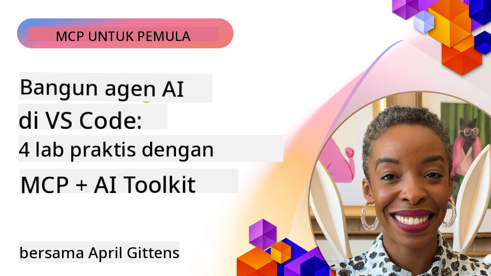

# Menyederhanakan Alur Kerja AI: Membangun Server MCP dengan Microsoft Foundry Toolkit

## 🎯 Ikhtisar

_(Klik gambar di atas untuk menonton video pelajaran ini)_

Selamat datang di **Model Context Protocol (MCP) Workshop**! Workshop praktis komprehensif ini menggabungkan dua teknologi mutakhir untuk merevolusi pengembangan aplikasi AI:

> **Catatan kompatibilitas:** kode workshop dibangun dan diuji dengan MCP
> `2025-11-25`, seperti yang ditunjukkan oleh lencana di atas. Gunakan
> [spesifikasi `2026-07-28` saat ini](https://modelcontextprotocol.io/specification/2026-07-28/)
> untuk implementasi protokol baru dan tinjau catatan rilis SDK sebelum
> memigrasi laboratorium.

- **🔗 Model Context Protocol (MCP)**: Standar terbuka untuk integrasi alat AI tanpa hambatan
- **🛠️ Microsoft Foundry Toolkit Extension untuk VS Code**: Ekstensi pengembangan AI canggih dari Microsoft

### 🎓 Apa yang Akan Anda Pelajari

Pada akhir workshop ini, Anda akan menguasai seni membangun aplikasi cerdas yang menghubungkan model AI dengan alat dan layanan dunia nyata. Dari pengujian otomatis hingga integrasi API khusus, Anda akan memperoleh keterampilan praktis untuk memecahkan tantangan bisnis yang kompleks.

## 🏗️ Tumpukan Teknologi

### 🔌 Model Context Protocol (MCP)

MCP adalah **"USB-C untuk AI"** - standar universal yang menghubungkan model AI ke alat eksternal dan sumber data.

**✨ Fitur Utama:**

- 🔄 **Integrasi Standar**: Antarmuka universal untuk koneksi alat AI
- 🏛️ **Arsitektur Fleksibel**: Server lokal & jarak jauh melalui transport stdio/SSE
- 🧰 **Ekosistem Kaya**: Alat, prompt, dan sumber daya dalam satu protokol
- 🔒 **Siap Enterprise**: Keamanan dan keandalan bawaan

**🎯 Mengapa MCP Penting:**
Sama seperti USB-C menghilangkan kekacauan kabel, MCP menghilangkan kompleksitas integrasi AI. Satu protokol, kemungkinan tak terbatas.

### 🤖 Microsoft Foundry Toolkit Extension untuk VS Code

Ekstensi pengembangan AI unggulan Microsoft yang mengubah VS Code menjadi pusat kekuatan AI.

**🚀 Kemampuan Inti:**

- 📦 **Katalog Model**: Akses model dari Azure AI, GitHub, Hugging Face, Ollama
- ⚡ **Inferensi Lokal**: Eksekusi CPU/GPU/NPU yang dioptimalkan ONNX
- 🏗️ **Agent Builder**: Pengembangan agen AI visual dengan integrasi MCP
- 🎭 **Multimodal**: Dukungan teks, visual, dan output terstruktur

**💡 Manfaat Pengembangan:**

- Deploy model tanpa konfigurasi
- Rekayasa prompt visual
- Playground pengujian waktu nyata
- Integrasi server MCP mulus

## 📚 Perjalanan Pembelajaran

### [🚀 Modul 1: Dasar-Dasar Microsoft Foundry Toolkit](./lab1/README.md)

**Durasi**: 15 menit

- 🛠️ Pasang dan konfigurasikan Microsoft Foundry Toolkit untuk VS Code
- 🗂️ Jelajahi Katalog Model (100+ model dari GitHub, ONNX, OpenAI, Anthropic, Google)
- 🎮 Kuasai Interactive Playground untuk pengujian model waktu nyata
- 🤖 Bangun agen AI pertama Anda dengan Agent Builder
- 📊 Evaluasi performa model dengan metrik bawaan (F1, relevansi, kemiripan, koherensi)
- ⚡ Pelajari pemrosesan batch dan kemampuan multimodal

**🎯 Hasil Pembelajaran**: Membuat agen AI fungsional dengan pemahaman menyeluruh atas kemampuan Microsoft Foundry Toolkit

### [🌐 Modul 2: MCP dengan Dasar-Dasar Microsoft Foundry Toolkit](./lab2/README.md)

**Durasi**: 20 menit

- 🧠 Kuasai arsitektur dan konsep Model Context Protocol (MCP)
- 🌐 Jelajahi ekosistem server MCP Microsoft
- 🤖 Bangun agen otomatisasi browser menggunakan Playwright MCP server
- 🔧 Integrasikan server MCP dengan Agent Builder Microsoft Foundry Toolkit
- 📊 Konfigurasikan dan uji alat MCP dalam agen Anda
- 🚀 Ekspor dan deploy agen bertenaga MCP untuk penggunaan produksi

**🎯 Hasil Pembelajaran**: Mendeploy agen AI yang dipercepat dengan alat eksternal melalui MCP

### [🔧 Modul 3: Pengembangan MCP Lanjutan dengan Microsoft Foundry Toolkit](./lab3/README.md)

**Durasi**: 20 menit

- 💻 Buat server MCP khusus menggunakan Microsoft Foundry Toolkit
- 🐍 Konfigurasikan dan gunakan SDK MCP Python terbaru (v1.9.3)
- 🔍 Atur dan gunakan MCP Inspector untuk debugging
- 🛠️ Bangun Server MCP Cuaca dengan alur kerja debugging profesional
- 🧪 Debug server MCP di lingkungan Agent Builder dan Inspector

**🎯 Hasil Pembelajaran**: Kembangkan dan debug server MCP khusus dengan alat modern

### [🐙 Modul 4: Pengembangan MCP Praktis - Server Klon GitHub Kustom](./lab4/README.md)

**Durasi**: 30 menit

- 🏗️ Bangun Server MCP Klon GitHub nyata untuk alur kerja pengembangan
- 🔄 Terapkan kloning repositori cerdas dengan validasi dan penanganan kesalahan
- 📁 Buat manajemen direktori cerdas dan integrasi VS Code
- 🤖 Gunakan Mode Agen GitHub Copilot dengan alat MCP kustom
- 🛡️ Terapkan keandalan siap produksi dan kompatibilitas lintas platform

**🎯 Hasil Pembelajaran**: Deploy server MCP siap produksi yang menyederhanakan alur kerja pengembangan nyata

## 💡 Aplikasi Dunia Nyata & Dampak

### 🏢 Kasus Penggunaan Enterprise

#### 🔄 Otomasi DevOps

Ubah alur kerja pengembangan Anda dengan otomasi cerdas:

- **Manajemen Repositori Cerdas**: Tinjauan kode dan keputusan merge berbasis AI
- **CI/CD Cerdas**: Optimasi pipeline otomatis berdasarkan perubahan kode
- **Triage Masalah**: Klasifikasi dan penugasan bug otomatis

#### 🧪 Revolusi Jaminan Kualitas

Tingkatkan pengujian dengan otomasi bertenaga AI:

- **Generasi Tes Cerdas**: Membuat suite tes komprehensif secara otomatis
- **Pengujian Regresi Visual**: Deteksi perubahan UI dengan AI
- **Pemantauan Performa**: Identifikasi dan resolusi masalah secara proaktif

#### 📊 Kecerdasan Pipeline Data

Bangun alur kerja pengolahan data yang lebih cerdas:

- **Proses ETL Adaptif**: Transformasi data yang mengoptimalkan diri sendiri
- **Deteksi Anomali**: Pemantauan kualitas data secara waktu nyata
- **Routing Cerdas**: Manajemen alur data pintar

#### 🎧 Peningkatan Pengalaman Pelanggan

Ciptakan interaksi pelanggan yang luar biasa:

- **Dukungan Kontekstual**: Agen AI dengan akses riwayat pelanggan
- **Resolusi Masalah Proaktif**: Layanan pelanggan prediktif
- **Integrasi Multi-Channel**: Pengalaman AI terpadu di berbagai platform

## 🛠️ Prasyarat & Pengaturan

### 💻 Persyaratan Sistem

| Komponen | Persyaratan | Catatan |
|-----------|-------------|-------|
| **Sistem Operasi** | Windows 10+, macOS 10.15+, Linux | OS modern apa saja |
| **Visual Studio Code** | Versi stabil terbaru | Diperlukan untuk Microsoft Foundry Toolkit |
| **Node.js** | v18.0+ dan npm | Untuk pengembangan server MCP |
| **Python** | 3.10+ | Opsional untuk server MCP Python |
| **Memori** | Minimum 8GB RAM | 16GB disarankan untuk model lokal |

### 🔧 Lingkungan Pengembangan

#### Ekstensi VS Code yang Direkomendasikan

- **Microsoft Foundry Toolkit** (ms-windows-ai-studio.windows-ai-studio)
- **Python** (ms-python.python)
- **Python Debugger** (ms-python.debugpy)
- **GitHub Copilot** (GitHub.copilot) - Opsional tetapi berguna

#### Alat Opsional

- **uv**: Pengelola paket Python modern
- **MCP Inspector**: Alat debugging visual untuk server MCP
- **Playwright**: Untuk contoh otomasi web

## 🎖️ Hasil Pembelajaran & Jalur Sertifikasi

### 🏆 Checklist Penguasaan Keterampilan

Dengan menyelesaikan workshop ini, Anda akan mencapai penguasaan dalam:

#### 🎯 Kompetensi Inti

- [ ] **Penguasaan Protokol MCP**: Pemahaman mendalam tentang arsitektur dan pola implementasi
- [ ] **Kemahiran Microsoft Foundry Toolkit**: Penggunaan tingkat ahli dari Microsoft Foundry Toolkit untuk pengembangan cepat
- [ ] **Pengembangan Server Kustom**: Membangun, mendeploy, dan memelihara server MCP produksi
- [ ] **Keunggulan Integrasi Alat**: Menghubungkan AI dengan alur kerja pengembangan yang sudah ada secara mulus
- [ ] **Penerapan Pemecahan Masalah**: Menerapkan keterampilan yang dipelajari untuk tantangan bisnis nyata

#### 🔧 Keterampilan Teknis

- [ ] Menyiapkan dan mengkonfigurasi Microsoft Foundry Toolkit di VS Code
- [ ] Merancang dan mengimplementasikan server MCP kustom
- [ ] Mengintegrasikan Model GitHub dengan arsitektur MCP
- [ ] Membangun alur kerja pengujian otomatis dengan Playwright
- [ ] Mendeploy agen AI untuk penggunaan produksi
- [ ] Debug dan optimalkan performa server MCP

#### 🚀 Kapabilitas Lanjutan

- [ ] Merancang integrasi AI skala enterprise
- [ ] Menerapkan praktik keamanan terbaik untuk aplikasi AI
- [ ] Merancang arsitektur server MCP yang dapat diskalakan
- [ ] Membuat rantai alat kustom untuk domain tertentu
- [ ] Membimbing orang lain dalam pengembangan AI-native

## 📖 Sumber Daya Tambahan

- [Spesifikasi MCP (2026-07-28)](https://modelcontextprotocol.io/specification/2026-07-28/)
- [Repositori GitHub Microsoft Foundry Toolkit](https://github.com/microsoft/vscode-ai-toolkit)
- [Koleksi Server MCP Contoh](https://github.com/modelcontextprotocol/servers)
- [Panduan Praktik Terbaik](https://modelcontextprotocol.io/docs/best-practices)
- [OWASP MCP Top 10](https://microsoft.github.io/mcp-azure-security-guide/mcp/) - Praktik terbaik keamanan

---

**🚀 Siap merevolusi alur kerja pengembangan AI Anda?**

Mari bangun masa depan aplikasi cerdas bersama MCP dan Microsoft Foundry Toolkit!

## Apa Selanjutnya

Lanjutkan ke: [Modul 11: Laboratorium Praktis Server MCP](../11-MCPServerHandsOnLabs/README.md)

---

<!-- CO-OP TRANSLATOR DISCLAIMER START -->
**Penafian**:
Dokumen ini telah diterjemahkan menggunakan layanan terjemahan AI [Co-op Translator](https://github.com/Azure/co-op-translator). Meskipun kami berupaya untuk mencapai akurasi, harap diketahui bahwa terjemahan otomatis mungkin mengandung kesalahan atau ketidakakuratan. Dokumen asli dalam bahasa aslinya harus dianggap sebagai sumber yang sah. Untuk informasi penting, disarankan menggunakan terjemahan profesional oleh manusia. Kami tidak bertanggung jawab atas kesalahpahaman atau penafsiran yang keliru yang timbul dari penggunaan terjemahan ini.
<!-- CO-OP TRANSLATOR DISCLAIMER END -->