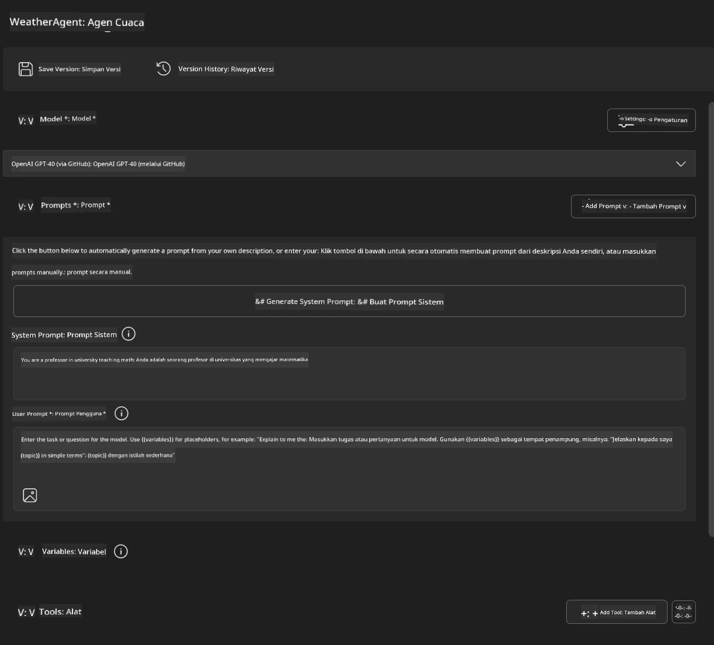
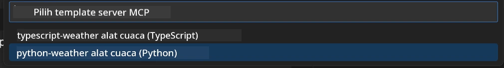
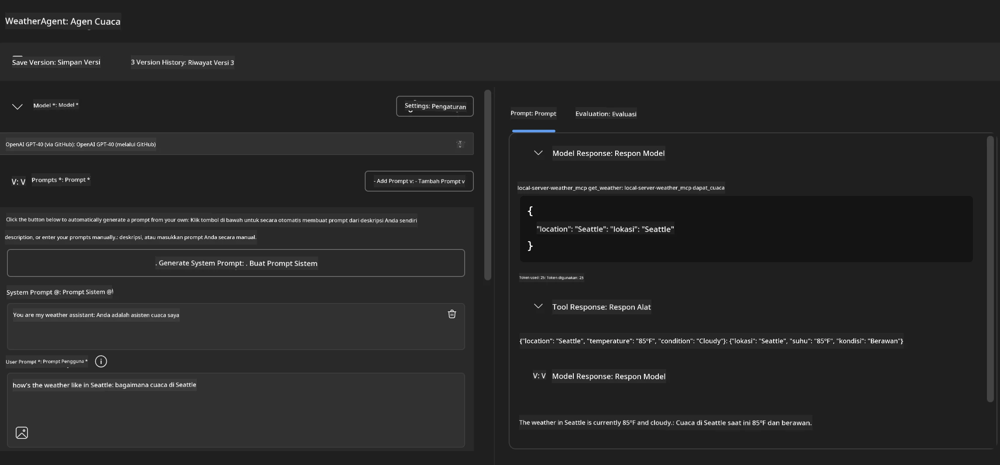
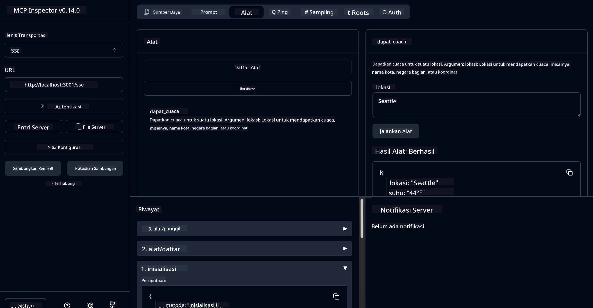

# 🔧 Modul 3: Pengembangan MCP Lanjutan dengan Microsoft Foundry Toolkit

> [!NOTE]
> URL Inspector dalam lab ini menggunakan endpoint legacy `/sse` dan menargetkan
> dependensi MCP SDK `1.9.3` dan Inspector `0.14.0` yang telah dikunci. Mereka bukan
> contoh Streamable HTTP `2026-07-28` yang terkini.


## 🎯 Tujuan Pembelajaran

Pada akhir lab ini, Anda akan dapat:

- ✅ Membuat server MCP khusus menggunakan Microsoft Foundry Toolkit
- ✅ Mengonfigurasi dan menggunakan MCP Python SDK terbaru (v1.9.3)
- ✅ Mengatur dan memanfaatkan MCP Inspector untuk debugging
- ✅ Debug server MCP di lingkungan Agent Builder dan Inspector
- ✅ Memahami alur kerja pengembangan server MCP lanjutan

## 📋 Prasyarat

- Penyelesaian Lab 2 (Dasar-dasar MCP)
- VS Code dengan ekstensi Microsoft Foundry Toolkit terpasang
- Lingkungan Python 3.10+
- Node.js dan npm untuk pengaturan Inspector

## 🏗️ Apa yang Akan Anda Bangun

Dalam lab ini, Anda akan membuat **Weather MCP Server** yang menunjukkan:
- Implementasi server MCP khusus
- Integrasi dengan Microsoft Foundry Toolkit Agent Builder
- Alur kerja debugging profesional
- Pola penggunaan MCP SDK modern

---

## 🔧 Gambaran Komponen Inti

### 🐍 MCP Python SDK
Model Context Protocol Python SDK menyediakan dasar untuk membangun server MCP khusus. Anda akan menggunakan versi 1.9.3 dengan kemampuan debugging yang ditingkatkan.

### 🔍 MCP Inspector
Alat debugging yang kuat yang menyediakan:
- Pemantauan server secara real-time
- Visualisasi eksekusi alat
- Inspeksi permintaan/respons jaringan
- Lingkungan pengujian interaktif

---

## 📖 Implementasi Langkah demi Langkah

### Langkah 1: Buat WeatherAgent di Agent Builder

1. **Luncurkan Agent Builder** di VS Code melalui ekstensi Microsoft Foundry Toolkit
2. **Buat agen baru** dengan konfigurasi berikut:
   - Nama Agen: `WeatherAgent`



### Langkah 2: Inisialisasi Proyek Server MCP

1. **Navigasi ke Tools** → **Add Tool** di Agent Builder
2. **Pilih "MCP Server"** dari opsi yang tersedia
3. **Pilih "Create A new MCP Server"**
4. **Pilih template `python-weather`**
5. **Beri nama server Anda:** `weather_mcp`



### Langkah 3: Buka dan Periksa Proyek

1. **Buka proyek yang dibuat** di VS Code
2. **Tinjau struktur proyek:**
   ```
   weather_mcp/
   ├── src/
   │   ├── __init__.py
   │   └── server.py
   ├── inspector/
   │   ├── package.json
   │   └── package-lock.json
   ├── .vscode/
   │   ├── launch.json
   │   └── tasks.json
   ├── pyproject.toml
   └── README.md
   ```

### Langkah 4: Upgrade ke MCP SDK Terbaru

> **🔍 Mengapa Upgrade?** Kami ingin menggunakan MCP SDK terbaru (v1.9.3) dan layanan Inspector (0.14.0) untuk fitur yang lebih baik dan kemampuan debugging yang lebih ditingkatkan.

#### 4a. Perbarui Dependensi Python

**Edit `pyproject.toml`:** perbarui [./code/weather_mcp/pyproject.toml](../../../../10-StreamliningAIWorkflowsBuildingAnMCPServerWithAIToolkit/lab3/code/weather_mcp/pyproject.toml)


#### 4b. Perbarui Konfigurasi Inspector

**Edit `inspector/package.json`:** perbarui [./code/weather_mcp/inspector/package.json](../../../../10-StreamliningAIWorkflowsBuildingAnMCPServerWithAIToolkit/lab3/code/weather_mcp/inspector/package.json)

#### 4c. Perbarui Dependensi Inspector

**Edit `inspector/package-lock.json`:** perbarui [./code/weather_mcp/inspector/package-lock.json](../../../../10-StreamliningAIWorkflowsBuildingAnMCPServerWithAIToolkit/lab3/code/weather_mcp/inspector/package-lock.json)

> **📝 Catatan:** File ini berisi definisi dependensi yang luas. Di bawah ini adalah struktur penting - isi lengkap menjamin resolusi dependensi yang tepat.


> **⚡ Paket Lock Lengkap:** file package-lock.json lengkap berisi sekitar 3000 baris definisi dependensi. Di atas menunjukkan struktur utama - gunakan file yang disediakan untuk resolusi dependensi lengkap.

### Langkah 5: Konfigurasi Debugging VS Code

*Catatan: Harap salin file di jalur yang ditentukan untuk menggantikan file lokal terkait*

#### 5a. Perbarui Konfigurasi Launch

**Edit `.vscode/launch.json`:**

```json
{
  "version": "0.2.0",
  "configurations": [
    {
      "name": "Attach to Local MCP",
      "type": "debugpy",
      "request": "attach",
      "connect": {
        "host": "localhost",
        "port": 5678
      },
      "presentation": {
        "hidden": true
      },
      "internalConsoleOptions": "neverOpen",
      "postDebugTask": "Terminate All Tasks"
    },
    {
      "name": "Launch Inspector (Edge)",
      "type": "msedge",
      "request": "launch",
      "url": "http://localhost:6274?timeout=60000&serverUrl=http://localhost:3001/sse#tools",
      "cascadeTerminateToConfigurations": [
        "Attach to Local MCP"
      ],
      "presentation": {
        "hidden": true
      },
      "internalConsoleOptions": "neverOpen"
    },
    {
      "name": "Launch Inspector (Chrome)",
      "type": "chrome",
      "request": "launch",
      "url": "http://localhost:6274?timeout=60000&serverUrl=http://localhost:3001/sse#tools",
      "cascadeTerminateToConfigurations": [
        "Attach to Local MCP"
      ],
      "presentation": {
        "hidden": true
      },
      "internalConsoleOptions": "neverOpen"
    }
  ],
  "compounds": [
    {
      "name": "Debug in Agent Builder",
      "configurations": [
        "Attach to Local MCP"
      ],
      "preLaunchTask": "Open Agent Builder",
    },
    {
      "name": "Debug in Inspector (Edge)",
      "configurations": [
        "Launch Inspector (Edge)",
        "Attach to Local MCP"
      ],
      "preLaunchTask": "Start MCP Inspector",
      "stopAll": true
    },
    {
      "name": "Debug in Inspector (Chrome)",
      "configurations": [
        "Launch Inspector (Chrome)",
        "Attach to Local MCP"
      ],
      "preLaunchTask": "Start MCP Inspector",
      "stopAll": true
    }
  ]
}
```

**Edit `.vscode/tasks.json`:**

```
{
  "version": "2.0.0",
  "tasks": [
    {
      "label": "Start MCP Server",
      "type": "shell",
      "command": "python -m debugpy --listen 127.0.0.1:5678 src/__init__.py sse",
      "isBackground": true,
      "options": {
        "cwd": "${workspaceFolder}",
        "env": {
          "PORT": "3001"
        }
      },
      "problemMatcher": {
        "pattern": [
          {
            "regexp": "^.*$",
            "file": 0,
            "location": 1,
            "message": 2
          }
        ],
        "background": {
          "activeOnStart": true,
          "beginsPattern": ".*",
          "endsPattern": "Application startup complete|running"
        }
      }
    },
    {
      "label": "Start MCP Inspector",
      "type": "shell",
      "command": "npm run dev:inspector",
      "isBackground": true,
      "options": {
        "cwd": "${workspaceFolder}/inspector",
        "env": {
          "CLIENT_PORT": "6274",
          "SERVER_PORT": "6277",
        }
      },
      "problemMatcher": {
        "pattern": [
          {
            "regexp": "^.*$",
            "file": 0,
            "location": 1,
            "message": 2
          }
        ],
        "background": {
          "activeOnStart": true,
          "beginsPattern": "Starting MCP inspector",
          "endsPattern": "Proxy server listening on port"
        }
      },
      "dependsOn": [
        "Start MCP Server"
      ]
    },
    {
      "label": "Open Agent Builder",
      "type": "shell",
      "command": "echo ${input:openAgentBuilder}",
      "presentation": {
        "reveal": "never"
      },
      "dependsOn": [
        "Start MCP Server"
      ],
    },
    {
      "label": "Terminate All Tasks",
      "command": "echo ${input:terminate}",
      "type": "shell",
      "problemMatcher": []
    }
  ],
  "inputs": [
    {
      "id": "openAgentBuilder",
      "type": "command",
      "command": "ai-mlstudio.agentBuilder",
      "args": {
        "initialMCPs": [ "local-server-weather_mcp" ],
        "triggeredFrom": "vsc-tasks"
      }
    },
    {
      "id": "terminate",
      "type": "command",
      "command": "workbench.action.tasks.terminate",
      "args": "terminateAll"
    }
  ]
}
```


---

## 🚀 Menjalankan dan Menguji Server MCP Anda

### Langkah 6: Instal Dependensi

Setelah melakukan perubahan konfigurasi, jalankan perintah berikut:

**Instal dependensi Python:**
```bash
uv sync
```

**Instal dependensi Inspector:**
```bash
cd inspector
npm install
```

### Langkah 7: Debug dengan Agent Builder

1. **Tekan F5** atau gunakan konfigurasi **"Debug in Agent Builder"**
2. **Pilih konfigurasi compound** dari panel debug
3. **Tunggu server mulai** dan Agent Builder terbuka
4. **Uji server weather MCP Anda** dengan kueri bahasa alami

Masukkan prompt seperti ini

SYSTEM_PROMPT

```
You are my weather assistant
```

USER_PROMPT

```
How's the weather like in Seattle
```



### Langkah 8: Debug dengan MCP Inspector

1. **Gunakan konfigurasi "Debug in Inspector"** (Edge atau Chrome)
2. **Buka antarmuka Inspector** di `http://localhost:6274`
3. **Jelajahi lingkungan pengujian interaktif:**
   - Lihat alat yang tersedia
   - Uji eksekusi alat
   - Pantau permintaan jaringan
   - Debug respons server



---

## 🎯 Hasil Pembelajaran Utama

Dengan menyelesaikan lab ini, Anda telah:

- [x] **Membuat server MCP khusus** menggunakan template Microsoft Foundry Toolkit
- [x] **Meng-upgrade ke MCP SDK terbaru** (v1.9.3) untuk fungsi yang lebih baik
- [x] **Mengonfigurasi alur kerja debugging profesional** untuk Agent Builder dan Inspector
- [x] **Mengatur MCP Inspector** untuk pengujian server interaktif
- [x] **Menguasai konfigurasi debugging VS Code** untuk pengembangan MCP

## 🔧 Fitur Lanjutan yang Dieksplorasi

| Fitur | Deskripsi | Kasus Penggunaan |
|---------|-------------|----------|
| **MCP Python SDK v1.9.3** | Implementasi protokol terbaru | Pengembangan server modern |
| **MCP Inspector 0.14.0** | Alat debugging interaktif | Pengujian server secara real-time |
| **Debugging VS Code** | Lingkungan pengembangan terintegrasi | Alur kerja debugging profesional |
| **Integrasi Agent Builder** | Koneksi langsung Microsoft Foundry Toolkit | Pengujian agen end-to-end |

## 📚 Sumber Daya Tambahan

- [Dokumentasi MCP Python SDK](https://modelcontextprotocol.io/docs/sdk/python)
- [Panduan Ekstensi Microsoft Foundry Toolkit](https://code.visualstudio.com/docs/ai/ai-toolkit)
- [Dokumentasi Debugging VS Code](https://code.visualstudio.com/docs/editor/debugging)
- [Spesifikasi Model Context Protocol](https://modelcontextprotocol.io/docs/concepts/architecture)

---

**🎉 Selamat!** Anda telah berhasil menyelesaikan Lab 3 dan sekarang dapat membuat, debug, dan menerapkan server MCP khusus menggunakan alur kerja pengembangan profesional.

### 🔜 Lanjut ke Modul Berikutnya

Siap menerapkan keterampilan MCP Anda ke alur kerja pengembangan dunia nyata? Lanjutkan ke **[Modul 4: Pengembangan MCP Praktis - Server Clone GitHub Kustom](../lab4/README.md)** di mana Anda akan:
- Membangun server MCP siap produksi yang mengotomatisasi operasi repositori GitHub
- Menerapkan fungsi cloning repositori GitHub melalui MCP
- Mengintegrasikan server MCP kustom dengan VS Code dan GitHub Copilot Agent Mode
- Menguji dan menerapkan server MCP kustom di lingkungan produksi
- Mempelajari otomasi alur kerja praktis untuk pengembang

---

<!-- CO-OP TRANSLATOR DISCLAIMER START -->
**Penafian**:
Dokumen ini telah diterjemahkan menggunakan layanan terjemahan AI [Co-op Translator](https://github.com/Azure/co-op-translator). Meskipun kami berupaya untuk mencapai akurasi, harap diketahui bahwa terjemahan otomatis mungkin mengandung kesalahan atau ketidakakuratan. Dokumen asli dalam bahasa aslinya harus dianggap sebagai sumber yang sah. Untuk informasi penting, disarankan menggunakan terjemahan profesional oleh manusia. Kami tidak bertanggung jawab atas kesalahpahaman atau penafsiran yang keliru yang timbul dari penggunaan terjemahan ini.
<!-- CO-OP TRANSLATOR DISCLAIMER END -->