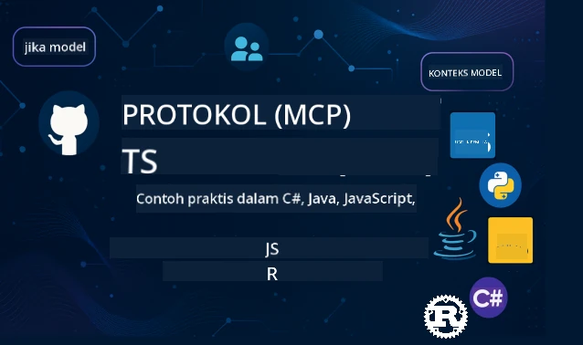

 

[](https://GitHub.com/microsoft/mcp-for-beginners/graphs/contributors)
[](https://GitHub.com/microsoft/mcp-for-beginners/issues)
[](https://GitHub.com/microsoft/mcp-for-beginners/pulls)
[](http://makeapullrequest.com)

[](https://GitHub.com/microsoft/mcp-for-beginners/watchers)
[](https://GitHub.com/microsoft/mcp-for-beginners/fork)
[](https://GitHub.com/microsoft/mcp-for-beginners/stargazers)


[](https://discord.gg/nTYy5BXMWG)

Ikuti langkah-langkah ini untuk memulai menggunakan sumber daya ini:
1. **Fork Repositori**: Klik [](https://GitHub.com/microsoft/mcp-for-beginners/fork)
2. **Clone Repositori**:   `git clone https://github.com/microsoft/mcp-for-beginners.git`
3. **Bergabung Dengan** [](https://discord.gg/nTYy5BXMWG)


### 🌐 Dukungan Multi Bahasa

#### Didukung melalui GitHub Action (Otomatis & Selalu Terbaru)

<!-- CO-OP TRANSLATOR LANGUAGES TABLE START -->
[Arab](../ar/README.md) | [Bengali](../bn/README.md) | [Bulgaria](../bg/README.md) | [Burmese (Myanmar)](../my/README.md) | [Cina (Sederhana)](../zh-CN/README.md) | [Cina (Tradisional, Hong Kong)](../zh-HK/README.md) | [Cina (Tradisional, Macau)](../zh-MO/README.md) | [Cina (Tradisional, Taiwan)](../zh-TW/README.md) | [Kroasia](../hr/README.md) | [Ceko](../cs/README.md) | [Denmark](../da/README.md) | [Belanda](../nl/README.md) | [Estonia](../et/README.md) | [Finlandia](../fi/README.md) | [Prancis](../fr/README.md) | [Jerman](../de/README.md) | [Yunani](../el/README.md) | [Ibrani](../he/README.md) | [Hindi](../hi/README.md) | [Hungaria](../hu/README.md) | [Indonesia](./README.md) | [Italia](../it/README.md) | [Jepang](../ja/README.md) | [Kannada](../kn/README.md) | [Korea](../ko/README.md) | [Lithuania](../lt/README.md) | [Melayu](../ms/README.md) | [Malayalam](../ml/README.md) | [Marathi](../mr/README.md) | [Nepali](../ne/README.md) | [Pidgin Nigeria](../pcm/README.md) | [Norwegia](../no/README.md) | [Persia (Farsi)](../fa/README.md) | [Polandia](../pl/README.md) | [Portugis (Brasil)](../pt-BR/README.md) | [Portugis (Portugal)](../pt-PT/README.md) | [Punjabi (Gurmukhi)](../pa/README.md) | [Rumania](../ro/README.md) | [Rusia](../ru/README.md) | [Serbia (Sirilik)](../sr/README.md) | [Slovakia](../sk/README.md) | [Slovenia](../sl/README.md) | [Spanyol](../es/README.md) | [Swahili](../sw/README.md) | [Swedia](../sv/README.md) | [Tagalog (Filipina)](../tl/README.md) | [Tamil](../ta/README.md) | [Telugu](../te/README.md) | [Thai](../th/README.md) | [Turki](../tr/README.md) | [Ukraina](../uk/README.md) | [Urdu](../ur/README.md) | [Vietnam](../vi/README.md)

> **Lebih Suka Clone Lokal?**

> Repositori ini mencakup lebih dari 50 terjemahan bahasa yang secara signifikan meningkatkan ukuran unduhan. Untuk menge-clone tanpa terjemahan, gunakan sparse checkout:
> ```bash
> git clone --filter=blob:none --sparse https://github.com/microsoft/mcp-for-beginners.git
> cd mcp-for-beginners
> git sparse-checkout set --no-cone '/*' '!translations' '!translated_images'
> ```
> Ini memberi Anda semua yang diperlukan untuk menyelesaikan kursus dengan unduhan yang jauh lebih cepat.
<!-- CO-OP TRANSLATOR LANGUAGES TABLE END -->

# 🚀 Kurikulum Model Context Protocol (MCP) untuk Pemula

## **Pelajari MCP dengan Contoh Kode Langsung dalam C#, Java, JavaScript, Rust, Python, dan TypeScript**

## 🧠 Gambaran Umum Kurikulum Model Context Protocol
Selamat datang di perjalanan Anda menuju Model Context Protocol! Jika Anda pernah bertanya-tanya bagaimana aplikasi AI berkomunikasi dengan berbagai alat dan layanan, Anda akan segera menemukan solusi elegan yang mengubah cara pengembang membangun sistem cerdas.

Pikirkan MCP sebagai penerjemah universal untuk aplikasi AI - seperti bagaimana port USB memungkinkan Anda menghubungkan perangkat apa pun ke komputer Anda, MCP memungkinkan model AI terhubung dengan alat atau layanan apa pun dengan cara yang distandarisasi. Baik Anda sedang membangun chatbot pertama Anda atau mengerjakan alur kerja AI yang kompleks, memahami MCP akan memberi Anda kekuatan untuk membuat aplikasi yang lebih mumpuni dan fleksibel.

Kurikulum ini dirancang dengan kesabaran dan perhatian untuk perjalanan belajar Anda. Kami akan mulai dengan konsep sederhana yang sudah Anda pahami dan secara bertahap membangun keahlian Anda melalui praktik langsung dalam bahasa pemrograman favorit Anda. Setiap langkah mencakup penjelasan yang jelas, contoh praktis, dan banyak dorongan sepanjang perjalanan.

Pada saat Anda menyelesaikan perjalanan ini, Anda akan memiliki kepercayaan diri untuk membangun server MCP Anda sendiri, mengintegrasikannya dengan platform AI populer, dan memahami bagaimana teknologi ini membentuk ulang masa depan pengembangan AI. Mari kita mulai petualangan seru ini bersama-sama!

### Dokumentasi dan Spesifikasi Resmi

Sumber daya ini akan menjadi lebih berharga seiring meningkatnya pemahaman Anda, tetapi jangan merasa tertekan untuk membaca semuanya segera. Mulailah dengan area yang paling menarik bagi Anda!
- 📘 [Dokumentasi MCP](https://modelcontextprotocol.io/) – Ini adalah sumber daya utama Anda untuk tutorial langkah demi langkah dan panduan pengguna. Dokumentasi ditulis dengan pemula dalam pikiran, menyediakan contoh jelas yang dapat Anda ikuti dengan kecepatan Anda sendiri.
- 📜 [Spesifikasi MCP](https://modelcontextprotocol.io/docs/) – Anggap ini sebagai manual referensi lengkap Anda. Saat Anda mengerjakan kurikulum, Anda akan sering kembali ke sini untuk mencari detail spesifik dan menjelajahi fitur-fitur lanjutan.
- 📜 [Spesifikasi MCP Asli](https://modelcontextprotocol.io/specification/versioning) – Ini berisi rincian teknis tambahan yang dapat berguna untuk implementasi lanjutan. Ada di sana saat Anda membutuhkannya, tapi jangan khawatir saat Anda baru mulai.
- 🧑‍💻 [Repositori MCP di GitHub](https://github.com/modelcontextprotocol) – Di sini Anda akan menemukan SDK, alat, dan contoh kode dalam berbagai bahasa pemrograman. Ini seperti harta karun contoh praktis dan komponen siap pakai.
- 🌐 [Komunitas MCP](https://github.com/orgs/modelcontextprotocol/discussions) – Bergabunglah dengan sesama pembelajar dan pengembang berpengalaman dalam diskusi tentang MCP. Ini adalah komunitas yang mendukung di mana pertanyaan disambut dan pengetahuan dibagikan secara bebas.
  
## Tujuan Pembelajaran

Pada akhir kurikulum ini, Anda akan merasa percaya diri dan bersemangat dengan kemampuan baru Anda. Berikut yang akan Anda capai:

• **Memahami dasar-dasar MCP**: Anda akan mengerti apa itu Model Context Protocol dan mengapa ini merevolusi cara aplikasi AI bekerja sama, menggunakan analogi dan contoh yang masuk akal.

• **Membangun server MCP pertama Anda**: Anda akan membuat server MCP yang berfungsi dalam bahasa pemrograman pilihan Anda, dimulai dengan contoh sederhana dan meningkatkan keterampilan langkah demi langkah.

• **Menghubungkan model AI ke alat nyata**: Anda akan belajar cara menjembatani kesenjangan antara model AI dan layanan nyata, memberi aplikasi Anda kemampuan baru yang kuat.

• **Menerapkan praktik keamanan terbaik**: Anda akan mengerti cara menjaga implementasi MCP Anda aman dan terlindungi, melindungi baik aplikasi Anda maupun pengguna Anda.

• **Menyebarkan dengan percaya diri**: Anda akan mengetahui cara membawa proyek MCP Anda dari pengembangan ke produksi, dengan strategi penyebaran praktis yang bekerja di dunia nyata.

• **Bergabung dengan komunitas MCP**: Anda akan menjadi bagian dari komunitas pengembang yang berkembang yang membentuk masa depan pengembangan aplikasi AI.

## Latar Belakang Penting

Sebelum kita menyelami spesifik MCP, mari pastikan Anda merasa nyaman dengan beberapa konsep dasar. Jangan khawatir jika Anda bukan ahli di bidang ini - kami akan menjelaskan semua yang perlu Anda ketahui saat kita berjalan!

### Memahami Protokol (Dasar)

Pikirkan protokol seperti aturan untuk sebuah percakapan. Ketika Anda menelepon teman, Anda berdua tahu untuk mengatakan "halo" saat menjawab, bergantian berbicara, dan mengucapkan "selamat tinggal" saat selesai. Program komputer membutuhkan aturan serupa untuk berkomunikasi secara efektif.

MCP adalah sebuah protokol - seperangkat aturan yang disepakati yang membantu model AI dan aplikasi memiliki "percakapan" yang produktif dengan alat dan layanan. Sama seperti aturan percakapan membuat komunikasi manusia lebih lancar, memiliki MCP membuat komunikasi aplikasi AI jauh lebih dapat diandalkan dan kuat.

### Hubungan Klien-Server (Bagaimana Program Bekerja Sama)

Anda sudah menggunakan hubungan klien-server setiap hari! Saat Anda menggunakan browser web (klien) untuk mengunjungi sebuah situs, Anda terhubung ke server web yang mengirimkan konten halaman. Browser tahu cara meminta informasi, dan server tahu cara merespons.

Dalam MCP, kita memiliki hubungan serupa: model AI bertindak sebagai klien yang meminta informasi atau tindakan, sementara server MCP menyediakan kemampuan tersebut. Ini seperti memiliki asisten yang membantu (server) yang bisa diminta AI untuk melakukan tugas tertentu.

### Mengapa Standarisasi Penting (Membuat Segalanya Bekerja Bersama)

Bayangkan jika setiap produsen mobil menggunakan bentuk pompa bahan bakar yang berbeda - Anda akan membutuhkan adaptor berbeda untuk setiap mobil! Standarisasi berarti menyetujui pendekatan umum sehingga semuanya bekerja bersama dengan mulus.

MCP menyediakan standarisasi ini untuk aplikasi AI. Alih-alih setiap model AI perlu kode khusus untuk bekerja dengan setiap alat, MCP menciptakan cara universal untuk mereka berkomunikasi. Ini berarti pengembang dapat membuat alat sekali dan membuatnya bekerja dengan banyak sistem AI berbeda.

## 🧭 Gambaran Jalur Pembelajaran Anda

Perjalanan MCP Anda disusun dengan hati-hati untuk membangun kepercayaan diri dan keterampilan secara progresif. Setiap fase memperkenalkan konsep baru sambil memperkuat apa yang sudah Anda pelajari.

### 🌱 Fase Dasar: Memahami Dasar-dasar (Modul 0-2)

Inilah awal petualangan Anda! Kami akan memperkenalkan Anda pada konsep MCP menggunakan analogi yang familiar dan contoh sederhana. Anda akan memahami apa itu MCP, mengapa itu ada, dan bagaimana tempatnya dalam dunia pengembangan AI yang lebih besar.

• **Modul 0 - Pengenalan MCP**: Kami akan mulai dengan menjelajahi apa itu MCP dan mengapa sangat penting untuk aplikasi AI modern. Anda akan melihat contoh nyata MCP dalam aksi dan memahami bagaimana MCP memecahkan masalah umum yang dihadapi pengembang.

• **Modul 1 - Penjelasan Konsep Inti**: Di sini Anda akan belajar blok bangunan penting dari MCP. Kami akan menggunakan banyak analogi dan contoh visual untuk memastikan konsep ini terasa alami dan mudah dipahami.

• **Modul 2 - Keamanan dalam MCP**: Keamanan mungkin terdengar menakutkan, tetapi kami akan menunjukkan bagaimana MCP mencakup fitur keamanan bawaan dan mengajarkan praktik terbaik yang melindungi aplikasi Anda sejak awal.

### 🔨 Fase Pembangunan: Membuat Implementasi Pertama Anda (Modul 3)

Sekarang keseruan sesungguhnya dimulai! Anda akan mendapatkan pengalaman langsung membangun server dan klien MCP yang nyata. Jangan khawatir - kami akan mulai dari yang sederhana dan memandu Anda melalui setiap langkah.

Modul ini mencakup beberapa panduan langsung yang memungkinkan Anda berlatih dalam bahasa pemrograman pilihan Anda. Anda akan membuat server pertama Anda, membangun klien untuk terhubung ke server tersebut, dan bahkan mengintegrasikan dengan alat pengembangan populer seperti VS Code.
Setiap panduan mencakup contoh kode lengkap, tips pemecahan masalah, dan penjelasan mengapa kami membuat pilihan desain tertentu. Pada akhir fase ini, Anda akan memiliki implementasi MCP yang berfungsi yang dapat Anda banggakan!

### 🚀 Fase Pertumbuhan: Konsep Lanjutan dan Aplikasi Dunia Nyata (Modul 4-5)

Setelah menguasai dasar-dasar, Anda siap menjelajahi fitur MCP yang lebih canggih. Kami akan membahas strategi implementasi praktis, teknik debugging, dan topik lanjutan seperti integrasi AI multi-modal.

Anda juga akan belajar cara skalakan implementasi MCP Anda untuk penggunaan produksi dan integrasi dengan platform cloud seperti Azure. Modul-modul ini mempersiapkan Anda untuk membangun solusi MCP yang dapat menangani tuntutan dunia nyata.

### 🌟 Fase Penguasaan: Komunitas dan Spesialisasi (Modul 6-11)

Fase terakhir berfokus pada bergabung dengan komunitas MCP dan mengkhususkan diri pada area yang paling menarik bagi Anda. Anda akan belajar cara berkontribusi pada proyek MCP open-source, menerapkan pola otentikasi lanjutan, dan membangun solusi terpadu dengan database secara komprehensif.

Modul 11 layak mendapat perhatian khusus - ini adalah jalur pembelajaran praktis lengkap dengan 13 lab yang mengajarkan Anda membangun server MCP siap produksi dengan integrasi PostgreSQL. Ini seperti proyek puncak yang menggabungkan semua yang sudah Anda pelajari!

### 📚 Struktur Kurikulum Lengkap

| Modul | Topik | Deskripsi | Tautan |
|--------|-------|-------------|------|
| **Modul 1-3: Dasar-Dasar** | | | |
| 00 | Pengantar MCP | Ikhtisar Model Context Protocol dan pentingnya dalam pipeline AI | [Baca lebih lanjut](./00-Introduction/README.md) |
| 01 | Penjelasan Konsep Inti | Eksplorasi mendalam tentang konsep inti MCP | [Baca lebih lanjut](./01-CoreConcepts/README.md) |
| 02 | Keamanan di MCP | Ancaman keamanan dan praktik terbaik | [Baca lebih lanjut](./02-Security/README.md) |
| 03 | Memulai dengan MCP | Pengaturan lingkungan, server/klien dasar, integrasi | [Baca lebih lanjut](./03-GettingStarted/README.md) |
| **Modul 3: Membangun Server & Klien Pertama Anda** | | | |
| 3.1 | Server Pertama | Membuat server MCP pertama Anda | [Panduan](./03-GettingStarted/01-first-server/README.md) |
| 3.2 | Klien Pertama | Mengembangkan klien MCP dasar | [Panduan](./03-GettingStarted/02-client/README.md) |
| 3.3 | Klien dengan LLM | Integrasi model bahasa besar | [Panduan](./03-GettingStarted/03-llm-client/README.md) |
| 3.4 | Integrasi VS Code | Menggunakan server MCP di VS Code | [Panduan](./03-GettingStarted/04-vscode/README.md) |
| 3.5 | Server stdio | Membuat server menggunakan transport stdio | [Panduan](./03-GettingStarted/05-stdio-server/README.md) |
| 3.6 | Streaming HTTP | Menerapkan streaming HTTP dalam MCP | [Panduan](./03-GettingStarted/06-http-streaming/README.md) |
| 3.7 | AI Toolkit | Menggunakan AI Toolkit dengan MCP | [Panduan](./03-GettingStarted/07-aitk/README.md) |
| 3.8 | Pengujian | Menguji implementasi server MCP Anda | [Panduan](./03-GettingStarted/08-testing/README.md) |
| 3.9 | Deploy | Mendeploy server MCP ke produksi | [Panduan](./03-GettingStarted/09-deployment/README.md) |
| 3.10 | Penggunaan server lanjutan | Menggunakan server lanjutan untuk fitur-fitur canggih dan arsitektur yang lebih baik | [Panduan](./03-GettingStarted/10-advanced/README.md) |
| 3.11 | Otentikasi sederhana | Bab yang menunjukkan otentikasi dari awal dan RBAC | [Panduan](./03-GettingStarted/11-simple-auth/README.md) |
| **Modul 4-5: Praktis & Lanjutan** | | | |
| 04 | Implementasi Praktis | SDK, debugging, pengujian, template prompt yang bisa dipakai ulang | [Baca lebih lanjut](./04-PracticalImplementation/README.md) |
| 05 | Topik Lanjutan di MCP | AI multi-modal, skalabilitas, penggunaan enterprise | [Baca lebih lanjut](./05-AdvancedTopics/README.md) |
| 5.1 | Integrasi Azure | Integrasi MCP dengan Azure | [Panduan](./05-AdvancedTopics/mcp-integration/README.md) |
| 5.2 | Multi-modalitas | Bekerja dengan banyak modalitas | [Panduan](./05-AdvancedTopics/mcp-multi-modality/README.md) |
| 5.3 | Demo OAuth2 | Menerapkan otentikasi OAuth2 | [Panduan](./05-AdvancedTopics/mcp-oauth2-demo/README.md) |
| 5.4 | Konteks Root | Memahami dan menerapkan konteks root | [Panduan](./05-AdvancedTopics/mcp-root-contexts/README.md) |
| 5.5 | Routing | Strategi routing MCP | [Panduan](./05-AdvancedTopics/mcp-routing/README.md) |
| 5.6 | Sampling | Teknik sampling dalam MCP | [Panduan](./05-AdvancedTopics/mcp-sampling/README.md) |
| 5.7 | Skalabilitas | Melakukan skalasi implementasi MCP | [Panduan](./05-AdvancedTopics/mcp-scaling/README.md) |
| 5.8 | Keamanan | Pertimbangan keamanan lanjutan | [Panduan](./05-AdvancedTopics/mcp-security/README.md) |
| 5.9 | Pencarian Web | Menerapkan kemampuan pencarian web | [Panduan](./05-AdvancedTopics/web-search-mcp/README.md) |
| 5.10 | Streaming Real-time | Membangun fungsionalitas streaming real-time | [Panduan](./05-AdvancedTopics/mcp-realtimestreaming/README.md) |
| 5.11 | Pencarian Real-time | Menerapkan pencarian real-time | [Panduan](./05-AdvancedTopics/mcp-realtimesearch/README.md) |
| 5.12 | Otentikasi Entra ID | Otentikasi dengan Microsoft Entra ID | [Panduan](./05-AdvancedTopics/mcp-security-entra/README.md) |
| 5.13 | Integrasi Foundry | Integrasi dengan Azure AI Foundry | [Panduan](./05-AdvancedTopics/mcp-foundry-agent-integration/README.md) |
| 5.14 | Rekayasa Konteks | Teknik untuk rekayasa konteks yang efektif | [Panduan](./05-AdvancedTopics/mcp-contextengineering/README.md) |
| 5.15 | Transportasi Kustom MCP | Implementasi transportasi kustom | [Panduan](./05-AdvancedTopics/mcp-transport/README.md) |
| **Modul 6-10: Komunitas & Praktik Terbaik** | | | |
| 06 | Kontribusi Komunitas | Cara berkontribusi ke ekosistem MCP | [Panduan](./06-CommunityContributions/README.md) |
| 07 | Wawasan dari Adopsi Awal | Cerita implementasi dunia nyata | [Panduan](./07-LessonsFromEarlyAdoption/README.md) |
| 08 | Praktik Terbaik untuk MCP | Performa, toleransi kesalahan, ketahanan | [Panduan](./08-BestPractices/README.md) |
| 09 | Studi Kasus MCP | Contoh implementasi praktis | [Panduan](./09-CaseStudy/README.md) |
| 10 | Workshop Praktis | Membangun Server MCP dengan AI Toolkit | [Lab](./10-StreamliningAIWorkflowsBuildingAnMCPServerWithAIToolkit/README.md) |
| **Modul 11: Lab Praktis Server MCP** | | | |
| 11 | Integrasi Database Server MCP | Jalur pembelajaran praktis lengkap 13 lab untuk integrasi PostgreSQL | [Lab](./11-MCPServerHandsOnLabs/README.md) |
| 11.1 | Pengantar | Ikhtisar MCP dengan integrasi database dan studi kasus analitik ritel | [Lab 00](./11-MCPServerHandsOnLabs/00-Introduction/README.md) |
| 11.2 | Arsitektur Inti | Memahami arsitektur server MCP, lapisan database, dan pola keamanan | [Lab 01](./11-MCPServerHandsOnLabs/01-Architecture/README.md) |
| 11.3 | Keamanan & Multi-Tenancy | Row Level Security, otentikasi, dan akses data multi-tenant | [Lab 02](./11-MCPServerHandsOnLabs/02-Security/README.md) |
| 11.4 | Pengaturan Lingkungan | Menyiapkan lingkungan pengembangan, Docker, sumber daya Azure | [Lab 03](./11-MCPServerHandsOnLabs/03-Setup/README.md) |
| 11.5 | Desain Database | Setup PostgreSQL, desain skema ritel, dan data contoh | [Lab 04](./11-MCPServerHandsOnLabs/04-Database/README.md) |
| 11.6 | Implementasi Server MCP | Membangun server FastMCP dengan integrasi database | [Lab 05](./11-MCPServerHandsOnLabs/05-MCP-Server/README.md) |
| 11.7 | Pengembangan Alat | Membuat alat query database dan introspeksi skema | [Lab 06](./11-MCPServerHandsOnLabs/06-Tools/README.md) |
| 11.8 | Pencarian Semantik | Menerapkan vector embedding dengan Azure OpenAI dan pgvector | [Lab 07](./11-MCPServerHandsOnLabs/07-Semantic-Search/README.md) |
| 11.9 | Pengujian & Debugging | Strategi pengujian, alat debugging, dan pendekatan validasi | [Lab 08](./11-MCPServerHandsOnLabs/08-Testing/README.md) |
| 11.10 | Integrasi VS Code | Mengonfigurasi integrasi MCP di VS Code dan penggunaan AI Chat | [Lab 09](./11-MCPServerHandsOnLabs/09-VS-Code/README.md) |
| 11.11 | Strategi Deploy | Deploy Docker, Azure Container Apps, dan pertimbangan skalabilitas | [Lab 10](./11-MCPServerHandsOnLabs/10-Deployment/README.md) |
| 11.12 | Pemantauan | Application Insights, logging, pemantauan performa | [Lab 11](./11-MCPServerHandsOnLabs/11-Monitoring/README.md) |
| 11.13 | Praktik Terbaik | Optimasi performa, penguatan keamanan, dan tips produksi | [Lab 12](./11-MCPServerHandsOnLabs/12-Best-Practices/README.md) |

### 💻 Proyek Contoh Kode

Salah satu bagian paling menarik dari belajar MCP adalah melihat keterampilan kode Anda berkembang secara bertahap. Kami merancang contoh kode kami agar dimulai dari yang sederhana dan tumbuh semakin canggih seiring pemahaman Anda mendalam. Begini cara kami memperkenalkan konsep—dengan kode yang mudah dimengerti tetapi menunjukkan prinsip MCP nyata, Anda akan mengerti bukan hanya apa yang dilakukan kode ini, tetapi mengapa strukturnya seperti itu dan bagaimana ini masuk ke aplikasi MCP yang lebih besar.

#### Contoh Kalkulator MCP Dasar

| Bahasa | Deskripsi | Tautan |
|----------|-------------|------|
| C# | Contoh Server MCP | [Lihat Kode](./03-GettingStarted/samples/csharp/README.md) |
| Java | Kalkulator MCP | [Lihat Kode](./03-GettingStarted/samples/java/calculator/README.md) |
| JavaScript | Demo MCP | [Lihat Kode](./03-GettingStarted/samples/javascript/README.md) |
| Python | Server MCP | [Lihat Kode](../../03-GettingStarted/samples/python/mcp_calculator_server.py) |
| TypeScript | Contoh MCP | [Lihat Kode](./03-GettingStarted/samples/typescript/README.md) |
| Rust | Contoh MCP | [Lihat Kode](./03-GettingStarted/samples/rust/README.md) |

#### Implementasi MCP Lanjutan

| Bahasa | Deskripsi | Tautan |
|----------|-------------|------|
| C# | Contoh Lanjutan | [Lihat Kode](./04-PracticalImplementation/samples/csharp/README.md) |
| Java dengan Spring | Contoh Container App | [Lihat Kode](./04-PracticalImplementation/samples/java/containerapp/README.md) |
| JavaScript | Contoh Lanjutan | [Lihat Kode](./04-PracticalImplementation/samples/javascript/README.md) |
| Python | Implementasi Kompleks | [Lihat Kode](../../04-PracticalImplementation/samples/python/READMEmd) |
| TypeScript | Contoh Container | [Lihat Kode](./04-PracticalImplementation/samples/typescript/README.md) |


## 🎯 Prasyarat untuk Belajar MCP

Agar mendapatkan hasil maksimal dari kurikulum ini, Anda sebaiknya memiliki:

- Pengetahuan dasar pemrograman dalam setidaknya salah satu bahasa berikut: C#, Java, JavaScript, Python, atau TypeScript
- Pemahaman tentang model klien-server dan API
- Familiaritas dengan konsep REST dan HTTP
- (Opsional) Latar belakang dalam konsep AI/ML

- Bergabung dalam diskusi komunitas kami untuk dukungan

## 📚 Panduan Studi & Sumber Daya

Repositori ini mencakup beberapa sumber daya untuk membantu Anda menavigasi dan belajar secara efektif:

### Panduan Studi

Panduan [Study Guide](./study_guide.md) yang komprehensif tersedia untuk membantu Anda menavigasi repositori ini secara efektif. Peta kurikulum visual ini menunjukkan bagaimana semua topik terhubung dan memberikan panduan cara menggunakan proyek contoh secara efektif. Ini sangat membantu jika Anda pembelajar visual yang suka melihat gambaran besar.

Panduan ini mencakup:
- Peta kurikulum visual yang menunjukkan semua topik yang dibahas
- Rincian setiap bagian repositori
- Panduan cara menggunakan proyek contoh
- Jalur pembelajaran yang direkomendasikan sesuai tingkat keterampilan
- Sumber daya tambahan untuk melengkapi perjalanan pembelajaran Anda

### Catatan Perubahan

Kami memelihara [Changelog](./changelog.md) yang mendetail untuk melacak semua pembaruan penting materi kurikulum, sehingga Anda bisa tetap mengikuti perkembangan terbaru dan tambahan fitur.
- Penambahan konten baru
- Perubahan struktur
- Peningkatan fitur
- Pembaruan dokumentasi

## 🛠️ Cara Menggunakan Kurikulum Ini Secara Efektif

Setiap pelajaran dalam panduan ini mencakup:
1. Penjelasan jelas tentang konsep MCP  
2. Contoh kode langsung dalam berbagai bahasa  
3. Latihan untuk membangun aplikasi MCP nyata  
4. Sumber daya tambahan untuk pembelajar tingkat lanjut

## Konten Sesuai Permintaan

### [MCP Dev Days Juli 2025](https://developer.microsoft.com/en-us/reactor/series/S-1563/)
#### [➡️Tonton Sesuai Permintaan - MCP Dev Days](https://developer.microsoft.com/en-us/reactor/series/S-1563/)
Bersiaplah untuk dua hari wawasan teknis mendalam, koneksi komunitas, dan pembelajaran langsung di MCP Dev Days, sebuah acara virtual yang didedikasikan untuk Model Context Protocol (MCP) — standar baru yang menghubungkan model AI dan alat yang mereka gunakan.  
Anda dapat menonton MCP Dev Days dengan mendaftar di halaman acara kami: https://aka.ms/mcpdevdays.

#### [Hari 1: Produktivitas MCP, DevTools, & Komunitas:](https://developer.microsoft.com/en-us/reactor/series/S-1563/)

Berfokus pada pemberdayaan pengembang untuk menggunakan MCP dalam alur kerja pengembangan mereka dan merayakan komunitas MCP yang luar biasa. Kami akan bergabung dengan anggota komunitas dan mitra seperti Arcade, Block, Okta, dan Neon untuk melihat bagaimana mereka bekerja sama dengan Microsoft membangun ekosistem MCP yang terbuka dan dapat diperluas. Demo dunia nyata di VS Code, Visual Studio, GitHub Copilot, dan alat komunitas populer  
Alur kerja dev yang praktis dan berbasis konteks  
Sesi dan wawasan yang dipimpin komunitas  
Baik Anda baru memulai dengan MCP atau sudah membangunnya, Hari 1 akan menyajikan inspirasi dan pelajaran yang dapat langsung diterapkan.

#### [Hari 2: Bangun Server MCP dengan Percaya Diri](https://developer.microsoft.com/en-us/reactor/series/S-1563/)

Didedikasikan untuk pembangun MCP. Kami akan membahas strategi implementasi mendalam dan praktik terbaik untuk membuat server MCP serta mengintegrasikan MCP ke dalam alur kerja AI Anda.

#### Topik meliputi:

- Membangun Server MCP dan mengintegrasikannya ke dalam pengalaman agen  
- Pengembangan berbasis prompt  
- Praktik terbaik keamanan  
- Menggunakan blok bangunan seperti Fungsi, ACA, dan Manajemen API  
- Penyelarasan dan alat registri (1P + 3P)  

Jika Anda seorang pengembang, pembuat alat, atau ahli strategi produk AI, hari ini penuh wawasan yang Anda butuhkan untuk membangun solusi MCP yang skalabel, aman, dan siap masa depan.

### Boot Camp MCP Agustus 2025  
Pelajari dalam sesi video intensif cara membuat server MCP, integrasi dengan VS Code, dan penyebaran profesional di Azure berdasarkan materi dari kurikulum MCP untuk Pemula. Dapatkan keterampilan praktis dalam teknologi yang sudah digunakan oleh perusahaan besar.

#### [➡️Tonton Sesuai Permintaan MCP Bootcamp | Bahasa Inggris](https://developer.microsoft.com/en-us/reactor/series/s-1568/)
#### [➡️Tonton Sesuai Permintaan MCP Bootcamp | Brasil](https://developer.microsoft.com/en-us/reactor/series/S-1566/)
#### [➡️Tonton Sesuai Permintaan MCP Bootcamp | Spanyol](https://developer.microsoft.com/en-us/reactor/series/S-1567/)

### Mari Belajar MCP dengan C# - Seri Tutorial  
Pelajari tentang Model Context Protocol (MCP), kerangka kerja mutakhir yang dirancang untuk menstandarisasi interaksi antara model AI dan aplikasi klien. Melalui sesi ramah pemula ini, kami akan memperkenalkan MCP dan membimbing Anda membuat server MCP pertama Anda.  
#### C#: [https://aka.ms/letslearnmcp-csharp](https://aka.ms/letslearnmcp-csharp)  
#### Java: [https://aka.ms/letslearnmcp-java](https://aka.ms/letslearnmcp-java)  
#### JavaScript: [https://aka.ms/letslearnmcp-javascript](https://aka.ms/letslearnmcp-javascript)  
#### Python: [https://aka.ms/letslearnmcp-python](https://aka.ms/letslearnmcp-python)  

## 🎓 Perjalanan MCP Anda Dimulai

Selamat! Anda baru saja mengambil langkah pertama dalam perjalanan menarik yang akan memperluas kemampuan pemrograman Anda dan menghubungkan Anda ke teknologi mutakhir pengembangan AI.

### Apa yang Telah Anda Capai

Dengan membaca pengantar ini, Anda telah mulai membangun dasar pengetahuan MCP Anda. Anda memahami apa itu MCP, mengapa penting, dan bagaimana kurikulum ini akan mendukung perjalanan pembelajaran Anda. Itu adalah pencapaian besar dan awal dari keahlian Anda di teknologi penting ini.

### Petualangan di Depan

Saat Anda melanjutkan modul-modul, ingatlah bahwa setiap ahli dulu adalah pemula. Konsep yang mungkin terlihat rumit sekarang akan menjadi sangat mudah seiring latihan dan penerapannya. Setiap langkah kecil akan membangun kemampuan kuat yang akan membantu Anda sepanjang karier pengembangan.

### Jaringan Dukungan Anda

Anda bergabung dengan komunitas pembelajar dan ahli yang antusias tentang MCP dan ingin membantu orang lain sukses. Baik Anda terjebak pada tantangan kode atau ingin berbagi terobosan, komunitas ada untuk mendukung perjalanan Anda.

Jika Anda menemui kesulitan atau memiliki pertanyaan tentang membangun aplikasi AI. Bergabunglah dengan sesama pembelajar dan pengembang berpengalaman dalam diskusi tentang MCP. Ini adalah komunitas yang suportif dengan sambutan untuk pertanyaan dan berbagi pengetahuan secara bebas.

[](https://discord.gg/nTYy5BXMWG)

Jika Anda ingin memberikan umpan balik produk atau melaporkan kesalahan saat membangun, kunjungi:

[](https://aka.ms/foundry/forum)

### Siap Memulai?

Petualangan MCP Anda dimulai sekarang! Mulailah dengan Modul 0 untuk menyelami pengalaman MCP praktis pertama Anda, atau jelajahi proyek contoh untuk melihat apa yang akan Anda bangun. Ingat - setiap ahli memulai persis dari posisi Anda sekarang, dan dengan kesabaran dan latihan, Anda akan terkejut dengan kemampuan yang bisa Anda capai.

Selamat datang di dunia pengembangan Model Context Protocol. Mari kita bangun sesuatu yang luar biasa bersama!

## 🤝 Berkontribusi pada Komunitas Pembelajaran

Kurikulum ini menjadi lebih kuat dengan kontribusi dari pembelajar seperti Anda! Baik Anda memperbaiki kesalahan ketik, menyarankan penjelasan yang lebih jelas, atau menambahkan contoh baru, kontribusi Anda membantu pemula lain meraih sukses.

Terima kasih kepada Microsoft Valued Professional [Shivam Goyal](https://www.linkedin.com/in/shivam2003/) atas kontribusi contoh kode.

Proses kontribusi dirancang agar ramah dan mendukung. Sebagian besar kontribusi memerlukan Contributor License Agreement (CLA), namun alat otomatis akan membantu Anda melewati proses ini dengan lancar.

## 📜 Pembelajaran Open Source

Seluruh kurikulum ini tersedia di bawah MIT [LICENSE](../../LICENSE), yang berarti Anda bebas menggunakan, memodifikasi, dan membagikannya. Ini mendukung misi kami untuk membuat pengetahuan MCP dapat diakses oleh pengembang di seluruh dunia.
## 🤝 Pedoman Kontribusi

Proyek ini menyambut kontribusi dan saran. Sebagian besar kontribusi mengharuskan Anda menyetujui  
Contributor License Agreement (CLA) yang menyatakan bahwa Anda memiliki hak dan benar-benar memberikan kami  
hak untuk menggunakan kontribusi Anda. Untuk detail, kunjungi <https://cla.opensource.microsoft.com>.

Saat Anda mengirim permintaan tarik, bot CLA akan otomatis menentukan apakah Anda perlu menyertakan  
CLA dan akan menandai PR secara tepat (misalnya, pemeriksaan status, komentar). Ikuti saja instruksi  
yang diberikan oleh bot. Anda hanya perlu melakukannya sekali di semua repositori yang menggunakan CLA kami.

Proyek ini mengadopsi [Kode Etik Microsoft Open Source](https://opensource.microsoft.com/codeofconduct/).  
Untuk informasi lebih lanjut lihat [FAQ Kode Etik](https://opensource.microsoft.com/codeofconduct/faq/) atau  
hubungi [opencode@microsoft.com](mailto:opencode@microsoft.com) jika ada pertanyaan atau komentar tambahan.

---

*Siap memulai perjalanan MCP Anda? Mulailah dengan [Module 00 - Introduksi ke MCP](./00-Introduction/README.md) dan ambil langkah pertama Anda ke dunia pengembangan Model Context Protocol!*


## 🎒 Kursus Lainnya  
Tim kami juga memproduksi kursus lain! Lihat:

<!-- CO-OP TRANSLATOR OTHER COURSES START -->
### LangChain  
[](https://aka.ms/langchain4j-for-beginners)  
[](https://aka.ms/langchainjs-for-beginners?WT.mc_id=m365-94501-dwahlin)

---

### Azure / Edge / MCP / Agen  
[](https://github.com/microsoft/AZD-for-beginners?WT.mc_id=academic-105485-koreyst)  
[](https://github.com/microsoft/edgeai-for-beginners?WT.mc_id=academic-105485-koreyst)  
[](https://github.com/microsoft/mcp-for-beginners?WT.mc_id=academic-105485-koreyst)  
[](https://github.com/microsoft/ai-agents-for-beginners?WT.mc_id=academic-105485-koreyst)

---
 
### Seri AI Generatif  
[](https://github.com/microsoft/generative-ai-for-beginners?WT.mc_id=academic-105485-koreyst)  
[-9333EA?style=for-the-badge&labelColor=E5E7EB&color=9333EA)](https://github.com/microsoft/Generative-AI-for-beginners-dotnet?WT.mc_id=academic-105485-koreyst)  
[-C084FC?style=for-the-badge&labelColor=E5E7EB&color=C084FC)](https://github.com/microsoft/generative-ai-for-beginners-java?WT.mc_id=academic-105485-koreyst)  
[-E879F9?style=for-the-badge&labelColor=E5E7EB&color=E879F9)](https://github.com/microsoft/generative-ai-with-javascript?WT.mc_id=academic-105485-koreyst)

---
 
### Pembelajaran Inti  
[](https://aka.ms/ml-beginners?WT.mc_id=academic-105485-koreyst)  
[](https://aka.ms/datascience-beginners?WT.mc_id=academic-105485-koreyst)  
[](https://aka.ms/ai-beginners?WT.mc_id=academic-105485-koreyst)  
[](https://github.com/microsoft/Security-101?WT.mc_id=academic-96948-sayoung)
[](https://aka.ms/webdev-beginners?WT.mc_id=academic-105485-koreyst)
[](https://aka.ms/iot-beginners?WT.mc_id=academic-105485-koreyst)
[](https://github.com/microsoft/xr-development-for-beginners?WT.mc_id=academic-105485-koreyst)

---
 
### Seri Copilot
[](https://aka.ms/GitHubCopilotAI?WT.mc_id=academic-105485-koreyst)
[](https://github.com/microsoft/mastering-github-copilot-for-dotnet-csharp-developers?WT.mc_id=academic-105485-koreyst)
[](https://github.com/microsoft/CopilotAdventures?WT.mc_id=academic-105485-koreyst)
<!-- CO-OP TRANSLATOR OTHER COURSES END -->

---

<!-- CO-OP TRANSLATOR DISCLAIMER START -->
**Penafian**:  
Dokumen ini telah diterjemahkan menggunakan layanan terjemahan AI [Co-op Translator](https://github.com/Azure/co-op-translator). Meskipun kami berusaha untuk akurasi, harap diketahui bahwa terjemahan otomatis mungkin mengandung kesalahan atau ketidakakuratan. Dokumen asli dalam bahasa aslinya harus dianggap sebagai sumber yang otoritatif. Untuk informasi penting, disarankan menggunakan jasa terjemahan profesional oleh manusia. Kami tidak bertanggung jawab atas kesalahpahaman atau penafsiran yang keliru yang timbul dari penggunaan terjemahan ini.
<!-- CO-OP TRANSLATOR DISCLAIMER END -->