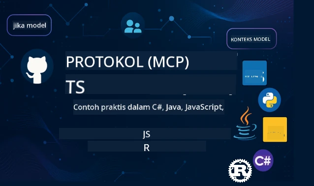

 

[](https://GitHub.com/microsoft/mcp-for-beginners/graphs/contributors)
[](https://GitHub.com/microsoft/mcp-for-beginners/issues)
[](https://GitHub.com/microsoft/mcp-for-beginners/pulls)
[](http://makeapullrequest.com)

[](https://GitHub.com/microsoft/mcp-for-beginners/watchers)
[](https://GitHub.com/microsoft/mcp-for-beginners/fork)
[](https://GitHub.com/microsoft/mcp-for-beginners/stargazers)


[](https://discord.gg/nTYy5BXMWG)

Ikuti langkah-langkah ini untuk memulai menggunakan sumber daya ini:
1. **Fork Repository**: Klik [](https://GitHub.com/microsoft/mcp-for-beginners/fork)
2. **Clone Repository**:   `git clone https://github.com/microsoft/mcp-for-beginners.git`
3. **Bergabung dengan** [](https://discord.gg/nTYy5BXMWG)


### 🌐 Dukungan Multi-Bahasa

#### Didukung melalui GitHub Action (Otomatis & Selalu Terbaru)

<!-- CO-OP TRANSLATOR LANGUAGES TABLE START -->
[Arabic](../ar/README.md) | [Bengali](../bn/README.md) | [Bulgarian](../bg/README.md) | [Burmese (Myanmar)](../my/README.md) | [Chinese (Simplified)](../zh-CN/README.md) | [Chinese (Traditional, Hong Kong)](../zh-HK/README.md) | [Chinese (Traditional, Macau)](../zh-MO/README.md) | [Chinese (Traditional, Taiwan)](../zh-TW/README.md) | [Croatian](../hr/README.md) | [Czech](../cs/README.md) | [Danish](../da/README.md) | [Dutch](../nl/README.md) | [Estonian](../et/README.md) | [Finnish](../fi/README.md) | [French](../fr/README.md) | [German](../de/README.md) | [Greek](../el/README.md) | [Hebrew](../he/README.md) | [Hindi](../hi/README.md) | [Hungarian](../hu/README.md) | [Indonesian](./README.md) | [Italian](../it/README.md) | [Japanese](../ja/README.md) | [Kannada](../kn/README.md) | [Korean](../ko/README.md) | [Lithuanian](../lt/README.md) | [Malay](../ms/README.md) | [Malayalam](../ml/README.md) | [Marathi](../mr/README.md) | [Nepali](../ne/README.md) | [Nigerian Pidgin](../pcm/README.md) | [Norwegian](../no/README.md) | [Persian (Farsi)](../fa/README.md) | [Polish](../pl/README.md) | [Portuguese (Brazil)](../pt-BR/README.md) | [Portuguese (Portugal)](../pt-PT/README.md) | [Punjabi (Gurmukhi)](../pa/README.md) | [Romanian](../ro/README.md) | [Russian](../ru/README.md) | [Serbian (Cyrillic)](../sr/README.md) | [Slovak](../sk/README.md) | [Slovenian](../sl/README.md) | [Spanish](../es/README.md) | [Swahili](../sw/README.md) | [Swedish](../sv/README.md) | [Tagalog (Filipino)](../tl/README.md) | [Tamil](../ta/README.md) | [Telugu](../te/README.md) | [Thai](../th/README.md) | [Turkish](../tr/README.md) | [Ukrainian](../uk/README.md) | [Urdu](../ur/README.md) | [Vietnamese](../vi/README.md)

> **Lebih suka Clone Secara Lokal?**
>
> Repository ini menyertakan lebih dari 50 terjemahan bahasa yang secara signifikan meningkatkan ukuran unduhan. Untuk meng-clone tanpa terjemahan, gunakan sparse checkout:
>
> **Bash / macOS / Linux:**
> ```bash
> git clone --filter=blob:none --sparse https://github.com/microsoft/mcp-for-beginners.git
> cd mcp-for-beginners
> git sparse-checkout set --no-cone '/*' '!translations' '!translated_images'
> ```
>
> **CMD (Windows):**
> ```cmd
> git clone --filter=blob:none --sparse https://github.com/microsoft/mcp-for-beginners.git
> cd mcp-for-beginners
> git sparse-checkout set --no-cone "/*" "!translations" "!translated_images"
> ```
>
> Ini memberi Anda semua yang Anda butuhkan untuk menyelesaikan kursus dengan unduhan yang jauh lebih cepat.
<!-- CO-OP TRANSLATOR LANGUAGES TABLE END -->

# 🚀 Kurikulum Model Context Protocol (MCP) untuk Pemula

## **Pelajari MCP dengan Contoh Kode Praktis di C#, Java, JavaScript, Rust, Python, dan TypeScript**

## 🧠 Gambaran Umum Kurikulum Model Context Protocol
Selamat datang di perjalanan Anda memasuki Model Context Protocol! Jika Anda pernah bertanya-tanya bagaimana aplikasi AI berkomunikasi dengan berbagai alat dan layanan, Anda akan menemukan solusi elegan yang mengubah cara developer membangun sistem cerdas.

Pikirkan MCP sebagai penerjemah universal untuk aplikasi AI - sama seperti bagaimana port USB memungkinkan Anda menghubungkan perangkat apa pun ke komputer, MCP memungkinkan model AI menghubungkan ke alat atau layanan apa pun dengan cara yang distandarisasi. Apakah Anda sedang membangun chatbot pertama Anda atau mengerjakan alur kerja AI yang kompleks, memahami MCP akan memberi Anda kekuatan untuk menciptakan aplikasi yang lebih mampu dan fleksibel.

Kurikulum ini dirancang dengan kesabaran dan perhatian untuk perjalanan pembelajaran Anda. Kami akan memulai dengan konsep sederhana yang sudah Anda pahami dan secara bertahap membangun keahlian Anda melalui praktik langsung dalam bahasa pemrograman favorit Anda. Setiap langkah menyertakan penjelasan yang jelas, contoh praktis, dan banyak dorongan sepanjang perjalanan.

Saat Anda menyelesaikan perjalanan ini, Anda akan memiliki kepercayaan diri untuk membangun server MCP sendiri, mengintegrasikannya dengan platform AI populer, dan memahami bagaimana teknologi ini membentuk masa depan pengembangan AI. Mari mulai petualangan seru ini bersama-sama!

### Dokumentasi dan Spesifikasi Resmi

Kurikulum ini selaras dengan **Spesifikasi MCP 2025-11-25** (rilis stabil terbaru). Spesifikasi MCP menggunakan versi berbasis tanggal (format YYYY-MM-DD) untuk memastikan pelacakan versi protokol yang jelas.

Sumber daya ini akan menjadi lebih berharga seiring bertambahnya pemahaman Anda, tapi jangan merasa terbebani membaca semuanya sekaligus. Mulailah dari area yang paling Anda minati!
- 📘 [Dokumentasi MCP](https://modelcontextprotocol.io/) – Ini adalah sumber daya utama Anda untuk tutorial langkah demi langkah dan panduan pengguna. Dokumentasi ini ditulis dengan pemula dalam pikiran, memberikan contoh jelas yang dapat Anda ikuti dengan kecepatan Anda sendiri.
- 📜 [Spesifikasi MCP](https://modelcontextprotocol.io/specification/2025-11-25) – Anggap ini sebagai manual referensi komprehensif Anda. Saat Anda menjalani kurikulum, Anda akan sering kembali ke sini untuk mencari rincian spesifik dan menjelajahi fitur lanjutan.
- 📜 [Versi Spesifikasi MCP](https://modelcontextprotocol.io/specification/versioning) – Berisi informasi tentang sejarah versi protokol dan bagaimana MCP menggunakan versi berbasis tanggal (format YYYY-MM-DD).
- 🧑‍💻 [Repository MCP GitHub](https://github.com/modelcontextprotocol) – Di sini Anda akan menemukan SDK, alat, dan contoh kode dalam berbagai bahasa pemrograman. Ini seperti tambang harta karun contoh praktis dan komponen siap pakai.
- 🌐 [Komunitas MCP](https://github.com/orgs/modelcontextprotocol/discussions) – Bergabunglah dengan sesama pembelajar dan pengembang berpengalaman dalam diskusi tentang MCP. Ini adalah komunitas yang mendukung di mana pertanyaan disambut dan pengetahuan dibagikan secara bebas.
  
## Tujuan Pembelajaran

Di akhir kurikulum ini, Anda akan merasa percaya diri dan bersemangat dengan kemampuan baru Anda. Berikut yang akan Anda capai:

• **Memahami dasar MCP**: Anda akan mengerti apa itu Model Context Protocol dan mengapa ini merevolusi cara aplikasi AI bekerja sama, menggunakan analogi dan contoh yang masuk akal.

• **Membangun server MCP pertama Anda**: Anda akan membuat server MCP yang berfungsi dalam bahasa pemrograman pilihan Anda, mulai dari contoh sederhana dan mengembangkan keterampilan Anda langkah demi langkah.

• **Menghubungkan model AI ke alat nyata**: Anda akan belajar bagaimana menjembatani kesenjangan antara model AI dan layanan nyata, memberi aplikasi Anda kemampuan baru yang kuat.

• **Mengimplementasikan praktik keamanan terbaik**: Anda akan mengerti bagaimana menjaga implementasi MCP Anda aman dan terlindungi, melindungi aplikasi dan pengguna Anda.

• **Menerapkan dengan percaya diri**: Anda akan tahu bagaimana membawa proyek MCP Anda dari pengembangan ke produksi, dengan strategi deployment praktis yang bekerja di dunia nyata.

• **Bergabung dengan komunitas MCP**: Anda akan menjadi bagian dari komunitas pengembang yang berkembang yang membentuk masa depan pengembangan aplikasi AI. 

## Latar Belakang Penting

Sebelum kita menyelami detail MCP, mari pastikan Anda nyaman dengan beberapa konsep dasar. Jangan khawatir jika Anda bukan ahli di bidang ini - kami akan menjelaskan semua yang perlu Anda ketahui saat kita melangkah!

### Memahami Protokol (Dasar)

Pikirkan protokol seperti aturan untuk percakapan. Saat Anda menelepon teman, Anda berdua tahu untuk mengucapkan "halo" saat menjawab, bergiliran berbicara, dan mengucapkan "selamat tinggal" saat selesai. Program komputer juga memerlukan aturan serupa untuk berkomunikasi secara efektif.

MCP adalah protokol - seperangkat aturan yang disepakati yang membantu model AI dan aplikasi memiliki "percakapan" yang produktif dengan alat dan layanan. Sama seperti aturan percakapan membuat komunikasi manusia lebih lancar, MCP membuat komunikasi aplikasi AI jauh lebih dapat diandalkan dan kuat.

### Hubungan Client-Server (Cara Program Bekerja Bersama)

Anda sudah menggunakan hubungan client-server setiap hari! Ketika Anda menggunakan browser web (client) untuk mengunjungi situs web, Anda terhubung ke web server yang mengirimkan konten halaman. Browser tahu cara meminta informasi, dan server tahu cara merespons.

Dalam MCP, kita memiliki hubungan yang serupa: model AI bertindak sebagai client yang meminta informasi atau tindakan, sementara server MCP menyediakan kemampuan tersebut. Ini seperti memiliki asisten yang membantu (server) yang bisa diminta AI untuk melakukan tugas tertentu.

### Mengapa Standarisasi Penting (Membuat Segalanya Bekerja Bersama)

Bayangkan jika setiap pabrikan mobil menggunakan bentuk pompa bensin yang berbeda - Anda butuh adaptor berbeda untuk setiap mobil! Standarisasi berarti menyepakati pendekatan umum sehingga segala sesuatu bekerja bersama dengan mulus.

MCP menyediakan standarisasi ini untuk aplikasi AI. Alih-alih setiap model AI membutuhkan kode khusus agar bekerja dengan setiap alat, MCP menciptakan cara universal agar mereka bisa berkomunikasi. Ini berarti developer bisa membangun alat sekali dan membuatnya bekerja dengan banyak sistem AI berbeda.

## 🧭 Gambaran Jalur Pembelajaran Anda

Perjalanan MCP Anda disusun dengan hati-hati untuk membangun kepercayaan dan keterampilan Anda secara progresif. Setiap fase memperkenalkan konsep baru sekaligus memperkuat apa yang sudah Anda pelajari.

### 🌱 Fase Dasar: Memahami Konsep Dasar (Modul 0-2)

Inilah tempat petualangan Anda dimulai! Kami akan memperkenalkan konsep MCP dengan menggunakan analogi yang familiar dan contoh sederhana. Anda akan mengerti apa itu MCP, mengapa MCP ada, dan bagaimana MCP cocok dalam dunia pengembangan AI yang lebih luas.

• **Modul 0 - Pengantar MCP**: Kami akan mulai dengan menjelajahi apa itu MCP dan mengapa MCP sangat penting untuk aplikasi AI modern. Anda akan melihat contoh nyata MCP beraksi dan memahami bagaimana MCP memecahkan masalah umum yang dihadapi developer.

• **Modul 1 - Penjelasan Konsep Inti**: Di sini Anda akan belajar blok bangunan penting dari MCP. Kami akan menggunakan banyak analogi dan contoh visual untuk memastikan konsep-konsep ini terasa alami dan mudah dipahami.

• **Modul 2 - Keamanan dalam MCP**: Keamanan mungkin terdengar menakutkan, tapi kami akan menunjukkan bagaimana MCP menyertakan fitur keamanan bawaan dan mengajarkan praktik terbaik yang melindungi aplikasi Anda sejak awal.

### 🔨 Fase Pembangunan: Membuat Implementasi Pertama Anda (Modul 3)

Sekarang keseruan sesungguhnya dimulai! Anda akan mendapatkan pengalaman langsung membangun server dan client MCP nyata. Jangan khawatir - kami akan mulai dari yang sederhana dan membimbing Anda melalui setiap langkah.
Modul ini mencakup beberapa panduan langsung yang memungkinkan Anda berlatih dalam bahasa pemrograman pilihan Anda. Anda akan membuat server pertama Anda, membangun klien untuk terhubung ke server tersebut, dan bahkan mengintegrasikan dengan alat pengembangan populer seperti VS Code.

Setiap panduan mencakup contoh kode lengkap, tips pemecahan masalah, dan penjelasan mengapa kami membuat pilihan desain tertentu. Pada akhir fase ini, Anda akan memiliki implementasi MCP yang berfungsi dan bisa dibanggakan!

### 🚀 Fase Pertumbuhan: Konsep Lanjutan dan Aplikasi Dunia Nyata (Modul 4-5)

Setelah menguasai dasar-dasar, Anda siap menjelajahi fitur MCP yang lebih canggih. Kami akan membahas strategi implementasi praktis, teknik debugging, dan topik lanjutan seperti integrasi AI multi-modal.

Anda juga akan belajar cara mengskalakan implementasi MCP untuk penggunaan produksi dan mengintegrasikan dengan platform cloud seperti Azure. Modul-modul ini mempersiapkan Anda untuk membangun solusi MCP yang dapat menangani tuntutan dunia nyata.

### 🌟 Fase Penguasaan: Komunitas dan Spesialisasi (Modul 6-11)

Fase terakhir berfokus pada bergabung dengan komunitas MCP dan mengkhususkan diri dalam bidang yang paling Anda minati. Anda akan belajar cara berkontribusi pada proyek MCP sumber terbuka, mengimplementasikan pola autentikasi lanjutan, dan membangun solusi terpadu dengan basis data yang komprehensif.

Modul 11 layak disebutkan khusus - ini adalah jalur pembelajaran langsung dengan 13 laboratorium yang lengkap yang mengajarkan Anda membangun server MCP siap produksi dengan integrasi PostgreSQL. Ini seperti proyek puncak yang menggabungkan semua yang telah Anda pelajari!

### 📚 Struktur Kurikulum Lengkap

| Modul | Topik | Deskripsi | Tautan |
|--------|-------|-------------|------|
| **Modul 0-3: Dasar-Dasar** | | | |
| 00 | Pengantar MCP | Gambaran Protokol Konteks Model dan signifikansinya dalam pipeline AI | [Baca selengkapnya](./00-Introduction/README.md) |
| 01 | Penjelasan Konsep Inti | Eksplorasi mendalam konsep inti MCP | [Baca selengkapnya](./01-CoreConcepts/README.md) |
| 02 | Keamanan dalam MCP | Ancaman keamanan dan praktik terbaik | [Baca selengkapnya](./02-Security/README.md) |
| 03 | Memulai dengan MCP | Pengaturan lingkungan, server/klien dasar, integrasi | [Baca selengkapnya](./03-GettingStarted/README.md) |
| **Modul 3: Membangun Server & Klien Pertama Anda** | | | |
| 3.1 | Server Pertama | Membuat server MCP pertama Anda | [Panduan](./03-GettingStarted/01-first-server/README.md) |
| 3.2 | Klien Pertama | Mengembangkan klien MCP dasar | [Panduan](./03-GettingStarted/02-client/README.md) |
| 3.3 | Klien dengan LLM | Mengintegrasikan model bahasa besar | [Panduan](./03-GettingStarted/03-llm-client/README.md) |
| 3.4 | Integrasi VS Code | Menggunakan server MCP dalam VS Code | [Panduan](./03-GettingStarted/04-vscode/README.md) |
| 3.5 | Server stdio | Membuat server menggunakan transportasi stdio | [Panduan](./03-GettingStarted/05-stdio-server/README.md) |
| 3.6 | Streaming HTTP | Mengimplementasikan streaming HTTP dalam MCP | [Panduan](./03-GettingStarted/06-http-streaming/README.md) |
| 3.7 | AI Toolkit | Menggunakan AI Toolkit dengan MCP | [Panduan](./03-GettingStarted/07-aitk/README.md) |
| 3.8 | Pengujian | Menguji implementasi server MCP Anda | [Panduan](./03-GettingStarted/08-testing/README.md) |
| 3.9 | Penyebaran | Mendeploy server MCP ke produksi | [Panduan](./03-GettingStarted/09-deployment/README.md) |
| 3.10 | Penggunaan server lanjutan | Menggunakan server lanjutan untuk penggunaan fitur lanjutan dan arsitektur yang lebih baik | [Panduan](./03-GettingStarted/10-advanced/README.md) |
| 3.11 | Auth sederhana | Bab yang menunjukkan autentikasi dari awal dan RBAC | [Panduan](./03-GettingStarted/11-simple-auth/README.md) |
| 3.12 | Host MCP | Mengonfigurasi Claude Desktop, Cursor, Cline, dan host MCP lainnya | [Panduan](./03-GettingStarted/12-mcp-hosts/README.md) |
| 3.13 | Inspector MCP | Debug dan uji server MCP dengan alat Inspector | [Panduan](./03-GettingStarted/13-mcp-inspector/README.md) |
| 3.14 | Sampling | Menggunakan sampling untuk kolaborasi dengan klien | [Panduan](./03-GettingStarted/14-sampling/README.md) |
| 3.15 | Aplikasi MCP | Membangun aplikasi MCP | [Panduan](./03-GettingStarted/15-mcp-apps/README.md) |

| **Modul 4-5: Praktis & Lanjutan** | | | |
| 04 | Implementasi Praktis | SDK, debugging, pengujian, template prompt yang dapat digunakan kembali | [Baca selengkapnya](./04-PracticalImplementation/README.md) |
| 4.1 | Paginasi | Menangani set hasil besar dengan paginasi berbasis kursor | [Panduan](./04-PracticalImplementation/pagination/README.md) |
| 05 | Topik Lanjutan dalam MCP | AI multi-modal, skala, penggunaan enterprise | [Baca selengkapnya](./05-AdvancedTopics/README.md) |
| 5.1 | Integrasi Azure | Integrasi MCP dengan Azure | [Panduan](./05-AdvancedTopics/mcp-integration/README.md) |
| 5.2 | Multi-modalitas | Bekerja dengan berbagai modalitas | [Panduan](./05-AdvancedTopics/mcp-multi-modality/README.md) |
| 5.3 | Demo OAuth2 | Mengimplementasikan autentikasi OAuth2 | [Panduan](./05-AdvancedTopics/mcp-oauth2-demo/README.md) |
| 5.4 | Konteks Root | Memahami dan mengimplementasikan konteks root | [Panduan](./05-AdvancedTopics/mcp-root-contexts/README.md) |
| 5.5 | Routing | Strategi routing MCP | [Panduan](./05-AdvancedTopics/mcp-routing/README.md) |
| 5.6 | Sampling | Teknik sampling dalam MCP | [Panduan](./05-AdvancedTopics/mcp-sampling/README.md) |
| 5.7 | Skalabilitas | Mengskalakan implementasi MCP | [Panduan](./05-AdvancedTopics/mcp-scaling/README.md) |
| 5.8 | Keamanan | Pertimbangan keamanan lanjutan | [Panduan](./05-AdvancedTopics/mcp-security/README.md) |
| 5.9 | Pencarian Web | Mengimplementasikan kemampuan pencarian web | [Panduan](./05-AdvancedTopics/web-search-mcp/README.md) |
| 5.10 | Streaming Real-time | Membangun fungsi streaming real-time | [Panduan](./05-AdvancedTopics/mcp-realtimestreaming/README.md) |
| 5.11 | Pencarian Real-time | Mengimplementasikan pencarian real-time | [Panduan](./05-AdvancedTopics/mcp-realtimesearch/README.md) |
| 5.12 | Autentikasi Entra ID | Autentikasi dengan Microsoft Entra ID | [Panduan](./05-AdvancedTopics/mcp-security-entra/README.md) |
| 5.13 | Integrasi Foundry | Mengintegrasikan dengan Azure AI Foundry | [Panduan](./05-AdvancedTopics/mcp-foundry-agent-integration/README.md) |
| 5.14 | Rekayasa Konteks | Teknik rekayasa konteks yang efektif | [Panduan](./05-AdvancedTopics/mcp-contextengineering/README.md) |
| 5.15 | Transportasi Kustom MCP | Implementasi transportasi kustom | [Panduan](./05-AdvancedTopics/mcp-transport/README.md) |
| 5.16 | Fitur Protokol | Notifikasi progres, pembatalan, template sumber daya | [Panduan](./05-AdvancedTopics/mcp-protocol-features/README.md) |
| **Modul 6-10: Komunitas & Praktik Terbaik** | | | |
| 06 | Kontribusi Komunitas | Cara berkontribusi ke ekosistem MCP | [Panduan](./06-CommunityContributions/README.md) |
| 07 | Wawasan dari Adopsi Awal | Kisah implementasi dunia nyata | [Panduan](./07-LessonsfromEarlyAdoption/README.md) |
| 08 | Praktik Terbaik untuk MCP | Kinerja, toleransi kesalahan, ketahanan | [Panduan](./08-BestPractices/README.md) |
| 09 | Studi Kasus MCP | Contoh implementasi praktis | [Panduan](./09-CaseStudy/README.md) |
| 10 | Lokakarya Langsung | Membangun Server MCP dengan AI Toolkit | [Laboratorium](./10-StreamliningAIWorkflowsBuildingAnMCPServerWithAIToolkit/README.md) |
| **Modul 11: Laboratorium Praktik Server MCP** | | | |
| 11 | Integrasi Basis Data Server MCP | Jalur pembelajaran langsung 13-lab yang komprehensif untuk integrasi PostgreSQL | [Laboratorium](./11-MCPServerHandsOnLabs/README.md) |
| 11.1 | Pengantar | Gambaran MCP dengan integrasi basis data dan kasus penggunaan analitik ritel | [Lab 00](./11-MCPServerHandsOnLabs/00-Introduction/README.md) |
| 11.2 | Arsitektur Inti | Memahami arsitektur server MCP, lapisan basis data, dan pola keamanan | [Lab 01](./11-MCPServerHandsOnLabs/01-Architecture/README.md) |
| 11.3 | Keamanan & Multi-Tenancy | Keamanan Tingkat Baris, autentikasi, dan akses data multi-tenant | [Lab 02](./11-MCPServerHandsOnLabs/02-Security/README.md) |
| 11.4 | Pengaturan Lingkungan | Menyiapkan lingkungan pengembangan, Docker, sumber daya Azure | [Lab 03](./11-MCPServerHandsOnLabs/03-Setup/README.md) |
| 11.5 | Desain Basis Data | Pengaturan PostgreSQL, desain skema ritel, dan data contoh | [Lab 04](./11-MCPServerHandsOnLabs/04-Database/README.md) |
| 11.6 | Implementasi Server MCP | Membangun server FastMCP dengan integrasi basis data | [Lab 05](./11-MCPServerHandsOnLabs/05-MCP-Server/README.md) |
| 11.7 | Pengembangan Alat | Membuat alat query basis data dan introspeksi skema | [Lab 06](./11-MCPServerHandsOnLabs/06-Tools/README.md) |
| 11.8 | Pencarian Semantik | Mengimplementasikan embedding vektor dengan Azure OpenAI dan pgvector | [Lab 07](./11-MCPServerHandsOnLabs/07-Semantic-Search/README.md) |
| 11.9 | Pengujian & Debugging | Strategi pengujian, alat debugging, dan pendekatan validasi | [Lab 08](./11-MCPServerHandsOnLabs/08-Testing/README.md) |
| 11.10 | Integrasi VS Code | Mengonfigurasi integrasi MCP di VS Code dan penggunaan AI Chat | [Lab 09](./11-MCPServerHandsOnLabs/09-VS-Code/README.md) |
| 11.11 | Strategi Penyebaran | Penyebaran Docker, Azure Container Apps, dan pertimbangan skalabilitas | [Lab 10](./11-MCPServerHandsOnLabs/10-Deployment/README.md) |
| 11.12 | Pemantauan | Application Insights, pencatatan, pemantauan kinerja | [Lab 11](./11-MCPServerHandsOnLabs/11-Monitoring/README.md) |
| 11.13 | Praktik Terbaik | Optimisasi kinerja, penguatan keamanan, dan tips produksi | [Lab 12](./11-MCPServerHandsOnLabs/12-Best-Practices/README.md) |

### 💻 Proyek Kode Contoh

Salah satu bagian paling menarik dari belajar MCP adalah melihat keterampilan kode Anda berkembang secara progresif. Kami merancang contoh kode kami untuk mulai dari yang sederhana dan berkembang menjadi lebih canggih seiring pemahaman Anda meningkat. Berikut cara kami memperkenalkan konsep - dengan kode yang mudah dipahami tetapi menunjukkan prinsip MCP yang nyata, Anda akan memahami tidak hanya apa yang kode ini lakukan, tetapi juga mengapa kode ini disusun seperti itu dan bagaimana kode ini sesuai dengan aplikasi MCP yang lebih besar.

#### Contoh Kalkulator MCP Dasar

| Bahasa | Deskripsi | Tautan |
|----------|-------------|------|
| C# | Contoh Server MCP | [Lihat Kode](./03-GettingStarted/samples/csharp/README.md) |
| Java | Kalkulator MCP | [Lihat Kode](./03-GettingStarted/samples/java/calculator/README.md) |
| JavaScript | Demo MCP | [Lihat Kode](./03-GettingStarted/samples/javascript/README.md) |
| Python | Server MCP | [Lihat Kode](../../03-GettingStarted/samples/python/mcp_calculator_server.py) |
| TypeScript | Contoh MCP | [Lihat Kode](./03-GettingStarted/samples/typescript/README.md) |
| Rust | Contoh MCP | [Lihat Kode](./03-GettingStarted/samples/rust/README.md) |

#### Implementasi MCP Lanjutan

| Bahasa | Deskripsi | Tautan |
|----------|-------------|------|
| C# | Contoh Lanjutan | [Lihat Kode](./04-PracticalImplementation/samples/csharp/README.md) |
| Java dengan Spring | Contoh Container App | [Lihat Kode](./04-PracticalImplementation/samples/java/containerapp/README.md) |
| JavaScript | Contoh Lanjutan | [Lihat Kode](./04-PracticalImplementation/samples/javascript/README.md) |
| Python | Implementasi Kompleks | [Lihat Kode](./04-PracticalImplementation/samples/python/README.md) |
| TypeScript | Contoh Container | [Lihat Kode](./04-PracticalImplementation/samples/typescript/README.md) |


## 🎯 Prasyarat untuk Mempelajari MCP

Untuk mendapatkan hasil maksimal dari kurikulum ini, Anda sebaiknya memiliki:
- Pengetahuan dasar pemrograman dalam setidaknya salah satu bahasa berikut: C#, Java, JavaScript, Python, atau TypeScript  
- Pemahaman tentang model client-server dan API  
- Kenal dengan konsep REST dan HTTP  
- (Opsional) Latar belakang konsep AI/ML  

- Bergabung dalam diskusi komunitas kami untuk dukungan  

## 📚 Panduan Studi & Sumber Daya  

Repositori ini mencakup beberapa sumber daya untuk membantu Anda menavigasi dan belajar secara efektif:  

### Panduan Studi  

Sebuah [Panduan Studi](./study_guide.md) yang komprehensif tersedia untuk membantu Anda menavigasi repositori ini dengan efektif. Peta kurikulum visual ini menunjukkan bagaimana semua topik saling terkait dan memberikan panduan tentang cara menggunakan proyek contoh dengan efektif. Ini sangat membantu jika Anda adalah pembelajar visual yang suka melihat gambaran besar.  

Panduan ini mencakup:  
- Peta kurikulum visual yang menunjukkan semua topik yang dibahas  
- Rincian mendalam dari setiap bagian repositori  
- Panduan tentang cara menggunakan proyek contoh  
- Jalur pembelajaran yang direkomendasikan untuk berbagai tingkat keterampilan  
- Sumber daya tambahan untuk melengkapi perjalanan pembelajaran Anda  

### Catatan Perubahan  

Kami memelihara [Catatan Perubahan](./changelog.md) yang mendetail yang melacak semua pembaruan signifikan pada materi kurikulum, sehingga Anda bisa tetap mengikuti perbaikan dan penambahan terbaru.  
- Penambahan konten baru  
- Perubahan struktur  
- Peningkatan fitur  
- Pembaruan dokumentasi  

## 🛠️ Cara Menggunakan Kurikulum Ini Secara Efektif  

Setiap pelajaran dalam panduan ini mencakup:  

1. Penjelasan jelas tentang konsep MCP  
2. Contoh kode langsung dalam berbagai bahasa  
3. Latihan untuk membangun aplikasi MCP nyata  
4. Sumber daya tambahan bagi pembelajar tingkat lanjut  

### Mari Belajar MCP dengan C# - Seri Tutorial  
Mari pelajari Model Context Protocol (MCP), kerangka kerja mutakhir yang dirancang untuk menstandarisasi interaksi antara model AI dan aplikasi klien. Melalui sesi pemula ini, kami akan memperkenalkan Anda pada MCP dan memandu Anda membuat server MCP pertama Anda.  
#### C#: [https://aka.ms/letslearnmcp-csharp](https://aka.ms/letslearnmcp-csharp)  
#### Java: [https://aka.ms/letslearnmcp-java](https://aka.ms/letslearnmcp-java)  
#### JavaScript: [https://aka.ms/letslearnmcp-javascript](https://aka.ms/letslearnmcp-javascript)  
#### Python: [https://aka.ms/letslearnmcp-python](https://aka.ms/letslearnmcp-python)  

## 🎓 Perjalanan MCP Anda Dimulai  

Selamat! Anda baru saja mengambil langkah pertama dalam perjalanan yang menarik yang akan mengembangkan kemampuan pemrograman Anda dan menghubungkan Anda dengan garis depan pengembangan AI.  

### Apa yang Sudah Anda Capai  

Dengan membaca pengantar ini, Anda sudah mulai membangun pondasi pengetahuan MCP Anda. Anda mengerti apa itu MCP, mengapa itu penting, dan bagaimana kurikulum ini akan mendukung perjalanan pembelajaran Anda. Itu adalah pencapaian besar dan awal keahlian Anda dalam teknologi penting ini.  

### Petualangan di Depan  

Saat Anda melanjutkan modul-modul berikutnya, ingatlah bahwa setiap ahli dulu adalah pemula. Konsep yang tampak rumit sekarang akan menjadi hal yang biasa saat Anda berlatih dan menerapkannya. Setiap langkah kecil membangun kemampuan hebat yang akan berguna sepanjang karier pengembangan Anda.  

### Jaringan Dukungan Anda  

Anda bergabung dengan komunitas pembelajar dan ahli yang bersemangat tentang MCP dan siap membantu orang lain berhasil. Baik saat Anda terjebak dalam tantangan pengkodean atau bersemangat membagikan terobosan, komunitas ada di sini untuk mendukung perjalanan Anda.  

Jika Anda mengalami kendala atau memiliki pertanyaan mengenai membangun aplikasi AI, bergabunglah dengan sesama pelajar dan pengembang berpengalaman dalam diskusi tentang MCP. Ini adalah komunitas yang mendukung dimana pertanyaan diterima dan pengetahuan dibagikan dengan bebas.  

[](https://discord.gg/nTYy5BXMWG)  

Jika Anda memiliki umpan balik produk atau menemukan kesalahan saat membangun, kunjungi:  

[](https://aka.ms/foundry/forum)  

### Siap Memulai?  

Petualangan MCP Anda dimulai sekarang! Mulailah dengan Modul 0 untuk menyelami pengalaman praktis MCP pertama Anda, atau jelajahi proyek contoh untuk melihat apa yang akan Anda bangun. Ingat - setiap ahli memulai persis di mana Anda sekarang, dan dengan kesabaran serta latihan, Anda akan terkejut dengan apa yang bisa Anda capai.  

Selamat datang di dunia pengembangan Model Context Protocol. Mari kita bangun sesuatu yang luar biasa bersama!  

## 🤝 Berkontribusi ke Komunitas Pembelajar  

Kurikulum ini menjadi lebih kuat dengan kontribusi dari pelajar seperti Anda! Baik Anda memperbaiki salah ketik, menyarankan penjelasan yang lebih jelas, atau menambahkan contoh baru, kontribusi Anda membantu pemula lain berhasil.  

Terima kasih kepada Microsoft Valued Professional [Shivam Goyal](https://www.linkedin.com/in/shivam2003/) atas kontribusi sampel kodenya.  

Proses kontribusi dirancang agar ramah dan mendukung. Sebagian besar kontribusi memerlukan Contributor License Agreement (CLA), tetapi alat otomatis akan memandu Anda melalui prosesnya dengan lancar.  

## 📜 Pembelajaran Open Source  

Seluruh kurikulum ini tersedia di bawah MIT [LICENSE](../../LICENSE), artinya Anda dapat menggunakan, memodifikasi, dan membagikannya secara bebas. Ini mendukung misi kami untuk membuat pengetahuan MCP dapat diakses oleh pengembang di mana saja.  
## 🤝 Pedoman Kontribusi  

Proyek ini menyambut kontribusi dan saran. Sebagian besar kontribusi mengharuskan Anda menyetujui  
Contributor License Agreement (CLA) yang menyatakan bahwa Anda memiliki hak, dan benar-benar memberikan kami  
hak untuk menggunakan kontribusi Anda. Untuk detail, kunjungi <https://cla.opensource.microsoft.com>.  

Saat Anda mengirimkan pull request, bot CLA akan secara otomatis menentukan apakah Anda  
perlu menyediakan CLA dan menghiasi PR sesuai (misalnya, pemeriksaan status, komentar). Cukup ikuti  
instruksi dari bot. Anda hanya perlu melakukan ini sekali untuk semua repositori yang menggunakan CLA kami.  

Proyek ini telah mengadopsi [Microsoft Open Source Code of Conduct](https://opensource.microsoft.com/codeofconduct/).  
Untuk informasi lebih lanjut lihat [Code of Conduct FAQ](https://opensource.microsoft.com/codeofconduct/faq/) atau  
kontak [opencode@microsoft.com](mailto:opencode@microsoft.com) untuk pertanyaan atau komentar tambahan.  

---  

*Siap memulai perjalanan MCP Anda? Mulailah dengan [Modul 00 - Pengenalan MCP](./00-Introduction/README.md) dan ambil langkah pertama Anda ke dunia pengembangan Model Context Protocol!*  

## 🎒 Kursus Lainnya  
Tim kami juga menghasilkan kursus lain! Cek:  

<!-- CO-OP TRANSLATOR OTHER COURSES START -->  
### LangChain  
[](https://aka.ms/langchain4j-for-beginners)  
[](https://aka.ms/langchainjs-for-beginners?WT.mc_id=m365-94501-dwahlin)  
[](https://github.com/microsoft/langchain-for-beginners?WT.mc_id=m365-94501-dwahlin)  
---  

### Azure / Edge / MCP / Agents  
[](https://github.com/microsoft/AZD-for-beginners?WT.mc_id=academic-105485-koreyst)  
[](https://github.com/microsoft/edgeai-for-beginners?WT.mc_id=academic-105485-koreyst)  
[](https://github.com/microsoft/mcp-for-beginners?WT.mc_id=academic-105485-koreyst)  
[](https://github.com/microsoft/ai-agents-for-beginners?WT.mc_id=academic-105485-koreyst)  

---  
   
### Seri Generative AI  
[](https://github.com/microsoft/generative-ai-for-beginners?WT.mc_id=academic-105485-koreyst)  
[-9333EA?style=for-the-badge&labelColor=E5E7EB&color=9333EA)](https://github.com/microsoft/Generative-AI-for-beginners-dotnet?WT.mc_id=academic-105485-koreyst)  
[-C084FC?style=for-the-badge&labelColor=E5E7EB&color=C084FC)](https://github.com/microsoft/generative-ai-for-beginners-java?WT.mc_id=academic-105485-koreyst)  
[-E879F9?style=for-the-badge&labelColor=E5E7EB&color=E879F9)](https://github.com/microsoft/generative-ai-with-javascript?WT.mc_id=academic-105485-koreyst)  

---  
   
### Pembelajaran Inti  
[](https://aka.ms/ml-beginners?WT.mc_id=academic-105485-koreyst)  
[](https://aka.ms/datascience-beginners?WT.mc_id=academic-105485-koreyst)  
[](https://aka.ms/ai-beginners?WT.mc_id=academic-105485-koreyst)  
[](https://github.com/microsoft/Security-101?WT.mc_id=academic-96948-sayoung)  
[](https://aka.ms/webdev-beginners?WT.mc_id=academic-105485-koreyst)  
[](https://aka.ms/iot-beginners?WT.mc_id=academic-105485-koreyst)  
[](https://github.com/microsoft/xr-development-for-beginners?WT.mc_id=academic-105485-koreyst)  

---  
   
### Seri Copilot  
[](https://aka.ms/GitHubCopilotAI?WT.mc_id=academic-105485-koreyst)
[](https://github.com/microsoft/mastering-github-copilot-for-dotnet-csharp-developers?WT.mc_id=academic-105485-koreyst)
[](https://github.com/microsoft/CopilotAdventures?WT.mc_id=academic-105485-koreyst)
<!-- CO-OP TRANSLATOR OTHER COURSES END -->

---

<!-- CO-OP TRANSLATOR DISCLAIMER START -->
**Penafian**:  
Dokumen ini telah diterjemahkan menggunakan layanan terjemahan AI [Co-op Translator](https://github.com/Azure/co-op-translator). Meskipun kami berusaha mencapai ketepatan, harap diketahui bahwa terjemahan otomatis mungkin mengandung kesalahan atau ketidakakuratan. Dokumen asli dalam bahasa aslinya harus dianggap sebagai sumber yang sah. Untuk informasi penting, disarankan menggunakan terjemahan profesional oleh manusia. Kami tidak bertanggung jawab atas kesalahpahaman atau kesalahan penafsiran yang timbul dari penggunaan terjemahan ini.
<!-- CO-OP TRANSLATOR DISCLAIMER END -->