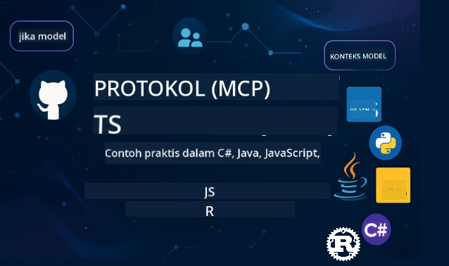

 

[](https://GitHub.com/microsoft/mcp-for-beginners/graphs/contributors)
[](https://GitHub.com/microsoft/mcp-for-beginners/issues)
[](https://GitHub.com/microsoft/mcp-for-beginners/pulls)
[](http://makeapullrequest.com)
[](https://mcptoplist.com/server/mcp.so%2Fmcp-for-beginners%2Fmicrosoft)

[](https://GitHub.com/microsoft/mcp-for-beginners/watchers)
[](https://GitHub.com/microsoft/mcp-for-beginners/fork)
[](https://GitHub.com/microsoft/mcp-for-beginners/stargazers)


[](https://discord.gg/nTYy5BXMWG)

Ikuti langkah-langkah ini untuk memulai menggunakan sumber daya ini:
1. **Fork Repositori**: Klik [](https://GitHub.com/microsoft/mcp-for-beginners/fork)
2. **Clone Repositori**:   `git clone https://github.com/microsoft/mcp-for-beginners.git`
3. **Bergabung di** [](https://discord.gg/nTYy5BXMWG)


### 🌐 Dukungan Multi-Bahasa

#### Didukung melalui GitHub Action (Otomatis & Selalu Terbaru)

<!-- CO-OP TRANSLATOR LANGUAGES TABLE START -->
[Arab](../ar/README.md) | [Benggala](../bn/README.md) | [Bulgaria](../bg/README.md) | [Birma (Myanmar)](../my/README.md) | [Mandarin (Sederhana)](../zh-CN/README.md) | [Mandarin (Tradisional, Hong Kong)](../zh-HK/README.md) | [Mandarin (Tradisional, Macau)](../zh-MO/README.md) | [Mandarin (Tradisional, Taiwan)](../zh-TW/README.md) | [Kroasia](../hr/README.md) | [Ceko](../cs/README.md) | [Denmark](../da/README.md) | [Belanda](../nl/README.md) | [Estonia](../et/README.md) | [Finlandia](../fi/README.md) | [Prancis](../fr/README.md) | [Jerman](../de/README.md) | [Yunani](../el/README.md) | [Ibrani](../he/README.md) | [Hindi](../hi/README.md) | [Hungaria](../hu/README.md) | [Indonesia](./README.md) | [Italia](../it/README.md) | [Jepang](../ja/README.md) | [Kannada](../kn/README.md) | [Khmer](../km/README.md) | [Korea](../ko/README.md) | [Lituania](../lt/README.md) | [Melayu](../ms/README.md) | [Malayalam](../ml/README.md) | [Marathi](../mr/README.md) | [Nepali](../ne/README.md) | [Pidgin Nigeria](../pcm/README.md) | [Norwegia](../no/README.md) | [Persia (Farsi)](../fa/README.md) | [Polandia](../pl/README.md) | [Portugis (Brasil)](../pt-BR/README.md) | [Portugis (Portugal)](../pt-PT/README.md) | [Punjabi (Gurmukhi)](../pa/README.md) | [Rumania](../ro/README.md) | [Rusia](../ru/README.md) | [Serbia (Sirilik)](../sr/README.md) | [Slowakia](../sk/README.md) | [Slovenia](../sl/README.md) | [Spanyol](../es/README.md) | [Swahili](../sw/README.md) | [Swedia](../sv/README.md) | [Tagalog (Filipina)](../tl/README.md) | [Tamil](../ta/README.md) | [Telugu](../te/README.md) | [Thai](../th/README.md) | [Turki](../tr/README.md) | [Ukraina](../uk/README.md) | [Urdu](../ur/README.md) | [Vietnam](../vi/README.md)

> **Lebih suka Meng-clone Secara Lokal?**
>
> Repositori ini mencakup lebih dari 50 terjemahan bahasa yang secara signifikan meningkatkan ukuran unduhan. Untuk meng-clone tanpa terjemahan, gunakan sparse checkout:
>
> **Bash / macOS / Linux:**
> ```bash
> git clone --filter=blob:none --sparse https://github.com/microsoft/mcp-for-beginners.git
> cd mcp-for-beginners
> git sparse-checkout set --no-cone '/*' '!translations' '!translated_images'
> ```
>
> **CMD (Windows):**
> ```cmd
> git clone --filter=blob:none --sparse https://github.com/microsoft/mcp-for-beginners.git
> cd mcp-for-beginners
> git sparse-checkout set --no-cone "/*" "!translations" "!translated_images"
> ```
>
> Ini memberikan semua yang Anda butuhkan untuk menyelesaikan kursus dengan unduhan yang jauh lebih cepat.
<!-- CO-OP TRANSLATOR LANGUAGES TABLE END -->

# 🚀 Kurikulum Model Context Protocol (MCP) untuk Pemula

## **Pelajari MCP dengan Contoh Kode Praktis dalam C#, Java, JavaScript, Rust, Python, dan TypeScript**

## 🧠 Gambaran Umum Kurikulum Model Context Protocol
Selamat datang dalam perjalanan Anda ke Model Context Protocol! Jika Anda pernah bertanya-tanya bagaimana aplikasi AI berkomunikasi dengan berbagai alat dan layanan, Anda akan segera menemukan solusi elegan yang mengubah cara pengembang membangun sistem cerdas.

Pikirkan MCP sebagai penerjemah universal untuk aplikasi AI — sama seperti bagaimana port USB memungkinkan Anda menghubungkan perangkat apa pun ke komputer Anda, MCP memungkinkan model AI terhubung ke alat atau layanan apa pun dengan cara yang standar. Apakah Anda sedang membangun chatbot pertama Anda atau mengerjakan alur kerja AI yang kompleks, memahami MCP akan memberi Anda kekuatan untuk menciptakan aplikasi yang lebih mumpuni dan fleksibel.

Kurikulum ini dirancang dengan kesabaran dan perhatian untuk perjalanan belajar Anda. Kami akan mulai dengan konsep sederhana yang sudah Anda pahami dan secara bertahap membangun keahlian Anda melalui praktik langsung dalam bahasa pemrograman favorit Anda. Setiap langkah mencakup penjelasan yang jelas, contoh praktis, dan banyak dorongan sepanjang perjalanan.

Saat Anda menyelesaikan perjalanan ini, Anda akan memiliki kepercayaan diri untuk membangun server MCP Anda sendiri, mengintegrasikannya dengan platform AI populer, dan memahami bagaimana teknologi ini membentuk masa depan pengembangan AI. Mari mulai petualangan menarik ini bersama-sama!

### Dokumentasi dan Spesifikasi Resmi

Kurikulum ini selaras dengan **Spesifikasi MCP 2025-11-25** (rilis stabil terbaru). Spesifikasi MCP menggunakan versi berdasarkan tanggal (format YYYY-MM-DD) untuk memastikan pelacakan versi protokol yang jelas.

> **Melihat ke depan:** kandidat rilis untuk versi spesifikasi berikutnya, **2026-07-28**, dijadwalkan akan dirilis pada 28 Juli 2026. Versi ini membuat protokol tidak bergantung status pada lapisan transport, memformalkan kerangka Ekstensi (Aplikasi MCP, Tugas), memperkuat otorisasi, dan menghapus fitur Roots, Sampling, dan Logging. Lihat [Apa yang Berubah di MCP: Kandidat Rilis 2026-07-28](./01-CoreConcepts/mcp-2026-07-28-release-candidate.md) untuk informasi lengkap.

Sumber daya ini menjadi lebih berharga seiring pemahaman Anda tumbuh, tetapi jangan merasa terbebani untuk membaca semuanya sekaligus. Mulailah dengan bagian yang paling menarik bagi Anda!
- 📘 [Dokumentasi MCP](https://modelcontextprotocol.io/) – Ini adalah sumber utama Anda untuk tutorial langkah demi langkah dan panduan pengguna. Dokumentasi ini ditulis dengan pemula dalam pikiran, memberikan contoh jelas yang bisa Anda ikuti sesuai kecepatan Anda.
- 📜 [Spesifikasi MCP](https://modelcontextprotocol.io/specification/2025-11-25) – Anggap ini sebagai manual referensi lengkap Anda. Saat mengerjakan kurikulum, Anda akan sering kembali ke sini untuk mencari detail spesifik dan menjelajah fitur tingkat lanjut.
- 📜 [Versi Spesifikasi MCP](https://modelcontextprotocol.io/specification/versioning) – Ini berisi informasi tentang sejarah versi protokol dan bagaimana MCP menggunakan versi berdasarkan tanggal (format YYYY-MM-DD).
- 🧑‍💻 [Repositori GitHub MCP](https://github.com/modelcontextprotocol) – Di sini Anda akan menemukan SDK, alat, dan contoh kode dalam berbagai bahasa pemrograman. Ini seperti gudang harta karun contoh praktis dan komponen siap pakai.
- 🌐 [Komunitas MCP](https://github.com/orgs/modelcontextprotocol/discussions) – Bergabunglah dengan sesama pelajar dan pengembang berpengalaman dalam diskusi tentang MCP. Ini adalah komunitas yang mendukung di mana pertanyaan diterima dan pengetahuan dibagi secara bebas.
  
## Tujuan Pembelajaran

Pada akhir kurikulum ini, Anda akan merasa percaya diri dan bersemangat dengan kemampuan baru Anda. Berikut adalah apa yang akan Anda capai:

• **Memahami dasar-dasar MCP**: Anda akan memahami apa itu Model Context Protocol dan mengapa ini merevolusi cara aplikasi AI bekerja sama, menggunakan analogi dan contoh yang masuk akal.

• **Membangun server MCP pertama Anda**: Anda akan membuat server MCP yang berfungsi dalam bahasa pemrograman pilihan Anda, mulai dari contoh sederhana dan meningkatkan keahlian secara bertahap.

• **Menghubungkan model AI ke alat nyata**: Anda akan belajar bagaimana menjembatani kesenjangan antara model AI dan layanan nyata, memberi aplikasi Anda kemampuan baru yang kuat.

• **Mengimplementasikan praktik keamanan terbaik**: Anda akan memahami bagaimana menjaga implementasi MCP Anda tetap aman, melindungi aplikasi dan pengguna Anda.

• **Mendeploy dengan percaya diri**: Anda akan mengetahui cara membawa proyek MCP dari pengembangan ke produksi, dengan strategi deployment praktis yang bekerja di dunia nyata.

• **Bergabung dengan komunitas MCP**: Anda akan menjadi bagian dari komunitas pengembang yang terus berkembang yang membentuk masa depan pengembangan aplikasi AI.

## Latar Belakang Penting

Sebelum kita menyelam ke detail MCP, mari pastikan Anda nyaman dengan beberapa konsep dasar. Jangan khawatir jika Anda belum ahli di area ini — kami akan menjelaskan semuanya yang perlu Anda ketahui seiring perjalanan!

### Memahami Protokol (Dasar)

Pikirkan protokol seperti aturan untuk sebuah percakapan. Saat Anda menelepon teman, Anda berdua tahu untuk mengucapkan "halo" saat menjawab, bergantian berbicara, dan mengucapkan "selamat tinggal" saat selesai. Program komputer membutuhkan aturan serupa agar komunikasi efektif.

MCP adalah protokol – seperangkat aturan yang disepakati yang membantu model AI dan aplikasi memiliki "percakapan" produktif dengan alat dan layanan. Sama seperti aturan percakapan membuat komunikasi manusia lebih lancar, MCP membuat komunikasi aplikasi AI jauh lebih andal dan kuat.

### Hubungan Klien-Server (Bagaimana Program Bekerja Sama)

Anda sudah menggunakan hubungan klien-server setiap hari! Saat menggunakan browser web (klien) untuk mengunjungi situs web, Anda menghubungi server web yang mengirimkan konten halaman. Browser tahu cara meminta informasi, dan server tahu cara merespons.

Dalam MCP, kita memiliki hubungan serupa: model AI bertindak sebagai klien yang meminta informasi atau tindakan, sementara server MCP menyediakan kemampuan tersebut. Ini seperti memiliki asisten yang membantu (server) yang dapat dimintai AI untuk melakukan tugas tertentu.

### Mengapa Standarisasi Penting (Membuat Semua Bekerja Sama)

Bayangkan jika setiap produsen mobil menggunakan pompa bahan bakar dengan bentuk berbeda — Anda perlu adaptor berbeda untuk setiap mobil! Standarisasi berarti menyepakati pendekatan umum agar semua bekerja sama dengan lancar.

MCP menyediakan standarisasi ini untuk aplikasi AI. Alih-alih setiap model AI membutuhkan kode khusus untuk bekerja dengan setiap alat, MCP menciptakan cara universal untuk berkomunikasi. Ini berarti pengembang dapat membangun alat sekali dan membuatnya bekerja dengan banyak sistem AI yang berbeda.

## 🧭 Gambaran Jalur Pembelajaran Anda

Perjalanan MCP Anda disusun dengan hati-hati untuk membangun kepercayaan diri dan keterampilan secara bertahap. Setiap fase memperkenalkan konsep baru sambil memperkuat apa yang sudah Anda pelajari.

### 🌱 Fase Dasar: Memahami Dasar-dasar (Modul 0-2)

Inilah tempat petualangan Anda dimulai! Kami akan memperkenalkan konsep MCP menggunakan analogi yang akrab dan contoh sederhana. Anda akan memahami apa itu MCP, mengapa ada, dan bagaimana ia masuk ke dalam dunia pengembangan AI yang lebih luas.


• **Modul 0 - Pengantar MCP**: Kita akan mulai dengan menjelajahi apa itu MCP dan mengapa ini sangat penting untuk aplikasi AI modern. Anda akan melihat contoh nyata MCP dalam aksi dan memahami bagaimana ia memecahkan masalah umum yang dihadapi pengembang.

• **Modul 1 - Konsep Inti Dijelaskan**: Di sini Anda akan mempelajari blok bangunan penting dari MCP. Kami akan menggunakan banyak analogi dan contoh visual untuk memastikan konsep ini terasa alami dan mudah dipahami.

• **Modul 2 - Keamanan dalam MCP**: Keamanan mungkin terdengar menakutkan, tetapi kami akan menunjukkan bagaimana MCP menyertakan fitur keamanan bawaan dan mengajarkan praktik terbaik yang melindungi aplikasi Anda sejak awal.

### 🔨 Fase Pembangunan: Membuat Implementasi Pertama Anda (Modul 3)

Sekarang keseruan yang sebenarnya dimulai! Anda akan mendapatkan pengalaman langsung membangun server dan klien MCP yang sesungguhnya. Jangan khawatir - kami akan mulai dengan yang sederhana dan membimbing Anda melalui setiap langkah.

Modul ini mencakup banyak panduan praktis yang memungkinkan Anda berlatih dalam bahasa pemrograman pilihan Anda. Anda akan membuat server pertama Anda, membangun klien untuk terhubung dengannya, dan bahkan mengintegrasikan dengan alat pengembangan populer seperti VS Code.

Setiap panduan termasuk contoh kode lengkap, tips pemecahan masalah, dan penjelasan mengapa kami membuat pilihan desain tertentu. Pada akhir fase ini, Anda akan memiliki implementasi MCP yang berfungsi yang bisa Anda banggakan!

### 🚀 Fase Pertumbuhan: Konsep Lanjutan dan Aplikasi Dunia Nyata (Modul 4-5)

Dengan dasar-dasar yang dikuasai, Anda siap menjelajahi fitur MCP yang lebih canggih. Kami akan membahas strategi implementasi praktis, teknik debugging, dan topik lanjutan seperti integrasi AI multi-modal.

Anda juga akan belajar bagaimana meningkatkan skalabilitas implementasi MCP untuk penggunaan produksi dan mengintegrasikan dengan platform cloud seperti Azure. Modul-modul ini mempersiapkan Anda untuk membangun solusi MCP yang dapat menangani tuntutan dunia nyata.

### 🌟 Fase Penguasaan: Komunitas dan Spesialisasi (Modul 6-11)

Fase akhir berfokus pada bergabung dengan komunitas MCP dan berspesialisasi di area yang paling Anda minati. Anda akan belajar bagaimana berkontribusi pada proyek open-source MCP, menerapkan pola otentikasi lanjutan, dan membangun solusi terpadu dengan database secara menyeluruh.

Modul 11 layak mendapatkan penyebutan khusus - ini adalah jalur pembelajaran praktik lengkap dengan 13 lab yang mengajarkan Anda membangun server MCP siap produksi dengan integrasi PostgreSQL. Ini seperti proyek puncak yang menyatukan semua yang telah Anda pelajari!

### 📚 Struktur Kurikulum Lengkap

| Modul | Topik | Deskripsi | Tautan |
|--------|-------|-------------|------|
| **Modul 0-3: Dasar-dasar** | | | |
| 00 | Pengantar MCP | Gambaran tentang Model Context Protocol dan signifikansinya dalam pipeline AI | [Baca lebih lanjut](./00-Introduction/README.md) |
| 01 | Konsep Inti Dijelaskan | Eksplorasi mendalam tentang konsep inti MCP | [Baca lebih lanjut](./01-CoreConcepts/README.md) |
| 1.1 | Apa yang Berubah di MCP (2026-07-28 RC) | Protokol tanpa status, kerangka ekstensi, dan penghapusan fitur yang akan datang di versi spesifikasi berikutnya | [Panduan](./01-CoreConcepts/mcp-2026-07-28-release-candidate.md) |
| 02 | Keamanan dalam MCP | Ancaman keamanan dan praktik terbaik | [Baca lebih lanjut](./02-Security/README.md) |
| 03 | Memulai dengan MCP | Pengaturan lingkungan, server/klien dasar, integrasi | [Baca lebih lanjut](./03-GettingStarted/README.md) |
| **Modul 3: Membangun Server & Klien Pertama Anda** | | | |
| 3.1 | Server Pertama | Membuat server MCP pertama Anda | [Panduan](./03-GettingStarted/01-first-server/README.md) |
| 3.2 | Klien Pertama | Mengembangkan klien MCP dasar | [Panduan](./03-GettingStarted/02-client/README.md) |
| 3.3 | Klien dengan LLM | Mengintegrasikan model bahasa besar | [Panduan](./03-GettingStarted/03-llm-client/README.md) |
| 3.4 | Integrasi VS Code | Menggunakan server MCP di VS Code | [Panduan](./03-GettingStarted/04-vscode/README.md) |
| 3.5 | Server stdio | Membuat server menggunakan transport stdio | [Panduan](./03-GettingStarted/05-stdio-server/README.md) |
| 3.6 | Streaming HTTP | Menerapkan streaming HTTP dalam MCP | [Panduan](./03-GettingStarted/06-http-streaming/README.md) |
| 3.7 | Microsoft Foundry Toolkit | Menggunakan Microsoft Foundry Toolkit dengan MCP | [Panduan](./03-GettingStarted/07-aitk/README.md) |
| 3.8 | Pengujian | Menguji implementasi server MCP Anda | [Panduan](./03-GettingStarted/08-testing/README.md) |
| 3.9 | Penyebaran | Menyebarkan server MCP ke produksi | [Panduan](./03-GettingStarted/09-deployment/README.md) |
| 3.10 | Penggunaan server lanjutan | Menggunakan server lanjutan untuk penggunaan fitur lanjutan dan arsitektur yang lebih baik | [Panduan](./03-GettingStarted/10-advanced/README.md) |
| 3.11 | Otentikasi sederhana | Bab yang menunjukkan otentikasi dari awal dan RBAC | [Panduan](./03-GettingStarted/11-simple-auth/README.md) |
| 3.12 | Host MCP | Mengonfigurasi Claude Desktop, Cursor, Cline, dan host MCP lainnya | [Panduan](./03-GettingStarted/12-mcp-hosts/README.md) |
| 3.13 | Inspektur MCP | Debug dan uji server MCP dengan alat Inspector | [Panduan](./03-GettingStarted/13-mcp-inspector/README.md) |
| 3.14 | Sampling | Menggunakan sampling untuk berkolaborasi dengan klien | [Panduan](./03-GettingStarted/14-sampling/README.md) |
| 3.15 | Aplikasi MCP | Membangun Aplikasi MCP | [Panduan](./03-GettingStarted/15-mcp-apps/README.md) |
| **Modul 4-5: Praktis & Lanjutan** | | | |
| 04 | Implementasi Praktis | SDK, debugging, pengujian, template prompt yang dapat digunakan ulang | [Baca lebih lanjut](./04-PracticalImplementation/README.md) |
| 4.1 | Paginasi | Menangani set hasil besar dengan paginasi berbasis kursor | [Panduan](./04-PracticalImplementation/pagination/README.md) |
| 05 | Topik Lanjutan dalam MCP | AI multi-modal, skalabilitas, penggunaan perusahaan | [Baca lebih lanjut](./05-AdvancedTopics/README.md) |
| 5.1 | Integrasi Azure | Integrasi MCP dengan Azure | [Panduan](./05-AdvancedTopics/mcp-integration/README.md) |
| 5.2 | Multi-modality | Bekerja dengan banyak modalitas | [Panduan](./05-AdvancedTopics/mcp-multi-modality/README.md) |
| 5.3 | Demo OAuth2 | Menerapkan otentikasi OAuth2 | [Panduan](./05-AdvancedTopics/mcp-oauth2-demo/README.md) |
| 5.4 | Konteks Akar | Memahami dan menerapkan konteks akar | [Panduan](./05-AdvancedTopics/mcp-root-contexts/README.md) |
| 5.5 | Routing | Strategi routing MCP | [Panduan](./05-AdvancedTopics/mcp-routing/README.md) |
| 5.6 | Sampling | Teknik sampling dalam MCP | [Panduan](./05-AdvancedTopics/mcp-sampling/README.md) |
| 5.7 | Skalabilitas | Meningkatkan skalabilitas implementasi MCP | [Panduan](./05-AdvancedTopics/mcp-scaling/README.md) |
| 5.8 | Keamanan | Pertimbangan keamanan lanjutan | [Panduan](./05-AdvancedTopics/mcp-security/README.md) |
| 5.9 | Pencarian Web | Menerapkan kemampuan pencarian web | [Panduan](./05-AdvancedTopics/web-search-mcp/README.md) |
| 5.10 | Streaming Realtime | Membangun fungsi streaming realtime | [Panduan](./05-AdvancedTopics/mcp-realtimestreaming/README.md) |
| 5.11 | Pencarian Realtime | Menerapkan pencarian realtime | [Panduan](./05-AdvancedTopics/mcp-realtimesearch/README.md) |
| 5.12 | Otentikasi Entra ID | Otentikasi dengan Microsoft Entra ID | [Panduan](./05-AdvancedTopics/mcp-security-entra/README.md) |
| 5.13 | Integrasi Foundry | Mengintegrasikan dengan Microsoft Foundry | [Panduan](./05-AdvancedTopics/mcp-foundry-agent-integration/README.md) |
| 5.14 | Rekayasa Konteks | Teknik untuk rekayasa konteks yang efektif | [Panduan](./05-AdvancedTopics/mcp-contextengineering/README.md) |
| 5.15 | Transportasi Khusus MCP | Implementasi transportasi khusus | [Panduan](./05-AdvancedTopics/mcp-transport/README.md) |
| 5.16 | Fitur Protokol | Notifikasi kemajuan, pembatalan, template sumber daya | [Panduan](./05-AdvancedTopics/mcp-protocol-features/README.md) |
| 5.17 | Berpikir Multi-agen Adversarial | Dua agen berargumen dari sisi yang berlawanan menggunakan alat MCP bersama, dievaluasi oleh agen hakim | [Panduan](./05-AdvancedTopics/mcp-adversarial-agents/README.md) |
| **Modul 6-10: Komunitas & Praktik Terbaik** | | | |
| 06 | Kontribusi Komunitas | Cara berkontribusi untuk ekosistem MCP | [Panduan](./06-CommunityContributions/README.md) |
| 07 | Wawasan dari Adopsi Awal | Kisah implementasi dunia nyata | [Panduan](./07-LessonsfromEarlyAdoption/README.md) |
| 08 | Praktik Terbaik untuk MCP | Kinerja, toleransi kesalahan, ketahanan | [Panduan](./08-BestPractices/README.md) |
| 09 | Studi Kasus MCP | Contoh implementasi praktis | [Panduan](./09-CaseStudy/README.md) |
| 10 | Workshop Praktik | Membangun Server MCP dengan Microsoft Foundry Toolkit | [Lab](./10-StreamliningAIWorkflowsBuildingAnMCPServerWithAIToolkit/README.md) |
| **Modul 11: Lab Praktik Server MCP** | | | |
| 11 | Integrasi Database Server MCP | Jalur pembelajaran praktis lengkap dengan 13 lab untuk integrasi PostgreSQL | [Lab](./11-MCPServerHandsOnLabs/README.md) |
| 11.1 | Pengantar | Gambaran MCP dengan integrasi database dan kasus penggunaan analitik ritel | [Lab 00](./11-MCPServerHandsOnLabs/00-Introduction/README.md) |
| 11.2 | Arsitektur Inti | Memahami arsitektur server MCP, lapisan database, dan pola keamanan | [Lab 01](./11-MCPServerHandsOnLabs/01-Architecture/README.md) |
| 11.3 | Keamanan & Multi-Tenancy | Keamanan Tingkat Baris, otentikasi, dan akses data multi-penyewa | [Lab 02](./11-MCPServerHandsOnLabs/02-Security/README.md) |
| 11.4 | Pengaturan Lingkungan | Menyiapkan lingkungan pengembangan, Docker, sumber daya Azure | [Lab 03](./11-MCPServerHandsOnLabs/03-Setup/README.md) |
| 11.5 | Desain Database | Pengaturan PostgreSQL, desain skema ritel, dan data contoh | [Lab 04](./11-MCPServerHandsOnLabs/04-Database/README.md) |
| 11.6 | Implementasi Server MCP | Membangun server FastMCP dengan integrasi database | [Lab 05](./11-MCPServerHandsOnLabs/05-MCP-Server/README.md) |
| 11.7 | Pengembangan Alat | Membuat alat query database dan introspeksi skema | [Lab 06](./11-MCPServerHandsOnLabs/06-Tools/README.md) |
| 11.8 | Pencarian Semantik | Menerapkan embedding vektor dengan Azure OpenAI dan pgvector | [Lab 07](./11-MCPServerHandsOnLabs/07-Semantic-Search/README.md) |
| 11.9 | Pengujian & Debugging | Strategi pengujian, alat debugging, dan pendekatan validasi | [Lab 08](./11-MCPServerHandsOnLabs/08-Testing/README.md) |
| 11.10 | Integrasi VS Code | Mengonfigurasi integrasi MCP VS Code dan penggunaan AI Chat | [Lab 09](./11-MCPServerHandsOnLabs/09-VS-Code/README.md) |
| 11.11 | Strategi Penyebaran | Penyebaran Docker, Azure Container Apps, dan pertimbangan skalabilitas | [Lab 10](./11-MCPServerHandsOnLabs/10-Deployment/README.md) |
| 11.12 | Pemantauan | Application Insights, pencatatan, pemantauan kinerja | [Lab 11](./11-MCPServerHandsOnLabs/11-Monitoring/README.md) |
| 11.13 | Praktik Terbaik | Optimasi kinerja, penguatan keamanan, dan tips produksi | [Lab 12](./11-MCPServerHandsOnLabs/12-Best-Practices/README.md) |
| **Modul 12: Peralatan MCP** | | | |
| 12.1 | Peralatan | Penggunaan MCP dalam Aplikasi Copilot | [ Panduan ](./12-tooling/README.md) |

### 💻 Contoh Proyek Kode

Salah satu bagian paling menarik dari belajar MCP adalah melihat keterampilan kode Anda berkembang secara progresif. Kami merancang contoh kode kami untuk dimulai dengan sederhana dan tumbuh lebih canggih seiring pemahaman Anda yang mendalam. Berikut cara kami memperkenalkan konsep - dengan kode yang mudah dipahami namun menunjukkan prinsip MCP yang nyata, Anda akan mengerti bukan hanya apa yang dilakukan kode ini, tetapi mengapa kode tersebut disusun seperti ini dan bagaimana cocok dalam aplikasi MCP yang lebih besar.

#### Contoh Kalkulator MCP Dasar

| Bahasa | Deskripsi | Tautan |
|----------|-------------|------|

| C# | Contoh Server MCP | [Lihat Kode](./03-GettingStarted/samples/csharp/README.md) |
| Java | Kalkulator MCP | [Lihat Kode](./03-GettingStarted/samples/java/calculator/README.md) |
| JavaScript | Demo MCP | [Lihat Kode](./03-GettingStarted/samples/javascript/README.md) |
| Python | Server MCP | [Lihat Kode](../../03-GettingStarted/samples/python/mcp_calculator_server.py) |
| TypeScript | Contoh MCP | [Lihat Kode](./03-GettingStarted/samples/typescript/README.md) |
| Rust | Contoh MCP | [Lihat Kode](./03-GettingStarted/samples/rust/README.md) |

#### Implementasi MCP Lanjutan

| Bahasa | Deskripsi | Tautan |
|----------|-------------|------|
| C# | Contoh Lanjutan | [Lihat Kode](./04-PracticalImplementation/samples/csharp/README.md) |
| Java dengan Spring | Contoh Aplikasi Container | [Lihat Kode](./04-PracticalImplementation/samples/java/containerapp/README.md) |
| JavaScript | Contoh Lanjutan | [Lihat Kode](./04-PracticalImplementation/samples/javascript/README.md) |
| Python | Implementasi Kompleks | [Lihat Kode](./04-PracticalImplementation/samples/python/README.md) |
| TypeScript | Contoh Container | [Lihat Kode](./04-PracticalImplementation/samples/typescript/README.md) |


## 🎯 Prasyarat untuk Belajar MCP

Untuk mendapatkan manfaat maksimal dari kurikulum ini, Anda harus memiliki:

- Pengetahuan dasar pemrograman dalam setidaknya satu dari bahasa berikut: C#, Java, JavaScript, Python, atau TypeScript
- Pemahaman tentang model client-server dan API
- Familiaritas dengan konsep REST dan HTTP
- (Opsional) Latar belakang dalam konsep AI/ML

- Bergabung dalam diskusi komunitas kami untuk dukungan

## 📚 Panduan Studi & Sumber Daya

Repositori ini mencakup beberapa sumber daya untuk membantu Anda menavigasi dan belajar secara efektif:

### Panduan Studi

Panduan [Studi Lengkap](./study_guide.md) tersedia untuk membantu Anda menavigasi repositori ini secara efektif. Peta kurikulum visual ini menunjukkan bagaimana semua topik saling terhubung dan memberikan panduan tentang cara menggunakan proyek contoh dengan efektif. Ini sangat membantu jika Anda adalah pembelajar visual yang suka melihat gambaran besar.

Panduan ini meliputi:
- Peta kurikulum visual yang menunjukkan semua topik yang dibahas
- Rincian setiap bagian repositori
- Panduan penggunaan proyek contoh
- Jalur pembelajaran yang direkomendasikan untuk berbagai tingkat keterampilan
- Sumber daya tambahan untuk melengkapi perjalanan pembelajaran Anda

### Catatan Perubahan

Kami memelihara [Catatan Perubahan](./changelog.md) yang rinci untuk melacak semua pembaruan signifikan pada materi kurikulum, agar Anda tetap mengikuti perbaikan dan penambahan terbaru.
- Penambahan konten baru
- Perubahan struktur
- Peningkatan fitur
- Pembaruan dokumentasi

## 🛠️ Cara Menggunakan Kurikulum Ini dengan Efektif

Setiap pelajaran dalam panduan ini mencakup:

1. Penjelasan jelas tentang konsep MCP  
2. Contoh kode langsung dalam beberapa bahasa  
3. Latihan membangun aplikasi MCP nyata  
4. Sumber daya tambahan untuk pembelajar lanjutan

### Mari Belajar MCP dengan C# - Seri Tutorial
Mari belajar tentang Model Context Protocol (MCP), kerangka kerja mutakhir yang dirancang untuk menstandarisasi interaksi antara model AI dan aplikasi klien. Melalui sesi yang ramah pemula ini, kami akan memperkenalkan MCP dan membimbing Anda membuat server MCP pertama Anda.
#### C#: [https://aka.ms/letslearnmcp-csharp](https://aka.ms/letslearnmcp-csharp)
#### Java: [https://aka.ms/letslearnmcp-java](https://aka.ms/letslearnmcp-java)
#### JavaScript: [https://aka.ms/letslearnmcp-javascript](https://aka.ms/letslearnmcp-javascript)
#### Python: [https://aka.ms/letslearnmcp-python](https://aka.ms/letslearnmcp-python)

## 🎓 Perjalanan MCP Anda Dimulai

Selamat! Anda baru saja mengambil langkah pertama dalam perjalanan menarik yang akan memperluas kemampuan pemrograman Anda dan menghubungkan Anda ke teknologi AI terdepan.

### Apa yang Sudah Anda Capai

Dengan membaca pengantar ini, Anda sudah mulai membangun fondasi pengetahuan MCP Anda. Anda mengerti apa itu MCP, mengapa penting, dan bagaimana kurikulum ini mendukung perjalanan belajar Anda. Itu pencapaian signifikan dan awal dari keahlian Anda dalam teknologi penting ini.

### Petualangan yang Akan Datang

Saat Anda melanjutkan modul-modul, ingatlah bahwa setiap ahli dulunya pemula. Konsep yang tampak rumit sekarang akan menjadi hal yang biasa saat Anda berlatih dan menerapkannya. Setiap langkah kecil membangun kemampuan kuat yang akan membantu karier pengembangan Anda.

### Jaringan Dukungan Anda

Anda bergabung dengan komunitas pembelajar dan ahli yang bersemangat tentang MCP dan ingin membantu orang lain sukses. Baik Anda mengalami kesulitan dalam tantangan pemrograman atau semangat berbagi terobosan, komunitas ini siap mendukung perjalanan Anda.

Jika Anda mengalami kesulitan atau punya pertanyaan tentang membangun aplikasi AI, bergabunglah dengan sesama pembelajar dan pengembang berpengalaman dalam diskusi tentang MCP. Ini adalah komunitas yang mendukung, dimana pertanyaan disambut dan pengetahuan dibagikan dengan bebas.

[](https://discord.gg/nTYy5BXMWG)

Jika Anda memiliki umpan balik produk atau menemukan kesalahan saat membangun, kunjungi:

[](https://aka.ms/foundry/forum)

### Siap Memulai?

Petualangan MCP Anda dimulai sekarang! Mulailah dengan Modul 0 untuk mencoba pengalaman langsung MCP pertama Anda, atau jelajahi proyek contoh untuk melihat apa yang akan Anda buat. Ingat - setiap ahli memulai tepat di tempat Anda sekarang, dan dengan kesabaran serta latihan, Anda akan terkejut dengan apa yang dapat Anda capai.

Selamat datang di dunia pengembangan Model Context Protocol. Mari kita bangun sesuatu yang luar biasa bersama!

## 🤝 Berkontribusi pada Komunitas Pembelajar

Kurikulum ini menjadi lebih kuat dengan kontribusi dari pembelajar seperti Anda! Baik Anda memperbaiki kesalahan ketik, menyarankan penjelasan yang lebih jelas, atau menambahkan contoh baru, kontribusi Anda membantu pemula lainnya berhasil.

Terima kasih kepada Microsoft Valued Professional [Shivam Goyal](https://www.linkedin.com/in/shivam2003/) atas kontribusi contoh kode.

Proses kontribusi dirancang agar ramah dan mendukung. Sebagian besar kontribusi memerlukan Perjanjian Lisensi Kontributor (CLA), tetapi alat otomatis akan membimbing Anda melalui proses dengan lancar.

## 📜 Pembelajaran Open Source

Seluruh kurikulum ini tersedia di bawah lisensi MIT [LICENSE](../../LICENSE), artinya Anda dapat menggunakan, memodifikasi, dan membagikannya secara bebas. Ini mendukung misi kami membuat pengetahuan MCP dapat diakses oleh pengembang di mana saja.
## 🤝 Pedoman Kontribusi

Proyek ini menerima kontribusi dan saran. Sebagian besar kontribusi mengharuskan Anda menyetujui
Perjanjian Lisensi Kontributor (CLA) yang menyatakan bahwa Anda memiliki hak, dan memang memberikan,
hak kepada kami untuk menggunakan kontribusi Anda. Untuk detail, kunjungi <https://cla.opensource.microsoft.com>.

Saat Anda mengirim permintaan tarik, bot CLA akan secara otomatis menentukan apakah Anda perlu
menyetorkan CLA dan menghias PR dengan tepat (misalnya, pemeriksaan status, komentar). Cukup ikuti petunjuk
yang diberikan bot. Anda hanya perlu melakukannya sekali di semua repositori yang menggunakan CLA kami.

Proyek ini telah mengadopsi [Microsoft Open Source Code of Conduct](https://opensource.microsoft.com/codeofconduct/).
Untuk informasi lebih lanjut lihat [FAQ Code of Conduct](https://opensource.microsoft.com/codeofconduct/faq/) atau
hubungi [opencode@microsoft.com](mailto:opencode@microsoft.com) untuk pertanyaan atau komentar tambahan.

---

*Siap memulai perjalanan MCP Anda? Mulailah dengan [Modul 00 - Pengenalan MCP](./00-Introduction/README.md) dan ambil langkah pertama Anda ke dunia pengembangan Model Context Protocol!*


## 🎒 Kursus Lainnya
Tim kami juga memproduksi kursus lain! Cek:

<!-- CO-OP TRANSLATOR OTHER COURSES START -->
### LangChain
[](https://aka.ms/langchain4j-for-beginners)
[](https://aka.ms/langchainjs-for-beginners?WT.mc_id=m365-94501-dwahlin)
[](https://github.com/microsoft/langchain-for-beginners?WT.mc_id=m365-94501-dwahlin)
---

### Azure / Edge / MCP / Agen
[](https://github.com/microsoft/AZD-for-beginners?WT.mc_id=academic-105485-koreyst)
[](https://github.com/microsoft/edgeai-for-beginners?WT.mc_id=academic-105485-koreyst)
[](https://github.com/microsoft/mcp-for-beginners?WT.mc_id=academic-105485-koreyst)
[](https://github.com/microsoft/ai-agents-for-beginners?WT.mc_id=academic-105485-koreyst)

---
 
### Seri AI Generatif
[](https://github.com/microsoft/generative-ai-for-beginners?WT.mc_id=academic-105485-koreyst)
[-9333EA?style=for-the-badge&labelColor=E5E7EB&color=9333EA)](https://github.com/microsoft/Generative-AI-for-beginners-dotnet?WT.mc_id=academic-105485-koreyst)
[-C084FC?style=for-the-badge&labelColor=E5E7EB&color=C084FC)](https://github.com/microsoft/generative-ai-for-beginners-java?WT.mc_id=academic-105485-koreyst)
[-E879F9?style=for-the-badge&labelColor=E5E7EB&color=E879F9)](https://github.com/microsoft/generative-ai-with-javascript?WT.mc_id=academic-105485-koreyst)

---
 
### Pembelajaran Inti
[](https://aka.ms/ml-beginners?WT.mc_id=academic-105485-koreyst)
[](https://aka.ms/datascience-beginners?WT.mc_id=academic-105485-koreyst)
[](https://aka.ms/ai-beginners?WT.mc_id=academic-105485-koreyst)

[](https://github.com/microsoft/Security-101?WT.mc_id=academic-96948-sayoung)
[](https://aka.ms/webdev-beginners?WT.mc_id=academic-105485-koreyst)
[](https://aka.ms/iot-beginners?WT.mc_id=academic-105485-koreyst)
[](https://github.com/microsoft/xr-development-for-beginners?WT.mc_id=academic-105485-koreyst)

---
 
### Seri Copilot
[](https://aka.ms/GitHubCopilotAI?WT.mc_id=academic-105485-koreyst)
[](https://github.com/microsoft/mastering-github-copilot-for-dotnet-csharp-developers?WT.mc_id=academic-105485-koreyst)
[](https://github.com/microsoft/CopilotAdventures?WT.mc_id=academic-105485-koreyst)
<!-- CO-OP TRANSLATOR OTHER COURSES END -->

---

<!-- CO-OP TRANSLATOR DISCLAIMER START -->
**Penafian**:
Dokumen ini telah diterjemahkan menggunakan layanan terjemahan AI [Co-op Translator](https://github.com/Azure/co-op-translator). Meskipun kami berupaya untuk mencapai akurasi, harap diketahui bahwa terjemahan otomatis mungkin mengandung kesalahan atau ketidakakuratan. Dokumen asli dalam bahasa aslinya harus dianggap sebagai sumber yang sah. Untuk informasi penting, disarankan menggunakan terjemahan profesional oleh manusia. Kami tidak bertanggung jawab atas kesalahpahaman atau penafsiran yang keliru yang timbul dari penggunaan terjemahan ini.
<!-- CO-OP TRANSLATOR DISCLAIMER END -->