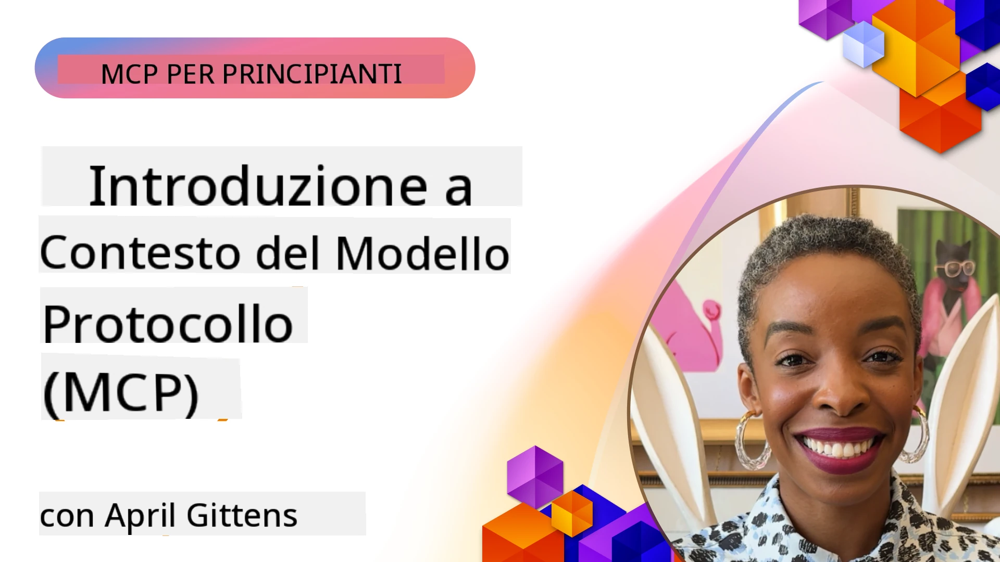
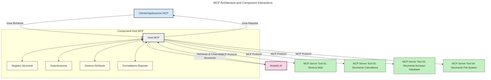
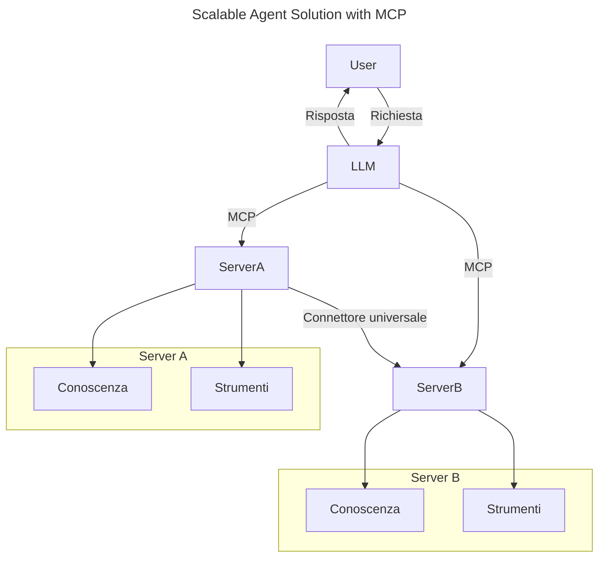
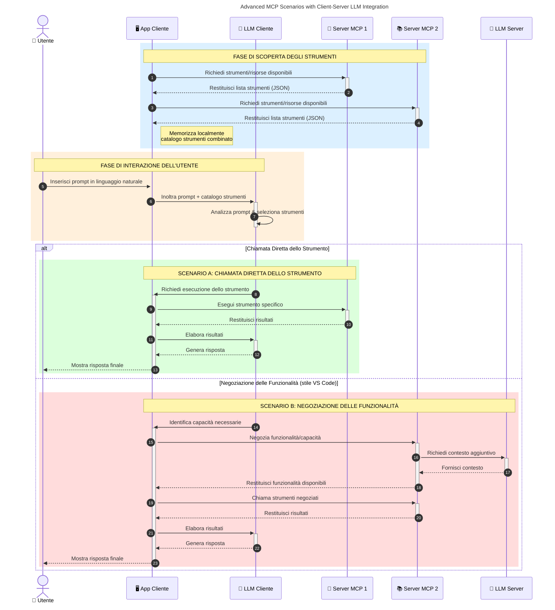

# Introduzione al Model Context Protocol (MCP): Perché È Importante per Applicazioni AI Scalabili

_(Clicca sull'immagine sopra per vedere il video di questa lezione)_

Le applicazioni di AI generativa rappresentano un grande passo avanti in quanto spesso permettono all'utente di interagire con l'app utilizzando prompt in linguaggio naturale. Tuttavia, man mano che si investono più tempo e risorse in queste app, è importante assicurarsi di poter integrare facilmente funzionalità e risorse in modo che sia semplice estendere l'app, che l'app possa supportare l'uso di più modelli e gestire varie complessità dei modelli. In breve, costruire app di Gen AI è facile all'inizio, ma man mano che crescono e diventano più complesse, è necessario iniziare a definire un'architettura e probabilmente basarsi su uno standard per garantire che le app siano costruite in modo coerente. È qui che entra in gioco MCP per organizzare le cose e fornire uno standard.

---

## **🔍 Cos'è il Model Context Protocol (MCP)?**

Il **Model Context Protocol (MCP)** è un'**interfaccia aperta e standardizzata** che permette ai Large Language Models (LLM) di interagire senza problemi con strumenti esterni, API e fonti di dati. Fornisce un'architettura coerente per migliorare la funzionalità dei modelli AI oltre i dati di addestramento, consentendo sistemi AI più intelligenti, scalabili e reattivi.

---

## **🎯 Perché la Standardizzazione nell'AI è Importante**

Man mano che le applicazioni di AI generativa diventano più complesse, è essenziale adottare standard che garantiscano **scalabilità, estendibilità, manutenibilità** e **evitare il vendor lock-in**. MCP risponde a queste esigenze:

- Unificando le integrazioni modello-strumento
- Riducendo soluzioni personalizzate fragili e isolate
- Permettendo a più modelli di diversi fornitori di coesistere all'interno di un unico ecosistema

**Nota:** Anche se MCP si presenta come uno standard aperto, non ci sono piani per standardizzare MCP attraverso enti di standardizzazione esistenti come IEEE, IETF, W3C, ISO o altri enti.

---

## **📚 Obiettivi di Apprendimento**

Al termine di questo articolo, sarai in grado di:

- Definire **Model Context Protocol (MCP)** e i suoi casi d'uso
- Comprendere come MCP standardizza la comunicazione modello-strumento
- Identificare i componenti principali dell'architettura MCP
- Esplorare applicazioni reali di MCP in contesti aziendali e di sviluppo

---

## **💡 Perché il Model Context Protocol (MCP) è un Cambiamento Rivoluzionario**

### **🔗 MCP Risolve la Frammentazione nelle Interazioni AI**

Prima di MCP, integrare modelli con strumenti richiedeva:

- Codice personalizzato per ogni coppia strumento-modello
- API non standard per ciascun fornitore
- Interruzioni frequenti dovute ad aggiornamenti
- Scarsa scalabilità con l'aumentare degli strumenti

### **✅ Vantaggi della Standardizzazione MCP**

| **Vantaggio**             | **Descrizione**                                                                 |
|--------------------------|---------------------------------------------------------------------------------|
| Interoperabilità         | Gli LLM funzionano senza problemi con strumenti di diversi fornitori            |
| Coerenza                 | Comportamento uniforme su piattaforme e strumenti                               |
| Riutilizzabilità         | Strumenti creati una volta possono essere usati su progetti e sistemi diversi    |
| Sviluppo Accelerato      | Riduce il tempo di sviluppo usando interfacce standard plug-and-play            |

---

## **🧱 Panoramica ad Alto Livello dell'Architettura MCP**

MCP segue un **modello client-server**, dove:

- Gli **Host MCP** eseguono i modelli AI
- I **Client MCP** avviano richieste
- I **Server MCP** forniscono contesto, strumenti e capacità

### **Componenti Chiave:**

- **Risorse** – Dati statici o dinamici per i modelli  
- **Prompt** – Flussi di lavoro predefiniti per generazione guidata  
- **Strumenti** – Funzioni eseguibili come ricerca, calcoli  
- **Campionamento** – Comportamento agentico tramite interazioni ricorsive (deprecato in
    MCP `2026-07-28`; le nuove implementazioni dovrebbero integrarsi direttamente con un fornitore LLM)

- **Elicitazione** – Richieste di input utente avviate dal server
- **Radici** – Posizioni informative nel filesystem rilevanti per un server
    (deprecato in MCP `2026-07-28`; si preferiscono parametri dello strumento, URI delle risorse o
    configurazione del server)

### **Architettura del Protocollo:**

MCP utilizza un'architettura a due livelli:
- **Livello Dati**: messaggi JSON-RPC 2.0, metadata per richiesta, discovery e
    primitive del protocollo
- **Livello Trasporto**: stdio per processi locali e Streamable HTTP per
    server remoti. Streamable HTTP può usare framing SSE per risposte in streaming,
    ma il vecchio trasporto HTTP+SSE è deprecato.

---

## Come Funzionano i Server MCP

I server MCP operano nel modo seguente:

- **Flusso di Richiesta**:
    1. Una richiesta è iniziata da un utente finale o da software che agisce per suo conto.
    2. Il **Client MCP** invia la richiesta a un **Host MCP**, che gestisce il runtime del modello AI.
    3. Il **Modello AI** riceve il prompt utente e può richiedere l'accesso a strumenti esterni o dati tramite una o più chiamate a strumenti.
    4. L'**Host MCP**, non il modello direttamente, comunica con il/i **Server MCP** appropriato/i usando il protocollo standardizzato.
- **Funzionalità dell'Host MCP**:
    - **Registro degli Strumenti**: Mantiene un catalogo degli strumenti disponibili e delle loro capacità.
    - **Autenticazione**: Verifica le autorizzazioni per l'accesso agli strumenti.
    - **Gestore delle Richieste**: Elabora le richieste di strumenti provenienti dal modello.
    - **Formattatore di Risposte**: Struttura gli output degli strumenti in un formato comprensibile dal modello.
- **Esecuzione del Server MCP**:
    - L'**Host MCP** inoltra le chiamate a strumenti a uno o più **Server MCP**, ciascuno che espone funzioni specializzate (per es. ricerca, calcoli, query di database).
    - I **Server MCP** eseguono le operazioni rispettive e ritornano i risultati all'**Host MCP** in un formato coerente.
    - L'**Host MCP** formatta e inoltra questi risultati al **Modello AI**.
- **Completamento della Risposta**:
    - Il **Modello AI** integra gli output degli strumenti in una risposta finale.
    - L'**Host MCP** invia questa risposta al **Client MCP**, che la consegna all'utente finale o al software chiamante.
    

## 👨‍💻 Come Costruire un Server MCP (con Esempi)

I server MCP ti permettono di estendere le capacità degli LLM fornendo dati e funzionalità. 

Pronto a provarlo? Ecco SDK specifici per linguaggio e/o stack con esempi di creazione di semplici server MCP in diversi linguaggi/stack:

- **Python SDK**: https://github.com/modelcontextprotocol/python-sdk

- **TypeScript SDK**: https://github.com/modelcontextprotocol/typescript-sdk

- **Java SDK**: https://github.com/modelcontextprotocol/java-sdk

- **C#/.NET SDK**: https://github.com/modelcontextprotocol/csharp-sdk

## 🌍 Casi d'Uso Reali per MCP

MCP permette un'ampia gamma di applicazioni estendendo le capacità AI:

| **Applicazione**              | **Descrizione**                                                                |
|------------------------------|--------------------------------------------------------------------------------|
| Integrazione Dati Aziendali  | Collegare LLM a database, CRM o strumenti interni                              |
| Sistemi AI Agentici           | Abilitare agenti autonomi con accesso a strumenti e flussi decisionali         |
| Applicazioni Multi-modali     | Combinare strumenti di testo, immagine e audio in un'unica app AI             |
| Integrazione Dati in Tempo Reale | Inserire dati live nelle interazioni AI per output più accurati e aggiornati |

### 🧠 MCP = Standard Universale per le Interazioni AI

Il Model Context Protocol (MCP) agisce come uno standard universale per le interazioni AI, proprio come USB-C ha standardizzato le connessioni fisiche per i dispositivi. Nel mondo dell'AI, MCP fornisce un'interfaccia coerente, permettendo ai modelli (client) di integrarsi senza problemi con strumenti esterni e fornitori di dati (server). Questo elimina la necessità di protocolli personalizzati e diversi per ogni API o fonte di dati.

Secondo MCP, uno strumento compatibile MCP (chiamato server MCP) segue uno standard unificato. Questi server possono elencare gli strumenti o le azioni che offrono ed eseguire tali azioni su richiesta di un agente AI. Le piattaforme agent AI che supportano MCP sono capaci di scoprire strumenti disponibili dai server e invocarli tramite questo protocollo standard.

### 💡 Facilita l'accesso alla conoscenza

Oltre a offrire strumenti, MCP facilita anche l'accesso alla conoscenza. Permette alle applicazioni di fornire contesto ai modelli linguistici di grandi dimensioni (LLM) collegandoli a varie fonti di dati. Per esempio, un server MCP potrebbe rappresentare un archivio documentale aziendale, consentendo agli agenti di recuperare informazioni rilevanti su richiesta. Un altro server potrebbe gestire azioni specifiche come inviare email o aggiornare record. Dal punto di vista dell'agente, questi sono semplicemente strumenti che può usare—alcuni strumenti restituiscono dati (contesto di conoscenza), mentre altri eseguono azioni. MCP gestisce entrambi in modo efficiente.

Un agente che si connette a un server MCP apprende automaticamente le capacità disponibili e i dati accessibili tramite un formato standard. Questa standardizzazione abilita la disponibilità dinamica degli strumenti. Per esempio, aggiungendo un nuovo server MCP al sistema di un agente, le sue funzioni diventano immediatamente utilizzabili senza richiedere ulteriori personalizzazioni delle istruzioni dell'agente.

Questa integrazione semplificata si allinea al flusso rappresentato nel diagramma seguente, dove i server forniscono sia strumenti che conoscenza, assicurando una collaborazione senza soluzione di continuità tra i sistemi. 

### 👉 Esempio: Soluzione Agent Scalabile

Il Connettore Universale permette ai server MCP di comunicare e condividere capacità tra loro, consentendo a ServerA di delegare compiti a ServerB o di accedere ai suoi strumenti e conoscenze. Questo federazione di strumenti e dati tra server supporta architetture agent modulari e scalabili. Poiché MCP standardizza l'esposizione degli strumenti, gli agenti possono scoprire dinamicamente e instradare le richieste tra server senza integrazioni codificate.

Federazione di strumenti e conoscenza: strumenti e dati possono essere accessi tra server, permettendo architetture agentiche più scalabili e modulari.

### 🔄 Scenari Avanzati MCP con Integrazione LLM Client-Side

Oltre all'architettura base MCP, esistono scenari avanzati in cui sia client che server contengono LLM, permettendo interazioni più sofisticate. Nel diagramma seguente, **Client App** potrebbe essere un IDE con diversi strumenti MCP disponibili per l'uso da parte dell'LLM:

## 🔐 Benefici Pratici di MCP

Ecco i benefici pratici dell'uso di MCP:

- **Aggiornamento**: I modelli possono accedere a informazioni aggiornate oltre i dati di addestramento
- **Estensione delle Capacità**: I modelli possono sfruttare strumenti specializzati per compiti per cui non sono stati addestrati
- **Riduzione delle Allucinazioni**: Fonti di dati esterni forniscono basi fattuali
- **Privacy**: I dati sensibili possono rimanere in ambienti sicuri invece di essere incorporati nei prompt

## 📌 Punti Chiave da Ricordare

Ecco i punti chiave nell'usare MCP:

- **MCP** standardizza come i modelli AI interagiscono con strumenti e dati
- Promuove **estendibilità, coerenza e interoperabilità**
- MCP aiuta a **ridurre i tempi di sviluppo, migliorare l'affidabilità ed estendere le capacità dei modelli**
- L'architettura client-server **permette applicazioni AI flessibili ed estendibili**

## 🧠 Esercizio

Pensa a un'applicazione AI che ti interessa costruire.

- Quali **strumenti esterni o dati** potrebbero migliorare le sue capacità?
- Come potrebbe MCP rendere l'integrazione **più semplice e affidabile?**

## Risorse Aggiuntive

- [Repository GitHub MCP](https://github.com/modelcontextprotocol)

## Cosa c'è dopo

Prossimo: [Capitolo 1: Concetti Base](../01-CoreConcepts/README.md)

---

<!-- CO-OP TRANSLATOR DISCLAIMER START -->
**Disclaimer**:
Questo documento è stato tradotto utilizzando il servizio di traduzione AI [Co-op Translator](https://github.com/Azure/co-op-translator). Sebbene ci impegniamo per garantire la precisione, si prega di notare che le traduzioni automatizzate possono contenere errori o imprecisioni. Il documento originale nella sua lingua nativa deve essere considerato la fonte autorevole. Per informazioni critiche, si raccomanda una traduzione professionale effettuata da un essere umano. Non siamo responsabili per eventuali malintesi o interpretazioni errate derivanti dall’uso di questa traduzione.
<!-- CO-OP TRANSLATOR DISCLAIMER END -->