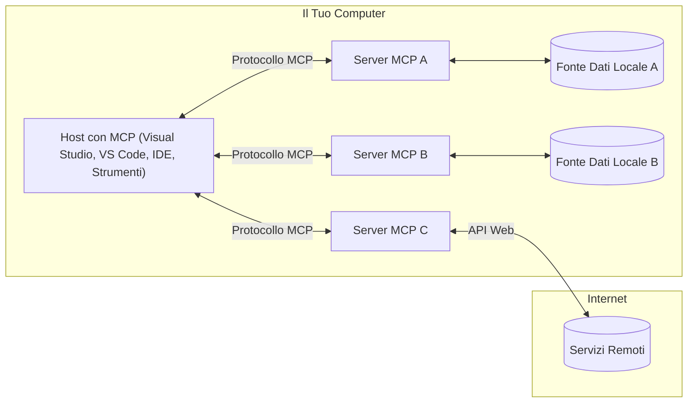

# Concetti Fondamentali di MCP: Padroneggiare il Model Context Protocol per l'Integrazione AI

[](https://youtu.be/earDzWGtE84)

_(Clicca sull'immagine sopra per vedere il video di questa lezione)_

Il [Model Context Protocol (MCP)](https://github.com/modelcontextprotocol) è un potente framework standardizzato che ottimizza la comunicazione tra Large Language Models (LLM) e strumenti esterni, applicazioni e fonti di dati.  
Questa guida ti accompagnerà attraverso i concetti fondamentali di MCP. Imparerai la sua architettura client-server, i componenti essenziali, i meccanismi di comunicazione e le migliori pratiche di implementazione.

- **Consenso Esplicito dell'Utente**: Tutti gli accessi ai dati e le operazioni richiedono l'approvazione esplicita dell'utente prima dell'esecuzione. Gli utenti devono comprendere chiaramente quali dati saranno accessibili e quali azioni saranno eseguite, con un controllo granulare su permessi e autorizzazioni.

- **Protezione della Privacy dei Dati**: I dati degli utenti sono esposti solo con consenso esplicito e devono essere protetti da robusti controlli di accesso durante l'intero ciclo di vita dell'interazione. Le implementazioni devono prevenire trasmissioni non autorizzate e mantenere rigidi confini di privacy.

- **Sicurezza nell'Esecuzione degli Strumenti**: Ogni invocazione di uno strumento richiede il consenso esplicito dell'utente con chiara comprensione della funzionalità, dei parametri e dell'impatto potenziale dello strumento. Devono essere implementati confini di sicurezza robusti per prevenire esecuzioni non intenzionali, non sicure o dannose.

- **Sicurezza del Livello di Trasporto**: Tutti i canali di comunicazione devono utilizzare meccanismi appropriati di crittografia e autenticazione. Le connessioni remote devono implementare protocolli di trasporto sicuri e una corretta gestione delle credenziali.

#### Linee Guida per l'Implementazione:

- **Gestione dei Permessi**: Implementare sistemi di permessi granulare che permettano agli utenti di controllare quali server, strumenti e risorse sono accessibili  
- **Autenticazione & Autorizzazione**: Usare metodi di autenticazione sicuri (OAuth, chiavi API) con una corretta gestione e scadenza dei token  
- **Validazione degli Input**: Validare tutti i parametri e gli input dati secondo schemi definiti per prevenire attacchi di injection  
- **Audit Logging**: Mantenere log completi di tutte le operazioni per monitoraggio della sicurezza e conformità  

## Panoramica

Questa lezione esplora l'architettura fondamentale e i componenti che costituiscono l'ecosistema del Model Context Protocol (MCP). Imparerai l'architettura client-server, i componenti chiave e i meccanismi di comunicazione che alimentano le interazioni MCP.

## Obiettivi Chiave di Apprendimento

Al termine di questa lezione, sarai in grado di:

- Comprendere l'architettura client-server di MCP.  
- Identificare ruoli e responsabilità di Host, Client e Server.  
- Analizzare le caratteristiche principali che rendono MCP un livello di integrazione flessibile.  
- Imparare come fluisce l'informazione all'interno dell'ecosistema MCP.  
- Ottenere approfondimenti pratici tramite esempi di codice in .NET, Java, Python e JavaScript.

## Architettura MCP: Uno Sguardo Approfondito

L'ecosistema MCP è costruito su un modello client-server. Questa struttura modulare permette alle applicazioni AI di interagire in modo efficiente con strumenti, database, API e risorse contestuali. Analizziamo questa architettura nei suoi componenti fondamentali.

Alla base, MCP segue un'architettura client-server dove un'applicazione host può connettersi a più server:


- **Host MCP**: Programmi come VSCode, Claude Desktop, IDE o strumenti AI che vogliono accedere ai dati tramite MCP  
- **Client MCP**: Client del protocollo che mantengono connessioni 1:1 con i server  
- **Server MCP**: Programmi leggeri che espongono specifiche capacità tramite il Model Context Protocol standardizzato  
- **Fonti Dati Locali**: File, database e servizi del tuo computer a cui i server MCP possono accedere in modo sicuro  
- **Servizi Remoti**: Sistemi esterni disponibili su internet a cui i server MCP possono connettersi tramite API.

Il Protocollo MCP è uno standard in evoluzione che utilizza versioni basate sulla data (formato AAAA-MM-GG). La versione attuale del protocollo è **2025-11-25**. Puoi vedere gli ultimi aggiornamenti alla [specifica del protocollo](https://modelcontextprotocol.io/specification/2025-11-25/)

### 1. Host

Nel Model Context Protocol (MCP), gli **Host** sono applicazioni AI che fungono da interfaccia principale attraverso cui gli utenti interagiscono con il protocollo. Gli Host coordinano e gestiscono le connessioni a più server MCP creando client MCP dedicati per ogni connessione server. Esempi di Host includono:

- **Applicazioni AI**: Claude Desktop, Visual Studio Code, Claude Code  
- **Ambienti di Sviluppo**: IDE e editor di codice con integrazione MCP  
- **Applicazioni Personalizzate**: Agenti AI e strumenti costruiti su misura

Gli **Host** sono applicazioni che coordinano le interazioni con i modelli AI. Essi:

- **Orchestrano i Modelli AI**: Eseguono o interagiscono con LLM per generare risposte e coordinare flussi di lavoro AI  
- **Gestiscono le Connessioni Client**: Creano e mantengono un client MCP per ogni connessione a un server MCP  
- **Controllano l'Interfaccia Utente**: Gestiscono il flusso della conversazione, le interazioni utente e la presentazione delle risposte  
- **Applicano la Sicurezza**: Controllano permessi, vincoli di sicurezza e autenticazione  
- **Gestiscono il Consenso Utente**: Amministrano l'approvazione dell'utente per la condivisione dei dati e l'esecuzione degli strumenti  

### 2. Client

I **Client** sono componenti essenziali che mantengono connessioni dedicate uno a uno tra Host e server MCP. Ogni client MCP è istanziato dall'Host per connettersi a uno specifico server MCP, garantendo canali di comunicazione organizzati e sicuri. Molteplici client permettono agli Host di connettersi simultaneamente a più server.

I **Client** sono componenti connettori all'interno dell'applicazione host. Essi:

- **Comunicazione del Protocollo**: Invia richieste JSON-RPC 2.0 ai server con prompt e istruzioni  
- **Negoziazione delle Capacità**: Negoziano funzionalità supportate e versioni del protocollo con i server durante l'inizializzazione  
- **Esecuzione degli Strumenti**: Gestiscono richieste di esecuzione strumenti dai modelli e processano le risposte  
- **Aggiornamenti in Tempo Reale**: Gestiscono notifiche e aggiornamenti in tempo reale dai server  
- **Elaborazione delle Risposte**: Processano e formattano le risposte del server per la visualizzazione agli utenti  

### 3. Server

I **Server** sono programmi che forniscono contesto, strumenti e capacità ai client MCP. Possono essere eseguiti localmente (sulla stessa macchina dell'Host) o remotamente (su piattaforme esterne), e sono responsabili di gestire le richieste dei client e fornire risposte strutturate. I server espongono funzionalità specifiche tramite il Model Context Protocol standardizzato.

I **Server** sono servizi che forniscono contesto e capacità. Essi:

- **Registrazione delle Funzionalità**: Registrano ed espongono primitive disponibili (risorse, prompt, strumenti) ai client  
- **Elaborazione delle Richieste**: Ricevono ed eseguono chiamate a strumenti, richieste di risorse e prompt dai client  
- **Fornitura di Contesto**: Forniscono informazioni contestuali e dati per migliorare le risposte del modello  
- **Gestione dello Stato**: Mantengono lo stato della sessione e gestiscono interazioni con stato quando necessario  
- **Notifiche in Tempo Reale**: Inviamo notifiche su cambiamenti di capacità e aggiornamenti ai client connessi  

I server possono essere sviluppati da chiunque per estendere le capacità del modello con funzionalità specializzate, e supportano sia scenari di deployment locale che remoto.

### 4. Primitive del Server

I server nel Model Context Protocol (MCP) forniscono tre core **primitive** che definiscono i blocchi fondamentali per interazioni ricche tra client, host e modelli linguistici. Queste primitive specificano i tipi di informazioni contestuali e azioni disponibili tramite il protocollo.

I server MCP possono esporre qualsiasi combinazione delle seguenti tre primitive core:

#### Risorse

Le **Risorse** sono fonti di dati che forniscono informazioni contestuali alle applicazioni AI. Rappresentano contenuti statici o dinamici che possono migliorare la comprensione e il processo decisionale del modello:

- **Dati Contestuali**: Informazioni strutturate e contesto per il consumo del modello AI  
- **Basi di Conoscenza**: Repositori di documenti, articoli, manuali e pubblicazioni scientifiche  
- **Fonti Dati Locali**: File, database e informazioni di sistema locale  
- **Dati Esterni**: Risposte API, servizi web e dati di sistemi remoti  
- **Contenuti Dinamici**: Dati in tempo reale che si aggiornano in base a condizioni esterne

Le risorse sono identificate da URI e supportano la scoperta tramite i metodi `resources/list` e il recupero tramite `resources/read`:

```text
file://documents/project-spec.md
database://production/users/schema
api://weather/current
```

#### Prompt

I **Prompt** sono template riutilizzabili che aiutano a strutturare le interazioni con i modelli linguistici. Forniscono schemi di interazione standardizzati e flussi di lavoro templateizzati:

- **Interazioni Basate su Template**: Messaggi pre-strutturati e iniziatori di conversazione  
- **Template di Workflow**: Sequenze standardizzate per compiti e interazioni comuni  
- **Esempi Few-shot**: Template basati su esempi per l'istruzione del modello  
- **Prompt di Sistema**: Prompt fondamentali che definiscono il comportamento e il contesto del modello  
- **Template Dinamici**: Prompt parametrizzati che si adattano a contesti specifici

I prompt supportano la sostituzione di variabili e possono essere scoperti tramite `prompts/list` e recuperati con `prompts/get`:

```markdown
Generate a {{task_type}} for {{product}} targeting {{audience}} with the following requirements: {{requirements}}
```

#### Strumenti

Gli **Strumenti** sono funzioni eseguibili che i modelli AI possono invocare per eseguire azioni specifiche. Rappresentano i "verbi" dell'ecosistema MCP, permettendo ai modelli di interagire con sistemi esterni:

- **Funzioni Eseguibili**: Operazioni discrete che i modelli possono invocare con parametri specifici  
- **Integrazione con Sistemi Esterni**: Chiamate API, query a database, operazioni su file, calcoli  
- **Identità Unica**: Ogni strumento ha un nome distinto, descrizione e schema dei parametri  
- **I/O Strutturato**: Gli strumenti accettano parametri validati e restituiscono risposte strutturate e tipizzate  
- **Capacità di Azione**: Permettono ai modelli di eseguire azioni reali e recuperare dati live

Gli strumenti sono definiti con JSON Schema per la validazione dei parametri e scoperti tramite `tools/list` ed eseguiti via `tools/call`:

```typescript
server.tool(
  "search_products", 
  {
    query: z.string().describe("Search query for products"),
    category: z.string().optional().describe("Product category filter"),
    max_results: z.number().default(10).describe("Maximum results to return")
  }, 
  async (params) => {
    // Esegui la ricerca e restituisci risultati strutturati
    return await productService.search(params);
  }
);
```

## Primitive Client

Nel Model Context Protocol (MCP), i **client** possono esporre primitive che permettono ai server di richiedere capacità aggiuntive dall'applicazione host. Queste primitive lato client consentono implementazioni server più ricche e interattive che possono accedere a capacità del modello AI e interazioni utente.

### Sampling

Il **Sampling** permette ai server di richiedere completamenti del modello linguistico dall'app AI del client. Questa primitiva consente ai server di accedere alle capacità LLM senza incorporare le proprie dipendenze di modello:

- **Accesso Indipendente dal Modello**: I server possono richiedere completamenti senza includere SDK LLM o gestire l'accesso al modello  
- **AI Iniziata dal Server**: Permette ai server di generare autonomamente contenuti usando il modello AI del client  
- **Interazioni LLM Ricorsive**: Supporta scenari complessi in cui i server necessitano assistenza AI per l'elaborazione  
- **Generazione Dinamica di Contenuti**: Consente ai server di creare risposte contestuali usando il modello dell'host

Il sampling è avviato tramite il metodo `sampling/complete`, dove i server inviano richieste di completamento ai client.

### Elicitation

L'**Elicitation** permette ai server di richiedere informazioni aggiuntive o conferme dagli utenti tramite l'interfaccia client:

- **Richieste di Input Utente**: I server possono chiedere informazioni aggiuntive quando necessarie per l'esecuzione degli strumenti  
- **Dialoghi di Conferma**: Richiedere l'approvazione dell'utente per operazioni sensibili o impattanti  
- **Workflow Interattivi**: Permettere ai server di creare interazioni utente passo-passo  
- **Raccolta Dinamica di Parametri**: Raccogliere parametri mancanti o opzionali durante l'esecuzione degli strumenti

Le richieste di elicitation sono effettuate usando il metodo `elicitation/request` per raccogliere input utente tramite l'interfaccia del client.

### Logging

Il **Logging** permette ai server di inviare messaggi di log strutturati ai client per debugging, monitoraggio e visibilità operativa:

- **Supporto al Debugging**: Permettere ai server di fornire log dettagliati di esecuzione per la risoluzione dei problemi  
- **Monitoraggio Operativo**: Inviare aggiornamenti di stato e metriche di performance ai client  
- **Segnalazione Errori**: Fornire contesto dettagliato sugli errori e informazioni diagnostiche  
- **Tracce di Audit**: Creare log completi delle operazioni e decisioni del server

I messaggi di logging sono inviati ai client per fornire trasparenza sulle operazioni del server e facilitare il debugging.

## Flusso di Informazioni in MCP

Il Model Context Protocol (MCP) definisce un flusso strutturato di informazioni tra host, client, server e modelli. Comprendere questo flusso aiuta a chiarire come le richieste degli utenti vengono processate e come strumenti esterni e dati sono integrati nelle risposte del modello.

- **L'Host Inizia la Connessione**  
  L'applicazione host (come un IDE o un'interfaccia chat) stabilisce una connessione a un server MCP, tipicamente tramite STDIO, WebSocket o altro trasporto supportato.

- **Negoziazione delle Capacità**  
  Il client (incorporato nell'host) e il server scambiano informazioni sulle funzionalità supportate, strumenti, risorse e versioni del protocollo. Questo assicura che entrambe le parti comprendano quali capacità sono disponibili per la sessione.

- **Richiesta Utente**  
  L'utente interagisce con l'host (ad esempio inserendo un prompt o comando). L'host raccoglie questo input e lo passa al client per l'elaborazione.

- **Uso di Risorse o Strumenti**  
  - Il client può richiedere ulteriore contesto o risorse dal server (come file, voci di database o articoli di basi di conoscenza) per arricchire la comprensione del modello.  
  - Se il modello determina che è necessario uno strumento (ad esempio per recuperare dati, eseguire un calcolo o chiamare un'API), il client invia una richiesta di invocazione dello strumento al server, specificando nome e parametri dello strumento.

- **Esecuzione del Server**  
  Il server riceve la richiesta di risorsa o strumento, esegue le operazioni necessarie (come eseguire una funzione, interrogare un database o recuperare un file) e restituisce i risultati al client in un formato strutturato.

- **Generazione della Risposta**  
  Il client integra le risposte del server (dati risorsa, output degli strumenti, ecc.) nell'interazione in corso con il modello. Il modello usa queste informazioni per generare una risposta completa e contestualmente rilevante.

- **Presentazione del Risultato**  
  L'host riceve l'output finale dal client e lo presenta all'utente, spesso includendo sia il testo generato dal modello sia eventuali risultati da esecuzioni di strumenti o ricerche di risorse.

Questo flusso permette a MCP di supportare applicazioni AI avanzate, interattive e consapevoli del contesto collegando senza soluzione di continuità modelli con strumenti esterni e fonti di dati.

## Architettura e Livelli del Protocollo

MCP consiste in due distinti livelli architetturali che lavorano insieme per fornire un framework di comunicazione completo:

### Livello Dati

Il **Livello Dati** implementa il protocollo MCP core usando **JSON-RPC 2.0** come base. Questo livello definisce la struttura dei messaggi, la semantica e i pattern di interazione:

#### Componenti Core:

- **Protocollo JSON-RPC 2.0**: Tutta la comunicazione utilizza il formato standardizzato di messaggi JSON-RPC 2.0 per chiamate di metodo, risposte e notifiche
- **Gestione del ciclo di vita**: Gestisce l'inizializzazione della connessione, la negoziazione delle capacità e la terminazione della sessione tra client e server
- **Primitive del server**: Consente ai server di fornire funzionalità di base tramite strumenti, risorse e prompt
- **Primitive del client**: Consente ai server di richiedere campionamenti da LLM, sollecitare input dall'utente e inviare messaggi di log
- **Notifiche in tempo reale**: Supporta notifiche asincrone per aggiornamenti dinamici senza polling

#### Caratteristiche principali:

- **Negoziazione della versione del protocollo**: Utilizza versioni basate sulla data (YYYY-MM-DD) per garantire la compatibilità
- **Scoperta delle capacità**: Client e server scambiano informazioni sulle funzionalità supportate durante l'inizializzazione
- **Sessioni con stato**: Mantiene lo stato della connessione attraverso più interazioni per la continuità del contesto

### Livello di trasporto

Il **Livello di trasporto** gestisce i canali di comunicazione, l'incapsulamento dei messaggi e l'autenticazione tra i partecipanti MCP:

#### Meccanismi di trasporto supportati:

1. **Trasporto STDIO**:
   - Utilizza i flussi di input/output standard per la comunicazione diretta tra processi
   - Ottimale per processi locali sulla stessa macchina senza overhead di rete
   - Comunemente usato per implementazioni locali di server MCP

2. **Trasporto HTTP streamabile**:
   - Utilizza HTTP POST per i messaggi da client a server  
   - Eventi inviati dal server (SSE) opzionali per streaming da server a client
   - Consente la comunicazione con server remoti attraverso reti
   - Supporta l'autenticazione HTTP standard (token bearer, chiavi API, header personalizzati)
   - MCP raccomanda OAuth per un'autenticazione sicura basata su token

#### Astrazione del trasporto:

Il livello di trasporto astrae i dettagli di comunicazione dal livello dati, permettendo lo stesso formato di messaggi JSON-RPC 2.0 su tutti i meccanismi di trasporto. Questa astrazione consente alle applicazioni di passare senza soluzione di continuità tra server locali e remoti.

### Considerazioni sulla sicurezza

Le implementazioni MCP devono aderire a diversi principi di sicurezza critici per garantire interazioni sicure, affidabili e protette in tutte le operazioni del protocollo:

- **Consenso e controllo dell'utente**: Gli utenti devono fornire consenso esplicito prima che qualsiasi dato venga accesso o che operazioni vengano eseguite. Devono avere un controllo chiaro su quali dati vengono condivisi e quali azioni sono autorizzate, supportati da interfacce utente intuitive per la revisione e l'approvazione delle attività.

- **Privacy dei dati**: I dati degli utenti devono essere esposti solo con consenso esplicito e protetti da adeguati controlli di accesso. Le implementazioni MCP devono prevenire la trasmissione non autorizzata di dati e garantire che la privacy sia mantenuta in tutte le interazioni.

- **Sicurezza degli strumenti**: Prima di invocare qualsiasi strumento è richiesto il consenso esplicito dell'utente. Gli utenti devono comprendere chiaramente la funzionalità di ogni strumento e devono essere applicati confini di sicurezza robusti per prevenire esecuzioni non intenzionali o non sicure degli strumenti.

Seguendo questi principi di sicurezza, MCP garantisce la fiducia, la privacy e la sicurezza degli utenti in tutte le interazioni del protocollo, abilitando al contempo potenti integrazioni AI.

## Esempi di codice: componenti chiave

Di seguito sono riportati esempi di codice in diversi linguaggi di programmazione popolari che illustrano come implementare componenti chiave del server MCP e strumenti.

### Esempio .NET: Creare un semplice server MCP con strumenti

Ecco un esempio pratico in .NET che dimostra come implementare un semplice server MCP con strumenti personalizzati. Questo esempio mostra come definire e registrare strumenti, gestire richieste e connettere il server usando il Model Context Protocol.

```csharp
using System;
using System.Threading.Tasks;
using ModelContextProtocol.Server;
using ModelContextProtocol.Server.Transport;
using ModelContextProtocol.Server.Tools;

public class WeatherServer
{
    public static async Task Main(string[] args)
    {
        // Create an MCP server
        var server = new McpServer(
            name: "Weather MCP Server",
            version: "1.0.0"
        );
        
        // Register our custom weather tool
        server.AddTool<string, WeatherData>("weatherTool", 
            description: "Gets current weather for a location",
            execute: async (location) => {
                // Call weather API (simplified)
                var weatherData = await GetWeatherDataAsync(location);
                return weatherData;
            });
        
        // Connect the server using stdio transport
        var transport = new StdioServerTransport();
        await server.ConnectAsync(transport);
        
        Console.WriteLine("Weather MCP Server started");
        
        // Keep the server running until process is terminated
        await Task.Delay(-1);
    }
    
    private static async Task<WeatherData> GetWeatherDataAsync(string location)
    {
        // This would normally call a weather API
        // Simplified for demonstration
        await Task.Delay(100); // Simulate API call
        return new WeatherData { 
            Temperature = 72.5,
            Conditions = "Sunny",
            Location = location
        };
    }
}

public class WeatherData
{
    public double Temperature { get; set; }
    public string Conditions { get; set; }
    public string Location { get; set; }
}
```

### Esempio Java: Componenti server MCP

Questo esempio dimostra lo stesso server MCP e la registrazione degli strumenti come nell'esempio .NET sopra, ma implementato in Java.

```java
import io.modelcontextprotocol.server.McpServer;
import io.modelcontextprotocol.server.McpToolDefinition;
import io.modelcontextprotocol.server.transport.StdioServerTransport;
import io.modelcontextprotocol.server.tool.ToolExecutionContext;
import io.modelcontextprotocol.server.tool.ToolResponse;

public class WeatherMcpServer {
    public static void main(String[] args) throws Exception {
        // Crea un server MCP
        McpServer server = McpServer.builder()
            .name("Weather MCP Server")
            .version("1.0.0")
            .build();
            
        // Registra uno strumento meteo
        server.registerTool(McpToolDefinition.builder("weatherTool")
            .description("Gets current weather for a location")
            .parameter("location", String.class)
            .execute((ToolExecutionContext ctx) -> {
                String location = ctx.getParameter("location", String.class);
                
                // Ottieni dati meteo (semplificato)
                WeatherData data = getWeatherData(location);
                
                // Restituisci risposta formattata
                return ToolResponse.content(
                    String.format("Temperature: %.1f°F, Conditions: %s, Location: %s", 
                    data.getTemperature(), 
                    data.getConditions(), 
                    data.getLocation())
                );
            })
            .build());
        
        // Connetti il server usando il trasporto stdio
        try (StdioServerTransport transport = new StdioServerTransport()) {
            server.connect(transport);
            System.out.println("Weather MCP Server started");
            // Mantieni il server in esecuzione fino alla terminazione del processo
            Thread.currentThread().join();
        }
    }
    
    private static WeatherData getWeatherData(String location) {
        // L'implementazione chiamerebbe un'API meteo
        // Semplificato a scopo di esempio
        return new WeatherData(72.5, "Sunny", location);
    }
}

class WeatherData {
    private double temperature;
    private String conditions;
    private String location;
    
    public WeatherData(double temperature, String conditions, String location) {
        this.temperature = temperature;
        this.conditions = conditions;
        this.location = location;
    }
    
    public double getTemperature() {
        return temperature;
    }
    
    public String getConditions() {
        return conditions;
    }
    
    public String getLocation() {
        return location;
    }
}
```

### Esempio Python: Costruire un server MCP

Questo esempio utilizza fastmcp, quindi assicurati di installarlo prima:

```python
pip install fastmcp
```
Esempio di codice:

```python
#!/usr/bin/env python3
import asyncio
from fastmcp import FastMCP
from fastmcp.transports.stdio import serve_stdio

# Crea un server FastMCP
mcp = FastMCP(
    name="Weather MCP Server",
    version="1.0.0"
)

@mcp.tool()
def get_weather(location: str) -> dict:
    """Gets current weather for a location."""
    return {
        "temperature": 72.5,
        "conditions": "Sunny",
        "location": location
    }

# Approccio alternativo usando una classe
class WeatherTools:
    @mcp.tool()
    def forecast(self, location: str, days: int = 1) -> dict:
        """Gets weather forecast for a location for the specified number of days."""
        return {
            "location": location,
            "forecast": [
                {"day": i+1, "temperature": 70 + i, "conditions": "Partly Cloudy"}
                for i in range(days)
            ]
        }

# Registra gli strumenti della classe
weather_tools = WeatherTools()

# Avvia il server
if __name__ == "__main__":
    asyncio.run(serve_stdio(mcp))
```

### Esempio JavaScript: Creare un server MCP

Questo esempio mostra la creazione di un server MCP in JavaScript e come registrare due strumenti relativi al meteo.

```javascript
// Utilizzo dell'SDK ufficiale del Model Context Protocol
import { McpServer } from "@modelcontextprotocol/sdk/server/mcp.js";
import { StdioServerTransport } from "@modelcontextprotocol/sdk/server/stdio.js";
import { z } from "zod"; // Per la validazione dei parametri

// Creare un server MCP
const server = new McpServer({
  name: "Weather MCP Server",
  version: "1.0.0"
});

// Definire uno strumento meteo
server.tool(
  "weatherTool",
  {
    location: z.string().describe("The location to get weather for")
  },
  async ({ location }) => {
    // Normalmente chiamerebbe un'API meteo
    // Semplificato per la dimostrazione
    const weatherData = await getWeatherData(location);
    
    return {
      content: [
        { 
          type: "text", 
          text: `Temperature: ${weatherData.temperature}°F, Conditions: ${weatherData.conditions}, Location: ${weatherData.location}` 
        }
      ]
    };
  }
);

// Definire uno strumento di previsione
server.tool(
  "forecastTool",
  {
    location: z.string(),
    days: z.number().default(3).describe("Number of days for forecast")
  },
  async ({ location, days }) => {
    // Normalmente chiamerebbe un'API meteo
    // Semplificato per la dimostrazione
    const forecast = await getForecastData(location, days);
    
    return {
      content: [
        { 
          type: "text", 
          text: `${days}-day forecast for ${location}: ${JSON.stringify(forecast)}` 
        }
      ]
    };
  }
);

// Funzioni di supporto
async function getWeatherData(location) {
  // Simulare una chiamata API
  return {
    temperature: 72.5,
    conditions: "Sunny",
    location: location
  };
}

async function getForecastData(location, days) {
  // Simulare una chiamata API
  return Array.from({ length: days }, (_, i) => ({
    day: i + 1,
    temperature: 70 + Math.floor(Math.random() * 10),
    conditions: i % 2 === 0 ? "Sunny" : "Partly Cloudy"
  }));
}

// Collegare il server utilizzando il trasporto stdio
const transport = new StdioServerTransport();
server.connect(transport).catch(console.error);

console.log("Weather MCP Server started");
```

Questo esempio JavaScript dimostra come creare un client MCP che si connette a un server, invia un prompt e processa la risposta inclusi eventuali richiami agli strumenti effettuati.

## Sicurezza e autorizzazione

MCP include diversi concetti e meccanismi integrati per gestire sicurezza e autorizzazione in tutto il protocollo:

1. **Controllo dei permessi degli strumenti**:  
  I client possono specificare quali strumenti un modello è autorizzato a usare durante una sessione. Questo garantisce che solo gli strumenti esplicitamente autorizzati siano accessibili, riducendo il rischio di operazioni non intenzionali o non sicure. I permessi possono essere configurati dinamicamente in base alle preferenze dell'utente, alle politiche organizzative o al contesto dell'interazione.

2. **Autenticazione**:  
  I server possono richiedere l'autenticazione prima di concedere l'accesso a strumenti, risorse o operazioni sensibili. Ciò può coinvolgere chiavi API, token OAuth o altri schemi di autenticazione. Una corretta autenticazione garantisce che solo client e utenti affidabili possano invocare capacità lato server.

3. **Validazione**:  
  La validazione dei parametri è applicata per tutte le invocazioni degli strumenti. Ogni strumento definisce i tipi, formati e vincoli attesi per i suoi parametri, e il server valida le richieste in ingresso di conseguenza. Questo previene input malformati o malevoli che raggiungano le implementazioni degli strumenti e aiuta a mantenere l'integrità delle operazioni.

4. **Limitazione della frequenza**:  
  Per prevenire abusi e garantire un uso equo delle risorse del server, i server MCP possono implementare limitazioni di frequenza per le chiamate agli strumenti e l'accesso alle risorse. I limiti possono essere applicati per utente, per sessione o globalmente, e aiutano a proteggere da attacchi di negazione del servizio o consumo eccessivo di risorse.

Combinando questi meccanismi, MCP fornisce una base sicura per integrare modelli linguistici con strumenti e fonti dati esterne, offrendo agli utenti e agli sviluppatori un controllo granulare su accesso e utilizzo.

## Messaggi del protocollo e flusso di comunicazione

La comunicazione MCP utilizza messaggi strutturati **JSON-RPC 2.0** per facilitare interazioni chiare e affidabili tra host, client e server. Il protocollo definisce schemi specifici di messaggi per diversi tipi di operazioni:

### Tipi di messaggi principali:

#### **Messaggi di inizializzazione**
- Richiesta **`initialize`**: Stabilisce la connessione e negozia versione del protocollo e capacità
- Risposta **`initialize`**: Conferma le funzionalità supportate e le informazioni del server  
- **`notifications/initialized`**: Segnala che l'inizializzazione è completata e la sessione è pronta

#### **Messaggi di scoperta**
- Richiesta **`tools/list`**: Scopre gli strumenti disponibili dal server
- Richiesta **`resources/list`**: Elenca le risorse disponibili (fonti dati)
- Richiesta **`prompts/list`**: Recupera i modelli di prompt disponibili

#### **Messaggi di esecuzione**  
- Richiesta **`tools/call`**: Esegue uno strumento specifico con parametri forniti
- Richiesta **`resources/read`**: Recupera contenuti da una risorsa specifica
- Richiesta **`prompts/get`**: Ottiene un modello di prompt con parametri opzionali

#### **Messaggi lato client**
- Richiesta **`sampling/complete`**: Il server richiede completamento LLM dal client
- **`elicitation/request`**: Il server richiede input utente tramite l'interfaccia client
- Messaggi di log: Il server invia messaggi di log strutturati al client

#### **Messaggi di notifica**
- **`notifications/tools/list_changed`**: Il server notifica al client modifiche agli strumenti
- **`notifications/resources/list_changed`**: Il server notifica al client modifiche alle risorse  
- **`notifications/prompts/list_changed`**: Il server notifica al client modifiche ai prompt

### Struttura del messaggio:

Tutti i messaggi MCP seguono il formato JSON-RPC 2.0 con:
- **Messaggi di richiesta**: Includono `id`, `method` e parametri opzionali `params`
- **Messaggi di risposta**: Includono `id` e `result` oppure `error`  
- **Messaggi di notifica**: Includono `method` e parametri opzionali `params` (nessun `id` o risposta attesa)

Questa comunicazione strutturata garantisce interazioni affidabili, tracciabili ed estensibili supportando scenari avanzati come aggiornamenti in tempo reale, concatenamento di strumenti e gestione robusta degli errori.

## Punti chiave

- **Architettura**: MCP utilizza un'architettura client-server dove gli host gestiscono più connessioni client verso i server
- **Partecipanti**: L'ecosistema include host (applicazioni AI), client (connettori di protocollo) e server (fornitori di capacità)
- **Meccanismi di trasporto**: La comunicazione supporta STDIO (locale) e HTTP streamabile con SSE opzionale (remoto)
- **Primitive core**: I server espongono strumenti (funzioni eseguibili), risorse (fonti dati) e prompt (modelli)
- **Primitive client**: I server possono richiedere campionamenti (completamenti LLM), sollecitazioni (input utente) e logging dai client
- **Fondamento del protocollo**: Basato su JSON-RPC 2.0 con versionamento basato su data (attuale: 2025-11-25)
- **Capacità in tempo reale**: Supporta notifiche per aggiornamenti dinamici e sincronizzazione in tempo reale
- **Sicurezza prima di tutto**: Consenso esplicito dell'utente, protezione della privacy dei dati e trasporto sicuro sono requisiti fondamentali

## Esercizio

Progetta un semplice strumento MCP che sarebbe utile nel tuo dominio. Definisci:
1. Come si chiamerebbe lo strumento
2. Quali parametri accetterebbe
3. Quale output restituirebbe
4. Come un modello potrebbe usare questo strumento per risolvere problemi degli utenti


---

## Cosa c’è dopo

Successivo: [Capitolo 2: Sicurezza](../02-Security/README.md)

---

<!-- CO-OP TRANSLATOR DISCLAIMER START -->
**Disclaimer**:  
Questo documento è stato tradotto utilizzando il servizio di traduzione automatica [Co-op Translator](https://github.com/Azure/co-op-translator). Pur impegnandoci per garantire l’accuratezza, si prega di notare che le traduzioni automatiche possono contenere errori o imprecisioni. Il documento originale nella sua lingua nativa deve essere considerato la fonte autorevole. Per informazioni critiche, si raccomanda una traduzione professionale effettuata da un traduttore umano. Non ci assumiamo alcuna responsabilità per eventuali malintesi o interpretazioni errate derivanti dall’uso di questa traduzione.
<!-- CO-OP TRANSLATOR DISCLAIMER END -->