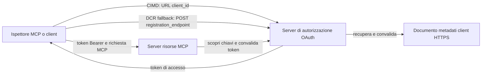

# Esempio di Autorizzazione CIMD e DCR

Questo esempio in TypeScript confronta due modi in cui un client OAuth può ottenere un'identità
prima di accedere a un server MCP protetto:

- **Client ID Metadata Documents (CIMD)** utilizzano un URL HTTPS stabile come
  `client_id`. Questo è il meccanismo preferito per clienti e server di autorizzazione
  che non hanno una relazione preesistente.
- **Dynamic Client Registration (DCR)** richiede al server di autorizzazione di generare
  un client ID opaco a runtime. MCP `2026-07-28` mantiene DCR solo per compatibilità
  con versioni precedenti.

L’esempio utilizza l’SDK stabile MCP TypeScript v2 e il modello di richiesta MCP
`2026-07-28` senza stato. Funziona con un server di autorizzazione OAuth 2.1/OpenID
Connect esterno come Auth0. Il server MCP è un server di risorse: convalida i token
di accesso ma non autentica gli utenti né emette token.


## Obiettivi di Apprendimento

Completando questo esempio, sarai in grado di:

- Spiegare perché CIMD è preferito rispetto a DCR per nuovi client MCP.
- Pubblicare un documento CIMD valido per un client nativo pubblico.
- Configurare un server di risorse MCP per la scoperta OAuth e la convalida JWT.
- Eseguire CIMD e DCR con lo stesso server MCP e server di autorizzazione.
- Applicare uno scope OAuth all’interno di uno strumento MCP.
- Identificare quali responsabilità appartengono al client, server di risorse e
  server di autorizzazione.

## Architettura



Il server di autorizzazione sceglie e convalida il meccanismo di registrazione.
Il server MCP vede solo la rivendicazione `client_id` verificata risultante. Un URL HTTPS
con un percorso identifica CIMD. Un ID opaco non è sufficiente per dimostrare DCR poiché un
client pre-registrato può usare anche un ID opaco; l’impostazione opzionale
`DCR_CLIENT_ID_PREFIX` fornisce un suggerimento demo specifico per il provider.

## Priorità di Registrazione

I client MCP che supportano ogni meccanismo dovrebbero usare questo ordine:

1. Usare le informazioni del client pre-registrato quando sono già disponibili.
2. Usare CIMD quando il server di autorizzazione pubblicizza
   `client_id_metadata_document_supported: true`.
3. Usare DCR solo come fallback quando il server pubblicizza un
   `registration_endpoint`.
4. Chiedere all’utente informazioni sul client pre-registrato quando nessuno dei precedenti è
   disponibile.

## Struttura del Progetto

```text
src/
  config.ts          Environment validation
  dcr.ts             DCR compatibility request
  mcp.ts             MCP tools and scope checks
  oauth.ts           Authorization metadata and JWT verification
  register-dcr.ts    DCR command-line helper
  registration.ts    CIMD document and mechanism classification
  server.ts          Express, OAuth discovery, and MCP endpoint
test/
  dcr.test.ts
  oauth.test.ts
  registration.test.ts
  server.test.ts
```

## Prerequisiti

- Node.js 20.6 o superiore. Gli script usano `--env-file` e `--import`.
- Un server di autorizzazione OAuth 2.1/OpenID Connect che supporta:
  - il flusso di codice di autorizzazione con S256 PKCE.
  - OAuth Protected Resource Metadata e Resource Indicators.
  - token di accesso JWT e un endpoint JWKS.
  - CIMD, più DCR se vuoi confrontare il fallback legacy.
- MCP Inspector o un altro client MCP `2026-07-28`.
- Un URL HTTPS pubblico per il documento CIMD. Un tunnel di sviluppo è adatto
  per il laboratorio; usare un dominio stabile in produzione.

## Installazione e Test

```bash
npm install
npm run build
npm test
```

I dodici test utilizzano chiavi locali e endpoint HTTP simulati. Non richiedono un
account server di autorizzazione. Verificano:

- Forma del documento CIMD e vincoli sull’URL.
- Classificazione onesta degli URL e dei client ID opachi.
- Gestione delle richieste e risposte DCR.
- Rifiuto di endpoint DCR insicuri non loopback.
- Validazione della firma JWT, issuer, audience, scadenza, client ID e scope.
- Una chiamata in-process MCP `2026-07-28` a `registration-info`.

## Configurare il Server di Autorizzazione

I nomi esatti dei controlli variano a seconda del provider. Configura queste capacità:

1. Crea un API o server risorse il cui identificatore corrisponde esattamente al tuo URL MCP,
   includendo `/mcp`, per esempio `http://127.0.0.1:3001/mcp`.
2. Usa token di accesso RS256 e includi una rivendicazione `client_id` o `azp`.
3. Aggiungi il permesso o scope `tool:greet`.
4. Abilita il flusso di codice di autorizzazione con S256 PKCE per client nativi pubblici.
5. Abilita Client ID Metadata Documents.
6. Solo per il confronto, abilita Dynamic Client Registration.
7. Assicurati che i metadati del server di autorizzazione pubblichino:
   - `issuer`
   - `authorization_endpoint`
   - `token_endpoint`
   - `jwks_uri`
   - `client_id_metadata_document_supported: true`
   - `registration_endpoint` quando DCR è abilitato

### Esempio Auth0

Per Auth0, abilita la Registrazione dei Documenti Client ID Metadata, la Registrazione Dinamica OIDC
delle Applicazioni, e la compatibilità con il parametro Resource. Crea un API
il cui identificatore è l’URL MCP esatto e aggiungi il permesso `tool:greet`.
Permetti all’utente di test e ai client di terze parti di richiedere quel permesso.

I pannelli di controllo e la disponibilità delle funzionalità dei provider cambiano nel tempo. Controlla la
documentazione del provider prima di usare queste impostazioni al di fuori di questo laboratorio.

## Configura l’Esempio

Crea `.env` dall'esempio:

```powershell
Copy-Item .env.example .env
```

Su shell compatibili bash:

```bash
cp .env.example .env
```

Imposta questi valori:

```dotenv
MCP_SERVER_URL=http://127.0.0.1:3001/mcp
AUTHORIZATION_SERVER_ISSUER=https://your-tenant.example.com/
AUTHORIZATION_SERVER_METADATA_URL=https://your-tenant.example.com/.well-known/openid-configuration
CLIENT_METADATA_URL=https://your-public-host.example.com/client-metadata.json
OAUTH_REDIRECT_URIS=http://127.0.0.1:6274/oauth/callback
DCR_CLIENT_ID_PREFIX=tpc_
```

Dettagli importanti:

- `AUTHORIZATION_SERVER_ISSUER` deve corrispondere esattamente al `issuer` nei metadati
  scoperti del server di autorizzazione, inclusa qualsiasi barra finale.
- `MCP_SERVER_URL` deve corrispondere all’audience del token di accesso.
- `CLIENT_METADATA_URL` deve usare HTTPS, contenere un percorso non root ed essere
  l’URL pubblico che serve la route dei metadati. Le query string e i frammenti sono
  rifiutati affinché la route e il `client_id` rimangano identici.
- `OAUTH_REDIRECT_URIS` è una allowlist separata da virgole. Il default è il callback loopback
  di MCP Inspector.
- `DCR_CLIENT_ID_PREFIX` è opzionale e specifico del provider. Lascialo vuoto quando
  il provider non ha un prefisso DCR affidabile.

## Pubblica il Documento CIMD

Avvia un tunnel che inoltri la sua origine HTTPS pubblica a `127.0.0.1:3001`.
Imposta `CLIENT_METADATA_URL` su quella origine più `/client-metadata.json`, quindi esegui:

```bash
npm run build
npm start
```

Verifica entrambi i documenti di scoperta:

```bash
curl http://127.0.0.1:3001/health
curl http://127.0.0.1:3001/client-metadata.json
curl http://127.0.0.1:3001/.well-known/oauth-protected-resource/mcp
```

Il `client_id` restituito dall’URL HTTPS pubblico dei metadati deve essere byte-per-byte
identico a quell’URL. Il server di autorizzazione deve convalidare il documento e
il suo URI di redirect prima di emettere un token.

> [!NOTE]
> L’esempio ospita il documento client e il server di risorse MCP in un unico processo
> per mantenere piccolo il laboratorio. In produzione, il client MCP possiede e ospita
> il suo documento CIMD indipendentemente dal server di risorse.

## Confronta CIMD e DCR

Avvia MCP Inspector:

```bash
npx @modelcontextprotocol/inspector
```

Usa HTTP Streamable e connettiti a `http://127.0.0.1:3001/mcp`.

### CIMD (Preferito)


1. Inserisci il `CLIENT_METADATA_URL` pubblico come Client ID OAuth.
2. Richiedi `tool:greet` più qualsiasi ambito di identità richiesto dal tuo provider.
3. Completa l'accesso e il consenso.
4. Chiama `registration-info`. Riporta `mechanism: "cimd"`.
5. Chiama `greet` per verificare l'applicazione degli ambiti.

### DCR (Compatibilità di riserva)

1. Cancella lo stato OAuth salvato di Inspector.
2. Lascia vuoto il Client ID OAuth in modo che Inspector possa usare il
   `registration_endpoint` pubblicizzato.
3. Completa l'accesso e il consenso.
4. Chiama `registration-info`.
5. Se `DCR_CLIENT_ID_PREFIX` corrisponde agli ID generati dal provider, lo strumento
   riporta `mechanism: "dcr"`; altrimenti riporta correttamente
   `opaque-client-id`.

Puoi anche mostrare direttamente la richiesta di registrazione:

```bash
npm run build
npm run register:dcr
```

L'helper stampa l'ID client restituito ma non stampa mai un segreto client.
Considera qualsiasi segreto restituito come sensibile e memorizzalo in un archivio segreto adeguato.

## Strumenti

| Strumento | Ambito richiesto | Scopo |
| --- | --- | --- |
| `registration-info` | Client verificato | Riporta il tipo di client ID |
| `greet` | `tool:greet` | Dimostra l'autorizzazione per strumento |

## Note di sicurezza

- Verifica le firme JWT tramite l'endpoint JWKS del server di autorizzazione.
- Richiedi corrispondenza esatta di issuer e audience.
- Richiedi claim di scadenza e client ID.
- Non accettare mai un token emesso per una risorsa diversa.
- Non passare mai il token MCP a un'API a valle.
- Tieni le credenziali DCR vincolate all'issuer che le ha create.
- Valida gli URI di redirect CIMD con corrispondenza esatta.
- Applica controlli SSRF quando un server di autorizzazione recupera URL CIMD.
- Usa HTTPS per gli endpoint di autorizzazione e metadati fuori dallo sviluppo
  in loopback.
- Non dedurre DCR da un client ID opaco a meno che il provider non documenti una
  convenzione affidabile per gli identificatori.

## Riferimenti

- [Specifiche di autorizzazione MCP](https://modelcontextprotocol.io/specification/2026-07-28/basic/authorization)
- [Registrazione client MCP](https://modelcontextprotocol.io/specification/2026-07-28/basic/authorization/client-registration)
- [Migliori pratiche di sicurezza MCP](https://modelcontextprotocol.io/specification/2026-07-28/basic/security_best_practices)
- [Guida all'autorizzazione SDK TypeScript MCP v2](https://ts.sdk.modelcontextprotocol.io/v2/serving/authorization)
- [OAuth Dynamic Client Registration (RFC 7591)](https://datatracker.ietf.org/doc/html/rfc7591)
- [Bozza del documento di metadati Client ID OAuth](https://datatracker.ietf.org/doc/html/draft-ietf-oauth-client-id-metadata-document-00)

## Ringraziamenti

L'approccio didattico affiancato è stato ispirato da
[Sambego/auth0-xmcp-cimd](https://github.com/Sambego/auth0-xmcp-cimd). Questo
esempio è un'implementazione originale e neutrale rispetto al provider costruita con l'SDK
ufficiale MCP TypeScript v2 per questo curriculum.

---

<!-- CO-OP TRANSLATOR DISCLAIMER START -->
**Disclaimer**:
Questo documento è stato tradotto utilizzando il servizio di traduzione AI [Co-op Translator](https://github.com/Azure/co-op-translator). Sebbene ci impegniamo per garantire la precisione, si prega di notare che le traduzioni automatizzate possono contenere errori o imprecisioni. Il documento originale nella sua lingua nativa deve essere considerato la fonte autorevole. Per informazioni critiche, si raccomanda una traduzione professionale effettuata da un essere umano. Non siamo responsabili per eventuali malintesi o interpretazioni errate derivanti dall’uso di questa traduzione.
<!-- CO-OP TRANSLATOR DISCLAIMER END -->