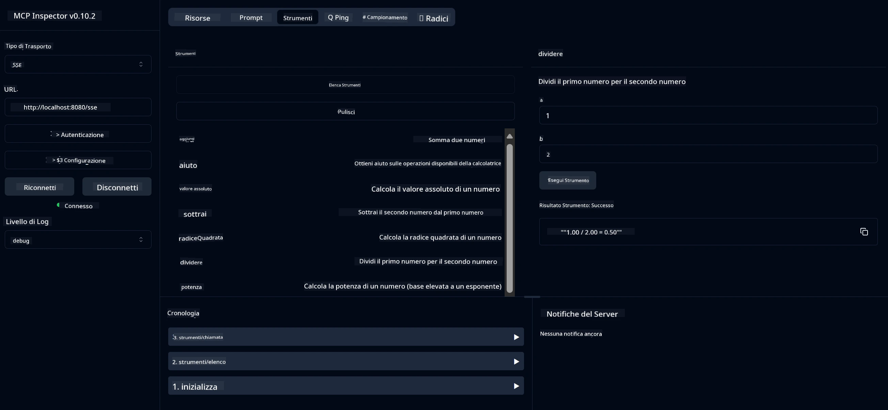

# Servizio Calcolatrice Base MCP

> [!NOTE]
> Questa soluzione Java utilizza il trasporto legacy HTTP+SSE e mira a un SDK
> compatibile con MCP `2025-11-25`. Viene mantenuta per abbinare il codice del corso;
> i nuovi server remoti dovrebbero usare il supporto Streamable HTTP `2026-07-28`.

Questo servizio fornisce operazioni di calcolatrice di base tramite il Model Context Protocol (MCP) utilizzando Spring Boot con trasporto WebFlux. È progettato come esempio semplice per principianti che imparano implementazioni MCP.

Per maggiori informazioni, vedere la documentazione di riferimento [MCP Server Boot Starter](https://docs.spring.io/spring-ai/reference/api/mcp/mcp-server-boot-starter-docs.html).


## Utilizzo del Servizio

Il servizio espone i seguenti endpoint API tramite il protocollo MCP:

- `add(a, b)`: Sommare due numeri
- `subtract(a, b)`: Sottrarre il secondo numero dal primo
- `multiply(a, b)`: Moltiplicare due numeri
- `divide(a, b)`: Dividere il primo numero per il secondo (con controllo zero)
- `power(base, exponent)`: Calcolare la potenza di un numero
- `squareRoot(number)`: Calcolare la radice quadrata (con controllo numero negativo)
- `modulus(a, b)`: Calcolare il resto della divisione
- `absolute(number)`: Calcolare il valore assoluto

## Dipendenze

Il progetto richiede le seguenti dipendenze principali:

```xml
<dependency>
    <groupId>org.springframework.ai</groupId>
    <artifactId>spring-ai-starter-mcp-server-webflux</artifactId>
</dependency>
```

## Compilare il Progetto

Compilare il progetto usando Maven:
```bash
./mvnw clean install -DskipTests
```

## Esecuzione del Server

### Usando Java

```bash
java -jar target/calculator-server-0.0.1-SNAPSHOT.jar
```

### Usando MCP Inspector

MCP Inspector è uno strumento utile per interagire con i servizi MCP. Per usarlo con questo servizio calcolatrice:

1. **Installare ed eseguire MCP Inspector** in una nuova finestra terminal:
   ```bash
   npx @modelcontextprotocol/inspector
   ```

2. **Accedere all'interfaccia web** cliccando sull'URL mostrato dall'app (tipicamente http://localhost:6274)

3. **Configurare la connessione**:
   - Impostare il tipo di trasporto su "SSE"
   - Impostare l'URL sull'endpoint SSE del server in esecuzione: `http://localhost:8080/sse`
   - Cliccare su "Connect"

4. **Usare gli strumenti**:
   - Cliccare su "List Tools" per vedere le operazioni della calcolatrice disponibili
   - Selezionare uno strumento e cliccare su "Run Tool" per eseguire un'operazione



---

<!-- CO-OP TRANSLATOR DISCLAIMER START -->
**Disclaimer**:
Questo documento è stato tradotto utilizzando il servizio di traduzione AI [Co-op Translator](https://github.com/Azure/co-op-translator). Sebbene ci impegniamo per garantire la precisione, si prega di notare che le traduzioni automatizzate possono contenere errori o imprecisioni. Il documento originale nella sua lingua nativa deve essere considerato la fonte autorevole. Per informazioni critiche, si raccomanda una traduzione professionale effettuata da un essere umano. Non siamo responsabili per eventuali malintesi o interpretazioni errate derivanti dall’uso di questa traduzione.
<!-- CO-OP TRANSLATOR DISCLAIMER END -->