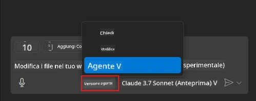
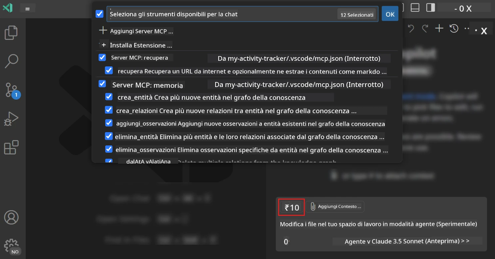
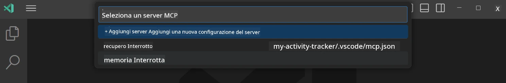
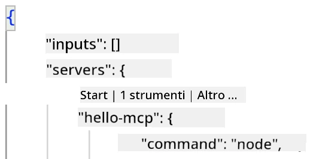
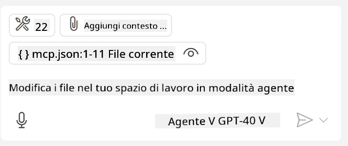
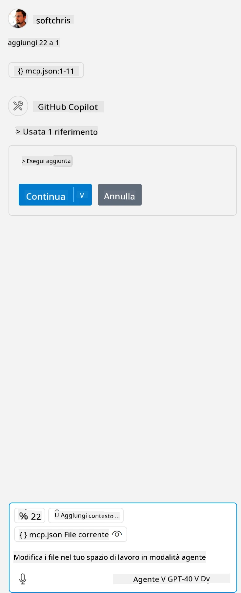

# Consumare un server dalla modalità GitHub Copilot Agent

Visual Studio Code e GitHub Copilot possono agire come client e consumare un MCP Server. Potresti chiederti perché dovremmo farlo? Beh, significa che qualunque funzionalità abbia l'MCP Server può ora essere usata direttamente dal tuo IDE. Immagina di aggiungere, per esempio, il server MCP di GitHub, questo permetterebbe di controllare GitHub tramite prompt invece di digitare comandi specifici nel terminale. Oppure immagina qualsiasi cosa in generale che potrebbe migliorare la tua esperienza da sviluppatore, tutto controllato tramite linguaggio naturale. Ora inizi a vedere il vantaggio, giusto?

## Panoramica

Questa lezione spiega come usare Visual Studio Code e la modalità Agent di GitHub Copilot come client per il tuo MCP Server.

## Obiettivi di Apprendimento

Alla fine di questa lezione, sarai in grado di:

- Consumare un MCP Server tramite Visual Studio Code.
- Eseguire funzionalità come strumenti tramite GitHub Copilot.
- Configurare Visual Studio Code per trovare e gestire il tuo MCP Server.

## Utilizzo

Puoi controllare il tuo MCP server in due modi diversi:

- Interfaccia utente, vedrai come si fa più avanti in questo capitolo.
- Terminale, è possibile controllare le cose dal terminale usando l'eseguibile `code`:

  Per aggiungere un MCP server al tuo profilo utente, usa l'opzione da linea di comando --add-mcp e fornisci la configurazione del server in formato JSON come {\"name\":\"server-name\",\"command\":...}.

  ```
  code --add-mcp "{\"name\":\"my-server\",\"command\": \"uvx\",\"args\": [\"mcp-server-fetch\"]}"
  ```

### Screenshot





Parliamo più a fondo di come usare l'interfaccia visiva nelle sezioni successive.

## Metodo

Ecco come dobbiamo procedere a grandi linee:

- Configurare un file per trovare il nostro MCP Server.
- Avviare/Connettersi a detto server per ottenere la lista delle sue funzionalità.
- Usare tali funzionalità tramite l'interfaccia di GitHub Copilot Chat.

Ottimo, ora che abbiamo capito il flusso, proviamo a usare un MCP Server tramite Visual Studio Code attraverso un esercizio.

## Esercizio: Consumare un server

In questo esercizio configureremo Visual Studio Code per trovare il tuo MCP server in modo che possa essere usato dall'interfaccia GitHub Copilot Chat.

### -0- Passo preliminare, abilitare la scoperta MCP Server

Potrebbe essere necessario abilitare la scoperta dei MCP Server.

1. Vai su `File -> Preferences -> Settings` in Visual Studio Code.

1. Cerca "MCP" e abilita `chat.mcp.discovery.enabled` nel file settings.json.

### -1- Creare il file di configurazione

Inizia creando un file di configurazione nella root del progetto, avrai bisogno di un file chiamato MCP.json da posizionare in una cartella chiamata .vscode. Dovrebbe assomigliare a questo:

```text
.vscode
|-- mcp.json
```

Ora, vediamo come aggiungere una voce per un server.

### -2- Configurare un server

Aggiungi il seguente contenuto a *mcp.json*:

```json
{
    "inputs": [],
    "servers": {
       "hello-mcp": {
           "command": "node",
           "args": [
               "build/index.js"
           ]
       }
    }
}
```

Ecco un semplice esempio qui sopra di come avviare un server scritto in Node.js, per altri runtime indica il comando corretto per avviare il server usando `command` e `args`.

### -3- Avviare il server

Ora che hai aggiunto una voce, avviamo il server:

1. Trova la tua voce in *mcp.json* e assicurati di vedere l'icona "play":

    

1. Clicca l'icona "play", dovresti vedere l'icona degli strumenti in GitHub Copilot Chat aumentare il numero di strumenti disponibili. Se clicchi questa icona, vedrai la lista degli strumenti registrati. Puoi selezionare/deselezionare ogni strumento a seconda se vuoi che GitHub Copilot li usi come contesto:

  

1. Per eseguire uno strumento, digita un prompt che sai corrisponderà alla descrizione di uno dei tuoi strumenti, per esempio un prompt come "add 22 to 1":

  

  Dovresti vedere una risposta con 23.

## Compito

Prova ad aggiungere una voce server al tuo file *mcp.json* e assicurati di poter avviare/fermare il server. Verifica anche di poter comunicare con gli strumenti sul tuo server tramite l'interfaccia GitHub Copilot Chat.

## Soluzione

[Soluzione](./solution/README.md)

## Punti Chiave

I punti chiave di questo capitolo sono i seguenti:

- Visual Studio Code è un ottimo client che ti permette di consumare diversi MCP Server e i loro strumenti.
- L'interfaccia GitHub Copilot Chat è il modo in cui interagisci con i server.
- Puoi chiedere all’utente input come chiavi API che possono essere passate all’MCP Server quando configuri la voce server nel file *mcp.json*.

## Esempi

- [Calcolatrice Java](../samples/java/calculator/README.md)
- [Calcolatrice .Net](../../../../03-GettingStarted/samples/csharp)
- [Calcolatrice JavaScript](../samples/javascript/README.md)
- [Calcolatrice TypeScript](../samples/typescript/README.md)
- [Calcolatrice Python](../../../../03-GettingStarted/samples/python)

## Risorse Aggiuntive

- [Documentazione Visual Studio](https://code.visualstudio.com/docs/copilot/chat/mcp-servers)

## Cosa C’è Dopo

- Successivo: [Creare un Server stdio](../05-stdio-server/README.md)

---

<!-- CO-OP TRANSLATOR DISCLAIMER START -->
**Disclaimer**:
Questo documento è stato tradotto utilizzando il servizio di traduzione AI [Co-op Translator](https://github.com/Azure/co-op-translator). Sebbene ci impegniamo per garantire la precisione, si prega di notare che le traduzioni automatizzate possono contenere errori o imprecisioni. Il documento originale nella sua lingua nativa deve essere considerato la fonte autorevole. Per informazioni critiche, si raccomanda una traduzione professionale effettuata da un essere umano. Non siamo responsabili per eventuali malintesi o interpretazioni errate derivanti dall’uso di questa traduzione.
<!-- CO-OP TRANSLATOR DISCLAIMER END -->