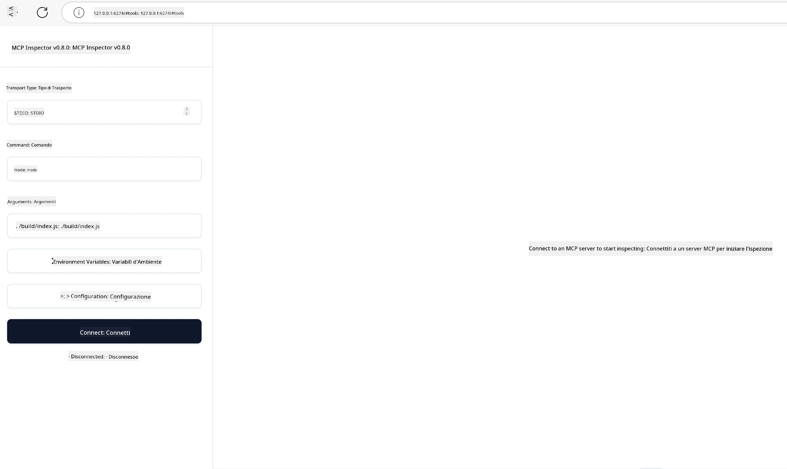

## Test e Debug

Prima di iniziare a testare il tuo server MCP, è importante comprendere gli strumenti disponibili e le migliori pratiche per il debug. Un test efficace garantisce che il tuo server si comporti come previsto e ti aiuta a identificare e risolvere rapidamente i problemi. La sezione seguente illustra gli approcci consigliati per convalidare la tua implementazione MCP.

## Panoramica

Questa lezione copre come selezionare l'approccio di test giusto e lo strumento di test più efficace.

## Obiettivi di apprendimento

Al termine di questa lezione, sarai in grado di:

- Descrivere diversi approcci per il testing.
- Usare diversi strumenti per testare efficacemente il tuo codice.


## Testing dei Server MCP

MCP fornisce strumenti per aiutarti a testare e fare il debug dei tuoi server:

- **MCP Inspector**: Uno strumento da linea di comando che può essere eseguito sia come strumento CLI sia come strumento visuale.
- **Testing manuale**: Puoi usare uno strumento come curl per eseguire richieste web, ma qualsiasi strumento in grado di eseguire HTTP andrà bene.
- **Unit testing**: È possibile utilizzare il tuo framework di testing preferito per testare le funzionalità sia del server che del client.

### Uso di MCP Inspector

Abbiamo descritto l'uso di questo strumento nelle lezioni precedenti ma parliamone brevemente a grandi linee. È uno strumento costruito in Node.js e puoi usarlo chiamando l'eseguibile `npx` che scaricherà e installerà temporaneamente lo strumento stesso e poi si pulirà una volta terminata l'esecuzione della tua richiesta.

Il [MCP Inspector](https://github.com/modelcontextprotocol/inspector) ti aiuta a:

- **Scoprire capacità del server**: Rileva automaticamente risorse, strumenti e prompt disponibili
- **Testare l'esecuzione degli strumenti**: Prova parametri diversi e vedi le risposte in tempo reale
- **Visualizzare i metadata del server**: Esamina info, schemi e configurazioni del server

Un'esecuzione tipica dello strumento appare così:

```bash
npx @modelcontextprotocol/inspector node build/index.js
```

Il comando sopra avvia un MCP e la sua interfaccia visuale e lancia un'interfaccia web locale nel tuo browser. Puoi aspettarti di vedere una dashboard che mostra i tuoi server MCP registrati, i loro strumenti, risorse e prompt disponibili. L'interfaccia ti permette di testare interattivamente l'esecuzione degli strumenti, ispezionare i metadata del server e visualizzare risposte in tempo reale, facilitando la convalida e il debug delle tue implementazioni server MCP.

Ecco come può apparire: 

Puoi anche eseguire questo strumento in modalità CLI nel qual caso aggiungi l'attributo `--cli`. Ecco un esempio di utilizzo dello strumento in modalità "CLI" che elenca tutti gli strumenti presenti sul server:

```sh
npx @modelcontextprotocol/inspector --cli node build/index.js --method tools/list
```

### Test manuale

Oltre a eseguire lo strumento inspector per testare le capacità del server, un altro approccio simile è quello di eseguire un client capace di usare HTTP come per esempio curl.

Con curl, puoi testare i server MCP direttamente usando richieste HTTP:

```bash
# Esempio: Metadati del server di test
curl http://localhost:3000/v1/metadata

# Esempio: Eseguire uno strumento
curl -X POST http://localhost:3000/v1/tools/execute \
  -H "Content-Type: application/json" \
  -d '{"name": "calculator", "parameters": {"expression": "2+2"}}'
```

Come puoi vedere dall'uso di curl sopra, usi una richiesta POST per invocare uno strumento usando un payload che consiste nel nome dello strumento e nei suoi parametri. Usa l'approccio che preferisci. Gli strumenti CLI in generale tendono a essere più veloci da usare e si prestano ad essere scriptati, cosa che può essere utile in un ambiente CI/CD.

### Unit Testing

Crea test unitari per i tuoi strumenti e risorse per assicurarti che funzionino come previsto. Ecco del codice di esempio per il testing.

```python
import pytest

from mcp.server.fastmcp import FastMCP
from mcp.shared.memory import (
    create_connected_server_and_client_session as create_session,
)

# Contrassegna l'intero modulo per i test asincroni
pytestmark = pytest.mark.anyio


async def test_list_tools_cursor_parameter():
    """Test that the cursor parameter is accepted for list_tools.

    Note: FastMCP doesn't currently implement pagination, so this test
    only verifies that the cursor parameter is accepted by the client.
    """

 server = FastMCP("test")

    # Crea un paio di strumenti per il test
    @server.tool(name="test_tool_1")
    async def test_tool_1() -> str:
        """First test tool"""
        return "Result 1"

    @server.tool(name="test_tool_2")
    async def test_tool_2() -> str:
        """Second test tool"""
        return "Result 2"

    async with create_session(server._mcp_server) as client_session:
        # Test senza parametro cursore (omesso)
        result1 = await client_session.list_tools()
        assert len(result1.tools) == 2

        # Test con cursore=None
        result2 = await client_session.list_tools(cursor=None)
        assert len(result2.tools) == 2

        # Test con cursore come stringa
        result3 = await client_session.list_tools(cursor="some_cursor_value")
        assert len(result3.tools) == 2

        # Test con cursore stringa vuota
        result4 = await client_session.list_tools(cursor="")
        assert len(result4.tools) == 2
    
```

Il codice precedente fa quanto segue:

- Sfrutta il framework pytest che ti permette di creare test come funzioni e usare asserzioni.
- Crea un server MCP con due strumenti diversi.
- Usa l'istruzione `assert` per verificare che certe condizioni siano soddisfatte.

Dai un'occhiata al [file completo qui](https://github.com/modelcontextprotocol/python-sdk/blob/main/tests/client/test_list_methods_cursor.py)

Dato il file sopra, puoi testare il tuo server per assicurarti che le capacità vengano create come dovrebbero.

Tutti i principali SDK hanno sezioni di test simili così puoi adattarti al runtime scelto.

## Esempi 

- [Calcolatrice Java](../samples/java/calculator/README.md)
- [Calcolatrice .Net](../../../../03-GettingStarted/samples/csharp)
- [Calcolatrice JavaScript](../samples/javascript/README.md)
- [Calcolatrice TypeScript](../samples/typescript/README.md)
- [Calcolatrice Python](../../../../03-GettingStarted/samples/python) 

## Risorse aggiuntive

- [Python SDK](https://github.com/modelcontextprotocol/python-sdk)

## Cosa c'è dopo

- Successivo: [Deployment](../09-deployment/README.md)

---

<!-- CO-OP TRANSLATOR DISCLAIMER START -->
**Disclaimer**:
Questo documento è stato tradotto utilizzando il servizio di traduzione AI [Co-op Translator](https://github.com/Azure/co-op-translator). Sebbene ci impegniamo per garantire la precisione, si prega di notare che le traduzioni automatizzate possono contenere errori o imprecisioni. Il documento originale nella sua lingua nativa deve essere considerato la fonte autorevole. Per informazioni critiche, si raccomanda una traduzione professionale effettuata da un essere umano. Non siamo responsabili per eventuali malintesi o interpretazioni errate derivanti dall’uso di questa traduzione.
<!-- CO-OP TRANSLATOR DISCLAIMER END -->