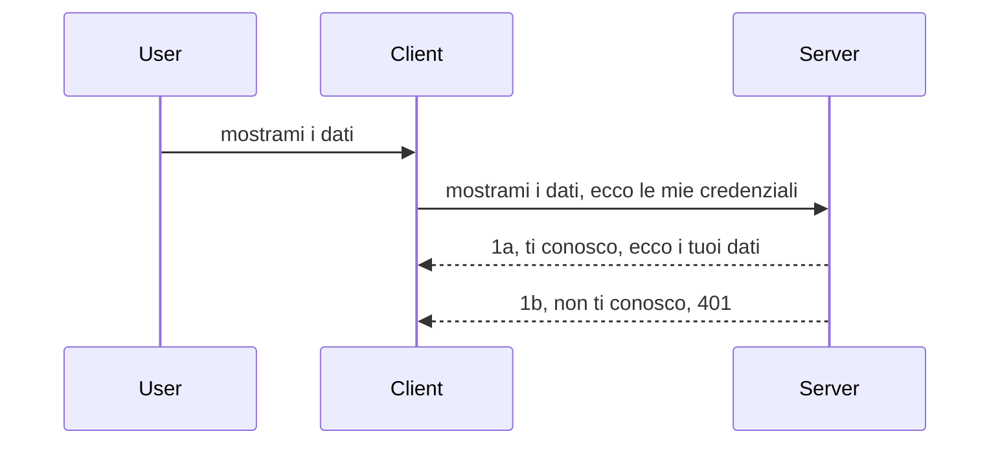

# Autenticazione semplice

Gli SDK MCP supportano l'uso di OAuth 2.1 che, a dire il vero, è un processo piuttosto complesso che coinvolge concetti come server di autenticazione, server di risorse, invio delle credenziali, ottenimento di un codice, scambio del codice per un token bearer fino a quando si può finalmente accedere ai dati della risorsa. Se non siete abituati a OAuth, che è una cosa ottima da implementare, è una buona idea iniziare con un livello base di autenticazione per poi costruire una sicurezza sempre migliore. Ecco perché esiste questo capitolo, per farvi arrivare a una autenticazione più avanzata.

## Autenticazione, cosa intendiamo?

Autenticazione è l'abbreviazione di autenticazione e autorizzazione. L'idea è che dobbiamo fare due cose:

- **Autenticazione**, che è il processo per capire se permettiamo a una persona di entrare nella nostra casa, che abbia il diritto di essere "qui", cioè avere accesso al nostro server di risorse dove vivono le funzionalità del nostro MCP Server.
- **Autorizzazione**, è il processo per scoprire se un utente dovrebbe avere accesso a queste risorse specifiche che sta richiedendo, ad esempio questi ordini o questi prodotti o se è permesso leggere il contenuto ma non cancellarlo, come altro esempio.

## Credenziali: come diciamo al sistema chi siamo

Beh, la maggior parte degli sviluppatori web là fuori inizia a pensare in termini di fornire una credenziale al server, solitamente un segreto che dice se possono essere qui ("Autenticazione"). Questa credenziale è solitamente una versione codificata in base64 di username e password oppure una chiave API che identifica un utente specifico univocamente.

Questo implica l'invio tramite un header chiamato "Authorization" come segue:

```json
{ "Authorization": "secret123" }
```

Questo è solitamente noto come autenticazione di base (basic authentication). Come funziona il flusso complessivo è nel modo seguente:



Ora che capiamo come funziona dal punto di vista del flusso, come lo implementiamo? Beh, la maggior parte dei server web ha un concetto chiamato middleware, un pezzo di codice che gira come parte della richiesta e può verificare le credenziali, e se le credenziali sono valide può lasciare passare la richiesta. Se la richiesta non ha credenziali valide allora si ottiene un errore di autenticazione. Vediamo come può essere implementato:

**Python**

```python
class AuthMiddleware(BaseHTTPMiddleware):
    async def dispatch(self, request, call_next):

        has_header = request.headers.get("Authorization")
        if not has_header:
            print("-> Missing Authorization header!")
            return Response(status_code=401, content="Unauthorized")

        if not valid_token(has_header):
            print("-> Invalid token!")
            return Response(status_code=403, content="Forbidden")

        print("Valid token, proceeding...")
       
        response = await call_next(request)
        # aggiungere eventuali intestazioni personalizzate o modificare la risposta in qualche modo
        return response


starlette_app.add_middleware(CustomHeaderMiddleware)
```

Qui abbiamo:

- Creato un middleware chiamato `AuthMiddleware` dove il suo metodo `dispatch` è invocato dal server web.
- Aggiunto il middleware al server web:

    ```python
    starlette_app.add_middleware(AuthMiddleware)
    ```

- Scritta la logica di validazione che controlla se l'header Authorization è presente e se il segreto inviato è valido:

    ```python
    has_header = request.headers.get("Authorization")
    if not has_header:
        print("-> Missing Authorization header!")
        return Response(status_code=401, content="Unauthorized")

    if not valid_token(has_header):
        print("-> Invalid token!")
        return Response(status_code=403, content="Forbidden")
    ```

    se il segreto è presente e valido allora lasciamo passare la richiesta chiamando `call_next` e ritorniamo la risposta.

    ```python
    response = await call_next(request)
    # aggiungi eventuali intestazioni cliente o modifica in qualche modo la risposta
    return response
    ```

Come funziona è che se viene fatta una richiesta web verso il server il middleware viene invocato e dato che implementa la logica sopra o lascia passare la richiesta o ritorna un errore che indica che il client non può procedere.

**TypeScript**

Qui creiamo un middleware con il popolare framework Express e intercettiamo la richiesta prima che raggiunga il MCP Server. Ecco il codice per questo:

```typescript
function isValid(secret) {
    return secret === "secret123";
}

app.use((req, res, next) => {
    // 1. Intestazione di autorizzazione presente?
    if(!req.headers["Authorization"]) {
        res.status(401).send('Unauthorized');
    }
    
    let token = req.headers["Authorization"];

    // 2. Verifica della validità.
    if(!isValid(token)) {
        res.status(403).send('Forbidden');
    }

   
    console.log('Middleware executed');
    // 3. Passa la richiesta al passaggio successivo nella pipeline della richiesta.
    next();
});
```

In questo codice:

1. Controlliamo se l'header Authorization è presente, se non lo è inviamo un errore 401.
2. Assicuriamo che la credenziale/token sia valido, se no inviamo un errore 403.
3. Infine lasciamo passare la richiesta nella pipeline e ritorniamo la risorsa richiesta.

## Esercizio: Implementa autenticazione

Mettiamo alla prova la nostra conoscenza provando ad implementarla. Ecco il piano:

Server

- Crea un web server e un'istanza MCP.
- Implementa un middleware per il server.

Client

- Invia una richiesta web, con credenziali, via header.

### -1- Crea un web server e un'istanza MCP

> [!WARNING]
> L'esempio TypeScript sottostante usa MCP `2025-11-25`. Tiene traccia dei trasporti
> tramite `mcp-session-id` e non è un esempio attuale di trasporto `2026-07-28`. MCP
> `2026-07-28` rimuove il handshake `initialize` e la sessione protocol ID; le
> nuove implementazioni usano richieste autonome. Vedi
> [Cosa è cambiato in MCP: La specifica 2026-07-28](../../01-CoreConcepts/mcp-2026-07-28.md).

Nel nostro primo passo, dobbiamo creare l'istanza del web server e l'MCP Server.

**Python**

Qui creiamo un'istanza MCP server, creiamo una web app starlette e la ospitiamo con uvicorn.

```python
# creazione del server MCP

app = FastMCP(
    name="MCP Resource Server",
    instructions="Resource Server that validates tokens via Authorization Server introspection",
    host=settings["host"],
    port=settings["port"],
    debug=True
)

# creazione dell'app web starlette
starlette_app = app.streamable_http_app()

# servire l'app tramite uvicorn
async def run(starlette_app):
    import uvicorn
    config = uvicorn.Config(
            starlette_app,
            host=app.settings.host,
            port=app.settings.port,
            log_level=app.settings.log_level.lower(),
        )
    server = uvicorn.Server(config)
    await server.serve()

run(starlette_app)
```

In questo codice:

- Creiamo l'MCP Server.
- Costruiamo la web app starlette dall'MCP Server, `app.streamable_http_app()`.
- Ospitiamo e serviamo la web app usando uvicorn `server.serve()`.

**TypeScript**

Qui creiamo un'istanza MCP Server.

```typescript
const server = new McpServer({
      name: "example-server",
      version: "1.0.0"
    });

    // ... configurare risorse server, strumenti e prompt ...
```

Questa creazione del MCP Server dovrà avvenire dentro la definizione della rotta POST /mcp, quindi prendiamo il codice sopra e lo spostiamo così:

```typescript
import express from "express";
import { randomUUID } from "node:crypto";
import { McpServer } from "@modelcontextprotocol/sdk/server/mcp.js";
import { StreamableHTTPServerTransport } from "@modelcontextprotocol/sdk/server/streamableHttp.js";
import { isInitializeRequest } from "@modelcontextprotocol/sdk/types.js"

const app = express();
app.use(express.json());

// Mappa per memorizzare i trasporti per ID sessione
const transports: { [sessionId: string]: StreamableHTTPServerTransport } = {};

// Gestisci le richieste POST per la comunicazione client-server
app.post('/mcp', async (req, res) => {
  // Controlla l'esistenza dell'ID sessione
  const sessionId = req.headers['mcp-session-id'] as string | undefined;
  let transport: StreamableHTTPServerTransport;

  if (sessionId && transports[sessionId]) {
    // Riutilizza il trasporto esistente
    transport = transports[sessionId];
  } else if (!sessionId && isInitializeRequest(req.body)) {
    // Nuova richiesta di inizializzazione
    transport = new StreamableHTTPServerTransport({
      sessionIdGenerator: () => randomUUID(),
      onsessioninitialized: (sessionId) => {
        // Memorizza il trasporto per ID sessione
        transports[sessionId] = transport;
      },
      // La protezione dal DNS rebinding è disabilitata di default per compatibilità con versioni precedenti. Se stai eseguendo questo server
      // localmente, assicurati di impostare:
      // enableDnsRebindingProtection: true,
      // allowedHosts: ['127.0.0.1'],
    });

    // Pulisci il trasporto quando è chiuso
    transport.onclose = () => {
      if (transport.sessionId) {
        delete transports[transport.sessionId];
      }
    };
    const server = new McpServer({
      name: "example-server",
      version: "1.0.0"
    });

    // ... configura risorse, strumenti e prompt del server ...

    // Connetti al server MCP
    await server.connect(transport);
  } else {
    // Richiesta non valida
    res.status(400).json({
      jsonrpc: '2.0',
      error: {
        code: -32000,
        message: 'Bad Request: No valid session ID provided',
      },
      id: null,
    });
    return;
  }

  // Gestisci la richiesta
  await transport.handleRequest(req, res, req.body);
});

// Gestore riutilizzabile per richieste GET e DELETE
const handleSessionRequest = async (req: express.Request, res: express.Response) => {
  const sessionId = req.headers['mcp-session-id'] as string | undefined;
  if (!sessionId || !transports[sessionId]) {
    res.status(400).send('Invalid or missing session ID');
    return;
  }
  
  const transport = transports[sessionId];
  await transport.handleRequest(req, res);
};

// Gestisci le richieste GET per le notifiche server-client tramite SSE
app.get('/mcp', handleSessionRequest);

// Gestisci le richieste DELETE per la terminazione della sessione
app.delete('/mcp', handleSessionRequest);

app.listen(3000);
```

Ora vedi come la creazione del MCP Server è stata spostata dentro `app.post("/mcp")`.

Passiamo al passo successivo di creare il middleware per poter validare la credenziale in arrivo.

### -2- Implementa un middleware per il server

Passiamo ora alla parte del middleware. Qui creeremo un middleware che cerca una credenziale nell'header `Authorization` e la valida. Se è accettabile la richiesta procede per fare ciò che deve (ad esempio, elencare tool, leggere una risorsa o qualunque funzionalità MCP richiesta dal client).

**Python**

Per creare il middleware, dobbiamo definire una classe che eredita da `BaseHTTPMiddleware`. Ci sono due pezzi interessanti:

- La richiesta `request`, da cui leggiamo le informazioni nell'header.
- `call_next`, la callback da invocare se il client ha portato una credenziale che accettiamo.

Prima dobbiamo gestire il caso in cui l'header `Authorization` manca:

```python
has_header = request.headers.get("Authorization")

# nessuna intestazione presente, errore con 401, altrimenti continua.
if not has_header:
    print("-> Missing Authorization header!")
    return Response(status_code=401, content="Unauthorized")
```

Qui inviamo un messaggio 401 unauthorized perché il client non supera l'autenticazione.

Poi, se è stata inviata una credenziale, dobbiamo verificarne la validità così:

```python
 if not valid_token(has_header):
    print("-> Invalid token!")
    return Response(status_code=403, content="Forbidden")
```

Nota come inviamo un messaggio 403 forbidden sopra. Vediamo il middleware completo sotto che implementa tutto quanto sopra:

```python
class AuthMiddleware(BaseHTTPMiddleware):
    async def dispatch(self, request, call_next):

        has_header = request.headers.get("Authorization")
        if not has_header:
            print("-> Missing Authorization header!")
            return Response(status_code=401, content="Unauthorized")

        if not valid_token(has_header):
            print("-> Invalid token!")
            return Response(status_code=403, content="Forbidden")

        print("Valid token, proceeding...")
        print(f"-> Received {request.method} {request.url}")
        response = await call_next(request)
        response.headers['Custom'] = 'Example'
        return response

```

Perfetto, ma che dire della funzione `valid_token`? La vedi qui sotto:

```python
# NON usare in produzione - miglioralo !!
def valid_token(token: str) -> bool:
    # rimuovere il prefisso "Bearer "
    if token.startswith("Bearer "):
        token = token[7:]
        return token == "secret-token"
    return False
```

Ovviamente questo andrebbe migliorato.

IMPORTANTE: Non dovresti MAI avere segreti come questo nel codice. Idealmente dovresti recuperare il valore da confrontare da una fonte di dati o da un IDP (identity service provider) o meglio ancora, lasciare che sia l'IDP a fare la validazione.

**TypeScript**

Per implementarlo con Express, dobbiamo chiamare il metodo `use` che accetta funzioni middleware.

Dobbiamo:

- Interagire con la variabile request per controllare la credenziale passata nella proprietà `Authorization`.
- Validare la credenziale, e se valida lasciare passare la richiesta perché l'MCP del client faccia ciò che deve (ad esempio listare tool, leggere risorse o altro MCP correlato).

Qui controlliamo se l'header `Authorization` è presente e se non lo è fermiamo la richiesta:

```typescript
if(!req.headers["authorization"]) {
    res.status(401).send('Unauthorized');
    return;
}
```

Se l'header non è mandato, ricevi un 401.

Poi controlliamo se la credenziale è valida, altrimenti fermiamo ancora la richiesta ma con un messaggio diverso:

```typescript
if(!isValid(token)) {
    res.status(403).send('Forbidden');
    return;
} 
```

Nota come ora ottieni un errore 403.

Ecco il codice completo:

```typescript
app.use((req, res, next) => {
    console.log('Request received:', req.method, req.url, req.headers);
    console.log('Headers:', req.headers["authorization"]);
    if(!req.headers["authorization"]) {
        res.status(401).send('Unauthorized');
        return;
    }
    
    let token = req.headers["authorization"];

    if(!isValid(token)) {
        res.status(403).send('Forbidden');
        return;
    }  

    console.log('Middleware executed');
    next();
});
```

Abbiamo predisposto il web server per accettare un middleware che controlli la credenziale che il client speriamo stia inviando. E il client stesso?

### -3- Invia una richiesta web con credenziali via header

Dobbiamo assicurarci che il client passi la credenziale tramite header. Siccome useremo un client MCP per questo, dobbiamo capire come farlo.

**Python**

Per il client, dobbiamo passare un header con le nostre credenziali così:

```python
# NON inserire il valore hardcoded, tienilo almeno in una variabile d'ambiente o in un archivio più sicuro
token = "secret-token"

async with streamablehttp_client(
        url = f"http://localhost:{port}/mcp",
        headers = {"Authorization": f"Bearer {token}"}
    ) as (
        read_stream,
        write_stream,
        session_callback,
    ):
        async with ClientSession(
            read_stream,
            write_stream
        ) as session:
            await session.initialize()
      
            # DA FARE, cosa desideri venga fatto nel client, es. elencare strumenti, chiamare strumenti ecc.
```

Nota come popolare la proprietà `headers` così `headers = {"Authorization": f"Bearer {token}"}`.

**TypeScript**

Possiamo risolvere questo in due passi:

1. Popolare un oggetto di configurazione con la nostra credenziale.
2. Passare l'oggetto di configurazione al transport.

```typescript

// NON codificare il valore direttamente come mostrato qui. Al minimo, usalo come variabile d'ambiente e utilizza qualcosa come dotenv (in modalità sviluppo).
let token = "secret123"

// definire un oggetto opzioni per il trasporto client
let options: StreamableHTTPClientTransportOptions = {
  sessionId: sessionId,
  requestInit: {
    headers: {
      "Authorization": "secret123"
    }
  }
};

// passa l'oggetto opzioni al trasporto
async function main() {
   const transport = new StreamableHTTPClientTransport(
      new URL(serverUrl),
      options
   );
```

Qui sopra vedi come abbiamo dovuto creare un oggetto `options` e mettere i nostri headers sotto la proprietà `requestInit`.

IMPORTANTE: Come possiamo migliorarlo da qui? Beh, l'implementazione attuale ha alcuni problemi. Innanzitutto, passare una credenziale così è abbastanza rischioso a meno che tu non abbia almeno HTTPS. Anche in quel caso, la credenziale può essere rubata, quindi ti serve un sistema dove puoi facilmente revocare il token e aggiungere controlli aggiuntivi tipo da dove nel mondo arriva, se la richiesta accade troppo spesso (comportamento da bot), insomma, ci sono molte preoccupazioni.

Va detto però che per API molto semplici dove non vuoi che chiunque chiami la tua API senza autenticazione, quello che abbiamo qui è un buon inizio.

Detto questo, proviamo a rafforzare un po' la sicurezza usando un formato standardizzato come JSON Web Token, noto anche come JWT o token "JOT".

## JSON Web Tokens, JWT

Stiamo cercando di migliorare rispetto all'invio di credenziali molto semplici. Quali sono i miglioramenti immediati adottando JWT?

- **Miglioramenti di sicurezza**. Nell'autenticazione base, mandi username e password come token codificato in base64 (o una chiave API) ripetutamente, aumentando il rischio. Con JWT, mandi username e password e ricevi un token in cambio che ha anche un limite temporale, quindi scade. JWT ti permette facilmente di usare un controllo d'accesso granulare con ruoli, scope e permessi.
- **Statelessness e scalabilità**. I JWT sono self-contained, portano tutte le info dell'utente e eliminano la necessità di archiviazione di sessione lato server. Il token può essere anche validato localmente.
- **Interoperabilità e federazione**. JWT è centrale in Open ID Connect ed è usato con noti provider di identità come Entra ID, Google Identity e Auth0. Permettono anche single sign on e molto altro rendendoli adatti all'impresa.
- **Modularità e flessibilità**. I JWT possono essere usati anche con API Gateway come Azure API Management, NGINX e altri. Supportano anche scenari di autenticazione e comunicazione server-to-service, inclusi casi d'impersonificazione e deleghe.
- **Performance e caching**. I JWT possono essere cached dopo la decodifica riducendo la necessità di parsing. Questo aiuta con app ad alto traffico migliorando il throughput e riducendo il carico sull'infrastruttura.
- **Funzionalità avanzate**. Supportano anche introspezione (controllo di validità su server) e revoca (rendere un token invalido).

Con tutti questi vantaggi, vediamo come portare la nostra implementazione al livello successivo.

## Trasformare l'autenticazione base in JWT

Quindi, i cambiamenti che dobbiamo fare a grandi linee sono:

- **Imparare a costruire un token JWT** e prepararlo per essere inviato dal client al server.
- **Validare un token JWT**, e se valido, permettere al client di ottenere le nostre risorse.
- **Archiviazione sicura del token**. Come conserviamo questo token.
- **Proteggere le rotte**. Dobbiamo proteggere le rotte, nel nostro caso rotte e funzionalità specifiche MCP.
- **Aggiungere token di refresh**. Assicurarci di creare token a breve durata ma token di refresh a lunga durata che possono essere usati per ottenere un nuovo token se scadono. Assicurare anche un endpoint per refresh e una strategia di rotazione.

### -1- Costruire un token JWT

Prima di tutto, un token JWT ha le seguenti parti:

- **header**, algoritmo usato e tipo di token.
- **payload**, dichiarazioni (claims), come sub (l'utente o entità che il token rappresenta, in uno scenario di auth tipicamente l'id utente), exp (data di scadenza) role (ruolo)
- **signature**, firmata con un segreto o chiave privata.

Per questo costruiremo header, payload e il token codificato.

**Python**

```python

import jwt
import jwt
from jwt.exceptions import ExpiredSignatureError, InvalidTokenError
import datetime

# Chiave segreta usata per firmare il JWT
secret_key = 'your-secret-key'

header = {
    "alg": "HS256",
    "typ": "JWT"
}

# le informazioni dell'utente, le sue affermazioni e il tempo di scadenza
payload = {
    "sub": "1234567890",               # Soggetto (ID utente)
    "name": "User Userson",                # Affermazione personalizzata
    "admin": True,                     # Affermazione personalizzata
    "iat": datetime.datetime.utcnow(),# Emesso alle
    "exp": datetime.datetime.utcnow() + datetime.timedelta(hours=1)  # Scadenza
}

# codificalo
encoded_jwt = jwt.encode(payload, secret_key, algorithm="HS256", headers=header)
```

Nel codice sopra abbiamo:

- Definito un header usando HS256 come algoritmo e tipo JWT.
- Costruito un payload che contiene un soggetto o user id, un username, un ruolo, quando è stato emesso e quando scade, implementando così l'aspetto temporale di cui parlavamo.

**TypeScript**

Qui avremo bisogno di alcune dipendenze che ci aiuteranno a costruire il token JWT.

Dipendenze

```sh

npm install jsonwebtoken
npm install --save-dev @types/jsonwebtoken
```

Ora che le abbiamo, creiamo header, payload e tramite quelli creiamo il token codificato.

```typescript
import jwt from 'jsonwebtoken';

const secretKey = 'your-secret-key'; // Usa le variabili d'ambiente in produzione

// Definisci il payload
const payload = {
  sub: '1234567890',
  name: 'User usersson',
  admin: true,
  iat: Math.floor(Date.now() / 1000), // Emesso il
  exp: Math.floor(Date.now() / 1000) + 60 * 60 // Scade in 1 ora
};

// Definisci l'intestazione (opzionale, jsonwebtoken imposta i valori di default)
const header = {
  alg: 'HS256',
  typ: 'JWT'
};

// Crea il token
const token = jwt.sign(payload, secretKey, {
  algorithm: 'HS256',
  header: header
});

console.log('JWT:', token);
```

Questo token è:

Firmato usando HS256
Valido per 1 ora
Include claims come sub, name, admin, iat e exp.

### -2- Validare un token

Dobbiamo anche validare un token, cosa che dovremmo fare sul server per assicurarci che ciò che il client invia sia effettivamente valido. Ci sono molti controlli da fare qui, dalla validazione della struttura alla validità. Sei anche incoraggiato ad aggiungere altri controlli per verificare se l'utente è nel tuo sistema e altro.

Per validare un token dobbiamo decodificarlo così possiamo leggerlo e poi iniziare a verificarne la validità:

**Python**

```python

# Decodifica e verifica il JWT
try:
    decoded = jwt.decode(token, secret_key, algorithms=["HS256"])
    print("✅ Token is valid.")
    print("Decoded claims:")
    for key, value in decoded.items():
        print(f"  {key}: {value}")
except ExpiredSignatureError:
    print("❌ Token has expired.")
except InvalidTokenError as e:
    print(f"❌ Invalid token: {e}")

```


In questo codice, chiamiamo `jwt.decode` utilizzando il token, la chiave segreta e l'algoritmo scelto come input. Nota come usiamo una struttura try-catch poiché una validazione fallita porta a un errore.

**TypeScript**

Qui dobbiamo chiamare `jwt.verify` per ottenere una versione decodificata del token che possiamo analizzare ulteriormente. Se questa chiamata fallisce, significa che la struttura del token è errata o non è più valida.

```typescript

try {
  const decoded = jwt.verify(token, secretKey);
  console.log('Decoded Payload:', decoded);
} catch (err) {
  console.error('Token verification failed:', err);
}
```

NOTA: come già accennato, dovremmo eseguire controlli aggiuntivi per assicurarci che questo token identifichi un utente nel nostro sistema e garantire che l'utente abbia i diritti che dichiara di avere.

Successivamente, diamo un'occhiata al controllo degli accessi basato sui ruoli, noto anche come RBAC.

## Aggiungere il controllo degli accessi basato sui ruoli

L'idea è che vogliamo esprimere che ruoli diversi hanno permessi diversi. Ad esempio, assumiamo che un admin possa fare tutto, un utente normale possa leggere/scrivere e un ospite possa solo leggere. Quindi, ecco alcuni possibili livelli di permesso:

- Admin.Write 
- User.Read
- Guest.Read

Vediamo come possiamo implementare un tale controllo con un middleware. I middleware possono essere aggiunti per ogni route così come per tutte le route.

**Python**

```python
from starlette.middleware.base import BaseHTTPMiddleware
from starlette.responses import JSONResponse
import jwt

# NON avere il segreto nel codice come questo, è solo a scopo dimostrativo. Lancialo da un luogo sicuro.
SECRET_KEY = "your-secret-key" # mettilo in una variabile di ambiente
REQUIRED_PERMISSION = "User.Read"

class JWTPermissionMiddleware(BaseHTTPMiddleware):
    async def dispatch(self, request, call_next):
        auth_header = request.headers.get("Authorization")
        if not auth_header or not auth_header.startswith("Bearer "):
            return JSONResponse({"error": "Missing or invalid Authorization header"}, status_code=401)

        token = auth_header.split(" ")[1]
        try:
            decoded = jwt.decode(token, SECRET_KEY, algorithms=["HS256"])
        except jwt.ExpiredSignatureError:
            return JSONResponse({"error": "Token expired"}, status_code=401)
        except jwt.InvalidTokenError:
            return JSONResponse({"error": "Invalid token"}, status_code=401)

        permissions = decoded.get("permissions", [])
        if REQUIRED_PERMISSION not in permissions:
            return JSONResponse({"error": "Permission denied"}, status_code=403)

        request.state.user = decoded
        return await call_next(request)


```

Ci sono diversi modi per aggiungere il middleware, come mostrato qui sotto:

```python

# Alt 1: aggiungere middleware durante la costruzione dell'app starlette
middleware = [
    Middleware(JWTPermissionMiddleware)
]

app = Starlette(routes=routes, middleware=middleware)

# Alt 2: aggiungere middleware dopo che l'app starlette è già stata costruita
starlette_app.add_middleware(JWTPermissionMiddleware)

# Alt 3: aggiungere middleware per ogni percorso
routes = [
    Route(
        "/mcp",
        endpoint=..., # gestore
        middleware=[Middleware(JWTPermissionMiddleware)]
    )
]
```

**TypeScript**

Possiamo usare `app.use` e un middleware che verrà eseguito per tutte le richieste.

```typescript
app.use((req, res, next) => {
    console.log('Request received:', req.method, req.url, req.headers);
    console.log('Headers:', req.headers["authorization"]);

    // 1. Verificare se l'intestazione di autorizzazione è stata inviata

    if(!req.headers["authorization"]) {
        res.status(401).send('Unauthorized');
        return;
    }
    
    let token = req.headers["authorization"];

    // 2. Verificare se il token è valido
    if(!isValid(token)) {
        res.status(403).send('Forbidden');
        return;
    }  

    // 3. Verificare se l'utente del token esiste nel nostro sistema
    if(!isExistingUser(token)) {
        res.status(403).send('Forbidden');
        console.log("User does not exist");
        return;
    }
    console.log("User exists");

    // 4. Verificare che il token abbia le autorizzazioni corrette
    if(!hasScopes(token, ["User.Read"])){
        res.status(403).send('Forbidden - insufficient scopes');
    }

    console.log("User has required scopes");

    console.log('Middleware executed');
    next();
});

```

Ci sono diverse cose che possiamo lasciare fare al nostro middleware e che il nostro middleware DOVREBBE fare, ovvero:

1. Controllare se l'header di autorizzazione è presente
2. Controllare se il token è valido, chiamiamo `isValid` che è un metodo che abbiamo scritto per controllare l'integrità e la validità del token JWT.
3. Verificare che l'utente esista nel nostro sistema, questo controllo dovrebbe essere effettuato

   ```typescript
    // utenti nel DB
   const users = [
     "user1",
     "User usersson",
   ]

   function isExistingUser(token) {
     let decodedToken = verifyToken(token);

     // TODO, controlla se l'utente esiste nel DB
     return users.includes(decodedToken?.name || "");
   }
   ```

   Sopra, abbiamo creato una lista molto semplice di `users`, che ovviamente dovrebbe essere in un database.

4. Inoltre, dovremmo anche controllare che il token abbia i permessi corretti.

   ```typescript
   if(!hasScopes(token, ["User.Read"])){
        res.status(403).send('Forbidden - insufficient scopes');
   }
   ```

   In questo codice sopra, dal middleware, controlliamo che il token contenga il permesso User.Read, altrimenti inviamo un errore 403. Di seguito è riportato il metodo helper `hasScopes`.

   ```typescript
   function hasScopes(scope: string, requiredScopes: string[]) {
     let decodedToken = verifyToken(scope);
    return requiredScopes.every(scope => decodedToken?.scopes.includes(scope));
  }
   ```

Have a think which additional checks you should be doing, but these are the absolute minimum of checks you should be doing.

Using Express as a web framework is a common choice. There are helpers library when you use JWT so you can write less code.

- `express-jwt`, helper library that provides a middleware that helps decode your token.
- `express-jwt-permissions`, this provides a middleware `guard` that helps check if a certain permission is on the token.

Here's what these libraries can look like when used:

```typescript
const express = require('express');
const jwt = require('express-jwt');
const guard = require('express-jwt-permissions')();

const app = express();
const secretKey = 'your-secret-key'; // put this in env variable

// Decode JWT and attach to req.user
app.use(jwt({ secret: secretKey, algorithms: ['HS256'] }));

// Check for User.Read permission
app.use(guard.check('User.Read'));

// multiple permissions
// app.use(guard.check(['User.Read', 'Admin.Access']));

app.get('/protected', (req, res) => {
  res.json({ message: `Welcome ${req.user.name}` });
});

// Error handler
app.use((err, req, res, next) => {
  if (err.code === 'permission_denied') {
    return res.status(403).send('Forbidden');
  }
  next(err);
});

```

Ora che hai visto come i middleware possono essere usati sia per l'autenticazione che per l'autorizzazione, che dire di MCP, cambia il modo in cui facciamo l'autenticazione? Scopriamolo nella prossima sezione.

### -3- Aggiungere RBAC a MCP

Finora hai visto come puoi aggiungere RBAC tramite middleware, tuttavia, per MCP non esiste un modo semplice per aggiungere RBAC per ogni funzionalità MCP, quindi cosa facciamo? Beh, dobbiamo semplicemente aggiungere codice come questo che verifica in questo caso se il client ha il diritto di chiamare uno strumento specifico:

Hai diverse opzioni su come realizzare RBAC per ogni funzionalità, eccone alcune:

- Aggiungere un controllo per ogni strumento, risorsa, prompt dove è necessario verificare il livello di permesso.

   **python**

   ```python
   @tool()
   def delete_product(id: int):
      try:
          check_permissions(role="Admin.Write", request)
      catch:
        pass # autorizzazione del client fallita, genera errore di autorizzazione
   ```

   **typescript**

   ```typescript
   server.registerTool(
    "delete-product",
    {
      title: Delete a product",
      description: "Deletes a product",
      inputSchema: { id: z.number() }
    },
    async ({ id }) => {
      
      try {
        checkPermissions("Admin.Write", request);
        // da fare, inviare l'id a productService e remote entry
      } catch(Exception e) {
        console.log("Authorization error, you're not allowed");  
      }

      return {
        content: [{ type: "text", text: `Deletected product with id ${id}` }]
      };
    }
   );
   ```


- Usare un approccio avanzato con il server e gli handler delle richieste in modo da minimizzare i punti in cui è necessario effettuare il controllo.

   **Python**

   ```python
   
   tool_permission = {
      "create_product": ["User.Write", "Admin.Write"],
      "delete_product": ["Admin.Write"]
   }

   def has_permission(user_permissions, required_permissions) -> bool:
      # user_permissions: elenco delle autorizzazioni che l'utente possiede
      # required_permissions: elenco delle autorizzazioni richieste per lo strumento
      return any(perm in user_permissions for perm in required_permissions)

   @server.call_tool()
   async def handle_call_tool(
     name: str, arguments: dict[str, str] | None
   ) -> list[types.TextContent]:
    # Si assume che request.user.permissions sia un elenco di autorizzazioni per l'utente
     user_permissions = request.user.permissions
     required_permissions = tool_permission.get(name, [])
     if not has_permission(user_permissions, required_permissions):
        # Genera errore "Non hai il permesso di usare lo strumento {name}"
        raise Exception(f"You don't have permission to call tool {name}")
     # continua ed esegui lo strumento
     # ...
   ```   
   

   **TypeScript**

   ```typescript
   function hasPermission(userPermissions: string[], requiredPermissions: string[]): boolean {
       if (!Array.isArray(userPermissions) || !Array.isArray(requiredPermissions)) return false;
       // Restituisce true se l'utente ha almeno una delle autorizzazioni richieste
       
       return requiredPermissions.some(perm => userPermissions.includes(perm));
   }
  
   server.setRequestHandler(CallToolRequestSchema, async (request) => {
      const { params: { name } } = request;
  
      let permissions = request.user.permissions;
  
      if (!hasPermission(permissions, toolPermissions[name])) {
         return new Error(`You don't have permission to call ${name}`);
      }
  
      // continua..
   });
   ```

   Nota, sarà necessario assicurarsi che il middleware assegni un token decodificato alla proprietà user della richiesta così il codice sopra è semplice.

### Riepilogo

Ora che abbiamo discusso come aggiungere supporto per RBAC in generale e per MCP in particolare, è tempo di provare a implementare la sicurezza da soli per assicurarsi di aver compreso i concetti presentati.

## Compito 1: Costruire un server MCP e un client MCP usando l'autenticazione di base

Qui metterai in pratica ciò che hai imparato per quanto riguarda l'invio delle credenziali tramite headers.

## Soluzione 1

[Soluzione 1](./code/basic/README.md)

## Compito 2: Migliorare la soluzione del Compito 1 per usare JWT

Prendi la prima soluzione ma questa volta miglioriamola.

Invece di usare Basic Auth, usiamo JWT.

## Soluzione 2

[Soluzione 2](./solution/jwt-solution/README.md)

## Sfida

Aggiungi RBAC per ogni strumento come descritto nella sezione "Aggiungere RBAC a MCP".

## Sommario

Speriamo tu abbia imparato molto in questo capitolo, dalla totale assenza di sicurezza, alla sicurezza basilare, a JWT e come può essere aggiunto a MCP.

Abbiamo costruito una solida base con JWT personalizzati, ma man mano che cresciamo, ci stiamo orientando verso un modello di identità basato su standard. Adottare un IdP come Entra o Keycloak ci permette di delegare il rilascio, la validazione e la gestione del ciclo di vita dei token a una piattaforma affidabile — liberandoci così per concentrarci sulla logica dell'app e sull'esperienza utente.

Per questo, abbiamo un capitolo più [avanzato su Entra](../../05-AdvancedTopics/mcp-security-entra/README.md)

## Cosa c'è dopo

- Successivo: [Impostare gli host MCP](../12-mcp-hosts/README.md)

---

<!-- CO-OP TRANSLATOR DISCLAIMER START -->
**Disclaimer**:
Questo documento è stato tradotto utilizzando il servizio di traduzione AI [Co-op Translator](https://github.com/Azure/co-op-translator). Sebbene ci impegniamo per garantire la precisione, si prega di notare che le traduzioni automatizzate possono contenere errori o imprecisioni. Il documento originale nella sua lingua nativa deve essere considerato la fonte autorevole. Per informazioni critiche, si raccomanda una traduzione professionale effettuata da un essere umano. Non siamo responsabili per eventuali malintesi o interpretazioni errate derivanti dall’uso di questa traduzione.
<!-- CO-OP TRANSLATOR DISCLAIMER END -->