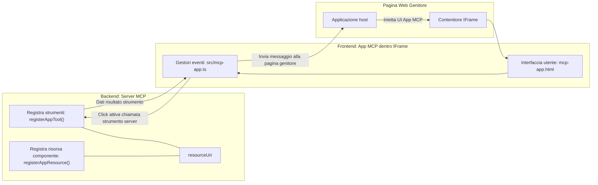
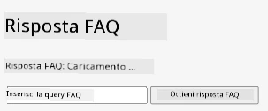
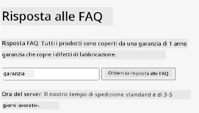
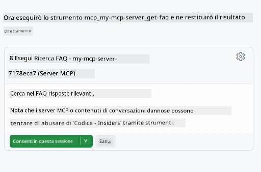
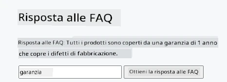

# MCP Apps

MCP Apps è un nuovo paradigma in MCP. L'idea è che non solo rispondi con dati da una chiamata a uno strumento, ma fornisci anche informazioni su come queste informazioni dovrebbero essere interagite. Ciò significa che i risultati dello strumento ora possono contenere informazioni sull'interfaccia utente. Ma perché dovremmo volere questo? Beh, considera come fai le cose oggi. Probabilmente stai consumando i risultati di un MCP Server mettendo qualche tipo di frontend davanti ad esso, quel codice che devi scrivere e mantenere. A volte è quello che vuoi, ma a volte sarebbe fantastico poter semplicemente portare un frammento di informazione che è autonomo e che ha tutto, dai dati all'interfaccia utente.

## Panoramica

Questa lezione fornisce indicazioni pratiche su MCP Apps, come iniziare con esse e come integrarle nelle tue Web App esistenti. MCP Apps è una aggiunta molto recente allo Standard MCP.

## Obiettivi di apprendimento

Al termine di questa lezione, sarai in grado di:

- Spiegare cosa sono le MCP Apps.
- Quando usare le MCP Apps.
- Costruire e integrare le tue MCP Apps.

## MCP Apps - come funziona

L'idea con MCP Apps è fornire una risposta che sia essenzialmente un componente da rendere. Tale componente può avere sia elementi visivi sia interattività, ad esempio clic sui pulsanti, input utente e altro. Iniziamo con il lato server e il nostro MCP Server. Per creare un componente MCP App devi creare uno strumento ma anche la risorsa dell'applicazione. Queste due parti sono collegate da un resourceUri. 

Ecco un esempio. Proviamo a visualizzare cosa è coinvolto e quali parti fanno cosa:

```text
server.ts -- responsible for registering tools and the component as a UI component
src/
  mcp-app.ts -- wiring up event handlers
mcp-app.html -- the user interface
```

Questa visualizzazione descrive l'architettura per creare un componente e la sua logica.


Proviamo a descrivere le responsabilità per backend e frontend rispettivamente.

### Il backend

Ci sono due cose che dobbiamo realizzare qui:

- Registrare gli strumenti con cui vogliamo interagire.
- Definire il componente. 

**Registrazione dello strumento**

```typescript
registerAppTool(
    server,
    "get-time",
    {
      title: "Get Time",
      description: "Returns the current server time.",
      inputSchema: {},
      _meta: { ui: { resourceUri } }, // Collega questo strumento alla sua risorsa UI
    },
    async () => {
      const time = new Date().toISOString();
      return { content: [{ type: "text", text: time }] };
    },
  );

```

Il codice precedente descrive il comportamento, dove espone uno strumento chiamato `get-time`. Non richiede input ma produce l'ora corrente. Abbiamo la possibilità di definire uno `inputSchema` per strumenti che devono accettare input utente.

**Registrazione del componente**

Nello stesso file, dobbiamo anche registrare il componente:

```typescript
const resourceUri = "ui://get-time/mcp-app.html";

// Registra la risorsa, che restituisce l'HTML/JavaScript incluso per l'interfaccia utente.
registerAppResource(
  server,
  resourceUri,
  resourceUri,
  { mimeType: RESOURCE_MIME_TYPE },
  async () => {
    const html = await fs.readFile(path.join(DIST_DIR, "mcp-app.html"), "utf-8");

    return {
    contents: [
        { uri: resourceUri, mimeType: RESOURCE_MIME_TYPE, text: html },
    ],
    };
  },
);
```

Nota come menzioniamo `resourceUri` per collegare il componente ai suoi strumenti. È interessante anche il callback dove carichiamo il file UI e ritorniamo il componente.

### Il frontend del componente

Proprio come il backend, ci sono due elementi qui:

- Un frontend scritto in puro HTML.
- Codice che gestisce eventi e cosa fare, ad esempio chiamare strumenti o inviare messaggi alla finestra padre.

**Interfaccia utente**

Diamo un’occhiata all’interfaccia utente.

```html
<!-- mcp-app.html -->
<!DOCTYPE html>
<html lang="en">
  <head>
    <meta charset="UTF-8" />
    <title>Get Time App</title>
  </head>
  <body>
    <p>
      <strong>Server Time:</strong> <code id="server-time">Loading...</code>
    </p>
    <button id="get-time-btn">Get Server Time</button>
    <script type="module" src="/src/mcp-app.ts"></script>
  </body>
</html>
```

**Collegamento degli eventi**

L'ultimo elemento è il collegamento degli eventi. Questo significa identificare quale parte della nostra UI ha bisogno di gestori di eventi e cosa fare se gli eventi si verificano:

```typescript
// mcp-app.ts

import { App } from "@modelcontextprotocol/ext-apps";

// Ottenere riferimenti agli elementi
const serverTimeEl = document.getElementById("server-time")!;
const getTimeBtn = document.getElementById("get-time-btn")!;

// Creare un'istanza dell'app
const app = new App({ name: "Get Time App", version: "1.0.0" });

// Gestire i risultati degli strumenti dal server. Impostare prima di `app.connect()` per evitare
// di perdere il risultato iniziale dello strumento.
app.ontoolresult = (result) => {
  const time = result.content?.find((c) => c.type === "text")?.text;
  serverTimeEl.textContent = time ?? "[ERROR]";
};

// Collegare il click del pulsante
getTimeBtn.addEventListener("click", async () => {
  // `app.callServerTool()` permette all'interfaccia utente di richiedere dati aggiornati dal server
  const result = await app.callServerTool({ name: "get-time", arguments: {} });
  const time = result.content?.find((c) => c.type === "text")?.text;
  serverTimeEl.textContent = time ?? "[ERROR]";
});

// Connettersi all'host
app.connect();
```

Come puoi vedere da sopra, questo è codice normale per collegare elementi DOM agli eventi. Vale la pena evidenziare la chiamata a `callServerTool` che finisce per chiamare uno strumento sul backend.

## Gestire l'input utente

Finora, abbiamo visto un componente che ha un pulsante che quando viene cliccato chiama uno strumento. Vediamo se possiamo aggiungere più elementi di UI come un campo di input e vedere se possiamo inviare argomenti a uno strumento. Implementiamo una funzionalità FAQ. Ecco come dovrebbe funzionare:

- Dovrebbe esserci un pulsante e un elemento di input dove l’utente digita una parola chiave per la ricerca, ad esempio "Shipping". Questo dovrebbe chiamare uno strumento sul backend che fa una ricerca nei dati FAQ.
- Uno strumento che supporta la ricerca FAQ menzionata.

Aggiungiamo prima il supporto necessario al backend:

```typescript
const faq: { [key: string]: string } = {
    "shipping": "Our standard shipping time is 3-5 business days.",
    "return policy": "You can return any item within 30 days of purchase.",
    "warranty": "All products come with a 1-year warranty covering manufacturing defects.",
  }

registerAppTool(
    server,
    "get-faq",
    {
      title: "Search FAQ",
      description: "Searches the FAQ for relevant answers.",
      inputSchema: zod.object({
        query: zod.string().default("shipping"),
      }),
      _meta: { ui: { resourceUri: faqResourceUri } }, // Collega questo strumento alla sua risorsa UI
    },
    async ({ query }) => {
      const answer: string = faq[query.toLowerCase()] || "Sorry, I don't have an answer for that.";
      return { content: [{ type: "text", text: answer }] };
    },
  );
```

Quello che vediamo qui è come popolare `inputSchema` e dargli uno schema `zod` così:

```typescript
inputSchema: zod.object({
  query: zod.string().default("shipping"),
})
```

Nello schema sopra dichiariamo di avere un parametro di input chiamato `query` e che è opzionale con un valore predefinito di "shipping". 

Ok, proseguiamo con *mcp-app.html* per vedere quale UI dobbiamo creare per questo:

```html
<div class="faq">
    <h1>FAQ response</h1>
    <p>FAQ Response: <code id="faq-response">Loading...</code></p>
    <input type="text" id="faq-query" placeholder="Enter FAQ query" />
    <button id="get-faq-btn">Get FAQ Response</button>
  </div>
```

Ottimo, ora abbiamo un elemento input e un pulsante. Andiamo ora a *mcp-app.ts* per collegare questi eventi:

```typescript
const getFaqBtn = document.getElementById("get-faq-btn")!;
const faqQueryInput = document.getElementById("faq-query") as HTMLInputElement;

getFaqBtn.addEventListener("click", async () => {
  const query = faqQueryInput.value;
  const result = await app.callServerTool({ name: "get-faq", arguments: { query } });
  const faq = result.content?.find((c) => c.type === "text")?.text;
  faqResponseEl.textContent = faq ?? "[ERROR]";
});
```

Nel codice sopra:

- Creiamo riferimenti agli elementi UI rilevanti.
- Gestiamo un clic sul pulsante per interpretare il valore dell’elemento input e chiamiamo anche `app.callServerTool()` con `name` e `arguments`, dove questi ultimi passano `query` come valore.

Quello che succede quando chiami `callServerTool` è che invia un messaggio alla finestra padre e quella finestra finisce per chiamare l’MCP Server.

### Provalo

Provandolo dovremmo ora vedere quanto segue:



e qui lo proviamo con un input come "warranty"



Per eseguire questo codice, vai alla [sezione Codice](./code/README.md)

## Testare in Visual Studio Code

Visual Studio Code offre un ottimo supporto per MVP Apps ed è probabilmente uno dei modi più semplici per testare le tue MCP Apps. Per usare Visual Studio Code, aggiungi una voce server a *mcp.json* così:

```json
"my-mcp-server-7178eca7": {
    "url": "http://localhost:3001/mcp",
    "type": "http"
  }
```

Poi avvia il server, dovresti poter comunicare con la tua MVP App attraverso la Finestra Chat a condizione che tu abbia installato GitHub Copilot.

attivandola tramite prompt, per esempio "#get-faq":



e proprio come quando l'hai eseguita tramite browser web, si rende nello stesso modo così:



## Compito

Crea un gioco carta-forbice-sasso. Dovrebbe consistere nei seguenti elementi:

UI:

- una lista a discesa con opzioni
- un pulsante per inviare una scelta
- un'etichetta che mostra chi ha scelto cosa e chi ha vinto

Server:

- deve avere uno strumento carta-forbice-sasso che prende "choice" come input. Deve anche mostrare la scelta del computer e determinare il vincitore

## Soluzione

[Soluzione](./assignment/README.md)

## Riassunto

Abbiamo appreso questo nuovo paradigma MCP Apps. È un nuovo modello che permette agli MCP Server di avere una propria opinione non solo sui dati ma anche su come questi dati dovrebbero essere presentati.

Inoltre, abbiamo imparato che queste MCP Apps sono ospitate in un IFrame e per comunicare con gli MCP Server devono inviare messaggi alla web app padre. Ci sono diverse librerie sia per JavaScript puro che React e altre che rendono questa comunicazione più semplice.

## Punti chiave

Ecco cosa hai imparato:

- MCP Apps è un nuovo standard che può essere utile quando vuoi spedire sia dati che funzionalità UI.
- Questi tipi di app girano in un IFrame per motivi di sicurezza.

## Cosa c’è dopo

- [Capitolo 4](../../04-PracticalImplementation/README.md)

---

<!-- CO-OP TRANSLATOR DISCLAIMER START -->
**Disclaimer**:
Questo documento è stato tradotto utilizzando il servizio di traduzione AI [Co-op Translator](https://github.com/Azure/co-op-translator). Pur impegnandoci per garantire precisione, si prega di considerare che le traduzioni automatiche possono contenere errori o inesattezze. Il documento originale nella sua lingua nativa deve essere considerato la fonte autorevole. Per informazioni critiche, si raccomanda la traduzione professionale umana. Non ci riteniamo responsabili per eventuali malintesi o interpretazioni errate derivanti dall’uso di questa traduzione.
<!-- CO-OP TRANSLATOR DISCLAIMER END -->