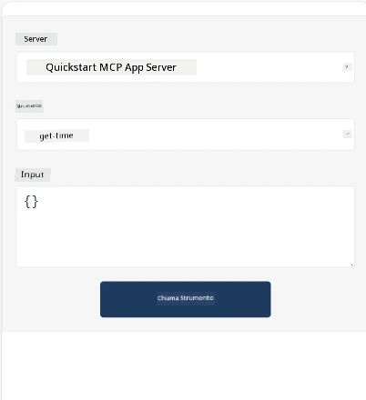
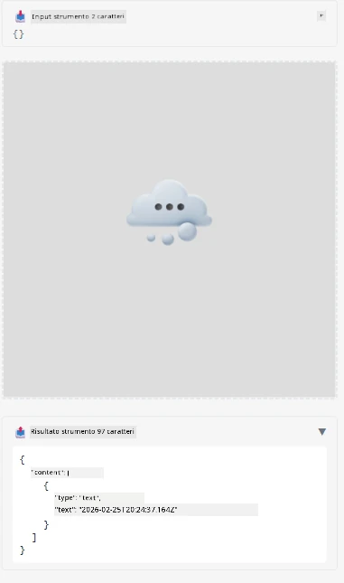

Ecco un esempio che mostra MCP App

## Installazione

1. Naviga nella cartella *mcp-app*
1. Esegui `npm install`, questo dovrebbe installare le dipendenze frontend e backend

Verifica che il backend compili eseguendo:

```sh
npx tsc --noEmit
```

Non dovrebbe esserci alcun output se tutto va bene.

## Avvia backend

> Questo richiede un po' di lavoro extra se sei su una macchina Windows poiché la soluzione MCP Apps utilizza la libreria `concurrently` che devi sostituire con un'alternativa. Ecco la linea incriminata in *package.json* sull'MCP App:

    ```json
    "start": "concurrently \"cross-env NODE_ENV=development INPUT=mcp-app.html vite build --watch\" \"tsx watch main.ts\""
    ```

Questa app ha due parti, una parte backend e una parte host.

Avvia il backend chiamando:

```sh
npm start
```

Questo dovrebbe avviare il backend su `http://localhost:3001/mcp`. 

> Nota, se sei in un Codespace, potresti dover impostare la visibilità della porta su pubblica. Controlla di poter raggiungere l'endpoint nel browser tramite https://<nome del Codespace>.app.github.dev/mcp

## Scelta -1 Prova l'app in Visual Studio Code

Per testare la soluzione in Visual Studio Code, fai quanto segue:

- Aggiungi una voce server a `mcp.json` come segue:

    ```json
    {
        "servers": {
            "my-mcp-server-7178eca7": {
                "url": "http://localhost:3001/mcp",
                "type": "http"
            }
        },
        "inputs": []
    }
    ```

1. Clicca sul pulsante "start" in *mcp.json*
1. Assicurati che una finestra di chat sia aperta e digita `get-faq`, dovresti vedere un risultato come il seguente:

    

## Scelta -2- Testa l'app con un host

Il repository <https://github.com/modelcontextprotocol/ext-apps> contiene diversi host che puoi usare per testare le tue MVP Apps.

Ti presenteremo qui due diverse opzioni:

### Macchina locale

- Naviga in *ext-apps* dopo aver clonato il repository.

- Installa le dipendenze

   ```sh
   npm install
   ```

- In una finestra terminale separata, naviga in *ext-apps/examples/basic-host*

    > se sei in Codespace, devi navigare a serve.ts alla riga 27 e sostituire http://localhost:3001/mcp con l'URL del tuo Codespace per il backend, quindi ad esempio https://psychic-xylophone-657rpjgvxpc5g64-3001.app.github.dev/mcp

- Avvia l'host:

    ```sh
    npm start
    ```

    Questo dovrebbe collegare l'host con il backend e dovresti vedere l'app in esecuzione così:

    

### Codespace

Serve un po' di lavoro extra per far funzionare un ambiente Codespace. Per usare un host tramite Codespace:

- Vai nella directory *ext-apps* e naviga in *examples/basic-host*.
- Esegui `npm install` per installare le dipendenze
- Esegui `npm start` per avviare l'host.

## Prova l'app

Prova l'app nel seguente modo:

- Seleziona il pulsante "Call Tool" e dovresti vedere risultati come il seguente:

    

Ottimo, tutto funziona.

---

<!-- CO-OP TRANSLATOR DISCLAIMER START -->
**Nota di non responsabilità**:  
Questo documento è stato tradotto utilizzando il servizio di traduzione automatica [Co-op Translator](https://github.com/Azure/co-op-translator). Sebbene ci impegniamo per garantire l’accuratezza, si prega di considerare che le traduzioni automatizzate possono contenere errori o inesattezze. Il documento originale nella sua lingua madre deve essere considerato la fonte autorevole. Per informazioni critiche, si raccomanda la traduzione professionale umana. Non siamo responsabili per eventuali malintesi o interpretazioni errate derivanti dall’uso di questa traduzione.
<!-- CO-OP TRANSLATOR DISCLAIMER END -->