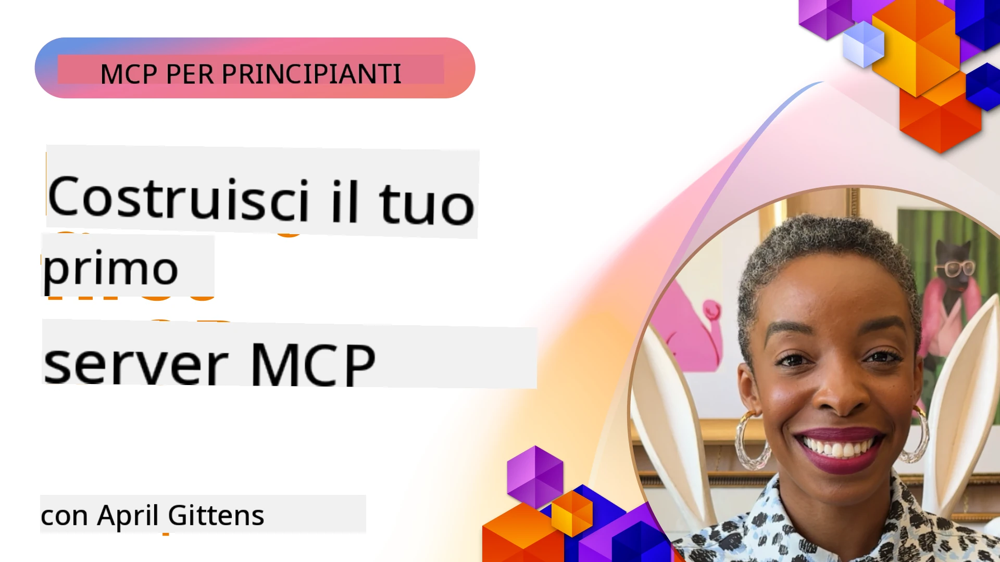

## Iniziare  

_(Clicca sull'immagine sopra per visualizzare il video di questa lezione)_

Questa sezione consiste in diverse lezioni:

- **1 Il tuo primo server**, in questa prima lezione, imparerai come creare il tuo primo server e ispezionarlo con lo strumento inspector, un modo prezioso per testare e fare il debug del tuo server, [alla lezione](01-first-server/README.md)

- **2 Client**, in questa lezione imparerai come scrivere un client che possa connettersi al tuo server, [alla lezione](02-client/README.md)

- **3 Client con LLM**, un modo ancora migliore di scrivere un client è aggiungervi un LLM così da poter "negoziare" con il tuo server cosa fare, [alla lezione](03-llm-client/README.md)

- **4 Consumo di un server in modalità Agente GitHub Copilot in Visual Studio Code**. Qui vediamo come eseguire il nostro server MCP da Visual Studio Code, [alla lezione](04-vscode/README.md)

- **5 Server di trasporto stdio** il trasporto stdio è lo standard raccomandato per la comunicazione locale server-client MCP, fornendo una comunicazione sicura basata su sottoprocesso con isolamento di processo incorporato [alla lezione](05-stdio-server/README.md)

- **6 Streaming HTTP con MCP (HTTP Trasmissibile)**. Impara lo streaming HTTP moderno (l'approccio raccomandato per server MCP remoti secondo [Specifiche MCP 2025-11-25](https://spec.modelcontextprotocol.io/specification/2025-11-25/basic/transports/#streamable-http)), notifiche di progresso, e come implementare server e client MCP scalabili e in tempo reale utilizzando HTTP Trasmissibile. [alla lezione](06-http-streaming/README.md)

- **7 Utilizzo del Toolkit AI per VSCode** per consumare e testare i tuoi Client e Server MCP [alla lezione](07-aitk/README.md)

- **8 Test**. Qui ci concentreremo soprattutto su come possiamo testare il nostro server e client in diversi modi, [alla lezione](08-testing/README.md)

- **9 Distribuzione**. Questo capitolo esamina diversi modi di distribuire le tue soluzioni MCP, [alla lezione](09-deployment/README.md)

- **10 Uso avanzato del server**. Questo capitolo copre l'uso avanzato del server, [alla lezione](./10-advanced/README.md)

- **11 Autenticazione**. Questo capitolo spiega come aggiungere semplici autenticazioni, dal Basic Auth all'uso di JWT e RBAC. Si consiglia di iniziare da qui e poi vedere gli Argomenti Avanzati nel Capitolo 5 e effettuare ulteriori rafforzamenti della sicurezza tramite le raccomandazioni nel Capitolo 2, [alla lezione](./11-simple-auth/README.md)

- **12 Host MCP**. Configura e usa popolari client host MCP, incluso Claude Desktop, Cursor, Cline, e Windsurf. Impara tipi di trasporto e risoluzione dei problemi, [alla lezione](./12-mcp-hosts/README.md)

- **13 MCP Inspector**. Fai il debug e testa i tuoi server MCP in modo interattivo usando lo strumento MCP Inspector. Impara a risolvere problemi di strumenti, risorse e messaggi di protocollo, [alla lezione](./13-mcp-inspector/README.md)

- **14 Campionamento**. Crea Server MCP che collaborano con client MCP su compiti correlati a LLM. [alla lezione](./14-sampling/README.md)

- **15 App MCP**. Costruisci Server MCP che rispondono anche con istruzioni UI, [alla lezione](./15-mcp-apps/README.md)

Il Model Context Protocol (MCP) è un protocollo aperto che standardizza come le applicazioni forniscono contesto agli LLM. Pensa a MCP come a una porta USB-C per applicazioni AI - fornisce un modo standardizzato per collegare modelli AI a diverse fonti di dati e strumenti.

## Obiettivi di Apprendimento

Al termine di questa lezione, sarai in grado di:

- Configurare ambienti di sviluppo per MCP in C#, Java, Python, TypeScript e JavaScript
- Costruire e distribuire server MCP base con funzionalità personalizzate (risorse, prompt e strumenti)
- Creare applicazioni host che si connettono ai server MCP
- Testare e fare il debug di implementazioni MCP
- Comprendere le sfide comuni di configurazione e le loro soluzioni
- Collegare le tue implementazioni MCP ai servizi LLM più popolari

## Preparare il tuo ambiente MCP

Prima di iniziare a lavorare con MCP, è importante preparare l'ambiente di sviluppo e comprendere il flusso di lavoro di base. Questa sezione ti guiderà attraverso i passaggi iniziali per assicurarti un inizio senza intoppi con MCP.

### Prerequisiti

Prima di immergerti nello sviluppo MCP, assicurati di avere:

- **Ambiente di sviluppo**: per il linguaggio scelto (C#, Java, Python, TypeScript o JavaScript)
- **IDE/Editor**: Visual Studio, Visual Studio Code, IntelliJ, Eclipse, PyCharm o qualsiasi editor di codice moderno
- **Gestori di pacchetti**: NuGet, Maven/Gradle, pip, o npm/yarn
- **Chiavi API**: per qualsiasi servizio AI che prevedi di usare nelle tue applicazioni host

### SDK Ufficiali

Nei capitoli successivi vedrai soluzioni costruite usando Python, TypeScript, Java e .NET. Qui trovi tutti gli SDK ufficialmente supportati.

MCP fornisce SDK ufficiali per più linguaggi (in linea con [Specifiche MCP 2025-11-25](https://spec.modelcontextprotocol.io/specification/2025-11-25/)):
- [SDK C#](https://github.com/modelcontextprotocol/csharp-sdk) - Mantenuto in collaborazione con Microsoft
- [SDK Java](https://github.com/modelcontextprotocol/java-sdk) - Mantenuto in collaborazione con Spring AI
- [SDK TypeScript](https://github.com/modelcontextprotocol/typescript-sdk) - Implementazione ufficiale TypeScript
- [SDK Python](https://github.com/modelcontextprotocol/python-sdk) - Implementazione ufficiale Python (FastMCP)
- [SDK Kotlin](https://github.com/modelcontextprotocol/kotlin-sdk) - Implementazione ufficiale Kotlin
- [SDK Swift](https://github.com/modelcontextprotocol/swift-sdk) - Mantenuto in collaborazione con Loopwork AI
- [SDK Rust](https://github.com/modelcontextprotocol/rust-sdk) - Implementazione ufficiale Rust
- [SDK Go](https://github.com/modelcontextprotocol/go-sdk) - Implementazione ufficiale Go

## Punti Chiave

- Configurare un ambiente di sviluppo MCP è semplice con gli SDK specifici per linguaggio
- Costruire server MCP implica creare e registrare strumenti con schemi chiari
- I client MCP si connettono a server e modelli per sfruttare capacità estese
- Testare e fare il debug sono essenziali per implementazioni MCP affidabili
- Le opzioni di distribuzione variano dallo sviluppo locale a soluzioni cloud-based

## Pratica

Abbiamo una serie di esempi che completano gli esercizi che vedrai in tutti i capitoli di questa sezione. Inoltre ogni capitolo ha i propri esercizi e compiti

- [Calcolatrice Java](./samples/java/calculator/README.md)
- [Calcolatrice .Net](../../../03-GettingStarted/samples/csharp)
- [Calcolatrice JavaScript](./samples/javascript/README.md)
- [Calcolatrice TypeScript](./samples/typescript/README.md)
- [Calcolatrice Python](../../../03-GettingStarted/samples/python)

## Risorse Aggiuntive

- [Costruire agenti usando Model Context Protocol su Azure](https://learn.microsoft.com/azure/developer/ai/intro-agents-mcp)
- [MCP remoto con Azure Container Apps (Node.js/TypeScript/JavaScript)](https://learn.microsoft.com/samples/azure-samples/mcp-container-ts/mcp-container-ts/)
- [Agente MCP OpenAI .NET](https://learn.microsoft.com/samples/azure-samples/openai-mcp-agent-dotnet/openai-mcp-agent-dotnet/)

## Cosa c'è dopo

Inizia con la prima lezione: [Creare il tuo primo server MCP](01-first-server/README.md)

Una volta completato questo modulo, continua con: [Modulo 4: Implementazione pratica](../04-PracticalImplementation/README.md)

---

<!-- CO-OP TRANSLATOR DISCLAIMER START -->
**Disclaimer**:  
Questo documento è stato tradotto utilizzando il servizio di traduzione automatica [Co-op Translator](https://github.com/Azure/co-op-translator). Pur impegnandoci per garantire l’accuratezza, si prega di notare che le traduzioni automatiche possono contenere errori o imprecisioni. Il documento originale nella sua lingua nativa deve essere considerato la fonte autorevole. Per informazioni critiche si consiglia la traduzione professionale effettuata da un essere umano. Non ci assumiamo alcuna responsabilità per eventuali malintesi o interpretazioni errate derivanti dall’uso di questa traduzione.
<!-- CO-OP TRANSLATOR DISCLAIMER END -->