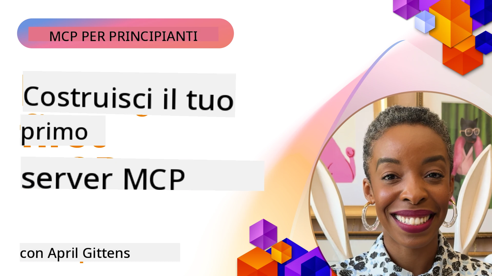

## Iniziare  

_(Clicca sull'immagine sopra per vedere il video di questa lezione)_

Questa sezione è composta da diverse lezioni:

- **1 Il tuo primo server**, in questa prima lezione, imparerai come creare il tuo primo server e ispezionarlo con lo strumento inspector, un modo prezioso per testare e fare il debug del tuo server, [alla lezione](01-first-server/README.md)

- **2 Client**, in questa lezione, imparerai come scrivere un client che può connettersi al tuo server, [alla lezione](02-client/README.md)

- **3 Client con LLM**, un modo ancora migliore per scrivere un client è aggiungervi un LLM così che possa "negoziare" con il tuo server cosa fare, [alla lezione](03-llm-client/README.md)

- **4 Utilizzo di un agente GitHub Copilot per il server in Visual Studio Code**. Qui vediamo come eseguire il nostro server MCP all’interno di Visual Studio Code, [alla lezione](04-vscode/README.md)

- **5 Server di trasporto stdio** il trasporto stdio è lo standard raccomandato per la comunicazione locale tra server MCP e client, offrendo una comunicazione sicura basata su subprocess con isolamento del processo integrato [alla lezione](05-stdio-server/README.md)

- **6 Streaming HTTP con MCP (HTTP Streamable)**. Impara il trasporto remoto standard in 
	[MCP Specification 2026-07-28](https://modelcontextprotocol.io/specification/2026-07-28/basic/transports/streamable-http),
	oltre all'implementazione legacy basata sulla sessione mantenuta nella lezione.
	[alla lezione](06-http-streaming/README.md)

- **7 Utilizzo del Toolkit AI per VSCode** per consumare e testare i tuoi Client e Server MCP [alla lezione](07-aitk/README.md)

- **8 Testing**. Qui ci concentreremo in particolare su come testare il nostro server e client in diversi modi, [alla lezione](08-testing/README.md)

- **9 Distribuzione**. Questo capitolo esamina diversi modi per distribuire le tue soluzioni MCP, [alla lezione](09-deployment/README.md)

- **10 Uso avanzato del server**. Questo capitolo tratta l'uso avanzato del server, [alla lezione](./10-advanced/README.md)

- **11 Autenticazione**. Questo capitolo tratta come aggiungere una semplice autenticazione, da Basic Auth all'uso di JWT e RBAC. Ti consigliamo di iniziare qui e poi di guardare gli Argomenti Avanzati nel Capitolo 5 e di eseguire un ulteriore rafforzamento della sicurezza tramite le raccomandazioni nel Capitolo 2, [alla lezione](./11-simple-auth/README.md)

- **12 Host MCP**. Configura e usa popolari client host MCP inclusi Claude Desktop, Cursor, Cline e Windsurf. Impara i tipi di trasporto e come risolvere problemi, [alla lezione](./12-mcp-hosts/README.md)

- **13 MCP Inspector**. Esegui il debug e testa i tuoi server MCP in modo interattivo utilizzando lo strumento MCP Inspector. Impara a risolvere problemi con strumenti, risorse e messaggi di protocollo, [alla lezione](./13-mcp-inspector/README.md)

- **14 Campionamento**. Impara il primitivo legacy di Campionamento per `2025-11-25` e
	come migrare i nuovi design all'integrazione diretta con provider LLM. Il campionamento è
	deprecato in MCP `2026-07-28`. [alla lezione](./14-sampling/README.md)

- **15 App MCP**. Costruisci Server MCP che rispondono anche con istruzioni UI, [alla lezione](./15-mcp-apps/README.md)

Il Model Context Protocol (MCP) è un protocollo aperto che standardizza come le applicazioni forniscono contesto agli LLM. Pensa a MCP come a una porta USB-C per applicazioni AI - fornisce un modo standardizzato per collegare modelli AI a diverse fonti di dati e strumenti.

## Obiettivi di Apprendimento

Alla fine di questa lezione, sarai in grado di:

- Configurare ambienti di sviluppo per MCP in C#, Java, Python, TypeScript e JavaScript
- Costruire e distribuire server MCP di base con funzionalità personalizzate (risorse, prompt e strumenti)
- Creare applicazioni host che si connettono a server MCP
- Testare e fare il debug delle implementazioni MCP
- Comprendere le sfide comuni di configurazione e le loro soluzioni
- Collegare le tue implementazioni MCP a servizi LLM popolari

## Configurare il tuo ambiente MCP

Prima di iniziare a lavorare con MCP, è importante preparare il tuo ambiente di sviluppo e comprendere il flusso di lavoro di base. Questa sezione ti guiderà attraverso i passaggi iniziali per assicurarti un avvio senza intoppi con MCP.

### Prerequisiti

Prima di immergerti nello sviluppo MCP, assicurati di avere:

- **Ambiente di sviluppo**: per il linguaggio scelto (C#, Java, Python, TypeScript o JavaScript)
- **IDE/Editor**: Visual Studio, Visual Studio Code, IntelliJ, Eclipse, PyCharm o qualsiasi editor di codice moderno
- **Gestori di pacchetti**: NuGet, Maven/Gradle, pip o npm/yarn
- **Chiavi API**: per qualsiasi servizio AI che intendi utilizzare nelle tue applicazioni host

### SDK Ufficiali

Nei capitoli successivi vedrai soluzioni costruite usando Python, TypeScript,
Java e .NET. Ecco gli SDK ufficiali.

Il supporto SDK per MCP `2026-07-28` viene rilasciato indipendentemente per ogni linguaggio.
Prima di eseguire un esempio, controlla la versione del pacchetto e le note di rilascio dell'SDK
per le revisioni del protocollo supportate. Vedi la
[lista ufficiale degli SDK](https://modelcontextprotocol.io/docs/sdk):
- [SDK C#](https://github.com/modelcontextprotocol/csharp-sdk) - Mantenuto in collaborazione con Microsoft
- [SDK Java](https://github.com/modelcontextprotocol/java-sdk) - Mantenuto in collaborazione con Spring AI
- [SDK TypeScript](https://github.com/modelcontextprotocol/typescript-sdk) - L'implementazione ufficiale TypeScript
- [SDK Python](https://github.com/modelcontextprotocol/python-sdk) - L'implementazione ufficiale Python (FastMCP)
- [SDK Kotlin](https://github.com/modelcontextprotocol/kotlin-sdk) - L'implementazione ufficiale Kotlin
- [SDK Swift](https://github.com/modelcontextprotocol/swift-sdk) - Mantenuto in collaborazione con Loopwork AI
- [SDK Rust](https://github.com/modelcontextprotocol/rust-sdk) - L'implementazione ufficiale Rust
- [SDK Go](https://github.com/modelcontextprotocol/go-sdk) - L'implementazione ufficiale Go

## Punti Chiave

- Configurare un ambiente di sviluppo MCP è semplice con SDK specifici per linguaggio
- Costruire server MCP comporta la creazione e la registrazione di strumenti con schemi chiari
- I client MCP si connettono a server e modelli per sfruttare funzionalità estese
- Testare e fare il debug sono essenziali per implementazioni MCP affidabili
- Le opzioni di distribuzione variano dallo sviluppo locale a soluzioni basate su cloud

## Pratica

Abbiamo una serie di esempi che completano gli esercizi che vedrai in tutti i capitoli di questa sezione. Inoltre, ogni capitolo ha anche i propri esercizi e compiti

- [Calcolatrice Java](./samples/java/calculator/README.md)
- [Calcolatrice .NET](../../../03-GettingStarted/samples/csharp)
- [Calcolatrice JavaScript](./samples/javascript/README.md)
- [Calcolatrice TypeScript](./samples/typescript/README.md)
- [Calcolatrice Python](../../../03-GettingStarted/samples/python)

## Risorse aggiuntive

- [Costruisci agenti usando il Model Context Protocol su Azure](https://learn.microsoft.com/azure/developer/ai/intro-agents-mcp)
- [MCP remoto con Azure Container Apps (Node.js/TypeScript/JavaScript)](https://learn.microsoft.com/samples/azure-samples/mcp-container-ts/mcp-container-ts/)
- [Agente MCP OpenAI .NET](https://learn.microsoft.com/samples/azure-samples/openai-mcp-agent-dotnet/openai-mcp-agent-dotnet/)

## Cosa c'è dopo

Inizia con la prima lezione: [Creare il tuo primo server MCP](01-first-server/README.md)

Una volta completato questo modulo, continua con: [Modulo 4: Implementazione pratica](../04-PracticalImplementation/README.md)

---

<!-- CO-OP TRANSLATOR DISCLAIMER START -->
**Disclaimer**:
Questo documento è stato tradotto utilizzando il servizio di traduzione AI [Co-op Translator](https://github.com/Azure/co-op-translator). Sebbene ci impegniamo per garantire la precisione, si prega di notare che le traduzioni automatizzate possono contenere errori o imprecisioni. Il documento originale nella sua lingua nativa deve essere considerato la fonte autorevole. Per informazioni critiche, si raccomanda una traduzione professionale effettuata da un essere umano. Non siamo responsabili per eventuali malintesi o interpretazioni errate derivanti dall’uso di questa traduzione.
<!-- CO-OP TRANSLATOR DISCLAIMER END -->