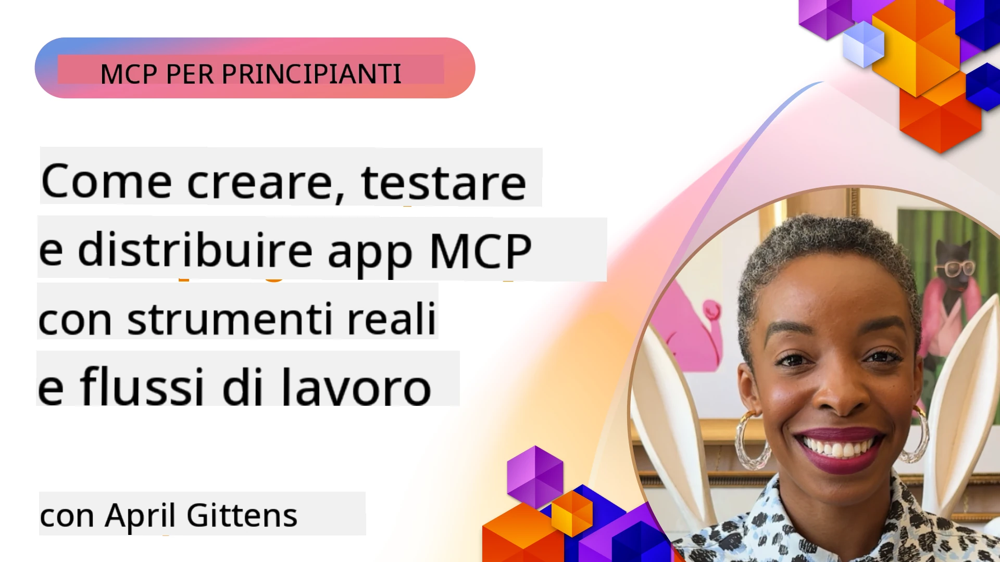
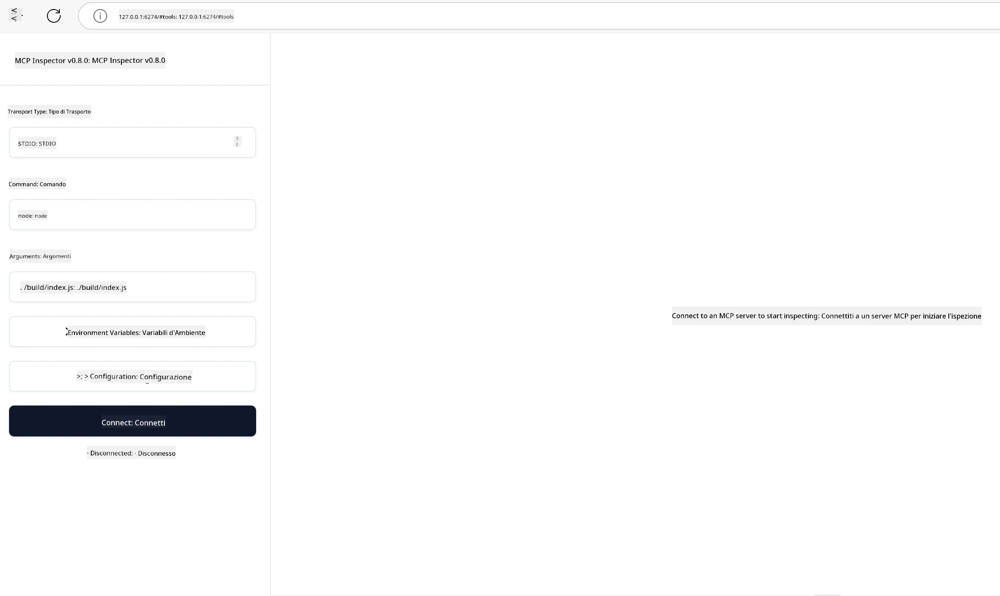

# Implementazione Pratica

[](https://youtu.be/vCN9-mKBDfQ)

_(Clicca sull'immagine sopra per vedere il video di questa lezione)_

L'implementazione pratica è il momento in cui la potenza del Model Context Protocol (MCP) diventa tangibile. Sebbene comprendere la teoria e l'architettura alla base di MCP sia importante, il vero valore emerge quando applichi questi concetti per costruire, testare e distribuire soluzioni che risolvono problemi del mondo reale. Questo capitolo colma il divario tra conoscenza concettuale e sviluppo pratico, guidandoti attraverso il processo di realizzazione di applicazioni basate su MCP.

Che tu stia sviluppando assistenti intelligenti, integrando l'IA nei flussi di lavoro aziendali o costruendo strumenti personalizzati per l'elaborazione dei dati, MCP fornisce una base flessibile. Il suo design indipendente dal linguaggio e gli SDK ufficiali per linguaggi di programmazione popolari lo rendono accessibile a una vasta gamma di sviluppatori. Sfruttando questi SDK, puoi rapidamente prototipare, iterare e scalare le tue soluzioni su diverse piattaforme e ambienti.

Nelle sezioni seguenti troverai esempi pratici, codice di esempio e strategie di distribuzione che mostrano come implementare MCP in C#, Java con Spring, TypeScript, JavaScript e Python. Imparerai anche come eseguire il debug e testare i tuoi server MCP, gestire API e distribuire soluzioni nel cloud usando Azure. Queste risorse pratiche sono progettate per accelerare il tuo apprendimento e aiutarti a costruire con sicurezza applicazioni MCP robuste e pronte per la produzione.

## Panoramica

Questa lezione si concentra sugli aspetti pratici dell'implementazione MCP in più linguaggi di programmazione. Esploreremo come usare gli SDK MCP in C#, Java con Spring, TypeScript, JavaScript e Python per costruire applicazioni robuste, eseguire il debug e testare server MCP, e creare risorse, prompt e strumenti riutilizzabili.

## Obiettivi di Apprendimento

Al termine di questa lezione sarai in grado di:

- Implementare soluzioni MCP utilizzando gli SDK ufficiali in vari linguaggi di programmazione
- Eseguire il debug e testare sistematicamente i server MCP
- Creare e utilizzare funzionalità del server (Risorse, Prompt e Strumenti)
- Progettare flussi di lavoro MCP efficaci per compiti complessi
- Ottimizzare le implementazioni MCP per prestazioni e affidabilità

## Risorse SDK Ufficiali

Il Model Context Protocol offre SDK ufficiali per diversi linguaggi (allineati alla [Specificazione MCP 2025-11-25](https://spec.modelcontextprotocol.io/specification/2025-11-25/)):

- [SDK C#](https://github.com/modelcontextprotocol/csharp-sdk)
- [SDK Java con Spring](https://github.com/modelcontextprotocol/java-sdk) **Nota:** richiede dipendenza da [Project Reactor](https://projectreactor.io). (Vedi [discussione issue 246](https://github.com/orgs/modelcontextprotocol/discussions/246).)
- [SDK TypeScript](https://github.com/modelcontextprotocol/typescript-sdk)
- [SDK Python](https://github.com/modelcontextprotocol/python-sdk)
- [SDK Kotlin](https://github.com/modelcontextprotocol/kotlin-sdk)
- [SDK Go](https://github.com/modelcontextprotocol/go-sdk)

## Lavorare con gli SDK MCP

Questa sezione fornisce esempi pratici di implementazione MCP in più linguaggi di programmazione. Puoi trovare codice di esempio nella directory `samples` organizzata per linguaggio.

### Esempi Disponibili

Il repository include [implementazioni di esempio](../../../04-PracticalImplementation/samples) nei seguenti linguaggi:

- [C#](./samples/csharp/README.md)
- [Java con Spring](./samples/java/containerapp/README.md)
- [TypeScript](./samples/typescript/README.md)
- [JavaScript](./samples/javascript/README.md)
- [Python](./samples/python/README.md)

Ogni esempio dimostra concetti chiave e pattern di implementazione MCP per quel particolare linguaggio ed ecosistema.

### Guide Pratiche

Guide aggiuntive per l'implementazione pratica MCP:

- [Paginazione e Set di Risultati Estesi](./pagination/README.md) - Gestire la paginazione basata su cursori per strumenti, risorse e grandi insiemi di dati

## Funzionalità Core del Server

I server MCP possono implementare qualsiasi combinazione di queste funzionalità:

### Risorse

Le risorse forniscono contesto e dati da usare per l'utente o il modello AI:

- Repository di documenti
- Basi di conoscenza
- Fonti di dati strutturati
- File system

### Prompt

I prompt sono messaggi e flussi di lavoro templati per gli utenti:

- Template di conversazione predefiniti
- Modelli di interazione guidata
- Strutture di dialogo specializzate

### Strumenti

Gli strumenti sono funzioni da eseguire per il modello AI:

- Utility di elaborazione dati
- Integrazioni API esterne
- Capacità computazionali
- Funzionalità di ricerca

## Esempi di Implementazioni: Implementazione C#

Il repository ufficiale dell'SDK C# contiene diverse implementazioni di esempio che mostrano diversi aspetti di MCP:

- **Client MCP Base**: Esempio semplice che mostra come creare un client MCP e chiamare strumenti
- **Server MCP Base**: Implementazione minimale del server con registrazione base degli strumenti
- **Server MCP Avanzato**: Server completo con registrazione degli strumenti, autenticazione e gestione degli errori
- **Integrazione ASP.NET**: Esempi che mostrano l'integrazione con ASP.NET Core
- **Pattern di Implementazione Strumenti**: Vari pattern per implementare strumenti con diversi livelli di complessità

L'SDK MCP C# è in anteprima e le API potrebbero cambiare. Aggiorneremo continuamente questo blog man mano che l’SDK evolve.

### Caratteristiche Principali

- [C# MCP Nuget ModelContextProtocol](https://www.nuget.org/packages/ModelContextProtocol)
- Costruire il tuo [primo Server MCP](https://devblogs.microsoft.com/dotnet/build-a-model-context-protocol-mcp-server-in-csharp/).

Per esempi completi di implementazione C#, visita il [repository ufficiale degli esempi SDK C#](https://github.com/modelcontextprotocol/csharp-sdk)

## Esempio di implementazione: Java con Spring

L'SDK Java con Spring offre opzioni robuste per l'implementazione MCP con funzionalità di livello enterprise.

### Caratteristiche Principali

- Integrazione con Spring Framework
- Forte tipizzazione
- Supporto per programmazione reattiva
- Gestione completa degli errori

Per un esempio completo di implementazione Java con Spring, consulta il [campione Java con Spring](samples/java/containerapp/README.md) nella directory dei campioni.

## Esempio di implementazione: JavaScript

L'SDK JavaScript offre un approccio leggero e flessibile all'implementazione MCP.

### Caratteristiche Principali

- Supporto Node.js e browser
- API basata su Promise
- Facile integrazione con Express e altri framework
- Supporto WebSocket per streaming

Per un esempio completo di implementazione JavaScript, consulta il [campione JavaScript](samples/javascript/README.md) nella directory dei campioni.

## Esempio di implementazione: Python

L'SDK Python offre un approccio pythonico all'implementazione MCP con eccellenti integrazioni per framework ML.

### Caratteristiche Principali

- Supporto async/await con asyncio
- Integrazione FastAPI
- Registrazione semplice degli strumenti
- Integrazione nativa con librerie ML popolari

Per un esempio completo di implementazione Python, consulta il [campione Python](samples/python/README.md) nella directory dei campioni.

## Gestione delle API

Azure API Management è una grande soluzione per come possiamo mettere in sicurezza i Server MCP. L'idea è mettere un'istanza di Azure API Management davanti al tuo Server MCP e lasciargli gestire funzionalità come:

- limitazione della velocità
- gestione token
- monitoraggio
- bilanciamento del carico
- sicurezza

### Esempio Azure

Ecco un esempio Azure che fa esattamente questo, cioè [creare un Server MCP e metterlo in sicurezza con Azure API Management](https://github.com/Azure-Samples/remote-mcp-apim-functions-python).

Guarda come avviene il flusso di autorizzazione nell'immagine qui sotto:


Nell'immagine precedente avvengono:

- Autenticazione/Autorizzazione tramite Microsoft Entra.
- Azure API Management agisce come gateway e usa policy per indirizzare e gestire il traffico.
- Azure Monitor registra tutte le richieste per analisi successive.

#### Flusso di autorizzazione

Esaminiamo più nel dettaglio il flusso di autorizzazione:


#### Specifica autorizzazione MCP

Scopri di più sulla [specifica di autorizzazione MCP](https://spec.modelcontextprotocol.io/specification/2025-11-25/basic/authorization/)

## Distribuire Server MCP Remoto su Azure

Vediamo se possiamo distribuire l'esempio menzionato prima:

1. Clona il repository

    ```bash
    git clone https://github.com/Azure-Samples/remote-mcp-apim-functions-python.git
    cd remote-mcp-apim-functions-python
    ```

1. Registra il provider di risorse `Microsoft.App`.

   - Se usi Azure CLI, esegui `az provider register --namespace Microsoft.App --wait`.
   - Se usi Azure PowerShell, esegui `Register-AzResourceProvider -ProviderNamespace Microsoft.App`. Poi esegui `(Get-AzResourceProvider -ProviderNamespace Microsoft.App).RegistrationState` dopo un po' per verificare se la registrazione è completa.

1. Esegui questo comando [azd](https://aka.ms/azd) per fornire il servizio di gestione API, l'app funzione (con codice) e tutte le altre risorse Azure necessarie

    ```shell
    azd up
    ```

    Questo comando dovrebbe distribuire tutte le risorse cloud su Azure

### Testare il tuo server con MCP Inspector

1. In una **nuova finestra del terminale**, installa ed esegui MCP Inspector

    ```shell
    npx @modelcontextprotocol/inspector
    ```

    Dovresti vedere un'interfaccia simile a:

    

1. CTRL clic per caricare l'app web MCP Inspector dall'URL mostrato dall'app (es. [http://127.0.0.1:6274/#resources](http://127.0.0.1:6274/#resources))
1. Imposta il tipo di trasporto su `SSE`
1. Imposta l'URL al tuo endpoint SSE di API Management in esecuzione mostrato dopo `azd up` e **Connetti**:

    ```shell
    https://<apim-servicename-from-azd-output>.azure-api.net/mcp/sse
    ```

1. **Elenca Strumenti**. Clicca su uno strumento e **Esegui Strumento**.  

Se tutti i passaggi sono andati a buon fine, ora sei connesso al server MCP e sei riuscito a chiamare uno strumento.

## Server MCP per Azure

[Remote-mcp-functions](https://github.com/Azure-Samples/remote-mcp-functions-dotnet): Questo insieme di repository è un modello quickstart per costruire e distribuire server MCP remoti personalizzati (Model Context Protocol) usando Azure Functions con Python, C# .NET o Node/TypeScript.

I campioni forniscono una soluzione completa che consente agli sviluppatori di:

- Costruire ed eseguire localmente: sviluppare e fare debug di un server MCP su una macchina locale
- Distribuire su Azure: distribuire facilmente sul cloud con un semplice comando azd up
- Connettersi da client: connettersi al server MCP da vari client inclusi la modalità agente Copilot di VS Code e lo strumento MCP Inspector

### Caratteristiche Principali

- Sicurezza by design: il server MCP è messo in sicurezza usando chiavi e HTTPS
- Opzioni di autenticazione: supporta OAuth usando autenticazione incorporata e/o API Management
- Isolamento di rete: permette isolamento di rete usando Azure Virtual Networks (VNET)
- Architettura serverless: sfrutta Azure Functions per esecuzione scalabile e basata su eventi
- Sviluppo locale: supporto completo per sviluppo e debug locale
- Distribuzione semplice: processo di distribuzione snello su Azure

Il repository include tutti i file di configurazione necessari, codice sorgente e definizioni infrastrutturali per iniziare rapidamente con un’implementazione server MCP pronta per la produzione.

- [Azure Remote MCP Functions Python](https://github.com/Azure-Samples/remote-mcp-functions-python) - Esempio implementazione MCP usando Azure Functions con Python

- [Azure Remote MCP Functions .NET](https://github.com/Azure-Samples/remote-mcp-functions-dotnet) - Esempio implementazione MCP usando Azure Functions con C# .NET

- [Azure Remote MCP Functions Node/Typescript](https://github.com/Azure-Samples/remote-mcp-functions-typescript) - Esempio implementazione MCP usando Azure Functions con Node/TypeScript.

## Punti Chiave

- Gli SDK MCP forniscono strumenti specifici per linguaggio per implementare soluzioni MCP robuste
- Il processo di debug e testing è critico per applicazioni MCP affidabili
- Template di prompt riutilizzabili permettono interazioni AI coerenti
- Flussi di lavoro ben progettati possono orchestrare compiti complessi usando più strumenti
- Implementare soluzioni MCP richiede considerare sicurezza, prestazioni e gestione degli errori

## Esercizio

Progetta un flusso di lavoro MCP pratico che affronti un problema reale nel tuo dominio:

1. Identifica 3-4 strumenti che sarebbero utili per risolvere questo problema
2. Crea un diagramma di flusso che mostri come questi strumenti interagiscono
3. Implementa una versione base di uno degli strumenti usando il tuo linguaggio preferito
4. Crea un template prompt che aiuti il modello a usare efficacemente il tuo strumento

## Risorse Aggiuntive

---

## Cosa c’è dopo

Prossimo: [Argomenti Avanzati](../05-AdvancedTopics/README.md)

---

<!-- CO-OP TRANSLATOR DISCLAIMER START -->
**Disclaimer**:  
Questo documento è stato tradotto utilizzando il servizio di traduzione automatica AI [Co-op Translator](https://github.com/Azure/co-op-translator). Pur impegnandoci per garantire l’accuratezza, si prega di notare che le traduzioni automatiche possono contenere errori o inesattezze. Il documento originale nella sua lingua nativa deve essere considerato la fonte autorevole. Per informazioni importanti, si consiglia una traduzione professionale umana. Non ci assumiamo alcuna responsabilità per eventuali malintesi o interpretazioni errate derivanti dall’uso di questa traduzione.
<!-- CO-OP TRANSLATOR DISCLAIMER END -->