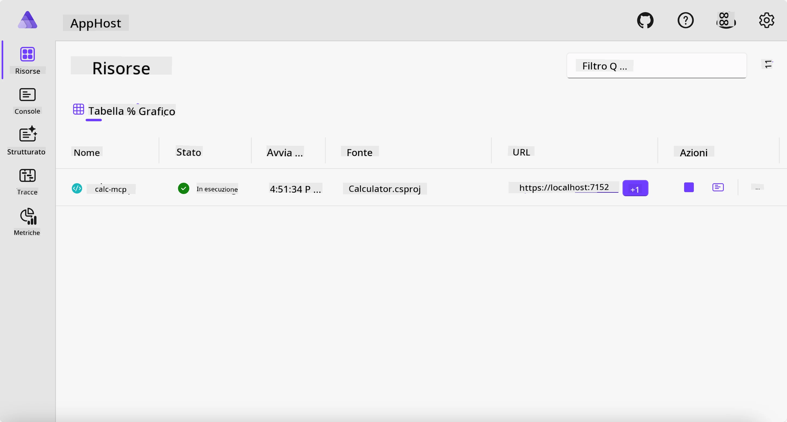
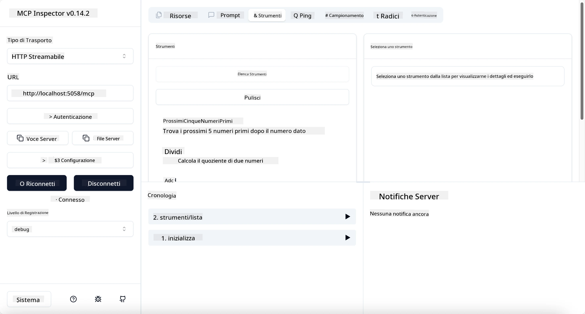
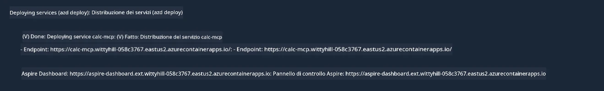

# Esempio

L'esempio precedente mostra come utilizzare un progetto .NET locale con il tipo `stdio`. E come eseguire il server localmente in un contenitore. Questa è una buona soluzione in molte situazioni. Tuttavia, può essere utile avere il server in esecuzione da remoto, come in un ambiente cloud. Qui entra in gioco il tipo `http`.

Guardando la soluzione nella cartella `04-PracticalImplementation`, può sembrare molto più complessa rispetto alla precedente. Ma in realtà non lo è. Se si guarda attentamente il progetto `src/Calculator`, si vedrà che è perlopiù lo stesso codice dell'esempio precedente. L'unica differenza è che utilizziamo una libreria diversa, `ModelContextProtocol.AspNetCore`, per gestire le richieste HTTP. E modifichiamo il metodo `IsPrime` rendendolo privato, solo per mostrare che è possibile avere metodi privati nel proprio codice. Il resto del codice è uguale a prima.

Gli altri progetti provengono da [Aspire](https://aspire.dev/get-started/what-is-aspire/). Avere Aspire nella soluzione migliorerà l'esperienza dello sviluppatore durante lo sviluppo e il testing e aiuterà con l'osservabilità. Non è necessario per eseguire il server, ma è una buona pratica averlo nella propria soluzione.

## Avviare il server localmente

1. Da VS Code (con l'estensione C# DevKit), navigare nella directory `04-PracticalImplementation/samples/csharp`.
1. Eseguire il seguente comando per avviare il server:

   ```bash
    dotnet watch run --project ./src/AppHost
   ```

1. Quando un browser apre il dashboard di Aspire, annotare l'URL `http`. Dovrebbe essere qualcosa come `http://localhost:5058/`.

   

## Testare Streamable HTTP con MCP Inspector

Se hai Node.js 22.7.5 o versioni successive, puoi usare MCP Inspector per testare il tuo server.

Avvia il server ed esegui il seguente comando in un terminale:

```bash
npx @modelcontextprotocol/inspector http://localhost:5058
```



- Seleziona il tipo di Trasporto `Streamable HTTP`.
- Nel campo Url, inserisci l'URL del server annotato prima, e aggiungi `/mcp`. Dovrebbe essere `http` (non `https`), qualcosa come `http://localhost:5058/mcp`.
- seleziona il pulsante Connetti.

Una cosa bella dell'Inspector è che offre una buona visibilità su ciò che sta accadendo.

- Prova a elencare gli strumenti disponibili
- Prova alcuni di essi, dovrebbero funzionare come prima.

## Testare MCP Server con GitHub Copilot Chat in VS Code

Per usare il trasporto Streamable HTTP con GitHub Copilot Chat, modifica la configurazione del server `calc-mcp` creato prima in questo modo:

```jsonc
// .vscode/mcp.json
{
  "servers": {
    "calc-mcp": {
      "type": "http",
      "url": "http://localhost:5058/mcp"
    }
  }
}
```

Fai qualche test:

- Chiedi "3 numeri primi dopo 6780". Nota come Copilot userà i nuovi strumenti `NextFivePrimeNumbers` e restituisce solo i primi 3 numeri primi.
- Chiedi "7 numeri primi dopo 111", per vedere cosa succede.
- Chiedi "John ha 24 lecca-lecca e vuole distribuirli tutti ai suoi 3 figli. Quanti lecca-lecca ha ciascun figlio?", per vedere cosa succede.

## Distribuire il server su Azure

Distribuiamo il server su Azure affinché più persone possano usarlo.

Da un terminale, naviga nella cartella `04-PracticalImplementation/samples/csharp` ed esegui il seguente comando:

```bash
azd up
```

Una volta finita la distribuzione, dovresti vedere un messaggio simile a questo:



Prendi l'URL e usalo in MCP Inspector e in GitHub Copilot Chat.

```jsonc
// .vscode/mcp.json
{
  "servers": {
    "calc-mcp": {
      "type": "http",
      "url": "https://calc-mcp.gentleriver-3977fbcf.australiaeast.azurecontainerapps.io/mcp"
    }
  }
}
```

## Cosa c'è dopo?

Abbiamo provato diversi tipi di trasporto e strumenti di test. Abbiamo anche distribuito il tuo server MCP su Azure. Ma cosa succede se il nostro server ha bisogno di accedere a risorse private? Per esempio, un database o un'API privata? Nel prossimo capitolo, vedremo come possiamo migliorare la sicurezza del nostro server.

---

<!-- CO-OP TRANSLATOR DISCLAIMER START -->
**Disclaimer**:
Questo documento è stato tradotto utilizzando il servizio di traduzione AI [Co-op Translator](https://github.com/Azure/co-op-translator). Sebbene ci impegniamo per garantire la precisione, si prega di notare che le traduzioni automatizzate possono contenere errori o imprecisioni. Il documento originale nella sua lingua nativa deve essere considerato la fonte autorevole. Per informazioni critiche, si raccomanda una traduzione professionale effettuata da un essere umano. Non siamo responsabili per eventuali malintesi o interpretazioni errate derivanti dall’uso di questa traduzione.
<!-- CO-OP TRANSLATOR DISCLAIMER END -->